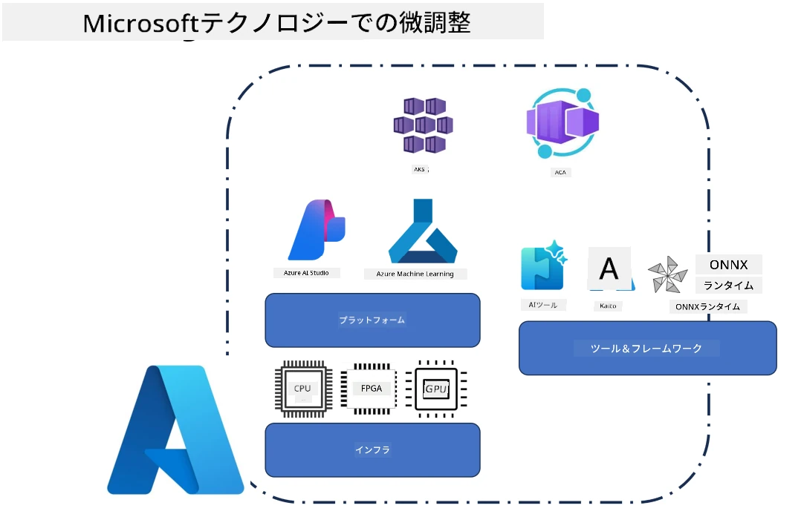
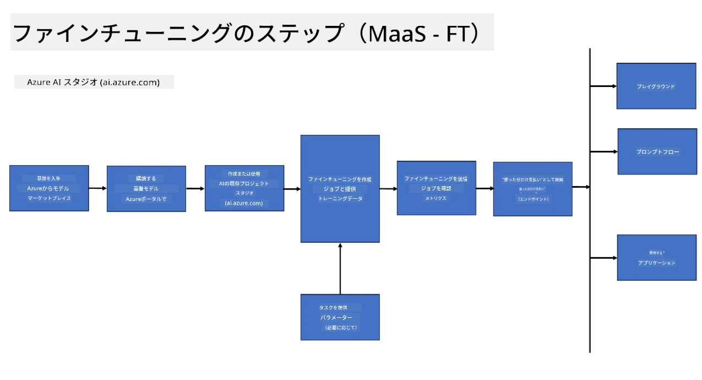
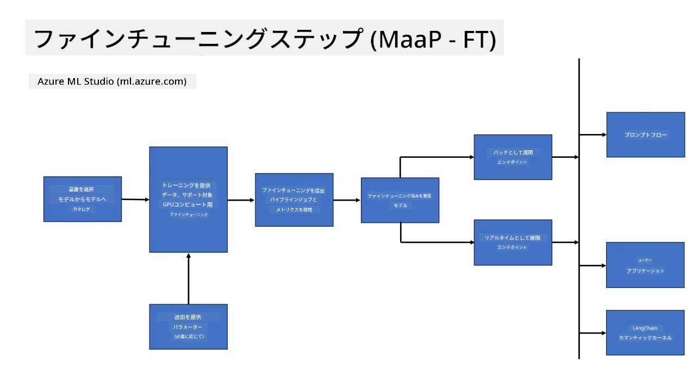
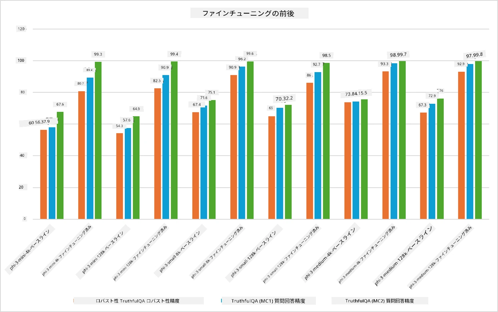

<!--
CO_OP_TRANSLATOR_METADATA:
{
  "original_hash": "cb5648935f63edc17e95ce38f23adc32",
  "translation_date": "2025-07-17T08:24:08+00:00",
  "source_file": "md/03.FineTuning/FineTuning_Scenarios.md",
  "language_code": "ja"
}
-->
## ファインチューニングのシナリオ

**プラットフォーム** には、Azure AI Foundry、Azure Machine Learning、AI Tools、Kaito、ONNX Runtimeなどのさまざまな技術が含まれます。

**インフラストラクチャ** には、ファインチューニングプロセスに不可欠なCPUやFPGAが含まれます。これらの技術のアイコンをお見せします。

**ツール＆フレームワーク** にはONNX Runtimeが含まれます。これらの技術のアイコンをお見せします。  
[ONNX Runtimeのアイコンを挿入]

Microsoftの技術を使ったファインチューニングプロセスは、さまざまなコンポーネントやツールで構成されています。これらの技術を理解し活用することで、効果的にアプリケーションをファインチューニングし、より良いソリューションを作り出すことができます。

## Model as Service

ホスト型ファインチューニングを使ってモデルを調整し、計算リソースの作成や管理は不要です。

Phi-3-miniおよびPhi-3-mediumモデル向けにサーバーレスファインチューニングが利用可能で、開発者は計算リソースを手配することなく、クラウドやエッジのシナリオに合わせてモデルを素早く簡単にカスタマイズできます。また、Phi-3-smallがModels-as-a-Serviceとして利用可能になったことも発表しており、開発者は基盤となるインフラを管理せずにAI開発をすぐに始められます。

## Model as a Platform

ユーザー自身が計算リソースを管理し、モデルのファインチューニングを行います。

[Fine Tuning Sample](https://github.com/Azure/azureml-examples/blob/main/sdk/python/foundation-models/system/finetune/chat-completion/chat-completion.ipynb)

## ファインチューニングのシナリオ

| | | | | | | |
|-|-|-|-|-|-|-|
|シナリオ|LoRA|QLoRA|PEFT|DeepSpeed|ZeRO|DORA|
|事前学習済みLLMを特定のタスクやドメインに適応させる|はい|はい|はい|はい|はい|はい|
|テキスト分類、固有表現抽出、機械翻訳などのNLPタスク向けファインチューニング|はい|はい|はい|はい|はい|はい|
|QAタスク向けファインチューニング|はい|はい|はい|はい|はい|はい|
|チャットボットで人間らしい応答を生成するためのファインチューニング|はい|はい|はい|はい|はい|はい|
|音楽、アート、その他の創造的な生成のためのファインチューニング|はい|はい|はい|はい|はい|はい|
|計算コストおよび費用の削減|はい|はい|いいえ|はい|はい|いいえ|
|メモリ使用量の削減|いいえ|はい|いいえ|はい|はい|はい|
|効率的なファインチューニングのためにパラメータ数を減らす|いいえ|はい|はい|いいえ|いいえ|はい|
|利用可能なすべてのGPUデバイスの合計GPUメモリにアクセスできるメモリ効率の良いデータ並列処理の形態|いいえ|いいえ|いいえ|はい|はい|はい|

## ファインチューニングのパフォーマンス例

**免責事項**：  
本書類はAI翻訳サービス「[Co-op Translator](https://github.com/Azure/co-op-translator)」を使用して翻訳されました。正確性には努めておりますが、自動翻訳には誤りや不正確な部分が含まれる可能性があります。原文の言語によるオリジナル文書が正式な情報源とみなされるべきです。重要な情報については、専門の人間による翻訳を推奨します。本翻訳の利用により生じたいかなる誤解や誤訳についても、当方は一切の責任を負いかねます。