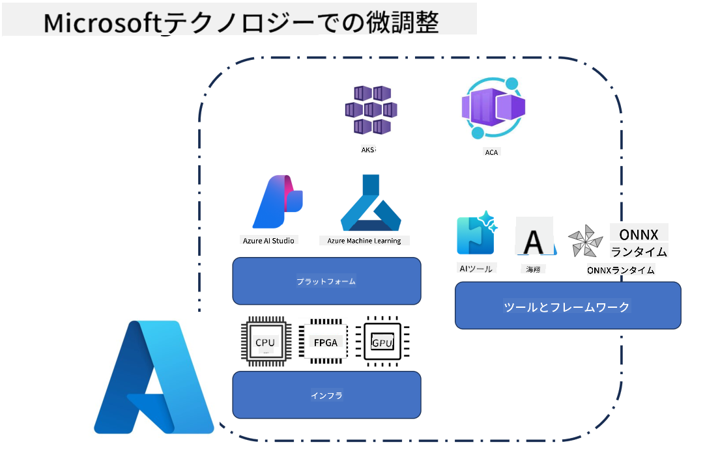
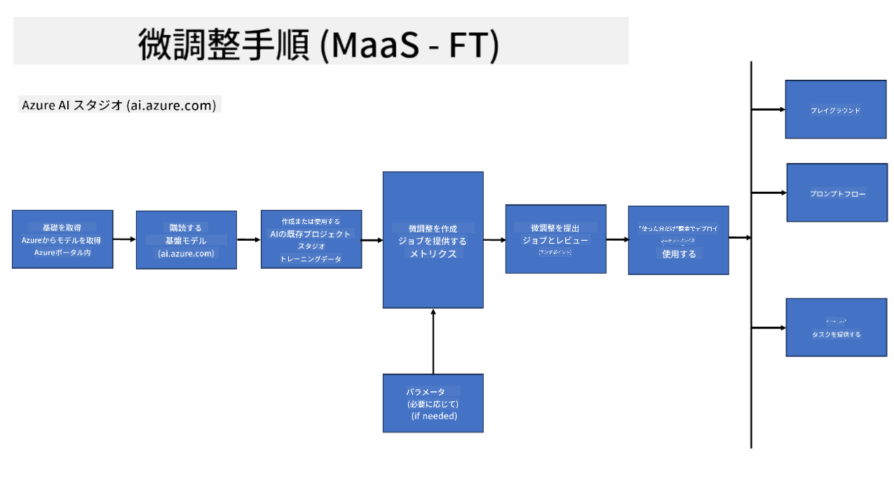
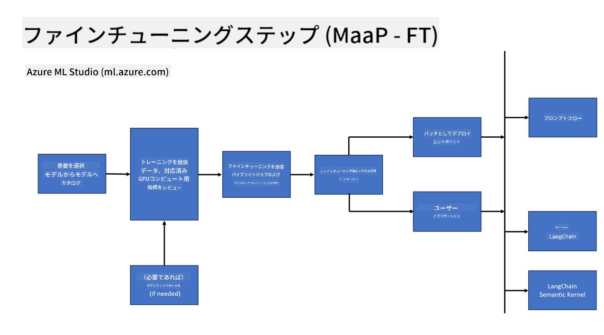
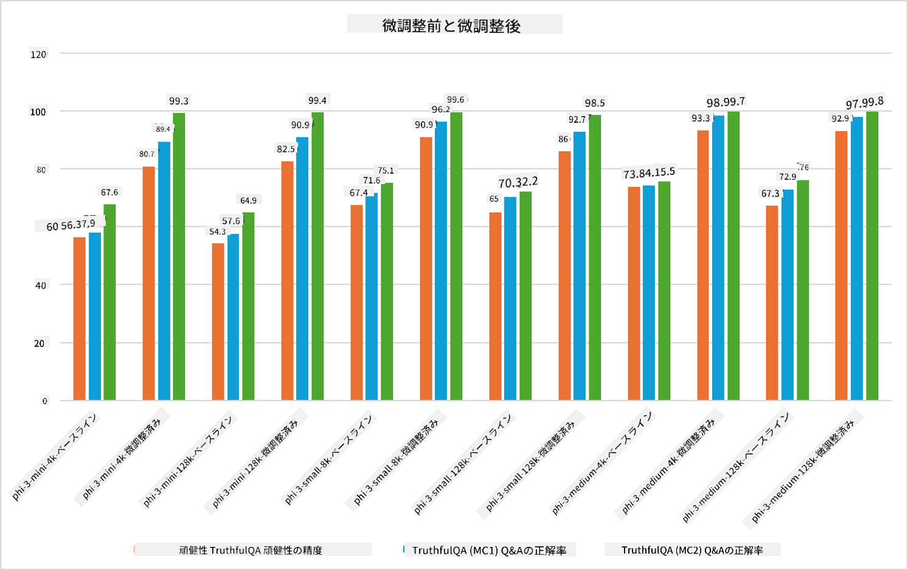

<!--
CO_OP_TRANSLATOR_METADATA:
{
  "original_hash": "cd52a3c9a424a77d2ec0470770c93846",
  "translation_date": "2025-04-04T13:29:00+00:00",
  "source_file": "md\\03.FineTuning\\FineTuning_Scenarios.md",
  "language_code": "ja"
}
-->
## 微調整シナリオ

**プラットフォーム** Azure AI Foundry、Azure Machine Learning、AI Tools、Kaito、ONNX Runtimeなどのさまざまな技術が含まれます。

**インフラストラクチャ** 微調整プロセスに欠かせないCPUとFPGAが含まれます。これらの技術のアイコンをお見せします。

**ツールとフレームワーク** ONNX RuntimeとONNX Runtimeが含まれます。これらの技術のアイコンをお見せします。
[ONNX RuntimeとONNX Runtimeのアイコンを挿入]

Microsoftの技術を用いた微調整プロセスは、さまざまなコンポーネントとツールを含みます。これらの技術を理解し活用することで、アプリケーションを効果的に微調整し、より良いソリューションを作成することが可能です。

## モデルをサービスとして

ホスト型微調整を使用して、コンピュートを作成・管理する必要なしにモデルを微調整します。

サーバーレス微調整はPhi-3-miniおよびPhi-3-mediumモデルで利用可能であり、開発者はクラウドやエッジシナリオ向けにモデルを迅速かつ簡単にカスタマイズできます。さらに、Phi-3-smallモデルもModels-as-a-Serviceの提供を通じて利用可能になり、開発者は基盤となるインフラストラクチャを管理することなくAI開発をすぐに開始できます。

## モデルをプラットフォームとして

ユーザーが自身のコンピュートを管理してモデルを微調整します。

[Fine Tuning Sample](https://github.com/Azure/azureml-examples/blob/main/sdk/python/foundation-models/system/finetune/chat-completion/chat-completion.ipynb)

## 微調整シナリオ

| | | | | | | |
|-|-|-|-|-|-|-|
|シナリオ|LoRA|QLoRA|PEFT|DeepSpeed|ZeRO|DORA|
|事前学習済みLLMを特定のタスクやドメインに適応させる|はい|はい|はい|はい|はい|はい|
|テキスト分類、固有表現抽出、機械翻訳などのNLPタスク向け微調整|はい|はい|はい|はい|はい|はい|
|QAタスク向け微調整|はい|はい|はい|はい|はい|はい|
|チャットボットで人間らしい応答を生成するための微調整|はい|はい|はい|はい|はい|はい|
|音楽、アート、その他の創造性を生成するための微調整|はい|はい|はい|はい|はい|はい|
|計算コストと財務コストを削減する|はい|はい|いいえ|はい|はい|いいえ|
|メモリ使用量を削減する|いいえ|はい|いいえ|はい|はい|はい|
|効率的な微調整のために少ないパラメータを使用する|いいえ|はい|はい|いいえ|いいえ|はい|
|利用可能なすべてのGPUデバイスの総GPUメモリにアクセス可能なメモリ効率の高いデータ並列化|いいえ|いいえ|いいえ|はい|はい|はい|

## 微調整パフォーマンス例

**免責事項**:  
この文書はAI翻訳サービス[Co-op Translator](https://github.com/Azure/co-op-translator)を使用して翻訳されています。正確性を追求していますが、自動翻訳には誤りや不正確な箇所が含まれる場合があります。元の言語で記載された原文が信頼できる情報源とみなされるべきです。重要な情報については、専門の人間による翻訳を推奨します。この翻訳の使用に起因する誤解や誤った解釈について、当社は責任を負いません。