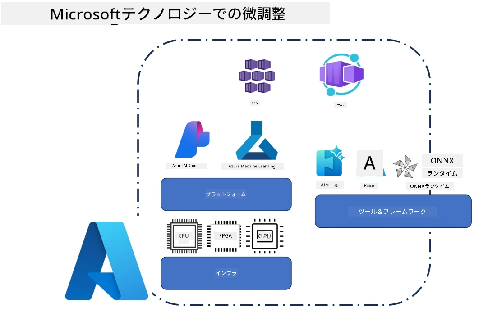
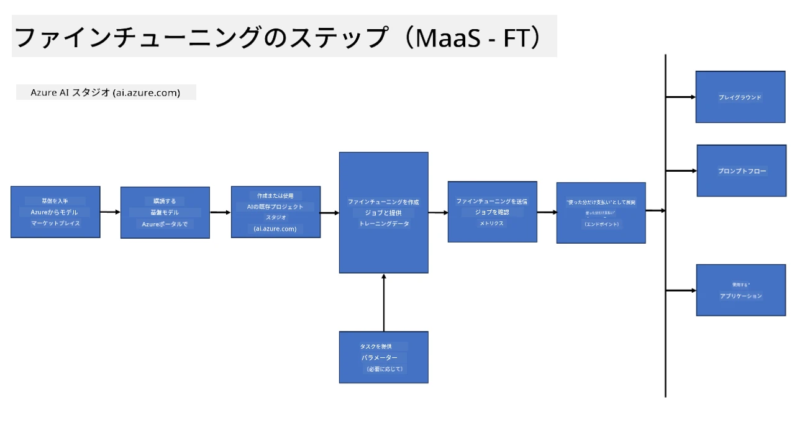
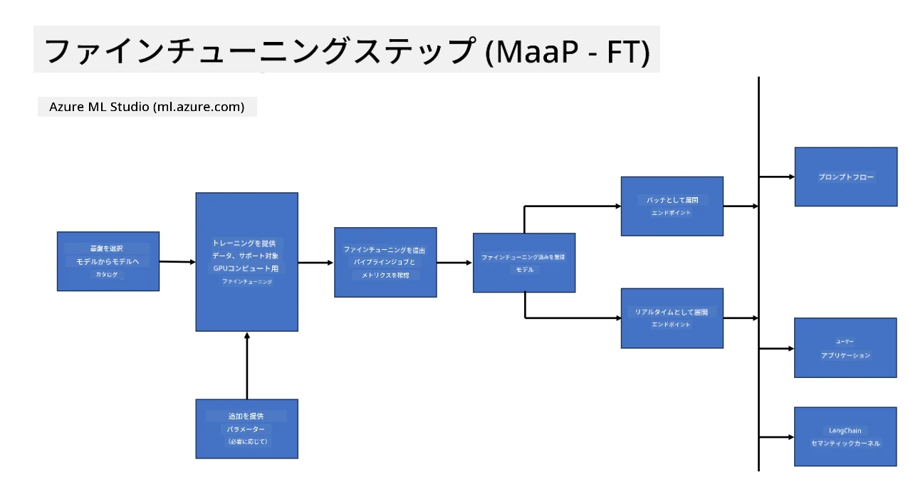
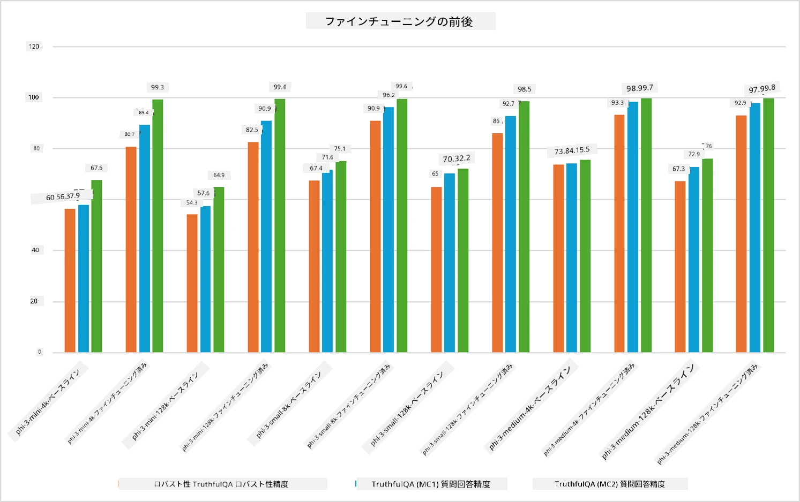

## ファインチューニングシナリオ

このセクションでは、Microsoft Foundry と Azure 環境でのファインチューニングシナリオについて、展開モデル、インフラ層、および一般的に使用される最適化技術を含めて概説します。

**プラットフォーム**  
Microsoft Foundry（旧 Azure AI Foundry）や Azure Machine Learning などのマネージドサービスを含み、モデル管理、オーケストレーション、実験追跡、展開ワークフローを提供します。

**インフラストラクチャ**  
ファインチューニングにはスケーラブルな計算リソースが必要です。Azure 環境では通常、GPU ベースの仮想マシンと軽量ワークロード用の CPU リソース、さらにデータセットやチェックポイント用のスケーラブルなストレージが含まれます。

**ツール & フレームワーク**  
ファインチューニングワークフローは、Hugging Face Transformers、DeepSpeed、PEFT（Parameter-Efficient Fine-Tuning）などのフレームワークや最適化ライブラリに依存することが一般的です。

Microsoft の技術を用いたファインチューニングプロセスは、プラットフォームサービス、計算インフラ、トレーニングフレームワークにわたります。これらのコンポーネントがどのように連携するかを理解することで、開発者は基盤モデルを特定のタスクやプロダクションシナリオに効率的に適応させることができます。

## モデル as サービス

ホストされたファインチューニングを使って、計算リソースを作成・管理することなくモデルをファインチューニングします。

サーバーレスのファインチューニングは、Phi-3、Phi-3.5、Phi-4 モデルファミリーで利用可能になっており、開発者がクラウドやエッジシナリオ向けにモデルを素早く簡単にカスタマイズできるように計算リソースの手配を不要にします。

## モデル as プラットフォーム

ユーザーが自分の計算リソースを管理し、モデルのファインチューニングを行います。

[Fine Tuning Sample](https://github.com/Azure/azureml-examples/blob/main/sdk/python/foundation-models/system/finetune/chat-completion/chat-completion.ipynb)

## ファインチューニング技術の比較

|シナリオ|LoRA|QLoRA|PEFT|DeepSpeed|ZeRO|DoRA|
|---|---|---|---|---|---|---|
|事前学習済みLLMを特定のタスクやドメインに適応させる|はい|はい|はい|はい|はい|はい|
|テキスト分類、固有表現認識、機械翻訳などのNLPタスクのファインチューニング|はい|はい|はい|はい|はい|はい|
|QAタスクのファインチューニング|はい|はい|はい|はい|はい|はい|
|チャットボットで人間らしい応答を生成するためのファインチューニング|はい|はい|はい|はい|はい|はい|
|音楽、アート、その他の創造的な形式を生成するためのファインチューニング|はい|はい|はい|はい|はい|はい|
|計算コストおよび財務コストの削減|はい|はい|はい|はい|はい|はい|
|メモリ使用量の削減|はい|はい|はい|はい|はい|はい|
|効率的なファインチューニングのためにパラメーター数を減らす|はい|はい|はい|いいえ|いいえ|はい|
|利用可能なすべてのGPUデバイスの合計GPUメモリにアクセスできるメモリ効率の良いデータ並列処理の形態|いいえ|いいえ|いいえ|はい|はい|いいえ|

> [!NOTE]
> LoRA、QLoRA、PEFT、および DoRA はパラメーター効率の良いファインチューニング手法であり、一方で DeepSpeed と ZeRO は分散トレーニングおよびメモリ最適化に焦点を当てています。

## ファインチューニング性能例

---

<!-- CO-OP TRANSLATOR DISCLAIMER START -->
**免責事項**：  
本書類は、AI翻訳サービス[Co-op Translator](https://github.com/Azure/co-op-translator)を使用して翻訳されました。正確性の向上に努めておりますが、自動翻訳には誤りや不正確な表現が含まれる可能性があることをご了承ください。原文が正式な情報源として優先されます。重要な情報については、専門の人間翻訳をご利用いただくことを推奨します。本翻訳の利用によって生じたいかなる誤解や解釈の相違についても、一切の責任を負いかねます。
<!-- CO-OP TRANSLATOR DISCLAIMER END -->