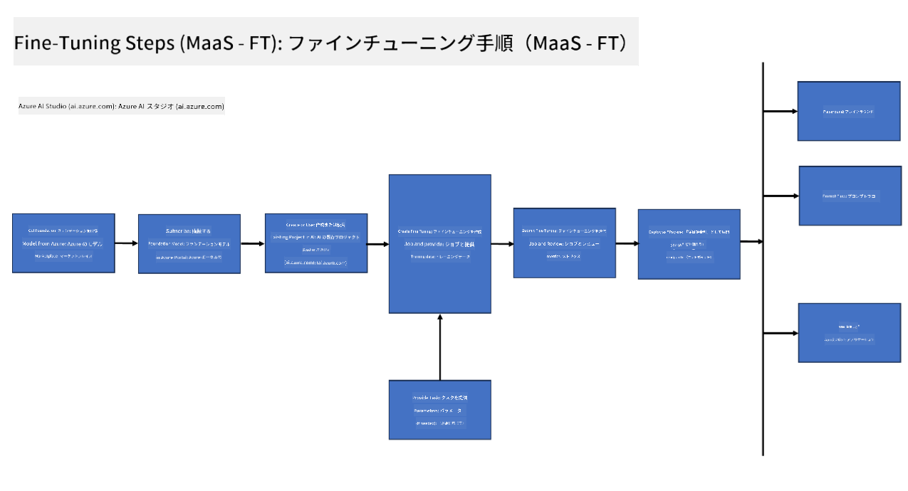
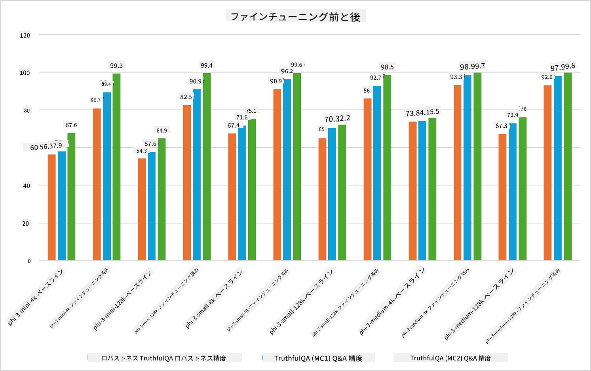

<!--
CO_OP_TRANSLATOR_METADATA:
{
  "original_hash": "cb5648935f63edc17e95ce38f23adc32",
  "translation_date": "2025-05-08T05:22:09+00:00",
  "source_file": "md/03.FineTuning/FineTuning_Scenarios.md",
  "language_code": "ja"
}
-->
## ファインチューニングのシナリオ

**プラットフォーム** これは、Azure AI Foundry、Azure Machine Learning、AI Tools、Kaito、ONNX Runtimeなどのさまざまな技術を含みます。

**インフラストラクチャ** これは、ファインチューニングプロセスに不可欠なCPUやFPGAを含みます。これらの技術のアイコンをお見せします。

**ツール＆フレームワーク** これにはONNX Runtimeが含まれます。これらの技術のアイコンをお見せします。  
[ONNX Runtimeのアイコンを挿入]

Microsoftの技術を用いたファインチューニングプロセスは、さまざまなコンポーネントやツールで構成されています。これらの技術を理解し活用することで、効果的にアプリケーションをファインチューニングし、より良いソリューションを作り出すことができます。

## Model as Service

ホスト型のファインチューニングを利用して、コンピュートの作成や管理なしにモデルをファインチューニングします。

サーバーレスのファインチューニングはPhi-3-miniとPhi-3-mediumモデルで利用可能で、開発者はクラウドやエッジのシナリオに向けて迅速かつ簡単にモデルをカスタマイズできます。さらに、Phi-3-smallもModels-as-a-Serviceとして提供開始しており、開発者は基盤となるインフラ管理なしでAI開発をすぐに始められます。

## Model as a Platform

ユーザー自身がコンピュートを管理し、モデルのファインチューニングを行います。

[Fine Tuning Sample](https://github.com/Azure/azureml-examples/blob/main/sdk/python/foundation-models/system/finetune/chat-completion/chat-completion.ipynb)

## ファインチューニングのシナリオ

| | | | | | | |
|-|-|-|-|-|-|-|
|シナリオ|LoRA|QLoRA|PEFT|DeepSpeed|ZeRO|DORA|
|事前学習済みLLMを特定のタスクやドメインに適応させる|Yes|Yes|Yes|Yes|Yes|Yes|
|テキスト分類、固有表現抽出、機械翻訳などのNLPタスクのファインチューニング|Yes|Yes|Yes|Yes|Yes|Yes|
|QAタスクのファインチューニング|Yes|Yes|Yes|Yes|Yes|Yes|
|チャットボットで人間らしい応答を生成するためのファインチューニング|Yes|Yes|Yes|Yes|Yes|Yes|
|音楽、アート、その他クリエイティブな生成のファインチューニング|Yes|Yes|Yes|Yes|Yes|Yes|
|計算コストや費用の削減|Yes|Yes|No|Yes|Yes|No|
|メモリ使用量の削減|No|Yes|No|Yes|Yes|Yes|
|効率的なファインチューニングのためにパラメーター数を減らす|No|Yes|Yes|No|No|Yes|
|すべてのGPUデバイスの合計GPUメモリにアクセスできるメモリ効率の良いデータ並列処理の形態|No|No|No|Yes|Yes|Yes|

## ファインチューニングのパフォーマンス例

**免責事項**：  
本書類はAI翻訳サービス「[Co-op Translator](https://github.com/Azure/co-op-translator)」を使用して翻訳されています。正確性の確保に努めておりますが、自動翻訳には誤りや不正確な部分が含まれる可能性があることをご承知ください。原文の言語で記載された文書が正式な情報源とみなされます。重要な情報については、専門の人間による翻訳を推奨します。本翻訳の利用により生じた誤解や誤訳について、当方は一切の責任を負いかねます。