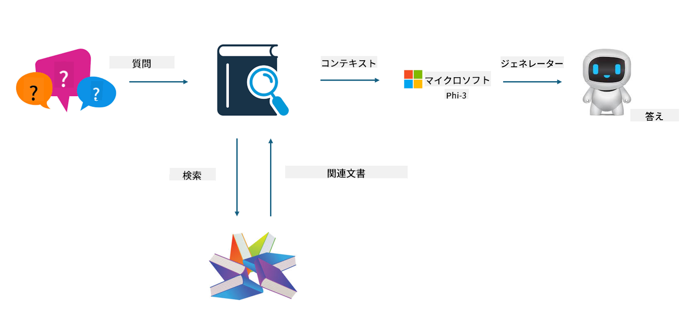

<!--
CO_OP_TRANSLATOR_METADATA:
{
  "original_hash": "e4e010400c2918557b36bb932a14004c",
  "translation_date": "2025-05-08T05:19:02+00:00",
  "source_file": "md/03.FineTuning/FineTuning_vs_RAG.md",
  "language_code": "ja"
}
-->
## ファインチューニングとRAGの違い

## Retrieval Augmented Generation

RAGはデータの検索とテキスト生成を組み合わせたものです。企業の構造化データや非構造化データはベクトルデータベースに保存されます。関連する内容を検索する際に、関連する要約やコンテンツを見つけてコンテキストを形成し、LLM/SLMのテキスト補完機能と組み合わせてコンテンツを生成します。

## RAGのプロセス

## ファインチューニング
ファインチューニングは特定のモデルの改善に基づいています。モデルのアルゴリズムから始める必要はなく、データを継続的に蓄積していくことが求められます。業界向けのより正確な用語や言語表現が必要な場合は、ファインチューニングが適しています。ただし、データが頻繁に変わる場合は、ファインチューニングは複雑になることがあります。

## 選び方
外部データの導入が必要な場合は、RAGが最適です。

安定して正確な業界知識を出力する必要がある場合は、ファインチューニングが良い選択です。RAGは関連コンテンツの取得を優先しますが、専門的なニュアンスを常に完璧に捉えられるとは限りません。

ファインチューニングには高品質なデータセットが必要で、データ範囲が狭い場合はあまり効果が出ません。RAGのほうが柔軟性があります。  
ファインチューニングはブラックボックス的で内部の仕組みが理解しづらいですが、RAGはデータの出所を特定しやすく、誤情報や内容の誤りを効果的に調整できるため、より透明性が高いです。

**免責事項**：  
本書類はAI翻訳サービス「Co-op Translator」（https://github.com/Azure/co-op-translator）を使用して翻訳されました。正確性の向上に努めておりますが、自動翻訳には誤りや不正確な箇所が含まれる可能性があります。原文はあくまで原言語での文書を正式な情報源としてご参照ください。重要な情報については、専門の人間による翻訳を推奨いたします。本翻訳の使用により生じたいかなる誤解や誤訳についても、一切の責任を負いかねます。