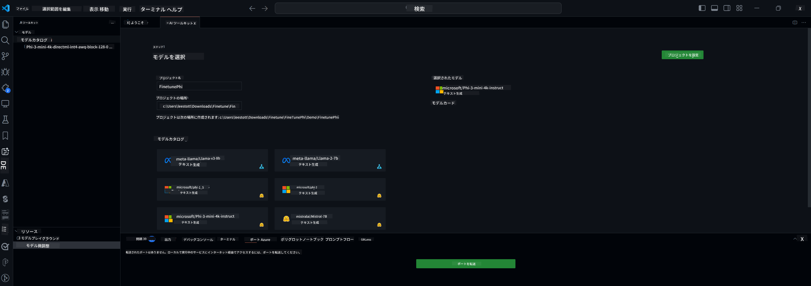

<!--
CO_OP_TRANSLATOR_METADATA:
{
  "original_hash": "c2bc0950f44919ac75a88c1a871680c2",
  "translation_date": "2025-07-17T09:04:53+00:00",
  "source_file": "md/03.FineTuning/Finetuning_VSCodeaitoolkit.md",
  "language_code": "ja"
}
-->
## VS Code用AIツールキットへようこそ

[AI Toolkit for VS Code](https://github.com/microsoft/vscode-ai-toolkit/tree/main)は、Azure AI StudioカタログやHugging Faceなどの他のカタログからさまざまなモデルを統合しています。このツールキットは、生成AIツールやモデルを使ったAIアプリ開発の一般的な作業を効率化します：
- モデルの探索とプレイグラウンドでのスタート
- ローカルの計算リソースを使ったモデルのファインチューニングと推論
- Azureリソースを使ったリモートでのファインチューニングと推論

[VSCode用AIツールキットのインストール](https://marketplace.visualstudio.com/items?itemName=ms-windows-ai-studio.windows-ai-studio)



**[Private Preview]** Azure Container Appsのワンクリックプロビジョニングで、クラウド上でモデルのファインチューニングと推論を実行可能。

それでは、AIアプリ開発を始めましょう：

- [VS Code用AIツールキットへようこそ](../../../../md/03.FineTuning)
- [ローカル開発](../../../../md/03.FineTuning)
  - [準備](../../../../md/03.FineTuning)
  - [Condaの有効化](../../../../md/03.FineTuning)
  - [ベースモデルのファインチューニングのみ](../../../../md/03.FineTuning)
  - [モデルのファインチューニングと推論](../../../../md/03.FineTuning)
  - [モデルのファインチューニング](../../../../md/03.FineTuning)
  - [Microsoft Olive](../../../../md/03.FineTuning)
  - [ファインチューニングのサンプルとリソース](../../../../md/03.FineTuning)
- [**\[Private Preview\]** リモート開発](../../../../md/03.FineTuning)
  - [前提条件](../../../../md/03.FineTuning)
  - [リモート開発プロジェクトのセットアップ](../../../../md/03.FineTuning)
  - [Azureリソースのプロビジョニング](../../../../md/03.FineTuning)
  - [\[オプション\] HuggingfaceトークンをAzure Container Appのシークレットに追加](../../../../md/03.FineTuning)
  - [ファインチューニングの実行](../../../../md/03.FineTuning)
  - [推論エンドポイントのプロビジョニング](../../../../md/03.FineTuning)
  - [推論エンドポイントのデプロイ](../../../../md/03.FineTuning)
  - [高度な使い方](../../../../md/03.FineTuning)

## ローカル開発
### 準備

1. ホストにNVIDIAドライバーがインストールされていることを確認してください。  
2. Hugging Faceのデータセットを利用する場合は、`huggingface-cli login`を実行してください。  
3. メモリ使用量に影響する設定については`Olive`のキー設定説明を参照してください。

### Condaの有効化
WSL環境を使用しており共有されているため、Conda環境を手動で有効化する必要があります。この手順を終えたら、ファインチューニングや推論を実行できます。

```bash
conda activate [conda-env-name] 
```

### ベースモデルのファインチューニングのみ
ファインチューニングせずにベースモデルを試したい場合は、Condaを有効化した後に以下のコマンドを実行してください。

```bash
cd inference

# Web browser interface allows to adjust a few parameters like max new token length, temperature and so on.
# User has to manually open the link (e.g. http://0.0.0.0:7860) in a browser after gradio initiates the connections.
python gradio_chat.py --baseonly
```

### モデルのファインチューニングと推論

開発コンテナ内でワークスペースを開いたら、ターミナルを開きます（デフォルトのパスはプロジェクトルートです）。次に、選択したデータセットでLLMをファインチューニングするために以下のコマンドを実行します。

```bash
python finetuning/invoke_olive.py 
```

チェックポイントと最終モデルは`models`フォルダーに保存されます。

次に、ファインチューニング済みモデルを使って`console`、`web browser`、または`prompt flow`でチャットを通じて推論を実行します。

```bash
cd inference

# Console interface.
python console_chat.py

# Web browser interface allows to adjust a few parameters like max new token length, temperature and so on.
# User has to manually open the link (e.g. http://127.0.0.1:7860) in a browser after gradio initiates the connections.
python gradio_chat.py
```

VS Codeで`prompt flow`を使う場合は、こちらの[クイックスタート](https://microsoft.github.io/promptflow/how-to-guides/quick-start.html)を参照してください。

### モデルのファインチューニング

次に、デバイスにGPUがあるかどうかに応じて以下のモデルをダウンロードしてください。

QLoRAを使ったローカルファインチューニングを開始するには、カタログからファインチューニングしたいモデルを選択します。  
| プラットフォーム | GPU利用可否 | モデル名 | サイズ (GB) |
|---------|---------|--------|--------|
| Windows | あり | Phi-3-mini-4k-**directml**-int4-awq-block-128-onnx | 2.13GB |
| Linux | あり | Phi-3-mini-4k-**cuda**-int4-onnx | 2.30GB |
| Windows<br>Linux | なし | Phi-3-mini-4k-**cpu**-int4-rtn-block-32-acc-level-4-onnx | 2.72GB |

**_注意_** モデルのダウンロードにAzureアカウントは不要です。

Phi3-mini (int4)モデルは約2GB〜3GBのサイズです。ネットワーク速度によっては数分かかる場合があります。

まず、プロジェクト名と保存場所を選択します。  
次にモデルカタログからモデルを選択すると、プロジェクトテンプレートのダウンロードを促されます。その後、「Configure Project」をクリックして各種設定を調整できます。

### Microsoft Olive

[Olive](https://microsoft.github.io/Olive/why-olive.html)を使って、カタログのPyTorchモデルに対してQLoRAファインチューニングを実行します。すべての設定はメモリ使用を最適化しローカルでのファインチューニングを効率化するためにデフォルト値でプリセットされていますが、必要に応じて調整可能です。

### ファインチューニングのサンプルとリソース

- [ファインチューニング入門ガイド](https://learn.microsoft.com/windows/ai/toolkit/toolkit-fine-tune)
- [HuggingFaceデータセットを使ったファインチューニング](https://github.com/microsoft/vscode-ai-toolkit/blob/main/archive/walkthrough-hf-dataset.md)
- [シンプルデータセットを使ったファインチューニング](https://github.com/microsoft/vscode-ai-toolkit/blob/main/archive/walkthrough-simple-dataset.md)

## **[Private Preview]** リモート開発

### 前提条件

1. リモートのAzure Container App環境でモデルのファインチューニングを実行するには、サブスクリプションに十分なGPU容量があることを確認してください。必要な容量を申請するには[サポートチケット](https://azure.microsoft.com/support/create-ticket/)を提出してください。[GPU容量の詳細はこちら](https://learn.microsoft.com/azure/container-apps/workload-profiles-overview)  
2. HuggingFaceのプライベートデータセットを使用する場合は、[HuggingFaceアカウント](https://huggingface.co/?WT.mc_id=aiml-137032-kinfeylo)を持ち、[アクセストークンを生成](https://huggingface.co/docs/hub/security-tokens?WT.mc_id=aiml-137032-kinfeylo)してください。  
3. AI Toolkit for VS Codeでリモートファインチューニングと推論の機能フラグを有効にします。  
   1. VS Codeの設定を開く（*ファイル -> 設定 -> 設定*）。  
   2. *拡張機能*から*AI Toolkit*を選択。  
   3. *"Enable Remote Fine-tuning And Inference"*オプションを選択。  
   4. VS Codeを再起動して反映させる。

- [リモートファインチューニング](https://github.com/microsoft/vscode-ai-toolkit/blob/main/archive/remote-finetuning.md)

### リモート開発プロジェクトのセットアップ
1. コマンドパレットで`AI Toolkit: Focus on Resource View`を実行。  
2. *Model Fine-tuning*に移動し、モデルカタログにアクセス。プロジェクト名と保存場所を指定し、*Configure Project*ボタンを押す。  
3. プロジェクト設定  
    1. *"Fine-tune locally"*オプションは有効にしないでください。  
    2. Oliveの設定画面が表示され、デフォルト値がプリセットされています。必要に応じて設定を調整してください。  
    3. *Generate Project*に進みます。ここではWSLを利用し、新しいConda環境をセットアップします。将来的にはDev Containersもサポート予定です。  
4. *"Relaunch Window In Workspace"*をクリックしてリモート開発プロジェクトを開きます。

> **注意:** このプロジェクトはAI Toolkit for VS Code内でローカルまたはリモートのいずれかで動作します。プロジェクト作成時に*"Fine-tune locally"*を選択するとWSL内のみで動作し、リモート開発はできません。一方、*"Fine-tune locally"*を有効にしなければ、リモートのAzure Container App環境でのみ動作します。

### Azureリソースのプロビジョニング
リモートファインチューニングを始めるには、コマンドパレットから`AI Toolkit: Provision Azure Container Apps job for fine-tuning`を実行してAzureリソースをプロビジョニングしてください。

進捗は出力チャネルに表示されるリンクで確認できます。

### [オプション] HuggingfaceトークンをAzure Container Appのシークレットに追加
プライベートなHuggingFaceデータセットを使う場合、HuggingFaceトークンを環境変数として設定すると、Hugging Face Hubへの手動ログインが不要になります。  
`AI Toolkit: Add Azure Container Apps Job secret for fine-tuning`コマンドを使い、シークレット名を[`HF_TOKEN`](https://huggingface.co/docs/huggingface_hub/package_reference/environment_variables#hftoken)に設定し、Hugging Faceトークンをシークレット値として登録してください。

### ファインチューニングの実行
リモートファインチューニングジョブを開始するには、`AI Toolkit: Run fine-tuning`コマンドを実行します。

システムやコンソールのログは、出力パネルのリンクからAzureポータルで確認できます（詳細は[Azureでのログの表示とクエリ](https://aka.ms/ai-toolkit/remote-provision#view-and-query-logs-on-azure)を参照）。  
または、VSCodeの出力パネルで`AI Toolkit: Show the running fine-tuning job streaming logs`コマンドを実行して直接コンソールログを確認できます。  
> **注意:** リソース不足によりジョブがキューに入る場合があります。ログが表示されない場合は、`AI Toolkit: Show the running fine-tuning job streaming logs`を実行し、しばらく待ってから再度実行してストリーミングログに再接続してください。

このプロセスではQLoRAを使ってファインチューニングを行い、推論時に使うLoRAアダプターをモデルに作成します。  
ファインチューニングの結果はAzure Filesに保存されます。

### 推論エンドポイントのプロビジョニング
リモート環境でアダプターがトレーニングされた後、シンプルなGradioアプリケーションを使ってモデルと対話します。  
ファインチューニングと同様に、コマンドパレットから`AI Toolkit: Provision Azure Container Apps for inference`を実行してリモート推論用のAzureリソースをセットアップしてください。

デフォルトでは、推論用のサブスクリプションとリソースグループはファインチューニングで使ったものと同じに設定されます。推論は同じAzure Container App環境を使い、ファインチューニング時に生成されたAzure Files内のモデルとモデルアダプターにアクセスします。

### 推論エンドポイントのデプロイ
推論コードの修正やモデルの再読み込みを行いたい場合は、`AI Toolkit: Deploy for inference`コマンドを実行してください。これにより最新のコードがAzure Container Appに同期され、レプリカが再起動されます。

デプロイが成功すると、VSCodeの通知に表示される「*Go to Inference Endpoint*」ボタンから推論APIにアクセスできます。  
また、Web APIエンドポイントは`./infra/inference.config.json`の`ACA_APP_ENDPOINT`や出力パネルで確認可能です。これでモデルの評価が可能になります。

### 高度な使い方
AI Toolkitを使ったリモート開発の詳細は、[リモートでのモデルファインチューニング](https://aka.ms/ai-toolkit/remote-provision)および[ファインチューニング済みモデルでの推論](https://aka.ms/ai-toolkit/remote-inference)のドキュメントを参照してください。

**免責事項**：  
本書類はAI翻訳サービス「[Co-op Translator](https://github.com/Azure/co-op-translator)」を使用して翻訳されました。正確性の向上に努めておりますが、自動翻訳には誤りや不正確な部分が含まれる可能性があります。原文の言語によるオリジナル文書が正式な情報源とみなされるべきです。重要な情報については、専門の人間による翻訳を推奨します。本翻訳の利用により生じたいかなる誤解や誤訳についても、当方は責任を負いかねます。