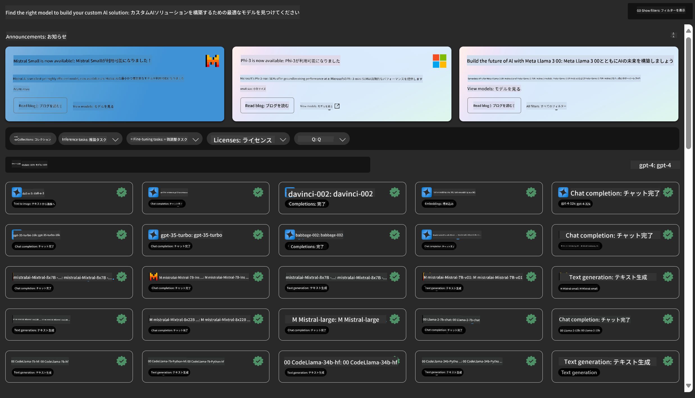

<!--
CO_OP_TRANSLATOR_METADATA:
{
  "original_hash": "315566447513c4c6215ea5a004315e4f",
  "translation_date": "2025-04-04T13:33:52+00:00",
  "source_file": "md\\03.FineTuning\\Introduce_AzureML.md",
  "language_code": "ja"
}
-->
# **Azure Machine Learning サービスの紹介**

[Azure Machine Learning](https://ml.azure.com?WT.mc_id=aiml-138114-kinfeylo) は、機械学習 (ML) プロジェクトのライフサイクルを加速し、管理するためのクラウドサービスです。

ML 専門家、データ サイエンティスト、エンジニアは、日々のワークフローで以下のことに利用できます：

- モデルのトレーニングとデプロイ。
- 機械学習の運用 (MLOps) を管理。
- Azure Machine Learning でモデルを作成することも、PyTorch、TensorFlow、scikit-learn などのオープンソースプラットフォームで作成したモデルを使用することも可能。
- MLOps ツールを使用して、モデルの監視、再トレーニング、再デプロイを行うことができます。

## Azure Machine Learning の対象者

**データサイエンティストと ML エンジニア**

日々のワークフローを加速し、自動化するツールを活用できます。
Azure ML は、公平性、説明可能性、トラッキング、監査可能性を提供します。

**アプリケーション開発者**

モデルをアプリケーションやサービスにシームレスに統合できます。

**プラットフォーム開発者**

耐久性のある Azure Resource Manager API に支えられた強力なツールセットを利用できます。
これらのツールを使用して、高度な ML ツールを構築できます。

**企業**

Microsoft Azure クラウドで作業することで、馴染みのあるセキュリティとロールベースのアクセス制御の恩恵を受けることができます。
保護されたデータや特定の操作へのアクセスを制御するプロジェクトを設定できます。

## チーム全員の生産性向上
ML プロジェクトは、構築および維持のために多様なスキルセットを持つチームが必要になることが多いです。

Azure ML は以下を可能にするツールを提供します：
- 共有ノートブック、計算リソース、サーバーレスコンピューティング、データ、環境を通じてチームと協力。
- 公平性、説明可能性、トラッキング、監査可能性を備えたモデルを開発し、ライナージおよび監査コンプライアンス要件を満たす。
- ML モデルを迅速かつ簡単にスケールでデプロイし、効率的に管理および統治 (MLOps)。
- 組み込みのガバナンス、セキュリティ、コンプライアンスを使用して、どこでも機械学習ワークロードを実行。

## クロス互換性のあるプラットフォームツール

ML チームの誰もが、自分の好みのツールを使って作業を進めることができます。
迅速な実験、ハイパーパラメータ調整、パイプライン構築、推論管理を行う際には、以下のような馴染みのあるインターフェースを使用できます：
- Azure Machine Learning Studio
- Python SDK (v2)
- Azure CLI (v2)
- Azure Resource Manager REST API

モデルを洗練し、開発サイクルを通じてコラボレーションする際には、Azure Machine Learning Studio の UI 内で資産、リソース、メトリックを共有し、見つけることができます。

## **Azure ML における LLM/SLM**

Azure ML は、LLMOps と SLMOps を組み合わせ、企業全体で利用可能な生成型 AI 技術プラットフォームを構築するため、多くの LLM/SLM 関連機能を追加しました。

### **モデルカタログ**

企業ユーザーは、モデルカタログを通じて、異なるビジネスシナリオに応じたさまざまなモデルをデプロイし、企業の開発者やユーザーがアクセスできる Model as Service としてサービスを提供できます。

Azure Machine Learning Studio 内のモデルカタログは、生成型 AI アプリケーションを構築するために幅広いモデルを発見し、利用できる中心的な場所です。モデルカタログには、Azure OpenAI サービス、Mistral、Meta、Cohere、Nvidia、Hugging Face など、Microsoft がトレーニングしたモデルを含むモデルプロバイダーの数百のモデルが揃っています。Microsoft 以外のプロバイダーから提供されるモデルは、Microsoft の製品条項で定義される非 Microsoft 製品であり、モデルに付随する条項が適用されます。

### **ジョブパイプライン**

機械学習パイプラインの核心は、完全な機械学習タスクを複数ステップのワークフローに分割することです。各ステップは管理可能なコンポーネントであり、個別に開発、最適化、設定、自動化が可能です。ステップは明確に定義されたインターフェースで接続されます。Azure Machine Learning パイプラインサービスは、パイプラインステップ間のすべての依存関係を自動的に調整します。

SLM / LLM の微調整において、データ、トレーニング、生成プロセスをパイプラインを通じて管理することができます。

### **プロンプトフロー**

Azure Machine Learning プロンプトフローを使用する利点：
Azure Machine Learning プロンプトフローは、アイデアの着想から実験、そして最終的に本番対応の LLM ベースのアプリケーションへ移行するプロセスを支援するさまざまな利点を提供します：

**プロンプトエンジニアリングの柔軟性**

- インタラクティブな作成体験：Azure Machine Learning プロンプトフローはフロー構造の視覚的表現を提供し、ユーザーがプロジェクトを簡単に理解し、ナビゲートできるようにします。また、効率的なフロー開発とデバッグのためのノートブックのようなコーディング体験を提供します。
- プロンプト調整のバリエーション：複数のプロンプトバリエーションを作成し比較することで、反復的な改良プロセスを促進します。
- 評価：組み込みの評価フローにより、プロンプトやフローの品質と有効性を評価できます。
- 包括的なリソース：Azure Machine Learning プロンプトフローには、組み込みツール、サンプル、テンプレートのライブラリが含まれており、開発の出発点として創造性を刺激し、プロセスを加速します。

**LLM ベースのアプリケーションの企業対応**

- コラボレーション：Azure Machine Learning プロンプトフローはチームコラボレーションをサポートし、複数のユーザーがプロンプトエンジニアリングプロジェクトで協力し、知識を共有し、バージョン管理を維持できます。
- オールインワンプラットフォーム：Azure Machine Learning プロンプトフローは、開発、評価、デプロイ、監視まで、プロンプトエンジニアリングプロセス全体を簡素化します。ユーザーはフローを Azure Machine Learning エンドポイントとしてデプロイし、そのパフォーマンスをリアルタイムで監視することで、最適な運用と継続的な改善を保証できます。
- Azure Machine Learning の企業対応ソリューション：プロンプトフローは Azure Machine Learning の堅牢な企業対応ソリューションを活用し、フローの開発、実験、デプロイのための安全でスケーラブル、信頼性の高い基盤を提供します。

Azure Machine Learning プロンプトフローを使用することで、ユーザーはプロンプトエンジニアリングの柔軟性を発揮し、効果的にコラボレーションし、企業グレードのソリューションを活用して LLM ベースのアプリケーションの成功した開発とデプロイを実現できます。

Azure ML の計算能力、データ、さまざまなコンポーネントを組み合わせることで、企業開発者は独自の人工知能アプリケーションを簡単に構築できます。

**免責事項**:  
この文書はAI翻訳サービス[Co-op Translator](https://github.com/Azure/co-op-translator)を使用して翻訳されています。正確性を追求しておりますが、自動翻訳には誤りや不正確さが含まれる可能性がありますのでご了承ください。元の言語で書かれた文書を正式な情報源としてご参照ください。重要な情報については、専門の人間による翻訳を推奨します。この翻訳の使用に起因する誤解や誤った解釈について、当方は一切の責任を負いません。