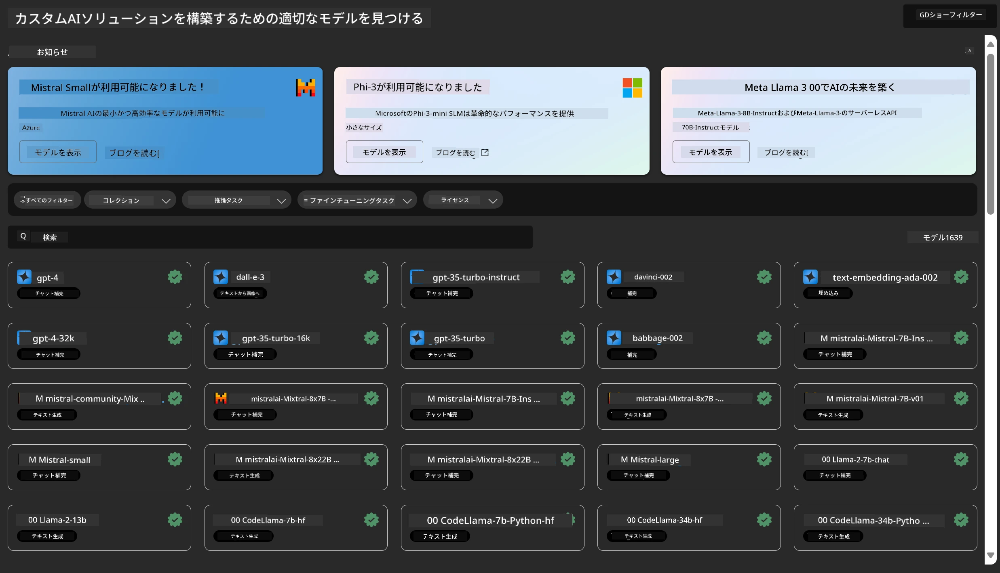
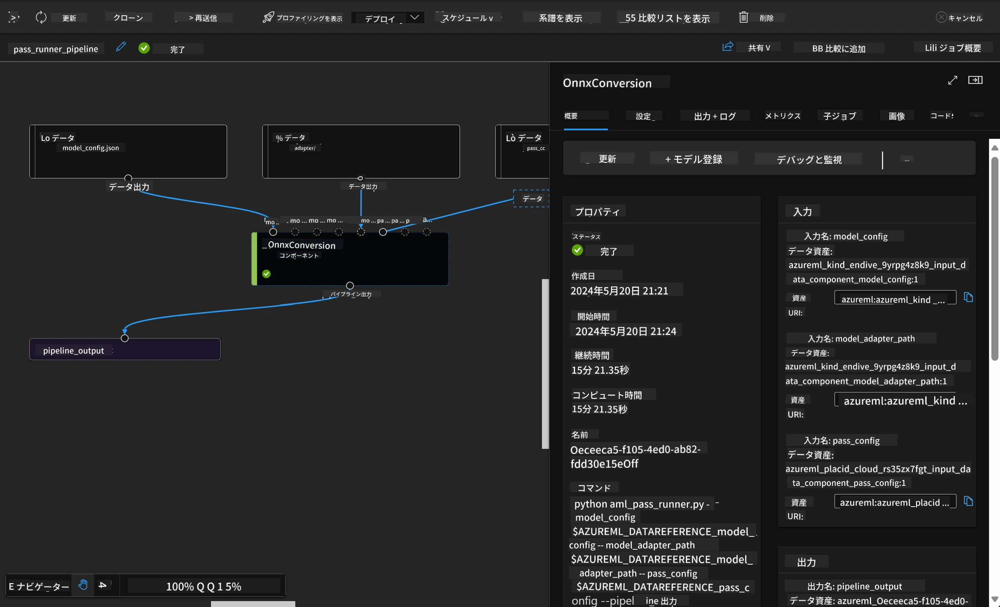

# **Azure Machine Learning Serviceの紹介**

[Azure Machine Learning](https://ml.azure.com?WT.mc_id=aiml-138114-kinfeylo) は、機械学習（ML）プロジェクトのライフサイクルを加速・管理するためのクラウドサービスです。

MLの専門家、データサイエンティスト、エンジニアは、日々のワークフローで以下のことに活用できます：

- モデルのトレーニングとデプロイ。
- 機械学習運用（MLOps）の管理。
- Azure Machine Learningでモデルを作成することも、PyTorch、TensorFlow、scikit-learnなどのオープンソースプラットフォームで構築されたモデルを利用することも可能です。
- MLOpsツールは、モデルの監視、再トレーニング、再デプロイを支援します。

## Azure Machine Learningは誰のため？

**データサイエンティストとMLエンジニア**

日々のワークフローを加速・自動化するためのツールを利用できます。  
Azure MLは、公平性、説明性、トラッキング、監査可能性の機能を提供します。

**アプリケーション開発者**  
モデルをアプリケーションやサービスにシームレスに統合できます。

**プラットフォーム開発者**

堅牢なAzure Resource Manager APIに支えられた強力なツールセットにアクセス可能です。  
これらのツールを使って高度なMLツールを構築できます。

**企業**

Microsoft Azureクラウド上で作業する企業は、馴染みのあるセキュリティと役割ベースのアクセス制御の恩恵を受けられます。  
保護されたデータや特定の操作へのアクセスを制御するプロジェクトを設定できます。

## チーム全員の生産性向上

MLプロジェクトは、多様なスキルセットを持つチームで構築・維持されることが多いです。

Azure MLは以下を可能にするツールを提供します：  
- 共有ノートブック、計算リソース、サーバーレスコンピュート、データ、環境を通じてチームと協力する。  
- 公平性、説明性、トラッキング、監査可能性を備えたモデルを開発し、系譜や監査コンプライアンス要件を満たす。  
- MLモデルを迅速かつ簡単に大規模にデプロイし、MLOpsで効率的に管理・ガバナンスを行う。  
- 組み込みのガバナンス、セキュリティ、コンプライアンスを備え、どこでも機械学習ワークロードを実行する。

## クロスコンパチブルなプラットフォームツール

MLチームの誰もが、自分の好みのツールを使って作業を進められます。  
迅速な実験、ハイパーパラメータチューニング、パイプライン構築、推論管理など、以下のような馴染みのあるインターフェースを利用可能です：  
- Azure Machine Learning Studio  
- Python SDK (v2)  
- Azure CLI (v2)  
- Azure Resource Manager REST API  

モデルを洗練し、開発サイクルを通じて協力する際には、Azure Machine Learning StudioのUI内でアセット、リソース、メトリクスを共有・検索できます。

## **Azure MLにおけるLLM/SLM**

Azure MLは多くのLLM/SLM関連機能を追加し、LLMOpsとSLMOpsを組み合わせて、企業全体の生成AI技術プラットフォームを構築しています。

### **モデルカタログ**

企業ユーザーは、モデルカタログを通じて異なるビジネスシナリオに応じたモデルを展開し、企業の開発者やユーザーがアクセスできるModel as Serviceとしてサービスを提供できます。

Azure Machine Learning Studioのモデルカタログは、生成AIアプリケーション構築に役立つ多様なモデルを発見・利用するハブです。  
モデルカタログには、Azure OpenAIサービス、Mistral、Meta、Cohere、Nvidia、Hugging Faceなどのモデルプロバイダーによる数百のモデルが含まれており、Microsoftがトレーニングしたモデルもあります。  
Microsoft以外のプロバイダーのモデルはMicrosoftの製品利用規約で定義されるNon-Microsoft Productsに該当し、モデルに付随する利用条件が適用されます。

### **ジョブパイプライン**

機械学習パイプラインの核は、完全な機械学習タスクを複数のステップに分割することです。  
各ステップは個別に開発、最適化、設定、自動化が可能な管理可能なコンポーネントです。  
ステップは明確に定義されたインターフェースで接続されます。  
Azure Machine Learningのパイプラインサービスは、パイプラインステップ間の依存関係を自動的に調整します。

SLM / LLMのファインチューニングでは、パイプラインを通じてデータ、トレーニング、生成プロセスを管理できます。

### **Prompt flow**

Azure Machine Learning prompt flowを使うメリット  
Azure Machine Learning prompt flowは、アイデアの発想から実験、最終的には本番対応のLLMベースアプリケーションまでの移行を支援する多くの利点を提供します。

**プロンプトエンジニアリングの柔軟性**

- インタラクティブな作成体験：Azure Machine Learning prompt flowはフロー構造を視覚的に表現し、ユーザーがプロジェクトを簡単に理解・操作できるようにします。ノートブックのようなコーディング体験も提供し、効率的なフロー開発とデバッグを可能にします。  
- プロンプトチューニングのバリアント：複数のプロンプトバリアントを作成・比較でき、反復的な改善プロセスを促進します。  
- 評価機能：組み込みの評価フローにより、プロンプトやフローの品質と効果を評価できます。  
- 豊富なリソース：組み込みツール、サンプル、テンプレートのライブラリが開発の出発点となり、創造性を刺激しプロセスを加速します。

**LLMベースアプリケーションの企業対応**

- コラボレーション：Azure Machine Learning prompt flowはチームでの協力をサポートし、複数ユーザーがプロンプトエンジニアリングプロジェクトに参加し、知識共有やバージョン管理を行えます。  
- オールインワンプラットフォーム：開発、評価、デプロイ、モニタリングまでプロンプトエンジニアリングの全工程を効率化。ユーザーはフローをAzure Machine Learningエンドポイントとして簡単にデプロイし、リアルタイムでパフォーマンスを監視して最適運用と継続的改善を実現します。  
- Azure Machine Learningの企業対応ソリューション：Prompt flowはAzure Machine Learningの堅牢な企業対応ソリューションを活用し、安全でスケーラブルかつ信頼性の高い基盤を提供し、フローの開発、実験、デプロイを支えます。

Azure Machine Learning prompt flowを使うことで、ユーザーはプロンプトエンジニアリングの柔軟性を最大限に引き出し、効果的に協力し、企業レベルのソリューションを活用してLLMベースのアプリケーション開発と展開を成功に導けます。

Azure MLの計算リソース、データ、各種コンポーネントを組み合わせることで、企業の開発者は簡単に独自のAIアプリケーションを構築できます。

**免責事項**：  
本書類はAI翻訳サービス「[Co-op Translator](https://github.com/Azure/co-op-translator)」を使用して翻訳されました。正確性を期しておりますが、自動翻訳には誤りや不正確な部分が含まれる可能性があります。原文の言語によるオリジナル文書が正式な情報源とみなされるべきです。重要な情報については、専門の人間による翻訳を推奨します。本翻訳の利用により生じた誤解や誤訳について、当方は一切の責任を負いかねます。