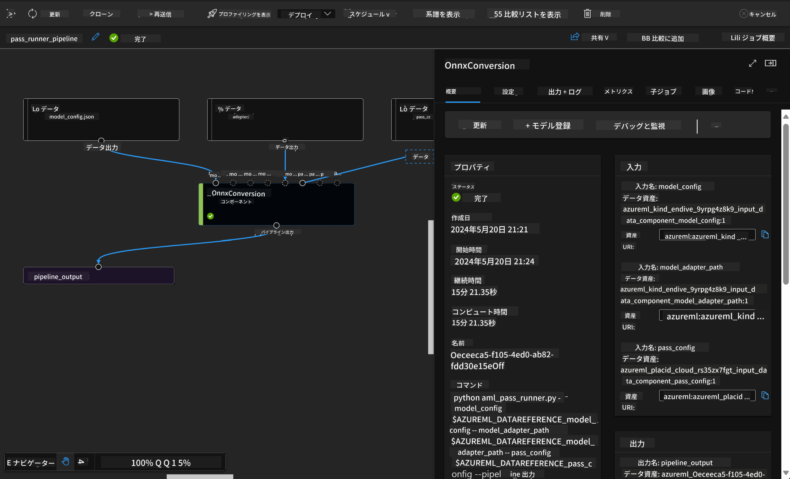

<!--
CO_OP_TRANSLATOR_METADATA:
{
  "original_hash": "7fe541373802e33568e94e13226d463c",
  "translation_date": "2025-05-08T05:17:55+00:00",
  "source_file": "md/03.FineTuning/Introduce_AzureML.md",
  "language_code": "ja"
}
-->
# **Azure Machine Learning Serviceの紹介**

[Azure Machine Learning](https://ml.azure.com?WT.mc_id=aiml-138114-kinfeylo) は、機械学習（ML）プロジェクトのライフサイクルを加速・管理するためのクラウドサービスです。

MLの専門家、データサイエンティスト、エンジニアは日々のワークフローで以下のことに利用できます：

- モデルのトレーニングとデプロイ。
- 機械学習運用（MLOps）の管理。
- Azure Machine Learningでモデルを作成することも、PyTorch、TensorFlow、scikit-learnなどのオープンソースプラットフォームで構築されたモデルを使用することも可能です。
- MLOpsツールを使ってモデルの監視、再トレーニング、再デプロイができます。

## Azure Machine Learningは誰のためのもの？

**データサイエンティストとMLエンジニア**

日々の作業を加速・自動化するツールを利用できます。  
Azure MLは公平性、説明性、追跡性、監査性の機能を提供します。

**アプリケーション開発者**

モデルをアプリケーションやサービスにシームレスに統合できます。

**プラットフォーム開発者**

耐久性のあるAzure Resource Manager APIに支えられた強力なツール群を利用できます。  
これにより高度なMLツールの構築が可能です。

**企業**

Microsoft Azureクラウド上で作業する企業は、なじみのあるセキュリティと役割ベースのアクセス制御の恩恵を受けられます。  
プロジェクトを設定して、保護されたデータや特定の操作へのアクセスを管理できます。

## チーム全員の生産性向上

MLプロジェクトは多様なスキルセットを持つチームでの構築と維持が求められます。

Azure MLは以下のようなツールを提供しています：  
- 共有ノートブック、計算リソース、サーバーレスコンピュート、データ、環境を通じてチームでのコラボレーションが可能。  
- 公平性、説明性、追跡性、監査性を備えたモデルを開発し、系統と監査要件を満たせる。  
- 大規模に迅速かつ簡単にMLモデルをデプロイし、MLOpsで効率的に管理・ガバナンスできる。  
- 組み込みのガバナンス、セキュリティ、コンプライアンスを備え、どこでも機械学習のワークロードを実行可能。

## クロスコンパチブルなプラットフォームツール

MLチームの誰でも、自分の好みのツールを使って作業を進められます。  
高速な実験、ハイパーパラメータ調整、パイプライン構築、推論管理など、以下の馴染みのあるインターフェースが利用可能です：  
- Azure Machine Learning Studio  
- Python SDK (v2)  
- Azure CLI (v2)  
- Azure Resource Manager REST APIs  

モデルの洗練や開発サイクル全体でのコラボレーションの際には、Azure Machine Learning StudioのUI内でアセット、リソース、メトリクスを共有・検索できます。

## **Azure MLにおけるLLM/SLM**

Azure MLは多くのLLM/SLM関連機能を追加し、LLMOpsとSLMOpsを組み合わせて、企業全体の生成AI技術プラットフォームを構築しています。

### **モデルカタログ**

企業ユーザーはモデルカタログを通じて、異なるビジネスシナリオに応じたさまざまなモデルを展開でき、企業の開発者やユーザーがアクセスできるModel as Serviceとしてサービスを提供します。

Azure Machine Learning Studioのモデルカタログは、生成AIアプリケーションを構築するための幅広いモデルを発見・利用できるハブです。  
モデルカタログには、Azure OpenAIサービス、Mistral、Meta、Cohere、Nvidia、Hugging Face、そしてMicrosoftがトレーニングしたモデルなど、数百のモデルが含まれています。  
Microsoft以外のプロバイダーによるモデルはMicrosoftの製品利用規約に基づくNon-Microsoft Productsとして扱われ、モデルに付随する規約が適用されます。

### **ジョブパイプライン**

機械学習パイプラインの核となるのは、機械学習タスク全体を複数ステップのワークフローに分割することです。  
各ステップは独立して開発、最適化、設定、自動化できる管理可能なコンポーネントです。ステップ同士は明確に定義されたインターフェースでつながっています。  
Azure Machine Learningのパイプラインサービスは、パイプラインのステップ間の依存関係を自動的に調整します。

SLM / LLMのファインチューニングでは、パイプラインを使ってデータ、トレーニング、生成プロセスを管理できます。

### **Prompt flow**

Azure Machine Learning prompt flowを使うメリット  
Azure Machine Learning prompt flowは、アイデアの発案から実験、そして最終的に本番対応のLLMベースアプリケーションへの移行を支援する多彩な利点を提供します。

**プロンプトエンジニアリングの柔軟性**

- インタラクティブな作成体験：Azure Machine Learning prompt flowはフロー構造の視覚的表現を提供し、ユーザーがプロジェクトを理解しやすくナビゲートしやすくします。ノートブックのようなコーディング体験で効率的な開発とデバッグが可能です。  
- プロンプトチューニングのバリエーション：複数のプロンプトバリアントを作成・比較でき、反復的な改善を促進します。  
- 評価機能：組み込みの評価フローにより、プロンプトやフローの品質と効果を評価できます。  
- 豊富なリソース：内蔵ツール、サンプル、テンプレートのライブラリを備え、開発の出発点として創造性を刺激し、プロセスを加速します。

**LLMベースアプリケーションの企業対応**

- コラボレーション：複数ユーザーでの共同作業をサポートし、知識共有やバージョン管理を行えます。  
- オールインワンプラットフォーム：開発から評価、デプロイ、モニタリングまでプロンプトエンジニアリングの全工程を効率化。Azure Machine Learningエンドポイントとしてフローを簡単にデプロイし、リアルタイムでパフォーマンスを監視して最適運用と継続的改善を実現します。  
- Azure Machine Learning Enterprise Readiness Solutions：堅牢な企業対応ソリューションを活用し、安全でスケーラブルかつ信頼性の高い基盤を提供します。

Azure Machine Learning prompt flowにより、ユーザーはプロンプトエンジニアリングの柔軟性を最大限に発揮し、効果的に協力し、企業レベルのソリューションを活用して成功するLLMベースのアプリケーション開発・デプロイを実現できます。

Azure MLの計算能力、データ、各種コンポーネントを組み合わせることで、企業の開発者は自分たちのAIアプリケーションを簡単に構築できます。

**免責事項**：  
本書類はAI翻訳サービス[Co-op Translator](https://github.com/Azure/co-op-translator)を使用して翻訳されました。正確性には努めておりますが、自動翻訳には誤りや不正確な箇所が含まれる可能性があることをご了承ください。原文の母国語版が正式な情報源とみなされます。重要な情報については、専門の人間による翻訳を推奨いたします。本翻訳の利用により生じたいかなる誤解や誤訳についても、当方は一切責任を負いかねます。