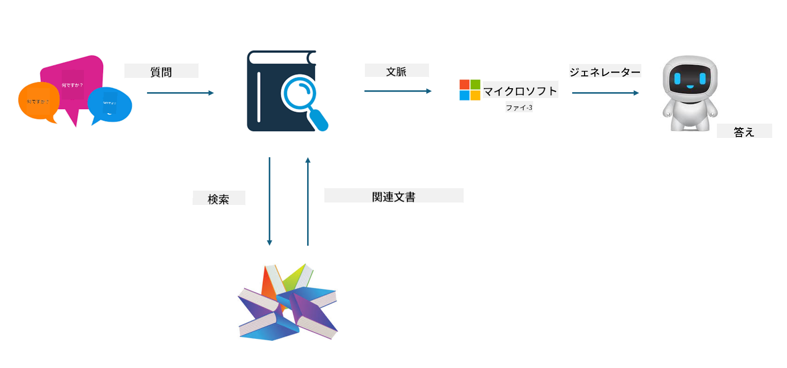
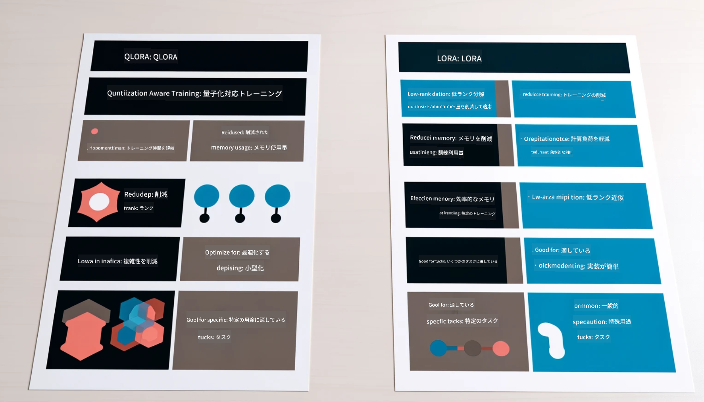

<!--
CO_OP_TRANSLATOR_METADATA:
{
  "original_hash": "ef0e3b9f4e65cc05e80efb30723aed40",
  "translation_date": "2025-04-04T13:35:16+00:00",
  "source_file": "md\\03.FineTuning\\LetPhi3gotoIndustriy.md",
  "language_code": "ja"
}
-->
# **Phi-3を業界の専門家にする**

Phi-3モデルを業界で活用するには、業界のビジネスデータをPhi-3モデルに追加する必要があります。これには2つの選択肢があります。1つ目はRAG（Retrieval Augmented Generation）、2つ目はFine-Tuningです。

## **RAGとFine-Tuningの比較**

### **Retrieval Augmented Generation**

RAGはデータ検索＋テキスト生成の手法です。企業の構造化データや非構造化データをベクターデータベースに保存します。関連するコンテンツを検索すると、要約や内容を見つけてコンテキストを形成し、LLM/SLMのテキスト生成能力と組み合わせてコンテンツを生成します。

### **Fine-Tuning**

Fine-Tuningは特定のモデルの改善に基づく方法です。モデルアルゴリズムから始める必要はありませんが、データを継続的に蓄積する必要があります。業界アプリケーションでより正確な専門用語や言語表現が必要な場合、Fine-Tuningがより適した選択となります。しかし、データが頻繁に変化する場合、Fine-Tuningは複雑になる可能性があります。

### **選択方法**

1. 回答に外部データの導入が必要な場合、RAGが最適な選択です。

2. 安定して正確な業界知識を出力する必要がある場合、Fine-Tuningが良い選択です。RAGは関連するコンテンツを優先して引き出しますが、専門的なニュアンスを完全に捉えられないことがあります。

3. Fine-Tuningには高品質なデータセットが必要で、データ範囲が小さい場合、大きな差は生じません。RAGはより柔軟です。

4. Fine-Tuningはブラックボックスのようなもので、内部メカニズムを理解するのが難しいですが、RAGはデータの出所を見つけやすく、幻覚やコンテンツの誤りを効果的に調整し、より良い透明性を提供します。

### **適用シナリオ**

1. 垂直産業で特定の専門用語や表現が必要な場合、***Fine-Tuning***が最適な選択です。

2. 異なる知識ポイントの統合を含むQAシステムでは、***RAG***が最適な選択です。

3. 自動化されたビジネスフローの組み合わせでは、***RAG + Fine-Tuning***が最適な選択です。

## **RAGの使い方**

ベクターデータベースは、数学的な形式でデータを保存するコレクションです。ベクターデータベースを使用すると、機械学習モデルが以前の入力を記憶しやすくなり、検索、推薦、テキスト生成などのユースケースをサポートするために機械学習を活用できます。データは完全一致ではなく類似性指標に基づいて識別されるため、コンピュータモデルがデータのコンテキストを理解しやすくなります。

ベクターデータベースはRAGを実現する鍵です。text-embedding-3やjina-ai-embeddingなどのベクトルモデルを通じてデータをベクトル形式に変換できます。

RAGアプリケーションの作成方法について詳しくは[https://github.com/microsoft/Phi-3CookBook](https://github.com/microsoft/Phi-3CookBook?WT.mc_id=aiml-138114-kinfeylo)をご覧ください。

## **Fine-Tuningの使い方**

Fine-Tuningで一般的に使用されるアルゴリズムはLoraとQLoraです。どちらを選ぶべきか？
- [このサンプルノートブックでさらに学ぶ](../../../../code/04.Finetuning/Phi_3_Inference_Finetuning.ipynb)
- [Python FineTuningのサンプル例](../../../../code/04.Finetuning/FineTrainingScript.py)

### **LoraとQLora**

LoRA（Low-Rank Adaptation）とQLoRA（Quantized Low-Rank Adaptation）は、Parameter Efficient Fine Tuning（PEFT）を使用して大規模言語モデル（LLM）を微調整するための技術です。PEFT技術は、従来の方法より効率的にモデルをトレーニングするよう設計されています。

LoRAは、重み更新行列に低ランク近似を適用することでメモリ使用量を削減する独立した微調整技術です。トレーニング時間が短く、従来の微調整方法に近い性能を維持します。

QLoRAはLoRAを拡張したバージョンで、量子化技術を組み込むことでさらにメモリ使用量を削減します。QLoRAは事前トレーニングされたLLMの重みパラメータを4ビット精度に量子化し、LoRAよりもメモリ効率が高いです。ただし、量子化と非量子化のステップが追加されるため、QLoRAのトレーニングはLoRAのトレーニングより約30％遅くなります。

QLoRAは、量子化による誤差を修正するためにLoRAを補助的に使用します。QLoRAは、数十億のパラメータを持つ巨大モデルを、比較的小規模で利用可能なGPU上で微調整できるようにします。例えば、QLoRAは70Bパラメータモデルを36台のGPUではなく、わずか2台のGPUで微調整することが可能です。

**免責事項**:  
この文書は、AI翻訳サービス [Co-op Translator](https://github.com/Azure/co-op-translator) を使用して翻訳されています。正確性を追求しておりますが、自動翻訳には誤りや不正確な部分が含まれる可能性があります。元の言語で記載された文書が正式な情報源として考慮されるべきです。重要な情報については、専門の人間による翻訳を推奨します。この翻訳の使用に起因する誤解や誤読について、当社は一切責任を負いません。