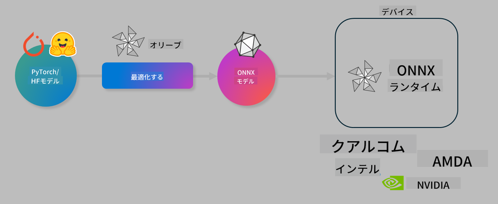

<!--
CO_OP_TRANSLATOR_METADATA:
{
  "original_hash": "76956c0c22e5686908a6d85ec72126af",
  "translation_date": "2025-04-04T13:37:28+00:00",
  "source_file": "md\\03.FineTuning\\olive-lab\\readme.md",
  "language_code": "ja"
}
-->
# ラボ. AIモデルをデバイス上の推論向けに最適化

## はじめに

> [!IMPORTANT]
> このラボでは、**Nvidia A10またはA100 GPU**と、それに対応するドライバおよびCUDAツールキット（バージョン12以上）が必要です。

> [!NOTE]
> このラボは**35分**で完了できる内容で、OLIVEを使用してデバイス上での推論向けにモデルを最適化する基本的な概念を実践的に学べます。

## 学習目標

このラボの終了時には、OLIVEを使用して以下のことができるようになります:

- AWQ量子化法を用いてAIモデルを量子化する。
- 特定のタスク向けにAIモデルを微調整する。
- ONNX Runtimeで効率的なデバイス上推論を実現するためのLoRAアダプタ（微調整モデル）を生成する。

### Oliveとは

Olive (*O*NNX *live*)は、ONNX Runtime +++https://onnxruntime.ai+++向けのモデル最適化ツールキットであり、CLIを備えています。このツールを使用すると、高品質かつ高性能なモデルを提供できます。



Oliveの入力は通常PyTorchまたはHugging Faceモデルであり、出力はデバイス（デプロイメントターゲット）上でONNX Runtimeを実行するために最適化されたONNXモデルです。Oliveは、Qualcomm、AMD、Nvidia、Intelなどのハードウェアベンダーが提供するデプロイメントターゲットのAIアクセラレータ（NPU、GPU、CPU）向けにモデルを最適化します。

Oliveは*ワークフロー*を実行します。これは、*パス*と呼ばれる個別のモデル最適化タスクが順序付けられたシーケンスです。例として、モデル圧縮、グラフキャプチャ、量子化、グラフ最適化などがあります。各パスには、精度やレイテンシーといった最適なメトリクスを達成するために調整可能なパラメータが設定されています。Oliveは、検索アルゴリズムを使用して各パスを個別に、または一連のパスをまとめて自動調整する検索戦略を採用しています。

#### Oliveのメリット

- **試行錯誤による手動実験のストレスと時間を削減**。グラフ最適化、圧縮、量子化のさまざまな技術を試す必要がなくなります。品質と性能の制約を定義するだけで、Oliveが最適なモデルを自動的に見つけます。
- **40以上の組み込みモデル最適化コンポーネント**により、量子化、圧縮、グラフ最適化、微調整の最新技術を網羅。
- **簡単に使えるCLI**で、一般的なモデル最適化タスクをサポート。例えば、olive quantize、olive auto-opt、olive finetune。
- モデルのパッケージングとデプロイメントが組み込み。
- **マルチLoRAサービング**用モデルの生成をサポート。
- YAML/JSONを使用して、モデル最適化とデプロイメントタスクを編成するワークフローを構築。
- **Hugging Face**および**Azure AI**との統合。
- **キャッシュ機能**を搭載し、**コスト削減**を実現。

## ラボ手順
> [!NOTE]
> Azure AI Hubとプロジェクトをプロビジョニングし、Lab 1に従ってA100コンピュートをセットアップしてください。

### ステップ 0: Azure AI Computeへの接続

**VS Code**のリモート機能を使用してAzure AI Computeに接続します。

1. **VS Code**デスクトップアプリケーションを開きます。
1. **コマンドパレット**を**Shift+Ctrl+P**で開きます。
1. コマンドパレットで**AzureML - remote: Connect to compute instance in New Window**を検索します。
1. 画面の指示に従い、Lab 1で設定したAzure Subscription、Resource Group、Project、Compute名を選択してComputeに接続します。
1. Azure ML Computeノードに接続すると、**Visual Codeの左下**に表示されます `><Azure ML: Compute Name`

### ステップ 1: このリポジトリをクローン

VS Codeで**Ctrl+J**を押して新しいターミナルを開き、このリポジトリをクローンします。

ターミナルには以下のプロンプトが表示されます。

```
azureuser@computername:~/cloudfiles/code$ 
```
ソリューションをクローンします。

```bash
cd ~/localfiles
git clone https://github.com/microsoft/phi-3cookbook.git
```

### ステップ 2: VS Codeでフォルダを開く

ターミナルで以下のコマンドを実行すると、関連するフォルダが新しいウィンドウで開きます:

```bash
code phi-3cookbook/code/04.Finetuning/Olive-lab
```

または、**ファイル** > **フォルダを開く**を選択してフォルダを開くこともできます。

### ステップ 3: 依存関係のインストール

Azure AI Compute Instance内のVS Codeでターミナルウィンドウを開き（ヒント: **Ctrl+J**）、以下のコマンドを実行して依存関係をインストールします:

```bash
conda create -n olive-ai python=3.11 -y
conda activate olive-ai
pip install -r requirements.txt
az extension remove -n azure-cli-ml
az extension add -n ml
```

> [!NOTE]
> 依存関係のインストールには約5分かかります。

このラボでは、Azure AIモデルカタログにモデルをダウンロードおよびアップロードします。そのため、モデルカタログにアクセスするにはAzureにログインする必要があります:

```bash
az login
```

> [!NOTE]
> ログイン時にサブスクリプションを選択する必要があります。このラボで提供されているサブスクリプションを選択してください。

### ステップ 4: Oliveコマンドの実行

VS Codeのターミナルウィンドウで`olive-ai`コンダ環境がアクティブになっていることを確認してください:

```bash
conda activate olive-ai
```

次に、以下のOliveコマンドをコマンドラインで実行します。

1. **データの確認:** この例では、Phi-3.5-Miniモデルを微調整して旅行関連の質問に特化させます。以下のコードは、JSON lines形式のデータセットの最初の数件を表示します:
   
    ```bash
    head data/data_sample_travel.jsonl
    ```
1. **モデルの量子化:** モデルをトレーニングする前に、以下のコマンドを使用してActive Aware Quantization (AWQ) +++https://arxiv.org/abs/2306.00978+++という手法で量子化します。AWQは推論中に生成されるアクティベーションを考慮してモデルの重みを量子化します。このため、従来の重み量子化法と比較して、モデルの精度をより良く保持できます。
    
    ```bash
    olive quantize \
       --model_name_or_path microsoft/Phi-3.5-mini-instruct \
       --trust_remote_code \
       --algorithm awq \
       --output_path models/phi/awq \
       --log_level 1
    ```
    
    AWQ量子化には**約8分**かかり、モデルサイズを**約7.5GBから約2.5GB**に削減します。
   
   このラボでは、Hugging Faceからモデルを入力する方法を示します（例: `microsoft/Phi-3.5-mini-instruct`). However, Olive also allows you to input models from the Azure AI catalog by updating the `model_name_or_path` argument to an Azure AI asset ID (for example:  `azureml://registries/azureml/models/Phi-3.5-mini-instruct/versions/4`). 

1. **Train the model:** Next, the `olive finetune`コマンドで量子化されたモデルを微調整します。量子化後ではなく、微調整前にモデルを量子化することで、微調整プロセスが量子化による損失をある程度回復するため、より良い精度が得られます。
    
    ```bash
    olive finetune \
        --method lora \
        --model_name_or_path models/phi/awq \
        --data_files "data/data_sample_travel.jsonl" \
        --data_name "json" \
        --text_template "<|user|>\n{prompt}<|end|>\n<|assistant|>\n{response}<|end|>" \
        --max_steps 100 \
        --output_path ./models/phi/ft \
        --log_level 1
    ```
    
    微調整には**約6分**かかります（100ステップ）。

1. **最適化:** トレーニングされたモデルを使用して、Oliveの`auto-opt` command, which will capture the ONNX graph and automatically perform a number of optimizations to improve the model performance for CPU by compressing the model and doing fusions. It should be noted, that you can also optimize for other devices such as NPU or GPU by just updating the `--device` and `--provider`引数を使ってモデルを最適化します。ただし、このラボではCPUを使用します。

    ```bash
    olive auto-opt \
       --model_name_or_path models/phi/ft/model \
       --adapter_path models/phi/ft/adapter \
       --device cpu \
       --provider CPUExecutionProvider \
       --use_ort_genai \
       --output_path models/phi/onnx-ao \
       --log_level 1
    ```
    
    最適化には**約5分**かかります。

### ステップ 5: モデル推論の簡易テスト

モデルの推論をテストするには、**app.py**という名前のPythonファイルをフォルダ内に作成し、以下のコードをコピーして貼り付けます:

```python
import onnxruntime_genai as og
import numpy as np

print("loading model and adapters...", end="", flush=True)
model = og.Model("models/phi/onnx-ao/model")
adapters = og.Adapters(model)
adapters.load("models/phi/onnx-ao/model/adapter_weights.onnx_adapter", "travel")
print("DONE!")

tokenizer = og.Tokenizer(model)
tokenizer_stream = tokenizer.create_stream()

params = og.GeneratorParams(model)
params.set_search_options(max_length=100, past_present_share_buffer=False)
user_input = "what is the best thing to see in chicago"
params.input_ids = tokenizer.encode(f"<|user|>\n{user_input}<|end|>\n<|assistant|>\n")

generator = og.Generator(model, params)

generator.set_active_adapter(adapters, "travel")

print(f"{user_input}")

while not generator.is_done():
    generator.compute_logits()
    generator.generate_next_token()

    new_token = generator.get_next_tokens()[0]
    print(tokenizer_stream.decode(new_token), end='', flush=True)

print("\n")
```

以下のコマンドでコードを実行します:

```bash
python app.py
```

### ステップ 6: モデルをAzure AIにアップロード

モデルをAzure AIモデルリポジトリにアップロードすると、開発チームの他のメンバーと共有可能になり、モデルのバージョン管理も行えます。モデルをアップロードするには、以下のコマンドを実行します:

> [!NOTE]
> `{}` placeholders with the name of your resource group and Azure AI Project Name. 

To find your resource group `"resourceGroup"`およびAzure AIプロジェクト名を更新して、以下のコマンドを実行してください。

```
az ml workspace show
```

または+++ai.azure.com+++にアクセスし、**管理センター** > **プロジェクト** > **概要**を選択してください。

`{}`プレースホルダーをリソースグループ名とAzure AIプロジェクト名で更新します。

```bash
az ml model create \
    --name ft-for-travel \
    --version 1 \
    --path ./models/phi/onnx-ao \
    --resource-group {RESOURCE_GROUP_NAME} \
    --workspace-name {PROJECT_NAME}
```
その後、アップロードされたモデルを確認し、https://ml.azure.com/model/list でモデルをデプロイできます。

**免責事項**:  
この文書は、AI翻訳サービス [Co-op Translator](https://github.com/Azure/co-op-translator) を使用して翻訳されています。正確性を追求していますが、自動翻訳には誤りや不正確さが含まれる場合があります。元の言語で書かれた文書を公式な情報源として考慮してください。重要な情報については、専門の人間による翻訳を推奨します。この翻訳の使用に起因する誤解や誤認について、当社は責任を負いません。