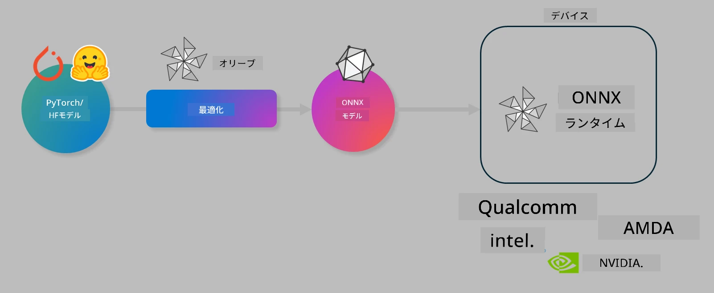

<!--
CO_OP_TRANSLATOR_METADATA:
{
  "original_hash": "6bbe47de3b974df7eea29dfeccf6032b",
  "translation_date": "2025-07-17T10:14:53+00:00",
  "source_file": "md/03.FineTuning/olive-lab/readme.md",
  "language_code": "ja"
}
-->
# Lab. デバイス上推論向けAIモデルの最適化

## はじめに

> [!IMPORTANT]  
> このラボでは、**Nvidia A10またはA100 GPU**と対応するドライバーおよびCUDAツールキット（バージョン12以上）が必要です。

> [!NOTE]  
> このラボは**35分間**で、OLIVEを使ったデバイス上推論向けモデル最適化の基本概念を実践的に学べます。

## 学習目標

このラボを終えると、OLIVEを使って以下ができるようになります：

- AWQ量子化手法を用いたAIモデルの量子化
- 特定タスク向けのAIモデルのファインチューニング
- ONNX Runtime上で効率的に動作するLoRAアダプター（ファインチューニング済みモデル）の生成

### Oliveとは何か

Olive（*O*NNX *live*）は、ONNX Runtime +++https://onnxruntime.ai+++ 向けにモデルの品質と性能を両立させて提供できるモデル最適化ツールキットで、CLIも付属しています。



Oliveの入力は通常PyTorchやHugging Faceのモデルで、出力はONNX Runtimeを実行するデバイス（展開先）上で動作する最適化済みONNXモデルです。OliveはQualcomm、AMD、Nvidia、Intelなどのハードウェアベンダーが提供するAIアクセラレータ（NPU、GPU、CPU）に合わせてモデルを最適化します。

Oliveは*ワークフロー*を実行します。これは*パス*と呼ばれる個別のモデル最適化タスクの順序付けられた連続処理です。例として、モデル圧縮、グラフキャプチャ、量子化、グラフ最適化などがあります。各パスにはパラメータがあり、精度やレイテンシなどの評価指標を最適化するために調整可能です。Oliveは探索アルゴリズムを用いて、各パスまたは複数パスを自動でチューニングします。

#### Oliveのメリット

- グラフ最適化、圧縮、量子化の手法を試行錯誤する手間と時間を大幅に削減。品質と性能の制約を設定すれば、Oliveが最適なモデルを自動で見つけます。
- 量子化、圧縮、グラフ最適化、ファインチューニングの最先端技術をカバーする**40以上の組み込みモデル最適化コンポーネント**。
- 一般的なモデル最適化タスク向けの使いやすいCLI（例：olive quantize、olive auto-opt、olive finetune）。
- モデルのパッケージングと展開機能を内蔵。
- **マルチLoRAサービング**用モデルの生成をサポート。
- YAML/JSONでワークフローを構築し、モデル最適化と展開タスクをオーケストレーション可能。
- **Hugging Face**および**Azure AI**との統合。
- コスト削減に役立つ**キャッシュ機構**を内蔵。

## ラボ手順

> [!NOTE]  
> Azure AI Hubとプロジェクトの準備、Lab 1に従ったA100コンピュートのセットアップを済ませてください。

### ステップ0: Azure AI Computeへの接続

**VS Code**のリモート機能を使ってAzure AI Computeに接続します。

1. **VS Code**デスクトップアプリを開く  
1. **Shift+Ctrl+P**でコマンドパレットを開く  
1. コマンドパレットで **AzureML - remote: Connect to compute instance in New Window** を検索  
1. 画面の指示に従い、Azureサブスクリプション、リソースグループ、プロジェクト、Lab 1で設定したコンピュート名を選択して接続  
1. 接続が完了すると、Visual Studio Codeの左下に `><Azure ML: Compute Name` と表示されます

### ステップ1: リポジトリのクローン

VS Codeで**Ctrl+J**を押して新しいターミナルを開き、以下のコマンドでリポジトリをクローンします。

ターミナルに以下のプロンプトが表示されます。

```
azureuser@computername:~/cloudfiles/code$ 
```  
ソリューションをクローン

```bash
cd ~/localfiles
git clone https://github.com/microsoft/phi-3cookbook.git
```

### ステップ2: VS Codeでフォルダを開く

以下のコマンドをターミナルで実行すると、新しいウィンドウで該当フォルダが開きます。

```bash
code phi-3cookbook/code/04.Finetuning/Olive-lab
```

または、**ファイル** > **フォルダーを開く** から手動で開くことも可能です。

### ステップ3: 依存関係のインストール

Azure AI ComputeインスタンスのVS Codeターミナル（ヒント：**Ctrl+J**）で以下のコマンドを実行し、依存関係をインストールします。

```bash
conda create -n olive-ai python=3.11 -y
conda activate olive-ai
pip install -r requirements.txt
az extension remove -n azure-cli-ml
az extension add -n ml
```

> [!NOTE]  
> 依存関係のインストールには約5分かかります。

このラボではモデルをAzure AIモデルカタログからダウンロード・アップロードします。モデルカタログにアクセスするため、以下のコマンドでAzureにログインしてください。

```bash
az login
```

> [!NOTE]  
> ログイン時にサブスクリプションの選択を求められます。ラボで指定されたサブスクリプションを選択してください。

### ステップ4: Oliveコマンドの実行

Azure AI ComputeインスタンスのVS Codeターミナル（ヒント：**Ctrl+J**）で`olive-ai`のconda環境がアクティブになっていることを確認します。

```bash
conda activate olive-ai
```

次に、以下のOliveコマンドを順に実行します。

1. **データの確認:** ここではPhi-3.5-Miniモデルを旅行関連の質問に特化させるためにファインチューニングします。以下のコードはJSON Lines形式のデータセットの最初の数件を表示します。

    ```bash
    head data/data_sample_travel.jsonl
    ```

1. **モデルの量子化:** トレーニング前に、Active Aware Quantization (AWQ) +++https://arxiv.org/abs/2306.00978+++ を使って量子化します。AWQは推論時の活性化を考慮してモデルの重みを量子化するため、従来の重み量子化よりも精度をよく保てます。

    ```bash
    olive quantize \
       --model_name_or_path microsoft/Phi-3.5-mini-instruct \
       --trust_remote_code \
       --algorithm awq \
       --output_path models/phi/awq \
       --log_level 1
    ```

    AWQ量子化は**約8分**かかり、モデルサイズは**約7.5GBから約2.5GBに削減**されます。

    このラボではHugging Faceのモデル（例：`microsoft/Phi-3.5-mini-instruct`）を入力例として示していますが、`model_name_or_path`引数をAzure AIのアセットID（例：`azureml://registries/azureml/models/Phi-3.5-mini-instruct/versions/4`）に変更すればAzure AIカタログのモデルも入力可能です。

1. **モデルのトレーニング:** 次に`olive finetune`コマンドで量子化済みモデルをファインチューニングします。量子化後にファインチューニングするよりも、先に量子化してからファインチューニングした方が精度が向上します。これはファインチューニングが量子化による損失をある程度回復するためです。

    ```bash
    olive finetune \
        --method lora \
        --model_name_or_path models/phi/awq \
        --data_files "data/data_sample_travel.jsonl" \
        --data_name "json" \
        --text_template "<|user|>\n{prompt}<|end|>\n<|assistant|>\n{response}<|end|>" \
        --max_steps 100 \
        --output_path ./models/phi/ft \
        --log_level 1
    ```

    ファインチューニングは**約6分**（100ステップ）かかります。

1. **最適化:** トレーニング済みモデルを`auto-opt`コマンドで最適化します。ONNXグラフをキャプチャし、モデル圧縮や融合など複数の最適化を自動で行い、CPU向けに性能を向上させます。なお、`--device`や`--provider`引数を変更すればNPUやGPU向けにも最適化可能ですが、このラボではCPUを使用します。

    ```bash
    olive auto-opt \
       --model_name_or_path models/phi/ft/model \
       --adapter_path models/phi/ft/adapter \
       --device cpu \
       --provider CPUExecutionProvider \
       --use_ort_genai \
       --output_path models/phi/onnx-ao \
       --log_level 1
    ```

    最適化には**約5分**かかります。

### ステップ5: モデル推論の簡単なテスト

モデル推論をテストするため、フォルダ内に**app.py**というPythonファイルを作成し、以下のコードをコピー＆ペーストしてください。

```python
import onnxruntime_genai as og
import numpy as np

print("loading model and adapters...", end="", flush=True)
model = og.Model("models/phi/onnx-ao/model")
adapters = og.Adapters(model)
adapters.load("models/phi/onnx-ao/model/adapter_weights.onnx_adapter", "travel")
print("DONE!")

tokenizer = og.Tokenizer(model)
tokenizer_stream = tokenizer.create_stream()

params = og.GeneratorParams(model)
params.set_search_options(max_length=100, past_present_share_buffer=False)
user_input = "what is the best thing to see in chicago"
params.input_ids = tokenizer.encode(f"<|user|>\n{user_input}<|end|>\n<|assistant|>\n")

generator = og.Generator(model, params)

generator.set_active_adapter(adapters, "travel")

print(f"{user_input}")

while not generator.is_done():
    generator.compute_logits()
    generator.generate_next_token()

    new_token = generator.get_next_tokens()[0]
    print(tokenizer_stream.decode(new_token), end='', flush=True)

print("\n")
```

以下のコマンドで実行します。

```bash
python app.py
```

### ステップ6: モデルのAzure AIへのアップロード

モデルをAzure AIモデルリポジトリにアップロードすると、開発チーム内で共有でき、モデルのバージョン管理も行えます。アップロードには以下のコマンドを実行してください。

> [!NOTE]  
> `{}`の部分はご自身のリソースグループ名とAzure AIプロジェクト名に置き換えてください。

リソースグループ名とAzure AIプロジェクト名を確認するには、以下のコマンドを実行するか、

```
az ml workspace show
```

+++ai.azure.com+++ にアクセスし、**管理センター** > **プロジェクト** > **概要**からも確認できます。

`{}`の部分をリソースグループ名とAzure AIプロジェクト名に置き換えてください。

```bash
az ml model create \
    --name ft-for-travel \
    --version 1 \
    --path ./models/phi/onnx-ao \
    --resource-group {RESOURCE_GROUP_NAME} \
    --workspace-name {PROJECT_NAME}
```

アップロードしたモデルは https://ml.azure.com/model/list で確認・展開できます。

**免責事項**：  
本書類はAI翻訳サービス「[Co-op Translator](https://github.com/Azure/co-op-translator)」を使用して翻訳されました。正確性を期しておりますが、自動翻訳には誤りや不正確な部分が含まれる可能性があります。原文の言語による文書が正式な情報源とみなされるべきです。重要な情報については、専門の人間による翻訳を推奨します。本翻訳の利用により生じた誤解や誤訳について、当方は一切の責任を負いかねます。