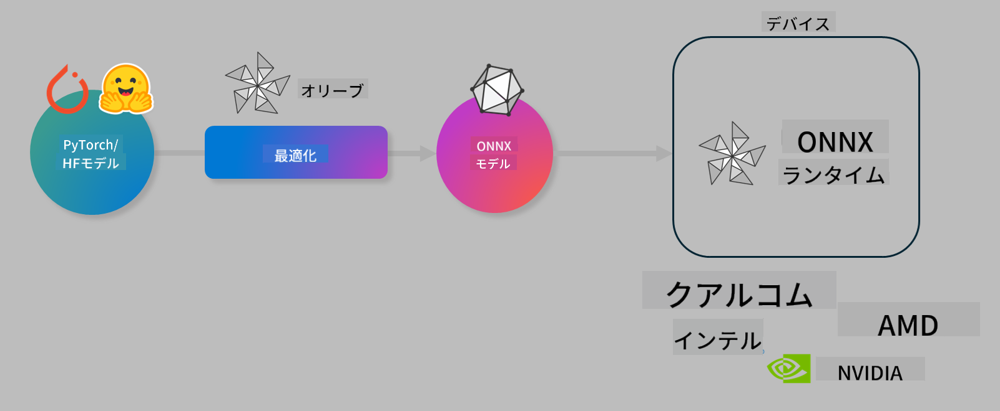

<!--
CO_OP_TRANSLATOR_METADATA:
{
  "original_hash": "6bbe47de3b974df7eea29dfeccf6032b",
  "translation_date": "2025-05-08T05:23:41+00:00",
  "source_file": "md/03.FineTuning/olive-lab/readme.md",
  "language_code": "ja"
}
-->
# Lab. オンデバイス推論向けAIモデルの最適化

## はじめに

> [!IMPORTANT]
> このラボでは、**Nvidia A10またはA100 GPU** と対応するドライバーおよびCUDAツールキット（バージョン12以上）が必要です。

> [!NOTE]
> このラボは**35分間**のハンズオンで、OLIVEを使ったオンデバイス推論向けモデル最適化の基本概念を学べます。

## 学習目標

このラボの終了時には、OLIVEを使って以下ができるようになります：

- AWQ量子化手法を用いたAIモデルの量子化
- 特定タスク向けのAIモデルのファインチューニング
- ONNX Runtime上で効率的に動作するLoRAアダプター（ファインチューニング済みモデル）の生成

### Oliveとは何か

Olive（*O*NNX *live*）は、ONNX runtime +++https://onnxruntime.ai+++ 向けにモデルの品質とパフォーマンスを保ちながら出荷できるモデル最適化ツールキットとCLIです。



Oliveの入力は通常PyTorchまたはHugging Faceのモデルで、出力はONNX runtimeが動作するデバイス（デプロイ先）上で実行される最適化済みONNXモデルです。OliveはQualcomm、AMD、Nvidia、Intelなどのハードウェアベンダーが提供するAIアクセラレータ（NPU、GPU、CPU）に合わせてモデルを最適化します。

Oliveは*workflow*と呼ばれる、順序付けられた一連の個別モデル最適化タスク（*passes*）を実行します。例としては、モデル圧縮、グラフキャプチャ、量子化、グラフ最適化などがあります。各passにはパラメータがあり、精度やレイテンシなどの指標を評価するevaluatorによって最適化されます。Oliveは探索アルゴリズムを用いて、各passまたは複数のpassを自動でチューニングします。

#### Oliveのメリット

- グラフ最適化、圧縮、量子化の手法を試行錯誤する手間と時間を**大幅に削減**。品質とパフォーマンスの制約を設定すれば、Oliveが最適なモデルを自動で見つけます。
- 量子化、圧縮、グラフ最適化、ファインチューニングなどの最先端技術を網羅した**40以上の組み込み最適化コンポーネント**。
- 一般的なモデル最適化タスク用の使いやすいCLI（例：olive quantize、olive auto-opt、olive finetune）。
- モデルのパッケージングとデプロイ機能内蔵。
- **Multi LoRAサービング**向けモデルの生成をサポート。
- YAML/JSONでワークフローを構築し、モデル最適化とデプロイタスクをオーケストレーション可能。
- **Hugging Face**および**Azure AI**との統合。
- コスト削減につながる**キャッシュ機構**を内蔵。

## ラボ手順

> [!NOTE]
> Azure AI Hubとプロジェクトを用意し、Lab 1の手順に従ってA100コンピュートをセットアップ済みであることを確認してください。

### ステップ0: Azure AI Computeに接続

VS Codeのリモート機能を使ってAzure AI Computeに接続します。

1. **VS Code**デスクトップアプリを開く。
1. **Shift+Ctrl+P**でコマンドパレットを開く。
1. コマンドパレットで **AzureML - remote: Connect to compute instance in New Window** を検索。
1. 画面の指示に従い、Azureサブスクリプション、リソースグループ、プロジェクト、Lab 1で設定したコンピュート名を選択して接続。
1. 接続が成功すると、VS Codeの左下にAzure ML Computeノード名が表示されます。`><Azure ML: Compute Name`

### ステップ1: リポジトリのクローン

VS Codeで**Ctrl+J**で新しいターミナルを開き、このリポジトリをクローンします。

ターミナルに以下のプロンプトが表示されます。

```
azureuser@computername:~/cloudfiles/code$ 
```  
ソリューションをクローン

```bash
cd ~/localfiles
git clone https://github.com/microsoft/phi-3cookbook.git
```

### ステップ2: VS Codeでフォルダーを開く

以下のコマンドをターミナルで実行すると、新しいウィンドウでフォルダーが開きます。

```bash
code phi-3cookbook/code/04.Finetuning/Olive-lab
```

または、**ファイル** > **フォルダーを開く** からフォルダーを選択して開くことも可能です。

### ステップ3: 依存関係のインストール

Azure AI ComputeインスタンスのVS Codeターミナル（ヒント：**Ctrl+J**）で以下のコマンドを実行し、依存関係をインストールします。

```bash
conda create -n olive-ai python=3.11 -y
conda activate olive-ai
pip install -r requirements.txt
az extension remove -n azure-cli-ml
az extension add -n ml
```

> [!NOTE]
> 依存関係のインストールには約5分かかります。

このラボではAzure AIモデルカタログからモデルをダウンロード・アップロードします。モデルカタログにアクセスするため、以下のコマンドでAzureにログインしてください。

```bash
az login
```

> [!NOTE]
> ログイン時にサブスクリプションの選択を求められます。ラボで指定されたサブスクリプションを選択してください。

### ステップ4: Oliveコマンドの実行

Azure AI ComputeインスタンスのVS Codeターミナル（ヒント：**Ctrl+J**）で `olive-ai` conda環境がアクティブになっていることを確認します。

```bash
conda activate olive-ai
```

次に、以下のOliveコマンドを実行します。

1. **データの確認:** この例ではPhi-3.5-Miniモデルを旅行関連の質問に特化させるためにファインチューニングします。以下のコードはJSON lines形式のデータセットの最初の数レコードを表示します。

    ```bash
    head data/data_sample_travel.jsonl
    ```

1. **モデルの量子化:** トレーニング前に、Active Aware Quantization (AWQ) +++https://arxiv.org/abs/2306.00978+++ という手法を使って量子化を行います。AWQは推論時の活性化値を考慮してモデルの重みを量子化するため、従来の重み量子化よりも精度をより良く保持します。

    ```bash
    olive quantize \
       --model_name_or_path microsoft/Phi-3.5-mini-instruct \
       --trust_remote_code \
       --algorithm awq \
       --output_path models/phi/awq \
       --log_level 1
    ```

    AWQ量子化には**約8分**かかり、モデルサイズは約7.5GBから約2.5GBに**削減**されます。

    このラボではHugging Faceからモデルを入力しています（例：`microsoft/Phi-3.5-mini-instruct`). However, Olive also allows you to input models from the Azure AI catalog by updating the `model_name_or_path` argument to an Azure AI asset ID (for example:  `azureml://registries/azureml/models/Phi-3.5-mini-instruct/versions/4`). 

1. **Train the model:** Next, the `olive finetune` コマンドで量子化済みモデルをファインチューニングします）。ファインチューニング前に量子化することで、量子化による精度低下の一部を回復でき、より良い精度が得られます。

    ```bash
    olive finetune \
        --method lora \
        --model_name_or_path models/phi/awq \
        --data_files "data/data_sample_travel.jsonl" \
        --data_name "json" \
        --text_template "<|user|>\n{prompt}<|end|>\n<|assistant|>\n{response}<|end|>" \
        --max_steps 100 \
        --output_path ./models/phi/ft \
        --log_level 1
    ```

    ファインチューニング（100ステップ）には**約6分**かかります。

1. **最適化:** トレーニング済みモデルを、Oliveの `auto-opt` command, which will capture the ONNX graph and automatically perform a number of optimizations to improve the model performance for CPU by compressing the model and doing fusions. It should be noted, that you can also optimize for other devices such as NPU or GPU by just updating the `--device` and `--provider` 引数を使って最適化しますが、このラボではCPUを使います。

    ```bash
    olive auto-opt \
       --model_name_or_path models/phi/ft/model \
       --adapter_path models/phi/ft/adapter \
       --device cpu \
       --provider CPUExecutionProvider \
       --use_ort_genai \
       --output_path models/phi/onnx-ao \
       --log_level 1
    ```

    最適化には**約5分**かかります。

### ステップ5: モデル推論の簡易テスト

モデル推論をテストするため、フォルダー内に **app.py** というPythonファイルを作成し、以下のコードをコピー＆ペーストしてください。

```python
import onnxruntime_genai as og
import numpy as np

print("loading model and adapters...", end="", flush=True)
model = og.Model("models/phi/onnx-ao/model")
adapters = og.Adapters(model)
adapters.load("models/phi/onnx-ao/model/adapter_weights.onnx_adapter", "travel")
print("DONE!")

tokenizer = og.Tokenizer(model)
tokenizer_stream = tokenizer.create_stream()

params = og.GeneratorParams(model)
params.set_search_options(max_length=100, past_present_share_buffer=False)
user_input = "what is the best thing to see in chicago"
params.input_ids = tokenizer.encode(f"<|user|>\n{user_input}<|end|>\n<|assistant|>\n")

generator = og.Generator(model, params)

generator.set_active_adapter(adapters, "travel")

print(f"{user_input}")

while not generator.is_done():
    generator.compute_logits()
    generator.generate_next_token()

    new_token = generator.get_next_tokens()[0]
    print(tokenizer_stream.decode(new_token), end='', flush=True)

print("\n")
```

以下のコマンドでコードを実行します。

```bash
python app.py
```

### ステップ6: モデルをAzure AIにアップロード

モデルをAzure AIモデルリポジトリにアップロードすると、開発チーム内で共有でき、モデルのバージョン管理も行えます。アップロードするには以下のコマンドを実行してください。

> [!NOTE]
> `{}`の部分をリソースグループ名とAzure AIプロジェクト名に更新して実行してください。

```
az ml workspace show
```

または +++ai.azure.com+++ にアクセスし、**management center** > **project** > **overview** から操作可能です。

`{}`のプレースホルダーをリソースグループ名とAzure AIプロジェクト名に置き換えてください。

```bash
az ml model create \
    --name ft-for-travel \
    --version 1 \
    --path ./models/phi/onnx-ao \
    --resource-group {RESOURCE_GROUP_NAME} \
    --workspace-name {PROJECT_NAME}
```

アップロードしたモデルは https://ml.azure.com/model/list で確認およびデプロイできます。

**免責事項**：  
本書類はAI翻訳サービス「Co-op Translator」（https://github.com/Azure/co-op-translator）を使用して翻訳されました。正確性には努めておりますが、自動翻訳には誤りや不正確な箇所が含まれる可能性があることをご承知ください。原文の母国語版が正式な情報源として優先されます。重要な情報については、専門の人間による翻訳を推奨します。本翻訳の利用により生じた誤解や解釈の違いについて、当方は一切の責任を負いかねます。