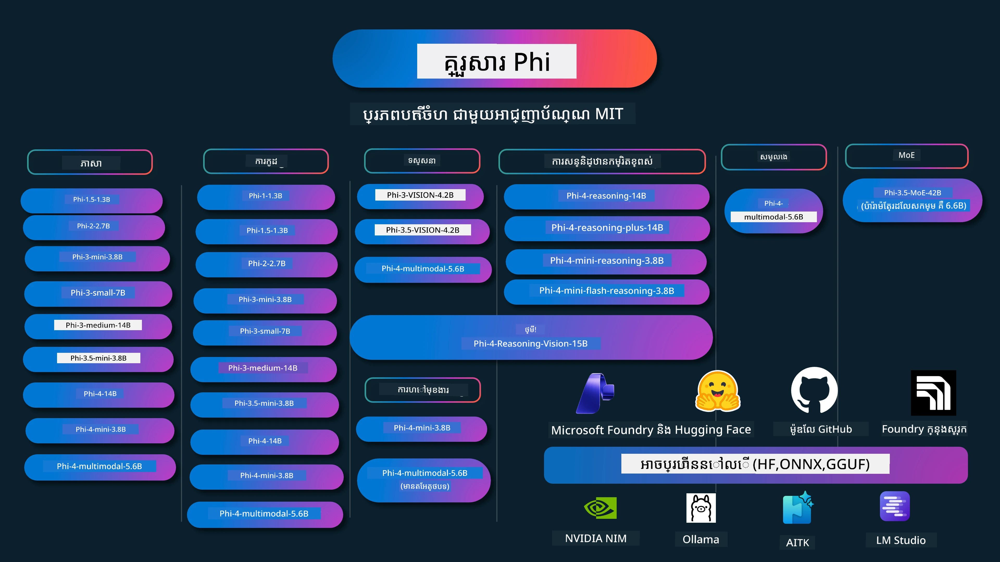

# សៀវភៅម្ហូប Phi: ឧទាហរណ៍សកម្មជាមួយម៉ូដែល Phi របស់ Microsoft

[](https://codespaces.new/microsoft/phicookbook)
[](https://vscode.dev/redirect?url=vscode://ms-vscode-remote.remote-containers/cloneInVolume?url=https://github.com/microsoft/phicookbook)

[](https://GitHub.com/microsoft/phicookbook/graphs/contributors/?WT.mc_id=aiml-137032-kinfeylo)
[](https://GitHub.com/microsoft/phicookbook/issues/?WT.mc_id=aiml-137032-kinfeylo)
[](https://GitHub.com/microsoft/phicookbook/pulls/?WT.mc_id=aiml-137032-kinfeylo)
[](http://makeapullrequest.com?WT.mc_id=aiml-137032-kinfeylo)

[](https://GitHub.com/microsoft/phicookbook/watchers/?WT.mc_id=aiml-137032-kinfeylo)
[](https://GitHub.com/microsoft/phicookbook/network/?WT.mc_id=aiml-137032-kinfeylo)
[](https://GitHub.com/microsoft/phicookbook/stargazers/?WT.mc_id=aiml-137032-kinfeylo)

[](https://discord.com/invite/ByRwuEEgH4)

Phi គឺជាស៊េរីនៃម៉ូដែល AI ពិភពបើកដែលបានអភិវឌ្ឍដោយ Microsoft។

Phi គឺជា ម៉ូដែលភាសាស្រាល (SLM) ដែលមានសមត្ថភាពខ្លាំងបំផុត និងតម្លៃប្រកួតប្រជែងបំផុត នៅពេលនេះ ជាមួយនឹងកំណត់ត្រាល្អណាស់ ចំពោះភាសាច្រើន ការយល់ដឹង ការបង្កើតអត្ថបទ/សន្ទនា កូដ អំពីរូបភាព សម្លេង និងស្ថានភាពផ្សេងៗទៀត។

អ្នកអាចចេញផ្សាយ Phi ទៅមេឃ ឬឧបករណ៍មុខគេ ហើយអ្នកអាចសង់កម្មវិធី AI បង្កើតដោយយ៉ាងងាយស្រួលជាមួយថាមពលកុំព្យូទ័ររឹងកំណត់។

អនុវត្តជំហានទាំងនេះដើម្បីចាប់ផ្តើមប្រើប្រាស់ធនធានទាំងនេះ៖  
1. **ស៊ើបអង្កេត Repository**: ចុច [](https://GitHub.com/microsoft/phicookbook/network/?WT.mc_id=aiml-137032-kinfeylo)  
2. **ចម្លង Repository**:   `git clone https://github.com/microsoft/PhiCookBook.git`  
3. [**ចូលរួមជាមួយសហគមន៍ Microsoft AI Discord ហើយជួបជាមួយអ្នកជំនាញ និងអ្នកអភិវឌ្ឍន៍មិត្តភក្តិ**](https://discord.com/invite/ByRwuEEgH4?WT.mc_id=aiml-137032-kinfeylo)



### 🌐 ការគាំទ្រជាភាសាច្រើន

#### គាំទ្រដោយ GitHub Action (ស្វ័យប្រវត្តិ និងជាទៀងទាត់ទាន់សម័យ)

<!-- CO-OP TRANSLATOR LANGUAGES TABLE START -->
[Arabic](../ar/README.md) | [Bengali](../bn/README.md) | [Bulgarian](../bg/README.md) | [Burmese (Myanmar)](../my/README.md) | [Chinese (Simplified)](../zh-CN/README.md) | [Chinese (Traditional, Hong Kong)](../zh-HK/README.md) | [Chinese (Traditional, Macau)](../zh-MO/README.md) | [Chinese (Traditional, Taiwan)](../zh-TW/README.md) | [Croatian](../hr/README.md) | [Czech](../cs/README.md) | [Danish](../da/README.md) | [Dutch](../nl/README.md) | [Estonian](../et/README.md) | [Finnish](../fi/README.md) | [French](../fr/README.md) | [German](../de/README.md) | [Greek](../el/README.md) | [Hebrew](../he/README.md) | [Hindi](../hi/README.md) | [Hungarian](../hu/README.md) | [Indonesian](../id/README.md) | [Italian](../it/README.md) | [Japanese](../ja/README.md) | [Kannada](../kn/README.md) | [Khmer](./README.md) | [Korean](../ko/README.md) | [Lithuanian](../lt/README.md) | [Malay](../ms/README.md) | [Malayalam](../ml/README.md) | [Marathi](../mr/README.md) | [Nepali](../ne/README.md) | [Nigerian Pidgin](../pcm/README.md) | [Norwegian](../no/README.md) | [Persian (Farsi)](../fa/README.md) | [Polish](../pl/README.md) | [Portuguese (Brazil)](../pt-BR/README.md) | [Portuguese (Portugal)](../pt-PT/README.md) | [Punjabi (Gurmukhi)](../pa/README.md) | [Romanian](../ro/README.md) | [Russian](../ru/README.md) | [Serbian (Cyrillic)](../sr/README.md) | [Slovak](../sk/README.md) | [Slovenian](../sl/README.md) | [Spanish](../es/README.md) | [Swahili](../sw/README.md) | [Swedish](../sv/README.md) | [Tagalog (Filipino)](../tl/README.md) | [Tamil](../ta/README.md) | [Telugu](../te/README.md) | [Thai](../th/README.md) | [Turkish](../tr/README.md) | [Ukrainian](../uk/README.md) | [Urdu](../ur/README.md) | [Vietnamese](../vi/README.md)

> **ចង់ចម្លងជាលokal?**  
>  
> Repository នេះរួមបញ្ចូលកំណែបកប្រែជិត 50+ ភាសា ដែលបង្កើនទំហំទាញយកយ៉ាងខ្លាំង។ ដើម្បីចម្លងដោយគ្មានបកប្រែ ប្រើ sparse checkout៖  
>  
> **Bash / macOS / Linux:**  
> ```bash
> git clone --filter=blob:none --sparse https://github.com/microsoft/PhiCookBook.git
> cd PhiCookBook
> git sparse-checkout set --no-cone '/*' '!translations' '!translated_images'
> ```
>  
> **CMD (Windows):**  
> ```cmd
> git clone --filter=blob:none --sparse https://github.com/microsoft/PhiCookBook.git
> cd PhiCookBook
> git sparse-checkout set --no-cone "/*" "!translations" "!translated_images"
> ```
>  
> នេះបង្ហាញអ្វីគ្រប់យ៉ាងដែលអ្នកត្រូវការដើម្បីបញ្ចប់វគ្គសិក្សា ជាមួយការទាញយកលឿនជាងមុន។  
<!-- CO-OP TRANSLATOR LANGUAGES TABLE END -->

## តារាងខ្លឹមសារ
- បើកបង្ហាញ - [ស្វាគមន៍មកកាន់គ្រួសារផៃ](./md/01.Introduction/01/01.PhiFamily.md) - [ការកំណត់បរិយាកាសរបស់អ្នក](./md/01.Introduction/01/01.EnvironmentSetup.md) - [ការយល់ដឹងអំពីបច្ចេកវិទ្យាសំខាន់ៗ](./md/01.Introduction/01/01.Understandingtech.md) - [សុវត្ថិភាព AI សម្រាប់គំរូផៃ](./md/01.Introduction/01/01.AISafety.md) - [ការគាំទ្រឧបករណ៍ផ្គូផ្គងផៃ](./md/01.Introduction/01/01.Hardwaresupport.md) - [គំរូផៃ និងការចូលប្រើបានលើវេទិកាផ្សេងៗ](./md/01.Introduction/01/01.Edgeandcloud.md) - [ការប្រើប្រាស់ Guidance-ai និង ផៃ](./md/01.Introduction/01/01.Guidance.md) - [គំរូទីផ្សាររបស់ GitHub](https://github.com/marketplace/models) - [ប្រតិបត្តិការគំរូ AI របស់ Azure](https://ai.azure.com) - ការព្យាករណ៍​ផៃ​នៅក្នុងបរិយាកាសផ្សេងៗ - [Hugging face](./md/01.Introduction/02/01.HF.md) - [គំរូ GitHub](./md/01.Introduction/02/02.GitHubModel.md) - [ប្រតិបត្តិរកមណ្ឌលគំរូ Microsoft Foundry](./md/01.Introduction/02/03.AzureAIFoundry.md) - [Ollama](./md/01.Introduction/02/04.Ollama.md) - [AI Toolkit VSCode (AITK)](./md/01.Introduction/02/05.AITK.md) - [NVIDIA NIM](./md/01.Introduction/02/06.NVIDIA.md) - [Foundry Local](./md/01.Introduction/02/07.FoundryLocal.md) - ការព្យាករណ៍​ផៃ​គ្រួសារ - [ការព្យាករណ៍ ផៃ នៅលើ iOS](./md/01.Introduction/03/iOS_Inference.md) - [ការព្យាករណ៍ ផៃ នៅលើ Android](./md/01.Introduction/03/Android_Inference.md) - [ការព្យាករណ៍ ផៃ នៅលើ Jetson](./md/01.Introduction/03/Jetson_Inference.md) - [ការព្យាករណ៍ ផៃ នៅលើ AI PC](./md/01.Introduction/03/AIPC_Inference.md) - [ការព្យាករណ៍ ផៃ ជាមួយស្វែងយល់ Apple MLX Framework](./md/01.Introduction/03/MLX_Inference.md) - [ការព្យាករណ៍ ផៃ នៅលើម៉ាស៊ីនមេក្នុងស្រុក](./md/01.Introduction/03/Local_Server_Inference.md) - [ការព្យាករណ៍ ផៃ នៅលើម៉ាស៊ីនមេពីចម្ងាយ ជាមួយ AI Toolkit](./md/01.Introduction/03/Remote_Interence.md) - [ការព្យាករណ៍ ផៃ ជាមួយ Rust](./md/01.Introduction/03/Rust_Inference.md) - [ការព្យាករណ៍ ផៃ--Vision នៅក្នុងស្រុក](./md/01.Introduction/03/Vision_Inference.md) - [ការព្យាករណ៍ ផៃ ជាមួយ Kaito AKS, កុងតឺន័រ Azure (គាំទ្រផ្លូវការជាផ្លូវការ)](./md/01.Introduction/03/Kaito_Inference.md) - [ការគណនា​​ថ្នាក់ក្រុមគ្រួសារ ផៃ](./md/01.Introduction/04/QuantifyingPhi.md) - [ការគណនា​ផៃ-3.5 / 4 ប្រើ llama.cpp](./md/01.Introduction/04/UsingLlamacppQuantifyingPhi.md) - [ការគណនា​ផៃ-3.5 / 4 ប្រើការផ្សព្វផ្សាយ Generative AI សម្រាប់ onnxruntime](./md/01.Introduction/04/UsingORTGenAIQuantifyingPhi.md) - [ការគណនា​ផៃ-3.5 / 4 ប្រើ Intel OpenVINO](./md/01.Introduction/04/UsingIntelOpenVINOQuantifyingPhi.md) - [ការគណនា​ផៃ-3.5 / 4 ប្រើ Apple MLX Framework](./md/01.Introduction/04/UsingAppleMLXQuantifyingPhi.md) - ការវាយតម្លៃ​ផៃ - [AI ដែលមានក្ដីទទួលខុសត្រូវ](./md/01.Introduction/05/ResponsibleAI.md) - [Microsoft Foundry សម្រាប់ការវាយតម្លៃ](./md/01.Introduction/05/AIFoundry.md) - [ប្រើប្រាស់ Promptflow សម្រាប់ការវាយតម្លៃ](./md/01.Introduction/05/Promptflow.md) - RAG ជាមួយ ការស្វែងរក Azure AI - [វិធីប្រើ Phi-4-mini និង Phi-4-multimodal(RAG) ជាមួយ Azure AI Search](https://github.com/microsoft/PhiCookBook/blob/main/code/06.E2E/E2E_Phi-4-RAG-Azure-AI-Search.ipynb) - ឧទាហរណ៍អភិវឌ្ឍន៍កម្មវិធីផៃ - កម្មវិធីអត្ថបទ និងការជជែកសន្ទនា - ឧទាហរណ៍ Phi-4 - [📓] [ជជែកជាមួយគំរូ ONNX ផៃ-4-mini](./md/02.Application/01.TextAndChat/Phi4/ChatWithPhi4ONNX/README.md) - [ជជែកជាមួយគំរូ ONNX ផៃ-4 ក្នុងស្រុក .NET](../../md/04.HOL/dotnet/src/LabsPhi4-Chat-01OnnxRuntime) - [កម្មវិធីជជែក .NET Console ជាមួយ Phi-4 ONNX ប្រើ Semantic Kernel](../../md/04.HOL/dotnet/src/LabsPhi4-Chat-02SK) - ឧទាហរណ៍ Phi-3 / 3.5 - [ប្រព័ន្ធជជែកក្នុងលើកម្មវិប្បកម្មផ្ទាល់ក្នុងកម្មវិប្បកម្ម Phi3, ONNX Runtime និង WebGPU នៅលើកម្មវិប្បកម្ម](https://github.com/microsoft/onnxruntime-inference-examples/tree/main/js/chat) - [ជជែក OpenVino](./md/02.Application/01.TextAndChat/Phi3/E2E_OpenVino_Chat.md) - [គំរូច្រើន - Phi-3-mini អន្តរកម្ម និង OpenAI Whisper](./md/02.Application/01.TextAndChat/Phi3/E2E_Phi-3-mini_with_whisper.md) - [MLFlow - ការបង្កើតវ៉ាប់បើ និងប្រើប្រាស់ Phi-3 ជាមួយ MLFlow](./md//02.Application/01.TextAndChat/Phi3/E2E_Phi-3-MLflow.md) - [ការបង្កើតគំរូល្អបំផុត - របៀបបង្កើតគំរូ Phi-3-min សម្រាប់ ONNX Runtime Web ជាមួយ Olive](https://github.com/microsoft/Olive/tree/main/examples/phi3) - [កម្មវិធី WinUI3 ជាមួយ Phi-3 mini-4k-instruct-onnx](https://github.com/microsoft/Phi3-Chat-WinUI3-Sample/) -[កម្មវិធី WinUI3 Multi Model AI Powered Notes លំដាប់គំរូ](https://github.com/microsoft/ai-powered-notes-winui3-sample) - [ការបង្រៀនលម្អិត និងការរួមបញ្ចូលគំរូ Phi-3 ផ្ទាល់ខ្លួនជាមួយ Prompt flow](./md/02.Application/01.TextAndChat/Phi3/E2E_Phi-3-FineTuning_PromptFlow_Integration.md) - [ការបង្រៀនលម្អិត និងការរួមបញ្ចូលគំរូ Phi-3 ផ្ទាល់ខ្លួនជាមួយ Prompt flow នៅក្នុង Microsoft Foundry](./md/02.Application/01.TextAndChat/Phi3/E2E_Phi-3-FineTuning_PromptFlow_Integration_AIFoundry.md) - [វាយតម្លៃគំរូ Phi-3 / Phi-3.5 ដែលបានបង្រៀនលម្អិតនៅ Microsoft Foundry ផ្អែកលើគោលការណ៍ AI មានកិត្តិយសរបស់ Microsoft](./md/02.Application/01.TextAndChat/Phi3/E2E_Phi-3-Evaluation_AIFoundry.md) - [📓] [ឧទាហរណ៍កំណត់ភាសា Phi-3.5-mini-instruct (ចិន/អង់គ្លេស)](./md/02.Application/01.TextAndChat/Phi3/phi3-instruct-demo.ipynb) - [Phi-3.5-Instruct WebGPU RAG Chatbot](./md/02.Application/01.TextAndChat/Phi3/WebGPUWithPhi35Readme.md) - [ប្រើ GPU របស់ Windows សម្រាប់បង្កើតដំណោះស្រាយ Prompt flow ជាមួយ Phi-3.5-Instruct ONNX](./md/02.Application/01.TextAndChat/Phi3/UsingPromptFlowWithONNX.md) - [ប្រើ Microsoft Phi-3.5 tflite សម្រាប់បង្កើតកម្មវិធី Android](./md/02.Application/01.TextAndChat/Phi3/UsingPhi35TFLiteCreateAndroidApp.md) - [ឧទាហរណ៍ Q&A .NET ប្រើគំរូ ONNX Phi-3 ក្នុងស្រុក ប្រើ Microsoft.ML.OnnxRuntime](../../md/04.HOL/dotnet/src/LabsPhi301) - [កម្មវិធីជជែក Console .NET ជាមួយ Semantic Kernel និង Phi-3](../../md/04.HOL/dotnet/src/LabsPhi302) - ឧទាហរណ៍កូដ SDK Azure AI Inference - ឧទាហរណ៍ Phi-4 - [📓] [បង្កើតកូដគម្រោងដោយប្រើ Phi-4-multimodal](./md/02.Application/02.Code/Phi4/GenProjectCode/README.md) - ឧទាហរណ៍ Phi-3 / 3.5 - [បង្កើត Visual Studio Code GitHub Copilot Chat ផ្ទាល់ខ្លួនជាមួយ Microsoft Phi-3 Family](./md/02.Application/02.Code/Phi3/VSCodeExt/README.md) - [បង្កើត Visual Studio Code Chat Copilot Agent ផ្ទាល់ខ្លួនជាមួយ Phi-3.5 ដោយគំរូ GitHub](/md/02.Application/02.Code/Phi3/CreateVSCodeChatAgentWithGitHubModels.md) - ឧទាហរណ៍ហៅម៉ាស៊ីនហ្សីវ៉ាន់កម្រិតខ្ពស់ - ឧទាហរណ៍ Phi-4 - [📓] [ឧទាហរណ៍ហៅម៉ាស៊ីន Phi-4-mini-reasoning ឬ Phi-4-reasoning](./md/02.Application/03.AdvancedReasoning/Phi4/AdvancedResoningPhi4mini/README.md) - [📓] [បង្រៀនលម្អិត Phi-4-mini-reasoning ជាមួយ Microsoft Olive](./md/02.Application/03.AdvancedReasoning/Phi4/AdvancedResoningPhi4mini/olive_ft_phi_4_reasoning_with_medicaldata.ipynb) - [📓] [បង្រៀនលម្អិត Phi-4-mini-reasoning ជាមួយ Apple MLX](./md/02.Application/03.AdvancedReasoning/Phi4/AdvancedResoningPhi4mini/mlx_ft_phi_4_reasoning_with_medicaldata.ipynb) - [📓] [Phi-4-mini-reasoning ជាមួយ GitHub Models](./md/02.Application/02.Code/Phi4r/github_models_inference.ipynb) - [📓] [Phi-4-mini-reasoning ជាមួយ Microsoft Foundry Models](./md/02.Application/02.Code/Phi4r/azure_models_inference.ipynb) -
ការបង្ហាញ - [ការបង្ហាញ Phi-4-mini ដែលរៀបចំឡើងនៅលើ Hugging Face Spaces](https://huggingface.co/spaces/microsoft/phi-4-mini?WT.mc_id=aiml-137032-kinfeylo) - [ការបង្ហាញ Phi-4-multimodal ដែលរៀបចំឡើងនៅលើ Hugginge Face Spaces](https://huggingface.co/spaces/microsoft/phi-4-multimodal?WT.mc_id=aiml-137032-kinfeylo) - រាល់គំរូភ្នែក - គំរូ Phi-4 - [📓] [ប្រើ Phi-4-multimodal ដើម្បីអានរូបភាព និងបង្កើតកូដ](./md/02.Application/04.Vision/Phi4/CreateFrontend/README.md) - គំរូ Phi-3 / 3.5 - [📓][Phi-3-vision-Image text to text](./md/02.Application/04.Vision/Phi3/E2E_Phi-3-vision-image-text-to-text-online-endpoint.ipynb) - [Phi-3-vision-ONNX](https://onnxruntime.ai/docs/genai/tutorials/phi3-v.html) - [📓][Phi-3-vision CLIP Embedding](./md/02.Application/04.Vision/Phi3/E2E_Phi-3-vision-image-text-to-text-online-endpoint.ipynb) - [DEMO: Phi-3 Recycling](https://github.com/jennifermarsman/PhiRecycling/) - [Phi-3-vision - ជំនួយភាសាទូរទស្សន៍ - ជាមួយ Phi3-Vision និង OpenVINO](https://docs.openvino.ai/nightly/notebooks/phi-3-vision-with-output.html) - [Phi-3 Vision Nvidia NIM](./md/02.Application/04.Vision/Phi3/E2E_Nvidia_NIM_Vision.md) - [Phi-3 Vision OpenVino](./md/02.Application/04.Vision/Phi3/E2E_OpenVino_Phi3Vision.md) - [📓][Phi-3.5 Vision គំរូបង្ហាញភ្នែកច្រើនប្លុកឬរូបភាពច្រើន](./md/02.Application/04.Vision/Phi3/phi3-vision-demo.ipynb) - [Phi-3 Vision Local ONNX Model ប្រើ Microsoft.ML.OnnxRuntime .NET](../../md/04.HOL/dotnet/src/LabsPhi303) - [Menu based Phi-3 Vision Local ONNX Model ប្រើ Microsoft.ML.OnnxRuntime .NET](../../md/04.HOL/dotnet/src/LabsPhi304) - គំរូការគិត-ភ្នែក - Phi-4-Reasoning-Vision-15B - [📓] [ប្រើ Phi-4-Reasoning-Vision-15B ដើម្បីរកឃើញការឆ្លងផ្លូវដោយស្វ័យប្រវត្តិ](./md/02.Application/10.ReasoningVision/Phi_4_reasoning_vision_15b_Jaywalking.ipynb) - [📓] [ប្រើ Phi-4-Reasoning-Vision-15B សម្រាប់គណិតវិទ្យា](./md/02.Application/10.ReasoningVision/Phi_4_reasoning_vision_15b_Math.ipynb) - [📓] [ប្រើ Phi-4-Reasoning-Vision-15B ដើម្បីរកឃើញ UI](./md/02.Application/10.ReasoningVision/Phi_4_reasoning_vision_15b_ui.ipynb) - គំរូគណិតវិទ្យា - Phi-4-Mini-Flash-Reasoning-Instruct គំរូ [ការបង្ហាញគណិតវិទ្យាជាមួយ Phi-4-Mini-Flash-Reasoning-Instruct](./md/02.Application/09.Math/MathDemo.ipynb) - គំរូសម្លេង - គំរូ Phi-4 - [📓] [ការដកស្រង់អត្ថបទសម្លេងប្រើ Phi-4-multimodal](./md/02.Application/05.Audio/Phi4/Transciption/README.md) - [📓] [គំរូសម្លេង Phi-4-multimodal](./md/02.Application/05.Audio/Phi4/Siri/demo.ipynb) - [📓] [គំរូបម្លែងសំលេង Phi-4-multimodal](./md/02.Application/05.Audio/Phi4/Translate/demo.ipynb) - [កម្មវិធី .NET console ប្រើ Phi-4-multimodal សំឡេង ដើម្បីវិភាគឯកសារសម្លេង និងបង្កើតអត្ថបទបកប្រែ](../../md/04.HOL/dotnet/src/LabsPhi4-MultiModal-02Audio) - គំរូ MOE - គំរូ Phi-3 / 3.5 - [📓] [Phi-3.5 Mixture of Experts Models (MoEs) គំរូបណ្តាញសង្គម](./md/02.Application/06.MoE/Phi3/phi3_moe_demo.ipynb) - [📓] [ការបង្កើតបង្ហូរបញ្ចូនតាមរយៈ Retrieval-Augmented Generation (RAG) ជាមួយ NVIDIA NIM Phi-3 MOE, Azure AI Search និង LlamaIndex](./md/02.Application/06.MoE/Phi3/azure-ai-search-nvidia-rag.ipynb) - - គំរូ Function Calling - គំរូ Phi-4 🆕 - [📓] [ប្រើ Function Calling ជាមួយ Phi-4-mini](./md/02.Application/07.FunctionCalling/Phi4/FunctionCallingBasic/README.md) - [📓] [ប្រើ Function Calling ដើម្បីបង្កើត multi-agents ជាមួយ Phi-4-mini](./md/02.Application/07.FunctionCalling/Phi4/Multiagents/Phi_4_mini_multiagent.ipynb) - [📓] [ប្រើ Function Calling ជាមួយ Ollama](./md/02.Application/07.FunctionCalling/Phi4/Ollama/ollama_functioncalling.ipynb) - [📓] [ប្រើ Function Calling ជាមួយ ONNX](./md/02.Application/07.FunctionCalling/Phi4/ONNX/onnx_parallel_functioncalling.ipynb) - គំរូលាយ Multimodal - គំរូ Phi-4 🆕 - [📓] [ប្រើ Phi-4-multimodal ជាជនសារព័ត៌មានបច្ចេកវិទ្យា](./md/02.Application/08.Multimodel/Phi4/TechJournalist/phi_4_mm_audio_text_publish_news.ipynb) - [កម្មវិធី .NET console ប្រើ Phi-4-multimodal ដើម្បីវិភាគរូបភាព](../../md/04.HOL/dotnet/src/LabsPhi4-MultiModal-01Images) - ការបង្ហោះ Phi - [សេណារីយ៉ូ Fine-tuning](./md/03.FineTuning/FineTuning_Scenarios.md) - [Fine-tuning ទល់នឹង RAG](./md/03.FineTuning/FineTuning_vs_RAG.md) - [Fine-tuning សម្រាប់ឲ្យ Phi-3 ទៅជាអ្នកជំនាញឧស្សាហកម្ម](./md/03.FineTuning/LetPhi3gotoIndustriy.md) - [Fine-tuning Phi-3 ជាមួយ AI Toolkit សម្រាប់ VS Code](./md/03.FineTuning/Finetuning_VSCodeaitoolkit.md) - [Fine-tuning Phi-3 ជាមួយ Azure Machine Learning Service](./md/03.FineTuning/Introduce_AzureML.md) - [Fine-tuning Phi-3 ជាមួយ Lora](./md/03.FineTuning/FineTuning_Lora.md) - [Fine-tuning Phi-3 ជាមួយ QLora](./md/03.FineTuning/FineTuning_Qlora.md) - [Fine-tuning Phi-3 ជាមួយ Microsoft Foundry](./md/03.FineTuning/FineTuning_AIFoundry.md) - [Fine-tuning Phi-3 ជាមួយ Azure ML CLI/SDK](./md/03.FineTuning/FineTuning_MLSDK.md) - [Fine-tuning ជាមួយ Microsoft Olive](./md/03.FineTuning/FineTuning_MicrosoftOlive.md) - [Fine-tuning ជាមួយ Microsoft Olive Hands-On Lab](./md/03.FineTuning/olive-lab/readme.md) - [Fine-tuning Phi-3-vision ជាមួយ Weights and Bias](./md/03.FineTuning/FineTuning_Phi-3-visionWandB.md) - [Fine-tuning Phi-3 ជាមួយ Apple MLX Framework](./md/03.FineTuning/FineTuning_MLX.md) - [Fine-tuning Phi-3-vision (គាំទ្រផ្លូវការជាផ្លូវការ)](./md/03.FineTuning/FineTuning_Vision.md) - [Fine-Tuning Phi-3 ជាមួយ Kaito AKS , Azure Containers(គាំទ្រផ្លូវការជាផ្លូវការ)](./md/03.FineTuning/FineTuning_Kaito.md) - [Fine-Tuning Phi-3 និង 3.5 Vision](https://github.com/2U1/Phi3-Vision-Finetune) - ហាន់​ដើម្បីរៀន - [ស្វែងយល់អំពីគំរូកាន់តែទំនើប: LLMs, SLMs, local development និងផ្សេងទៀត](https://github.com/microsoft/aitour-exploring-cutting-edge-models) - [ដោះស្រាយសក្តានុពល NLP: Fine-Tuning ជាមួយ Microsoft Olive](https://github.com/azure/Ignite_FineTuning_workshop) - សារព័ត៌មានស្រាវជ្រាវសិក្សា និងការបោះពុម្ពផ្សាយ - [សៀវភៅមិនចាំបាច់លើសៈ តែអ្វីដែលអ្នកត្រូវការជាទាំងអស់ II: ឯកសារបច្ចេកទេស phi-1.5](https://arxiv.org/abs/2309.05463) - [ឯកសារបច្ចេកទេស Phi-3: គំរូភាសាដែលមានសមត្ថភាពខ្ពស់នៅក្នុងទូរស័ព្ទរបស់អ្នក](https://arxiv.org/abs/2404.14219) - [ឯកសារបច្ចេកទេស Phi-4](https://arxiv.org/abs/2412.08905) - [ឯកសារបច្ចេកទេស Phi-4-Mini: គំរូភាសាមនុស្សចម្រុះភាពមានពុកមាត់តែទំហំតូចតែមានអំណាច](https://arxiv.org/abs/2503.01743) - [ការបង្រ្កាបគំរូភាសាតូចៗ សម្រាប់ Function-Calling ក្នុងរថយន្ត](https://arxiv.org/abs/2501.02342) - [(WhyPHI) Fine-Tuning PHI-3 សម្រាប់ការឆ្លើយសំណួរជាចម្លើយជាច្រើនជំរើស: វិធីសាស្រ្ត, លទ្ធផល និងបញ្ហា](https://arxiv.org/abs/2501.01588) - [ឯកសារបច្ចេកទេស Phi-4-reasoning](https://www.microsoft.com/en-us/research/wp-content/uploads/2025/04/phi_4_reasoning.pdf)
- [របាយការណ៍បច្ចេកទេស Phi-4-mini-reasoning](https://huggingface.co/microsoft/Phi-4-mini-reasoning/blob/main/Phi-4-Mini-Reasoning.pdf)
# សៀវភៅសម្រង់ Phi: ឧទាហរណ៍អនុវត្តជាមួយគំរូ Phi របស់ Microsoft

[](https://codespaces.new/microsoft/phicookbook)
[](https://vscode.dev/redirect?url=vscode://ms-vscode-remote.remote-containers/cloneInVolume?url=https://github.com/microsoft/phicookbook)

[](https://GitHub.com/microsoft/phicookbook/graphs/contributors/?WT.mc_id=aiml-137032-kinfeylo)
[](https://GitHub.com/microsoft/phicookbook/issues/?WT.mc_id=aiml-137032-kinfeylo)
[](https://GitHub.com/microsoft/phicookbook/pulls/?WT.mc_id=aiml-137032-kinfeylo)
[](http://makeapullrequest.com?WT.mc_id=aiml-137032-kinfeylo)

[](https://GitHub.com/microsoft/phicookbook/watchers/?WT.mc_id=aiml-137032-kinfeylo)
[](https://GitHub.com/microsoft/phicookbook/network/?WT.mc_id=aiml-137032-kinfeylo)
[](https://GitHub.com/microsoft/phicookbook/stargazers/?WT.mc_id=aiml-137032-kinfeylo)

[](https://discord.com/invite/ByRwuEEgH4)

Phi គឺជាស៊េរីនៃគំរូ AI ប្រភពបើកដែលបានបង្កើតដោយ Microsoft។

Phi ប្រហែលជាគំរូភាសាលក់តូច (SLM) ដែលមានអំណាចខ្លាំងបំផុត និងថ្លៃធូរថ្លៃសម្រាប់ពេលនេះ មានគម្រប់ត្រឹមត្រូវល្អបំផុតនៅក្នុងភាសាច្រើន ការស្វែងយល់ ការបង្កើតអត្ថបទ/ជជែក ការសរសេរកូដ រូបភាព សំឡេង និងសកម្មភាពផ្សេងៗទៀត។

អ្នកអាចដាក់ Phi នៅលើពពក ឬឧបករណ៍ទីប្រឹក្សា ហើយអ្នកអាចសាងសង់កម្មវិធី AI បង្កើតដោយមនុស្សជាមួយថាមពលកុំព្យូទ័រកម្រិតកម្រិតបានយ៉ាងងាយស្រួល។

អនុវត្តបន្ទាប់ពីជំហានទាំងនេះ ដើម្បីចាប់ផ្តើមប្រើធនធានទាំងនេះ៖
1. **ចម្លង Repository ចេញ**ៈ ចុច [](https://GitHub.com/microsoft/phicookbook/network/?WT.mc_id=aiml-137032-kinfeylo)
2. **ចម្លង Repository មក**ៈ `git clone https://github.com/microsoft/PhiCookBook.git`
3. [**ចូលរួមសហគមន៍ Discord របស់ Microsoft AI ហើយជួបជាមួយអ្នកជំនាញ និងអ្នកអភិវឌ្ឍន៍ផ្សេងទៀត**](https://discord.com/invite/ByRwuEEgH4?WT.mc_id=aiml-137032-kinfeylo)


### 🌐 គាំទ្រភាសាច្រើន

#### គាំទ្រតាមរយៈ GitHub Action (ស្វ័យប្រវត្តិនិងមានភាពទាន់សម័យជានិច្ច)

<!-- CO-OP TRANSLATOR LANGUAGES TABLE START -->
[អារ៉ាប](../ar/README.md) | [បង់ក្លា](../bn/README.md) | [ប៊ុលហ្គារី](../bg/README.md) | [ភាសាម៉យ៉ាន់ម៉ា (ភាសាប៊ឺម)](../my/README.md) | [ចិន (តំណំ)](../zh-CN/README.md) | [ចិន (ប្រពៃណី, ហុងកុង)](../zh-HK/README.md) | [ចិន (ប្រពៃណី, ម៉ាកាវ)](../zh-MO/README.md) | [ចិន (ប្រពៃណី, តៃវ៉ាន់)](../zh-TW/README.md) | [គ្រូអាត្យស៊ូ](../hr/README.md) | [ឈេក](../cs/README.md) | [ដាណឺម៉ាក](../da/README.md) | [ហូឡង់](../nl/README.md) | [អេស្តូនី](../et/README.md) | [ហ្វាំងឡង់](../fi/README.md) | [បារាំង](../fr/README.md) | [អាល្លឺម៉ង់](../de/README.md) | [ក្រិក](../el/README.md) | [ហេប្រេ](../he/README.md) | [ហ៊ីនឌី](../hi/README.md) | [ហុងគ្រី](../hu/README.md) | [ឥណ្ឌូណេស៊ី](../id/README.md) | [អ៊ីតាលី](../it/README.md) | [ជប៉ុន](../ja/README.md) | [កណាដា](../kn/README.md) | [ខ្មែរ](./README.md) | [កូរ៉េ](../ko/README.md) | [លីទុយអានី](../lt/README.md) | [ម៉ាឡេ](../ms/README.md) | [ម៉ាឡាយ៉ាឡាំ](../ml/README.md) | [ម៉ារាធី](../mr/README.md) | [នេប៉ាល](../ne/README.md) | [Pidgin នៃនីហ្សេរីយ៉ា](../pcm/README.md) | [នូវេ](../no/README.md) | [បាស្ទង់ (ហ្វាស៊ី)](../fa/README.md) | [ប៉ូឡូញ](../pl/README.md) | [ព័រទុយហ្គាល់ (ប្រេស៊ីល)](../pt-BR/README.md) | [ព័រទុយហ្គាល់ (ព័រទុយហ្គាល់)](../pt-PT/README.md) | [ប៉ុនជាប៊ី (Gurmukhi)](../pa/README.md) | [រូម៉ានី](../ro/README.md) | [រុស្ស៊ី](../ru/README.md) | [ស៊ើប៊ី (រូបអក្សរ Cyrilic)](../sr/README.md) | [ស្លូវាគី](../sk/README.md) | [ស្លូវេនី](../sl/README.md) | [អេស្ប៉ាញ](../es/README.md) | [ស្វាហ៊ីលី](../sw/README.md) | [ស៊ុយអ៊ែឌ៍](../sv/README.md) | [តាហ្គាឡុក (ហ្វីលីពីន)](../tl/README.md) | [តាមីល](../ta/README.md) | [តេលុយគូ](../te/README.md) | [ថៃ](../th/README.md) | [ទួរគី](../tr/README.md) | [អ៊ុយក្រែន](../uk/README.md) | [ឥណ្ឌូ](../ur/README.md) | [វៀតណាម](../vi/README.md)

> **ចូលចិត្តចម្លងក្នុងម៉ាស៊ីនមូលដ្ឋានទេ?**
>
> Repository នេះមានការប្រែសម្រួលជាច្រើនជាង 50 ភាសា ដែលបង្កើនទំហំទាញយកយ៉ាងត្រជាក់។ ដើម្បីចម្លងដោយគ្មានការប្រែសម្រួល សូមប្រើ sparse checkout៖
>
> **Bash / macOS / Linux:**
> ```bash
> git clone --filter=blob:none --sparse https://github.com/microsoft/PhiCookBook.git
> cd PhiCookBook
> git sparse-checkout set --no-cone '/*' '!translations' '!translated_images'
> ```
>
> **CMD (Windows):**
> ```cmd
> git clone --filter=blob:none --sparse https://github.com/microsoft/PhiCookBook.git
> cd PhiCookBook
> git sparse-checkout set --no-cone "/*" "!translations" "!translated_images"
> ```
>
> នេះផ្ដល់អ្វីៗគ្រប់យ៉ាងដែលអ្នកត្រូវការដើម្បីបញ្ចប់វគ្គជាមួយការទាញយកលឿនជាងមុន។
<!-- CO-OP TRANSLATOR LANGUAGES TABLE END -->

## មាតិកាតារាង

## ការប្រើប្រាស់គំរូ Phi

### Phi នៅលើ Microsoft Foundry

អ្នកអាចរៀនពីរបៀបប្រើ Microsoft Phi និងរបៀបសាងសង់ដំណោះស្រាយ E2E នៅលើឧបករណ៍ផ្នែករឹងផ្សេងៗរបស់អ្នក។ ដើម្បីអាចពិសោធន៍ Phi សម្រាប់ខ្លួនអ្នក, ចាប់ផ្តើមដោយលេងជាមួយគំរូ និងប្តូរតាមស្ថានការណ៍ករណីរបស់អ្នកដោយប្រើ [Microsoft Foundry Azure AI Model Catalog](https://aka.ms/phi3-azure-ai) អ្នកអាចរៀនបន្ថែមបាននៅ Getting Started with [Microsoft Foundry](/md/02.QuickStart/AzureAIFoundry_QuickStart.md)

**កន្លែងលេង**
គំរូនីមួយៗមានកន្លែងលេងផ្ទាល់ដើម្បីផ្ទៀងផ្ទាត់គំរូ [Azure AI Playground](https://aka.ms/try-phi3)។

### Phi នៅលើ GitHub Models

អ្នកអាចរៀនពីរបៀបប្រើ Microsoft Phi និងរបៀបសាងសង់ដំណោះស្រាយ E2E នៅលើឧបករណ៍ផ្នែករឹងផ្សេងៗរបស់អ្នក។ ដើម្បីពិសោធន៍ Phi សម្រាប់ខ្លួនអ្នក ចាប់ផ្តើមលេងជាមួយគំរូ និងប្តូរតាមស្ថានការណ៍ករណីរបស់អ្នកដោយប្រើ [GitHub Model Catalog](https://github.com/marketplace/models?WT.mc_id=aiml-137032-kinfeylo) អ្នកអាចរៀនបន្ថែមនៅ Getting Started with [GitHub Model Catalog](/md/02.QuickStart/GitHubModel_QuickStart.md)

**កន្លែងលេង**
គំរូនីមួយៗមាន [កន្លែងលេងផ្ទាល់ដើម្បីផ្ទៀងផ្ទាត់គំរូ](/md/02.QuickStart/GitHubModel_QuickStart.md)។

### Phi នៅលើ Hugging Face

អ្នកក៏អាចស្វែងរកគំរូនៅលើ [Hugging Face](https://huggingface.co/microsoft) ផងដែរ។

**កន្លែងលេង**
 [Hugging Chat playground](https://huggingface.co/chat/models/microsoft/Phi-3-mini-4k-instruct)

 ## 🎒 វគ្គផ្សេងទៀត

ក្រុមរបស់យើងផលិតវគ្គបណ្តុះបណ្តាលផ្សេងទៀត! សូមពិនិត្យមើល៖

<!-- CO-OP TRANSLATOR OTHER COURSES START -->
### LangChain
[](https://aka.ms/langchain4j-for-beginners)
[](https://aka.ms/langchainjs-for-beginners?WT.mc_id=m365-94501-dwahlin)
[](https://github.com/microsoft/langchain-for-beginners?WT.mc_id=m365-94501-dwahlin)
---

### Azure / Edge / MCP / Agents
[](https://github.com/microsoft/AZD-for-beginners?WT.mc_id=academic-105485-koreyst)
[](https://github.com/microsoft/edgeai-for-beginners?WT.mc_id=academic-105485-koreyst)
[](https://github.com/microsoft/mcp-for-beginners?WT.mc_id=academic-105485-koreyst)
[](https://github.com/microsoft/ai-agents-for-beginners?WT.mc_id=academic-105485-koreyst)

---
 
### ស៊េរី Generative AI
[](https://github.com/microsoft/generative-ai-for-beginners?WT.mc_id=academic-105485-koreyst)
[-9333EA?style=for-the-badge&labelColor=E5E7EB&color=9333EA)](https://github.com/microsoft/Generative-AI-for-beginners-dotnet?WT.mc_id=academic-105485-koreyst)
[-C084FC?style=for-the-badge&labelColor=E5E7EB&color=C084FC)](https://github.com/microsoft/generative-ai-for-beginners-java?WT.mc_id=academic-105485-koreyst)
[-E879F9?style=for-the-badge&labelColor=E5E7EB&color=E879F9)](https://github.com/microsoft/generative-ai-with-javascript?WT.mc_id=academic-105485-koreyst)

---
 
### ការសិក្សាគោល
[](https://aka.ms/ml-beginners?WT.mc_id=academic-105485-koreyst)
[](https://aka.ms/datascience-beginners?WT.mc_id=academic-105485-koreyst)
[](https://aka.ms/ai-beginners?WT.mc_id=academic-105485-koreyst)
[](https://github.com/microsoft/Security-101?WT.mc_id=academic-96948-sayoung)
[](https://aka.ms/webdev-beginners?WT.mc_id=academic-105485-koreyst)
[](https://aka.ms/iot-beginners?WT.mc_id=academic-105485-koreyst)
[](https://github.com/microsoft/xr-development-for-beginners?WT.mc_id=academic-105485-koreyst)

---
 
### ស៊េរី Copilot
[](https://aka.ms/GitHubCopilotAI?WT.mc_id=academic-105485-koreyst)
[](https://github.com/microsoft/mastering-github-copilot-for-dotnet-csharp-developers?WT.mc_id=academic-105485-koreyst)
[](https://github.com/microsoft/CopilotAdventures?WT.mc_id=academic-105485-koreyst)
<!-- CO-OP TRANSLATOR OTHER COURSES END -->

## បច្ចេកវិទ្យា AI ដែលមានទំនួលខុសត្រូវ

Microsoft មានប្តេជ្ញាចិត្ត​ជួយ​អតិថិជន​របស់​ខ្លួន​ប្រើប្រាស់​ផលិតផល AI របស់​យើង​ដោយ​មាន​ទំនួលខុសត្រូវ ចែករំលែកបទពិសោធន៍របស់​យើង បង្កើត​ភាពទុកចិត្ត​តាមរយៈឧបករណ៍ដូចជា ទំព័របកស្រាយភាពច្បាស់ និងការវាយតម្លៃផលប៉ះពាល់។ ឯកសារច្រើនផ្ទុះ​របស់​ក្រុមហ៊ុន​អាច​រកឃើញ​បាន​នៅ​ទីនេះ [https://aka.ms/RAI](https://aka.ms/RAI)។
វិធីសាស្ត្ររបស់ Microsoft ក្នុងការកែលម្អ AI ដោយទទួលខុសត្រូវសំខាន់លើគោលការណ៍ AI រួមមានភាពយុត្តិធម៌ សំណើមភាព និងសុវត្ថិភាព សម្ងាត់ភាព និងសុវត្ថិភាព រាវភាគភាព ភាពច្បាស់ និងការទំនួលខុសត្រូវ។

ម៉ូឌែលធំៗសំរាប់ភាសាប្រពៃណី រូបភាព ឬសម្លេង - ដូចជាមួយនឹងឧទាហរណ៍នេះ - អាចប្រព្រឹត្ត្វកម្មបានដោយវិធីមិនយុត្តិធម៌ មិនគ្រប់គ្រាន់ ឬមានការរិះគន់ ដែលអាចបង្កគ្រោះថ្នាក់។ សូមពិនិត្យមើល [កំណត់ចំណាំច្បាស់លាស់សេវា Azure OpenAI](https://learn.microsoft.com/legal/cognitive-services/openai/transparency-note?tabs=text) ដើម្បីទទួលបានព័ត៌មានអំពីហានិភ័យ និងកំណត់ដែនកំណត់។

វិធីសាស្ត្រដែលផ្ដល់អនុសាសន៍សំរាប់កាត់បន្ថយហានិភ័យគឺបញ្ចូលប្រព័ន្ធសុវត្ថិភាពក្នុងសំណុំបែបបទរបស់អ្នក ដែលអាចរកឃើញ និងការពារប្រព្រឹត្តិការមានគ្រោះថ្នាក់។ [Azure AI Content Safety](https://learn.microsoft.com/azure/ai-services/content-safety/overview) ផ្ដល់ជាស្រទាប់ការពារដាច់ដោយឡែក ដែលអាច​រកឃើញមាតិកាមានគ្រោះថ្នាក់​ដែលបង្កើតដោយអ្នកប្រើ និង AI ក្នុងកម្មវិធី និងសេវាកម្ម។ Azure AI Content Safety រួមមាន API តំណរ និងរូបភាព ដែល​អ្នក​អាច​ប្រើ​ស្វែងរក​មាតិកាមានគ្រោះថ្នាក់។ នៅក្នុង Microsoft Foundry សេវាកម្ម Content Safety អនុញ្ញាតឱ្យអ្នកមើល ស្វែងរក និងសាកល្បងកូដគំរូសម្រាប់រកមាតិកាមានគ្រោះថ្នាក់នៅលើ​របៀបផ្សេងៗគ្នា។ ឯកសារញឹកញាប់ [quickstart documentation](https://learn.microsoft.com/azure/ai-services/content-safety/quickstart-text?tabs=visual-studio%2Clinux&pivots=programming-language-rest) នេះណែនាំអ្នកអំពីវិធីបញ្ជូនការស្នើសុំទៅកាន់សេវាកម្ម។

ទិដ្ឋភាពផ្សេងទៀតដែលត្រូវយកចិត្តទុកដាក់គឺការសមត្ថភាពសរុបនៃកម្មវិធី។ ជាមួយកម្មវិធីមេម៉ូឌែល និងម៉ូឌែលបំណែកផ្សេងៗ យើងចាត់ទុកសមត្ថភាពថាជាការដែលប្រព័ន្ធអនុវត្តដោយសមស្រប ដូចដែលអ្នក និងអ្នកប្រើប្រាស់រង់ចាំ រួមមានមិនបង្កើតលទ្ធផលដែលមានគ្រោះថ្នាក់។ វាសំខាន់ក្នុងការវាយតម្លៃសមត្ថភាពសរុបរបស់កម្មវិធីរបស់អ្នកដោយប្រើ [Performance and Quality and Risk and Safety evaluators](https://learn.microsoft.com/azure/ai-studio/concepts/evaluation-metrics-built-in)។ អ្នកក៏អាចបង្កើត និងវាយតម្លៃជាមួយ [custom evaluators](https://learn.microsoft.com/azure/ai-studio/how-to/develop/evaluate-sdk#custom-evaluators) របស់អ្នកផងដែរ។

អ្នកអាចវាយតម្លៃកម្មវិធី AI របស់អ្នកនៅក្នុងបរិបទអភិវឌ្ឍន៍ដោយប្រើ [Azure AI Evaluation SDK](https://microsoft.github.io/promptflow/index.html)។ អ្នកអាចវាស់ប្រតិបត្តិការបង្កើតរបស់កម្មវិធី AI របស់អ្នកដោយការវាស់មាត្រផ្ទៃក្នុងក្នុងនៃទិន្នន័យសាកល្បង ឬគោលដៅ ដោយប្រើevaluators ភាគច្រើនបានបង្កើតរួចឬevaluators ផ្ទាល់ខ្លួនតាមជម្រើសរបស់អ្នក។ ដើម្បីចាប់ផ្តើមជាមួយ Azure AI Evaluation SDK សម្រាប់វាយតម្លៃប្រព័ន្ធរបស់អ្នក អ្នកអាចអនុវត្តតាម [quickstart guide](https://learn.microsoft.com/azure/ai-studio/how-to/develop/flow-evaluate-sdk)។ បន្ទាប់ពីប្រតិបត្តិនៅលើរត់វាយតម្លៃ អ្នកអាច [មើលលទ្ធផលនៅ Microsoft Foundry](https://learn.microsoft.com/azure/ai-studio/how-to/evaluate-flow-results)។

## សញ្ញាសម្គាល់ពាណិជ្ជកម្ម

គម្រោងនេះអាចមានសញ្ញាសម្គាល់ពាណិជ្ជកម្ម ឬរូបសញ្ញានៃគម្រោង ផលិតផល ឬសេវាកម្ម។ ការប្រើប្រាស់សញ្ញាសម្គាល់ពាណិជ្ជកម្ម ឬរូបសញ្ញារៀបចំដោយ Microsoft ត្រូវតែអនុវត្តតាមនិងគោរព [Microsoft's Trademark & Brand Guidelines](https://www.microsoft.com/legal/intellectualproperty/trademarks/usage/general)។
ការប្រើប្រាស់សញ្ញាសម្គាល់ពាណិជ្ជកម្ម ឬរូបសញ្ញា Microsoft នៅក្នុងកំណែដែលបានកែប្រែគម្រោងនេះ មិនត្រូវធ្វើឱ្យមានការជ្រុញខ្សោយ ឬបង្ហាញថាមានការឧបត្ថម្ភពី Microsoft ទេ។ ការប្រើប្រាស់សញ្ញាសម្គាល់ពាណិជ្ជកម្ម ឬរូបសញ្ញាផ្សេងៗពីភាគីទីបី ត្រូវគោរពតាមគោលការណ៍របស់ភាគីទីបីនោះ។

## ការជួយសម្រួល

ប្រសិនបើអ្នកមានបញ្ហាឬសំណួរណាមួយអំពីការសាងសង់កម្មវិធី AI សូមចូលរួម៖

[](https://aka.ms/foundry/discord)

ប្រសិនបើអ្នកមានមតិយោបល់អំពីផលិតផល ឬកំហុសនៅពេលសាងសង់ សូមចូលទៅកាន់៖

[](https://aka.ms/foundry/forum)

---

<!-- CO-OP TRANSLATOR DISCLAIMER START -->
**ការបដិសេធ**៖  
ឯកសារនេះត្រូវបានបកប្រែដោយប្រើសេវាកម្មបកប្រែ AI [Co-op Translator](https://github.com/Azure/co-op-translator)។ ទោះយើងខិតខំសម្រាប់ភាពត្រឹមត្រូវក៏ដោយ សូមយល់ឱ្យបានថាការបកប្រែដោយស្វ័យប្រវត្តិក៏អាចមានកំហុសឬភាពមិនត្រឹមត្រូវខ្លះ។ ឯកសារដើមក្នុងភាសាមូលដ្ឋានគួរត្រូវបានចាត់ទុកជាមូលដ្ឋានដែលមានអំណាចខ្ពស់។ សម្រាប់ព័ត៌មានសារៈសំខាន់ យើងផ្តល់អនុសាសន៍ឱ្យប្រើការបកប្រែដោយអ្នកជំនាញមនុស្ស។ យើងមិនទទួលខុសត្រូវចំពោះការយល់ច្រឡំ ឬការបកស្រាយខុសៗណាមួយដែលកើតមានពីការប្រើប្រាស់ការបកប្រែនេះឡើយ។
<!-- CO-OP TRANSLATOR DISCLAIMER END -->