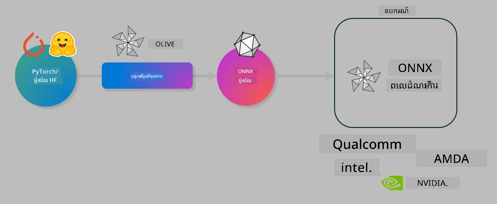

# ផ្ទះប្រឡង. បង្កើតម៉ូដែល AI ឲ្យប្រសើរឡើងសម្រាប់ការព្យាករណ៍លើឧបករណ៍

## ការណែនាំ

> [!IMPORTANT]
> លំហាត់នេះត្រូវការក្រទះស៊េរី **Nvidia A10 ឬ A100 GPU** ជាមួយអ្នកបើកបរនិងឧបករណ៍សាកល្បង CUDA (កំណែ 12+) ដែលបានដំឡើងរួច។

> [!NOTE]
> នេះជាលំហាត់ **៣៥ នាទី** ដែលនឹងផ្តល់ឱ្យអ្នកនូវការណែនាំការអនុវត្តជាក់ស្តែងលើគំនិតមូលដ្ឋាននៃការបង្កើតម៉ូដែលឲ្យប្រសើរសម្រាប់ការព្យាករណ៍លើឧបករណ៍ដោយប្រើ OLIVE។

## គោលបំណងសិក្សា

នៅចុងបញ្ចប់នៃលំហាត់នេះ អ្នកនឹងអាចប្រើ OLIVE ដើម្បី៖

- បំលែងម៉ូដែល AI ដោយប្រើវិធីសាស្រ្តបំលែង AWQ។
- ថែរក្សាគុណភាពម៉ូដែល AI សម្រាប់ភារកិច្ចជាក់លាក់មួយ។
- បង្កើតឧបករណ៍ LoRA (ម៉ូដែលដែលបានថែរក្សាគុណភាព) សម្រាប់ការព្យាករណ៍លើឧបករណ៍ដោយប្រសើរជាមួយ ONNX Runtime។

### Olive គឺជាអ្វី

Olive (*O*NNX *live*) ជាឧបករណ៍បង្កើតម៉ូដែលដែលមាន CLI ជារួមដែលអាចអនុញ្ញាតឱ្យអ្នកដឹកជញ្ជូនម៉ូដែលសម្រាប់ ONNX runtime +++https://onnxruntime.ai+++ ជាមួយគុណភាពនិងការសម្តែងល្អ។



ទិន្នន័យបញ្ចូលទៅ Olive ជាទូទៅគឺម៉ូដែល PyTorch ឬ Hugging Face ហើយទិន្នន័យបង្ហាញគឺម៉ូដែល ONNX ដែលបានបង្កើតឡើងដែលដំណើរការនៅលើឧបករណ៍ (គោលដៅការដាក់ចេញ) ដែលដំណើរការដោយ ONNX runtime។ Olive នឹងបង្កើតម៉ូដែលសម្រាប់កំព្រាឥន្ទចលនារបស់គោលដៅ (NPU, GPU, CPU) ដែលផ្តល់ដោយអ្នកផ្គត់ផ្គង់ថេប៊្លេឌ័រដូចជា Qualcomm, AMD, Nvidia ឬ Intel។

Olive ដំណើរការលទ្ធផលមួយដែលជាលំដាប់នៃកិច្ចការបង្កើតម៉ូដែលមួយៗដែលហៅថា *passes* - ឧទាហរណ៍ passage រួមមាន៖ ការសង្កត់ម៉ូដែល ការកត់ត្រាគ្រាប់ចិត្ត ការបំលែង គុណភាពឡើង។ រាល់ passage មានប៉ារ៉ាម៉ែត្រដែលអាចកំណត់បានដើម្បីសម្រេចបានជាលទ្ធផលល្អបំផុត ដូចជាការប៉ាន់ប្រមាណនិងពេលវេលា ដែលត្រូវបានវាយតម្លៃដោយអ្នកវាយតម្លៃដែលពាក់ព័ន្ធ។ Olive ប្រើយុទ្ធសាស្ត្រស្វែងរកដែលប្រើ algorithm ស្វែងរកដើម្បីតម្រឹម passage មួយៗ ឬ passage ជាបណ្ដុំ។

#### អត្ថប្រយោជន៍របស់ Olive

- **កាត់បន្ថយការខកចិត្ត និងពេលវេលា** នៅក្នុងការសាកល្បងបណ្ដោះអាសន្នជាមួយវិធីសាស្ត្រផ្សេងៗសម្រាប់ការបង្កើតម៉ូដែល ការសង្កត់ និងគុណភាពឡើង។ កំណត់លក្ខខណ្ឌគុណភាពនិងការសម្តែងរបស់អ្នក ហើយអនុញ្ញាតឱ្យ Olive ស្វែងរកម៉ូដែលល្អបំផុតដោយស្វ័យប្រវត្តិ។
- **១៤០+ ជាប់រួមជាផ្នែកបង្កើតម៉ូដែល** ដែលគ្របដណ្តប់វិធីសាស្ត្រថ្មីៗក្នុងការបំលែង ថយចុះ គុណភាពឡើង និងការសម្រួលក្រាហ្វិច។
- **CLI ងាយស្រួលប្រើ** សម្រាប់កិច្ចការបង្កើតម៉ូដែលទូទៅ។ ឧទាហរណ៍ olive quantize, olive auto-opt, olive finetune។
- របៀបបញ្ជូនម៉ូដែល និងការដាក់ចេញជាប់ក្នុងកម្មវិធី។
- គាំទ្រ ការបង្កើតម៉ូដែល សម្រាប់ **Multi LoRA serving**។
- រចនាសម្ព័ន្ធ workflow ដោយប្រើ YAML/JSON ដើម្បីចាត់ចែងកិច្ចការបង្កើតម៉ូដែល និងដាក់ចេញ។
- **ការសម្របសម្រួល Hugging Face និង Azure AI។**
- ប្រព័ន្ធ **caching** ជាប់ក្នុងកម្មវិធីដើម្បី **រក្សាទុកចំណាយ**។

## សេចក្ដីណែនាំលំហាត់
> [!NOTE]
> សូមប្រាកដថាអ្នកបានរៀបចំ Azure AI Hub និង Project រួចហើយ ហើយបានកំណត់ A100 compute តាមរយៈ Lab 1។

### ជំហ៊ានទី 0: ពាក់ព័ន្ធទៅ Azure AI Compute របស់អ្នក

អ្នកនឹងភ្ជាប់ទៅ Azure AI compute ដោយប្រើមុខងារ remote នៅក្នុង **VS Code**។

1. បើកកម្មវិធី **VS Code** នៅលើ Desktop:
1. បើក **command palette** ដោយប្រើ **Shift+Ctrl+P**
1. នៅ command palette ស្វែងរក **AzureML - remote: Connect to compute instance in New Window**។
1. អនុវត្តន៍តាមការណែនាំលើអេក្រង់ដើម្បីភ្ជាប់ទៅ Compute។ នេះនឹងរាប់បញ្ចូលការជ្រើសរើស Subscription Azure, Resource Group, Project និងឈ្មោះ Compute ដែលអ្នកកំណត់នៅ Lab 1។
1. បន្ទាប់ពីភ្ជាប់បានទៅលើ Azure ML Compute node នេះនឹងបង្ហាញនៅខាងក្រោមឆ្វេងរបស់ Visual Code `><Azure ML: Compute Name`

### ជំហ៊ានទី 1: Clone repo នេះ

នៅក្នុង VS Code អ្នកអាចបើក terminal ថ្មីដោយចុច **Ctrl+J** ហើយ clone repo នេះ៖

នៅ terminal អ្នកគួរដែលឃើញ prompt

```
azureuser@computername:~/cloudfiles/code$ 
```
Clone the solution 

```bash
cd ~/localfiles
git clone https://github.com/microsoft/phi-3cookbook.git
```

### ជំហ៊ានទី 2: បើកថតក្នុង VS Code

ដើម្បីបើក VS Code ក្នុងថតពាក់ព័ន្ធចុចបញ្ជារដូចខាងក្រោមនៅក្នុង terminal ដែលនឹងបើកវីនដូថ្មី៖

```bash
code phi-3cookbook/code/04.Finetuning/Olive-lab
```

ជាជម្រើសបញ្ជារដោយគ្នា អ្នកអាចបើកថតដោយជ្រើស **File** > **Open Folder**។

### ជំហ៊ានទី 3: Dependencies

បើកវិញ terminal នៅក្នុង VS Code ក្នុង Azure AI Compute Instance របស់អ្នក (គន្លឹះ **Ctrl+J**) ហើយអនុវត្តបញ្ជារខាងក្រោមសម្រាប់ដំឡើង dependencies៖

```bash
conda create -n olive-ai python=3.11 -y
conda activate olive-ai
pip install -r requirements.txt
az extension remove -n azure-cli-ml
az extension add -n ml
```

> [!NOTE]
> នឹងចំណាយប្រហែល ~5 នាទីក្នុងការដំឡើង dependencies ទាំងអស់។

ក្នុងលំហាត់នេះ អ្នកនឹងទាញយកនិងផ្ទុកម៉ូដែលទៅកាន់ផលិតផលម៉ូដែល Azure AI។ ដើម្បីចូលប្រើផ្នែកម៉ូដែល អ្នកត្រូវចូលប្រព័ន្ធ Azure ដោយប្រើ៖

```bash
az login
```

> [!NOTE]
> នៅពេលចូល ដោយស្វ័យប្រវត្តិ អ្នកនឹងត្រូវបានស្នើសុំជ្រើស Subscription របស់អ្នក។ សូមធានាថាអ្នកបានកំណត់ subscription ទៅចំពោះដែលបានផ្តល់សម្រាប់លំហាត់នេះ។

### ជំហ៊ានទី 4: អនុវត្តបញ្ជារបស់ Olive

បើក terminal នៅក្នុង VS Code ក្នុង Azure AI Compute Instance របស់អ្នក (គន្លឹះ **Ctrl+J**) ហើយត្រួតពិនិត្យថា `olive-ai` conda environment ត្រូវបានបើកសកម្ម៖

```bash
conda activate olive-ai
```

បន្ទាប់ អនុវត្តបញ្ជារជាក្រៅរយៈសម័យខាងក្រោមនៅក្នុង command line របស់ Olive។

1. **ពិនិត្យទិន្នន័យ៖** ក្នុងឧទាហរណ៍នេះ អ្នកនឹងធ្វើ fine-tune ម៉ូដែល Phi-3.5-Mini ដើម្បីឲ្យវាមានគុណភាពក្នុងការឆ្លើយសំណួរពាក់ព័ន្ធនឹងការធ្វើដំណើរ។ កូដខាងលើបង្ហាញកំណត់ត្រាច្រើនជាលំដាប់ដំបូងនៃ dataset ដែលមានទ្រង់ទ្រាយ JSON lines៖

    ```bash
    head data/data_sample_travel.jsonl
    ```
1. **បំលែងម៉ូដែល៖** មុនពេលហ្វឹកហាត់ ម៉ូដែល អ្នកត្រូវបំលែងម៉ូដែលជាមុនជាមួយបញ្ជារខាងក្រោម ដែលប្រើវិធីសាស្រ្ត Active Aware Quantization (AWQ) +++https://arxiv.org/abs/2306.00978+++. AWQ បំលែងទំងន់ម៉ូដែលដោយគិតគូរជាមួយការបញ្ចេញអ៊ីនធីក្រាលនៅពេលវារត់។ នេះមានន័យថា ដំណើរការបំលែងគិតពីការបែងចែកទិន្នន័យពិតប្រាកដនៅក្នុងការបញ្ចេញ វាធ្វើឲ្យការច្រាសត្រូវនៃម៉ូដែលត្រូវបានរក្សាទុកល្អជាងវិធីសាស្រ្តបំលែងទំងន់ប្រពៃណី។
    
    ```bash
    olive quantize \
       --model_name_or_path microsoft/Phi-3.5-mini-instruct \
       --trust_remote_code \
       --algorithm awq \
       --output_path models/phi/awq \
       --log_level 1
    ```
    
    វាចំណាយប្រហែល **~៨ នាទី** ដើម្បីបញ្ចប់ការបំលែង AWQ ដែលនឹង **កាត់បន្ថយទំហំម៉ូដែលពី ~7.5GB ទៅ ~2.5GB**។
   
   នៅលំហាត់នេះ យើងបង្ហាញអ្នករបៀបបញ្ចូលម៉ូដែលពី Hugging Face (ឧទាហរណ៍៖ `microsoft/Phi-3.5-mini-instruct`)។ ទោះបីជា Olive ក៏អនុញ្ញាតឲ្យបញ្ចូលម៉ូដែលពីផ្នែក Azure AI catalog ដោយកែប្រែ argument `model_name_or_path` ទៅ ID ទ្រព្យសម្បត្តិ Azure AI (ឧទាហរណ៍៖ `azureml://registries/azureml/models/Phi-3.5-mini-instruct/versions/4`)។

1. **ហ្វឹកហាត់ម៉ូដែល៖** បន្ទាប់មក បញ្ជារដែលមានឈ្មោះ `olive finetune` នឹងធ្វើ fine-tune លើម៉ូដែលដែលបានបំលែង។ ការ quantize ម៉ូដែលមុនពេលហ្វឹកហាត់ ជំនួសពីក្រោយ កំរុងលទ្ធផលត្រឹមត្រូវល្អជាង ព្រោះដំណើរការហ្វឹកហាត់អាចស្ដារអោយមានភាពបាត់បង់ពី quantization មួយចំនួន។
    
    ```bash
    olive finetune \
        --method lora \
        --model_name_or_path models/phi/awq \
        --data_files "data/data_sample_travel.jsonl" \
        --data_name "json" \
        --text_template "<|user|>\n{prompt}<|end|>\n<|assistant|>\n{response}<|end|>" \
        --max_steps 100 \
        --output_path ./models/phi/ft \
        --log_level 1
    ```
    
    វាចំណាយ **~៦ នាទី** ដើម្បីបញ្ចប់ការហ្វឹកហាត់ (ជាមួយជំហ៊ាន ១០០)។

1. **បង្កើតប្រសិទ្ធភាព៖** បន្ទាប់ពីម៉ូដែលហ្វឹកហាត់ ខណៈនេះអ្នកអាចបង្កើតប្រសិទ្ធភាពម៉ូដែលដោយប្រើបញ្ជារបស់ Olive គឺ `auto-opt` ដែលនឹងចាប់ក្រាហ្វ ONNX ហើយអនុវត្តន៍ការបង្កើតប្រសិទ្ធភាពជាច្រើនដើម្បីធ្វើឲ្យម៉ូដែលមានសមត្ថភាពល្អជាងមុនសម្រាប់ CPU ដោយជម្រាបម៉ូដែលនិងការរួមបញ្ចូល។ គួរបញ្ជាក់ថា អ្នកអាចបង្កើតប្រសិទ្ធភាពសម្រាប់ឧបករណ៍ផ្សេងៗដូចជា NPU ឬ GPU ដោយកែ argument `--device` និង `--provider` ផ្សេងទៀត – ប៉ុន្តែសម្រាប់លំហាត់នេះ យើងប្រើ CPU។

    ```bash
    olive auto-opt \
       --model_name_or_path models/phi/ft/model \
       --adapter_path models/phi/ft/adapter \
       --device cpu \
       --provider CPUExecutionProvider \
       --use_ort_genai \
       --output_path models/phi/onnx-ao \
       --log_level 1
    ```
    
    វាចំណាយប្រហែល **~៥ នាទី** ដើម្បីបញ្ចប់ការបង្កើតប្រសិទ្ធភាព។

### ជំហ៊ានទី 5: សាកល្បងការព្យាករណ៍ម៉ូដែលយ៉ាងរហ័ស

ដើម្បីសាកល្បងការព្យាករណ៍ម៉ូដែល សូមបង្កើតឯកសារ Python ថ្មីនៅក្នុងថតរបស់អ្នកឈ្មោះ **app.py** ហើយចម្លង បិទបិទកូដខាងក្រោម៖

```python
import onnxruntime_genai as og
import numpy as np

print("loading model and adapters...", end="", flush=True)
model = og.Model("models/phi/onnx-ao/model")
adapters = og.Adapters(model)
adapters.load("models/phi/onnx-ao/model/adapter_weights.onnx_adapter", "travel")
print("DONE!")

tokenizer = og.Tokenizer(model)
tokenizer_stream = tokenizer.create_stream()

params = og.GeneratorParams(model)
params.set_search_options(max_length=100, past_present_share_buffer=False)
user_input = "what is the best thing to see in chicago"
params.input_ids = tokenizer.encode(f"<|user|>\n{user_input}<|end|>\n<|assistant|>\n")

generator = og.Generator(model, params)

generator.set_active_adapter(adapters, "travel")

print(f"{user_input}")

while not generator.is_done():
    generator.compute_logits()
    generator.generate_next_token()

    new_token = generator.get_next_tokens()[0]
    print(tokenizer_stream.decode(new_token), end='', flush=True)

print("\n")
```

អនុវត្តបញ្ជារគោលដោយបញ្ចូល៖

```bash
python app.py
```

### ជំហ៊ានទី 6: ផ្ទុកម៉ូដែលឡើងទៅ Azure AI

ការផ្ទុកម៉ូដែលឡើងទៅឃ្លាំងម៉ូដែល Azure AI ធ្វើឲ្យម៉ូដែលអាចចែករំលែកជាមួយសមាជិកក្រុមអភិវឌ្ឍន៍ផ្សេងទៀត ហើយក៏គ្រប់គ្រងការកំណត់កំណែម៉ូដែលផងដែរ។ ដើម្បីផ្ទុកម៉ូដែលអនុវត្តបញ្ជារខាងក្រោម៖

> [!NOTE]
> ធ្វើបច្ចុប្បន្នភាពទីតាំង `{}` ជាមួយឈ្មោះ resource group និង Azure AI Project របស់អ្នក។

ដើម្បីរក resource group `"resourceGroup" និងឈ្មោះ Azure AI Project អនុវត្តបញ្ជារខាងក្រោម៖

```
az ml workspace show
```

ឬឆែកក្រោម +++ai.azure.com+++ និងជ្រើសរើស **management center** **project** **overview**

ធ្វើបច្ចុប្បន្នភាពទីតាំង `{}` ជាមួយឈ្មោះ resource group និង Azure AI Project របស់អ្នក។

```bash
az ml model create \
    --name ft-for-travel \
    --version 1 \
    --path ./models/phi/onnx-ao \
    --resource-group {RESOURCE_GROUP_NAME} \
    --workspace-name {PROJECT_NAME}
```
 អ្នកអាចមើលម៉ូដែលដែលបានផ្ទុកឡើង ហើយដាក់ចេញម៉ូដែលរបស់អ្នកនៅ https://ml.azure.com/model/list

---

<!-- CO-OP TRANSLATOR DISCLAIMER START -->
**ការបដិសេធ**៖  
ឯកសារនេះត្រូវបានបកប្រែដោយប្រើសេវាកម្មបកប្រែ AI [Co-op Translator](https://github.com/Azure/co-op-translator)។ ខណៈពេលដែលយើងខិតខំរកភាពត្រឹមត្រូវ សូមយល់ដឹងថាការបកប្រែដោយស្វ័យប្រវត្តិអាចមានកំហុស ឬមិនត្រឹមត្រូវ។ ឯកសារដើមក្នុងភាសាមាតុភូមិគួរត្រូវបានគេយកជាឧទាហរណ៍ត្រឹមត្រូវ។ សម្រាប់ព័ត៌មានសំខាន់ៗ គ្រាន់តែផ្ដល់អនុសាសន៍ឱ្យប្រើការបកប្រែដោយមនុស្សជំនាញ។ យើងមិនទទួលខុសត្រូវចំពោះការយល់ច្រឡំ ឬការបកព្រាបណាមួយដែលកើតឡើងពីការប្រើប្រាស់ការបកប្រែនេះឡើយ។
<!-- CO-OP TRANSLATOR DISCLAIMER END -->