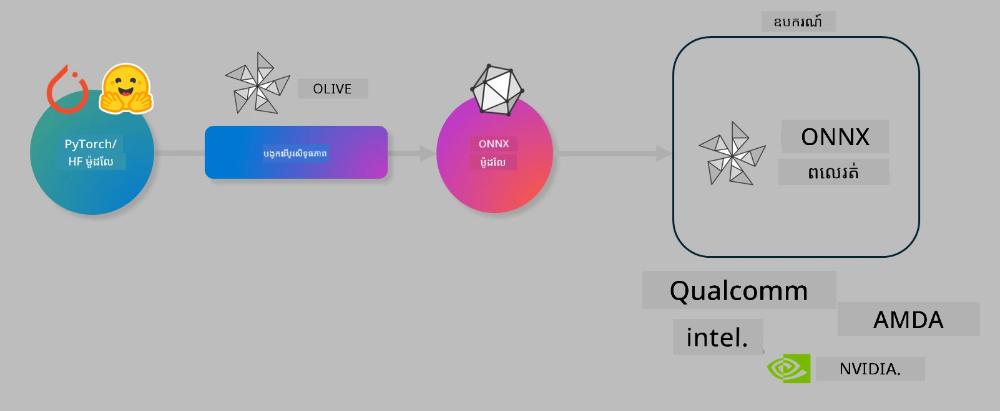

# មន្ទីរ 실험. ប្រសិទ្ធភាពបង្ហាញម៉ូដែល AI សម្រាប់ការព្យាករណ៍នៅលើឧបករណ៍

## គម្រូសារ 

> [!IMPORTANT]
> មន្ទីរនេះតម្រូវឲ្យមាន **GPU Nvidia A10 ឬ A100** ជាមួយកម្មវិធីបើកដំណើរការនិងឧបករណ៍ CUDA toolkit (ជួរវិស័យ 12+) ត្រូវបានដំឡើង។

> [!NOTE]
> នេះគឺជាមន្ទីរពេញទឹកពេល **35 នាទី** ដែលនឹងផ្តល់ឲ្យអ្នកនូវការណែនាំដោយដៃលើមូលដ្ឋាននៃគំនិតមូលដ្ឋានសម្រាប់ប្រសិទ្ធភាពម៉ូដែលសម្រាប់ការព្យាករណ៍នៅលើឧបករណ៍ដោយប្រើ OLIVE។

## គោលបំណងសិក្សា

នៅចុងបញ្ចប់នៃមន្ទីរនេះ អ្នកនឹងអាចប្រើ OLIVE ដើម្បី៖

- បម្លែងម៉ូដែល AI ជាមួយវិធីសាស្រ្តបម្លែង AWQ។
- ម៉ូដែល AI ត្រូវបានលម្អិតសម្រាប់ភារកិច្ចណាមួយជាក់លាក់។
- បង្កើតឧបករណ៍ LoRA (ម៉ូដែលបានលម្អិត) សម្រាប់ការព្យាករណ៍មានប្រសិទ្ធភាពនៅលើឧបករណ៍ដោយប្រើ ONNX Runtime ។

### អ្វីទៅជា Olive

Olive (*O*NNX *live*) គឺជាឧបករណ៍ប្រសិទ្ធភាពម៉ូដែលជាមួយ CLI ជាកម្មវិធីដែលអនុញ្ញាតឲ្យអ្នកដឹកជញ្ជូនម៉ូដែលសម្រាប់ ONNX runtime +++https://onnxruntime.ai+++ ជាមួយគុណភាព និងកម្រិតកម្រិត។



មូលដ្ឋានបញ្ចូលទៅ Olive ជាទូទៅគឺម៉ូដែល PyTorch ឬ Hugging Face ហើយផលបន្ទាន់គឺម៉ូដែល ONNX ដែលត្រូវបានបង្ហាញប្រតិបត្តិលើឧបករណ៍ (គោលដៅបញ្ចូន) ដែលដំណើរការជាមួយ ONNX runtime។ Olive នឹងប្រសិទ្ធភាពម៉ូដែលសម្រាប់សមាសធាតុបន្ថែម AI របស់គោលដៅបញ្ចូន (NPU, GPU, CPU) ដែលផ្ដល់ដោយអ្នកផ្គត់ផ្គង់ឧបករណ៍ដូចជា Qualcomm, AMD, Nvidia ឬ Intel។

Olive ប្រតិបត្តិ *workflow*, ដែលជាលំដាប់នៃភារកិច្ចប្រសិទ្ធភាពម៉ូដែលអន្ដរកម្មត្រូវគ្នា ហៅថា *passes* - ឧទាហរណ៍ passes រួមមាន៖ ការសង្កត់ម៉ូដែល, ចាប់ផ្តើមក្រាហ្វ, បម្លែង, ប្រសិទ្ធភាពក្រាហ្វ។ រាល់ passes មានប៉ារ៉ាម៉ែត្រ ដែលអាចកំណត់ដើម្បីទទួលបានមេគុណល្អបំផុត ដូចជាគុណភាពនិងល្បឿនដែលត្រូវបានវាយតម្លៃដោយអ្នកវាយតម្លៃនីមួយៗ។ Olive ប្រើយុទ្ធសាស្រ្តស្វែងរក ដែលប្រើរបៀបស្វែងរក ដើម្បីកំណត់ស្វ័យប្រវត្តិការលម្អិត passes រៀងរាល់ពីរឬក្រុម passes។

#### អត្ថប្រយោជន៍របស់ Olive

- **បន្ថយភាពស្ទាក់ស្ទើរ និងពេលវេលា** នៃការសាកល្បងដោយដៃជាមួយបច្ចេកទេសផ្សេងៗសម្រាប់ប្រសិទ្ធភាពក្រាហ្វ, សង្កត់និងបម្លែង។ កំណត់លក្ខខណ្ឌគុណភាព និងកម្រិតកម្រិត ហើយឲ្យ Olive ស្វ័យប្រវត្តិរកម៉ូដែលល្អបំផុតសម្រាប់អ្នក។
- **មានសមាសធាតុប្រសិទ្ធភាពម៉ូដែលចំនួន ៤០+** ដែលគ្របដណ្តប់បច្ចេកទេសចុងក្រោយនៅក្នុងបម្លែង, សង្កត់, ប្រសិទ្ធភាពក្រាហ្វ, និងការលម្អិត។
- **CLI រឹងមាំងាយប្រើ** សម្រាប់ភារកិច្ចប្រសិទ្ធភាពម៉ូដែលទូទៅ។ ឧទាហរណ៍, olive quantize, olive auto-opt, olive finetune។
- ការវេចខ្ចប់ម៉ូដែលនិងបញ្ចូនវាទៅកាន់ប្រព័ន្ធបានរួមបញ្ចូល។
- គាំទ្រ ការបង្កើតម៉ូដែលសម្រាប់ **Multi LoRA serving**។
- បង្កើត workflow ដោយប្រើ YAML/JSON ដើម្បីសម្របសម្រួលភារកិច្ចប្រសិទ្ធភាពម៉ូដែលនិងបញ្ចូនវា។
- ប្រើប្រាស់បានជាមួយ **Hugging Face** និង **Azure AI**។
- មានប្រព័ន្ធ **caching** រួមបញ្ចូល ដើម្បី **រក្សាតម្លៃចំណាយ**។

## សេចក្ដីណែនាំមន្ទីរ
> [!NOTE]
> សូមប្រាកដថាអ្នកបានផ្តល់សេវាកម្ម Azure AI Hub និង Project រួចហើយ និងកំណត់ A100 compute របស់អ្នកដូចដែលបានបង្ហាញនៅ Lab 1។

### ជំហាន ០: ភ្ជាប់ទៅ Azure AI Compute របស់អ្នក

អ្នកនឹងភ្ជាប់ទៅ Azure AI compute ដោយប្រើមុខងារ remote ក្នុង **VS Code**។

1. បើកកម្មវិធី **VS Code** របស់អ្នកលើផ្ទាល់៖
1. បើក **command palette** ដោយប្រើ **Shift+Ctrl+P**
1. ក្នុង command palette ស្វែងរក **AzureML - remote: Connect to compute instance in New Window**។
1. អនុវត្តតាមការណែនាំលើអេក្រង់ដើម្បីភ្ជាប់ទៅ Compute។ នេះនឹងជាជម្រើស Subscription Azure របស់អ្នក, Resource Group, Project និង Compute ឈ្មោះដែលបានកំណត់នៅ Lab 1។
1. ពេលភ្ជាប់ជោគជ័យទៅ Azure ML Compute node នេះនឹងបង្ហាញនៅ **ផ្នែកខាងក្រោមវ្វៃឆ្វេងរបស់ Visual Code** `><Azure ML: Compute Name`

### ជំហាន ១: ចម្លង repo នេះ

ក្នុង VS Code អ្នកអាចបើក terminal ថ្មីដោយ **Ctrl+J** ហើយចម្លង repo នេះ៖

នៅក្នុង terminal អ្នកគួរតែឃើញពាក្យបញ្ជា

```
azureuser@computername:~/cloudfiles/code$ 
```
ចម្លងដំណោះស្រាយ

```bash
cd ~/localfiles
git clone https://github.com/microsoft/phi-3cookbook.git
```

### ជំហាន ២: បើកថតក្នុង VS Code

ដើម្បីបើក VS Code នៅក្នុងថតដែលពាក់ព័ន្ធអនុវត្តពាក្យបញ្ជាដូចខាងក្រោមក្នុង terminal វានឹងបើកបង្អួចថ្មី៖

```bash
code phi-3cookbook/code/04.Finetuning/Olive-lab
```

ជំនួស អ្នកអាចបើកថតដោយជ្រើសរើស **File** > **Open Folder**។

### ជំហាន ៣: ការទាមទារ

បើក terminal ក្នុង VS Code ក្នុង Azure AI Compute Instance របស់អ្នក (គន្លឹះ: **Ctrl+J**) ហើយអនុវត្តពាក្យបញ្ជាខាងក្រោមដើម្បីដំឡើងការទាមទារ៖

```bash
conda create -n olive-ai python=3.11 -y
conda activate olive-ai
pip install -r requirements.txt
az extension remove -n azure-cli-ml
az extension add -n ml
```

> [!NOTE]
> វានឹងចំណាយពេល ~5 នាទីសម្រាប់ដំឡើងការទាមទារ​ទាំងអស់។

នៅក្នុងមន្ទីរនេះ អ្នកនឹងទាញយកនិងផ្ទុកឡើងម៉ូដែលទៅកាន់បណ្ណាល័យម៉ូដែល Azure AI។ ដើម្បីចូលប្រើបណ្ណាល័យម៉ូដែល អ្នកត្រូវចូលគណនី Azure ដោយប្រើ៖

```bash
az login
```

> [!NOTE]
> នៅពេលចូល អ្នកនឹងត្រូវបានសួរឲ្យជ្រើសរើស subscription របស់អ្នក។ សូមប្រាកដថាអ្នកកំណត់ subscription ទៅក្នុងមួយដែលបានផ្តល់សម្រាប់មន្ទីរនេះ។

### ជំហាន ៤: អនុវត្តពាក្យបញ្ជា Olive

បើក terminal ក្នុង VS Code ក្នុង Azure AI Compute Instance របស់អ្នក (គន្លឹះ: **Ctrl+J**) និងប្រាកដថាបរិស្ថាន conda `olive-ai` ត្រូវបានបើកប្រើ៖

```bash
conda activate olive-ai
```

បន្ទាប់ អនុវត្តពាក្យបញ្ជា Olive ខាងក្រោមក្នុងបន្ទាត់ពាក្យបញ្ជា។

1. **ពិនិត្យទិន្នន័យ:** ក្នុងឧទាហរណ៍នេះ អ្នកនឹងលម្អិតម៉ូដែល Phi-3.5-Mini ដើម្បីឲ្យវានៅជាពិសេសសម្រាប់ចម្លើយសំណួរពាក់ព័ន្ធការធ្វើដំណើរ។ កូដខាងក្រោមបង្ហាញកំណត់ត្រាចាប់ផ្តើមពី Dataset ដែលនៅក្នុងទ្រង់ទ្រាយ JSON lines៖

    ```bash
    head data/data_sample_travel.jsonl
    ```
1. **បម្លែងម៉ូដែល:** មុនពេលហ្វឹកហាត់ម៉ូដែល អ្នកត្រូវបម្លែងជាមុនដោយប្រើពាក្យបញ្ជាដូចខាងក្រោម ដែលប្រើបច្ចេកទេសហៅថា Active Aware Quantization (AWQ) +++https://arxiv.org/abs/2306.00978+++. AWQ បម្លែងទំងន់របស់ម៉ូដែលដោយគិតគូរនូវសកម្មភាពដែលបានបង្កើតឡើងនៅពេលព្យាករណ៍។ ន័យថា ដំណើរការបម្លែងគិតគូរពីចំនួនទិន្នន័យពិតនៅក្នុងសកម្មភាព ដែលដឹកនាំឲ្យរក្សាគុណភាពម៉ូដែលបានល្អជាងវិធីបម្លែងទំងន់បុរាណ។

    ```bash
    olive quantize \
       --model_name_or_path microsoft/Phi-3.5-mini-instruct \
       --trust_remote_code \
       --algorithm awq \
       --output_path models/phi/awq \
       --log_level 1
    ```
    
    វាចំណាយពេលប្រហែល **~8 នាទី** សម្រាប់បញ្ចប់បម្លែង AWQ ដែលនឹង **កន្ថយទំហំពី ~7.5GB ទៅ ~2.5GB**។
   
   ក្នុងមន្ទីរនេះ យើងបង្ហាញអ្នកពីរបៀបបញ្ចូលម៉ូដែលពី Hugging Face (ឧទាហរណ៍: `microsoft/Phi-3.5-mini-instruct`)។ ទោះយ៉ាងណា Olive ក៏អនុញ្ញាតឲ្យអ្នកបញ្ចូលម៉ូដែលពីបណ្ណាល័យ Azure AI ដោយផ្លាស់ប្ដូរ​អាគុយម៉ង់ `model_name_or_path` ទៅ ID ទ្រព្យសម្បត្តិ Azure AI (ឧទាហរណ៍: `azureml://registries/azureml/models/Phi-3.5-mini-instruct/versions/4`)។

1. **ហ្វឹកហាត់ម៉ូដែល:** បន្ទាប់ពីបម្លែងម៉ូដែល `olive finetune` នឹងហ្វឹកហាត់ម៉ូដែលដែលបានបម្លែង។ ការបម្លែងម៉ូដែល *មុន* ការហ្វឹកហាត់ ផ្តល់គុណភាពល្អជាងពេលបម្លែងបន្ទាប់ពីហ្វឹកហាត់ ព្រោះដំណើរការហ្វឹកហាត់ស្ដារយកខ្លះនៃការបាត់បង់ពីការបម្លែង។

    ```bash
    olive finetune \
        --method lora \
        --model_name_or_path models/phi/awq \
        --data_files "data/data_sample_travel.jsonl" \
        --data_name "json" \
        --text_template "<|user|>\n{prompt}<|end|>\n<|assistant|>\n{response}<|end|>" \
        --max_steps 100 \
        --output_path ./models/phi/ft \
        --log_level 1
    ```
    
    វាចំណាយពេលប្រហែល **~6 នាទី** សម្រាប់បញ្ចប់ការហ្វឹកហាត់ (ជាមួយជំហាន ១០០)។

1. **ប្រសិទ្ធភាព:** បន្ទាប់ពីម៉ូដែលបានហ្វឹកហាត់ អ្នកអាចបង្កើតប្រសិទ្ធភាពម៉ូដែលដោយប្រើពាក្យបញ្ជា `auto-opt` របស់ Olive ដែលនឹងចាប់ដំណើរការក្រាហ្វ ONNX ហើយអនុវត្តជាច្រើនការបង្កើនប្រសិទ្ធភាព ដើម្បីបង្កើនល្បឿនម៉ូដែលសម្រាប់ CPU ដោយសង្កត់ម៉ូដែលនិងប realizanเฉย fusion។ គួរបញ្ជាក់ថា អ្នកអាចប្រសិទ្ធភាពសម្រាប់ឧបករណ៍ផ្សេងទៀត ដូចជា NPU ឬ GPU ដោយគ្រាន់តែផ្លាស់ប្ដូរ​អាគុយម៉ង់ `--device` និង `--provider` - តែសម្រាប់មន្ទីរនេះ យើងនឹងប្រើ CPU។

    ```bash
    olive auto-opt \
       --model_name_or_path models/phi/ft/model \
       --adapter_path models/phi/ft/adapter \
       --device cpu \
       --provider CPUExecutionProvider \
       --use_ort_genai \
       --output_path models/phi/onnx-ao \
       --log_level 1
    ```
    
    វាចំណាយពេលប្រហែល **~5 នាទី** សម្រាប់បញ្ចប់ការបង្កើនប្រសិទ្ធភាព។

### ជំហាន ៥: សាកល្បងព្យាករណ៍ម៉ូដែលយ៉ាងឆាប់រហ័ស

ដើម្បីសាកល្បងព្យាករណ៍ម៉ូដែល សូមបង្កើតឯកសារ Python ក្នុងថតរបស់អ្នកឈ្មោះ **app.py** ហើយចម្លង-បិទបិទកូដខាងក្រោម៖

```python
import onnxruntime_genai as og
import numpy as np

print("loading model and adapters...", end="", flush=True)
model = og.Model("models/phi/onnx-ao/model")
adapters = og.Adapters(model)
adapters.load("models/phi/onnx-ao/model/adapter_weights.onnx_adapter", "travel")
print("DONE!")

tokenizer = og.Tokenizer(model)
tokenizer_stream = tokenizer.create_stream()

params = og.GeneratorParams(model)
params.set_search_options(max_length=100, past_present_share_buffer=False)
user_input = "what is the best thing to see in chicago"
params.input_ids = tokenizer.encode(f"<|user|>\n{user_input}<|end|>\n<|assistant|>\n")

generator = og.Generator(model, params)

generator.set_active_adapter(adapters, "travel")

print(f"{user_input}")

while not generator.is_done():
    generator.compute_logits()
    generator.generate_next_token()

    new_token = generator.get_next_tokens()[0]
    print(tokenizer_stream.decode(new_token), end='', flush=True)

print("\n")
```

អនុវត្តកូដដោយប្រើ៖

```bash
python app.py
```

### ជំហាន ៦: ផ្ទុកឡើងម៉ូដែលទៅ Azure AI

ការផ្ទុកឡើងម៉ូដែលទៅឃ្លាំងម៉ូដែល Azure AI អនុញ្ញាតឲ្យម៉ូដែលចែករំលែកជាមួយសមាជិកផ្សេងទៀតក្នុងក្រុមអភិវឌ្ឍរបស់អ្នក និងគ្រប់គ្រងកំណែម៉ូដែលផងដែរ។ ដើម្បីផ្ទុកឡើងម៉ូដែល អនុវត្តពាក្យបញ្ជាដូចខាងក្រោម៖

> [!NOTE]
> បំពេញ `{}` ជាមួយឈ្មោះ Resource Group និង Azure AI Project របស់អ្នក។

ដើម្បីស្វែងរក Resource Group `"resourceGroup"` និងឈ្មោះ Azure AI Project ចេញពាក្យបញ្ជាខាងក្រោម៖

```
az ml workspace show
```

ឬចូលទៅ +++ai.azure.com+++ ហើយជ្រើសរើស **management center** **project** **overview**

បំពេញ `{}` ជាមួយឈ្មោះ Resource Group និង Azure AI Project របស់អ្នក។

```bash
az ml model create \
    --name ft-for-travel \
    --version 1 \
    --path ./models/phi/onnx-ao \
    --resource-group {RESOURCE_GROUP_NAME} \
    --workspace-name {PROJECT_NAME}
```
 អ្នកអាចមើលម៉ូដែលដែលបានផ្ទុកឡើងរបស់អ្នក ហើយបញ្ចូនម៉ូដែលនៅ https://ml.azure.com/model/list

---

<!-- CO-OP TRANSLATOR DISCLAIMER START -->
**បញ្ជាក់**៖
ឯកសារនេះត្រូវបានបកប្រែដោយប្រើសេវាបកប្រែ AI [Co-op Translator](https://github.com/Azure/co-op-translator) ។ ខណៈពេលដែលយើងខិតខំដើម្បីបានភាពត្រឹមត្រូវ សូមយល់ព្រមថាការបកប្រែដោយស្វ័យប្រវត្តិក្នុងទីបញ្ចប់អាចមានកំហុសឬភាពមិនត្រឹមត្រូវ។ ឯកសារដើមដែលមានភាសដើមគួរត្រូវបានទទួលស្គាល់ថាជាដើមកំណត់សម្រាប់ព័ត៌មាន។ សម្រាប់ព័ត៌មានសំខាន់ៗ សូមផ្តល់អាទិភាពការបកប្រែដោយមនុស្សដែលមានជំនាញ។ យើងមិនទទួលខុសត្រូវចំពោះការយល់ច្រឡំ ឬការយល់បាកសារប្រហែលណាមួយដែលកើតមានពីការប្រើប្រាស់ការបកប្រែនេះទេ។
<!-- CO-OP TRANSLATOR DISCLAIMER END -->