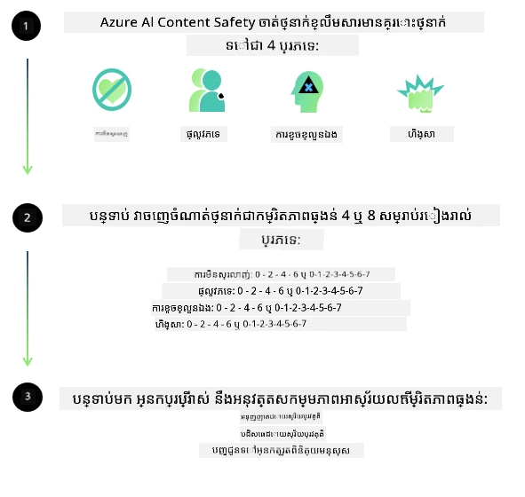
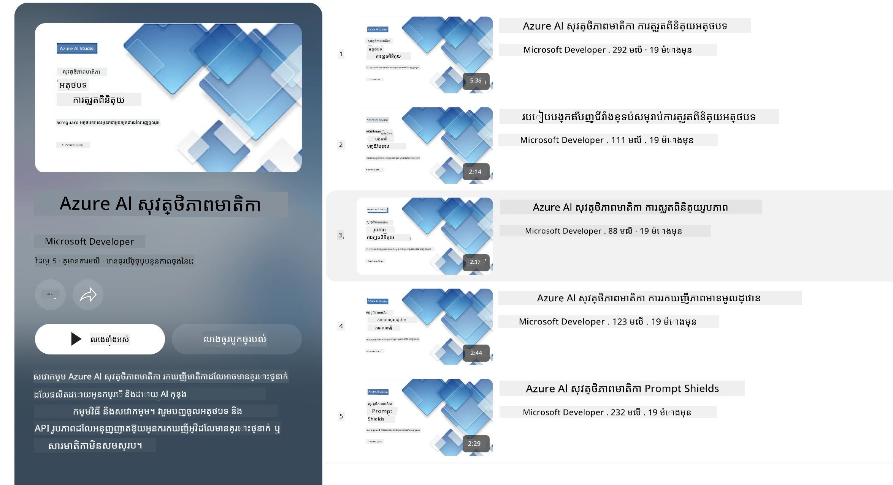

# សុវត្ថិភាព AI សម្រាប់ម៉ូដែល Phi
គ្រួសារម៉ូដែល Phi ត្រូវបានបង្កើតឡើងដោយស្របតាម [ស្តង់ដារ AI មានការទទួលខុសត្រូវរបស់ Microsoft](https://www.microsoft.com/ai/principles-and-approach#responsible-ai-standard) ដែលជាសំណុំនorme រាផ្សាយនៅក្រុមហ៊ុនផ្អែកលើមូលដ្ឋានបួនមេរៀនដូចខាងក្រោម៖ ការទទួលខុសត្រូវ ការបញ្ចេញបង្ហាញ ភាពធន់ធម្មតា ភាពទុកចិត្តនិងសុវត្ថិភាព ជំងឺឯកជនភាពនិងសុវត្ថិភាព និងភាពរួមចំណែក ដែលបង្កើតជា [គោលការណ៍ AI មានការទទួលខុសត្រូវរបស់ Microsoft](https://www.microsoft.com/ai/responsible-ai) ។

ដូចម៉ូដែល Phi មុនៗ ក៏មានការវាយតម្លៃសុវត្ថិភាពដែលមានច្រើនជ្រុងជ្រោង និងវិធីសាស្រ្ដក្រោយការបណ្តុះបណ្តាលដែលត្រូវបានទទួលយក ជាមួយនឹងវិធានការបន្ថែមសម្រាប់គណនកថាខុនច្រើនភាសារនៃការចេញផ្សាយនេះ។ វិធីសាស្រ្ដសម្រាប់បណ្តុះបណ្តាលសុវត្ថិភាព និងការវាយតម្លៃរួមទាំងការផ្ទៀងផ្ទាត់នៅតាមភាសាប្រើប្រាស់ច្រើន និងប្រភេទហានិភ័យត្រូវបានរៀបរាប់ក្នុង [ព័ត៌មានកាសែតក្រោយការបណ្តុះបណ្តាលសុវត្ថិភាព Phi](https://arxiv.org/abs/2407.13833)។ ខណៈម៉ូដែល Phi ទទួលផលពីវិធីសាស្រ្ដនេះ អ្នកអwickត្រូវតែប្រើនូវជំនាញ AI មានការទទួលខុសត្រូវល្អបំផុត រួមបញ្ចូលការកំណត់ផែនទី វាស់វែង និងកាត់បន្ថយហានិភ័យដែលទាក់ទងនឹងករណីប្រើប្រាស់ជាក់លាក់ និងបរិបទវប្បធម៌ និងភាសារបស់ពួកគេ។

## ប្រតិបត្តិល្អបំផុត

ដូចម៉ូដែលផ្សេងទៀត មានសក្តានុពលក្នុងការបង្ហាញខ្លួនក្នុងវិធីដែលមិនយុត្តិធម៌ មិនចាប់អារម្មណ៍ ឬគួរឲ្យណាស់។

ខ្លះពីអ្នកប្រើប្រាស់ SLM និង LLM មានសម្លេងឲ្យយល់ដូចខាងក្រោម៖

- **គុណភាពសេវាកម្ម៖** ម៉ូដែល Phi ត្រូវបានបណ្តុះបណ្តាលជាចម្បងលើអក្សរជាភាសាអង់គ្លេស។ ភាសាផ្សេងពីអង់គ្លេសនឹងមានការអនុវត្តកាន់តែបាននយោបាយខ្សោយ។ ជម្រើសភាសាអង់គ្លេសដែលមានតំណាងតិចក្នុងទិន្នន័យបណ្តុះបណ្តាលប្រហែលជាមានកម្រិតអនុវត្តមិនដូច្នឹងភាសាអង់គ្លេសស្តង់ដារអាមេរិក។
- **ការតំណាងនៃការខូចខាត និងការបន្តព្រិលនៃរូបមន្តស្តេរ្យូទីប:** ម៉ូដែលទាំងនេះអាចបង្ហាញឬមិនបង្ហាញតំណាងនិងក្រុមមនុស្សណាមួយ ឬលុបចោលតំណាងរបស់ក្រុមខ្លះ ឬបន្តគំនិតអាក្រក់ ឬភាពអនុកូត។ ទោះបីមានការបណ្តុះបណ្តាលសុវត្ថិភាពក្រោយ ការកំណត់សិទ្ធិនេះក៏នៅតែអាចមានស្រាប់ដោយសារតំណាងនៃក្រុមផ្សេងៗ និងការច្រើនជាអត្រានៃឧទាហរណ៍រូបមន្តអនុកូតនៅក្នុងទិន្នន័យដែលបង្ហាញពីបែបបទពិភពលោក និងការតម្រង់ទិសសង្គម។
- **មាតិកាមិនសមរម្យ ឬមិនគួរឲ្យរំខាន៖** ម៉ូដែលទាំងនេះអាចបង្កើតមាតិកាប្រភេទមិនសមរម្យ ឬមិនគួរឲ្យរំខានផ្សេងទៀត ដែលអាចបង្កលក្ខណៈមិនសមរម្យក្នុងការប្រើប្រាស់ក្នុងបរិបទសំរាប់អាកាសធាតុដែលមានភាពទន់ខ្សោយ ដោយគ្មានមធ្យោបាយបន្ថែមពិសេសស្របទៅនឹងករណីប្រើ។
- **ភាពទុកចិត្តនៃព័ត៌មាន៖** ម៉ូដែលភាសាអាចបង្កើតមាតិកាដែលគ្មានអត្ថន័យ ឬបង្កើតព័ត៌មានដែលស្តាប់ទៅមានហេតុផល ប៉ុន្តែមិនត្រឹមត្រូវ ឬចាស់ក្រាស់។
- **វិសាលភាពកូដមានកំណត់៖** ភាគច្រើននៃទិន្នន័យបណ្តុះបណ្តាល Phi-3 គឺមានមូលដ្ឋានលើ Python និងប្រើកញ្ចប់ទូទៅដូចជា "typing, math, random, collections, datetime, itertools"។ ប្រសិនបើម៉ូដែលបង្កើតស្គ្រីប Python ប្រើកញ្ចប់ផ្សេង ឬស្គ្រីបនៅភាសាផ្សេងៗ អ្នកប្រើប្រាស់គួរត្រួតពិនិត្យការប្រើប្រាស់ API ទាំងអស់ដោយដៃ។

អ្នកអwickត្រូវតែប្រើនូវជំនាញ AI មានការទទួលខុសត្រូវល្អបំផុត ហើយទទួលខុសត្រូវក្នុងការត្រួតពិនិត្យថាករណីប្រើជាក់លាក់នោះស្របច្បាប់ និងបទបញ្ជាដែលពាក់ព័ន្ធ (ឧ. ការជំនួយឯកជន ភ trade ទីផ្សារ)។

## ការពិចារណាអំពី AI មានការទទួលខុសត្រូវ

ដូចម៉ូដែលភាសាផ្សេងទៀត ម៉ូដែលជួរឈរម៉ូដែល Phi មានសក្ដានុពលធ្វើអោយមានរបៀបដែលមិនយុត្តិធម៌ មិនចាប់អារម្មណ៍ ឬមិនគួរឲ្យនឹកស្រមៃ។ ខ្លះនៃអាកប្បកិរិយាការដែលគួរយល់ដូចខាងក្រោម៖

**គុណភាពសេវាកម្ម៖** ម៉ូដែល Phi ត្រូវបានបណ្តុះបណ្តាលជាចម្បងលើអក្សរជាភាសាអង់គ្លេស។ ភាសាផ្សេងពីអង់គ្លេសនឹងមានការអនុវត្តកាន់តែបានកម្រ។ ជម្រើសភាសាអង់គ្លេសដែលមានតំណាងតិចក្នុងទិន្នន័យបង្រៀនប្រហែលជាបានកម្រិតអនុវត្តខុសប្លែកពីភាសាអង់គ្លេសស្តង់ដារអាមេរិក។

**ការតំណាងនៃការខូចខាត និងការបន្តព្រិលនៃរូបមន្តស្តេរ្យូទីប៖** ម៉ូដែលទាំងនេះអាចបង្ហាញឬមិនបង្ហាញតំណាងរបស់ក្រុមមនុស្សណាមួយ ឬលុបចោលតំណាងរបស់ក្រុមខ្លះ ឬបន្តគំនិតអនុកូត ឬភាពអនុកួតផងដែរ។ ទោះបីមានការបណ្តុះបណ្តាលសុវត្ថិភាពក្រោយ ការកំណត់មានអាចនៅតែមានដោយសារតំណាងនៃក្រុមផ្សេងៗ និងការច្រើននេះជាអត្រានៃឧទាហរណ៍រូបមន្តអនុកូតនៅក្នុងទិន្នន័យដូចជានៃការតម្រង់ទិសពិភពលោក និងការតម្រង់ទិសសង្គម។

**មាតិកាមិនសមរម្យ ឬមិនគួរឲ្យរំខាន៖** ម៉ូដែលទាំងនេះអាចបង្កើតមាតិកាប្រភេទមិនសមរម្យ ឬមិនគួរឲ្យរំខានផ្សេងទៀត ដែលអាចធ្វើឲ្យពិបាកក្នុងការប្រើប្រាស់សំរាប់បរិបទសំរាប់ភាគីដែលមានភាពទន់ខ្សោយ ដោយគ្មានវិធីសាស្រ្តបន្ថែមដែលសាកសមជាមួយករណីប្រើច្បាស់លាស់។
**ភាពទុកចិត្តនៃព័ត៌មាន៖** ម៉ូដែលភាសាអាចបង្កើតមាតិកាដែលគ្មានអត្ថន័យ ឬបង្កើតព័ត៌មានដែលស្តាប់ទៅមានហេតុផល ប៉ុន្តែមិនត្រឹមត្រូវ ឬចាស់និយម។

**វិសាលភាពកូដមានកំណត់៖** ភាគច្រើននៃទិន្នន័យបណ្តុះបណ្តាល Phi-3 គឺមានមូលដ្ឋានលើ Python និងប្រើកញ្ចប់ទូទៅដូចជា "typing, math, random, collections, datetime, itertools"។ ប្រសិនបើម៉ូដែលបង្កើតស្គ្រីប Python ប្រើកញ្ចប់ផ្សេង ឬស្គ្រីបភាសាផ្សេងទៀត យើងសូមណែនាំឲ្យអ្នកប្រើប្រាស់បញ្ជាក់ដោយដៃលើការប្រើប្រាស់ API ទាំងអស់។

អ្នកអwickត្រូវតែប្រើជំនាញ AI មានការទទួលខុសត្រូវល្អបំផុត ហើយទទួលខុសត្រូវក្នុងការត្រួតពិនិត្យថាករណីប្រើជាក់លាក់ស្របច្បាប់ និងបទបញ្ជាដែលពាក់ព័ន្ធ (ឧ. ការជំនួយឯកជន ការជួញដូរ ជាដើម)។ តំបន់សំខាន់ៗដែលគួរពិចារណាអាចរួមមាន៖

**ការចែកចាយ៖** ម៉ូដែលប្រហែលមិនសមសម្រាប់ស្ថានភាពដែលអាចមានផលប៉ះពាល់ច្បាស់លាស់លើស្ថានភាពច្បាប់ ឬការចែកចាយធនធានឬឱកាសជីវិត (ឧទាហរណ៍៖ ទីតាំងស្នាក់នៅ ការងារ ឥណទាន ល) ដោយមិនមានការវាយតម្លៃបន្ថែម និងបច្ចេកវិទ្យាកាត់បន្ថយបទខុសត្រូវ។

**ស្ថានភាពមានហានិភ័យខ្ពស់៖** អwickត្រូវតែវាយតម្លៃភាពសមរម្យក្នុងការប្រើម៉ូដែលនៅស្ថានភាពគួរឲ្យមានហានិភ័យខ្ពស់ ដែលលទ្ធផលមិនយុត្តិធម៌ មិនទុកចិត្ត ឬមិនគួរឲ្យគោរព អាចបណ្ដាលឲ្យមានកាតគ្នានឹងការខូចខាតធ្ងន់ធ្ងរ។ រួមទាំងការផ្តល់យោបល់នៅតំបន់ថ្នាក់ជំនាញឬវេទិកាសំខាន់ ដែលតម្រូវឲ្យមានភាពត្រឹមត្រូវ និងទុកចិត្ត (ឧ. យោបល់ច្បាប់ ឬសុខភាព)។ តម្រូវកំណត់សុវត្ថិភាពបន្ថែមគួរត្រូវបានអនុវត្តនៅកម្រិតកម្មវិធីទៅតាមបរិបទនៃការចេញផ្សាយ។

**ព័ត៌មានមិនត្រឹមត្រូវ៖** ម៉ូដែលអាចបង្កើតព័ត៌មានមិនត្រឹមត្រូវ។ អwickគួរតែអនុវត្តវិធីសាស្រ្តភាពបញ្ចេញបញ្ចាក់ និងជូនដំណឹងអ្នកប្រើចុងក្រោយថាពួកគេចាប់ផ្តើមរួមបញ្ចូលនឹងប្រព័ន្ធ AI។ នៅកម្រិតកម្មវិធី អwickអាចបង្កើតកំណត់ត្រាបញ្ចេញមតិ និងបណ្តាញការងារដើម្បីផ្ដោតលទ្ធផលឲ្យស្ថិតនៅលើព័ត៌មានបរិបទរបស់ករណីប្រើ ដែលជា​វិធីសាស្រ្តដែលគេហៅថា Retrieval Augmented Generation (RAG)។

**ការបង្កើតមាតិកាខូចខាត៖** អwickគួរតែវាយតម្លៃលទ្ធផលស្របទៅនឹងបរិបទនិងប្រើម៉ាស៊ីនចំណាត់ថ្នាក់សុវត្ថិភាពដែលមានរួចហើយឬដំណោះស្រាយផ្ទាល់ខ្លួនដែលសមរម្យសម្រាប់ករណីប្រើប្រាស់របស់ពួកគេ។

**ការប្រើប្រាស់ខុស៖** របៀបប្រើប្រាស់ខុសផ្សេងទៀតដូចជា ការលួចលាក់ ការផ្ញើសារឥតបានស្នាក់លំនាំ ឬការបង្កើតម៉ាល់វេរ អាចមានបាន ដូច្នេះ អwickគួរតែធានាថាកម្មវិធីរបស់ពួកគេមិនប្រព្រឹត្តខុសច្បាប់ និងបទបញ្ជាដែលពាក់ព័ន្ធ។

### ការបង្ហាត់ប្អូន និងសុវត្ថិភាពមាតិកា AI

បន្ទាប់ពីការបង្ហាត់ប្អូនម៉ូដែល យើងណែនាំយ៉ាងខ្លាំងឲ្យប្រើវិធានការរបស់ [Azure AI Content Safety](https://learn.microsoft.com/azure/ai-services/content-safety/overview) ដើម្បីត្រួតពិនិត្យមាតិកាដែលម៉ូដែលបង្កើត ធ្វើអោយដឹង និងរាំងខ្ទប់ហានិភ័យ សារធាតុគំរាមកំហែង និងបញ្ហាគុណភាព។

[Azure AI Content Safety](https://learn.microsoft.com/azure/ai-services/content-safety/overview) គាំទ្រមាតិកាអត្ថបទ និងរូបភាពទាំងពីរ។ វាអាចត្រូវបានចែកចាយនៅក្នុង cloud, ធុងផ្ទុកឯករាជ្យ និងឧបករណ៍ភាគបញ្ចូល/ខ្នាតតូច។

## ទិដ្ឋភាពទូទៅនៃ Azure AI Content Safety

Azure AI Content Safety មិនមែនជាបច្ចេកវិទ្យាដែលមានទំហំមួយសម្រាប់គ្រប់គ្នាទេ វាអាចត្រូវបានប្តូរតាមគោលការណ៍ជាក់លាក់របស់សហគ្រាស។ បន្ថែមពីនេះ ម៉ូដែលភាសាច្រើនភាសារបស់វាជួយឲ្យវាអាចយល់ភាសាច្រើនក្នុងពេលតែមួយ។

- **Azure AI Content Safety**
- **អwickូស Microsoft**
- **វីដេអូ 5 ខេមរ៉ា**

សេវាកម្ម Azure AI Content Safety ស្វែងរកមាតិកាដែលមានគ្រោះថ្នាក់ដែលបង្កើតដោយអ្នកប្រើប្រាស់ និង AI ក្នុងកម្មវិធី និងសេវាកម្ម។ វារួមមាន API សម្រាប់អត្ថបទ និងរូបភាព ដែលអនុញ្ញាតិឲ្យអ្នករកឃើញសារធាតុអាក្រក់ ឬមាតិកាមិនសមរម្យ។ 

[AI Content Safety Playlist](https://www.youtube.com/playlist?list=PLlrxD0HtieHjaQ9bJjyp1T7FeCbmVcPkQ)

---

<!-- CO-OP TRANSLATOR DISCLAIMER START -->
**ការបដិសេធ**៖  
ឯកសារនេះត្រូវបានបកប្រែដោយប្រើសេវាកម្មបកប្រែ AI [Co-op Translator](https://github.com/Azure/co-op-translator)។ ខណៈពេលយើងព្យាយាមធ្វើឲ្យមានភាពច្បាស់លាស់ សូមជ្រាបថាការបកប្រែដោយស្វ័យប្រវត្តិអាចមានកំហុសឬភាពមិនត្រឹមត្រូវ។ ឯកសារដើមភាសាចម្បងគួរត្រូវបានយកចំពោះជាធនធានក្នុងការយោង។ សម្រាប់ព័ត៌មានសំខាន់ៗ សូមផ្តល់អនុសាសន៍ការបកប្រែដោយអ្នកជំនាញមនុស្ស។ យើងមិនទទួលខុសត្រូវចំពោះការយល់ច្រឡំ ឬការបកប្រែច្រឡំនូវកើតឡើងពីការប្រើប្រាស់ការបកប្រែនេះឡើយ។
<!-- CO-OP TRANSLATOR DISCLAIMER END -->