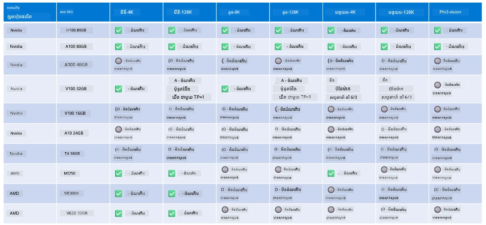

# ជំនួយគ្រឿងរឹង Phi

Microsoft Phi ត្រូវបានបង្កើតឱ្យសមស្របសម្រាប់ ONNX Runtime ហើយគាំទ្រ Windows DirectML។ វាដំណើរការល្អលើប្រភេទគ្រឿងរឹងផ្សេងៗ រួមមាន GPU, CPU និងឧបករណ៍ចល័តផងដែរ។

## គ្រឿងរឹងឧបករណ៍  
ជាក់ស្តែង គ្រឿងរឹងដែលគាំទររាប់បញ្ចូល៖

- GPU SKU: RTX 4090 (DirectML)
- GPU SKU: 1 A100 80GB (CUDA)
- CPU SKU: Standard F64s v2 (64 vCPU, 128 GiB មេម៉ូរី)

## SKU ចល័ត

- Android - Samsung Galaxy S21
- Apple iPhone 14 ឬខ្ពស់ជាង នឹងកម្មវិធីបំលែង A16/A17

## ការបញ្ជាក់គ្រឿងរឹង Phi

- ការកំណត់តម្លៃអប្បបរមាត្រូវការ។
- Windows: GPU ដែលអាចប្រើ DirectX 12 និង RAM បូកសរុបអប្បបរមា 4GB

CUDA: NVIDIA GPU ដែលមានសមត្ថភាពគណនា >= 7.02



## ដំណើរការ onnxruntime លើ GPU ស្ទួន

ម៉ូដែល Phi ONNX ដែលមានស្រាប់បច្ចុប្បន្នគឺសម្រាប់ GPU តែមួយប៉ុណ្ណោះ។ អាចគាំទ្រការប្រើប្រាស់ multi-gpu សម្រាប់ម៉ូដែល Phi បាន ប៉ុន្តែ ORT ជាមួយ 2 GPU មិនអាចធានាបានថាវានឹងផ្តល់ throughput ច្រើនជាង 2 instance របស់ ort ទេ។ សូមមើល [ONNX Runtime](https://onnxruntime.ai/) សម្រាប់ព័ត៌មានបន្ថែមថ្មីៗ។

នៅ [Build 2024 the GenAI ONNX Team](https://youtu.be/WLW4SE8M9i8?si=EtG04UwDvcjunyfC) បានប្រកាសថាពួកគេបានបើកការគ្រប់គ្រង multi-instance ជំនួស multi-gpu សម្រាប់ម៉ូដែល Phi។

បច្ចុប្បន្ននេះ អនុញ្ញាតឱ្យអ្នកដំណើរការ onnxruntime ឬ onnxruntime-genai មួយ instance ជាមួយរ៉ូបស្ថានប្រតិបត្តិការ CUDA_VISIBLE_DEVICES ដូចខាងក្រោម។

```Python
CUDA_VISIBLE_DEVICES=0 python infer.py
CUDA_VISIBLE_DEVICES=1 python infer.py
```
  
សូមស្វាគមន៍ស្វែងរក Phi បន្ថែមទៀតនៅក្នុង [Microsoft Foundry](https://ai.azure.com)

---

<!-- CO-OP TRANSLATOR DISCLAIMER START -->
**ការបដិសេធ**៖  
ឯកសារនេះត្រូវបានបំលែងជាភាសាផ្ទាល់ដោយប្រើសេវាកម្មបកប្រែ AI [Co-op Translator](https://github.com/Azure/co-op-translator)។ ខណៈពេលយើងព្យាយាមព្យាយាមឱ្យបានត្រឹមត្រូវ សូមចាប់អារម្មណ៍ថា ការបកប្រែដោយស្វ័យប្រវត្តិអាចមានកំហុសឬមិនត្រឹមត្រូវ។ ឯកសារដើមជាភាសាដើមគួរត្រូវបានអនុវត្តជាដៃគូផ្លូវการជាក់លាក់។ សម្រាប់ព័ត៌មានសំខាន់ៗ ការបកប្រែដោយមនុស្សដែលមានជំនាញត្រូវបានណែនាំ។ យើងមិនទទួលខុសត្រូវចំពោះការយល់ច្រឡំ ឬការបកប្រែខុសដោយប្រើការបកប្រែនេះឡើយ។
<!-- CO-OP TRANSLATOR DISCLAIMER END -->