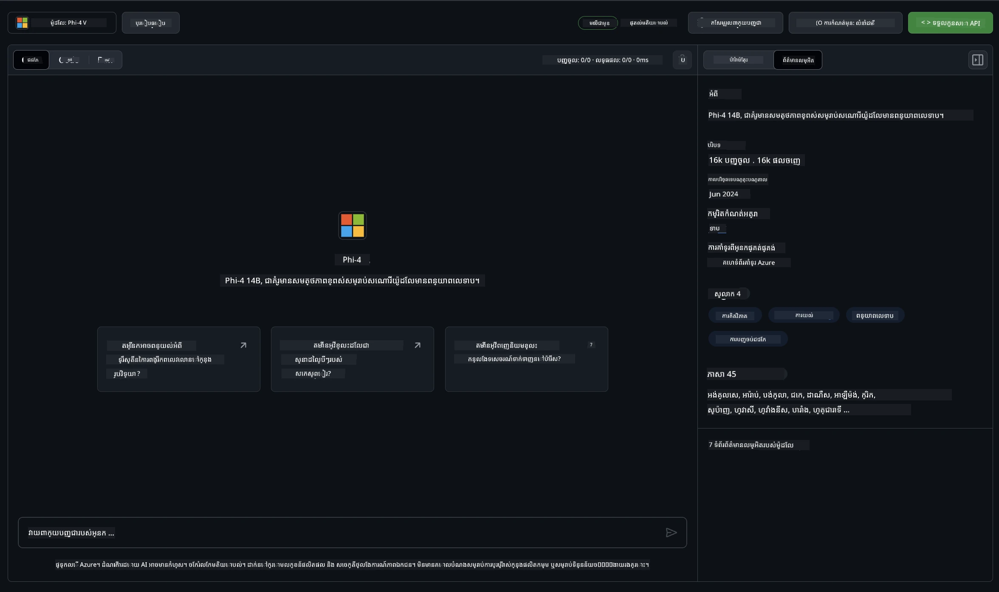

## គ្រួសារភីក្នុងម៉ូដែល GitHub

សូមស្វាគមន៍មកកាន់ [GitHub Models](https://github.com/marketplace/models) ! យើងបានរៀបចំអ្វីៗទាំងអស់រួចរាល់សម្រាប់អ្នកដើម្បីស្វែងរកម៉ូដែល AI ដែលមានបង្ហាញនៅលើ Azure AI។


សម្រាប់ព័ត៌មានបន្ថែមអំពីម៉ូដែលដែលមាននៅលើ GitHub Models សូមពិនិត្យមើល [GitHub Model Marketplace](https://github.com/marketplace/models)

## ម៉ូដែលដែលមាន

ម៉ូដែលនិមួយៗមានទីលំនៅសម្រាប់ល្បែងសាកល្បង និងកូដបរមា



### គ្រួសារភីនៅក្នុងកាតាឡុកម៉ូដែល GitHub

- [Phi-4](https://github.com/marketplace/models/azureml/Phi-4)

- [Phi-3.5-MoE instruct (128k)](https://github.com/marketplace/models/azureml/Phi-3-5-MoE-instruct)

- [Phi-3.5-vision instruct (128k)](https://github.com/marketplace/models/azureml/Phi-3-5-vision-instruct)

- [Phi-3.5-mini instruct (128k)](https://github.com/marketplace/models/azureml/Phi-3-5-mini-instruct)

- [Phi-3-Medium-128k-Instruct](https://github.com/marketplace/models/azureml/Phi-3-medium-128k-instruct)

- [Phi-3-medium-4k-instruct](https://github.com/marketplace/models/azureml/Phi-3-medium-4k-instruct)

- [Phi-3-mini-128k-instruct](https://github.com/marketplace/models/azureml/Phi-3-mini-128k-instruct)

- [Phi-3-mini-4k-instruct](https://github.com/marketplace/models/azureml/Phi-3-mini-4k-instruct)

- [Phi-3-small-128k-instruct](https://github.com/marketplace/models/azureml/Phi-3-small-128k-instruct)

- [Phi-3-small-8k-instruct](https://github.com/marketplace/models/azureml/Phi-3-small-8k-instruct)

## ការចាប់ផ្តើម

មានឧទាហរណ៍មូលដ្ឋានខ្លះៗស្រាប់សម្រាប់អ្នកដើម្បីរត់។ អ្នកអាចស្វែងរកពួកវានៅក្នុងថតឯកសារឧទាហរណ៍។ ប្រសិនបើអ្នកចង់ទៅផ្ទាល់ភាសាដែលអ្នកចូលចិត្ត អ្នកអាចស្វែងរកឧទាហរណ៍នៅក្នុងភាសាទាំងនេះ៖

- Python
- JavaScript
- C#
- Java
- cURL

មានបរិយាកាស Codespaces ដែលបង្កើតឡើងជាពិសេសសម្រាប់បញ្ជូនឧទាហរណ៍ និងម៉ូដែលផងដែរ។


## កូដឧទាហរណ៍

ខាងក្រោមគឺជាឧទាហរណ៍កូដសម្រាប់ការប្រើប្រាស់ខ្លះៗ។ សម្រាប់ព័ត៌មានបន្ថែមអំពី Azure AI Inference SDK សូមមើលឯកសារពេញនិយម និងឧទាហរណ៍។

## ការតំឡើង

1. បង្កើតសញ្ញាផ្ទាល់ខ្លួន
អ្នកមិនចាំបាច់ផ្តល់សិទ្ធិណាមួយចំពោះសញ្ញានោះទេ។ សូមចំណាំថាសញ្ញានឹងត្រូវបញ្ជូនទៅសេវាកម្ម Microsoft។

ដើម្បីប្រើកូដឧទាហរណ៍ខាងក្រោម សូមបង្កើតអថេរបរិជ្ជាជ្ជៈមួយដើម្បីកំណត់សញ្ញារបស់អ្នកជា key សម្រាប់កូដ client។

បើអ្នកប្រើ bash:
```
export GITHUB_TOKEN="<your-github-token-goes-here>"
```
បើអ្នកនៅក្នុង powershell:

```
$Env:GITHUB_TOKEN="<your-github-token-goes-here>"
```

បើអ្នកប្រើ Windows command prompt:

```
set GITHUB_TOKEN=<your-github-token-goes-here>
```

## ឧទាហរណ៍ Python

### តំឡើងការ Dependencies
តំឡើង Azure AI Inference SDK ដោយប្រើ pip (តម្រូវការជាប្រភេទ: Python >=3.8):

```
pip install azure-ai-inference
```
### រត់ឧទាហរណ៍កូដមូលដ្ឋាន

ឧទាហរណ៍នេះបង្ហាញការហៅមូលដ្ឋានទៅកាន់ API chat completion។ វាអាស្រ័យលើចំណុចផ្សាយម៉ូដែល AI GitHub និងសញ្ញា GitHub របស់អ្នក។ ការហៅនេះមានលក្ខណៈ synchronous។

```python
import os
from azure.ai.inference import ChatCompletionsClient
from azure.ai.inference.models import SystemMessage, UserMessage
from azure.core.credentials import AzureKeyCredential

endpoint = "https://models.inference.ai.azure.com"
model_name = "Phi-4"
token = os.environ["GITHUB_TOKEN"]

client = ChatCompletionsClient(
    endpoint=endpoint,
    credential=AzureKeyCredential(token),
)

response = client.complete(
    messages=[
        UserMessage(content="I have $20,000 in my savings account, where I receive a 4% profit per year and payments twice a year. Can you please tell me how long it will take for me to become a millionaire? Also, can you please explain the math step by step as if you were explaining it to an uneducated person?"),
    ],
    temperature=0.4,
    top_p=1.0,
    max_tokens=2048,
    model=model_name
)

print(response.choices[0].message.content)
```

### រត់ការសន្ទនាច្រើនជុំ

ឧទាហរណ៍នេះបង្ហាញការសន្ទនាច្រើនជុំជាមួយ API chat completion។ នៅពេលប្រើម៉ូដែលសម្រាប់កម្មវិធី chat អ្នកត្រូវតែគ្រប់គ្រងប្រវត្តិសន្ទនា និងផ្ញើសារថ្មីៗទៅម៉ូដែល។

```
import os
from azure.ai.inference import ChatCompletionsClient
from azure.ai.inference.models import AssistantMessage, SystemMessage, UserMessage
from azure.core.credentials import AzureKeyCredential

token = os.environ["GITHUB_TOKEN"]
endpoint = "https://models.inference.ai.azure.com"
# Replace Model_Name
model_name = "Phi-4"

client = ChatCompletionsClient(
    endpoint=endpoint,
    credential=AzureKeyCredential(token),
)

messages = [
    SystemMessage(content="You are a helpful assistant."),
    UserMessage(content="What is the capital of France?"),
    AssistantMessage(content="The capital of France is Paris."),
    UserMessage(content="What about Spain?"),
]

response = client.complete(messages=messages, model=model_name)

print(response.choices[0].message.content)
```

### ផ្ទុកចេញផលបញ្ចេញជាស្ទ្រីម

សម្រាប់បទពិសោធន៍ប្រើប្រាស់ល្អប្រសើរ អ្នកនឹងចង់ផ្ទុកចេញការឆ្លើយតបរបស់ម៉ូដែលជាស្ទ្រីម ដូច្នេះសញ្ញាដំបូងនឹងបង្ហាញមុន និងអ្នកនឹងជៀសវាងការរង់ចាំចម្លើយយូរ។

```
import os
from azure.ai.inference import ChatCompletionsClient
from azure.ai.inference.models import SystemMessage, UserMessage
from azure.core.credentials import AzureKeyCredential

token = os.environ["GITHUB_TOKEN"]
endpoint = "https://models.inference.ai.azure.com"
# Replace Model_Name
model_name = "Phi-4"

client = ChatCompletionsClient(
    endpoint=endpoint,
    credential=AzureKeyCredential(token),
)

response = client.complete(
    stream=True,
    messages=[
        SystemMessage(content="You are a helpful assistant."),
        UserMessage(content="Give me 5 good reasons why I should exercise every day."),
    ],
    model=model_name,
)

for update in response:
    if update.choices:
        print(update.choices[0].delta.content or "", end="")

client.close()
```

## ការប្រើប្រាស់ឥតគិតថ្លៃ និងការកំណត់អត្រាសម្រាប់ម៉ូដែល GitHub


[កំណត់អត្រាសម្រាប់ទីលានល្បែង និងការប្រើប្រាស់ API ឥតគិតថ្លៃ](https://docs.github.com/en/github-models/prototyping-with-ai-models#rate-limits) នេះមានគោលបំណងជួយអ្នកសាកល្បងម៉ូដែល និងគូទទួលគំរូកម្មវិធី AI របស់អ្នក។ សម្រាប់ការប្រើប្រាស់លើសកំណត់ទាំងនេះ និងដើម្បីពង្រីកកម្មវិធីរបស់អ្នក អ្នកត្រូវតែបង្កើតធនធានពីគណនី Azure ហើយផ្ទៀងផ្ទាត់តាមនោះជំនួសសញ្ញាពិភពផ្ទាល់ខ្លួន GitHub របស់អ្នក។ អ្នកមិនចាំបាច់ប្តូរអ្វីផ្សេងទៀតនៅក្នុងកូដរបស់អ្នកទេ។ ប្រើតំណខាងលើដើម្បីស្វែងរកវិធីកាត់ផុតពីកម្រិតឥតគិតថ្លៃនៅ Azure AI។

### ការបញ្ជាក់

ចងចាំពេលធ្វើការប្រតិបត្ដិការជាមួយម៉ូដែល អ្នកកំពុងសាកល្បង AI ដូច្នេះកំហុសក្នុងមាតិកាអាចកើតមានបាន។

លក្ខណៈពិសេសនេះមានកំណត់ផ្សេងៗ (រួមទាំងសំណើក្នុងមួយនាទី សំណើក្នុងមួយថ្ងៃ សញ្ញាក្នុងមួយសំណើ និងសំណើរប្រតិបត្ដិការជាមួយគ្នា) ហើយមិនត្រូវបានរចនាសម្រាប់ករណីប្រើប្រាស់ផលិតកម្ម។

GitHub Models ប្រើ Azure AI Content Safety។ ទំនាក់ទំនងទាំងនេះមិនអាចបិទបានជាមួយបទពិសោធន៍ GitHub Models។ ប្រសិនបើអ្នកសម្រេចចិត្តប្រើម៉ូដែលតាមសេវាបង់ប្រាក់ សូមកំណត់ការលាចមាតិការបស់អ្នកឲ្យបំពេញតាមតម្រូវការរបស់អ្នក។

សេវាកម្មនេះស្ថិតក្រោមលក្ខខណ្ឌមុនចេញផ្សាយរបស់ GitHub។

---

<!-- CO-OP TRANSLATOR DISCLAIMER START -->
**ការបដិសេធ**៖  
ឯកសារនេះត្រូវបានបកប្រែដោយប្រើសេវាបកប្រែលើក AI [Co-op Translator](https://github.com/Azure/co-op-translator)។ នៅពេលដែលយើងខិតខំប្រឹងប្រែងសម្រាប់ភាពត្រឹមត្រូវ សូមចងចាំថាការបកប្រែដោយស្វ័យប្រវត្តិអាចមានកំហុសឬមិនត្រឹមត្រូវបានខ្លះ។ ឯកសារដើមក្នុងភាសាដើមគួរត្រូវបានគេយកជាទំនាក់ទំនងសំខាន់បំផុត។ សម្រាប់ព័ត៌មានសំខាន់ សូមណែនាំអោយបកប្រែដោយប្រើអ្នកបកប្រែអ្នកជំនាញ។ យើងមិនទទួលខុសត្រូវចំពោះការយល់ច្រឡំ ឬការបកប្រែខុសប្រលោមផ្សេងៗដែលកើតមានពីការប្រើប្រាស់ការបកប្រែនេះឡើយ។
<!-- CO-OP TRANSLATOR DISCLAIMER END -->