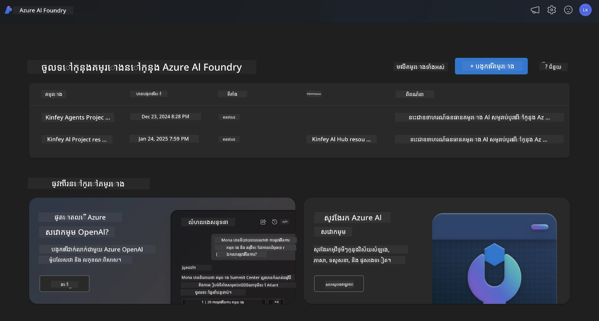
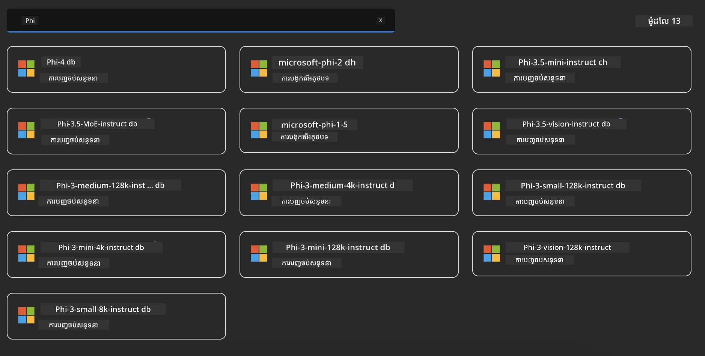
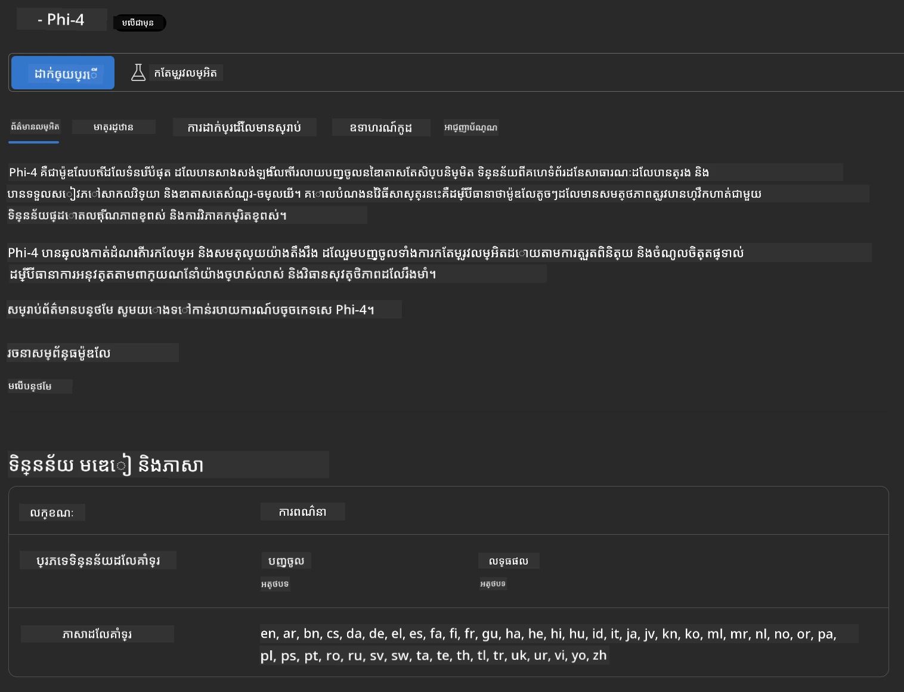
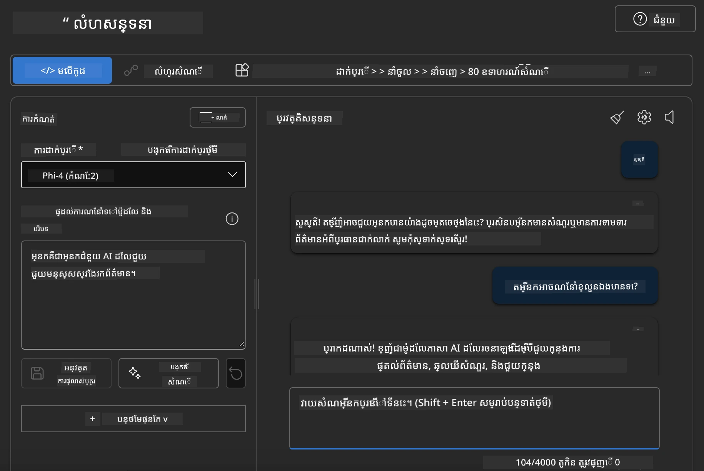

## គ្រួសារប៊ីនៅ Microsoft Foundry

[Microsoft Foundry](https://ai.azure.com) គឺជាវេទិកាមានទំនុកចិត្តដែលផ្តល់អំណាចឱ្យអ្នកអភិវឌ្ឍន៍ដើម្បីជំរុញនូវការច្នៃប្រឌិត និងរៀបចំអនាគតជាមួយ AI ក្នុងវិធីសុវត្ថិភាព មានសុវត្ថិភាព និងមានការទទួលខុសត្រូវ។


[Microsoft Foundry](https://ai.azure.com) ត្រូវបានរចនាឡើងសម្រាប់អ្នកអភិវឌ្ឍន៍ដើម្បី៖

- សាងសង់កម្មវិធី AI ប្រភេទបង្កើតលើវេទិកាថ្នាក់សហគ្រាស។
- ស្វែងយល់ សាងសង់ សាកល្បង និងដំឡើងដោយប្រើឧបករណ៍ AI និងម៉ូដែល ML ជំនាន់ខ្ពស់ដែលមានមូលដ្ឋានលើអនុស្សរណៈ AI ដែលទទួលខុសត្រូវ។
- សហការជាមួយក្រុមសម្រាប់វគ្គជីវិតពេញលេញនៃការអភិវឌ្ឍកម្មវិធី។

ជាមួយ Microsoft Foundry អ្នកអាចស្វែងរកម៉ូដែល សេវាកម្ម និងសមត្ថភាពភាគច្រើន ហើយចាប់ផ្តើមបង្កើតកម្មវិធី AI ដែលបម្រើគោលដៅរបស់អ្នកបានល្អបំផុត។ វេទិកា Microsoft Foundry ជួយឲ្យអាចពង្រីកសម្រាប់បម្លែងបញ្ញត្តិការសាកល្បងទៅជាកម្មវិធីផលិតកម្មពេញលេញបានយ៉ាងងាយស្រួល។ ការត្រួតពិនិត្យ និងកែលម្អបន្តទៅមុខគឺគាំទ្រដល់ជោគជ័យរយៈពេលយូរ។



ក្រៅពីការប្រើប្រាស់សេវា Azure AOAI នៅក្នុង Microsoft Foundry លោកអ្នកក៏អាចប្រើម៉ូដែលបុគ្គលទីបីក្នុងកាតាឡុកម៉ូដែល Microsoft Foundry ផងដែរ។ នេះជាជម្រើសល្អបើអ្នកចង់ប្រើ Microsoft Foundry ជាវេទិកាលក្ខណៈដំណោះស្រាយ AI របស់អ្នក។

យើងអាចដំឡើងម៉ូដែលគ្រួសារប៊ីបានយ៉ាងរហ័សតាមរយៈកាតាឡុកម៉ូដែលនៅក្នុង Microsoft Foundry

[Microsoft Phi Models in Microsoft Foundry Models](https://ai.azure.com/explore/models/?selectedCollection=phi)



### **ដំឡើង Phi-4 នៅក្នុង Microsoft Foundry**




### **សាកល្បង Phi-4 នៅ Microsoft Foundry Playground**



### **កំពុងរត់កូដ Python ដើម្បីហៅ Microsoft Foundry Phi-4**


```python

import os  
import base64
from openai import AzureOpenAI  
from azure.identity import DefaultAzureCredential, get_bearer_token_provider  
        
endpoint = os.getenv("ENDPOINT_URL", "Your Azure AOAI Service Endpoint")  
deployment = os.getenv("DEPLOYMENT_NAME", "Phi-4")  
      
token_provider = get_bearer_token_provider(  
    DefaultAzureCredential(),  
    "https://cognitiveservices.azure.com/.default"  
)  
  
client = AzureOpenAI(  
    azure_endpoint=endpoint,  
    azure_ad_token_provider=token_provider,  
    api_version="2024-05-01-preview",  
)  
  

chat_prompt = [
    {
        "role": "system",
        "content": "You are an AI assistant that helps people find information."
    },
    {
        "role": "user",
        "content": "can you introduce yourself"
    }
] 
    
# រួមបញ្ចូលលទ្ធផលសំនៀងប្រសិនបើសំនៀងត្រូវបានបើកใช้งาน
messages = chat_prompt 

completion = client.chat.completions.create(  
    model=deployment,  
    messages=messages,
    max_tokens=800,  
    temperature=0.7,  
    top_p=0.95,  
    frequency_penalty=0,  
    presence_penalty=0,
    stop=None,  
    stream=False  
)  
  
print(completion.to_json())  

```

---

<!-- CO-OP TRANSLATOR DISCLAIMER START -->
**ការបដិសេធ**៖  
ឯកសារនេះត្រូវបានបកប្រែដោយប្រើសេវាកម្មបកប្រែ AI [Co-op Translator](https://github.com/Azure/co-op-translator)។ ខណៈពេលដែលយើងខិតខំសំរាប់ភាពត្រឹមត្រូវ សូមយល់ថាការបកប្រែដោយស្វ័យប្រវត្តិអាចមានកំហុស ឬភាពមិនត្រឹមត្រូវ។ ឯកសារដើមក្នុងភាសាដើមគួរត្រូវបានគិតថាជាមូលដ្ឋានដែលមានអំណាច។ សម្រាប់ព័ត៏មានសំខាន់ៗ សូមផ្តោតលើការបកប្រែដោយមនុស្សជំនាញ។ យើងមិនទទួលខុសត្រូវចំពោះការយល់ច្រឡំ ឬការបកប្រែខុសដែលកើតឡើងពីការប្រើប្រាស់ការបកប្រែនេះទេ។
<!-- CO-OP TRANSLATOR DISCLAIMER END -->