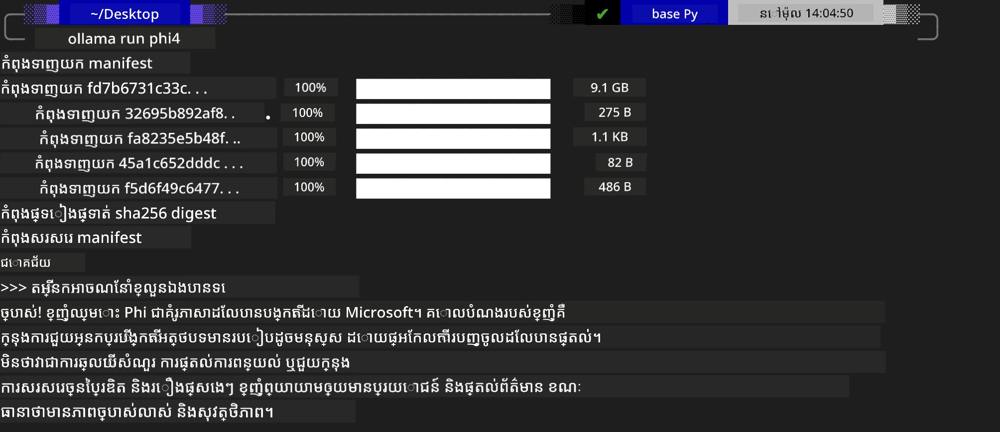
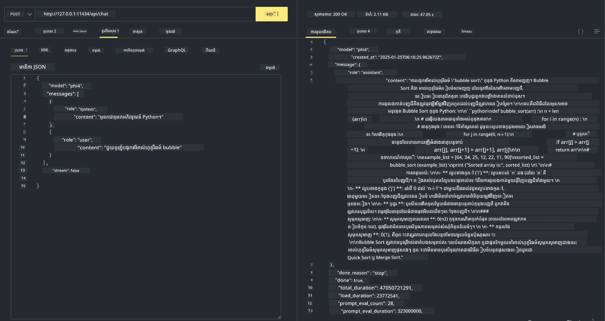

## គ្រួសារ Phi នៅក្នុង Ollama


[Ollama](https://ollama.com) អនុញ្ញាតឱ្យមនុស្សជាច្រើនបញ្ចេញ LLM ឬ SLM លើកូដបើកប្រភពផ្ទាល់តាមស្គ្រីបសាមញ្ញ ហើយក៏អាចបង្កើត API ដើម្បីជួយស្ថានភាពកម្មវិធី Copilot តំបន់បានផងដែរ។

## **1. ការដំឡើង**

Ollama គាំទ្រការរត់នៅលើ Windows, macOS, និង Linux។ អ្នកអាចដំឡើង Ollama តាមតំណភ្ជាប់នេះ ([https://ollama.com/download](https://ollama.com/download))។ បន្ទាប់ពីដំឡើងបានជោគជ័យ អ្នកអាចប្រើស្គ្រីប Ollama ដើម្បីហៅ Phi-3 តាមរយៈបង្អួច terminal តែម្ដង។ អ្នកអាចមើលបណ្ណាល័យទាំងអស់ [ដែលមាននៅក្នុង Ollama](https://ollama.com/library)។ បើអ្នកបើកហាងរក្សាទុកនេះក្នុង Codespace វានឹងមាន Ollama ដំឡើងរួចហើយ។

```bash

ollama run phi4

```

> [!NOTE]
> ម៉ូឌែលនឹងត្រូវទាញយកជាមុននៅពេលដែលអ្នករត់វាលើកដំបូង។ បញ្ចាក់ថា អ្នកអាចកំណត់ម៉ូឌែល Phi-4 ដែលបានទាញយករួចផងដែរ។ យើងយក WSL ជាឧទាហរណ៍សម្រាប់រត់ពាក្យបញ្ជា។ បន្ទាប់ពីម៉ូឌែលទាញយកបានជោគជ័យ អ្នកអាចធ្វើការបង្កើតអន្តរកម្មដោយផ្ទាល់លើ terminal ។



## **2. ហៅ API phi-4 ពី Ollama**

បើអ្នកចង់ហៅ API Phi-4 ដែលបង្កើតដោយ ollama អ្នកអាចប្រើពាក្យបញ្ជានេះនៅលើ terminal ដើម្បីចាប់ផ្តើមម៉ាស៊ីនបំរើ Ollama។

```bash

ollama serve

```

> [!NOTE]
> បើរត់នៅលើ MacOS ឬ Linux សូមចំណាំថាអ្នកអាចជួបប្រទៈបញ្ហាធ្វើដូចខាងក្រោម **"Error: listen tcp 127.0.0.1:11434: bind: address already in use"** អ្នកអាចទទួលបានកំហុសនេះនៅពេលហៅរត់ពាក្យបញ្ជា។ អ្នកអាចបង្ហោះកំហុសនោះដោយសារ វាមានន័យថាម៉ាស៊ីនបំរើបានរត់រួចហើយ ឬអ្នកអាចឈប់ និងចាប់ផ្តើមឡើងវិញ Ollama៖

**macOS**

```bash

brew services restart ollama

```

**Linux**

```bash

sudo systemctl stop ollama

```

Ollama គាំទ្រ ២ API គឺ generate និង chat។ អ្នកអាចហៅ API ម៉ូឌែលដែល Ollama ផ្តល់ជូនដោយផ្អែកលើតម្រូវការ របស់អ្នក ដោយផ្ញើសំណើទៅសេវាកម្មក្នុងស្រុកដែលរត់នៅច្រក 11434។

**Chat**

```bash

curl http://127.0.0.1:11434/api/chat -d '{
  "model": "phi3",
  "messages": [
    {
      "role": "system",
      "content": "Your are a python developer."
    },
    {
      "role": "user",
      "content": "Help me generate a bubble algorithm"
    }
  ],
  "stream": false
  
}'
```

នេះជាលទ្ធផលដូចជា Postman



## មធ្យោបាយបន្ថែម

ពិនិត្យបញ្ជីម៉ូឌែលដែលមាននៅក្នុង Ollama នៅ [បណ្ណាល័យរបស់ពួកគេ](https://ollama.com/library)។

ទាញយកម៉ូឌែលរបស់អ្នកពីម៉ាស៊ីនបំរើ Ollama ដោយប្រើពាក្យបញ្ជានេះ

```bash
ollama pull phi4
```

រត់ម៉ូឌែលដោយប្រើពាក្យបញ្ជានេះ

```bash
ollama run phi4
```

***ចំណាំ:*** ទស្សនាតំណនេះ [https://github.com/ollama/ollama/blob/main/docs/api.md](https://github.com/ollama/ollama/blob/main/docs/api.md) ដើម្បីស្គាល់លម្អិតបន្ថែម

## ហៅ Ollama ពី Python

អ្នកអាចប្រើ `requests` ឬ `urllib3` ដើម្បីធ្វើសំណើទៅចំណុចបញ្ចប់ម៉ាស៊ីនបំរើក្នុងស្រុកដែលបានប្រើខាងលើ។ ទោះយ៉ាងណា វិធីពេញនិយមក្នុងការប្រើ Ollama នៅក្នុង Python គឺតាមរយៈ SDK [openai](https://pypi.org/project/openai/)，ដោយសារតែ Ollama ផ្តល់នូវចំណុចបញ្ចប់ម៉ាស៊ីនបំរើដែលស្របតាម OpenAI ផងដែរ។

នេះគឺជាគំរូសម្រាប់ phi3-mini៖

```python
import openai

client = openai.OpenAI(
    base_url="http://localhost:11434/v1",
    api_key="nokeyneeded",
)

response = client.chat.completions.create(
    model="phi4",
    temperature=0.7,
    n=1,
    messages=[
        {"role": "system", "content": "You are a helpful assistant."},
        {"role": "user", "content": "Write a haiku about a hungry cat"},
    ],
)

print("Response:")
print(response.choices[0].message.content)
```

## ហៅ Ollama ពី JavaScript

```javascript
// ឧទាហរណ៍នៃការសង្ខេបឯកសារជាមួយ Phi-4
script({
    model: "ollama:phi4",
    title: "Summarize with Phi-4",
    system: ["system"],
})

// ឧទាហរណ៍នៃការសង្ខេប
const file = def("FILE", env.files)
$`Summarize ${file} in a single paragraph.`
```

## ហៅ Ollama ពី C#

បង្កើតកម្មវិធី Console C# ថ្មីមួយ ហើយបន្ថែមកញ្ចប់ NuGet ខាងក្រោម៖

```bash
dotnet add package Microsoft.SemanticKernel --version 1.34.0
```

បន្ទាប់មកផ្លាស់ប្តូរកូដនេះនៅក្នុងឯកសារ `Program.cs`

```csharp
using Microsoft.SemanticKernel;
using Microsoft.SemanticKernel.ChatCompletion;

// add chat completion service using the local ollama server endpoint
#pragma warning disable SKEXP0001, SKEXP0003, SKEXP0010, SKEXP0011, SKEXP0050, SKEXP0052
builder.AddOpenAIChatCompletion(
    modelId: "phi4",
    endpoint: new Uri("http://localhost:11434/"),
    apiKey: "non required");

// invoke a simple prompt to the chat service
string prompt = "Write a joke about kittens";
var response = await kernel.InvokePromptAsync(prompt);
Console.WriteLine(response.GetValue<string>());
```

រត់កម្មវិធីដោយប្រើពាក្យបញ្ជា៖

```bash
dotnet run
```

---

<!-- CO-OP TRANSLATOR DISCLAIMER START -->
**ការបដិសេធ**៖  
ឯកសារនេះត្រូវបានបកប្រែដោយប្រើសេវាបកប្រែ AI [Co-op Translator](https://github.com/Azure/co-op-translator)។ ខណៈពេលដែលយើងខំប្រឹងប្រែងក្នុងការទទួលបានភាពត្រឹមត្រូវ សូមយួរដឹងថាការបកប្រែដោយស្វ័យប្រវត្តិក្នុងករណីខ្លះអាចមានកំហុសឬភាពមិនត្រឹមត្រូវ។ ឯកសារដើមនៅក្នុងភាសាទាំងមូលគួរត្រូវបានគិតថាជាអ្នកផ្តល់ព័ត៌មានផ្លូវការ។ សម្រាប់ព័ត៌មានសំខាន់ៗ គួរតែប្រើការបកប្រែដោយអ្នកជំនាញមនុស្ស។ យើងមិនទទួលខុសត្រូវចំពោះការយល់ច្រឡំណឬការបកបញ្ជូនខុសឆ្គងណាមួយដែលកើតឡើងពីការប្រើប្រាស់ការបកប្រែនេះទេ។
<!-- CO-OP TRANSLATOR DISCLAIMER END -->