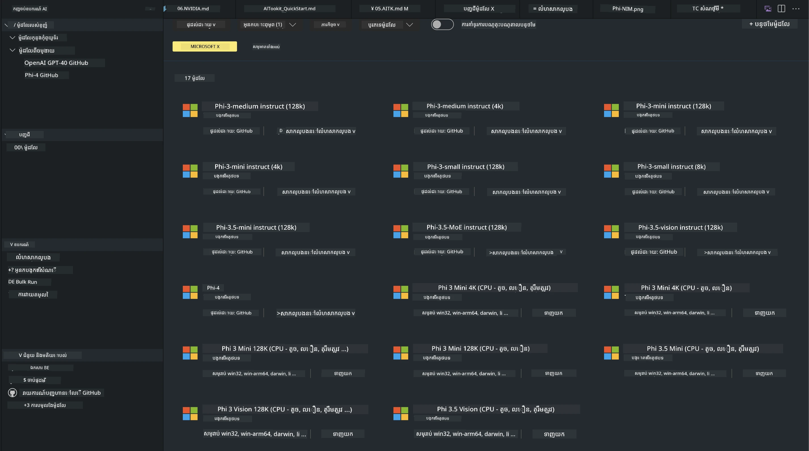
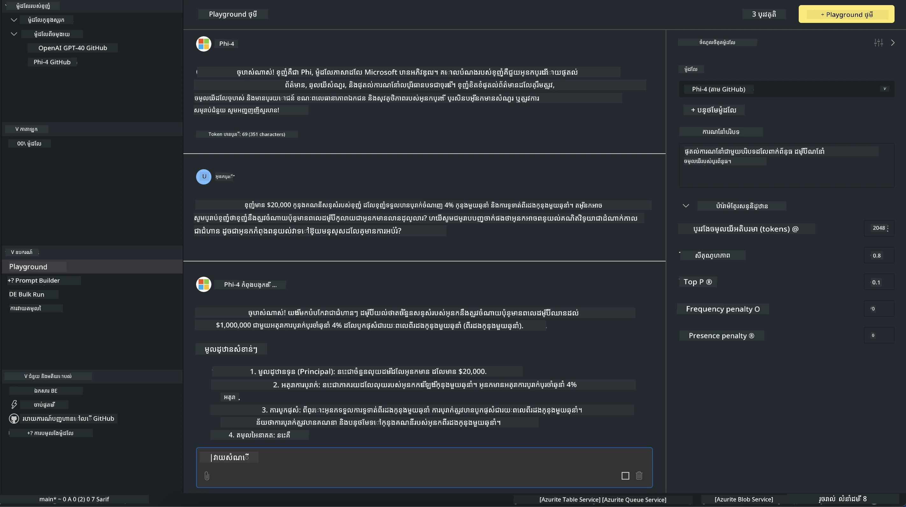

# គ្រួសារភី ក្នុង AITK

[ឧបករណ៍ AI សម្រាប់ VS Code](https://marketplace.visualstudio.com/items?itemName=ms-windows-ai-studio.windows-ai-studio) បន្លឺអភិវឌ្ឍកម្មវិធី AI កំណត់ប្រែដោយយកឧបករណ៍អភិវឌ្ឍ និងម៉ូដែល AI កំពូលពីកាតាឡុក Microsoft Foundry និងកាតាឡុកផ្សេងទៀតដូចជា Hugging Face មកភ្ជាប់គ្នា។ អ្នកនឹងអាចរកមើលកាតាឡុកម៉ូដែល AI ដែលមានឥទ្ធិពលដោយ GitHub Models និង Microsoft Foundry Model Catalogs, ទាញយកបន្ទាន់តែមកក្នុងកុំព្យូទ័រឬឆ្ងាយ, បត់បែន, សាកល្បង និងប្រើប្រាស់ក្នុងកម្មវិធីរបស់អ្នក។

AI Toolkit Preview នឹងរត់នៅក្នុងកុំព្យូទ័រផ្ទាល់។ ការវិភាគបង្កើតឬបត់បែនក្នុងថតផ្ទាល់ គឺអាស្រ័យលើម៉ូដែលដែលអ្នកបានជ្រើសរើស ហើយអ្នកអាចត្រូវការមាន GPU ដូចជា NVIDIA CUDA GPU។ អ្នកអាចរត់ម៉ូដែល GitHub ដោយផ្ទាល់ជាមួយ AITK ផងដែរ។

## ចាប់ផ្ដើម

[សូមរៀនបន្ថែមពីរបៀបដំឡើង Windows subsystem សម្រាប់ Linux](https://learn.microsoft.com/windows/wsl/install?WT.mc_id=aiml-137032-kinfeylo)

និង [ប្តូររបាយការណ៍ចែកចាយលំនាំដើម](https://learn.microsoft.com/windows/wsl/install#change-the-default-linux-distribution-installed)។

[GitHub Repository របស់ AI Tooklit](https://github.com/microsoft/vscode-ai-toolkit/)

- Windows,Linux,macOS
  
- សម្រាប់ការបត់បែនលើទាំង Windows និង Linux អ្នកនឹងត្រូវការម៉ាស៊ីន Nvidia GPU។ ជាពិសេស **Windows** ត្រូវការមាន subsystem សម្រាប់ Linux ជាមួយ Ubuntu distro 18.4 ឬ​ថ្មីជាងនេះ។ [សូមរៀនបន្ថែមពីរបៀបដំឡើង Windows subsystem សម្រាប់ Linux](https://learn.microsoft.com/windows/wsl/install) និង [ប្តូររបាយការណ៍ចែកចាយលំនាំដើម](https://learn.microsoft.com/windows/wsl/install#change-the-default-linux-distribution-installed)។

### ដំឡើង AI Toolkit

AI Toolkit ត្រូវបានផ្តល់ជាផ្នែកបន្ថែម [Visual Studio Code Extension](https://code.visualstudio.com/docs/setup/additional-components#_vs-code-extensions), ដូច្នេះអ្នកត្រូវតែដំឡើង [VS Code](https://code.visualstudio.com/docs/setup/windows?WT.mc_id=aiml-137032-kinfeylo) ជាមុនសិន ហើយទាញយក AI Toolkit ពី [VS Marketplace](https://marketplace.visualstudio.com/items?itemName=ms-windows-ai-studio.windows-ai-studio)។  
[AI Toolkit មាននៅក្នុង Visual Studio Marketplace](https://marketplace.visualstudio.com/items?itemName=ms-windows-ai-studio.windows-ai-studio) ហើយអាចដំឡើងដូចជាផ្នែកបន្ថែម VS Code ផ្សេងទៀត។

ប្រសិនបើអ្នកមិនស្គាល់ពីការដំឡើងផ្នែកបន្ថែម VS Code, សូមអនុវត្តជំហានខាងក្រោម៖

### ចូលគណនី

1. នៅលើ Activity Bar ក្នុង VS Code ជ្រើស **Extensions**  
1. ក្នុង Extension Search បញ្ចូលពាក្យ "AI Toolkit"  
1. ជ្រើស "AI Toolkit for Visual Studio code"  
1. ជ្រើស **Install**

ឥឡូវនេះ អ្នកបានត្រៀមខ្លួនបើកប្រើផ្នែកបន្ថែមហើយ!

អ្នកនឹងត្រូវបានរំលឹកឲ្យចូលគណនី GitHub សូមចុច "Allow" ដើម្បីបន្ត។ អ្នកនឹងត្រូវបានបញ្ជូនទៅ​ទំព័រ​ចុះ​ឈ្មោះ GitHub។

សូមចូលគណនី និងអនុវត្តជំហានមួយៗ។ ក្រោយពេលជោគជ័យ អ្នកនឹងត្រូវបានបញ្ជូនទៅ VS Code។

ពេលផ្នែកបន្ថែមត្រូវបានដំឡើង អ្នកនឹងមើលឃើញរូបតំណាង AI Toolkit ភាគរយនៅ Activity Bar របស់អ្នក។

មកស្វែងយល់អំពីសកម្មភាពដែលអាចប្រើបាន!

### សកម្មភាពដែលអាចប្រើបាន

ផ្នែកគន្លងដើមនៃ AI Toolkit ត្រូវបានរៀបចំបែបនេះ៖  

- **ម៉ូដែល**  
- **ធនធាន**  
- **ផ្ទាំងលេង**  
- **បត់បែន**  
- **វាយតម្លៃ**

សកម្មភាពទាំងនេះមាននៅផ្នែកធនធាន។ ដើម្បីចាប់ផ្ដើម ជ្រើស **Model Catalog**។

### ទាញយកម៉ូដែលពីកាតាឡុក

ពេលបើក AI Toolkit ពីផ្នែក Activity Bar របស់ VS Code អ្នកអាចជ្រើសរើសពីជម្រើសខាងក្រោម៖



- ស្វែងរកម៉ូដែលគាំទ្រពី **Model Catalog** ហើយទាញយកនៅក្នុងកុំព្យូទ័រពីរបាទ  
- សាកល្បងម៉ូដែលនៅក្នុង **Model Playground**  
- បត់បែនម៉ូដែលនៅក្នុងកុំព្យូទ័រផ្ទាល់ឬឆ្ងាយនៅក្នុង **Model Fine-tuning**  
- ប្រើម៉ូដែលបត់បែនទៅកាន់ពពកតាមវិធីពាក្យបញ្ជារសម្រាប់ AI Toolkit  
- វាយតម្លៃម៉ូដែល

> [!NOTE]
>
> **GPU ពី CPU**  
>
> អ្នកនឹងសង្កេតឃើញថាកាតាសម្រាប់ម៉ូដែលបង្ហាញទំហំម៉ូដែល, វេទិកា និងប្រភេទជំរុញ (CPU, GPU)។ សម្រាប់បង្ហាញការអនុវត្តល្អបំផុតលើ **ឧបករណ៍ Windows ដែលមាន GPU តែមួយយ៉ាងតិចមួយ**, សូមជ្រើសប្រភេទម៉ូដែលដែលមានគោលដៅតែមួយនៅលើ Windows។  
>
> នេះធានាថាអ្នកមានម៉ូដែលដែលឆាប់រហ័សសម្រាប់ជំរុញ DirectML។  
>
> ឈ្មោះម៉ូដែលមានទ្រង់ទ្រាយជា  
>
> - `{model_name}-{accelerator}-{quantization}-{format}`។  
>
> ដើម្បីពិនិត្យថាអ្នកមាន GPU នៅលើឧបករណ៍ Windows របស់អ្នកទេ សូមបើក **Task Manager** ហើយជ្រើសផ្ទាំង **Performance**។ ប្រសិនបើមាន GPU សូមមើលបញ្ជីឈ្មោះថា "GPU 0" ឬ "GPU 1"។

### រត់ម៉ូដែលនៅក្នុងផ្ទាំងលេង

បន្ទាប់ពីកំណត់ប៉ារ៉ាម៉ែត្រទាំងអស់រួច សូមចុច **Generate Project**។

ពេលម៉ូដែលរបស់អ្នកទាញយករួច សូមជ្រើស **Load in Playground** នៅលើកាតាមួយម៉ូដែលក្នុងកាតាឡុក៖

- ចាប់ផ្ដើមដំណើរការទាញយកម៉ូដែល  
- ដំឡើងកម្មវិធីជំនួយ និងការពឹងផ្អែកទាំងអស់  
- បង្កើតកន្លែងការងារ VS Code  



### ប្រើប្រាស់ REST API នៅក្នុងកម្មវិធីរបស់អ្នក

AI Toolkit មាន REST API តំណភ្ជាប់ក្នុងបណ្តាញផ្ទាល់ **នៅច្រកលេខ 5272** ដែលប្រើ [ទ្រង់ទ្រាយបញ្ចប់ជជែក OpenAI](https://platform.openai.com/docs/api-reference/chat/create)។

វាអនុញ្ញាតឲ្យអ្នកសាកល្បងកម្មវិធីរបស់អ្នកនៅក្នុងកុំព្យូទ័រផ្ទាល់ដោយមិនចាំបាច់ពឹងពាក់សេវាកម្មម៉ូដែល AI ពពក។ ឧទាហរណ៍, ឯកសារ JSON ខាងក្រោមបង្ហាញរបៀបកំណត់រាងរំលងសំណើ៖

```json
{
    "model": "Phi-4",
    "messages": [
        {
            "role": "user",
            "content": "what is the golden ratio?"
        }
    ],
    "temperature": 0.7,
    "top_p": 1,
    "top_k": 10,
    "max_tokens": 100,
    "stream": true
}
```
  
អ្នកអាចសាកល្បង REST API ដោយប្រើប្រាស់ (ឧទាហរណ៍) [Postman](https://www.postman.com/) ឬកម្មវិធី CURL (Client URL)៖

```bash
curl -vX POST http://127.0.0.1:5272/v1/chat/completions -H 'Content-Type: application/json' -d @body.json
```
  
### ប្រើបណ្ណាល័យអតិថិជន OpenAI សម្រាប់ភាសា Python

```python
from openai import OpenAI

client = OpenAI(
    base_url="http://127.0.0.1:5272/v1/", 
    api_key="x" # ត្រូវការ​សម្រាប់ API ប៉ុន្តែមិនបានប្រើ។
)

chat_completion = client.chat.completions.create(
    messages=[
        {
            "role": "user",
            "content": "what is the golden ratio?",
        }
    ],
    model="Phi-4",
)

print(chat_completion.choices[0].message.content)
```
  
### ប្រើបណ្ណាល័យអតិថិជន Azure OpenAI សម្រាប់ .NET

បន្ថែម [បណ្ណាល័យអតិថិជន Azure OpenAI សម្រាប់ .NET](https://www.nuget.org/packages/Azure.AI.OpenAI/) ចូលក្នុងគម្រោងរបស់អ្នកដោយប្រើ NuGet៖

```bash
dotnet add {project_name} package Azure.AI.OpenAI --version 1.0.0-beta.17
```
  
បន្ថែមឯកសារ C# ឈ្មោះ **OverridePolicy.cs** ទៅក្នុងគម្រោងរបស់អ្នក ហើយបិទបញ្ចូលកូដខាងក្រោម៖

```csharp
// OverridePolicy.cs
using Azure.Core.Pipeline;
using Azure.Core;

internal partial class OverrideRequestUriPolicy(Uri overrideUri)
    : HttpPipelineSynchronousPolicy
{
    private readonly Uri _overrideUri = overrideUri;

    public override void OnSendingRequest(HttpMessage message)
    {
        message.Request.Uri.Reset(_overrideUri);
    }
}
```
  
បន្ទាប់មក, បិទបញ្ចូលកូដខាងក្រោមទៅក្នុងឯកសារ **Program.cs** របស់អ្នក៖

```csharp
// Program.cs
using Azure.AI.OpenAI;

Uri localhostUri = new("http://localhost:5272/v1/chat/completions");

OpenAIClientOptions clientOptions = new();
clientOptions.AddPolicy(
    new OverrideRequestUriPolicy(localhostUri),
    Azure.Core.HttpPipelinePosition.BeforeTransport);
OpenAIClient client = new(openAIApiKey: "unused", clientOptions);

ChatCompletionsOptions options = new()
{
    DeploymentName = "Phi-4",
    Messages =
    {
        new ChatRequestSystemMessage("You are a helpful assistant. Be brief and succinct."),
        new ChatRequestUserMessage("What is the golden ratio?"),
    }
};

StreamingResponse<StreamingChatCompletionsUpdate> streamingChatResponse
    = await client.GetChatCompletionsStreamingAsync(options);

await foreach (StreamingChatCompletionsUpdate chatChunk in streamingChatResponse)
{
    Console.Write(chatChunk.ContentUpdate);
}
```


## បត់បែនជាមួយ AI Toolkit

- ចាប់ផ្ដើមជាមួយការស្វែងរកម៉ូដែល និងផ្ទាំងលេង។  
- បត់បែនម៉ូដែល និងវិភាគបង្កើតដោយប្រើធនធានគណនាទំនើបផ្ទាល់។  
- បត់បែន និងវិភាគបង្កើតឆ្ងាយដោយប្រើធនធាន Azure

[បត់បែនជាមួយ AI Toolkit](../../03.FineTuning/Finetuning_VSCodeaitoolkit.md)

## ធនធានសំណួរ និងចម្លើយ AI Toolkit

សូមយោងទៅកាន់ [ទំព័រសំណួរ និងចម្លើយ](https://github.com/microsoft/vscode-ai-toolkit/blob/main/archive/QA.md) សម្រាប់បញ្ហាទូទៅ និងដំណោះស្រាយ។

---

<!-- CO-OP TRANSLATOR DISCLAIMER START -->
**ការព្រមាន**៖  
ឯកសារនេះត្រូវបានបកប្រែដោយប្រើសេវាកម្មបកប្រែ AI [Co-op Translator](https://github.com/Azure/co-op-translator)។ ខណៈពេលដែលយើងខិតខំសម្រាប់ភាពត្រឹមត្រូវ សូមយល់ឲ្យបានថាការបកប្រែដោយស្វ័យប្រវត្តិអាចមានកំហុសឬភាពមិនត្រឹមត្រូវ។ ឯកសារដើមក្នុងភាសាតំបន់ដើមគួរត្រូវបានចាត់ទុកជាដើមទូលាយ។ សម្រាប់ព័ត៌មានសំខាន់ៗ ការបកប្រែដោយអ្នកជំនាញមនុស្សគួរត្រូវបានផ្តល់អានុភាព។ យើងមិនទទួលខុសត្រូវចំពោះការយល់ច្រឡំ ឬការប្រហែលខុសណាមួយដែលកើតឡើងពីការប្រើប្រាស់ការបកប្រែនេះឡើយ។
<!-- CO-OP TRANSLATOR DISCLAIMER END -->