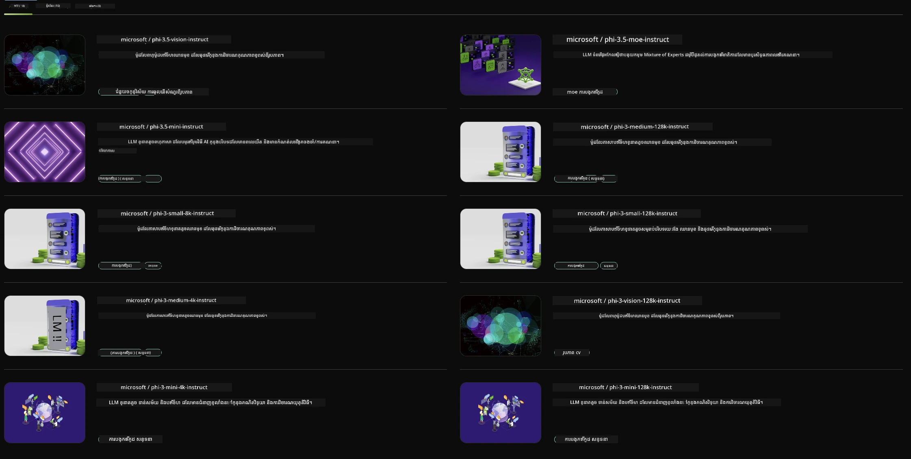

## គ្រួសារ Phi នៅក្នុង NVIDIA NIM

NVIDIA NIM គឺជាជួរមីក្រូសេវាកម្មដែលងាយស្រួលប្រើ ដែលត្រូវបានរចនាឡើងដើម្បីលឿនការដាក់ពង្រីកម៉ូដែល AI បង្កើតនៅលើឯកសារមេឌា, មជ្ឈមណ្ឌលទិន្នន័យ និងកុំព្យូទ័រការងារ។ NIM ត្រូវបានចាត់ថ្នាក់ទៅតាមគ្រួសារម៉ូដែល និងមាស៉៊ីនមួយមុខមួយ។ ឧទាហរណ៍ NVIDIA NIM សម្រាប់ម៉ូដែលភាសាធំ (LLMs) បាននាំសមត្ថភាពរបស់ LLMs តំប្រាប់ស្ថានភាពឧទ្ទមទៅកម្មវិធីអាជីវកម្ម ផ្ដល់នូវសមត្ថភាពដឹងភាសា និងបញ្ញាស្មារតីដែលមិនអាចប្រៀបបាន។

NIM ធ្វើអោយមានភាពងាយស្រួលសម្រាប់ក្រុម IT និង DevOps ដើម្បីផ្ទាល់ដំណើរការម៉ូដែលភាសាធំ (LLMs) នៅក្នុងបរិស្ថានដែលគ្រប់គ្រងដោយខ្លួនឯង ខណៈធ្វើអោយអ្នកអភិវឌ្ឍន៍តភ្ជាប់បានជាមួយ API ស្តង់ដារឧស្សាហកម្ម ដែលអាចអោយពួកគេសង់ copilots, chatbots, និងអ្នកជំនួយ AI ដែលអាចបម្លែងអាជីវកម្មរបស់ពួកគេ។ ដោយប្រើប្រាស់កម្រិតល្បឿន GPU បច្ចេកវិទ្យាខ្ពស់របស់ NVIDIA និងការដាក់ពង្រីកដែលអាចធ្វើបានងាយ ប្រព័ន្ធ NIM ផ្តល់មធ្យោបាយលឿនបំផុតដើម្បីទាញយកលទ្ធផលជាមួយ ប្រសិទ្ធភាពមិនអាចប្រកួតប្រជែងបាន។

អ្នកអាចប្រើ NVIDIA NIM សម្រាប់បញ្ជាក់ម៉ូដែលគ្រួសារ Phi



### **គំរូ - Phi-3-Vision ក្នុង NVIDIA NIM**

សូមគូរអារម្មណ៍ថាអ្នកមានរូបភាពមួយ (`demo.png`) ហើយអ្នកចង់បង្កើតកូដ Python ដែលដំណើរការរូបភាពនេះ ហើយរក្សាទុកជាបម្រួលថ្មីមួយ (`phi-3-vision.jpg`)។

កូដខាងលើស្វ័យប្រវត្តិដំណើរការនេះដោយ៖

1. តំឡើងបរិស្ថាន និង ការកំណត់ដែលចាំបាច់។
2. បង្កើតសេចក្តីជូនដំណឹងបញ្ជា ដែលពួកម៉ូដែលត្រូវបង្កើតកូដ Python តាមតម្រូវការ។
3. ផ្ញើសេចក្តីជូនដំណឹងទៅម៉ូដែល ហើយប្រមូលកូដដែលបានបង្កើត។
4. ដកស្រង់និងបង្ហាញកូដដែលបានបង្កើត។
5. បង្ហាញរូបភាពដើម និងរូបភាពដែលបានដំណើរការ។

វិធីនេះប្រើប្រាស់អំណាចនៃ AI ដើម្បីស្វ័យប្រវត្តិការងារដំណើរការរូបភាព ដែលធ្វើឲ្យមានភាពងាយស្រួល និងលឿនក្នុងការសម្រេចគោលបំណងរបស់អ្នក។

[Sample Code Solution](../../../code/06.E2E/E2E_Nvidia_NIM_Phi3_Vision.ipynb)

កូដទាំងមូលធ្វើអ្វីខ្លះមកវិញយើងចែកជាជំហាន៖

1. **ដំឡើងកញ្ចប់ដែលត្រូវការ**៖  
    ```python
    !pip install langchain_nvidia_ai_endpoints -U
    ```
 ពាក្យបញ្ជានេះដំឡើងកញ្ចប់ `langchain_nvidia_ai_endpoints` ដោយធានាថាជា版本ថ្មីបំផុត។

2. **នាំចូលម៉ូឌុលដែលចាំបាច់**៖  
    ```python
    from langchain_nvidia_ai_endpoints import ChatNVIDIA
    import getpass
    import os
    import base64
    ```
 ការនាំចូលទាំងនេះយកម៉ូឌុលចាំបាច់សម្រាប់អន្តរកម្មជាមួយខ្សែទីចូល AI របស់ NVIDIA, គ្រប់គ្រងពាក្យសម្ងាត់ដោយសុវត្ថិភាព, អន្តរកម្មប្រព័ន្ធប្រតិបត្តិការ និង encode/decode ទិន្នន័យបែប base64។

3. **កំណត់កូនសោ API**៖  
    ```python
    if not os.getenv("NVIDIA_API_KEY"):
        os.environ["NVIDIA_API_KEY"] = getpass.getpass("Enter your NVIDIA API key: ")
    ```
 កូដនេះពិនិត្យមើលថាតើខ្សែរអានុភាព `NVIDIA_API_KEY` ត្រូវបានកំណត់រួចហើយទេ។ ប្រសិនបើមិនមាន វាស្នើឲ្យអ្នកបញ្ចូលកូនសោ API ដោយសុវត្ថិភាព។

4. **កំណត់ម៉ូដែល និង ផ្លូវរូបភាព**៖  
    ```python
    model = 'microsoft/phi-3-vision-128k-instruct'
    chat = ChatNVIDIA(model=model)
    img_path = './imgs/demo.png'
    ```
 កូដនេះកំណត់ម៉ូដែលដែលត្រូវប្រើ បង្កើតអ实例 `ChatNVIDIA` ជាមួយម៉ូដែលដែលបានកំណត់ និងកំណត់ផ្លូវទៅឯកសាររូបភាព។

5. **បង្កើតសេចក្តីជូនដំណឹងអត្ថបទ**៖  
    ```python
    text = "Please create Python code for image, and use plt to save the new picture under imgs/ and name it phi-3-vision.jpg."
    ```
 កូដនេះបង្កើតសេចក្តីជូនដំណឹងអត្ថបទដែលបញ្ជាឲ្យម៉ូដែលបង្កើតកូដ Python សម្រាប់ដំណើរការរូបភាព។

6. **Encode រូបភាពជា Base64**៖  
    ```python
    with open(img_path, "rb") as f:
        image_b64 = base64.b64encode(f.read()).decode()
    image = f''
    ```
 កូដនេះអានឯកសាររូបភាព encode វាជា base64 ហើយបង្កើតស្លាក  HTML ជាមួយទិន្នន័យដែលបាន encode។

7. **បញ្ចូលអត្ថបទនិងរូបភាពជាសេចក្តីជូនដំណឹងមួយ**៖  
    ```python
    prompt = f"{text} {image}"
    ```
 កូដនេះផ្សំសេចក្តីជូនដំណឹងអត្ថបទនិងស្លាករូបភាព HTML ជារឿងតែមួយ។

8. **បង្កើតកូដដោយប្រើ ChatNVIDIA**៖  
    ```python
    code = ""
    for chunk in chat.stream(prompt):
        print(chunk.content, end="")
        code += chunk.content
    ```
 កូដនេះផ្ញើសេចក្តីជូនដំណឹងទៅម៉ូដែល `ChatNVIDIA` ហើយប្រមូលកូដដែលបានបង្កើតជាប្លុកៗ បោះពុម្ភ និងបន្ថែមប្លុកនីមួយៗចំពោះខ្សែអក្សរ `code`។

9. **ដកកូដ Python ពីអត្ថបទបានបង្កើត**៖  
    ```python
    begin = code.index('```python') + 9
    code = code[begin:]
    end = code.index('```')
    code = code[:end]
    ```
 កូដនេះដកយកកូដ Python ពិតប្រាកដពីអត្ថបទដែលបានបង្កើតដោយដកផ្នែក markdown ទៅ។

10. **ដំណើរការកូដដែលបានដក**៖  
    ```python
    import subprocess
    result = subprocess.run(["python", "-c", code], capture_output=True)
    ```
 កូដនេះដំណើរការកូដ Python ដែលបានដកជាទម្រង់ subprocess ហើយទទួលយកលទ្ធផល។

11. **បង្ហាញរូបភាព**៖  
    ```python
    from IPython.display import Image, display
    display(Image(filename='./imgs/phi-3-vision.jpg'))
    display(Image(filename='./imgs/demo.png'))
    ```
 បន្ទាត់ទាំងនេះបង្ហាញរូបភាពដោយប្រើម៉ូឌុល `IPython.display`។

---

<!-- CO-OP TRANSLATOR DISCLAIMER START -->
**ការបដិសេធ**៖  
ឯកសារនេះត្រូវបានបកប្រែដោយប្រើសេវាកម្មបកប្រែ AI [Co-op Translator](https://github.com/Azure/co-op-translator)។ ទោះបីយើងខិតខំសំរាប់ភាពត្រឹមត្រូវក៏ដោយ សូមយល់ឲ្យបានថា ការបកប្រែដោយស្វ័យប្រវត្តិអាចមានកំហុសឬភាពមិនត្រឹមត្រូវ។ ឯកសារដើមដែលមានភាសាដើមគួរត្រូវចងក្រងជាដើមទុនមានសុពលភាព។ សម្រាប់ព័ត៌មានសំខាន់ៗ សូមណែនាំឲ្យមានការបកប្រែដោយមនុស្សវិជ្ជាជីវៈ។ យើងមិនទទួលខុសត្រូវចំពោះការយល់ច្រឡំ ឬការបកប្រែខុសក្នុងការប្រើប្រាស់ការបកប្រែនេះឡើយ។
<!-- CO-OP TRANSLATOR DISCLAIMER END -->