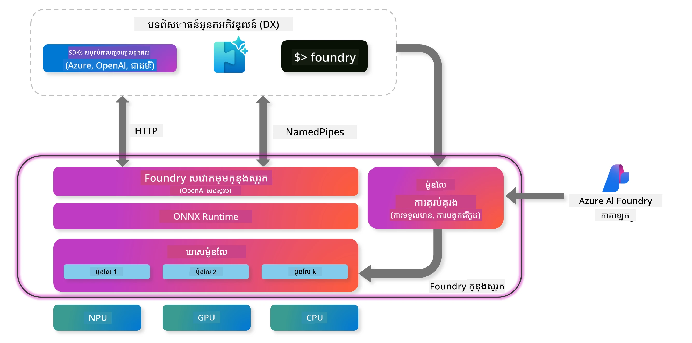
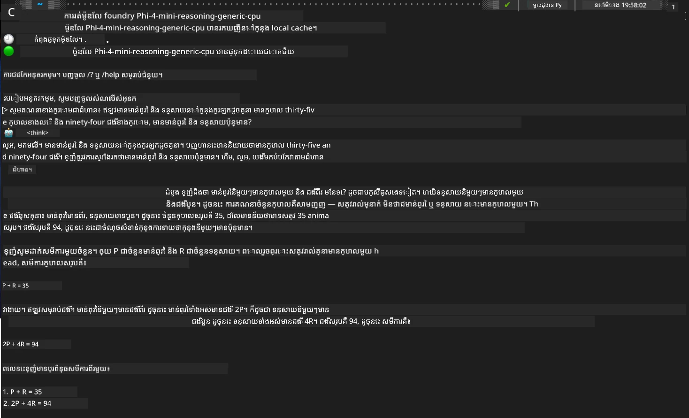

## ការចាប់ផ្តើមជាមួយម៉ូដែល Phi-Family ក្នុង Foundry Local

### ជំនួយដល់ Foundry Local

Foundry Local គឺជាវិធីដំណោះស្រាយ AI inference នៅលើឧបករណ៍ ដែលមានសមត្ថភាពខ្ពស់ ដាក់សមត្ថភាព AI ដ៏មានគុណភាពកំពូលទៅឧបករណ៍របស់អ្នកផ្ទាល់។ មេរៀននេះ នឹងណែនាំអ្នកពីការតំឡើង និងប្រើម៉ូដែល Phi-Family ជាមួយ Foundry Local ដែលផ្តល់ឱ្យអ្នកនូវការគ្រប់គ្រងពេញលេញលើការងារក្នុង AI របស់អ្នក ខណៈពេលថែរក្សា​ភាពឯកជន និងកាត់បន្ថយចំណាយ។

Foundry Local ផ្តល់នូវសមត្ថភាពខ្ពស់ ភាពឯកជន ការប្ដូរតាមតម្រូវការ និងអត្ថប្រយោជន៍ចំណាយ ដោយរត់ម៉ូដែល AI នៅលើឧបករណ៍របស់អ្នកផ្ទាល់។ វាបញ្ចូលជាស្របគ្នា ជាមួយវដ្ដការងារ និងកម្មវិធីដែលមានរួច ដោយមាន CLI, SDK និង REST API ដែលងាយស្រួលប្រើ។



### ហេតុអ្វីបានជាជ្រើស Foundry Local?

ការយល់ពីអត្ថប្រយោជន៍របស់ Foundry Local នឹងជួយឱ្យអ្នកធ្វើជម្រើសល្អសម្រាប់กลยุทธ์ដាក់ AI របស់អ្នក៖

- **Inference នៅលើឧបករណ៍:** ចាប់ម៉ូដែលដំណើរការចេញដោយផ្ទាល់លើឧបករណ៍របស់អ្នក កាត់បន្ថយចំណាយ ខណៈដែលរក្សាទុកទិន្នន័យទាំងអស់នៅលើឧបករណ៍របស់អ្នក។

- **ការប្ដូរតាមតម្រូវការ ម៉ូដែល:** ជ្រើសរើសពីម៉ូដែលមានរួច ឬប្រើម៉ូដែលផ្ទាល់ខ្លួន ដើម្បីបំពេញតម្រូវការពិសេស និងករណីប្រើប្រាស់។

- **ប្រសិទ្ធភាពចំណាយ:** លុបចោលចំណាយសេវាកម្ម cloud ដែលត្រូវធ្វើឡើងម្តងមួយៗ ដោយប្រើឧបករណ៍ដែលមានរួច បង្កើតឱ្យ AI មានសមត្ថភាពចូលរួមកាន់តែច្រើន។

- **ការវាយស្មើបញ្ចូលដោយឆាប់រហ័ស:** ភ្ជាប់ជាមួយកម្មវិធីរបស់អ្នកតាមរយៈ SDK, API endpoints ឬ CLI ជាមួយនឹងការពង្រីកយ៉ាងងាយស្រួលទៅ Microsoft Foundry ពេលតម្រូវការរបស់អ្នកកើនឡើង។

> **ចំណាំចាប់ផ្តើម៖** មេរៀននេះផ្តោតលើការប្រើ Foundry Local តាមរយៈ CLI និង SDK។ អ្នកនឹងរៀនពីរបៀបទាំងពីរដើម្បីជួយអ្នកជ្រើសរើសវិធីសាស្រ្តល្អបំផុតសម្រាប់ករណីប្រើប្រាស់របស់អ្នក។

## ផ្នែកទី 1៖ ការតំឡើង Foundry Local CLI

### ជំហានទី 1៖ តំឡើង

Foundry Local CLI គឺជា​ប្រព័ន្ធ​ដើម​ចូលរបស់​អ្នក​ក្នុង​ការ​គ្រប់គ្រង និង​ដំណើរការ​ម៉ូដែល AI នៅលើឧបករណ៍។ ចាប់ផ្តើមជាមួយការតំឡើងវានៅលើប្រព័ន្ធរបស់អ្នក។

**វេទិកាដែលគាំទ្រ៖** Windows និង macOS

សម្រាប់ការណែនាំលម្អិតអំពីការតំឡើង សូមពិសោធន៍ក្នុង [ឯកសារ Foundry Local ផ្លូវការជា](https://github.com/microsoft/Foundry-Local/blob/main/README.md)។

### ជំហានទី 2៖ ស្វែងរកម៉ូដែលដែលមាន

បន្ទាប់ពីអ្នកតំឡើង Foundry Local CLI រួច អ្នកអាចស្វែងរកថា ម៉ូដែលអ្វីខ្លះមានសម្រាប់ករណីប្រើប្រាស់របស់អ្នក។ ពាក្យបញ្ជានេះនឹងបង្ហាញម៉ូដែលគាំទ្រទាំងអស់៖


```bash
foundry model list
```

### ជំហានទី 3៖ យល់ដឹងអំពីម៉ូដែល Phi Family

Phi Family ផ្តល់ម៉ូដែលច្រើនប្រភេទដែលបានបង្កើតសម្រាប់ករណីប្រើប្រាស់ និង ការកំណត់រចនាសម្ព័ន្ធឧបករណ៍ផ្សេងៗ។ នេះគឺម៉ូដែល Phi ដែលមាននៅក្នុង Foundry Local៖

**ម៉ូដែល Phi មានស្រាប់៖** 

- **phi-3.5-mini** - ម៉ូដែលតូចសម្រាប់ភារកិច្ចមូលដ្ឋាន
- **phi-3-mini-128k** - ម៉ូដែលបន្ថែម context សម្រាប់ការសន្ទនារយៈពេលវែង
- **phi-3-mini-4k** - ម៉ូដែល context ស្តង់ដារសម្រាប់ការប្រើប្រាស់ទូទៅ
- **phi-4** - ម៉ូដែលអភិវឌ្ឍន៍ជាមួយសមត្ថភាពល្អប្រសើរ
- **phi-4-mini** - ជំនួសខ្លីរបស់ Phi-4
- **phi-4-mini-reasoning** - ផ្តោតការតភ្ជាប់សម្រាប់ភារកិច្ចគិតវិញស្មុគស្មាញ

> **ភាពសមត្ថភាពជាមួយឧបករណ៍៖** ម៉ូដែលនីមួយៗអាចត្រូវបានកំណត់សម្រាប់ការបណ្តុះបណ្តាលលើឧបករណ៍ខុសៗគ្នា (CPU, GPU) ដោយផ្អែកលើសមត្ថភាពប្រព័ន្ធរបស់អ្នក។

### ជំហានទី 4៖ រត់ម៉ូដែល Phi ដំបូងរបស់អ្នក

ចាប់ផ្តើមជាមួយគំរូដៃអនុវត្តិនេះ។ យើងនឹងរត់ម៉ូដែល `phi-4-mini-reasoning` ដែលមានលក្ខណៈល្អក្នុងការដោះស្រាយបញ្ហាស្មុគស្មាញមួយជាដំណាក់កាល។

**ពាក្យបញ្ជារត់ម៉ូដែល៖**

```bash
foundry model run Phi-4-mini-reasoning-generic-cpu
```

> **ការតំឡើងលើកដំបូង៖** នៅពេលរត់ម៉ូដែលជាលើកដំបូង Foundry Local នឹងទាញយកវាទៅឧបករណ៍របស់អ្នកដោយស្វ័យប្រវត្តិ។ ពេលវេលាទាញយកអាចប្រែប្រួលទៅតាមល្បឿនបណ្តាញរបស់អ្នក ដូច្នេះសូមអត់ធ្មត់នៅពេលដំណើរការជាលើកដំបូង។

### ជំហានទី 5៖ សាកល្បងម៉ូដែលជាមួយបញ្ហាពិត

ឥឡូវនេះយើងត្រូវសាកល្បងម៉ូដែលជាមួយបញ្ហាលូយវិចារណមួយ ដើម្បីមើលថាវាធ្វើការដោះស្រាយជាដំណាក់កាលយ៉ាងដូចម្តេច៖

**បញ្ហាឧទាហរណ៍៖**

```txt
Please calculate the following step by step: Now there are pheasants and rabbits in the same cage, there are thirty-five heads on top and ninety-four legs on the bottom, how many pheasants and rabbits are there?
```

**ការប្រតិបត្ដិប៉ុន្មានចំណុច៖** ម៉ូដែលគួរតែនាំបញ្ហានេះជា​ជំហានហិរញ្ញវត្ថុក៏ដោយ ប្រើការពិតថា pheasants មានជើង 2 និង ទន្សាយមានជើង 4 ដើម្បីដោះស្រាយប្រព័ន្ធសមីការ។

**លទ្ធផល៖**



## ផ្នែកទី 2៖ បង្កើតកម្មវិធីជាមួយ Foundry Local SDK

### ហេតុអ្វីបានជាជ្រើស SDK?

ខណៈពេល CLI គឺល្អសម្រាប់សាកល្បងនិងអន្តរកម្មរហ័ស កម្មវិធី SDK អនុញ្ញាតឱ្យអ្នកចូលរួម Foundry Local ទៅក្នុងកម្មវិធីរបស់អ្នកតាមរយៈកម្មវិធីក្រោយ។ វាបើកឱកាសសម្រាប់៖

- បង្កើតកម្មវិធីដែលមាន AI ជាក្រុមហ៊ុន​ផ្ទាល់ខ្លួន
- បង្កើតវដ្ដការងារស្វ័យប្រវត្តិ
- ភ្ជាប់សមត្ថភាព AI ទៅក្នុងប្រព័ន្ធមានរួច
- បង្កើត chatbot និងឧបករណ៍អន្តរកម្ម

### ភាសាកម្មវិធីគាំទ្រ

Foundry Local ផ្តល់ជំនួយ SDK សម្រាប់ភាសាកម្មវិធីច្រើន ដើម្បីសម្រួលការអភិវឌ្ឍរបស់អ្នក៖

**📦 SDK ដែលមាន៖**

- **C# (.NET):** [SDK ឯកសារ និង ឧទាហរណ៍](https://github.com/microsoft/Foundry-Local/tree/main/sdk/cs)
- **Python:** [SDK ឯកសារ និង ឧទាហរណ៍](https://github.com/microsoft/Foundry-Local/tree/main/sdk/python)
- **JavaScript:** [SDK ឯកសារ និង ឧទាហរណ៍](https://github.com/microsoft/Foundry-Local/tree/main/sdk/js)
- **Rust:** [SDK ឯកសារ និង ឧទាហរណ៍](https://github.com/microsoft/Foundry-Local/tree/main/sdk/rust)

### ជំហានបន្ទាប់

1. **ជ្រើសរើស SDK ដែលអ្នកចូលចិត្ត** ដែលសមខ្លួនជាមួយបរិយាកាសអភិវឌ្ឍរបស់អ្នក  
2. **អនុវត្តតាមឯកសារពិសេសរបស់ SDK** សម្រាប់ការណែនាំលម្អិត  
3. **ចាប់ផ្តើមជាមួយឧទាហរណ៍សាមញ្ញ** មុនសាងសង់កម្មវិធីស្មុគស្មាញ  
4. **ស្វែងយល់ពីកូដឧទាហរណ៍** ដែលផ្តល់ក្នុងខ្ទង់ SDK នីមួយៗ

## សេចក្តីសន្និដ្ឋាន

ឥឡូវនេះអ្នកបានរៀនពីរបៀប៖  
- ✅ តំឡើង និងកំណត់ Foundry Local CLI  
- ✅ ស្វែងរក និងរត់ម៉ូដែល Phi Family  
- ✅ សាកល្បងម៉ូដែលជាមួយបញ្ហាពិត  
- ✅ យល់ពីជម្រើស SDK សម្រាប់ការអភិវឌ្ឍកម្មវិធី  

Foundry Local ផ្តល់មូលដ្ឋានដ៏អស្ចារ្យសម្រាប់នាំយកសមត្ថភាព AI ដោយផ្ទាល់ទៅបរិបទក្នុងស្រុករបស់អ្នក បង្កើតឱ្យអ្នកមានការគ្រប់គ្រងលើសមត្ថភាព ភាពឯកជន និងចំណាយ ខណៈដែលថែរក្សាចំណេញនៃការពង្រីកទៅដល់ដំណោះស្រាយគណនាគតិកមព៍្យួកពពកនៅពេលត្រូវការ។

---

<!-- CO-OP TRANSLATOR DISCLAIMER START -->
**ការបដិសេធ**៖  
ឯកសារនេះត្រូវបានបកប្រែដោយប្រព័ន្ធបកប្រែ AI [Co-op Translator](https://github.com/Azure/co-op-translator)។ ខណៈពេលយើងខិតខំប្រឹងប្រែងដើម្បីកំណត់ភាពត្រឹមត្រូវ សូមយល់ដឹងថាការបកប្រែដោយស្វ័យប្រវត្តិអាចមានកំហុសឬមិនត្រឹមត្រូវ។ ឯកសារដើមក្នុងភាសាទីតាំងរបស់វាត្រូវបានគិតថាជាធម្មតាដែលមានអាទិភាព។ សម្រាប់ព័ត៌មានសំខាន់ៗ សូមផ្តល់អាណាព្យាបាលក្នុងការបកប្រែដោយអ្នកជំនាញមនុស្ស។ យើងមិនទទួលខុសត្រូវចំពោះការយល់ច្រឡំ ឬការបកប្រែខុសផ្សេងៗដែលកើតមានពីការប្រើប្រាស់ការបកប្រែនេះឡើយ។
<!-- CO-OP TRANSLATOR DISCLAIMER END -->