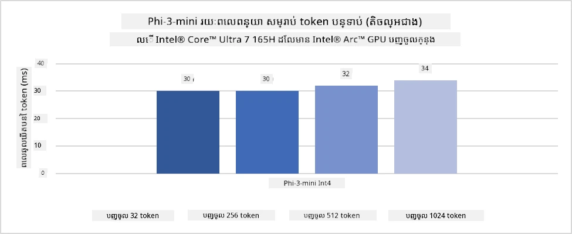
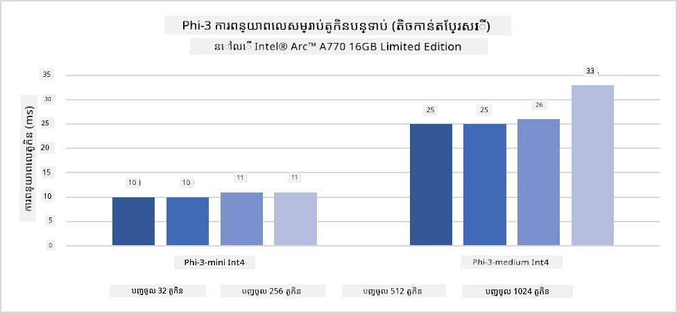
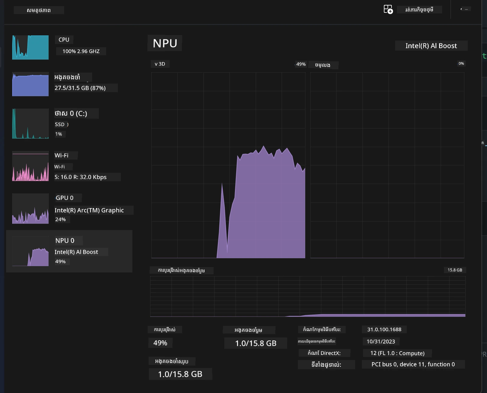
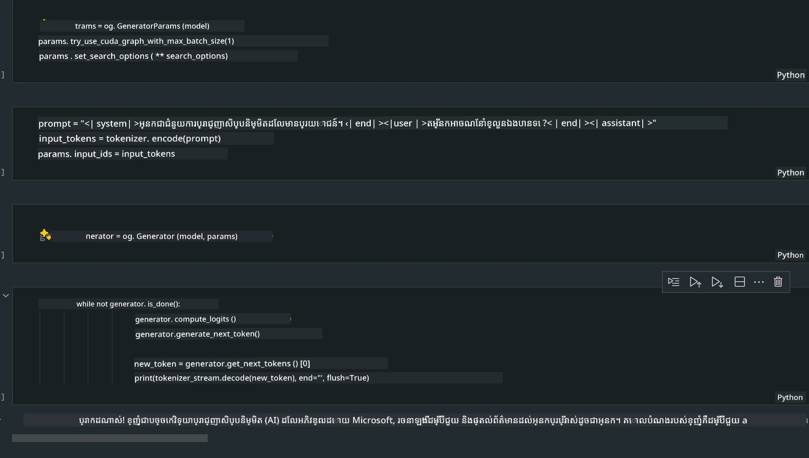
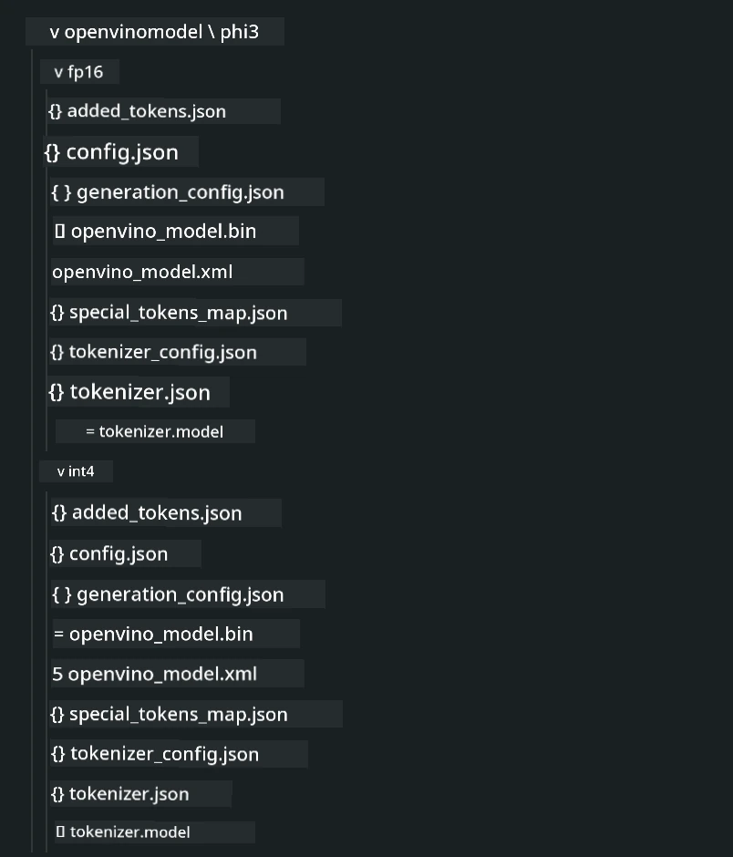
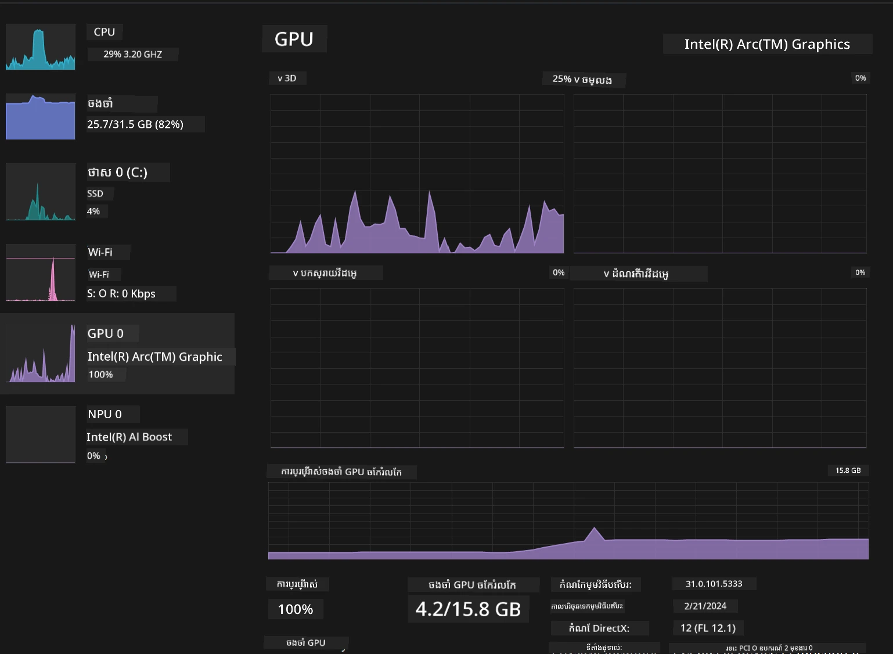

# **ការបកស្រាយ Phi-3 នៅលើកុំព្យូទ័រជំនាន់ AI**

ដោយកំណើននៃបច្ចេកវិទ្យា AI បង្កើតថ្មី និងការកែលម្អសមត្ថភាពរបស់ឧបករណ៍គ្រប់គ្រងចុងបញ្ចប់ (edge device) ច្រើនម៉ូដែល AI បង្កើតថ្មីអាចចូលរួមបញ្ចូលទៅលើឧបករណ៍ BYOD (Bring Your Own Device) របស់អ្នកប្រើប្រាស់។ កុំព្យូទ័រ AI គឺជាម៉ូដែលមួយក្នុងចំណោមនេះ។ ចាប់ពីឆ្នាំ 2024 Intel, AMD និង Qualcomm បានសហការជាមួយក្រុមហ៊ុនផលិតកុំព្យូទ័រ ដើម្បីណែនាំកុំព្យូទ័រ AI ដែលងាយស្រួលសម្រាប់ដំណើរការម៉ូដែល AI បង្កើតថ្មីនៅក្នុងតំបន់តាមរយៈការកែប្រែឧបករណ៍។ ក្នុងការពិភាក្សានេះ យើងនឹងផ្តោតលើកុំព្យូទ័រ AI របស់ Intel ហើយស្វែងយល់ពីរបៀបដំណើរការ Phi-3 លើកុំព្យូទ័រ AI របស់ Intel។

### និយាមថ្មី NPU គឺជាអ្វី?

NPU (Neural Processing Unit) គឺជាឧបករណ៍ឬផ្នែកកុំព្យូទ័រដែលបង្កើតឡើងដោយប៉ុណ្ណែត ផ្តោតសម្រាប់ពង្រីកល្បឿនដំណើរការបណ្តាញប្រព័ន្ធបេះដូង (neural networks) និងភារកិច្ច AI។ ផ្ទុយពី CPU និង GPU សម្រាប់ទូទៅ NPU ត្រូវបានបង្កើតឡើងសម្រាប់ការបណ្តុះសមត្ថភាពគណនាពហុមុខងារ (parallel computing) ដែលមានប្រសិទ្ធភាពខ្ពស់ក្នុងការបញ្ជប់ទិន្នន័យ multimedia ដូចជា វីដេអូ និងរូបភាព ហើយក៏មានសមត្ថភាពធ្វើដំណើរការទិន្នន័យសម្រាប់បណ្តាញប្រព័ន្ធបេះដូង។ វាមានទំនួលខុសត្រូវខ្លាំងក្នុងភារកិច្ច AI ដូចជា ការទទួលស្គាល់សំឡេង, ការបិទបាំងផ្ទៃខាងក្រោយក្នុងការហៅវីដេអូ, និងកិច្ចការកែប្រែរូបថត ឬវីដេអូដូចជា ការស្វែងរកវត្ថុ។

## NPU និង GPU ផ្ទុយគ្នាយ៉ាងដូចម្តេច?

ខណៈដែលភារកិច្ច AI និង machine learning ច្រើនប្រើ GPU មានភាពខុសគ្នាមួយសំខាន់រវាង GPU និង NPU។  
GPU គឺមានភាពលេចធ្លោជារៀងរហូតក្នុងបច្ចេកវិជ្ជាគណនាពហុមុខងារ ប៉ុន្តែលេខ GPU ទាំងអស់មិនប្រសើរតាមមុខងារផ្សេងពីការបំលែងក្រាហ្វិចទាំងអស់ទេ។ NPU ត្រូវបានបង្កើតឡើងជាបន្តបន្ទាប់សម្រាប់គណនាប្រឹងប្រែងស្មុគស្មាញក្នុងប្រតិបត្តិការបណ្តាញប្រព័ន្ធបេះដូង ធ្វើឲ្យវាមានប្រសិទ្ធភាពខ្ពស់សម្រាប់ភារកិច្ច AI។

សារសំខាន់ៗគឺ NPU គឺជាអ្នកពិតជាតច្ចនាគណិតដែលបង្កើនការគណនារបស់ AI ហើយវាទទួលភារកិច្ចសំខាន់ក្នុងយូគ្រូ AI PC ដែលកំពុងឈានមុខមក!

***ឧទាហរណ៍នេះផ្អែកលើ Intel Core Ultra Processor ថ្មីបំផុតរបស់ Intel***

## **1. ប្រើ NPU ដើម្បីដំណើរការម៉ូដែល Phi-3**

ឧបករណ៍ Intel® NPU គឺជាឧបករណ៍បង្កើនល្បឿន AI inference ដែលត្រូវបានបញ្ចូលជាមួយ CPU របស់ Intel ក្នុងករណី Intel® Core™ Ultra ជំនាន់ CPU ថ្មី (ដែលជាមុននេះហៅថា Meteor Lake)។ វាអាចធ្វើការបំពេញភារកិច្ចបណ្តាញប្រព័ន្ធបេះដូងដោយមានប្រសិទ្ធភាពថាមពលខ្ពស់។





**បណ្ណាល័យបង្កើនល្បឿន Intel NPU**

បណ្ណាល័យ Intel NPU Acceleration Library [https://github.com/intel/intel-npu-acceleration-library](https://github.com/intel/intel-npu-acceleration-library) គឺជាបណ្ណាល័យ Python ដែលបង្កើនប្រសិទ្ធភាពកម្មវិធីរបស់អ្នកដោយប្រើអំណាចរបស់ Intel Neural Processing Unit (NPU) សម្រាប់ការតុបតែងគណនាឆាប់រហ័សលើឧបករណ៍គាំទ្រ។

ឧទាហរណ៍ Phi-3-mini នៅលើ AI PC ប្រើប្រាស់ Intel® Core™ Ultra processor។


ដំឡើងបណ្ណាល័យ Python ជាមួយ pip

```bash

   pip install intel-npu-acceleration-library

```
  
***សម្គាល់*** គម្រោងនេះនៅតែស្ថិតក្រោមការអភិវឌ្ឍនៅឡើយ ប៉ុន្តែម៉ូដែលយោងបានគឺរួចរាល់ហើយ។

### **ដំណើរការ Phi-3 ជាមួយបណ្ណាល័យ Intel NPU Acceleration**

ដោយប្រើបណ្ណាល័យបង្កើនល្បឿន Intel NPU នេះ វាមិនប៉ះពាល់ដល់ដំណើរការបញ្ចូរកូដទេ។ អ្នកគ្រាន់តែត្រូវប្រើបណ្ណាល័យនេះដើម្បីបំលែងតម្លៃគុណភាពម៉ូដែល Phi-3 ដើមដូចជា FP16，INT8，INT4 ជាដើម។

```python
from transformers import AutoTokenizer, pipeline,TextStreamer
from intel_npu_acceleration_library import NPUModelForCausalLM, int4
from intel_npu_acceleration_library.compiler import CompilerConfig
import warnings

model_id = "microsoft/Phi-3-mini-4k-instruct"

compiler_conf = CompilerConfig(dtype=int4)
model = NPUModelForCausalLM.from_pretrained(
    model_id, use_cache=True, config=compiler_conf, attn_implementation="sdpa"
).eval()

tokenizer = AutoTokenizer.from_pretrained(model_id)

text_streamer = TextStreamer(tokenizer, skip_prompt=True)
```
  
បន្ទាប់ពីបំលែងតម្លៃបានជោគជ័យ បន្តការសំរាប់បញ្ជាឲ្យ NPU ដំណើរការម៉ូដែល Phi-3។

```python
generation_args = {
   "max_new_tokens": 1024,
   "return_full_text": False,
   "temperature": 0.3,
   "do_sample": False,
   "streamer": text_streamer,
}

pipe = pipeline(
   "text-generation",
   model=model,
   tokenizer=tokenizer,
)

query = "<|system|>You are a helpful AI assistant.<|end|><|user|>Can you introduce yourself?<|end|><|assistant|>"

with warnings.catch_warnings():
    warnings.simplefilter("ignore")
    pipe(query, **generation_args)
```
  
ពេលបញ្ជារកូដ អ្នកអាចមើលស្ថានភាពបើកដំណើរការ NPU តាមរយៈកម្មវិធី Task Manager



***ឧទាហរណ៍គំរូ***: [AIPC_NPU_DEMO.ipynb](../../../code/03.Inference/AIPC/AIPC_NPU_DEMO.ipynb)

## **2. ប្រើ DirectML + ONNX Runtime ដើម្បីដំណើរការម៉ូដែល Phi-3**

### **DirectML គឺជាអ្វី**

[DirectML](https://github.com/microsoft/DirectML) គឺជាបណ្ណាល័យ DirectX 12 ជំនាញខ្ពស់ដែលបង្កើនល្បឿនធ្វើក្រោយបញ្ជីសម្រាប់គណនាម៉ាស៊ីន (machine learning)। DirectML ផ្តល់ជំនួយប្រើបណ្តាំ GPU សម្រាប់ភារកិច្ច machine learning ទូទៅលើឧបករណ៍ធំៗជាច្រើន និង driver ដែលគាំទ្រតាមរយៈ GPU ទាំងអស់ដែលគាំទ្រ DirectX 12 រួមទាំង AMD, Intel, NVIDIA និង Qualcomm។

ពេលដែលប្រើដោយឡែក API DirectML គឺជាបណ្ណាល័យ DirectX 12 ដែលមានកម្រិតទាប ហើយសមស្របសម្រាប់កម្មវិធីដែលត្រូវការសមត្ថភាពខ្ពស់ និង latency ទាបដូចជា framework, ဂេម និងកម្មវិធីថ្មីៗផ្សេងទៀត។ សមត្ថភាពរួមបញ្ចូលរវាង DirectML និង Direct3D 12 ជាមួយនឹងភាពខូចខាតតិច និងគម្លាតផ្លូវល្អលើឧបករណ៍ផ្សេងៗធ្វើឲ្យ DirectML សមស្របសម្រាប់បង្កើនល្បឿន machine learning នៅពេលដែលទាំងសមត្ថភាពខ្ពស់ និងភាពទុកចិត្តលទ្ធផលគឺក្តីត្រូវបានទំនុកចិត្តយ៉ាងខ្លាំង។

***សម្គាល់***: DirectML ថ្មីៗនេះគាំទ្រ NPU(https://devblogs.microsoft.com/directx/introducing-neural-processor-unit-npu-support-in-directml-developer-preview/)

### ការប្រៀបធៀបទាំងDirectML និង CUDA ក្នុងចំណោមសមត្ថភាព និង សមត្ថភាពដំណើរការ:

**DirectML** គឺជាបណ្ណាល័យ machine learning ដែល Microsoft បង្កើតឡើង។ វាត្រូវបានរចនាឡើងសម្រាប់បង្កើនល្បឿនការងារម៉ាស៊ីនភាគល្អិតនៅលើឧបករណ៍ Windows រួមមានកុំព្យូទ័រដេ스크តុក, លេបតុក និងឧបករណ៍គ្រប់គ្រងចុងបញ្ចប់។  
- មានមូលដ្ឋាន DX12: DirectML អភិវឌ្ឍលើផ្ទាំង DirectX 12 (DX12) ដែលផ្ដល់ការគាំទ្រតាមសំភារៈរហូតដល់GPU ដែលរួមមាន NVIDIA និង AMD។  
- គាំទ្រច្រើន: ចាប់អារម្មណ៍លើ DX12, DirectML អាចធ្វើការជាមួយ GPU ទាំងអស់ដែលគាំទ្រ DX12 រួមមាន GPU រួមបញ្ចូលក្នុង CPU ផងដែរ។  
- ការកែប្រែរូបភាព: DirectML ប្រើបណ្តាញប្រព័ន្ធបេះដូងដើម្បីបង្ហាញរូបភាព និងទិន្នន័យផ្សេងៗ ដូចជា ការទទួលស្គាល់រូបភាព ស្វែងរកវត្ថុ និងខ្លះ។  
- ស្របតម្រូវភាពងាយស្រួល: ការដំឡើង DirectML គឺសាមញ្ញ ហើយមិនត្រូវការបណ្ណាល័យ ឬ SDK ពិសេសពីក្រុមហ៊ុនផលិត GPU ទេ។  
- សមត្ថភាព: នៅខ្លះករណី DirectML មានសមត្ថភាពល្អ និងលឿនជាង CUDA ពិសេសសម្រាប់ភារកិច្ចពិសេសខ្លះ។  
- ចំណុចខ្សោយ: ប៉ុន្តែមានករណីដែល DirectML ឆ្លៀតយឺតជាង CUDA ជាពិសេសនៅពេលប្រើ float16 batch ធំៗ។

**CUDA** គឺជាវេទិកាគណនា parallel និងគំរូកម្មវិធីរបស់ NVIDIA។ វាអនុញ្ញាតឲ្យអ្នកអភិវឌ្ឍប្រើសមត្ថភាព GPU របស់ NVIDIA សម្រាប់គណនាទូទៅ រួមមាន machine learning និង simulation វិទ្យាសាស្ត្រ។  
- ផ្តោតលើ NVIDIA: CUDA ត្រូវបានរចនាសម្រាប់ប្រើជាមួយ GPU របស់ NVIDIA ជាក់លាក់។  
- ការបំលែងខ្ពស់: វាផ្តល់សមត្ថភាពល្អសម្រាប់ភារកិច្ចដែលប្រើ GPU ជាពិសេសពេលប្រើ NVIDIA GPU។  
- គំរូប្រើប្រាស់ទូលំទូលាយ: មួយចំនួនគ្រប់ស៊ុម machine learning និងបណ្ណាល័យ (ដូចជា TensorFlow និង PyTorch) មានគាំទ្រ CUDA។  
- ការប្តូរតាមចិត្ត: អ្នកអភិវឌ្ឍអាចប្តូរការកំណត់ CUDA ដើម្បីបំពង់លទ្ធផលល្អបំផុតសម្រាប់ភារកិច្ចពិសេស។  
- ចំណុចខ្សោយ: ម៉ាស៊ីន CUDA អាស្រ័យលើGPU របស់ NVIDIA ដ៏ធំធេងដែលអាចមានដែនកំណត់សម្រាប់ការគាំទ្រគ្រប់ឧបករណ៍GPU ផ្សេងគ្នា។

### ជ្រើសរើសចន្លោះ DirectML និង CUDA

ការជ្រើសរើសរវាង DirectML និង CUDA អាស្រ័យលើករណីប្រើប្រាស់ ឧបករណ៍ដែលមាន និងចំណូលចិត្តផ្ទាល់ខ្លួន,  
បើអ្នកត្រូវការគាំទ្រធំទូលាយ និងងាយស្រួលក្នុងការដំឡើង, DirectML ជាជម្រើសល្អ។ ប៉ុន្តែបើអ្នកមាន GPU NVIDIA និងត្រូវការសមត្ថភាពខ្ពស់ ប្រើ CUDA ល្អជាង។ សង្ខេប, ទាំងពីរមានគុណសម្បត្តិ និងកំលាំងខ្សោយ ដូច្នេះសូមពិចារណាតាមតម្រូវការនិងឧបករណ៍ក្នុងការជ្រើសរើស។

### **AI បង្កើតថ្មីជាមួយ ONNX Runtime**

នៅយូគ AI, ការផ្លាស់ប្តូរប្រភេទម៉ូដែល AI គឺសំខាន់ខ្លាំង។ ONNX Runtime ងាយស្រួលសម្រាប់ដាក់បញ្ចូលម៉ូដែលដែលបានបណ្តុះទៅលើឧបករណ៍ផ្សេងៗ។ អ្នកអភិវឌ្ឍមិនចាំបាច់បញ្ជ注ា framework inference ទេ ហើយប្រើ API ដូចគ្នាទូទៅសម្រាប់ធ្វើ inference លើម៉ូដែល។ នៅយូគ AI បង្កើតថ្មី, ONNX Runtime ក៏បានអនុវត្តបច្ចេកវិទ្យាបង្កើនឯកសារកូដ (https: //onnxruntime.ai/docs/genai/ )។ តាមរយៈ ONNX Runtime ដែលបានបង្កើននៅលើដំបូចហ៊ុនងត្រួតម៉ូដែល AI បង្កើតថ្មីដែលបានបំលែងតំលៃអាចដំណើរការនៅលើឧបករណ៍ផ្សេងៗ។ នៅ Generative AI ជាមួយ ONNX Runtime អ្នកអាចប្រើប្រាស់ API inference ម៉ូដែល AI តាមរយៈ Python, C#, C / C++។ ប៉ុន្តែការចេញលទ្ធផលលើ iPhone អាចប្រើ C++ API Generative AI របស់ ONNX Runtime។

[Sample Code](https://github.com/Azure-Samples/Phi-3MiniSamples/tree/main/onnx)

***បង្កើតបណ្ណាល័យ generative AI ជាមួយ ONNX Runtime***

```bash

winget install --id=Kitware.CMake  -e

git clone https://github.com/microsoft/onnxruntime.git

cd .\onnxruntime\

./build.bat --build_shared_lib --skip_tests --parallel --use_dml --config Release

cd ../

git clone https://github.com/microsoft/onnxruntime-genai.git

cd .\onnxruntime-genai\

mkdir ort

cd ort

mkdir include

mkdir lib

copy ..\onnxruntime\include\onnxruntime\core\providers\dml\dml_provider_factory.h ort\include

copy ..\onnxruntime\include\onnxruntime\core\session\onnxruntime_c_api.h ort\include

copy ..\onnxruntime\build\Windows\Release\Release\*.dll ort\lib

copy ..\onnxruntime\build\Windows\Release\Release\onnxruntime.lib ort\lib

python build.py --use_dml


```
  
**ដំឡើងបណ្ណាល័យ**

```bash

pip install .\onnxruntime_genai_directml-0.3.0.dev0-cp310-cp310-win_amd64.whl

```
  
នេះគឺជាលទ្ធផលដំណើរការ



***ឧទាហរណ៍*** : [AIPC_DirectML_DEMO.ipynb](../../../code/03.Inference/AIPC/AIPC_DirectML_DEMO.ipynb)

## **3. ប្រើ Intel OpenVINO ដើម្បីដំណើរការម៉ូដែល Phi-3**

### **OpenVINO គឺជាអ្វី**

[OpenVINO](https://github.com/openvinotoolkit/openvino) គឺជាឧបករណ៍បើកចំហសម្រាប់ធ្វើបច្ចេកទេសកែលម្អ និងដាក់ចេញម៉ូដែល deep learning។ វាបង្កើនសមត្ថភាព deep learning សម្រាប់ម៉ូដែលមើលឃើញ, សំឡេង, និងភាសា ពី framework ពេញនិយមដូចជា TensorFlow, PyTorch និងផ្សេងទៀត។ ចាប់ផ្តើមជាមួយ OpenVINO។ OpenVINO អាចប្រើរួមជាមួយ CPU និង GPU ដើម្បីដំណើរការម៉ូដែល Phi-3។

***សម្គាល់***: បច្ចុប្បន្ន OpenVINO មិនគាំទ្រ NPU នៅពេលនេះទេ។

### **ដំឡើងបណ្ណាល័យ OpenVINO**

```bash

 pip install git+https://github.com/huggingface/optimum-intel.git

 pip install git+https://github.com/openvinotoolkit/nncf.git

 pip install openvino-nightly

```
  
### **ដំណើរការ Phi-3 ជាមួយ OpenVINO**

ដូចជាករណី NPU, OpenVINO បញ្ចប់ការហៅម៉ូដែល AI បង្កើតថ្មីដោយរត់ម៉ូដែលបំលែងតំលៃ។ យើងត្រូវបំលែងតំលៃម៉ូដែល Phi-3 ជាមុនសិន ហើយបញ្ចប់ការបំលែងតំលៃម៉ូដែលតាមបន្ទាត់បញ្ជា ដោយប្រើ optimum-cli

**INT4**

```bash

optimum-cli export openvino --model "microsoft/Phi-3-mini-4k-instruct" --task text-generation-with-past --weight-format int4 --group-size 128 --ratio 0.6  --sym  --trust-remote-code ./openvinomodel/phi3/int4

```
  
**FP16**

```bash

optimum-cli export openvino --model "microsoft/Phi-3-mini-4k-instruct" --task text-generation-with-past --weight-format fp16 --trust-remote-code ./openvinomodel/phi3/fp16

```
  
ទ្រង់ទ្រាយដែលបានបំលែង ដូចនេះ



ផ្ទុកផ្លូវម៉ូដែល(model_dir), ការកំណត់ដែលពាក់ព័ន្ធ(ov_config = {"PERFORMANCE_HINT": "LATENCY", "NUM_STREAMS": "1", "CACHE_DIR": ""}), និងឧបករណ៍ដែលបង្កើនល្បឿនផ្នែករឹង (GPU.0) តាមរយៈ OVModelForCausalLM

```python

ov_model = OVModelForCausalLM.from_pretrained(
     model_dir,
     device='GPU.0',
     ov_config=ov_config,
     config=AutoConfig.from_pretrained(model_dir, trust_remote_code=True),
     trust_remote_code=True,
)

```
  
ពេលដំណើរការកូដ អ្នកអាចមើលស្ថានភាពដំណើរការរបស់ GPU តាម Task Manager



***ឧទាហរណ៍*** : [AIPC_OpenVino_Demo.ipynb](../../../code/03.Inference/AIPC/AIPC_OpenVino_Demo.ipynb)

### ***សម្គាល់*** : វិធីសាស្រ្តទាំងបីខាងលើមានអត្ថប្រយោជន៍ខ្លួនឯង ប៉ុន្តែផ្ដល់អនុសាសន៍ឲ្យប្រើល្បឿនបង្កើន NPU សម្រាប់ការពណ៌នាផលនៅលើ AI PC។

---

<!-- CO-OP TRANSLATOR DISCLAIMER START -->
**ការបដិសេធ**:  
ឯកសារនេះត្រូវបានបកប្រែដោយប្រើសេវាកម្មបកប្រែ AI [Co-op Translator](https://github.com/Azure/co-op-translator)។ ខណៈពេលយើងខំប្រឹងនឹងភាពត្រឹមត្រូវ សូមយល់ពីថាបកប្រែដោយស្វ័យប្រវត្តិអាចមានកំហុស ឬភាពមិនត្រឹមត្រូវខ្លះ។ ឯកសារមូលដ្ឋានក្នុងភាសាម្ជិលរបស់វាគួរត្រូវបានគេពិចារណាជាធាតុដើមដែលមានអំណាច។ សម្រាប់ព័ត៌មានសំខាន់ៗ គួរត្រូវបានបកប្រែដោយមនុស្សជំនាញវិជ្ជាជីវៈ។ យើងមិនទទួលខុសត្រូវចំពោះការយល់ច្រឡំ ឬការបកស្រាយខុសណាមួយដែលកើតមានពីការប្រើប្រាស់ការបកប្រែនេះឡើយ។
<!-- CO-OP TRANSLATOR DISCLAIMER END -->