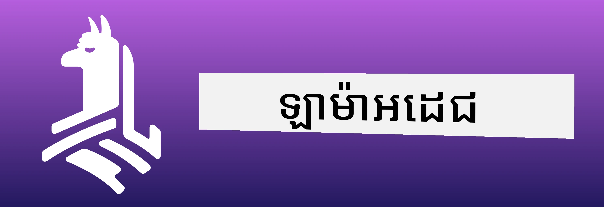
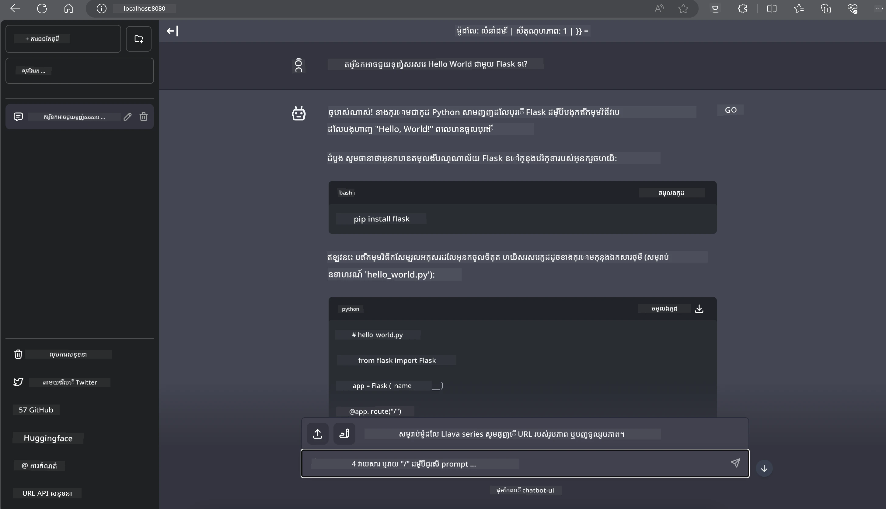

# **Inference Phi-3 នៅលើ Nvidia Jetson**

Nvidia Jetson គឺជាស៊េរីក្រុមហ៊ុនកំព្យូទ័រចាក់បញ្ចូលមួយពី Nvidia។ ម៉ូដែល Jetson TK1, TX1 និង TX2 ទាំងអស់មានម៉ាស៊ីនដំណើរការតេក្រ៉ា (ឬ SoC) ពី Nvidia ដែលបញ្ចូលជាមួយខ្នាតតូចស៊ីភីអ៊ុលើសំណុំតុ ARM។ Jetson គឺជាប្រព័ន្ធថាមពលទាប និងត្រូវបានរចនាឡើងសម្រាប់ល្បឿនលឿននៃកម្មវិធីរៀនម៉ាស៊ីន។ Nvidia Jetson ត្រូវបានប្រើដោយអ្នកអភិបាលដែលជំនាញដើម្បីបង្កើតផលិតផល AI ដ៏អភិវឌ្ឍទូទាំងវិស័យទាំងមូល និងដោយនិស្សិត និងអ្នកចូលចិត្តសម្រាប់ការរៀន AI ដោយដៃ និងធ្វើគម្រោងអស្ចារ្យ។ SLM ត្រូវបានប្រើប្រាស់នៅឧបករណ៍មុខទីផ្សារដូចជា Jetson ដែលនឹងជួយអនុវត្តករណីប្រើប្រាស់ AI ថ្មីៗនៅឧស្សាហកម្មបានប្រសើរឡើង។

## ការដាក់បញ្ចូលលើ NVIDIA Jetson៖
អ្នកអភិវឌ្ឍដែលធ្វើការលើរ៉ូបូទីកអូតូណូម និងឧបករណ៍ចាក់បញ្ចូលអាចប្រើប្រាស់ Phi-3 Mini។ ទំហំតូចធម្មតារបស់ Phi-3 ធ្វើឱ្យវាល្អសម្រាប់ប្រើនៅមុខទីផ្សារ។ ប៉ារ៉ាម៉ែត្រត្រូវបានកែសម្រួលយ៉ាងម៉ត់ចត់ក្នុងប្រតិបត្តិការហ្វឹកហាត់ ដើម្បីធានាការត្រឹមត្រូវខ្ពស់នៅក្នុងចម្លើយ។

### ការបង្កើនប្រសិទ្ធភាព TensorRT-LLM៖
បណ្ណាល័យ [TensorRT-LLM របស់ NVIDIA](https://github.com/NVIDIA/TensorRT-LLM?WT.mc_id=aiml-138114-kinfeylo) អនុវត្តន៍ចំពោះកិច្ចការបកប្រែម៉ូដែលភាសាធំៗ។ វាសំពាធលើវីនដូ context window ទំហំធំហើយរបស់ Phi-3 Mini កែលំអងចេញដំណើរការ និងពេលវេលាទទួលបាន។ ការជួសជុលរួមមានបច្ចេកទេសដូចជា LongRoPE, FP8 និង inflight batching។

### ការចែកចាយ និងការដាក់បញ្ចូល៖
អ្នកអភិវឌ្ឍអាចស្វែងយល់ពី Phi-3 Mini ជាមួយវីនដូចជា context window 128K នៅ [NVIDIA's AI](https://www.nvidia.com/en-us/ai-data-science/generative-ai/). វាត្រូវបានបញ្ចូលក្នុងជា NIM របស់ NVIDIA មួយ មីក្រូសេវីសជាមួយ API ស្តង់ដារ ដែលអាចដាក់បញ្ចូលបានគ្រប់កន្លែង។ រួមទាំងនោះ ការអនុវត្ត [TensorRT-LLM នៅលើ GitHub](https://github.com/NVIDIA/TensorRT-LLM)។

## **1. ការរៀបចំ**

a. Jetson Orin NX / Jetson NX

b. JetPack 5.1.2+
   
c. Cuda 11.8
   
d. Python 3.8+

## **2. រត់ Phi-3 នៅលើ Jetson**

យើងអាចជ្រើសរើស [Ollama](https://ollama.com) ឬ [LlamaEdge](https://llamaedge.com)

បើអ្នកចង់ប្រើ gguf នៅក្នុងពពក និងឧបករណ៍មុខទីផ្សារផងដដែល LlamaEdge អាចយល់ថាជា WasmEdge (WasmEdge គឺជាកម្មវិធីរត់ WebAssembly លឿនទាបខ្នាតសមស្របសម្រាប់កម្មវិធី native នៅពពក មុខទីផ្សារ និងការចែកចាយបន្តផ្ទាល់។ វាគាំទ្រកម្មវិធីមិនមានម៉ាស៊ីនមេ (serverless), មុខងារចាក់បញ្ចូល, មីក្រូសេវីស, កិច្ចសន្យាឆ្លាត និងឧបករណ៍ IoT។ អ្នកអាចដាក់បញ្ចូលម៉ូដែលគុណភាព gguf ទៅឧបករណ៍មុខទីផ្សារ និងពពកតាមរយៈ LlamaEdge។



នេះជាជំហ៊ានក្នុងការប្រើ

1. ដំឡើង និងទាញយកបណ្ណាល័យ និងឯកសារពាក់ព័ន្ធ

```bash

curl -sSf https://raw.githubusercontent.com/WasmEdge/WasmEdge/master/utils/install.sh | bash -s -- --plugin wasi_nn-ggml

curl -LO https://github.com/LlamaEdge/LlamaEdge/releases/latest/download/llama-api-server.wasm

curl -LO https://github.com/LlamaEdge/chatbot-ui/releases/latest/download/chatbot-ui.tar.gz

tar xzf chatbot-ui.tar.gz

```

**ចំណាំ**: llama-api-server.wasm និង chatbot-ui ត្រូវតែមាននៅក្នុងថតដូចគ្នា

2. រត់ script នៅក្នុង terminal

```bash

wasmedge --dir .:. --nn-preload default:GGML:AUTO:{Your gguf path} llama-api-server.wasm -p phi-3-chat

```

នេះជាលទ្ធផលរត់โปรแกรม



***កូដគំរូ*** [Phi-3 mini WASM Notebook Sample](https://github.com/Azure-Samples/Phi-3MiniSamples/tree/main/wasm)

ដោយសារពិចារណា ដែល Phi-3 Mini ជាការវាយចូលមួយនៅក្នុងការធ្វើម៉ូដែលភាសា ដែលបញ្ចូលប្រសិទ្ធភាព សមត្ថភាពចំណាំ context និងជំនាញកែលំអររបស់ NVIDIA។ មិនថាអ្នកកំពុងបង្កើតរ៉ូបូតឬកម្មវិធីមុខទីផ្សារនោះ Phi-3 Mini គឺជាឧបករណ៍ដ៏មានកម្លាំងដែលត្រូវរំពឹងទុក។

---

<!-- CO-OP TRANSLATOR DISCLAIMER START -->
**ការព្រមាន**៖  
ឯកសារនេះបានបកប្រែដោយប្រើសេវាបកប្រែ AI [Co-op Translator](https://github.com/Azure/co-op-translator)។ ពេលដែលយើងខិតខំប្រឹងប្រែងសំរាប់ភាពត្រឹមត្រូវ សូមយកចិត្តទុកដាក់ថា ការបកប្រែដោយស្វ័យប្រវត្តអាចមានកំហុស ឬភាពមិនត្រឹមត្រូវឥតខ្ចោះ។ ឯកសារដើមនៅក្នុងភាសាមូលដ្ឋានរបស់វានឹងត្រូវបានគិតជាអ្នកប្រឹក្សាដែលមានអំណាច។ សម្រាប់ព័ត៌មានដែលមានសារៈសំខាន់ ការបកប្រែដោយមនុស្សវិជ្ជាជីវៈត្រូវបានផ្តល់អនុសាសន៍។ យើងមិនមានការទទួលខុសត្រូវសំរាប់ការយល់ច្រឡំ ឬការបកប្រែខុសឆ្គងណាមួយដែលកើតមានពីការប្រើប្រាស់ការបកប្រែនេះឡើយ។
<!-- CO-OP TRANSLATOR DISCLAIMER END -->