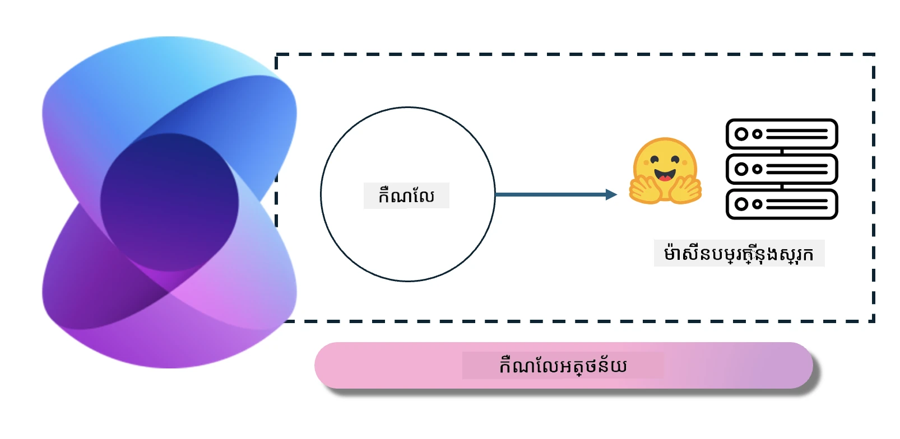
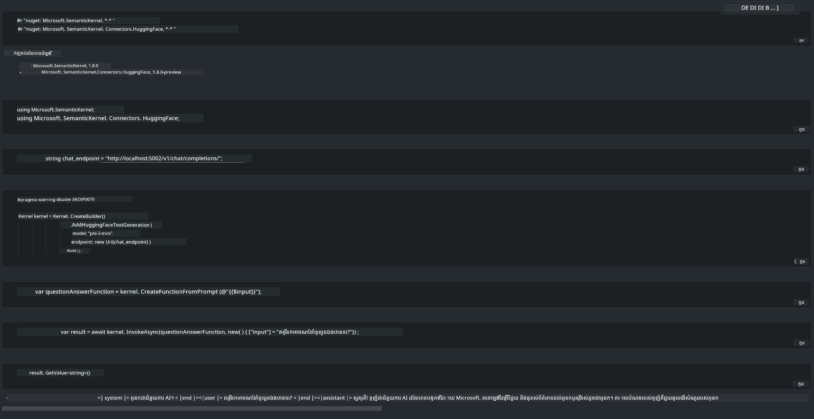

# **ការបកស្រាយ Phi-3 នៅលើម៉ាស៊ីនបម្រើក្នុងតំបន់**

យើងអាចដំឡើង Phi-3 នៅលើម៉ាស៊ីនបម្រើក្នុងតំបន់។ អ្នកប្រើប្រាស់អាចជ្រើសរើស [Ollama](https://ollama.com) ឬ [LM Studio](https://llamaedge.com) ជម្រើស ឬពួកគេអាចសរសេរកូដរបស់ខ្លួនផ្ទាល់។ អ្នកអាចភ្ជាប់សេវាកម្មក្នុងតំបន់របស់ Phi-3 តាមរយៈ [Semantic Kernel](https://github.com/microsoft/semantic-kernel?WT.mc_id=aiml-138114-kinfeylo) ឬ [Langchain](https://www.langchain.com/) ដើម្បីបង្កើតកម្មវិធី Copilot។

## **ប្រើ Semantic Kernel ដើម្បីចូលដំណើរការ Phi-3-mini**

ក្នុងកម្មវិធី Copilot យើងបង្កើតកម្មវិធីតាមរយៈ Semantic Kernel / LangChain។ ស៊ុមកម្មវិធីប្រភេទនេះទូទៅត្រូវគ្នាជាមួយ Azure OpenAI Service / ម៉ូឌែល OpenAI ហើយក៏អាចគាំទ្រម៉ូឌែល open source នៅលើ Hugging Face និងម៉ូឌែលក្នុងតំបន់ផងដែរ។ តើយើងគួរធ្វើអ្វី ប្រសិនបើយើងចង់ប្រើ Semantic Kernel ដើម្បីចូលដំណើរការ Phi-3-mini? ឧទាហរណ៍ប្រើ .NET យើងអាចបញ្ចូលជាមួយ Hugging Face Connector នៅ Semantic Kernel បាន។ ដោយលំនាំដើម វាអាចផ្គូផ្គងទៅនឹងលេខសម្គាល់ម៉ូឌែលលើ Hugging Face (លើកដំបូងដែលអ្នកប្រើ វានឹងទាញយកម៉ូឌែលពី Hugging Face ដែលចំណាយពេលវេលាច្រើន)។ អ្នកក៏អាចភ្ជាប់ទៅសេវាកម្មក្នុងតំបន់ដែលបានបង្កើតផងបាន។ ប្រៀបធៀបពីទាំងពីរ យើងផ្តល់អនុសាសន៍ឲ្យប្រើរបៀបចុងក្រោយ ព្រោះវាមានកម្រិតអាណាត្យាបាលខ្ពស់ជាង ជាពិសេសនៅក្នុងកម្មវិធីអាជីវកម្ម។

ពីរូបរាង ការ​ចូល​ដំណើរ​កម្មវិធី​ក្នុង​តំបន់​តាមរយៈ Semantic Kernel អាចភ្ជាប់បានយ៉ាងងាយស្រួលទៅម៉ាស៊ីនបម្រើម៉ូឌែល Phi-3-mini ដែលបានបង្កើតដោយខ្លួនឯង។ នេះគឺជាលទ្ធផលដំណើរការ។

***កូដគំរូ*** https://github.com/kinfey/Phi3MiniSamples/tree/main/semantickernel

---

<!-- CO-OP TRANSLATOR DISCLAIMER START -->
**ការព្រមាន**:  
ឯកសារនេះត្រូវបានបកប្រែដោយប្រើសេវាបកប្រែ AI [Co-op Translator](https://github.com/Azure/co-op-translator)។ ខណៈពេលយើងខិតខំដល់ភាពត្រឹមត្រូវ សូមយល់ឲ្យដឹងថាការបកប្រែដោយយន្តហោះអាចមានកំហុសឬភាពមិនត្រឹមត្រូវ។ ឯកសារដើមក្នុងភាសាមូលដ្ឋានគួរត្រូវបានគេចាត់ទុកជាភស្តុតាងដ៏មានសុពលភាព។ សម្រាប់ព័ត៌មានសំខាន់ៗ ការបកប្រែដោយអ្នកជំនាញមនុស្សគឺជាការបង្ហាញដែលបានណែនាំ។ យើងមិនទទួលខុសត្រូវចំពោះការយល់ច្រឡំ ឬការបកប្រែច្រឡំណាមួយដែលកើតឡើងពីការប្រើប្រាស់ការបកប្រែនេះទេ។
<!-- CO-OP TRANSLATOR DISCLAIMER END -->