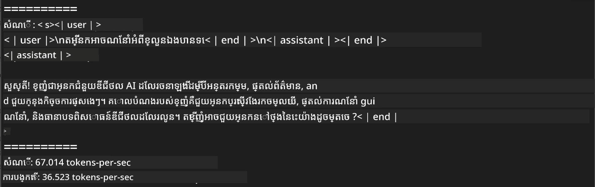
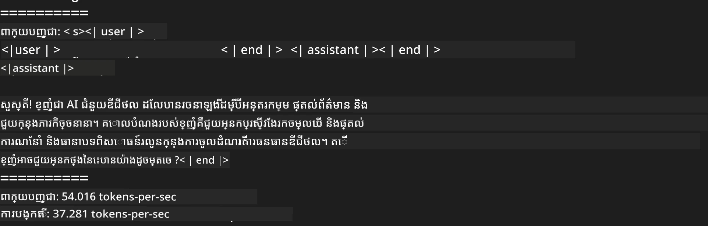
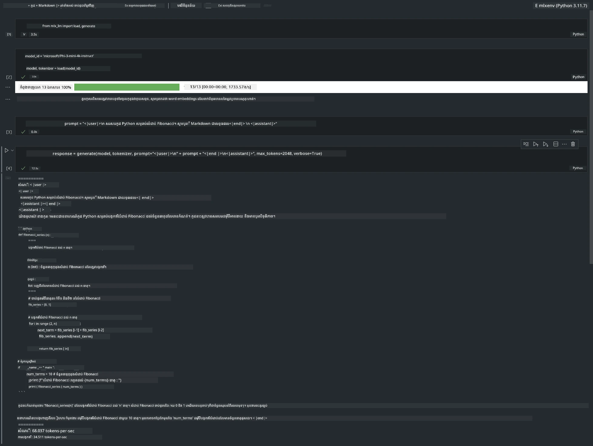

# **ការព្យាករ Phi-3 ជាមួយស៊ុម Apple MLX Framework**

## **MLX Framework ជាអ្វី?**

MLX គឺជាស៊ុមអារេសម្រាប់ស្រាវជា្រ​ញឡឺនCleaning machine learning លើ Apple silicon ដែលផ្តល់ដោយស្រាវជ្រាវ machine learning របស់ Apple។

MLX ត្រូវបានរចនាឡើងដោយអ្នកស្រាវជ្រាវ machine learning សម្រាប់អ្នកស្រាវជ្រាវ machine learning ។ ស៊ុមនេះមានគោលបំណងឲ្យប្រើប្រាស់បានងាយស្រួល ប៉ុន្តែមានប្រសិទ្ធភាពខ្ពស់សំរាប់បណ្តុះបណ្តាល និងបញ្ចេញម៉ូឌែល។ រចនាសម្ព័ន្ធនៃស៊ុមខ្លួនវានៅតែមានភាពសាមញ្ញពីមូលដ្ឋាន។ យើងមានគោលបំណងធ្វើឲ្យអ្នកស្រាវជ្រាវអាចពង្រីក និងបង្កើនគុណភាព MLX បានយ៉ាងងាយស្រួល ដើម្បីស្វែងយល់មេរៀនថ្មីៗយ៉ាងរហ័ស។

LLMs អាចត្រូវបានលឿនលើឧបករណ៍ Apple Silicon តាមរយៈ MLX ហើយម៉ូឌែលអាចរត់នៅក្នុងតំបន់មួយបានយ៉ាងងាយស្រួល។

## **ការប្រើប្រាស់ MLX ដើម្បីព្យាករ Phi-3-mini**

### **1. កំណត់បរិយាកាស MLX របស់អ្នក**

1. Python 3.11.x  
2. តំឡើងបណ្ណាល័យ MLX

```bash

pip install mlx-lm

```

### **2. ការរត់ Phi-3-mini នៅក្នុង Terminal ជាមួយ MLX**

```bash

python -m mlx_lm.generate --model microsoft/Phi-3-mini-4k-instruct --max-token 2048 --prompt  "<|user|>\nCan you introduce yourself<|end|>\n<|assistant|>"

```
  
លទ្ធផល (បរិយាកាសរបស់ខ្ញុំគឺ Apple M1 Max,64GB) គឺ



### **3. ការបម្រាស់កំណត់ Phi-3-mini ជាមួយ MLX នៅក្នុង Terminal**

```bash

python -m mlx_lm.convert --hf-path microsoft/Phi-3-mini-4k-instruct

```
  
***ចំណាំ៖*** ម៉ូឌែលអាចបម្រាស់តាមរយៈ mlx_lm.convert ហើយការបម្រាស់លំនាំដើមគឺ INT4។ ឧទាហរណ៍នេះបម្រាស់ Phi-3-mini ទៅ INT4។

ម៉ូឌែលអាចបម្រាស់តាមរយៈ mlx_lm.convert ហើយការបម្រាស់លំនាំដើមគឺ INT4។ ឧទាហរណ៍នេះគឺធ្វើការបម្រាស់ Phi-3-mini ទៅជា INT4។ បន្ទាប់ពីបម្រាស់ វានឹងត្រូវបានផ្ទុកនៅក្នុងថតចូលលំនាំ ./mlx_model

យើងអាចសាកល្បងម៉ូឌែលដែលបានបម្រាស់ជាមួយ MLX តាម terminal

```bash

python -m mlx_lm.generate --model ./mlx_model/ --max-token 2048 --prompt  "<|user|>\nCan you introduce yourself<|end|>\n<|assistant|>"

```
  
លទ្ធផលគឺ



### **4. ការរត់ Phi-3-mini ជាមួយ MLX នៅក្នុង Jupyter Notebook**



***ចំណាំ៖*** សូមអានឧទាហរណ៍នេះ [ចុចតំណភ្ជាប់នេះ](../../../code/03.Inference/MLX/MLX_DEMO.ipynb)

## **ធនធាន**

1. រៀនអំពី Apple MLX Framework [https://ml-explore.github.io](https://ml-explore.github.io/mlx/build/html/index.html)

2. Apple MLX GitHub Repo [https://github.com/ml-explore](https://github.com/ml-explore)

---

<!-- CO-OP TRANSLATOR DISCLAIMER START -->
**ប្រកាសបដិសេធ**៖  
ឯកសារនេះត្រូវបានបកប្រែដោយប្រើសេវាកម្មបកប្រែ AI [Co-op Translator](https://github.com/Azure/co-op-translator)។ ខណៈដែលយើងខិតខំរកភាពត្រឹមត្រូវ សូមយល់ឱ្យបានថាការបកប្រែដោយស្វ័យប្រវត្តិនេះអាចមានកំហុសឬភាពមិនត្រឹមត្រូវ។ ឯកសារដើមក្នុងភាសាមួយដើមគួរត្រូវបានចាត់ទុកជាតំណាងផ្លូវការដែលមានសុពលភាព។ សម្រាប់ព័ត៌មានសំខាន់ៗ ការបកប្រែដោយអ្នកជំនាញមនុស្សគឺល្អបំផុត។ យើងមិនទទួលខុសត្រូវចំពោះការយល់ច្រឡំ ឬការបកប្រែលើកលែងចេញពីការប្រើប្រាស់ការបកប្រែនេះឡើយ។
<!-- CO-OP TRANSLATOR DISCLAIMER END -->