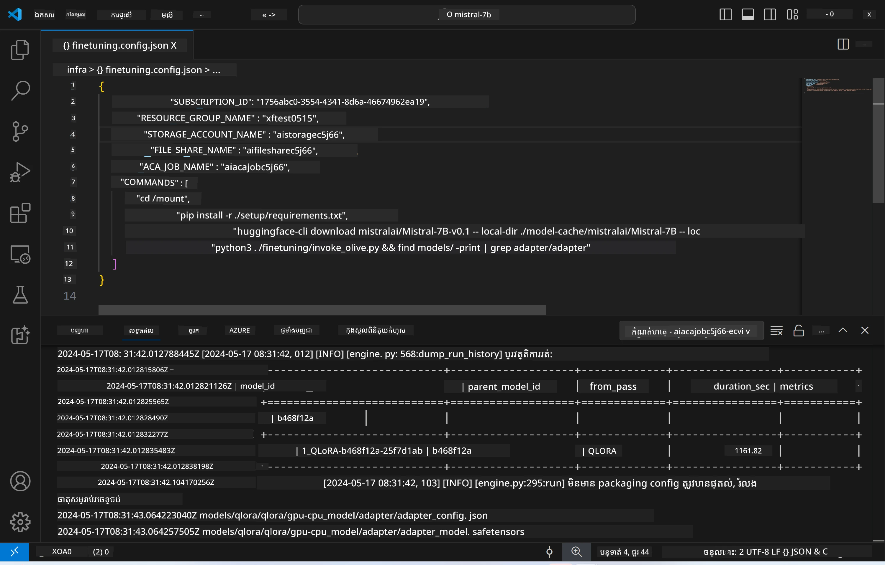
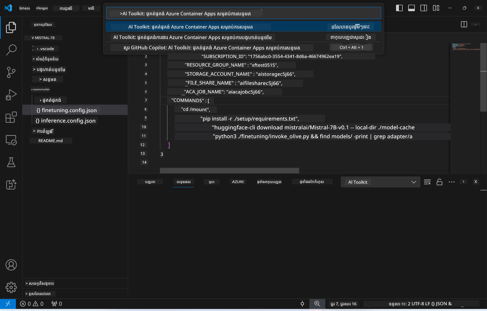
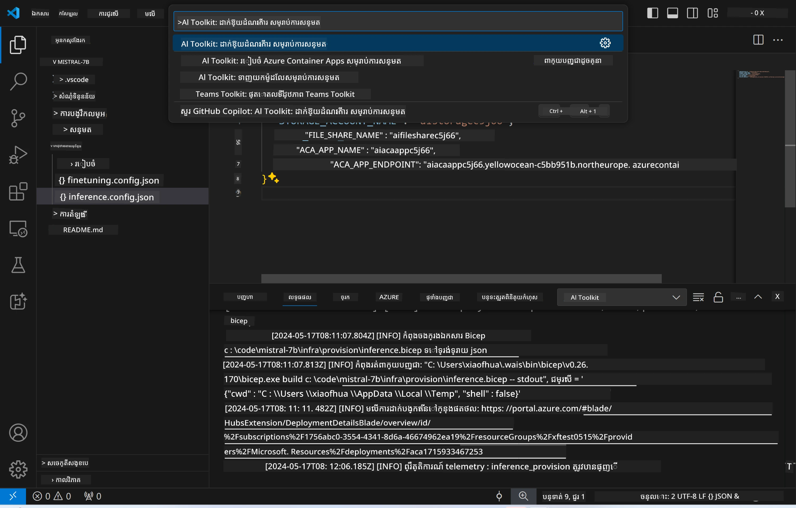
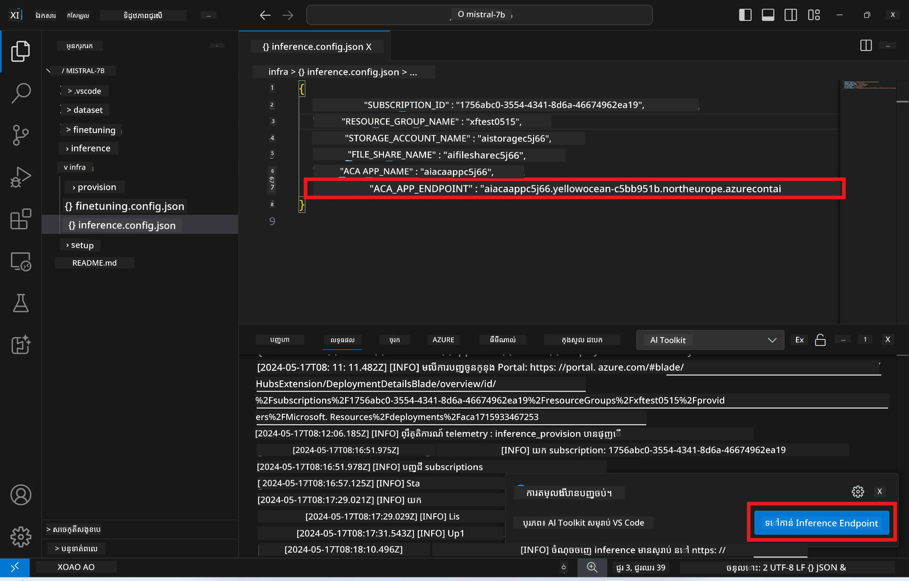

# ការធ្វើការវិភាគពីចម្ងាយជាមួយម៉ូដែលដែលបានផ្តោតលើលំអិត

បន្ទាប់ពីកម្មវិធី adapter ត្រូវបានហ្វឹកហាត់នៅម៉ាស៊ីនពីចម្ងាយ ប្រើកម្មវិធី Gradio ងាយស្រួលដើម្បីអន្តរកម្មជាមួយម៉ូដែល។



### រៀបចំធនធាន Azure
អ្នកត្រូវការរៀបចំធនធាន Azure សម្រាប់ការវិភាគពីចម្ងាយដោយបញ្ជូនការបញ្ជា `AI Toolkit: Provision Azure Container Apps for inference` ពី command palette។ ក្នុងការរៀបចំនេះ អ្នកនឹងត្រូវស្នើឲ្យជ្រើសរើសការជាវ Azure និងក្រុមធនធានរបស់អ្នក។  

   
ដោយលំនាំដើម ការជាវ និងក្រុមធនធានសម្រាប់ការវិភាគគួរតែផ្គូផ្គងនឹងដែលបានប្រើសម្រាប់ការហ្វឹកហាត់លំអិត។ ការវិភាគនឹងប្រើបរិយាកាស Azure Container App ដដែល និងចូលដំណើរការម៉ូដែល និង adapter ម៉ូដែលដែលបានរក្សាទុកក្នុង Azure Files ដែលបានបង្កើតឡើងក្នុងជំហានហ្វឹកហាត់លំអិត។

## ការប្រើ AI Toolkit

### ការដាក់កូដសម្រាប់ការវិភាគ  
ប្រសិនបើអ្នកចង់កែសម្រួលកូដវិភាគ ឬបញ្ចូលឡើងវិញម៉ូដែលវិភាគ សូមបញ្ជូនការបញ្ជា `AI Toolkit: Deploy for inference`។ នេះនឹងធ្វើការសមកាលកម្មកូដថ្មីបំផុតរបស់អ្នកជាមួយ ACA ហើយបើកឡើងវិញ replica ។



បន្ទាប់ពីដាក់កូដបានជោគជ័យ ម៉ូដែលបានមានស្រាប់សម្រាប់វាយតម្លៃដោយប្រើ endpoint នេះ។

### ការចូលប្រើ API វិភាគ

អ្នកអាចចូលប្រើ API វិភាគដោយចុចប៊ូតុង "*Go to Inference Endpoint*" ដែលបង្ហាញក្នុងការជូនដំណឹង VSCode។ ជម្រើសផ្សេងទៀតគឺអាចស្វែងរក URL endpoint API តាម `ACA_APP_ENDPOINT` ក្នុង `./infra/inference.config.json` និងក្នុងផ្ទាំង output។



> **ចំណាំ:** endpoint វិភាគអាចត្រូវការ​ពេលប៉ុន្មាននាទីដើម្បីដំណើរការបានពេញលេញ។

## គ្រឿងផ្សំវិភាគដែលបានរួមបញ្ចូលក្នុងទន្រ្ទាន

| ឯកថភ | មានខ្លឹមសារ |
| ------ |--------- |
| `infra` | មានការកំណត់ទាំងអស់ដែលចាំបាច់សម្រាប់ប្រតិបត្តិការពីចម្ងាយ។ |
| `infra/provision/inference.parameters.json` | មានប៉ារ៉ាម៉ែត្រសម្រាប់ប្លង់ bicep ដែលប្រើសម្រាប់រៀបចំធនធាន Azure សម្រាប់ការវិភាគ។ |
| `infra/provision/inference.bicep` | មានប្លង់សម្រាប់រៀបចំធនធាន Azure សម្រាប់ការវិភាគ។ |
| `infra/inference.config.json` | គឺជា​ឯកសារកំណត់រចនាសម្ព័ន្ធ ដែលបានបង្កើតដោយបញ្ជា `AI Toolkit: Provision Azure Container Apps for inference`។ វាត្រូវបានប្រើជាដំណើរការចូលសម្រាប់ command palettes ផ្សេងទៀតពីចម្ងាយ។ |

### ការប្រើ AI Toolkit ដើម្បីកំណត់បរិយាកាសរៀបចំធនធាន Azure
កំណត់ [AI Toolkit](https://marketplace.visualstudio.com/items?itemName=ms-windows-ai-studio.windows-ai-studio)

បញ្ជា Provision Azure Container Apps for inference។

អ្នកអាចស្វែងរកប៉ារ៉ាម៉ែត្រកំណត់នៅក្នុងឯកសារ `./infra/provision/inference.parameters.json`។ ព័ត៌មានលម្អិតមានដូចខាងក្រោម៖  
| ប៉ារ៉ាម៉ែត្រ | បរិយាយ |
| --------- |------------ |
| `defaultCommands` | ជាបញ្ជាដើម្បីចាប់ផ្តើមនូវ web API ។ |
| `maximumInstanceCount` | ប៉ារ៉ាម៉ែត្រនេះកំណត់សមត្ថភាពអតិបរមានៃឧបករណ៍ GPU ដែលអាចប្រើបាន។ |
| `location` | ជាទីតាំងដែលធនធាន Azure ត្រូវបានរៀបចំ។ តម្លៃលំនាំដើមគឺដូចនឹងទីតាំងក្រុមធនធានដែលបានជ្រើសរើស។ |
| `storageAccountName`, `fileShareName` `acaEnvironmentName`, `acaEnvironmentStorageName`, `acaAppName`,  `acaLogAnalyticsName` | ប៉ារ៉ាម៉ែត្រទាំងនេះប្រើសម្រាប់ដាក់ឈ្មោះធនធាន Azure សម្រាប់រៀបចំ។ ដោយលំនាំដើមឈ្មោះទាំងនេះនឹងដូចគ្នានឹងឈ្មោះធនធានហ្វឹកហាត់លំអិត។ អ្នកអាចបញ្ចូលឈ្មោះធនធានថ្មីមួយដែលមិនទាន់ប្រើដើម្បីបង្កើតធនធានដែលមានឈ្មោះផ្ទាល់ខ្លួន រឺអាចបញ្ចូលឈ្មោះធនធាន Azure ដែលមានរួចហើយ ប្រសិនបើអ្នកចង់ប្រើវា។ សម្រាប់ព័ត៌មានលម្អិត សូមយោងទៅផ្នែក [ការប្រើប្រាស់ធនធាន Azure មានស្រាប់](#ការប្រើប្រាស់ធនធាន-azure-មានស្រាប់)។ |

### ការប្រើប្រាស់ធនធាន Azure មានស្រាប់

ដោយលំនាំដើម ការរៀបចំវិភាគ​នឹងប្រើបរិយាកាស Azure Container App ដដែល ការរក្សាទុក Storage Account, Azure File Share និង Azure Log Analytics ដែលបានប្រើសម្រាប់ហ្វឹកហាត់លំអិត។ Azure Container App ថ្មីត្រូវបានបង្កើតឡើងតែសម្រាប់ API វិភាគ។

បើអ្នកបានកែសម្រួលធនធាន Azure នៅក្នុងជំហានហ្វឹកហាត់លំអិត ឬចង់ប្រើធនធាន Azure មានស្រាប់ផ្ទាល់ខ្លួនសម្រាប់វិភាគ សូមបញ្ជាក់ឈ្មោះរបស់ពួកវាក្នុងឯកសារ `./infra/inference.parameters.json` ។ បន្ទាប់មក ធ្វើការបញ្ជា `AI Toolkit: Provision Azure Container Apps for inference` ពី command palette។ វានឹងធ្វើបច្ចុប្បន្នភាពធនធានណាដែលបានបញ្ជាក់ និងបង្កើតធនធានណាដែលខ្វះ។

ឧទាហរណ៍ ប្រសិនបើអ្នកមានបរិយាកាសកុងតៃន័រ Azure មានស្រាប់ ឯកសារ `./infra/finetuning.parameters.json` របស់អ្នកគួរតែមានរូបរាងដូចខាងក្រោម៖

```json
{
    "$schema": "https://schema.management.azure.com/schemas/2019-04-01/deploymentParameters.json#",
    "contentVersion": "1.0.0.0",
    "parameters": {
      ...
      "acaEnvironmentName": {
        "value": "<your-aca-env-name>"
      },
      "acaEnvironmentStorageName": {
        "value": null
      },
      ...
    }
  }
```
  
### ការរៀបចំបែបដៃ  
ប្រសិនបើអ្នកចង់កំណត់ធនធាន Azure ដោយដៃ អ្នកអាចប្រើឯកសារ bicep ដែលផ្តល់ជូននៅក្នុងថត `./infra/provision`។ ប្រសិនបើអ្នកបានរៀបចំ និងកំណត់ធនធាន Azure ទាំងអស់ដោយផ្ទាល់ដោយមិនប្រើ command palette AI Toolkit អ្នកអាចបញ្ចូលឈ្មោះធនធានក្នុងឯកសារ `inference.config.json` បានយ៉ាងងាយស្រួល។

ឧទាហរណ៍៖

```json
{
  "SUBSCRIPTION_ID": "<your-subscription-id>",
  "RESOURCE_GROUP_NAME": "<your-resource-group-name>",
  "STORAGE_ACCOUNT_NAME": "<your-storage-account-name>",
  "FILE_SHARE_NAME": "<your-file-share-name>",
  "ACA_APP_NAME": "<your-aca-name>",
  "ACA_APP_ENDPOINT": "<your-aca-endpoint>"
}
```

---

<!-- CO-OP TRANSLATOR DISCLAIMER START -->
**ការបដិសេធ**៖
ឯកសារនេះត្រូវបានបកប្រែដោយប្រើសេវាកម្មបកប្រែ AI [Co-op Translator](https://github.com/Azure/co-op-translator)។ ខណៈពេលយើងខិតខំក្នុងការប្រកាន់ត្រឹមត្រូវ សូមដឹងថាការបកប្រែដោយស្វ័យប្រវត្តិអាចមានកំហុសឬការមិនត្រឹមត្រូវ។ ឯកសារដើមក្នុងភាសាដើមគួរត្រូវបានគេប្រើជាតំណាងដាស់តឿន។ សម្រាប់ព័ត៌មានសំខាន់ ការបកប្រែដោយមនុស្សជំនាញត្រូវបានណែនាំ។ យើងមិនទទួលខុសត្រូវចំពោះការយល់ច្រឡំ ឬការបកស្រាយខុសដែលកើតមានពីការប្រើប្រាស់ការបកប្រែនេះឡើយ។
<!-- CO-OP TRANSLATOR DISCLAIMER END -->