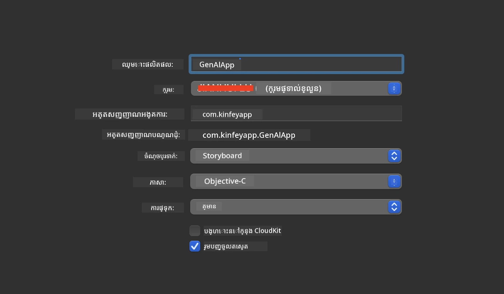
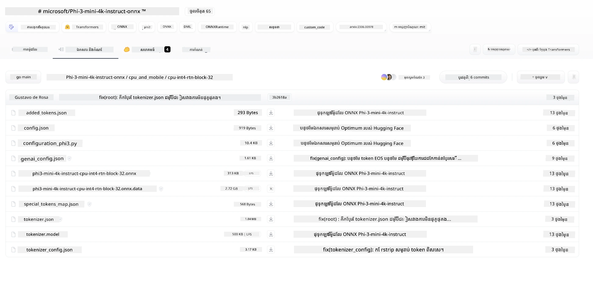
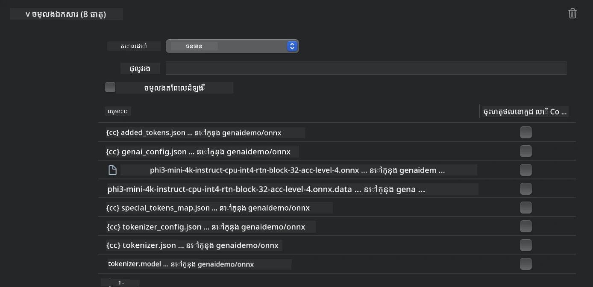
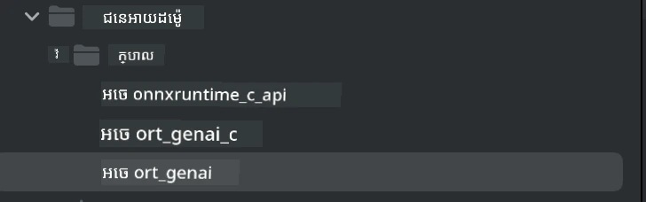
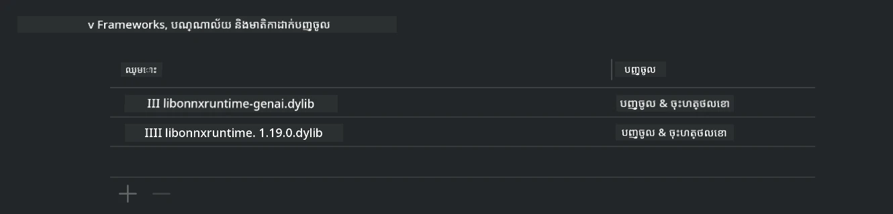
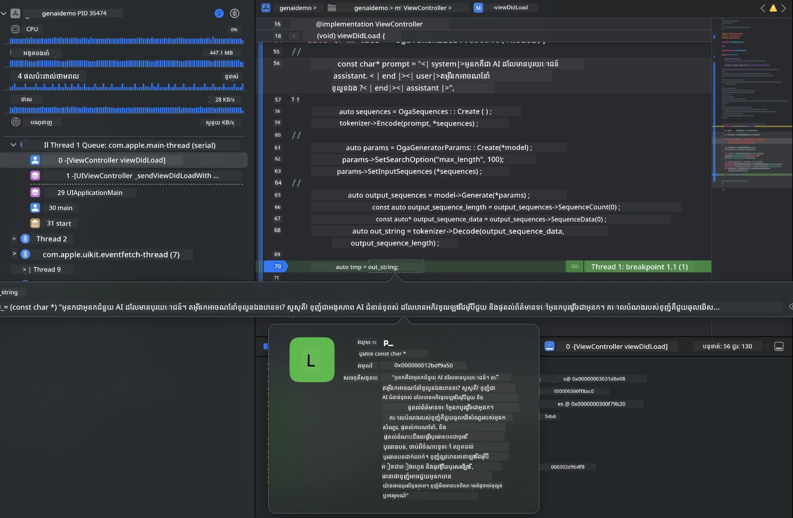

# **ការវិភាគ Phi-3 ក្នុង iOS**

Phi-3-mini គឺជាស៊េរីម៉ូឌែលថ្មីមួយពី Microsoft ដែលអនុញ្ញាតឱ្យដំឡើងម៉ូឌែលភាសាធំៗ (LLMs) លើឧបករណ៍មូលដ្ឋាន និងឧបករណ៍ IoT។ Phi-3-mini មានស្រេចសម្រាប់ iOS, Android និងការដំឡើងឧបករណ៍ Edge ដែលអាចអនុញ្ញាតឱ្យ AI កំណត់ជំនាន់អាចដំណើរការចេញនៅក្នុងបរិយាកាស BYOD។ ឧទាហរណ៍ខាងក្រោមបង្ហាញពីរបៀបដំឡើង Phi-3-mini លើ iOS។

## **1. ការរៀបចំ**

- **ក.** macOS 14+
- **ខ.** Xcode 15+
- **គ.** iOS SDK 17.x (iPhone 14 A16 ឬខ្ពស់ជាង)
- **ឃ.** ដំឡើង Python 3.10+ (គ្រាន់តែប្រើ Conda ត្រូវបានណែនាំ)
- **ង.** ដំឡើងបណ្ណាល័យ Python ៖ `python-flatbuffers`
- **ច.** ដំឡើង CMake

### Semantic Kernel និង ការវិភាគ

Semantic Kernel គឺជាស៊ុមកម្មវិធីដែលអនុញ្ញាតឱ្យអ្នកបង្កើតកម្មវិធីដែលស្របគ្នាជាមួយ Azure OpenAI Service ម៉ូឌែល OpenAI ហើយរហូតដល់ម៉ូឌែលមូលដ្ឋាន។ ការចូលប្រើសេវាកម្មមូលដ្ឋានតាមរយៈ Semantic Kernel អាចបង្កើតការតភ្ជាប់បានយ៉ាងសាមញ្ញជាមួយម៉ាស៊ីនម៉ូឌែល Phi-3-mini ដែលអ្នកផ្ទុកដោយខ្លួនឯង។

### ការហៅម៉ូឌែលបំលែងបរិមាណជាមួយ Ollama ឬ LlamaEdge

អ្នកប្រើច្រើនត្រូវការប្រើម៉ូឌែលបំលែងបរិមាណដើម្បីរត់ម៉ូឌែលនៅក្នុងមូលដ្ឋាន។ [Ollama](https://ollama.com) និង [LlamaEdge](https://llamaedge.com) អនុញ្ញាតឱ្យអ្នកហៅម៉ូឌែលបំលែងបរិមាណផ្សេងៗបាន៖

#### **Ollama**

អ្នកអាចរត់ `ollama run phi3` ត្រង់ ឬកំណត់វាថាក្រៅបណ្ដាញ។ បង្កើត Modelfile ជាមួយផ្លូវទៅឯកសារ `gguf` របស់អ្នក។ កូដឧទាហរណ៍សម្រាប់រត់ម៉ូឌែលបំលែងបរិមាណ Phi-3-mini៖

```gguf
FROM {Add your gguf file path}
TEMPLATE \"\"\"<|user|> .Prompt<|end|> <|assistant|>\"\"\"
PARAMETER stop <|end|>
PARAMETER num_ctx 4096
```

#### **LlamaEdge**

បើអ្នកចង់ប្រើ `gguf` នៅក្នុងពពក និងឧបករណ៍ edge ជាការប្រព្រឹត្តដូចគ្នា LlamaEdge ជាជម្រើសល្អមួយ។

## **2. ការបង្កប់ ONNX Runtime សម្រាប់ iOS**

```bash

git clone https://github.com/microsoft/onnxruntime.git

cd onnxruntime

./build.sh --build_shared_lib --ios --skip_tests --parallel --build_dir ./build_ios --ios --apple_sysroot iphoneos --osx_arch arm64 --apple_deploy_target 17.5 --cmake_generator Xcode --config Release

cd ../

```

### **ប្រកាស**

- **ក.** មុនការបង្កប់ សូមបញ្ជាក់ថា Xcode ត្រូវបានកំណត់ត្រឹមត្រូវ ហើយកំណត់វាជាថ្នាក់ការអភិវឌ្ឍកម្មសិក្សាសកម្មនៅក្នុងបន្ទាត់បញ្ជា៖

    ```bash
    sudo xcode-select -switch /Applications/Xcode.app/Contents/Developer
    ```

- **ខ.** ONNX Runtime ត្រូវបានបង្កប់សម្រាប់វេទិកាផ្សេងៗ។ សម្រាប់ iOS អ្នកអាចបង្កប់សម្រាប់ `arm64` ឬ `x86_64` បាន។

- **គ.** ត្រូវបានណែនាំឱ្យប្រើ iOS SDK ថ្មីបំផុតសម្រាប់ការបង្កប់។ ទោះជាយ៉ាងណា អ្នកក៏អាចប្រើកំណែចាស់ជាងនេះ ប្រសិនបើអ្នកចង់បានការចម្រុះជាមួយ SDK មុន។

## **3. ការបង្កប់ Generative AI ជាមួយ ONNX Runtime សម្រាប់ iOS**

> **ចំណាំ៖** ពីព្រោះ Generative AI ជាមួយ ONNX Runtime នៅក្នុងជំហានពិពណ៌នាមុន សូមចំណាំពីការផ្លាស់ប្តូរដែលអាចមាន។

```bash

git clone https://github.com/microsoft/onnxruntime-genai
 
cd onnxruntime-genai
 
mkdir ort
 
cd ort
 
mkdir include
 
mkdir lib
 
cd ../
 
cp ../onnxruntime/include/onnxruntime/core/session/onnxruntime_c_api.h ort/include
 
cp ../onnxruntime/build_ios/Release/Release-iphoneos/libonnxruntime*.dylib* ort/lib
 
export OPENCV_SKIP_XCODEBUILD_FORCE_TRYCOMPILE_DEBUG=1
 
python3 build.py --parallel --build_dir ./build_ios --ios --ios_sysroot iphoneos --ios_arch arm64 --ios_deployment_target 17.5 --cmake_generator Xcode --cmake_extra_defines CMAKE_XCODE_ATTRIBUTE_CODE_SIGNING_ALLOWED=NO

```

## **4. បង្កើតកម្មវិធី App ក្នុង Xcode**

ខ្ញុំបានជ្រើស Objective-C ជាវិធីអភិវឌ្ឍកម្មវិធី App ព្រោះការប្រើប្រាស់ Generative AI ជាមួយ API ONNX Runtime C++ កាន់តែឆាប់ស្របគ្នាជាមួយ Objective-C។ ច្បាស់ហើយ អ្នកក៏អាចបញ្ចប់ការហៅពាក់ព័ន្ធបានតាមរយៈការតភ្ជាប់ Swift។



## **5. ចម្លងម៉ូឌែល ONNX បំលែងបរិមាណ INT4 ទៅក្នុងគម្រោងកម្មវិធី App**

យើងត្រូវនាំចូលម៉ូឌែលបំលែងបរិមាណ INT4 ទ្រង់ទ្រាយ ONNX ដែលត្រូវបានទាញយកជាមុន។



បន្ទាប់ពីទាញយក សូមបន្ថែមវាទៅក្នុងថត Resources នៃគម្រោងក្នុង Xcode។



## **6. បន្ថែម API C++ ក្នុង ViewControllers**

> **ប្រកាស៖**

- **ក.** បន្ថែមឯកសារ header C++ ដែលគាំទ្រ ទៅក្នុងគម្រោង។

  

- **ខ.** រួមបញ្ចូលបណ្ណាល័យ `onnxruntime-genai` លើ Xcode។

  

- **គ.** ប្រើកូដគំរូ C សម្រាប់តេស្ត។ អ្នកក៏អាចបន្ថែមមុខងារផ្សេងៗដូចជា ChatUI សម្រាប់មុខងារបន្ថែមបាន។

- **ឃ.** ព្រោះអ្នកត្រូវប្រើ C++ រួមគ្នានៅក្នុងគម្រោង សូមបម្លែងឈ្មោះ `ViewController.m` ជា `ViewController.mm` ដើម្បីអនុញ្ញាតឱ្យមានការគាំទ្រ Objective-C++។

```objc

    NSString *llmPath = [[NSBundle mainBundle] resourcePath];
    char const *modelPath = llmPath.cString;

    auto model =  OgaModel::Create(modelPath);

    auto tokenizer = OgaTokenizer::Create(*model);

    const char* prompt = "<|system|>You are a helpful AI assistant.<|end|><|user|>Can you introduce yourself?<|end|><|assistant|>";

    auto sequences = OgaSequences::Create();
    tokenizer->Encode(prompt, *sequences);

    auto params = OgaGeneratorParams::Create(*model);
    params->SetSearchOption("max_length", 100);
    params->SetInputSequences(*sequences);

    auto output_sequences = model->Generate(*params);
    const auto output_sequence_length = output_sequences->SequenceCount(0);
    const auto* output_sequence_data = output_sequences->SequenceData(0);
    auto out_string = tokenizer->Decode(output_sequence_data, output_sequence_length);
    
    auto tmp = out_string;

```

## **7. ដំណើរការកម្មវិធី**

នៅពេលដែលរៀបចំរួច អ្នកអាចដំណើរការកម្មវិធី ដើម្បីមើលលទ្ធផលនៃការវិភាគម៉ូឌែល Phi-3-mini។



សម្រាប់កូដគំរូបន្ថែម និងការណែនាំលម្អិត សូមទៅកាន់ [ដាក់រចនាសម្ព័ន្ធ Phi-3 Mini Samples](https://github.com/Azure-Samples/Phi-3MiniSamples/tree/main/ios)។

---

<!-- CO-OP TRANSLATOR DISCLAIMER START -->
**ការបដិសេធ**៖  
ឯកសារនេះត្រូវបានបកប្រែដោយប្រើសេវាបកប្រែ AI [Co-op Translator](https://github.com/Azure/co-op-translator) ។ ខណៈពេលយើងខិតខំប្រឹងប្រែងដើម្បីមានភាពត្រឹមត្រូវ សូមយល់ឱ្យបានដឹងថា ការបកប្រែដោយស្វ័យប្រវត្តិក្នុងខ្លឹមសារអាចមានកំហុស ឬមិនត្រឹមត្រូវ។ ឯកសារដើមក្នុងភាសាមាតុភូមិគួរត្រូវបានគេនិយមទុកជាភាសាផ្លូវការជាស្រេច។ សម្រាប់ព័ត៌មានសំខាន់ៗ គ្រាន់តែផ្តល់អនុសាសន៍ឱ្យមានការបកប្រែដោយមនុស្សជំនាញ។ យើងមិនទទួលខុសត្រូវចំពោះការយល់ច្រឡំ ឬការបកប្រែខុសប្រក្រតីណាមួយដែលកើតមានពីការប្រើប្រាស់ការបកប្រែនេះឡើយ។
<!-- CO-OP TRANSLATOR DISCLAIMER END -->