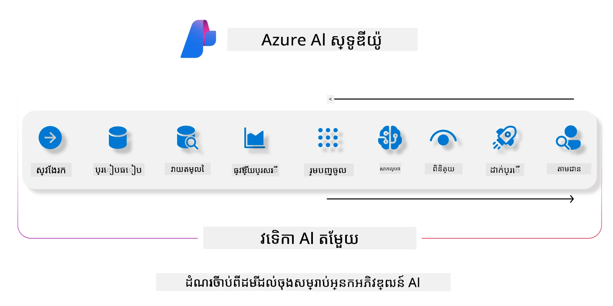
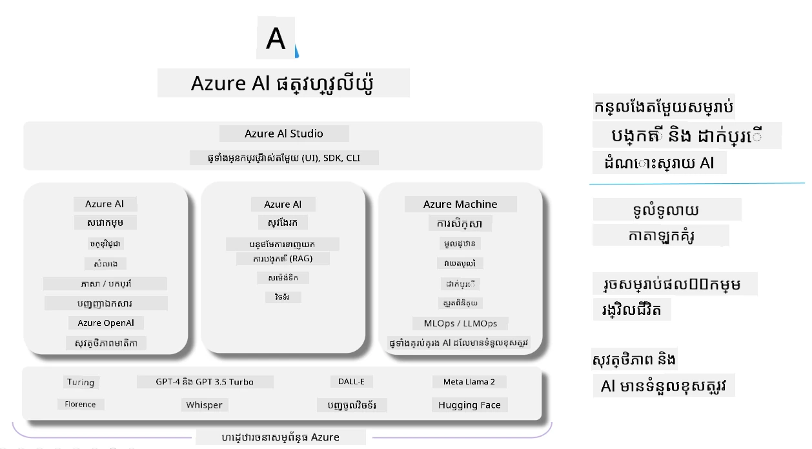

# **ការប្រើប្រាស់ Microsoft Foundry សម្រាប់ការវាយតម្លៃ**

របៀបវាយតម្លៃកម្មវិធី AI បង្កើតរបស់អ្នកដោយប្រើ [Microsoft Foundry](https://ai.azure.com?WT.mc_id=aiml-138114-kinfeylo)។ មិនថាអ្នកកំពុងវាយតម្លៃការសន្ទនាតែមួយជុំ ឬការសន្ទនាច្រើនជុំ Microsoft Foundry ផ្តល់ឧបករណ៍សម្រាប់វាយតម្លៃការសម្តែងរបស់ម៉ូដែល និងសុវត្ថិភាព។

## របៀបវាយតម្លៃកម្មវិធី AI បង្កើតជាមួយ Microsoft Foundry
សម្រាប់ការណែនាំលម្អិតមើល [ឯកសារ Microsoft Foundry](https://learn.microsoft.com/azure/ai-studio/how-to/evaluate-generative-ai-app?WT.mc_id=aiml-138114-kinfeylo)

នេះជជំហានដើម្បីចាប់ផ្តើម៖

## ការវាយតម្លៃម៉ូដែល AI បង្កើតនៅក្នុង Microsoft Foundry

**លក្ខខណ្ឌមុន**

- ទិន្នន័យសាកល្បងមួយក្នុងទ្រង់ទ្រាយ CSV ឬ JSON។
- ម៉ូដែល AI បង្កើតដែលបានដំឡើង (ដូចជា Phi-3, GPT 3.5, GPT 4, ឬម៉ូដែល Davinci)។
- រយៈពេលដំណើរការមានឧបករណ៍គណនា ដើម្បីធ្វើការវាយតម្លៃ។

## គម្រប់វាយតម្លៃដែលបានបង្កើតក្នុងខ្លួន

Microsoft Foundry អនុញ្ញាតឱ្យអ្នកវាយតម្លៃទាំងការសន្ទនាតែមួយជុំ និងការសន្ទនាច្រើនជុំដែលស្មុគស្មាញ។
សម្រាប់ករណី Retrieval Augmented Generation (RAG) ដែលម៉ូដែលមានមូលដ្ឋានលើទិន្នន័យជាក់លាក់ អ្នកអាចវាយតម្លៃការសម្តែង ដោយប្រើគម្រប់វាយតម្លៃដែលបានបង្កើតក្នុងខ្លួន។
បន្ថែមពីនេះ អ្នកអាចវាយតម្លៃសំណួរចម្លើយដែលសាមញ្ញមួយជុំទូទៅ (មិនមែនRAG) ។

## ការបង្កើតការរត់វាយតម្លៃ

ពីផ្ទៃ UI Microsoft Foundry ចូលទៅកាន់ទំព័រ Evaluate ឬ ទំព័រ Prompt Flow។
អនុវត្តតាមជំនួយការបង្កើតការវាយតម្លៃ ដើម្បីកំណត់ការរត់វាយតម្លៃ។ ផ្ដល់ឈ្មោះជាជម្រុះសម្រាប់ការវាយតម្លៃរបស់អ្នក។
ជ្រើសរើសស្ថានការណ៍ដែលសមនឹងគោលបំណងកម្មវិធីរបស់អ្នក។
ជ្រើសរើសគម្រប់វាយតម្លៃមួយ ឬ ច្រើន ដើម្បីវាយតម្លៃលទ្ធផលម៉ូដែល។

## ការលំនាំវាយតម្លៃផ្ទាល់ខ្លួន (ជាជម្រើស)

សម្រាប់ភាពបត់បែនច្រើន អ្នកអាចបង្កើតលំនាំវាយតម្លៃផ្ទាល់ខ្លួន។ ប្តូរជំហានវាយតម្លៃឲ្យស្របតាមតម្រូវការរបស់អ្នក។

## ការមើលលទ្ធផល

បន្ទាប់ពីដំណើរការវាយតម្លៃ ចូលទៅកាន់កំណត់ហេតុ មើល និងវិភាគគម្រប់វាយតម្លៃលម្អិតនៅក្នុង Microsoft Foundry។ ទទួលបានចំណេះដឹងអំពីសមត្ថភាព និងកំណត់ ចំណុចខ្សោយនៃកម្មវិធីរបស់អ្នក។

**ចំណាំ** Microsoft Foundry សព្វថ្ងៃនៅក្នុងជំហានដំណើរការម៉ោងវិសាខា (public preview) ដូច្នេះប្រើវាទៅសម្រាប់ការសាកល្បង និងការអភិវឌ្ឍ។ សម្រាប់បំពេញការងារផลិតផល សូមពិចារណាជម្រើសផ្សេងទៀត។ ស្រាវជ្រាវឯកសារ [AI Foundry ផ្លូវការណ៍](https://learn.microsoft.com/azure/ai-studio/?WT.mc_id=aiml-138114-kinfeylo) សម្រាប់ព័ត៌មានលម្អិត និងជំហានដោយជំហាន។

---

<!-- CO-OP TRANSLATOR DISCLAIMER START -->
**ការផ្តល់សេចក្តីបញ្ជាក់**៖
ឯកសារនេះត្រូវបានបកប្រែដោយប្រើសេវាកម្មបកប្រែ AI [Co-op Translator](https://github.com/Azure/co-op-translator)។ ខណៈពេលយើងខិតខំសម្រាប់ភាពត្រឹមត្រូវ សូមចំណាំថាការបកប្រែដោយស្វ័យប្រវត្តិអាចមានកំហុស ឬការខុសគ្នា។ ឯកសារដើមជាភាសា​ដើមគួរត្រូវបានគិតថាជាដើមប្រភពដែលមានអំណាច។ សម្រាប់ព័ត៌មានសំខាន់ៗ សំណើបកប្រែកម្មវិធីមនុស្សជំនាញត្រូវបានផ្ដល់អនុសាសន៍។ យើងមិនមានទំនួលខុសត្រូវចំពោះការយល់ច្រឡំ ឬការយល់បញ្ចូលខុសពីការប្រើប្រាស់ការបកប្រែនេះឡើយ។
<!-- CO-OP TRANSLATOR DISCLAIMER END -->