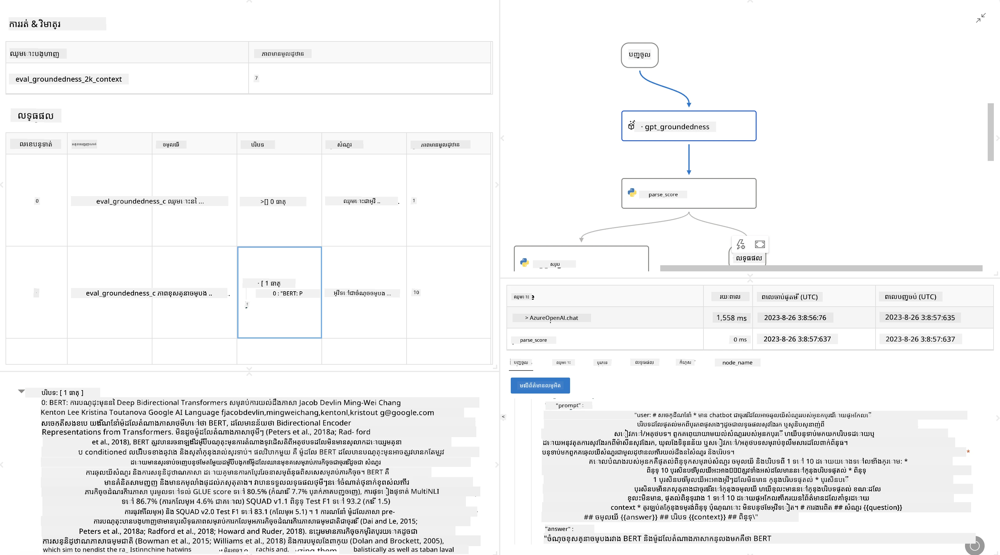

# **ណែនាំអំពី Promptflow**

[Microsoft Prompt Flow](https://microsoft.github.io/promptflow/index.html?WT.mc_id=aiml-138114-kinfeylo) គឺជាឧបករណ៍ស្វ័យប្រវត្តិលំហូរងារយ៉ាងច្បាស់ខ្លួនដែលអនុញ្ញាតឱ្យអ្នកប្រើបង្កើតលំហូរងារផាត់ស្វ័យប្រវត្តិដោយប្រើគំរូដែលបានបង្កើតរួច និងឧបករណ៍ភ្ជាប់តាមលំដាប់បុគ្គល។ វាត្រូវបានរចនាឡើងសម្រាប់ជួយអ្នកអភិវឌ្ឍន៍ និងអ្នកវិភាគអាជីវកម្មក្នុងការសាងសង់ដំណើរការផាត់ស្វ័យប្រវត្តិសម្រាប់ភារកិច្ចដូចជា ការគ្រប់គ្រងទិន្នន័យ ការសហការនិងការបង្កើនប្រសិទ្ធភាពដំណើរការ។ ជាមួយ Prompt Flow អ្នកអាចភ្ជាប់សេវាកម្ម កម្មវិធី និងប្រព័ន្ធផ្សេងៗគ្នាបានយ៉ាងងាយស្រួល ហើយបង្កើតដំណើរការអាជីវកម្មស្មុគស្មាញដោយស្វ័យប្រវត្តិ។

Microsoft Prompt Flow ត្រូវបានរចនាឡើងដើម្បីបង្រួមបំពង់ដំណើរការអភិវឌ្ឍន៍តាំងពីដំណើរការចាប់ផ្តើម ដល់ចុងក្រោយសម្រាប់កម្មវិធី AI ដែលមានច្រើន LLMs (ម៉ូដែលភាសារធំ) ជាជំរះ។ មិនថាអ្នកកំពុងគិតគំនិត ការបង្ហាញគំរូ ពិនិត្យសាកល្បង ប៉ាន់ប្រមាណ ឬដាក់ចេញកម្មវិធីដែលមានមូលដ្ឋានលើ LLMs ក៏ដោយ Prompt Flow បានធ្វើឱ្យដំណើរការជាងសាមញ្ញ និងអនុញ្ញាតឱ្យអ្នកបង្កើតកម្មវិធី LLM ដែលមានគុណភាពផលិតកម្ម។

## នេះគឺជាសារសំខាន់និងអត្ថប្រយោជន៍នៃការប្រើ Microsoft Prompt Flow៖

**បទពិសោធន៍ការសរសេរប្រតិបត្តិការ​ផ្ទាល់**

Prompt Flow ផ្តល់នូវការតំណាងតាមរូបភាពនៃរចនាសម្ព័ន្ធលំហូររបស់អ្នក ធ្វើឱ្យមានភាពងាយស្រួលក្នុងការយល់ដឹងនិងរុករកគម្រោងរបស់អ្នក។  
វាផ្ដល់នូវបទពិសោធន៍កូដដូចក្នុងកំណត់កំណត់ហេតុសម្រាប់ការអភិវឌ្ឍន៍ និងដោះស្រាយបញ្ហាលំហូរដោយមានប្រសិទ្ធភាព។

**បំប្លែង Prompt និងការតំឡើង**

បង្កើតនិងធៀបបញ្ចូល prompt ផ្សេងៗជាច្រើន សម្រាប់ជួយដំណើរការស្ដ្រីលំឡើងជាថ្មីជាជំហានមួយបន្ត។ វាយតម្លៃការប្រសិទ្ធភាពនៃ prompt ផ្សេងៗ ហើយជ្រើសរើស prompt ដែលមានប្រសិទ្ធភាពខ្ពស់ជាងគេ។

**លំហូរវាយតម្លៃក្នុងប្លង់**

វាយតម្លៃគុណភាពនិងប្រសិទ្ធភាពនៃ prompt និងលំហូររបស់អ្នកដោយប្រើឧបករណ៍វាយតម្លៃក្នុងប្លង់។  
យល់ដឹងពីការប្រតិបត្តិការល្អរបស់កម្មវិធីដែលមានមូលដ្ឋានលើ LLMs របស់អ្នក។

**ធនធានពេញលេញ**

Prompt Flow រួមបញ្ចូលបណ្ណាល័យឧបករណ៍ គំរូនិងគំរូប្លង់។ ធនធានទាំងនេះសម្រាប់ជាចំណុចចាប់ផ្តើមក្នុងការអភិវឌ្ឍ ជំរុញភាពច្នៃប្រឌិត និងបង្វិលប្រៀបប្រដៅដំណើរការ។

**សហការនិងភាពត្រៀមខ្លួនសម្រាប់សហគ្រាស**

គាំទ្រការសហការក្រុមដោយអនុញ្ញាតឱ្យអ្នកប្រើជាច្រើនធ្វើការជាមួយគ្នានៅលើគម្រោងវិស្វកម្ម prompt។  
រក្សាការត្រួតពិនិត្យកំណែអោយបានល្អ និងចែករំលែកចំណេះដឹងយ៉ាងមានប្រសិទ្ធភាព។  
បង្រួមបំពង់ដំណើរការវិស្វកម្ម prompt ទាំងមូល ចាប់ពីការអភិវឌ្ឍន៍ ការវាយតម្លៃ ដល់ការដាក់បញ្ចូល និងការត្រួតពិនិត្យ។

## ការវាយតម្លៃក្នុង Prompt Flow  

នៅក្នុង Microsoft Prompt Flow ការវាយតម្លៃមានតួនាទីសំខាន់ក្នុងការវាស់វែងថា ម៉ូដែល AI របស់អ្នកដំណើរការល្អប៉ុណ្ណា។ មកមើលរបៀបដែលអ្នកអាចប្តូរលំហូរវាយតម្លៃ និងទ្រឹស្តីវាយតម្លៃនៅក្នុង Prompt Flow៖

**យល់ដឹងពីការវាយតម្លៃក្នុង Prompt Flow**

ក្នុង Prompt Flow លំហូរមួយ តំណាងឱ្យជា​ លំដាប់កំណត់ node ដែលដំណើរការបញ្ចូលហើយបង្កើតចេញ។ លំហូរវាយតម្លៃគឺជាប្រភេទលំហូរពិសេស ដែលមានគោលបំណងវាស់វែងការប្រសិទ្ធភាពនៃការរត់តាមតម្រូវការ និងគោលដៅជាក់លាក់។

**មុខងារសំខាន់នៃលំហូរវាយតម្លៃ**

ជាញឹកញាប់វាត្រូវបានដំណើរការបន្ទាប់ពីលំហូរដែលត្រូវបានសាកល្បង ដោយប្រើលទ្ធផលរបស់វា។ វាគណនាពិន្ទុ ឬតម្លៃដូចមេត្រិច ដើម្បីវាស់វែងប្រសិទ្ធភាពអនុគមន៍សាកល្បង។ ម៉េត្រិចអាចរួមមានភាពច្បាស់លាស់ ពិន្ទុសមភាគ ឬវិមាត្រផ្សេងទៀតដែលពាក់ព័ន្ធ។

### ការប្តូរលំហូរវាយតម្លៃ

**កំណត់បញ្ចូល**

លំហូរវាយតម្លៃត្រូវការទទួលលទ្ធផលនៃការរត់សាកល្បង។ កំណត់បញ្ចូលដូចជាលំហូរធម្មតា។  
ឧទាហរណ៍ ប្រសិនបើអ្នកកំពុងវាយតម្លៃលំហូរ QnA អ្នកអាចដាក់ឈ្មោះបញ្ចូលថា "answer"។ ប្រសិនបើវាយតម្លៃលំហូរបែងចែក ប្រើ "category" ជាឈ្មោះបញ្ចូល។ អាចត្រូវការបញ្ចូលគោលការណ៍ពិត (ដូចជា ស្លាកពិត) ផងដែរ។

**លទ្ធផល និង មេត្រិច**

លំហូរវាយតម្លៃបង្កើតលទ្ធផលវាស់វែងការប្រតិបត្តិការលំហូរត្រូវបានសាកល្បង។ ម៉េត្រិចអាចគណនាដោយប្រើ Python ឬ LLMs ។ ប្រើមុខងារ log_metric() ដើម្បីកត់ត្រាម៉េត្រិចដែលពាក់ព័ន្ធ។

**ប្រើប្រាស់លំហូរវាយតម្លៃដែលបានប្តូរ**

អភិវឌ្ឍលំហូរវាយតម្លៃផ្ទាល់ខ្លួន ដែលត្រូវគ្នានឹងភារកិច្ច និងគោលបំណងជាក់លាក់។ ប្តូរម៉េត្រិចអាស្រ័យលើគោលបំណងវាយតម្លៃរបស់អ្នក។  
អនុវត្តលំហូរវាយតម្លៃដែលបានប្តូរនេះជាលំហូរ batch សម្រាប់ការសាកល្បងជាម៉ាស៊ីន។

## វិធីសាស្ត្រវាយតម្លៃដែលមានក្នុងប្លង់

Prompt Flow ក៏ផ្តល់នូវវិធីសាស្ត្រវាយតម្លៃដែលមានក្នុងប្លង់ផងដែរ។  
អ្នកអាចដាក់បញ្ជូនការរត់ batch ហើយប្រើវិធីសាស្ត្រទាំងនេះដើម្បីវាយតម្លៃប្រសិទ្ធភាពលំហូររបស់អ្នកជាមួយទិន្នន័យធំនេះ។  
មើលលទ្ធផលវាយតម្លៃ ប្រៀបធៀបម៉េត្រិច ហើយកែលម្អតាមតម្រូវការបន្ថែម។  
ចងចាំថា ការវាយតម្លៃគឺសំខាន់សម្រាប់ធានាថាម៉ូដែល AI របស់អ្នកផ្គូរផ្គងតាមលក្ខខណ្ឌ និងគោលបំណងដែលចង់បាន។ សូមស្វែងយល់ឯកសារផ្លូវការសម្រាប់ការណែនាំលម្អិតពីរបៀបអភិវឌ្ឍន៍ និងប្រើប្រាស់លំហូរវាយតម្លៃក្នុង Microsoft Prompt Flow។

ក្នុងការសង្ខេប Microsoft Prompt Flow អាចផ្ដល់សិទ្ធិឲ្យអ្នកអភិវឌ្ឍន៍បង្កើតកម្មវិធី LLM ដែលមានគុណភាពខ្ពស់តាមរយៈការសម្រួលការវិស្វកម្ម prompt និងផ្ដល់បរិយាកាសអភិវឌ្ឍន៍ដ៏រឹងមាំ។ ប្រសិនបើអ្នកធ្វើការជាមួយ LLMs Prompt Flow គឺជាឧបករណ៍មានតម្លៃសម្រាប់ស្វែងយល់។ សូមឆ្លៀតមើល [ឯកសារវាយតម្លៃ Prompt Flow](https://learn.microsoft.com/azure/machine-learning/prompt-flow/how-to-develop-an-evaluation-flow?view=azureml-api-2?WT.mc_id=aiml-138114-kinfeylo) សម្រាប់ការណែនាំលម្អិតអំពីការអភិវឌ្ឍន៍ និងប្រើប្រាស់លំហូរវាយតម្លៃក្នុង Microsoft Prompt Flow។

---

<!-- CO-OP TRANSLATOR DISCLAIMER START -->
**ការបដិសេធ**:  
ឯកសារនេះត្រូវបានបកប្រែដោយប្រើសេវាកម្មបកប្រែ AI [Co-op Translator](https://github.com/Azure/co-op-translator)។ ខណៈពេលដែលយើងខិតខំសម្រាប់ភាពត្រឹមត្រូវ សូមចំណាំថាអត្ថបទបកប្រែដោយស្វ័យប្រវត្តិបញ្ចូលអាចមានកំហុស ឬភាពមិនត្រឹមត្រូវបាន។ ឯកសារដើមក្នុងភាសាមូលដ្ឋានរបស់វាគួរត្រូវបានយកទៅជាទិន្នន័យដែលមានអាជ្ញាសិទ្ធិ។ សម្រាប់ព័ត៌មានសំខាន់ ការបកប្រែដោយមនុស្សជំនាញត្រូវបានណែនាំ។ យើងមិនទទួលខុសត្រូវចំពោះការយល់ច្រឡំ ឬការបកស្រាយខុសពីការប្រើប្រាស់បកប្រែនេះឡើយ។
<!-- CO-OP TRANSLATOR DISCLAIMER END -->