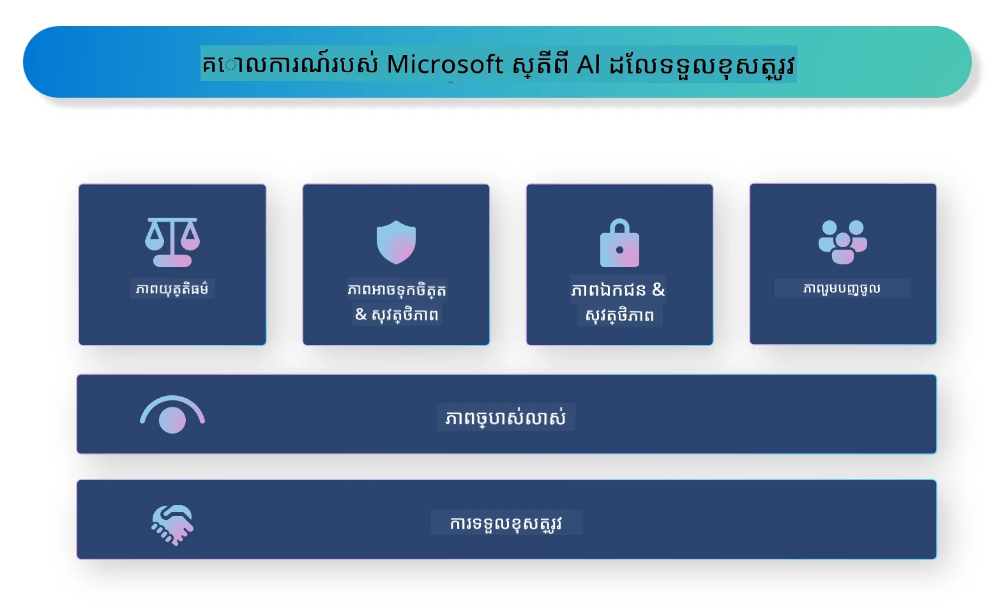

# **ណែនាំបញ្ហា AI ការទទួលខុសត្រូវ**

[Microsoft Responsible AI](https://www.microsoft.com/ai/responsible-ai?WT.mc_id=aiml-138114-kinfeylo) គឺជានគរឿងមួយដែលមានគោលបំណងជួយអ្នកអភិវឌ្ឍន៍ និងស្ថាប័នក្នុងការច្នៃប្រឌិតប្រព័ន្ធ AI ដែលមានភាពថ្លៃថ្លា ទុកចិត្តបាន និងអាចទទួលខុសត្រូវ។ នគរឿងនេះផ្ដល់ការណែនាំ និងធនធានសម្រាប់បង្កើតដំណោះស្រាយ AI ដែលទទួលខុសត្រូវ ដែលស្របទៅនឹងគោលការណ៍ខាងاخلاقي ដូចជា ការគោរពជាងចំណង សមភាព និងភាពថ្លៃថ្លា។ យើងនឹងស្វែងយល់ពីឧបសគ្គខ្លះៗ និងការអនុវត្តល្អបំផុតមួយចំនួនដែលទាក់ទងនឹងការបង្កើតប្រព័ន្ធ AI ដែលទទួលខុសត្រូវ។

## ទិដ្ឋភាពទូទៅអំពី Microsoft Responsible AI

**គោលការណ៍ខាងاخلاقي**

Microsoft Responsible AI ត្រូវបានណែនាំដោយសំណុំគោលការណ៍ខាងاخلاقي ដូចជា ការស្មោះត្រង់, សមភាព, ភាពថ្លៃថ្លា, ការទទួលខុសត្រូវ និងសុវត្ថិភាព។ គោលការណ៍ទាំងនេះត្រូវបានរចនាឡើងដើម្បីធានាថាប្រព័ន្ធ AI ត្រូវបានអភិវឌ្ឍន៍ក្នុងវិធីសាស្រ្តដែលមានឯកសារសុចរិត និងទទួលខុសត្រូវ។

**AI ដែលថ្លៃថ្លា**

Microsoft Responsible AI ផ្ដោតសំខាន់ទៅលើភាពថ្លៃថ្លា ក្នុងប្រព័ន្ធ AI។ នេះរួមមានការផ្ដល់ការពន្យល់ច្បាស់លាស់អំពីវិធីដែលម៉ូដែល AI ធ្វើការ និងធានាថាដាតារបស់ប្រភព និងអាល់ហ្គារីធម៍មានរួចរាល់សម្រាប់សាធារណៈ។

**AI ដែលអាចទទួលខុសត្រូវ**

[Microsoft Responsible AI](https://www.microsoft.com/ai/responsible-ai?WT.mc_id=aiml-138114-kinfeylo) ជំរុញការអភិវឌ្ឍប្រព័ន្ធ AI ដែលអាចទទួលខុសត្រូវ ដែលអាចផ្ដល់ការយល់ដឹងពីរបៀបដែលម៉ូដែល AI ធ្វើសេចក្តីសម្រេច។ នេះអាចជួយឲ្យអ្នកប្រើប្រាស់យល់ និងទុកចិត្តលទ្ធផលពីប្រព័ន្ធ AI។

**ការរួមបញ្ចូល**

ប្រព័ន្ធ AI គួរត្រូវបានរចនាឡើងដើម្បីអោយអត្ថប្រយោជន៏សម្រាប់គ្រប់គ្នា។ Microsoft ស្មារតីបង្កើត AI រួមបញ្ចូល ដែលគិតពីទស្សនៈផ្សេងៗ ហើយជំរកការប្រកាន់ខុស ឬការរើសអើង។

**ភាពជឿជាក់ និងសុវត្ថិភាព**

ការធានាថាប្រព័ន្ធ AI មានភាពជឿជាក់ និងសុវត្ថិភាពគឺសំខាន់ណាស់។ Microsoft ផ្ដោតលើការបង្កើតម៉ូដែលរឹងមាំ ដែលបំពេញការងារយ៉ាងត្រឹមត្រូវ និងជៀសវាងលទ្ធផលគ្រោះថ្នាក់។

**សមភាពក្នុង AI**

Microsoft Responsible AI ត្រូវបានទទួលស្គាល់ថាប្រព័ន្ធ AI អាចបន្តការប្រកាន់ខុស ប្រសិនបើគេបណ្ដុះបណ្ដាលលើទិន្នន័យ ឬអាល់ហ្គារីធម៍ដែលមានការប្រកាន់ខុស។ នគរឿងផ្ដល់ការណែនាំសម្រាប់ការអភិវឌ្ឍប្រព័ន្ធ AI ដែលរស់នៅដោយសមភាព និងមិនរើសអើង ដោយផ្អែកលើកត្តាដូចជាជាតិសាសន៍ ភេទ ឬអាយុ។

**ភាពឯកជន និងសុវត្ថិភាព**

Microsoft Responsible AI ផ្ដោតសំខាន់ទៅលើការការពារភាពឯកជនរបស់អ្នកប្រើ និងសុវត្ថិភាពទិន្នន័យ ក្នុងប្រព័ន្ធ AI។ នេះរួមមានការអនុវត្តសាយុគ្រប់គ្រងបញ្ចាក់ពាក្យសម្ងាត់ ការត្រួតពិនិត្យការចូលប្រើ និងពិនិត្យប្រព័ន្ធ AI ជាប្រចាំសម្រាប់ចំណុចចាញ់។

**ការទទួលខុសត្រូវ និងការទទួលខុសត្រូវ**

Microsoft Responsible AI ជំរុញការទទួលខុសត្រូវ និងការទទួលខុសត្រូវក្នុងការអភិវឌ្ឍន៍ និងការចែកចាយ AI។ នេះរួមមានការធានាថាអ្នកអភិវឌ្ឍន៍ និងស្ថាប័នយល់ពីហានិភ័យដែលអាចកើតមានពីប្រព័ន្ធ AI និងចាត់វិធានការដើម្បីកាត់បន្ថយហានិភ័យនោះ។

## អនុវត្តល្អបំផុតសម្រាប់បង្កើតប្រព័ន្ធ AI ដែលទទួលខុសត្រូវ

**អភិវឌ្ឍម៉ូដែល AI ដោយប្រើអង្គចងចាំទិន្នន័យចម្រុះ**

ដើម្បីជៀសវាងការប្រកាន់ខុសក្នុងប្រព័ន្ធ AI គឺសំខាន់ណាស់ក្នុងការប្រើបណ្ដុំទិន្នន័យដែលចម្រុះ ហើយបង្ហាញពីទស្សនៈ និងបទពិសោធន៍ប្លែកៗ។

**ប្រើបច្ចេកទេស AI ដែលអាចពន្យល់បាន**

បច្ចេកទេស AI ដែលអាចពន្យល់បានអាចជួយអ្នកប្រើយល់ពីរបៀបដែលម៉ូដែល AI ធ្វើការសម្រេច ដូច្នេះអាចបង្កើតភាពទុកចិត្តក្នុងប្រព័ន្ធបាន។

**ពិនិត្យប្រព័ន្ធ AI ជាប្រចាំសម្រាប់ចំណុចចាញ់**

ការត្រួតពិនិត្យប្រព័ន្ធ AI ជាប្រចាំអាចជួយស្វែងរកហានិភ័យ និងចំណុចចាញ់ដែលត្រូវបានដោះស្រាយ។

**អនុវត្តចុះបញ្ជីកូដទិន្នន័យខ្លាំង និងការគ្រប់គ្រងការចូល**

ចុះបញ្ជីកូដទិន្នន័យ និងការគ្រប់គ្រងការចូលអាចជួយការពារភាពឯកជន និងសុវត្ថិភាពរបស់អ្នកប្រើប្រាស់ក្នុងប្រព័ន្ធ AI។

**អន់ដោតគោលការណ៍ខាងاخلاقيក្នុងការអភិវឌ្ឍ AI**

ការអន់ដោតគោលការណ៍ខាងاخلاقي ដូចជា សមភាព ភាពថ្លៃថ្លា និងការទទួលខុសត្រូវ អាចជួយបង្កើតភាពទុកចិត្តនិងធានាថាប្រព័ន្ធ AI ត្រូវបានអភិវឌ្ឍដោយវិធីសាស្រ្តដែលមានទំនុកចិត្ត។

## ការប្រើប្រាស់ AI Foundry សម្រាប់ AI ទទួលខុសត្រូវ

[Microsoft Foundry](https://ai.azure.com?WT.mc_id=aiml-138114-kinfeylo) គឺជាវេទិកាដ៏មានអំណាចដែលអនុញ្ញាតឲ្យអ្នកអភិវឌ្ឍន៍ និងស្ថាប័នបង្កើតកម្មវិធីឆ្លាតវៃ ទាន់សម័យ មានស្រាប់ក្នុងទីផ្សារ និងទទួលខុសត្រូវបានយ៉ាងលឿន។ ខាងក្រោមជាលក្ខណៈពិសេស និងសមត្ថភាពសំខាន់ៗនៃ Microsoft Foundry៖

**API និងម៉ូដែលនៅក្នុងប្រអប់**

Microsoft Foundry ផ្ដល់ API និងម៉ូដែលដែលបានកសាងរួច និងអាចកែតម្រូវបាន។ វាចាប់ផ្តើមពីភារកិច្ច AI ផ្សេងៗទូទៅ ដូចជា AI បង្កើត-បក្រា, ការបំលែងភាសារំពាស់ជជែក, ស្វែងរក, ត្រួតពិនិត្យ, បកប្រែ, សំឡេង, ភាពយន្ត និងការអនុវត្តសេចក្តីសម្រេច។

**Prompt Flow**

Prompt flow ក្នុង Microsoft Foundry អនុញ្ញាតឲ្យអ្នកបង្កើតបទពិសោធន៍ AI ជជែក។ វាអាចរចនា ហើយគ្រប់គ្រងលំហូរជជែក ធ្វើឲ្យងាយស្រួលក្នុងការបង្កើត chatbot, ជំនួយការបច្ចេកវិទ្យា និងកម្មវិធីអន្តរកម្មផ្សេងទៀត។

**Retrieval Augmented Generation (RAG)**

RAG គឺជាបច្ចេកទេសដែលបញ្ចូលវិធីសាស្រ្តបណ្ដុំស្វែងរក និងបង្កើតជាមួយគ្នា។ វាបង្កើនគុណភាពនៃការឆ្លើយតបដែលបានបង្កើតដោយប្រើសមត្ថភាពចេះដឹងមានរួច (retrieval) និងការបង្កើតច្នៃប្រឌិត (generation) ទាំងពីរ។

**ការវាយតម្លៃ និងការតាមដានសម្រាប់ Generative AI**

Microsoft Foundry ផ្ដល់ឧបករណ៍សម្រាប់វាយតម្លៃ និងត្រួតពិនិត្យម៉ូដែល generative AI។ អ្នកអាចវាយតម្លៃសមត្ថភាព សមភាព និងមាត្រដ្ឋានសំខាន់ៗផ្សេងៗ ដើម្បីធានាបានការចែកចាយដែលទទួលខុសត្រូវ។ បន្ថែមពីនេះ ប្រសិនបើអ្នកបានបង្កើតផ្ទាំងគ្រប់គ្រង អ្នកអាចប្រើ UI ដែលមិនចាំបាច់សរសេរកូដក្នុង Azure Machine Learning Studio ដើម្បីប្តូរ​រចនាបថ និងបង្កើតផ្ទាំងគ្រប់គ្រង AI ទទួលខុសត្រូវ និងកាតពិន្ទុដែលពាក់ព័ន្ធ ដែលផ្អែកលើ [Responsible AI Toolbox](https://responsibleaitoolbox.ai/?WT.mc_id=aiml-138114-kinfeylo) Python Libraries។ កាតពិន្ទុនេះជួយអ្នកចែករំលែកព័ត៌មានសំខាន់ៗទាក់ទងនឹងសមភាព សារៈសំខាន់លក្ខណៈ និងកត្តាទាក់ទងនឹងការចែកចាយដែលទទួលខុសត្រូវ ជាមួយភាគីដែលមានជំនាញបច្ចេកទេស និងគ្មានជំនាញបច្ចេកទេស។

ដើម្បីប្រើ AI Foundry ជាមួយ AI ទទួលខុសត្រូវ អ្នកអាចអនុវត្តតាមការអនុវត្តល្អបំផុតដូចខាងក្រោម៖

**កំណត់បញ្ហា និងគោលបំណងនៃប្រព័ន្ធ AI របស់អ្នក**

មុនចាប់ផ្តើមដំណើរការអភិវឌ្ឍន៍ អ្នកគួរត្រូវកំណត់យ៉ាងច្បាស់បញ្ហា ឬគោលបំណងដែលប្រព័ន្ធ AI របស់អ្នកមានបំណងដោះស្រាយ។ វានឹងជួយអ្នកកំណត់ទិន្ននិយម អាល់ហ្គារីធម៍ និងធនធានទាំងអស់ដែលត្រូវការ ដើម្បីបង្កើតម៉ូដែលមានប្រសិទ្ធភាព។

**ប្រមូល និងរៀបចំទិន្នន័យពាក់ព័ន្ធ**

គុណភាព និងបរិមាណទិន្នន័យដែលប្រើក្នុងការបណ្ដុះបណ្ដាលប្រព័ន្ធ AI មានឥទ្ធិពលខ្លាំងលើសមត្ថភាពរបស់វា។ ដូច្នេះ វាពិតជាសំខាន់ក្នុងការប្រមូលទិន្នន័យដែលពាក់ព័ន្ធ ធ្វើការសម្អាត ទំព័រ និងធានាថាមានតំណាងសមរម្យនៃប្រជាជន ឬបញ្ហាដែលអ្នកកំពុងព្យាយាមដោះស្រាយ។

**ជ្រើសរើសការវាយតម្លៃសមរម្យ**

មានអាល់ហ្គារីធម៍វាយតម្លៃជាច្រើនដែលមានស្រាប់។ វាអាចជ្រើសរើសអាល់ហ្គារីធម៍សមរម្យបំផុតបើទម្រង់ទៅលើទិន្នន័យ និងបញ្ហារបស់អ្នក។

**វាយតម្លៃ និងពន្យល់ម៉ូដែល**

បន្ទាប់ពីអ្នកបានបង្កើតម៉ូដែល AI វាសំខាន់ក្នុងការវាយតម្លៃការធ្វើការងាររបស់វា ដោយប្រើមាត្រដ្ឋានសមរម្យ និងពន្យល់លទ្ធផលដោយ​ភាពថ្លៃថ្លា។ វានឹងជួយអ្នកស្វែងរកការប្រកាន់ខុស ឬកម្រិតកំណត់ក្នុងម៉ូដែល ហើយធ្វើការកែលម្អតាមដែលចាំបាច់។

**ធានាថាភាពថ្លៃថ្លា និងអាចពន្យល់បាន**

ប្រព័ន្ធ AI គួរត្រូវមានភាពថ្លៃថ្លា និងអាចពន្យល់បាន ដើម្បីឲ្យអ្នកប្រើយល់ពីរបៀបដែលវាធ្វើការនិងរបៀបដែលការសម្រេចត្រូវបានប្រគល់។ នេះមានសារៈសំខាន់ខ្លាំងសម្រាប់កម្មវិធីដែលមានឥទ្ធិពលច្រើនលើជីវិតមនុស្ស ដូចជា សុខភាព ហិរញ្ញវត្ថុ និងប្រព័ន្ធច្បាប់។

**តាមដាន និងធ្វើបច្ចុប្បន្នភាពម៉ូដែល**

ប្រព័ន្ធ AI ត្រូវតែត្រូវបានតាមដានជាប្រចាំ និងធ្វើបច្ចុប្បន្នភាព ដើម្បីធានាថាវាអាចដំណើរការបានត្រឹមត្រូវ និងមានប្រសិទ្ធភាព ក្នុងរយៈពេលយូរ។ វាត្រូវការថែទាំ បញ្ជាក់ និងបណ្ដុះបណ្ដាលម៉ូដែលជាបន្តបន្ទាប់។

សង្ខេប Microsoft Responsible AI គឺជានគរឿងមួយដែលមានគោលបំណងជួយអ្នកអភិវឌ្ឍន៍ និងស្ថាប័នក្នុងការបង្កើតប្រព័ន្ធ AI ដែលថ្លៃថ្លា ទុកចិត្តបាន និងអាចទទួលខុសត្រូវ។ សូមចងចាំថាការអនុវត្ត AI ទទួលខុសត្រូវគឺសំខាន់ណាស់ ហើយ Microsoft Foundry មានគោលបំណងធ្វើឲ្យវាប្រតិបត្តិបានយ៉ាងជាក់ស្តែងសម្រាប់ស្ថាប័ន។ ដោយអនុវត្តគោលការណ៍ខាងاخلاقي និងការអនុវត្តល្អបំផុត យើងអាចធានាថាប្រព័ន្ធ AI ត្រូវបានអភិវឌ្ឍន៍ និងចែកចាយក្នុងរបៀបដែលទទួលខុសត្រូវ និងមានប្រយោជន៏សម្រាប់សង្គមទូទៅ។

---

<!-- CO-OP TRANSLATOR DISCLAIMER START -->
**ការបដិសេធ**៖  
ឯកសារនេះត្រូវបានបកប្រែដោយប្រើសេវាបកប្រែ AI [Co-op Translator](https://github.com/Azure/co-op-translator)។ ទោះបីយើងខិតខំរកភាពត្រឹមត្រូវក៏ដោយ សូមយល់ដឹងថាការបកប្រែដោយស្វ័យប្រវត្តិអាចមានកំហុស ឬភាពមិនត្រឹមត្រូវ។ ឯកសារដើមក្នុងភាសាដើមគួរត្រូវបានគេយកជាអ្នកផ្តល់ព័ត៌មានដើមដែលមានអំណាច។ សម្រាប់ព័ត៌មានសំខាន់ គួរជ្រើសរើសការបកប្រែដោយមនុស្សវិជ្ជាជីវៈ។ យើងមិនទទួលខុសត្រូវចំពោះការយល់ច្រឡំ ឬការបកស្រាយខុសនៃការប្រើប្រាស់ការបកប្រែនេះឡើយ។
<!-- CO-OP TRANSLATOR DISCLAIMER END -->