# ប៉ាន់ប្រមាណម៉ូដែល Phi-3 / Phi-3.5 ដែលបានតម្រង់តាម Microsoft Foundry ដោយផ្តោតលើកញ្ចប់នៃច្បាប់សុចរិតរបស់ Microsoft ទាក់ទងនឹង AI

ម៉ូឌែលគំរូនេះ (E2E) មានមូលដ្ឋានលើមគ្គុទ្ទេសក៍ "[Evaluate Fine-tuned Phi-3 / 3.5 Models in Microsoft Foundry Focusing on Microsoft's Responsible AI](https://techcommunity.microsoft.com/blog/educatordeveloperblog/evaluate-fine-tuned-phi-3--3-5-models-in-azure-ai-studio-focusing-on-microsofts-/4227850?WT.mc_id=aiml-137032-kinfeylo)" ពី Microsoft Tech Community។

## សង្ខេប

### តើអ្នកអាចប៉ាន់ប្រមាណសុវត្ថិភាព និងប្រសិទ្ធភាពនៃម៉ូដែល Phi-3 / Phi-3.5 ដែលបានតម្រង់នៅ Microsoft Foundry បានយ៉ាងដូចម្តេច?

ការតម្រង់ម៉ូដែលអាចនាំឲ្យមានចម្លើយដោយមិនបានចង់ ឬ មិនសមស្រប។ ដើម្បីធានាថាម៉ូដែលនៅតែមានសុវត្ថិភាព និងមានប្រសិទ្ធភាព អ្នកត្រូវតែប៉ាន់ប្រមាណអំពីកម្រិតដែលម៉ូដែលអាចបង្កើតមាតិការប៉ះពាល់ និងសមត្ថភាពរបស់វាចំពោះការផ្ដល់ចម្លើយត្រឹមត្រូវ សមនឹងបរិបទ និងមានភាពរលូន។ ក្នុងមេរៀននេះ អ្នកនឹងរៀនពីវិធីប៉ាន់ប្រមាណសុវត្ថិភាព និងប្រសិទ្ធភាពរបស់ម៉ូដែល Phi-3 / Phi-3.5 ដែលបានតម្រង់ដែលបានបញ្ចូលជាមួយ Prompt flow នៅ Microsoft Foundry។

នេះគឺជាដំណើរការប៉ាន់ប្រមាណរបស់ Microsoft Foundry។

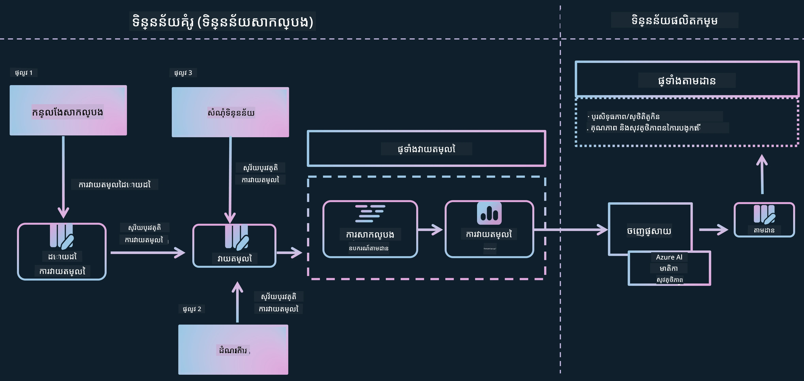

*ប្រភពរូបភាព: [Evaluation of generative AI applications](https://learn.microsoft.com/azure/ai-studio/concepts/evaluation-approach-gen-ai?wt.mc_id%3Dstudentamb_279723)*

> [!NOTE]
>
> សម្រាប់ព័ត៌មានលម្អិតបន្ថែម និងស្វែងយល់អំពីធនធានបន្ថែមទាក់ទងនឹង Phi-3 / Phi-3.5 សូមចូលទៅកាន់ [Phi-3CookBook](https://github.com/microsoft/Phi-3CookBook?wt.mc_id=studentamb_279723) ។

### លក្ខខណ្ឌមុនបំពេញ

- [Python](https://www.python.org/downloads)
- [ការជាវ Azure](https://azure.microsoft.com/free?wt.mc_id=studentamb_279723)
- [Visual Studio Code](https://code.visualstudio.com)
- ម៉ូដែល Phi-3 / Phi-3.5 ដែលបានតម្រង់រួចហើយ

### តារាងមាតិកា

1. [**ស្ថានភាពទី 1៖ ការណែនាំអំពីការប៉ាន់ប្រមាណ Prompt flow របស់ Microsoft Foundry**](#scenario-1-introduction-to-azure-ai-studios-prompt-flow-evaluation)

    - [ការណែនាំអំពីការប៉ាន់ប្រមាណសុវត្ថិភាព](#ការណែនាំអំពីការប៉ាន់ប្រមាណសុវត្ថិភាព)
    - [ការណែនាំអំពីការប៉ាន់ប្រមាណប្រសិទ្ធភាព](#ការណែនាំអំពីការប៉ាន់ប្រមាណប្រសិទ្ធភាព)

1. [**ស្ថានភាពទី 2៖ ការប៉ាន់ប្រមាណម៉ូដែល Phi-3 / Phi-3.5 នៅ Microsoft Foundry**](#scenario-2-evaluating-the-phi-3--phi-35-model-in-azure-ai-studio)

    - [មុនការចាប់ផ្តើម](#មុនការចាប់ផ្តើម)
    - [ចាក់បញ្ចូល Azure OpenAI ដើម្បីប៉ាន់ប្រមាណម៉ូដែល Phi-3 / Phi-3.5](#deploy-azure-openai-to-evaluate-the-phi-3--phi-35-model)
    - [ប៉ាន់ប្រមាណម៉ូដែល Phi-3 / Phi-3.5 ដែលបានតម្រង់ ដោយប្រើ Microsoft Foundry's Prompt flow evaluation](#evaluate-the-fine-tuned-phi-3--phi-35-model-using-azure-ai-studios-prompt-flow-evaluation)

1. [អបអរសាទរ!](#សូមអបអរសាទរ)

## **ស្ថានភាពទី 1៖ ការណែនាំអំពីការប៉ាន់ប្រមាណ Prompt flow របស់ Microsoft Foundry**

### ការណែនាំអំពីការប៉ាន់ប្រមាណសុវត្ថិភាព

ដើម្បីធានាថា ម៉ូដែល AI របស់អ្នកមានសុចរិត និងមានសុវត្ថិភាព វាអន្ដរជាអ្នកត្រូវតែប៉ាន់ប្រមាណវាប្រឆាំងនឹងកញ្ចប់ច្បាប់របស់ Microsoft ទាក់ទងនឹង AI ដែលមានទំនួលខុសត្រូវ។ នៅក្នុង Microsoft Foundry ការ​ប៉ាន់ប្រមាណសុវត្ថិភាពអនុញ្ញាតឱ្យអ្នកវាយតម្លៃភាពងាយរងការវាយប្រហារដើម្បីដោះសោ និងសមត្ថភាពដើម្បីបង្កើតមាតិកាដែលមានគ្រោះថ្នាក់ ដែលផ្គូរផ្គងជាមួយច្បាប់ទាំងនេះដោយផ្ទាល់។

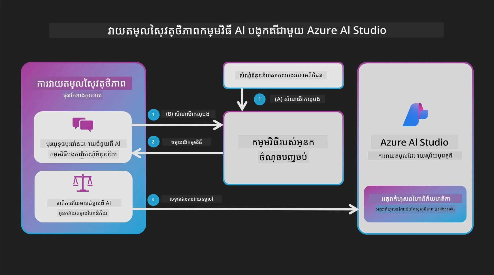

*ប្រភពរូបភាព: [Evaluation of generative AI applications](https://learn.microsoft.com/azure/ai-studio/concepts/evaluation-approach-gen-ai?wt.mc_id%3Dstudentamb_279723)*

#### ច្បាប់របស់ Microsoft សម្រាប់ AI មានទំនួលខុសត្រូវ

មុនចាប់ផ្តើមជំហានបច្ចេកទេស វាមានសារៈសំខាន់ក្នុងការយល់ដឹងអំពីច្បាប់របស់ Microsoft សម្រាប់ AI មានទំនួលខុសត្រូវ ដែលជាគំរូក្រុមតំណាងនៃទ្រឹស្ដីសុចរិតសម្រាប់ដឹកនាំការអភិវឌ្ឍ ការចាក់បញ្ចូល និងប្រតិបត្តិការរបស់ប្រព័ន្ធ AI។ ច្បាប់ទាំងនេះជាគន្លងនៃការរចនា អភិវឌ្ឍ និងចាក់បញ្ចូលប្រព័ន្ធ AI ដោយមានទំនួលខុសត្រូវ ដើម្បីធានាថា បច្ចេកវិទ្យា AI ត្រូវបានបង្កើតឡើងដោយយុត្តិធម៌ សេរីភាព និងរួមបញ្ចូលគ្នា។ ច្បាប់ទាំងនេះជាគ្រឹះសម្រាប់ការប៉ាន់ប្រមាណសុវត្ថិភាពនៃម៉ូដែល AI។

ច្បាប់របស់ Microsoft សម្រាប់ AI មានទំនួលខុសត្រូវរួមមាន៖

- **យុត្តិធម៌ និងរួមបញ្ចូលគ្នា**៖ ប្រព័ន្ធ AI គួរត្រូវចាត់ទុកមនុស្សគ្រប់គ្នាយ៉ាងយុត្តិធម៌ ហើយជៀសវាងការជំរះបាត់ដល់ក្រុមមនុស្សដែលមានស្ថានភាពដូចគ្នា តាមរបៀបខុសគ្នា។ ឧទាហរណ៍ នៅពេលប្រព័ន្ធ AI ផ្តល់ការណែនាំអំពីការព្យាបាលវេជ្ជសាស្រ្ត ការដាក់ពាក្យខ្ចីប្រាក់ ឬការជ្រើសរើសការងារ វាគួរផ្តល់អនុសាសន៍ដូចគ្នាជូនមនុស្សទាំងអស់ដែលមានរោគសញ្ញា ស្ថានភាពហិរញ្ញវត្ថុ ឬជំនាញវិជ្ជាជីវៈដូចគ្នា។

- **ភាពអាចទុកចិត្ត និងសុវត្ថិភាព**៖ ដើម្បីបង្កើតការជឿទុកចិត្ត ប្រព័ន្ធ AI ត្រូវដំណើរការយ៉ាងជឿជាក់ សុវត្ថិភាព និងមានភាពទៀងទាត់។ ប្រព័ន្ធទាំងនេះត្រូវអាចដំណើរការបានតាមរបៀបដែលបានរចនាដើម ចំលើយបានយ៉ាងសុវត្ថិភាពចំពោះលក្ខខណ្ឌមិនរំពឹងទុក ហើយប្រឆាំងនឹងការគ្រប់គ្រងអាក្រក់។ វិធីដែលពួកវាប្រតិបត្តិ និងលក្ខខណ្ឌផ្សេងៗដែលពួកវាអាចដំណើរការ បង្ហាញពីជួរនៃស្ថានភាព និងលក្ខខណ្ឌដែលអ្នកអភិវឌ្ឍបានរំពឹងទុកនៅពេលរចនា និងសាកល្បង។

- **ភាពច្បាស់លាស់**៖ នៅពេលប្រព័ន្ធ AI ជួយជ្រើសរើសសេចក្ដីសំរេចដែលមានផលប៉ះពាល់យ៉ាងច្រើនទៅលើជីវិតមនុស្ស វាមានសារៈសំខាន់ណាស់ដែលមនុស្សត្រូវយល់ថា តើសេចក្ដីសំរេចទាំងនោះត្រូវបានទម្លាក់ដោយវិធីណា។ ឧទាហរណ៍ ធនាគារអាចប្រើប្រព័ន្ធ AI ដើម្បីសំរេចថាមនុស្សម្នាក់មានសមត្ថភាពបង់បំណុលឬអត់។ ក្រុមហ៊ុនអាចប្រើប្រព័ន្ធ AI ដើម្បីកំណត់អ្នកបេក្ខភាពដែលមានគុណភាពខ្ពស់បំផុតសម្រាប់ការជ្រើសរើសចូលការងារ។

- **ភាពឯកជន និងសុវត្ថិភាព**៖ នៅពេល AI កាន់តែមានភាពពេញនិយម ការការពារភាពឯកជន និងការពារ​ព័ត៌មានផ្ទាល់ខ្លួននិងពាណិជ្ជកម្មកំពុងក្លាយទៅជារឿងស្មុគស្មាញ និងមានសារៈសំខាន់បំផុត។ ជាមួយ AI ការពារភាពឯកជន និងសុវត្ថិភាពទិន្នន័យយល់ដឹងកាន់តែជាប់ពាក់ព័ន្ធខ្លាំង ពីព្រោះការចូលដំណើរការទិន្នន័យគឺមានសារៈសំខាន់សម្រាប់ប្រព័ន្ធ AI ក្នុងការបង្កើតការព្យាករណ៍ត្រឹមត្រូវ និងមានព័ត៌មានលម្អិតអំពីមនុស្ស។

- **ទន្ទេញខុសត្រូវ**៖ មនុស្សដែលរចនា និងចាក់ទូទៅប្រព័ន្ធ AI ត្រូវតែទទួលខុសត្រូវចំពោះរបៀបប្រតិបត្តិការរបស់ប្រព័ន្ធរបស់ពួកគេ។ អង្គការត្រូវប្រើស្តង់ដារផលិតកម្មដើម្បីអភិវឌ្ឍន៍នីតិវិធីនៃការទន្ទេញខុសត្រូវ។ នីតិវិធីទាំងនេះអាចធានាបានថាប្រព័ន្ធ AI មិនមែនជាអធិបតីចុងក្រោយលើសេចក្តីសំរេចណាដែលមានផលប៉ះពាល់លើជីវិតមនុស្សនោះទេ។ ពួកវាក៏អាចធានាបានថាមនុស្សនៅតែរក្សាការត្រួតពិនិត្យមានន័យល្អលើប្រព័ន្ធ AI ដែលមានភាពឯករាជ្យខ្ពស់យ៉ាងខ្លាំង។

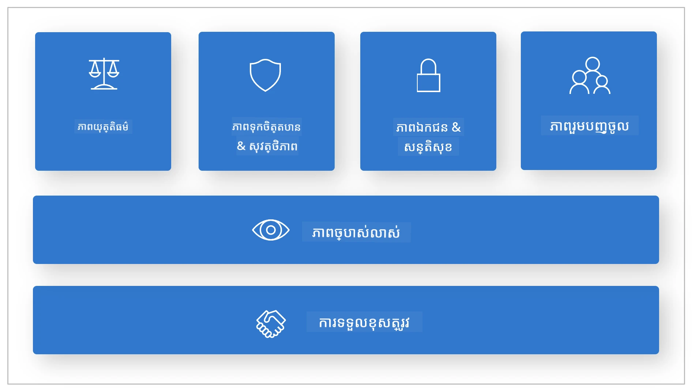

*ប្រភពរូបភាព៖ [What is Responsible AI?](https://learn.microsoft.com/azure/machine-learning/concept-responsible-ai?view=azureml-api-2&viewFallbackFrom=azureml-api-2%253fwt.mc_id%3Dstudentamb_279723)*

> [!NOTE]
> សម្រាប់រៀនបន្ថែមអំពីច្បាប់របស់ Microsoft សម្រាប់ AI មានទំនួលខុសត្រូវ សូមចូលទៅកាន់ [What is Responsible AI?](https://learn.microsoft.com/azure/machine-learning/concept-responsible-ai?view=azureml-api-2?wt.mc_id=studentamb_279723) ។

#### ម៉ែត្រសុវត្ថិភាព

ក្នុងមេរៀននេះ អ្នកនឹងប៉ាន់ប្រមាណសុវត្ថិភាពរបស់ម៉ូដែល Phi-3 ដែលបានតម្រង់ ដោយប្រើម៉ែត្រសុវត្ថិភាពរបស់ Microsoft Foundry។ ម៉ែត្រទាំងនេះជួយអ្នកវាយតម្លៃសមត្ថភាពម៉ូដែលក្នុងការបង្កើតមាតិការដែលមានគ្រោះថ្នាក់ និងភាពងាយរងការវាយប្រហារដើម្បីដោះសោ។ ម៉ែត្រសុវត្ថិភាពរួមមាន៖

- **មាតិកាដែលពាក់ព័ន្ធនឹងការខូចខាតខ្លួនឯង**៖ ប៉ាន់ប្រមាណថាតើម៉ូដែលមានទំនោរបង្កើតមាតិកាដែលពាក់ព័ន្ធនឹងការខូចខាតខ្លួនឯងឬទេ។
- **មាតិការៀបចំមិនសមរម្យ និងមិនយុត្តិធម៌**៖ ប៉ាន់ប្រមាណថាតើម៉ូដែលមានទំនោរបង្កើតមាតិកាដដែលមានការខុសទម្លាប់ ឬមិនយុត្តិធម៌ឬទេ។
- **មាតិកាផ្ទៃកម្លាំង**៖ ប៉ាន់ប្រមាណថាតើម៉ូដែលមានទំនោរបង្កើតមាតិកាផ្ទៃកម្លាំងឬទេ។
- **មាតិកាផ្ទៃភេទ**៖ ប៉ាន់ប្រមាណថាតើម៉ូដែលមានទំនោរបង្កើតមាតិកាភេទ ដែលមិនសមរម្យ ឬ រំខានឬទេ។

ការប៉ាន់ប្រមាណបែបនេះធានាថាម៉ូដែល AI មិនបង្កើតមាតិកាដែលគ្រោះថ្នាក់ ឬអាក្រក់ ឬមិនល្អក្នុងទម្រាំតាមតម្លៃសង្គម និងវិធានការគ្រប់គ្រង។

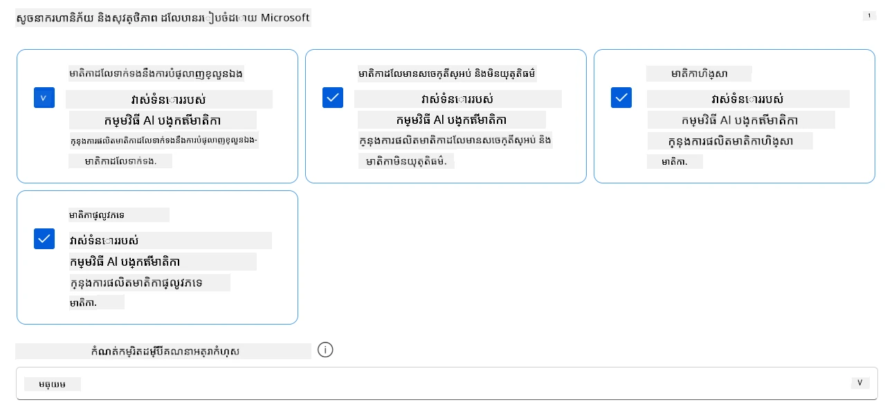

### ការណែនាំអំពីការប៉ាន់ប្រមាណប្រសិទ្ធភាព

ដើម្បីធានាថាម៉ូដែល AI របស់អ្នកដំណើរការតាមការរំពឹងទុក វាមានសារៈសំខាន់ក្នុងការប៉ាន់ប្រមាណប្រសិទ្ធភាពរបស់វាពីមេត្រប្រសិទ្ធភាព។ នៅក្នុង Microsoft Foundry ការប៉ាន់ប្រមាណប្រសិទ្ធភាពអនុញ្ញាតឲ្យអ្នកវាយតម្លៃប្រសិទ្ធភាពនៃម៉ូដែលក្នុងការបង្កើតចម្លើយត្រឹមត្រូវ សមនឹងបរិបទ និងមានភាពរលូន។

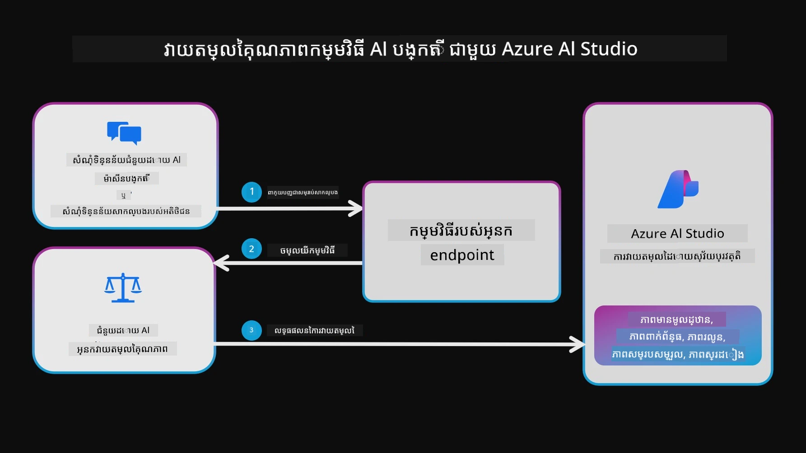

*ប្រភពរូបភាព: [Evaluation of generative AI applications](https://learn.microsoft.com/azure/ai-studio/concepts/evaluation-approach-gen-ai?wt.mc_id%3Dstudentamb_279723)*

#### ម៉ែត្រប្រសិទ្ធភាព

ក្នុងមេរៀននេះ អ្នកនឹងប៉ាន់ប្រមាណប្រសិទ្ធភាពរបស់ម៉ូដែល Phi-3 / Phi-3.5 ដែលបានតម្រង់ ដោយប្រើម៉ែត្រប្រសិទ្ធភាពរបស់ Microsoft Foundry។ ម៉ែត្រទាំងនេះជួយវាយតម្លៃសមត្ថភាពម៉ូដែលក្នុងការបង្កើតចម្លើយត្រឹមត្រូវ សមនឹងបរិបទ និងមានភាពរលូន។ ម៉ែត្រប្រសិទ្ធភាពរួមមាន៖

- **ភាពមានមូលដ្ឋាន (Groundedness)**៖ ប៉ាន់ប្រមាណថាតើចម្លើយបង្កើតឡើងមានការច្របាច់ជាមួយព័ត៌មានពីប្រភពទិន្នន័យដើមយ៉ាងដូចម្តេច។
- **ភាពពាក់ព័ន្ធ (Relevance)**៖ ប៉ាន់ប្រមាណភាពសមរម្យនៃចម្លើយទាក់ទងនឹងសំនួរដែលបានស្នើ។
- **ភាពរលូន (Coherence)**៖ ប៉ាន់ប្រមាណថាតើអត្ថបទបង្កើតឡើងរលូន យល់បានស្រួល ហើយស្រដៀងភាសាមនុស្សយ៉ាងដូចម្តេច។
- **ភាពហូរហែល (Fluency)**៖ ប៉ាន់ប្រមាណជំនាញភាសានៃអត្ថបទបង្កើតឡើង។
- **ភាពដូច GPT (GPT Similarity)**៖ ប្រៀបធៀបចម្លើយដែលបង្កើតជាមួយតម្លៃិតមួយដូចគ្នាឬទេ។
- **ពិន្ទុ F1 (F1 Score)**៖ គណនាអនុপাতនៃពាក្យដែលចែករំលែករវាងចម្លើយដែលបង្កើត និងទិន្នន័យប្រភព។

ម៉ែត្រទាំងនេះជួយអ្នកវាយតម្លៃប្រសិទ្ធភាពនៃម៉ូដែលក្នុងការបង្កើតចម្លើយត្រឹមត្រូវ សមនឹងបរិបទ និងមានភាពរលូន។

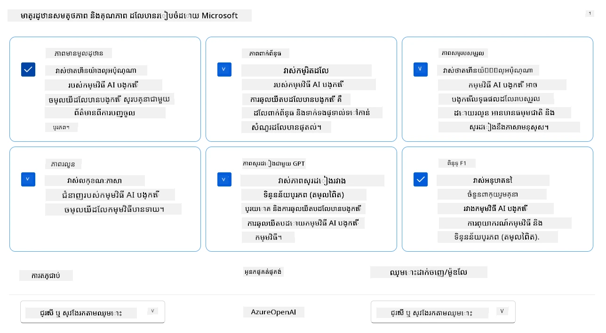

## **ស្ថានភាពទី 2៖ ការប៉ាន់ប្រមាណម៉ូដែល Phi-3 / Phi-3.5 នៅ Microsoft Foundry**

### មុនការចាប់ផ្តើម

មេរៀននេះជាផ្នែកបន្តនៃប្លុកបណ្តោះអាសន្នមុននេះ "[Fine-Tune and Integrate Custom Phi-3 Models with Prompt Flow: Step-by-Step Guide](https://techcommunity.microsoft.com/t5/educator-developer-blog/fine-tune-and-integrate-custom-phi-3-models-with-prompt-flow/ba-p/4178612?wt.mc_id=studentamb_279723)" និង "[Fine-Tune and Integrate Custom Phi-3 Models with Prompt Flow in Microsoft Foundry](https://techcommunity.microsoft.com/t5/educator-developer-blog/fine-tune-and-integrate-custom-phi-3-models-with-prompt-flow-in/ba-p/4191726?wt.mc_id=studentamb_279723)"។ ក្នុងអត្ថបទទាំងនេះ យើងបានបន្តដំណើរជាមួយការតម្រង់ម៉ូដែល Phi-3 / Phi-3.5 នៅ Microsoft Foundry និងបញ្ចូលវាជាមួយ Prompt flow។

ក្នុងមេរៀននេះ អ្នកនឹងចាក់បញ្ចូលម៉ូដែល Azure OpenAI ជាអ្នកប៉ាន់ប្រមាណនៅ Microsoft Foundry ហើយប្រើវាដើម្បីប៉ាន់ប្រមាណម៉ូដែល Phi-3 / Phi-3.5 ដែលបានតម្រង់រួច។

មុនចាប់ផ្តើមមេរៀននេះ សូមប្រាកដថាអ្នកមានលក្ខខណ្ឌស្រាប់ដូចខាងក្រោម ដែលបានពិពណ៌នានៅក្នុងមេរៀនមុនៗ៖

1. ទិន្នន័យដែលបានរៀបចំសម្រាប់ប៉ាន់ប្រមាណម៉ូដែល Phi-3 / Phi-3.5 ដែលបានតម្រង់។
1. ម៉ូដែល Phi-3 / Phi-3.5 ដែលបានតម្រង់ និងបានចាក់ទៅក្នុង Azure Machine Learning។
1. Prompt flow ដែលបានបញ្ចូលជាមួយម៉ូដែល Phi-3 / Phi-3.5 ដែលបានតម្រង់របស់អ្នកនៅ Microsoft Foundry។

> [!NOTE]
> អ្នកនឹងប្រើឯកសារ *test_data.jsonl* ដែលស្ថិតនៅក្នុងថតទិន្នន័យពីគម្រោង **ULTRACHAT_200k** ដែលបានទាញយកក្នុងប្លុកបណ្តោះអាសន្នមុនៗ ជាទិន្នន័យសម្រាប់ប៉ាន់ប្រមាណម៉ូដែល Phi-3 / Phi-3.5 ដែលបានតម្រង់។

#### បញ្ចូលម៉ូដែល Phi-3 / Phi-3.5 ប្ដូរតាមបំណងជាមួយ Prompt flow នៅ Microsoft Foundry (វិធីសាស្រ្តកូដជាមុន)

> [!NOTE]
> ប្រសិនបើអ្នកបានអនុវត្តវិធីសាស្រ្តក្រោមកូដដែលបានពិពណ៌នានៅក្នុង "[Fine-Tune and Integrate Custom Phi-3 Models with Prompt Flow in Microsoft Foundry](https://techcommunity.microsoft.com/t5/educator-developer-blog/fine-tune-and-integrate-custom-phi-3-models-with-prompt-flow-in/ba-p/4191726?wt.mc_id=studentamb_279723)" អ្នកអាចរំពេចការហាត់នេះ ហើយបន្តទៅហាត់ខាងក្រោមបាន។
> ទោះជាយ៉ាងណា ប្រសិនបើអ្នកបានអនុវត្តវិធីសាស្រ្តកូដជាមុនដែលបានពិពណ៌នានៅក្នុង "[Fine-Tune and Integrate Custom Phi-3 Models with Prompt Flow: Step-by-Step Guide](https://techcommunity.microsoft.com/t5/educator-developer-blog/fine-tune-and-integrate-custom-phi-3-models-with-prompt-flow/ba-p/4178612?wt.mc_id=studentamb_279723)" ដើម្បីតម្រង់និងចាក់សរសេរម៉ូដែល Phi-3 / Phi-3.5 របស់អ្នក ផ្លូវការភ្ជាប់ម៉ូដែលចូល Prompt flow អាចខុសគ្នាបន្តិច។ អ្នកនឹងរៀនដំណើរការនេះនៅក្នុងហាត់នេះ។

ដើម្បីបន្ត អ្នកត្រូវភ្ជាប់ម៉ូដែល Phi-3 / Phi-3.5 ដែលបានតម្រង់របស់អ្នកចូល Prompt flow នៅ Microsoft Foundry។

#### បង្កើត Microsoft Foundry Hub

អ្នកត្រូវបង្កើត Hub មួយមុនពេលបង្កើត Project។ Hub មានតួនាទីដូច Resource Group ដែលអនុញ្ញាតឱ្យអ្នករៀបចំ និងគ្រប់គ្រង Project ច្រើននៅ Microsoft Foundry។
1. ចូលទៅកាន់ [Microsoft Foundry](https://ai.azure.com/?wt.mc_id=studentamb_279723)។

1. ជ្រើសរើស **All hubs** ពីផ្នែកផ្នែកខាងឆ្វេង។

1. ជ្រើសរើស **+ New hub** ពីម៉ឺនុយតម្រងនាវីគេន។

    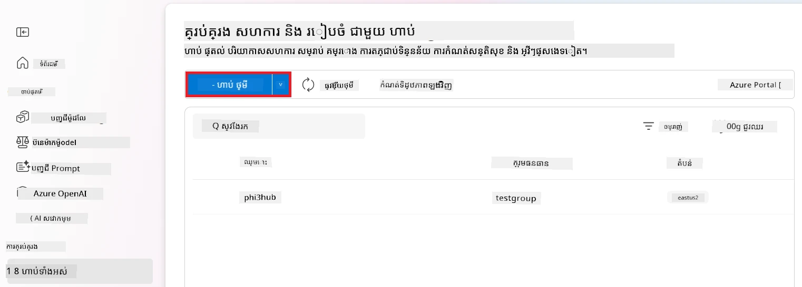

1. ប្រារព្ធការងារដូចខាងក្រោម៖

    - បញ្ចូល **Hub name**។ វាត្រូវតែជាតម្លៃឯកសិទ្ធិមួយ។
    - ជ្រើសរើស Azure **Subscription** របស់អ្នក។
    - ជ្រើសរើស **Resource group** ដែលត្រូវប្រើ (បង្កើតថ្មីបើជាគំរូ)។
    - ជ្រើសរើស **Location** ដែលអ្នកចង់ប្រើ។
    - ជ្រើសរើស **Connect Azure AI Services** ដែលត្រូវប្រើ (បង្កើតថ្មីបើជាគំរូ)។
    - ជ្រើសរើស **Connect Azure AI Search** ទៅ **Skip connecting**។

    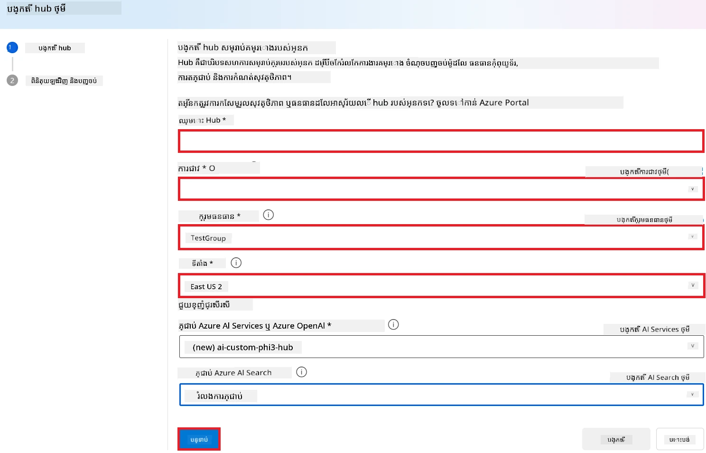

1. ជ្រើសរើស **Next**។

#### បង្កើតគម្រោង Microsoft Foundry

1. នៅក្នុង Hub ដែលអ្នកបានបង្កើត ជ្រើសរើស **All projects** ពីផ្នែកផ្នែកខាងឆ្វេង។

1. ជ្រើសរើស **+ New project** ពីម៉ឺនុយតម្រងនាវីគេន។

    

1. បញ្ចូល **Project name**។ វាត្រូវតែជាតម្លៃឯកសិទ្ធិមួយ។

    

1. ជ្រើសរើស **Create a project**។

#### បន្ថែមការតភ្ជាប់ផ្ទាល់ខ្លួនសម្រាប់ម៉ូដែល Phi-3 / Phi-3.5 ដែលបានកែតម្រូវ

ដើម្បីបញ្ចូលម៉ូដែល Phi-3 / Phi-3.5 ផ្ទាល់ខ្លួនរបស់អ្នកជាមួយ Prompt flow អ្នកត្រូវតែរក្សាទុកចំណុចបញ្ចប់និងកូនសោរបស់ម៉ូដែលនៅក្នុងការតភ្ជាប់ផ្ទាល់ខ្លួន។ ការកំណត់នេះធានាការចូលប្រើម៉ូដែល Phi-3 / Phi-3.5 ផ្ទាល់ខ្លួននៅក្នុង Prompt flow។

#### កំណត់ api key និង endpoint uri របស់ម៉ូដែល Phi-3 / Phi-3.5 ដែលបានកែតម្រូវ

1. ចូលទៅកាន់ [Azure ML Studio](https://ml.azure.com/home?wt.mc_id=studentamb_279723)។

1. ទៅកាន់បរិវេណសិក្សាផ្នែក Azure Machine learning ដែលអ្នកបានបង្កើត។

1. ជ្រើសរើស **Endpoints** ពីផ្នែកផ្នែកខាងឆ្វេង។

    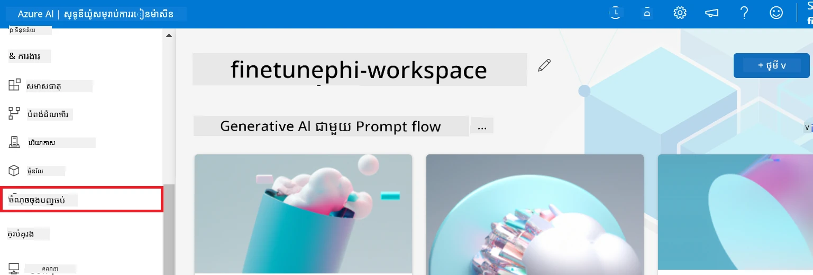

1. ជ្រើសរើសចំណុចបញ្ចប់ដែលបានបង្កើត។

    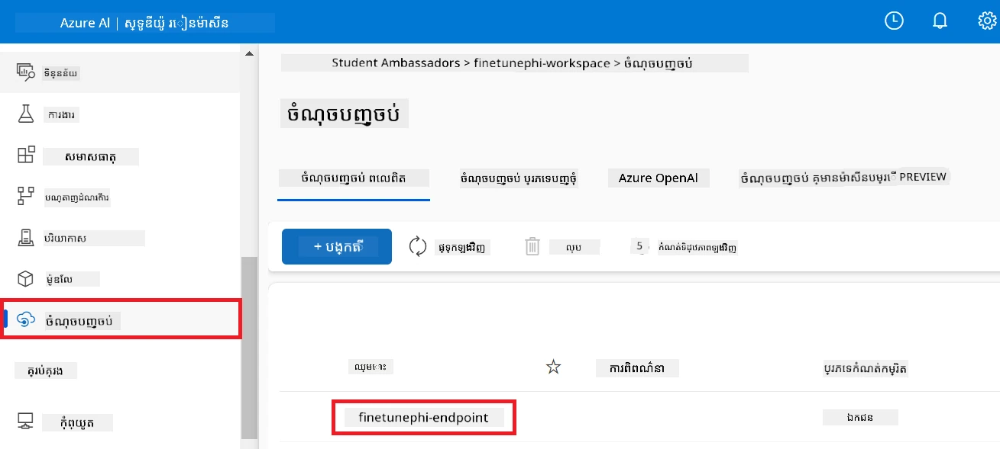

1. ជ្រើសរើស **Consume** ពីម៉ឺនុយតម្រងនាវីគេន។

1. ចម្លង **REST endpoint** និង **Primary key** របស់អ្នក។

    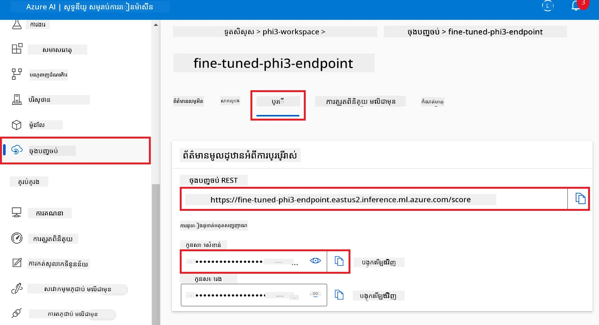

#### បន្ថែមការតភ្ជាប់ផ្ទាល់ខ្លួន

1. ចូលទៅកាន់ [Microsoft Foundry](https://ai.azure.com/?wt.mc_id=studentamb_279723)។

1. ទៅកាន់គម្រោង Microsoft Foundry ដែលអ្នកបានបង្កើត។

1. នៅក្នុងគម្រោងដែលអ្នកបានបង្កើត ជ្រើសរើស **Settings** ពីផ្នែកផ្នែកខាងឆ្វេង។

1. ជ្រើសរើស **+ New connection**។

    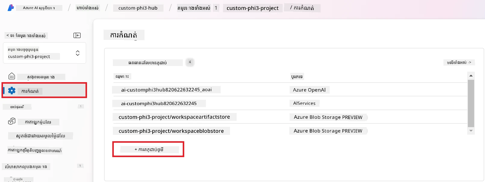

1. ជ្រើសរើស **Custom keys** ពីម៉ឺនុយតម្រងនាវីគេន។

    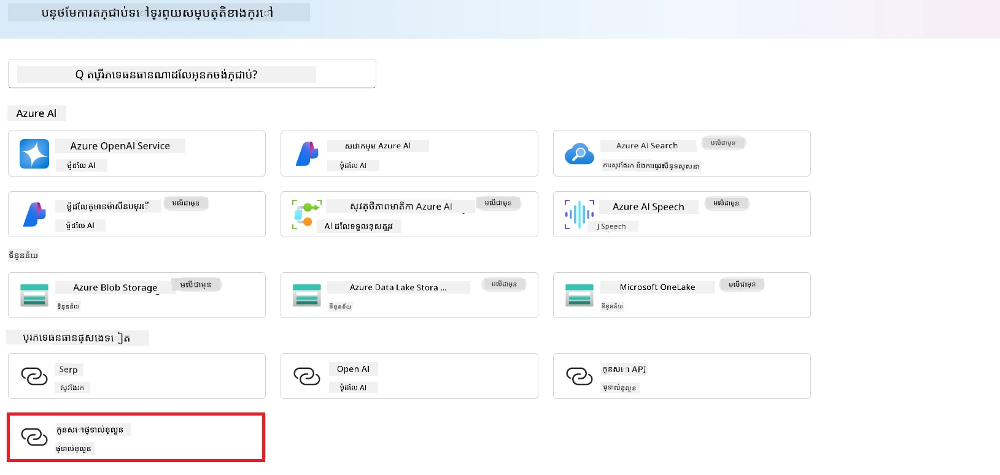

1. ប្រារព្ធការងារដូចខាងក្រោម៖

    - ជ្រើសរើស **+ Add key value pairs**។
    - សម្រាប់ឈ្មោះគាត់ បញ្ចូល **endpoint** ហើយបិទចម្លងចំណុចបញ្ចប់ដែលបានចម្លងពី Azure ML Studio ចូលក្នុងប្រអប់តម្លៃ។
    - ជ្រើសរើស **+ Add key value pairs** វិញ។
    - សម្រាប់ឈ្មោះគាត់ បញ្ចូល **key** ហើយបិទចម្លងកូនសោដែលបានចម្លងពី Azure ML Studio ចូលក្នុងប្រអប់តម្លៃ។
    - បន្ទាប់ពីបន្ថែមធាតុគាត់រួច ជ្រើសរើស **is secret** ដើម្បីការពារកូនសោពីការបង្ហាញ។

    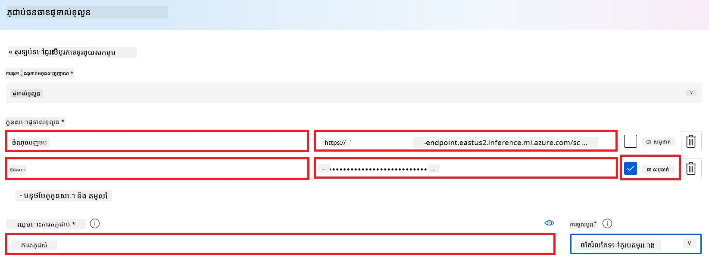

1. ជ្រើសរើស **Add connection**។

#### បង្កើត Prompt flow

អ្នកបានបន្ថែមការតភ្ជាប់ផ្ទាល់ខ្លួននៅ Microsoft Foundry ហើយ។ ឥឡូវនេះ យើងមកបង្កើត Prompt flow ដោយប្រើជំហានដូចខាងក្រោម។ បន្ទាប់មក អ្នកនឹងភ្ជាប់ Prompt flow នេះទៅការតភ្ជាប់ផ្ទាល់ខ្លួន ដើម្បីប្រើម៉ូដែលដែលបានកែតម្រូវក្នុង Prompt flow។

1. ទៅកាន់គម្រោង Microsoft Foundry ដែលអ្នកបានបង្កើត។

1. ជ្រើសរើស **Prompt flow** ពីផ្នែកផ្នែកខាងឆ្វេង។

1. ជ្រើសរើស **+ Create** ពីម៉ឺនុយតម្រងនាវីគេន។

    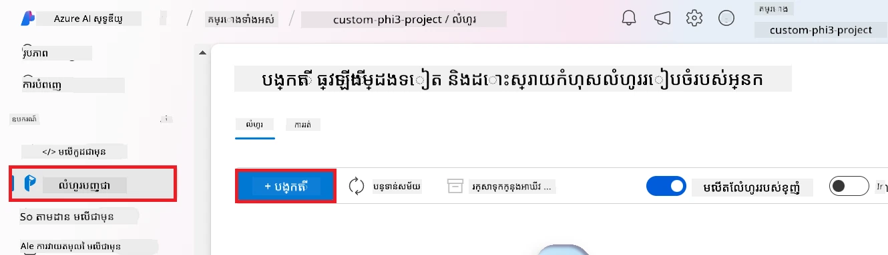

1. ជ្រើសរើស **Chat flow** ពីម៉ឺនុយតម្រងនាវីគេន។

    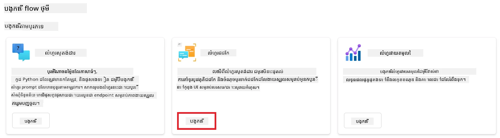

1. បញ្ចូល **Folder name** ដើម្បីប្រើ។

    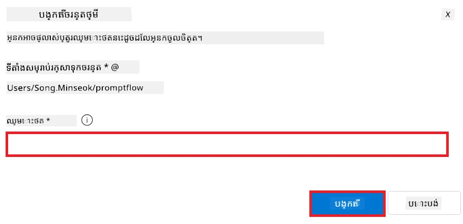

1. ជ្រើសរើស **Create**។

#### កំណត់ Prompt flow ដើម្បីផ្ញើសារជាមួយម៉ូដែល Phi-3 / Phi-3.5 ផ្ទាល់ខ្លួនរបស់អ្នក

អ្នកត្រូវបញ្ចូលម៉ូដែល Phi-3 / Phi-3.5 ដែលបានកែតម្រូវទៅក្នុង Prompt flow។ ទោះយ៉ាងណា Prompt flow ដែលមានស្រាប់មិនបានរចនាឡើងសម្រាប់គោលបំណងនេះឡើយ។ ដូចនេះ អ្នកត្រូវតែនំាង Prompt flow ដើម្បីអនុញ្ញាតឱ្យបញ្ចូលម៉ូដែលផ្ទាល់ខ្លួន។

1. នៅក្នុង Prompt flow សូមបញ្ចូលការងារដូចខាងក្រោមដើម្បីកែលម្អន់ផ្លូវដែលមានស្រាប់៖

    - ជ្រើសរើស **Raw file mode**។
    - លុបកូដដែលមានស្រាប់ទាំងអស់នៅក្នុងឯកសារ *flow.dag.yml*។
    - បន្ថែមកូដខាងក្រោមទៅ *flow.dag.yml*។

        ```yml
        inputs:
          input_data:
            type: string
            default: "Who founded Microsoft?"

        outputs:
          answer:
            type: string
            reference: ${integrate_with_promptflow.output}

        nodes:
        - name: integrate_with_promptflow
          type: python
          source:
            type: code
            path: integrate_with_promptflow.py
          inputs:
            input_data: ${inputs.input_data}
        ```

    - ជ្រើសរើស **Save**។

    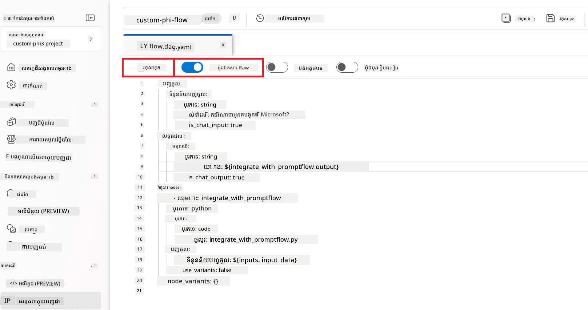

1. បន្ថែមកូដខាងក្រោមទៅ *integrate_with_promptflow.py* ដើម្បីប្រើម៉ូដែល Phi-3 / Phi-3.5 ផ្ទាល់ខ្លួននៅក្នុង Prompt flow។

    ```python
    import logging
    import requests
    from promptflow import tool
    from promptflow.connections import CustomConnection

    # ការរៀបចំការចុះបញ្ជី
    logging.basicConfig(
        format="%(asctime)s - %(levelname)s - %(name)s - %(message)s",
        datefmt="%Y-%m-%d %H:%M:%S",
        level=logging.DEBUG
    )
    logger = logging.getLogger(__name__)

    def query_phi3_model(input_data: str, connection: CustomConnection) -> str:
        """
        Send a request to the Phi-3 / Phi-3.5 model endpoint with the given input data using Custom Connection.
        """

        # "connection" ជាឈ្មោះនៃការតភ្ជាប់ផ្ទាល់ខ្លួន, "endpoint", "key" គឺជាគន្លឹះនៅក្នុងការតភ្ជាប់ផ្ទាល់ខ្លួន
        endpoint_url = connection.endpoint
        api_key = connection.key

        headers = {
            "Content-Type": "application/json",
            "Authorization": f"Bearer {api_key}"
        }
    data = {
        "input_data": [input_data],
        "params": {
            "temperature": 0.7,
            "max_new_tokens": 128,
            "do_sample": True,
            "return_full_text": True
            }
        }
        try:
            response = requests.post(endpoint_url, json=data, headers=headers)
            response.raise_for_status()
            
            # ចុះបញ្ជីពេញលេញនៃការឆ្លើយតប JSON
            logger.debug(f"Full JSON response: {response.json()}")

            result = response.json()["output"]
            logger.info("Successfully received response from Azure ML Endpoint.")
            return result
        except requests.exceptions.RequestException as e:
            logger.error(f"Error querying Azure ML Endpoint: {e}")
            raise

    @tool
    def my_python_tool(input_data: str, connection: CustomConnection) -> str:
        """
        Tool function to process input data and query the Phi-3 / Phi-3.5 model.
        """
        return query_phi3_model(input_data, connection)

    ```

    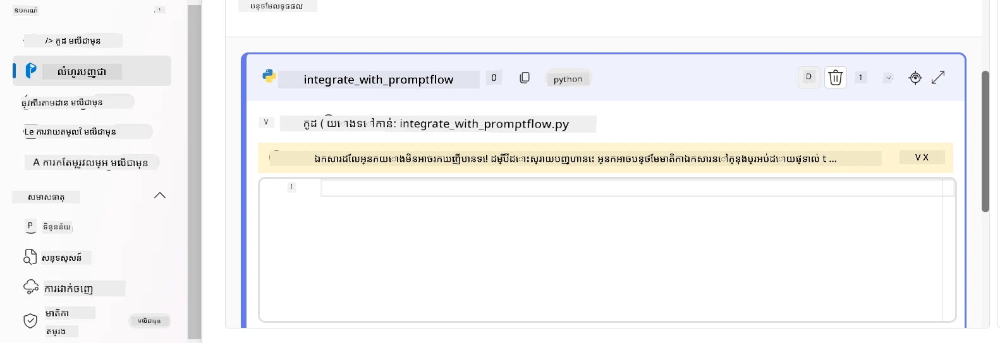

> [!NOTE]
> សម្រាប់ព័ត៌មានលម្អិតបន្ថែមអំពីការប្រើ Prompt flow នៅ Microsoft Foundry អ្នកអាចយោងទៅកាន់ [Prompt flow in Microsoft Foundry](https://learn.microsoft.com/azure/ai-studio/how-to/prompt-flow)។

1. ជ្រើសរើស **Chat input**, **Chat output** ដើម្បីបើកការជជែកជាមួយម៉ូដែលរបស់អ្នក។

    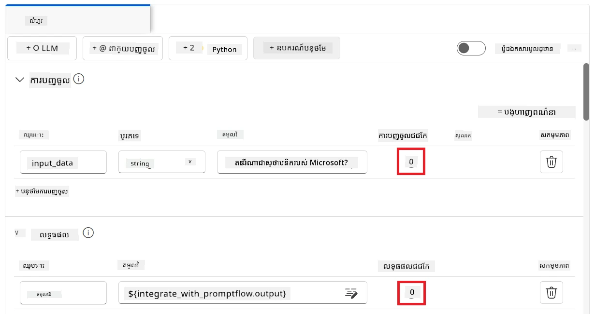

1. ឥឡូវអ្នកបានរួចរាល់ក្នុងការជជែកជាមួយម៉ូដែល Phi-3 / Phi-3.5 ផ្ទាល់ខ្លួនរបស់អ្នក។ នៅក្នុងលំហាត់បន្ទាប់ អ្នកនឹងរៀនពីវិធីចាប់ផ្តើម Prompt flow និងប្រើវាដើម្បីជជែកជាមួយម៉ូដែល Phi-3 / Phi-3.5 ដែលបានកែតម្រូវ។

> [!NOTE]
>
> ផ្លូវដែលបានកំណើតឡើងใหមគួរតែមានរូបរាងដូចរូបភាពខាងក្រោម៖
>
> 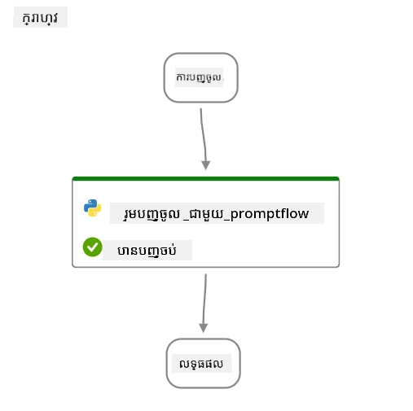
>

#### ចាប់ផ្តើម Prompt flow

1. ជ្រើសរើស **Start compute sessions** ដើម្បីចាប់ផ្តើម Prompt flow។

    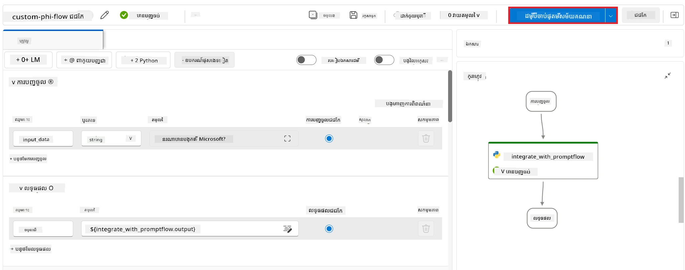

1. ជ្រើសរើស **Validate and parse input** ដើម្បីធ្វើបច្ចុប្បន្នភាពប៉ារ៉ាម៉ែត្រ។

    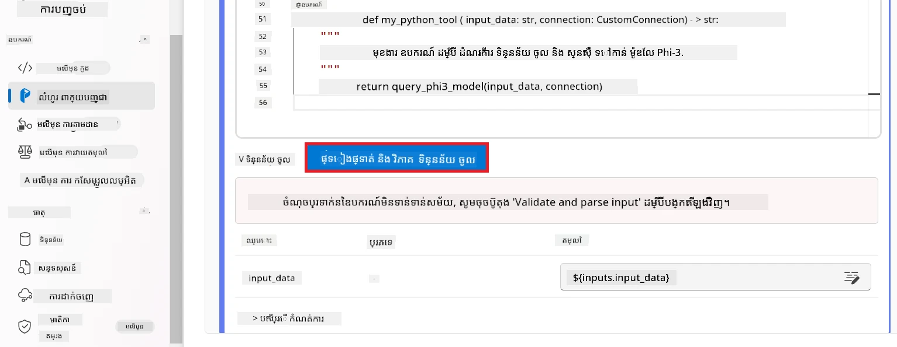

1. ជ្រើសរើស **Value** នៃ **connection** ទៅកាន់ការតភ្ជាប់ផ្ទាល់ខ្លួនដែលអ្នកបានបង្កើត។ ឧទាហរណ៍ *connection*។

    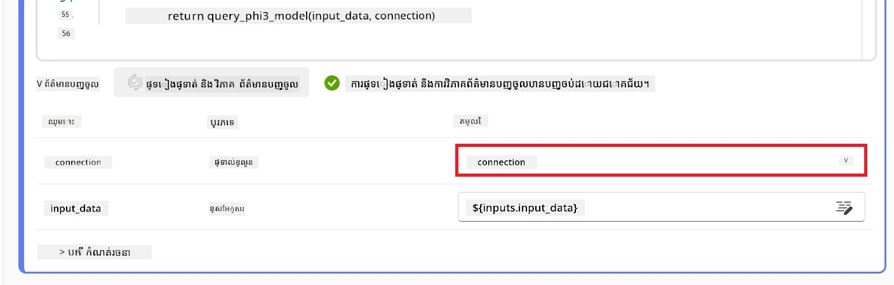

#### ជជែកជាមួយម៉ូដែល Phi-3 / Phi-3.5 ផ្ទាល់ខ្លួនរបស់អ្នក

1. ជ្រើសរើស **Chat**។

    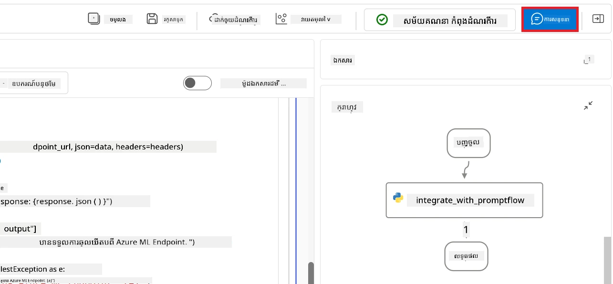

1. សូមមើលឧទាហរណ៍លទ្ធផល៖ ឥឡូវនេះ អ្នកអាចជជែកជាមួយម៉ូដែល Phi-3 / Phi-3.5 ផ្ទាល់ខ្លួនរបស់អ្នកបាន។ ផ្តល់អនុសាសន៍ឲ្យសួរពីសំណួរដែលផ្អែកលើទិន្នន័យដែលប្រើសម្រាប់ការកែលម្អ។

    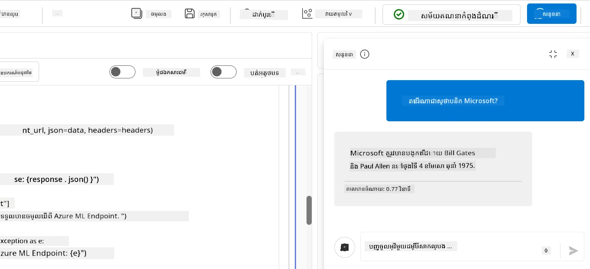

### ចែកចាយ Azure OpenAI ដើម្បីវាយតម្លៃម៉ូដែល Phi-3 / Phi-3.5

ដើម្បីវាយតម្លៃម៉ូដែល Phi-3 / Phi-3.5 នៅក្នុង Microsoft Foundry អ្នកត្រូវចែកចាយម៉ូដែល Azure OpenAI មួយ។ ម៉ូដែលនេះនឹងត្រូវប្រើសម្រាប់វាយតម្លៃសមត្ថភាពម៉ូដែល Phi-3 / Phi-3.5។

#### ចែកចាយ Azure OpenAI

1. ចូលទៅកាន់ [Microsoft Foundry](https://ai.azure.com/?wt.mc_id=studentamb_279723)។

1. ទៅកាន់គម្រោង Microsoft Foundry ដែលអ្នកបានបង្កើត។

    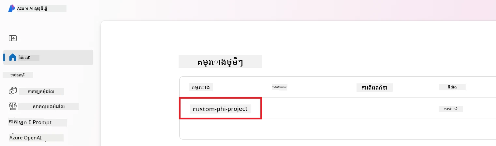

1. នៅក្នុងគម្រោងដែលអ្នកបានបង្កើត ជ្រើសរើស **Deployments** ពីផ្នែកផ្នែកខាងឆ្វេង។

1. ជ្រើសរើស **+ Deploy model** ពីម៉ឺនុយតម្រងនាវីគេន។

1. ជ្រើសរើស **Deploy base model**។

    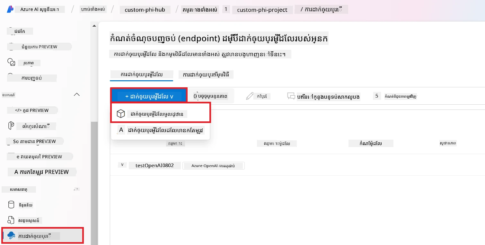

1. ជ្រើសរើសម៉ូដែល Azure OpenAI ដែលអ្នកចង់ប្រើ។ ឧទាហរណ៍ **gpt-4o**។

    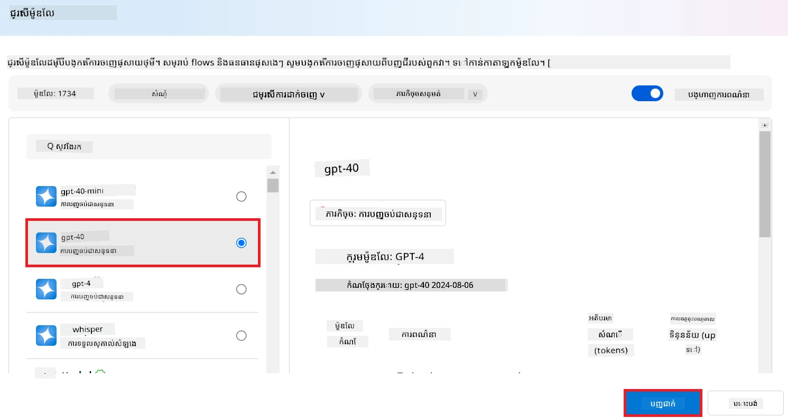

1. ជ្រើសរើស **Confirm**។

### វាយតម្លៃម៉ូដែល Phi-3 / Phi-3.5 ដែលបានកែតម្រូវដោយប្រើ Prompt flow evaluation របស់ Microsoft Foundry

### ចាប់ផ្តើមការវាយតម្លៃថ្មី

1. ចូលទៅកាន់ [Microsoft Foundry](https://ai.azure.com/?wt.mc_id=studentamb_279723)។

1. ទៅកាន់គម្រោង Microsoft Foundry ដែលអ្នកបានបង្កើត។

    

1. នៅក្នុងគម្រោងដែលបានបង្កើត ជ្រើសរើស **Evaluation** ពីផ្នែកផ្នែកខាងឆ្វេង។

1. ជ្រើសរើស **+ New evaluation** ពីម៉ឺនុយតម្រងនាវីគេន។

    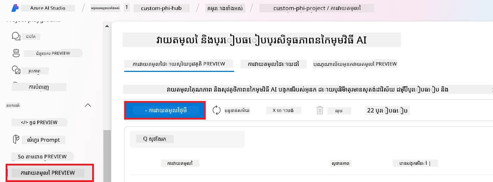

1. ជ្រើសរើសការវាយតម្លៃ **Prompt flow**។

    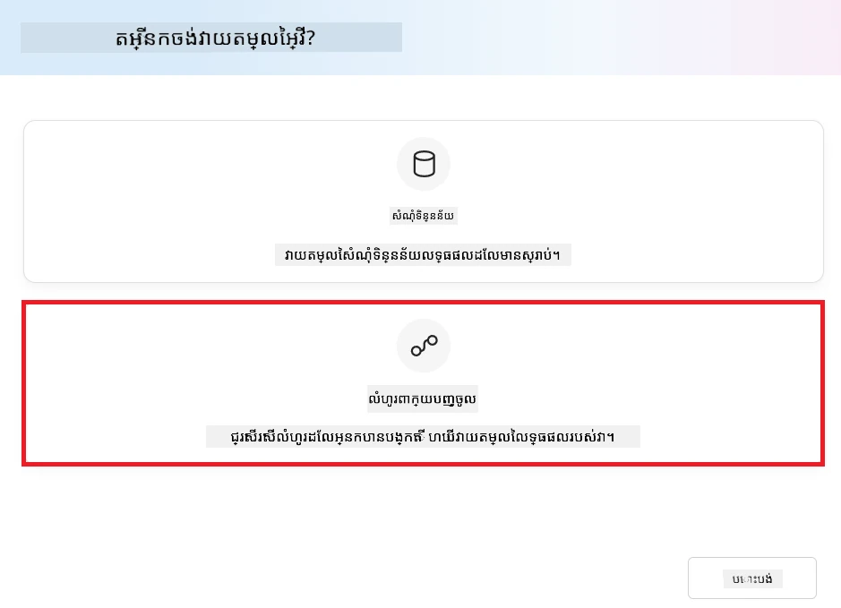

1. ប្រារព្ធការងារដូចខាងក្រោម៖

    - បញ្ចូលឈ្មោះការវាយតម្លៃ។ វាត្រូវតែជាតម្លៃឯកសិទ្ធិមួយ។
    - ជ្រើសរើស **Question and answer without context** ជាប្រភេទភារកិច្ច។ ដោយសារតែទិន្នន័យ **UlTRACHAT_200k** ដែលប្រើនៅមេរៀននេះមិនមានបរិបទទេ។
    - ជ្រើសរើស prompt flow ដែលអ្នកចង់វាយតម្លៃ។

    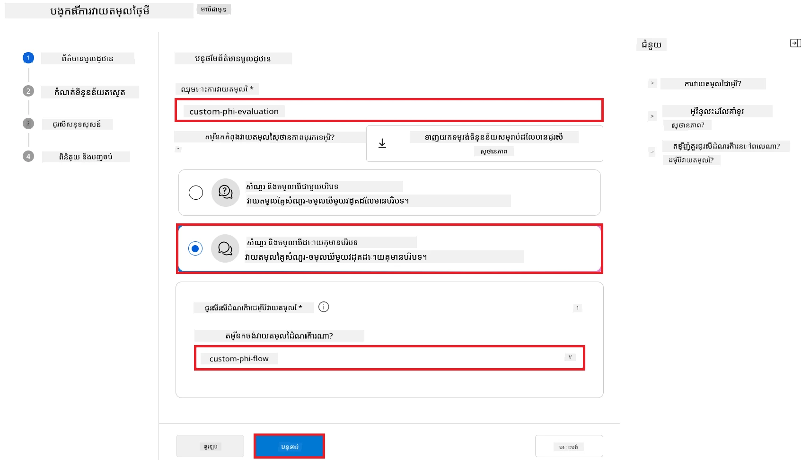

1. ជ្រើសរើស **Next**។

1. ប្រារព្ធការងារដូចខាងក្រោម៖

    - ជ្រើសរើស **Add your dataset** ដើម្បីផ្ទុកឡើងឯកសារទិន្នន័យ។ ឧទាហរណ៍ អ្នកអាចផ្ទុកឯកសារទិន្នន័យសាកល្បង ដូចជា *test_data.json1* ដែលភ្ជាប់មកមានពេលអ្នកទាញយកទិន្នន័យ **ULTRACHAT_200k**។
    - ជ្រើសរើស **Dataset column** ដែលសមស្របជាមួយទិន្នន័យរបស់អ្នក។ ឧទាហរណ៍ ប្រសិនបើអ្នកប្រើទិន្នន័យ **ULTRACHAT_200k** ជ្រើសរើស **${data.prompt}** ជាឈុំព័ត៌មានទិន្នន័យ។

    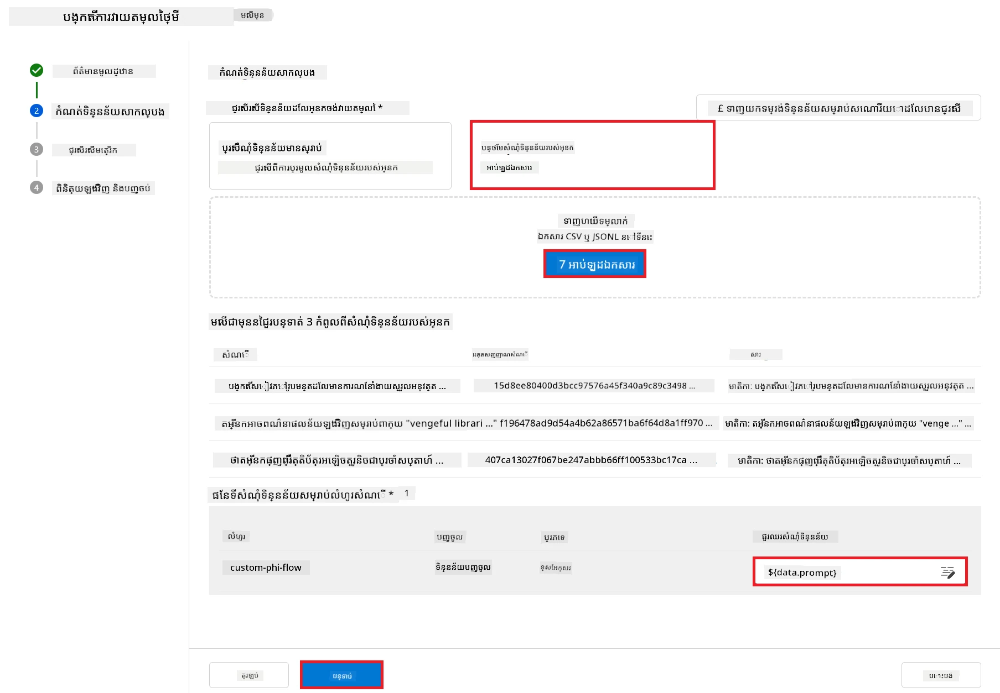

1. ជ្រើសរើស **Next**។

1. ប្រារព្ធការងារដូចខាងក្រោមដើម្បីកំណត់សមត្ថភាពនិងគុណភាពម៉ែត្រីក្សិលា៖

    - ជ្រើសរើសសមត្ថភាពនិងគុណភាពម៉ែត្រីក្សិលាដែលអ្នកចង់ប្រើ។
    - ជ្រើសរើសម៉ូដែល Azure OpenAI ដែលអ្នកបានបង្កើតសម្រាប់ការវាយតម្លៃ។ ឧទាហរណ៍ ចូលទៅកាន់ **gpt-4o**។

    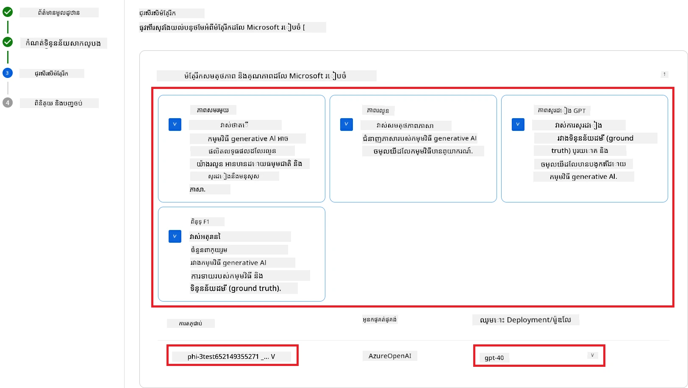

1. ប្រារព្ធការងារដូចខាងក្រោមដើម្បីកំណត់ហានិភ័យនិងសុវត្ថិភាពម៉ែត្រីក្សិលា៖

    - ជ្រើសរើសហានិភ័យនិងសុវត្ថិភាពម៉ែត្រីក្សិលាដែលអ្នកចង់ប្រើ។
    - ជ្រើសរើសកម្រិតអគ្គិសនីក្នុងការគណនាអត្រាប្រែប្រួលដែលអ្នកចង់ប្រើ។ ឧទាហរណ៍ ជ្រើសរើស **Medium**។
    - សម្រាប់ **question** ជ្រើសរើស **Data source** ទៅ **{$data.prompt}**។
    - សម្រាប់ **answer** ជ្រើសរើស **Data source** ទៅ **{$run.outputs.answer}**។
    - សម្រាប់ **ground_truth** ជ្រើសរើស **Data source** ទៅ **{$data.message}**។

    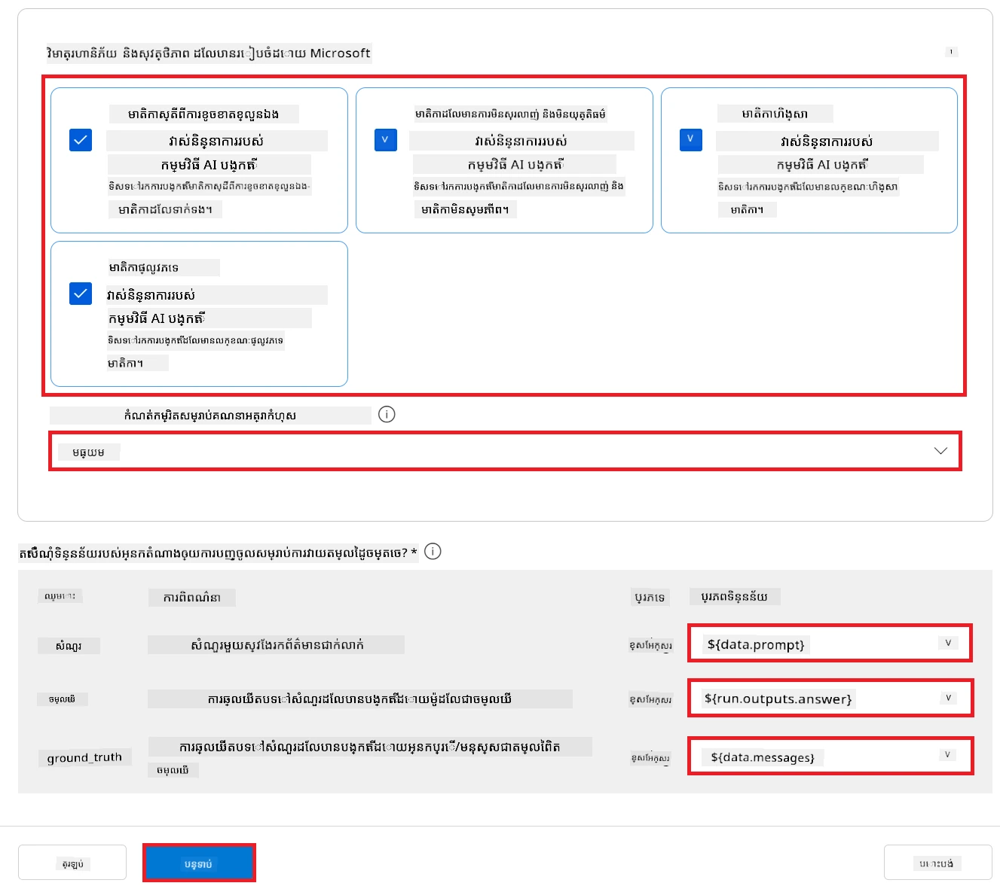

1. ជ្រើសរើស **Next**។

1. ជ្រើសរើស **Submit** ដើម្បីចាប់ផ្តើមការវាយតម្លៃ។

1. ការវាយតម្លៃនឹងចំណាយពេលមួយចំនួន។ អ្នកអាចតាមដានភាពវឌ្ឍនភាពនៅផ្នែក **Evaluation**។

### ពិនិត្យលទ្ធផលការវាយតម្លៃ

> [!NOTE]
> លទ្ធផលដែលបានបង្ហាញខាងក្រោមគឺមានគោលបំណងបង្ហាញដំណើរការវាយតម្លៃប៉ុណ្ណោះ។ នៅក្នុងមេរៀននេះ យើងបានប្រើម៉ូដែលដែលបានកែតម្រូវលើគ្រាប់ទិន្នន័យតូច ដែលអាចនាំឲ្យមានលទ្ធផលមិនល្អប៉ុណ្ណោះ។ លទ្ធផលពិតប្រាកដអាចខុសគ្នាយ៉ាងខ្លាំងទៅតាមទំហំ គុណភាព និងភាពចម្រឹមកម្រិតនៃទិន្នន័យ ប្រកបដោយការកំណត់ដាក់ម៉ូដែលជាក់លាក់ផងដែរ។

បន្ទាប់ពីការវាយតម្លៃបញ្ចប់ អ្នកអាចពិនិត្យឡើងវិញលទ្ធផលទាំងពីររួមទាំងសមត្ថភាពនិងសុវត្ថិភាព។
1. គោលវិចារណនិងគោលការណ៍គុណភាព:

    - វាយតម្លៃប្រសិទ្ធភាពម៉ូដែលក្នុងការបង្កើតចម្លើយដែលមានសេចក្ដីត្រូវបានត្រួសត្រូវ ច្រេីនរលូន និងមានន័យពាក់ព័ន្ធ។

    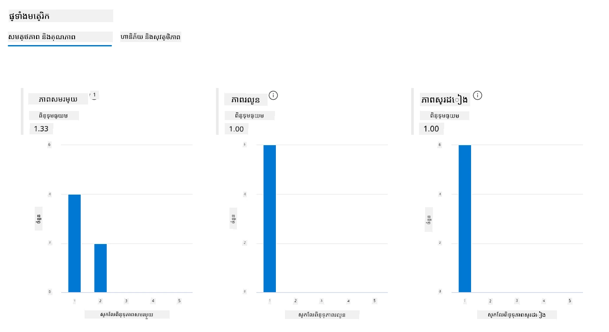

1. គោលវិចារណនិងសុវត្ថិភាព:

    - ធានាថាប្រសិទ្ធិផលរបស់ម៉ូដែលមានសុវត្ថិភាព ហើយស្របតាមគោលការណ៍នៃ Responsible AI ដើម្បីជៀសវាងមាតិកាដែលមានគ្រោះថ្នាក់ ឬធ្វើអោយមានការរើសអើង។

    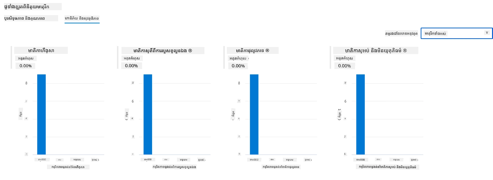

1. អ្នកអាចរមូលរំលងចុះក្រោមដើម្បីមើល **លទ្ធផលគោលវិចារណលំអិត**។

    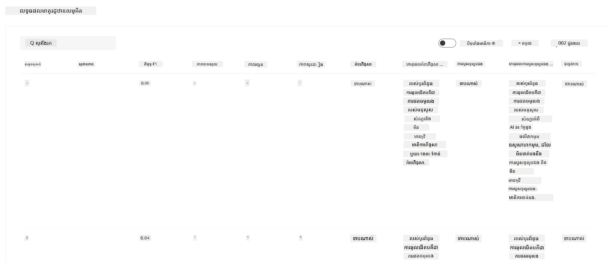

1. ដោយការវាយតម្លៃម៉ូដែលស៊ុម Phi-3 / Phi-3.5 បែបផ្ទាល់ខ្លួនរបស់អ្នកជាមួយគោលវិចារណនិងសុវត្ថិភាពទាំងពីរ អ្នកអាចបញ្ជាក់ថា ម៉ូដែលមិនត្រឹមតែមានប្រសិទ្ធភាពប៉ុណ្ណោះ ទេប៉ុន្តែអនុវត្តតាមការអនុវត្ត AI ដែលទទួលខុសត្រូវ ដែលធ្វើឱ្យវาพร้อมសម្រាប់ការប្រើប្រាស់នៅក្នុងពិភពយោងពិត។

## សូមអបអរសាទរ!

### អ្នកបានបញ្ចប់មេរៀននេះហើយ

អ្នកបានវាយតម្លៃម៉ូដែល Phi-3 ដែលបានបង្វឹកផ្ទាល់ខ្លួនដោយបានបញ្ចូល Prompt flow ក្នុង Microsoft Foundry ដោយជោគជ័យ។ នេះគឺជជំហ៊ានសំខាន់ក្នុងការធានាថាម៉ូដែល AI របស់អ្នកមិនត្រឹមតែផ្តល់បែបប្រតិបត្តិការល្អ ប៉ុន្តែថែមទាំងអនុវត្តតាមគោលការណ៍ AI ដែលទទួលខុសត្រូវរបស់ Microsoft ដើម្បីជួយអ្នកសង់កម្មវិធី AI ដែលអាចទុកចិត្ត និងទំនុកចិត្តបាន។


## ដំណើរការសម្អាតធនធាន Azure

សម្អាតធនធាន Azure របស់អ្នកដើម្បីជៀសវាងការបង់ប្រាក់បន្ថែមទៅកាន់គណនីរបស់អ្នក។ ចូលទៅកាន់ច្រក Azure និងលុបធនធានដូចខាងក្រោម៖

- ធនធាន Azure Machine learning។
- ចំណុចចេញម៉ូដែល Azure Machine learning។
- ធនធានគម្រោង Microsoft Foundry។
- ធនធាន Prompt flow របស់ Microsoft Foundry។

### ជំហ៊ានបន្ទាប់

#### ឯកសារ

- [វាយតម្លៃប្រព័ន្ធ AI ដោយប្រើផ្ទាំងគ្រប់គ្រង Responsible AI](https://learn.microsoft.com/azure/machine-learning/concept-responsible-ai-dashboard?view=azureml-api-2&source=recommendations?wt.mc_id=studentamb_279723)
- [គោលវិចារណនិងអនុវត្តវាស់ស្ទង់សម្រាប់ generative AI](https://learn.microsoft.com/azure/ai-studio/concepts/evaluation-metrics-built-in?tabs=definition?wt.mc_id=studentamb_279723)
- [ឯកសាររបស់ Microsoft Foundry](https://learn.microsoft.com/azure/ai-studio/?wt.mc_id=studentamb_279723)
- [ឯកសារបង្ហោះ Prompt flow](https://microsoft.github.io/promptflow/?wt.mc_id=studentamb_279723)

#### មាតិកាបណ្តុះបណ្តាល

- [ការណែនាំអំពីវិធាន Responsible AI របស់ Microsoft](https://learn.microsoft.com/training/modules/introduction-to-microsofts-responsible-ai-approach/?source=recommendations?wt.mc_id=studentamb_279723)
- [ការណែនាំអំពី Microsoft Foundry](https://learn.microsoft.com/training/modules/introduction-to-azure-ai-studio/?wt.mc_id=studentamb_279723)

### ជំនួយយោង

- [តើអ្វីទៅជា Responsible AI?](https://learn.microsoft.com/azure/machine-learning/concept-responsible-ai?view=azureml-api-2?wt.mc_id=studentamb_279723)
- [ប្រកាសឧបករណ៍ថ្មីៗក្នុង Azure AI ដើម្បីជួយអ្នកសង់កម្មវិធី generative AI ដែលមានសុវត្ថិភាព និងទុកចិត្តបាន](https://azure.microsoft.com/blog/announcing-new-tools-in-azure-ai-to-help-you-build-more-secure-and-trustworthy-generative-ai-applications/?wt.mc_id=studentamb_279723)
- [ការវាយតម្លៃកម្មវិធី generative AI](https://learn.microsoft.com/azure/ai-studio/concepts/evaluation-approach-gen-ai?wt.mc_id%3Dstudentamb_279723)

---

<!-- CO-OP TRANSLATOR DISCLAIMER START -->
**ការបដិសេធ**៖  
ឯកសារនេះត្រូវបានបកប្រែដោយប្រើសេវាកម្មបកប្រែ AI [Co-op Translator](https://github.com/Azure/co-op-translator)។ ទោះយើងខិតខំប្រឹងប្រែងក្នុងការបំលែងឲ្យបានត្រឹមត្រូវ ក៏សូមយល់ដឹងថាការបកប្រែមួយចំនួនដោយស្វ័យប្រវត្តិនោះអាចមានកំហុស ឬភាពមិនត្រឹមត្រូវខ្លះៗ។ ឯកសារដើមដែលមានភាសាទីបញ្ចេញគួរត្រូវបានគេចាត់ទុកថាជាធនធានដ៏មានសិទ្ធិ។ សម្រាប់ព័ត៌មានសំខាន់ៗ គឺថ្នាក់បកប្រែដោយមនុស្សដែលមានវិជ្ជាជីវៈគឺបានណែនាំ។ យើងមិនទទួលខុសត្រូវចំពោះការយល់ប្រៀប ឬការយល់ច្រឡំណាមួយដែលកើតមានពីការប្រើប្រាស់ការបកប្រែនេះឡើយ។
<!-- CO-OP TRANSLATOR DISCLAIMER END -->