# តម្រឹម​តែចិត្ត ហើយបញ្ចូលម៉ូឌែល Phi-3 ផ្ទាល់ខ្លួនជាមួយ Prompt flow

ឧទាហរណ៍ពីដើមដល់ចុង (E2E) នេះមានមូលដ្ឋានលើមគ្គុទេសក៍ "[Fine-Tune and Integrate Custom Phi-3 Models with Prompt Flow: Step-by-Step Guide](https://techcommunity.microsoft.com/t5/educator-developer-blog/fine-tune-and-integrate-custom-phi-3-models-with-prompt-flow/ba-p/4178612?WT.mc_id=aiml-137032-kinfeylo)" ពី Microsoft Tech Community។ វាណែនាំដល់ដំណើរការការតម្រឹម, ការដាក់ឲ្យដំណើរការ និងការបញ្ចូលម៉ូឌែល Phi-3 ផ្ទាល់ខ្លួនជាមួយ Prompt flow។

## ទិដ្ឋភាពទូទៅ

ក្នុងឧទាហរណ៍ E2E នេះ អ្នកនឹងរៀនពីរបៀបតម្រឹមម៉ូឌែល Phi-3 និងបញ្ចូលវាជាមួយ Prompt flow។ ដោយប្រើប្រាស់ Azure Machine Learning និង Prompt flow អ្នកនឹងបង្កើតសំណុំការងារសម្រាប់ដាក់ឲ្យដំណើរការនិងប្រើប្រាស់ម៉ូឌែល AI ផ្ទាល់ខ្លួន។ ឧទាហរណ៍ E2E នេះត្រូវបានបែងចែកចេញជា បម្រេីការបី៖

**សេណារីយ៉ូ១៖ ដំឡើងធនធាន Azure និងរៀបចំសម្រាប់ការតម្រឹម**

**សេណារីយ៉ូ២៖ តម្រឹមម៉ូឌែល Phi-3 និងដាក់ឲ្យដំណើរការនៅក្នុង Azure Machine Learning Studio**

**សេណារីយ៉ូ៣៖ បញ្ចូលជាមួយ Prompt flow និងជជែកជាមួយម៉ូឌែលផ្ទាល់ខ្លួនរបស់អ្នក**

នេះជាទិដ្ឋភាពទូទៅនៃឧទាហរណ៍ E2E នេះ។

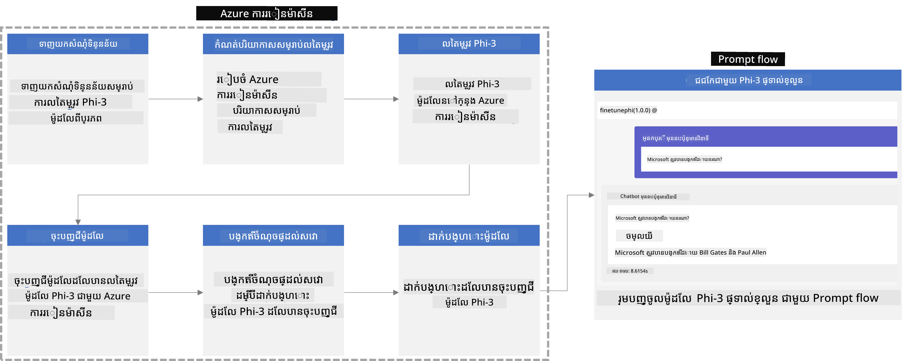

### ការតម្រៀបមាតិកា

1. **[សេណារីយ៉ូ 1៖ ដំឡើងធនធាន Azure និង រៀបចំសម្រាប់ការតម្រឹម](#សេណារីយ៉ូ-1៖-ដំឡើងធនធាន-azure-និង-រៀបចំសម្រាប់ការតម្រឹម)**
    - [បង្កើត Azure Machine Learning Workspace](#បង្កើត-azure-machine-learning-workspace)
    - [ស្នើសុំកម្រិត GPU ក្នុងការជាវ Azure](#ស្នើសុំកម្រិត-gpu-ក្នុងការជាវ-azure)
    - [បន្ថែមការចាត់តួនាទី](#បន្ថែមការចាត់តួនាទី)
    - [ដំឡើងគម្រោង](#ដំឡើងគម្រោង)
    - [រៀបចំទិន្នន័យសម្រាប់តម្រឹម](#រៀបចំ​បណ្ដុំឯកសារ​សម្រាប់-fine-tuning)

1. **[សេណារីយ៉ូ 2៖ តម្រឹមម៉ូឌែល Phi-3 និងដាក់ឲ្យដំណើរការនៅក្នុង Azure Machine Learning Studio](#ស៊េរីយ៉ូទី-២-បង្រៀនឡើងវិញម៉ូដែល-phi-3-និងដាក់បង្ហាញក្នុង-azure-machine-learning-studio)**
    - [ដំឡើង Azure CLI](#តំឡើង-azure-cli)
    - [តម្រឹមម៉ូឌែល Phi-3](#បង្រៀនឡើងវិញម៉ូដែល-phi-3)
    - [ដាក់ឲ្យដំណើរការ ម៉ូឌែលដែលបានតម្រឹម](#ដាក់បង្ហាញម៉ូដែលដែលបាន-fine-tune)

1. **[សេណារីយ៉ូ 3៖ បញ្ចូលជាមួយ Prompt flow និង ជជែកជាមួយម៉ូឌែលផ្ទាល់ខ្លួនរបស់អ្នក](#សេណារីយ៉ូ-៣៖-បញ្ចូលជាមួយ-prompt-flow-និងចាប់ផ្តើមជជែកជាមួយម៉ូដែលផ្ទាល់ខ្លួនរបស់អ្នក)**
    - [បញ្ចូលម៉ូឌែល Phi-3 ផ្ទាល់ខ្លួនជាមួយ Prompt flow](#បញ្ចូលម៉ូដែល-phi-3-ផ្ទាល់ខ្លួនជាមួយ-prompt-flow)
    - [ជជែកជាមួយម៉ូឌែលផ្ទាល់ខ្លួនរបស់អ្នក](#ជជែកជាមួយម៉ូដែលផ្ទាល់ខ្លួនរបស់អ្នក)

## សេណារីយ៉ូ 1៖ ដំឡើងធនធាន Azure និង រៀបចំសម្រាប់ការតម្រឹម

### បង្កើត Azure Machine Learning Workspace

1. វាយ *azure machine learning* នៅក្នុង **ប្រអប់ស្វែងរក** ខាងលើទំព័រប្រព័ន្ធ ហើយជ្រើស **Azure Machine Learning** ពីជម្រើសដែលបង្ហាញ។

    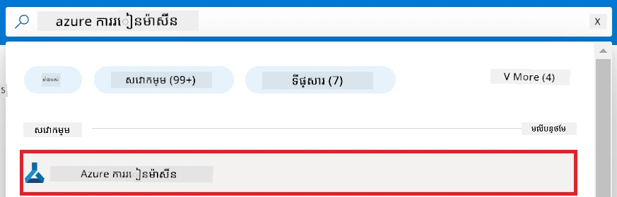

1. ជ្រើស **+ Create** ពីម៉ឺនុយណាវីហ្គេជិន។

1. ជ្រើស **New workspace** ពីម៉ឺនុយណាវីហ្គេជិន។

    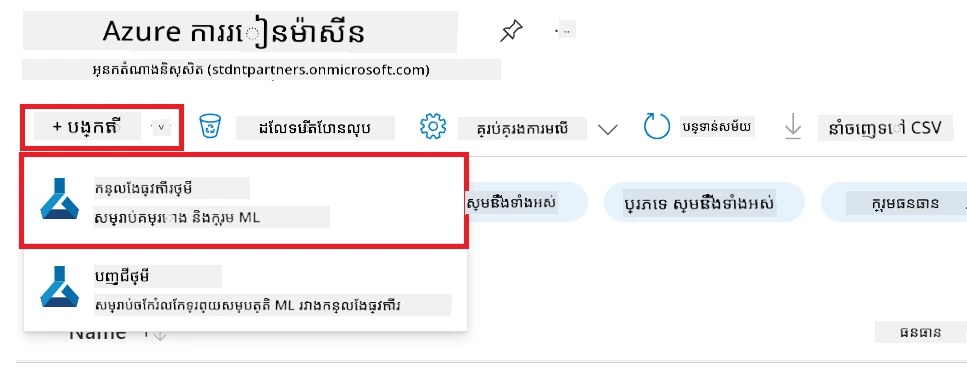

1. ធ្វើការងារដូចខាងក្រោម៖

    - ជ្រើស **Subscription** របស់អ្នកនៅក្នុង Azure។
    - ជ្រើស **Resource group** ដែលត្រូវប្រើ (បង្កើតថ្មីបើចាំបាច់)។
    - បញ្ចូល **Workspace Name**។ ត្រូវមានតម្លៃមួយដែលមិនស្ទាក់ស្ទើរ។
    - ជ្រើស **Region** ដែលអ្នកចង់ប្រើ។
    - ជ្រើស **Storage account** ដែលត្រូវប្រើ (បង្កើតថ្មីបើចាំបាច់)។
    - ជ្រើស **Key vault** ដែលត្រូវប្រើ (បង្កើតថ្មីបើចាំបាច់)។
    - ជ្រើស **Application insights** ដែលត្រូវប្រើ (បង្កើតថ្មីបើចាំបាច់)។
    - ជ្រើស **Container registry** ដែលត្រូវប្រើ (បង្កើតថ្មីបើចាំបាច់)។

    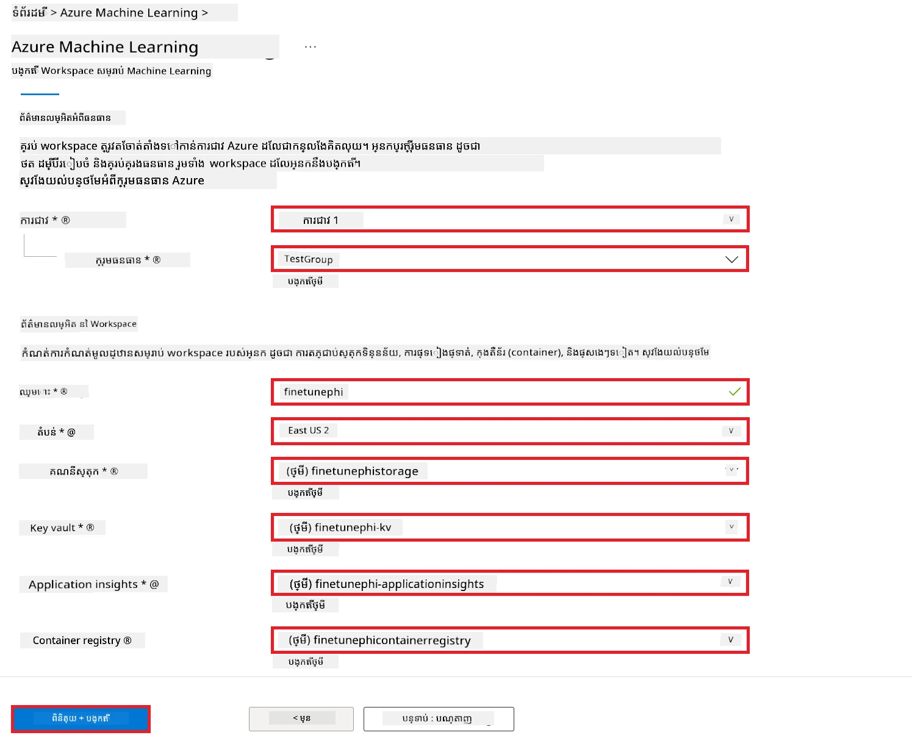

1. ជ្រើស **Review + Create**។

1. ជ្រើស **Create**។

### ស្នើសុំកម្រិត GPU ក្នុងការជាវ Azure

ក្នុងឧទាហរណ៍ E2E នេះ អ្នកនឹងប្រើ *Standard_NC24ads_A100_v4 GPU* សម្រាប់ការតម្រឹម ដែលត្រូវការសំណើស្នើសុំកម្រិត និង *Standard_E4s_v3* CPU សម្រាប់ដាក់ឲ្យដំណើរការ ដែលមិនតម្រូវឲ្យស្នើសុំកម្រិតទេ។

> [!NOTE]
>
> មាតាការជាវ Pay-As-You-Go ប៉ុណ្ណោះ (ប្រភេទការជាវស្តង់ដារ) មានសិទ្ធិទទួលបានចំណែក GPU; ការជាវប្រយោជន៍មិនគាំទ្រនាពេលនេះ។
>
> សម្រាប់អ្នកដែលប្រើការជាវប្រយោជន៍ (ដូចជា Visual Studio Enterprise Subscription) ឬអ្នកដែលចង់សាកល្បងដំណើរការតម្រឹម និងដាក់ប្រាក់បង់ឆាប់រហ័ស មេរៀននេះក៏ផ្តល់ការណែនាំសម្រាប់ការតម្រឹមដោយប្រើទិន្នន័យតិចតួចជាមួយ CPU។ ប៉ុន្តែសំខាន់គឺលទ្ធផលការតម្រឹមនេះល្អជាច្រើនពេលប្រើ GPU ជាមួយទិន្នន័យធំជាង។

1. ទៅកាន់ [Azure ML Studio](https://ml.azure.com/home?wt.mc_id=studentamb_279723)។

1. ធ្វើការងារដូចខាងក្រោមសម្រាប់ស្នើសុំកម្រិត *Standard NCADSA100v4 Family*៖

    - ជ្រើស **Quota** ពីផ្ទាំងផ្នែកឆ្វេង។
    - ជ្រើស **Virtual machine family** ដែលត្រូវប្រើ។ ឧទាហរណ៍ ជ្រើស **Standard NCADSA100v4 Family Cluster Dedicated vCPUs**, ដែលរួមមាន *Standard_NC24ads_A100_v4* GPU។
    - ជ្រើស **Request quota** ពីម៉ឺនុយណាវីហ្គេជិន។

        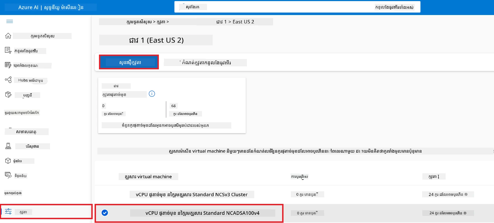

    - នៅក្នុងទំព័រ Request quota បញ្ចូល **New cores limit** ដែលអ្នកចង់ប្រើ។ ឧទាហរណ៍ 24។
    - នៅក្នុងទំព័រ Request quota ជ្រើស **Submit** ដើម្បីស្នើសុំកម្រិត GPU។

> [!NOTE]
> អ្នកអាចជ្រើសរើស GPU ឬ CPU សមស្របសម្រាប់តម្រូវការរបស់អ្នក ដោយយោងទៅលើឯកសារ [Sizes for Virtual Machines in Azure](https://learn.microsoft.com/azure/virtual-machines/sizes/overview?tabs=breakdownseries%2Cgeneralsizelist%2Ccomputesizelist%2Cmemorysizelist%2Cstoragesizelist%2Cgpusizelist%2Cfpgasizelist%2Chpcsizelist)។

### បន្ថែមការចាត់តួនាទី

ដើម្បីតម្រឹម និងដាក់ម៉ូឌែលរបស់អ្នក អ្នកត្រូវបង្កើត User Assigned Managed Identity (UAI) មួយជាមុនសិន ហើយផ្តល់សិទ្ធិដល់វាដោយសមរម្យ។ UAI នេះនឹងត្រូវប្រើសម្រាប់ការផ្ទៀងផ្ទាត់អត្តសញ្ញាណពេលដាក់ឲ្យដំណើរការ។

#### បង្កើត User Assigned Managed Identity(UAI)

1. វាយ *managed identities* នៅក្នុង **ប្រអប់ស្វែងរក** ខាងលើទំព័រប្រព័ន្ធ ហើយជ្រើស **Managed Identities** ពីជម្រើសដែលបង្ហាញ។

    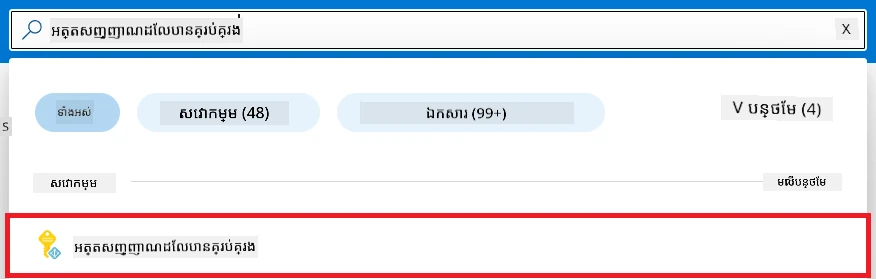

1. ជ្រើស **+ Create**។

    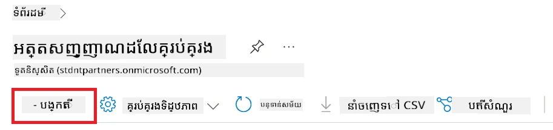

1. ធ្វើការងារដូចខាងក្រោម៖

    - ជ្រើស **Subscription** របស់អ្នកនៅក្នុង Azure។
    - ជ្រើស **Resource group** ដែលត្រូវប្រើ (បង្កើតថ្មីបើចាំបាច់)។
    - ជ្រើស **Region** ដែលអ្នកចង់ប្រើ។
    - បញ្ចូល **Name**។ ត្រូវមានតម្លៃមួយដែលមិនស្ទាក់ស្ទើរ។

1. ជ្រើស **Review + create**។

1. ជ្រើស **+ Create**។

#### បន្ថែមការចាត់តួនាទី Contributor ជាមួយ Managed Identity

1. ទៅកាន់ធនធាន Managed Identity ដែលអ្នកបានបង្កើត។

1. ជ្រើស **Azure role assignments** ពីផ្ទាំងផ្នែកឆ្វេង។

1. ជ្រើស **+Add role assignment** ពីម៉ឺនុយណាវីហ្គេជិន។

1. នៅក្នុងទំព័រ Add role assignment ធ្វើការងារដូចខាងក្រោម៖
    - ជ្រើស **Scope** ទៅ **Resource group**។
    - ជ្រើស **Subscription** របស់អ្នកនៅក្នុង Azure។
    - ជ្រើស **Resource group** ដែលត្រូវប្រើ។
    - ជ្រើស **Role** ទៅ **Contributor**។

    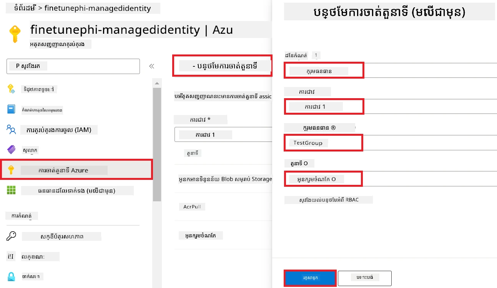

1. ជ្រើស **Save**។

#### បន្ថែមការចាត់តួនាទី Storage Blob Data Reader ជាមួយ Managed Identity

1. វាយ *storage accounts* នៅក្នុង **ប្រអប់ស្វែងរក** ខាងលើទំព័រប្រព័ន្ធ ហើយជ្រើស **Storage accounts** ពីជម្រើសដែលបង្ហាញ។

    

1. ជ្រើសគណនី storage ដែលភ្ជាប់ជាមួយ Azure Machine Learning workspace ដែលអ្នកបានបង្កើត។ ឧទាហរណ៍ *finetunephistorage*។

1. ធ្វើការងារដូចខាងក្រោមដើម្បីទៅកាន់ទំព័រ Add role assignment៖

    - ទៅកាន់គណនី Azure Storage ដែលអ្នកបានបង្កើត។
    - ជ្រើស **Access Control (IAM)** ពីផ្ទាំងផ្នែកឆ្វេង។
    - ជ្រើស **+ Add** ពីម៉ឺនុយណាវីហ្គេជិន។
    - ជ្រើស **Add role assignment** ពីម៉ឺនុយណាវីហ្គេជិន។

    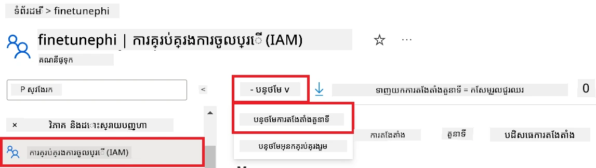

1. នៅក្នុងទំព័រ Add role assignment ធ្វើការងារដូចខាងក្រោម៖

    - នៅក្នុងទំព័រ Role, វាយ *Storage Blob Data Reader* នៅក្នុង **ប្រអប់ស្វែងរក** ហើយជ្រើស **Storage Blob Data Reader** ពីជម្រើសដែលបង្ហាញ។
    - នៅក្នុងទំព័រ Role, ជ្រើស **Next**។
    - នៅក្នុងទំព័រ Members, ជ្រើស **Assign access to** ជា **Managed identity**។
    - នៅក្នុងទំព័រ Members, ជ្រើស **+ Select members**។
    - នៅក្នុងទំព័រ Select managed identities, ជ្រើស **Subscription** របស់អ្នកនៅក្នុង Azure។
    - នៅក្នុងទំព័រ Select managed identities, ជ្រើស **Managed identity** ទៅ **Manage Identity**។
    - នៅក្នុងទំព័រ Select managed identities, ជ្រើស Manage Identity ដែលអ្នកបានបង្កើត។ ឧទាហរណ៍ *finetunephi-managedidentity*។
    - នៅក្នុងទំព័រ Select managed identities, ជ្រើស **Select**។

    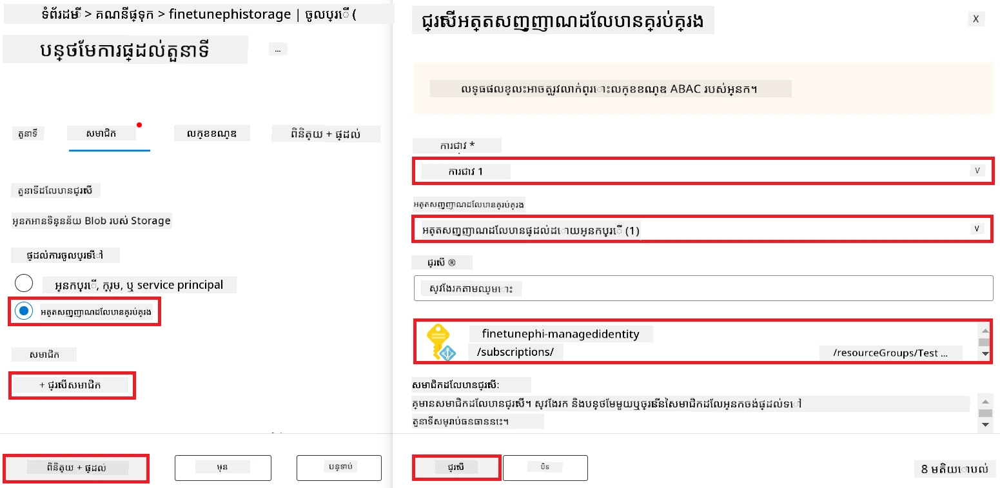

1. ជ្រើស **Review + assign** ។

#### បន្ថែមការចាត់តួនាទី AcrPull ជាមួយ Managed Identity

1. វាយ *container registries* នៅក្នុង **ប្រអប់ស្វែងរក** ខាងលើទំព័រប្រព័ន្ធ ហើយជ្រើស **Container registries** ពីជម្រើសដែលបង្ហាញ។

    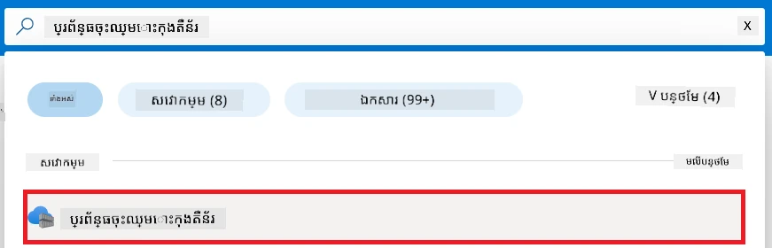

1. ជ្រើស container registry ដែលភ្ជាប់ជាមួយ Azure Machine Learning workspace។ ឧទាហរណ៍ *finetunephicontainerregistries*

1. ធ្វើការងារដូចខាងក្រោមដើម្បីទៅកាន់ទំព័រ Add role assignment៖

    - ជ្រើស **Access Control (IAM)** ពីផ្ទាំងផ្នែកឆ្វេង។
    - ជ្រើស **+ Add** ពីម៉ឺនុយណាវីហ្គេជិន។
    - ជ្រើស **Add role assignment** ពីម៉ឺនុយណាវីហ្គេជិន។

1. នៅក្នុងទំព័រ Add role assignment ធ្វើការងារដូចខាងក្រោម៖

    - នៅក្នុងទំព័រ Role, វាយ *AcrPull* នៅក្នុង **ប្រអប់ស្វែងរក** ហើយជ្រើស **AcrPull** ពីជម្រើសដែលបង្ហាញ។
    - នៅក្នុងទំព័រ Role, ជ្រើស **Next**។
    - នៅក្នុងទំព័រ Members, ជ្រើស **Assign access to** ជា **Managed identity**។
    - នៅក្នុងទំព័រ Members, ជ្រើស **+ Select members**។
    - នៅក្នុងទំព័រ Select managed identities, ជ្រើស **Subscription** របស់អ្នកនៅក្នុង Azure។
    - នៅក្នុងទំព័រ Select managed identities, ជ្រើស **Managed identity** ទៅ **Manage Identity**។
    - នៅក្នុងទំព័រ Select managed identities, ជ្រើស Manage Identity ដែលអ្នកបានបង្កើត។ ឧទាហរណ៍ *finetunephi-managedidentity*។
    - នៅក្នុងទំព័រ Select managed identities, ជ្រើស **Select**។
    - ជ្រើស **Review + assign**។

### ដំឡើងគម្រោង

ឥឡូវនេះ អ្នកនឹងបង្កើតថតមួយសម្រាប់ធ្វើការងារ និងដំឡើងបរិស្ថានវើចឆ័រណ៍សម្រាប់អភិវឌ្ឍកម្មវិធីមួយដែលទំនាក់ទំនងជាមួយអ្នកប្រើ និងប្រើប្រវត្តិការជជែកដែលបានរក្សាទុកពី Azure Cosmos DB ដើម្បីលើកទឹកចិត្តលទ្ធផលចម្លើយរបស់វា។

#### បង្កើតថតមួយសម្រាប់ធ្វើការងារក្នុងនោះ

1. បើកវិនដូ терминал ហើយវាយពាក្យបញ្ជាខាងក្រោមដើម្បីបង្កើតថតមួយមានឈ្មោះ *finetune-phi* នៅទីតាំងលំនាំដើម។

    ```console
    mkdir finetune-phi
    ```

1. វាយពាក្យបញ្ជាខាងក្រោមនៅក្នុង терминал របស់អ្នកដើម្បីទៅកាន់ថត *finetune-phi* ដែលបានបង្កើត។

    ```console
    cd finetune-phi
    ```

#### បង្កើតបរិស្ថានវើចឆ័រ

1. វាយពាក្យបញ្ជាខាងក្រោមនៅក្នុង терминал របស់អ្នក ដើម្បីបង្កើតបរិស្ថានវើចឆ័រមួយឈ្មោះ *.venv*។

    ```console
    python -m venv .venv
    ```

1. វាយពាក្យបញ្ជាខាងក្រោមនៅក្នុង терминал របស់អ្នក ដើម្បីបើកបរិស្ថានវើចឆ័រ។

    ```console
    .venv\Scripts\activate.bat
    ```

> [!NOTE]
>
> ប្រសិនបើវាដំណើរការ អ្នកគួរតែឃើញ *(.venv)* មុនបន្ទាត់ពាក្យបញ្ជា។

#### ដំឡើងកញ្ចប់ដែលត្រូវការ

1. វាយពាក្យបញ្ជាខាងក្រោមនៅក្នុង терминал របស់អ្នក ដើម្បីដំឡើងកញ្ចប់ដែលត្រូវការ។

    ```console
    pip install datasets==2.19.1
    pip install transformers==4.41.1
    pip install azure-ai-ml==1.16.0
    pip install torch==2.3.1
    pip install trl==0.9.4
    pip install promptflow==1.12.0
    ```

#### បង្កើតឯកសារគម្រោង

ក្នុងលំហាត់នេះ អ្នកនឹងបង្កើតឯកសារសំខាន់ៗសម្រាប់គម្រោងរបស់យើង។ ឯកសារទាំងនេះរួមមានស្គ្រីបសម្រាប់ទាញយកទិន្នន័យ, រៀបចំបរិស្ថាន Azure Machine Learning, តម្រឹមម៉ូឌែល Phi-3 និងដាក់ម៉ូឌែលដែលបានតម្រឹមឲ្យដំណើរការ។ អ្នកនឹងបង្កើតឯកសារ *conda.yml* មួយសម្រាប់តំឡើងបរិស្ថានតម្រឹម។

ក្នុងលំហាត់នេះ អ្នកនឹង៖
- បង្កើត​ហ្វាយ​ល *download_dataset.py* ដើម្បី​ទាញយក​បណ្ដុំឯកសារ។
- បង្កើត​ហ្វាយ​ល *setup_ml.py* ដើម្បី​តំឡើង​បរិយាកាស Azure Machine Learning។
- បង្កើត​ហ្វាយ​ល *fine_tune.py* នៅ​ក្នុងថត *finetuning_dir* ដើម្បី​បង្រៀន​ឡើងវិញម៉ូដែល Phi-3 ដោយប្រើ​បណ្ដុំឯកសារ។
- បង្កើត​ហ្វាយ​ល *conda.yml* ដើម្បី​តំឡើង​បរិយាកាស​សម្រាប់ fine-tuning។
- បង្កើត​ហ្វាយ​ល *deploy_model.py* ដើម្បី​ចាក់ផ្តើមម៉ូដែល​ដែលបាន fine-tune។
- បង្កើត​ហ្វាយ​ល *integrate_with_promptflow.py* ដើម្បី​អនុវត្តកាផ្ដុំម៉ូដែល fine-tune និង​ប្រតិបត្តិម៉ូដែលដោយ​ប្រើ Prompt flow។
- បង្កើត​ហ្វាយ​ល flow.dag.yml ដើម្បី​ដំឡើង​រចនាសម្ព័ន្ធ​សម្រាប់ Prompt flow។
- បង្កើត​ហ្វាយ​ល *config.py* ដើម្បី​បញ្ចូល​ព័ត៌មាន Azure របស់អ្នក។

> [!NOTE]
>
> រចនាសម្ព័ន្ធថត​ផ្ដល់ពេញលេញ៖
>
> ```text
> └── YourUserName
> .    └── finetune-phi
> .        ├── finetuning_dir
> .        │      └── fine_tune.py
> .        ├── conda.yml
> .        ├── config.py
> .        ├── deploy_model.py
> .        ├── download_dataset.py
> .        ├── flow.dag.yml
> .        ├── integrate_with_promptflow.py
> .        └── setup_ml.py
> ```

1. បើក **Visual Studio Code**។

1. ជ្រើសរើស **File** ពីរបារមឺនុយ។

1. ជ្រើសរើស **Open Folder**។

1. ជ្រើសរើសថត *finetune-phi* ដែលអ្នកបានបង្កើត ដែលស្ថិតនៅ *C:\Users\yourUserName\finetune-phi*។

    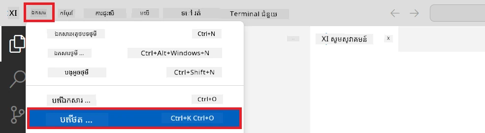

1. នៅផ្នែកខាងឆ្វេងនៃ Visual Studio Code ចុចខាងស្ដាំហើយជ្រើសរើស **New File** ដើម្បីបង្កើត​ហ្វាយ​លថ្មីមានឈ្មោះ *download_dataset.py*។

1. នៅផ្នែកខាងឆ្វេងនៃ Visual Studio Code ចុចខាងស្ដាំហើយជ្រើសរើស **New File** ដើម្បីបង្កើត​ហ្វាយ​លថ្មីមានឈ្មោះ *setup_ml.py*។

1. នៅផ្នែកខាងឆ្វេងនៃ Visual Studio Code ចុចខាងស្ដាំហើយជ្រើសរើស **New File** ដើម្បីបង្កើត​ហ្វាយ​លថ្មីមានឈ្មោះ *deploy_model.py*។

    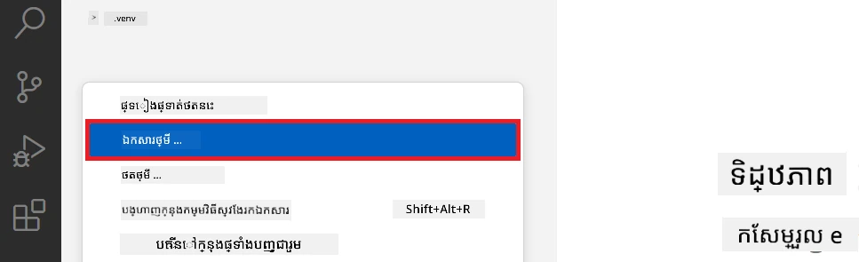

1. នៅផ្នែកខាងឆ្វេងនៃ Visual Studio Code ចុចខាងស្ដាំហើយជ្រើសរើស **New Folder** ដើម្បីបង្កើតថតថ្មីមានឈ្មោះ *finetuning_dir*។

1. នៅក្នុងថត *finetuning_dir* បង្កើត​ហ្វាយ​លថ្មីមានឈ្មោះ *fine_tune.py*។

#### បង្កើត និងកំណត់រចនាសម្ព័ន្ធ​ហ្វាយ​ល *conda.yml*

1. នៅផ្នែកខាងឆ្វេងនៃ Visual Studio Code ចុចខាងស្ដាំហើយជ្រើសរើស **New File** ដើម្បីបង្កើត​ហ្វាយ​លថ្មីមានឈ្មោះ *conda.yml*។

1. បន្ថែម​កូដ​ខាងក្រោម​ទៅ​ហ្វាយ​ល *conda.yml* ដើម្បី​ដំឡើង​បរិយាកាសសម្រាប់ fine-tuning ម៉ូដែល Phi-3 ។

    ```yml
    name: phi-3-training-env
    channels:
      - defaults
      - conda-forge
    dependencies:
      - python=3.10
      - pip
      - numpy<2.0
      - pip:
          - torch==2.4.0
          - torchvision==0.19.0
          - trl==0.8.6
          - transformers==4.41
          - datasets==2.21.0
          - azureml-core==1.57.0
          - azure-storage-blob==12.19.0
          - azure-ai-ml==1.16
          - azure-identity==1.17.1
          - accelerate==0.33.0
          - mlflow==2.15.1
          - azureml-mlflow==1.57.0
    ```

#### បង្កើត និងកំណត់រចនាសម្ព័ន្ធ​ហ្វាយ​ល *config.py*

1. នៅផ្នែកខាងឆ្វេងនៃ Visual Studio Code ចុចខាង​ស្តាំ ហើយជ្រើសរើស **New File** ដើម្បីបង្កើត​ហ្វាយ​លថ្មីមានឈ្មោះ *config.py*។

1. បន្ថែម​កូដ​ខាងក្រោម​ទៅ​ហ្វាយ​ល *config.py* ដើម្បីបញ្ចូល​ព័ត៌មាន Azure របស់អ្នក។

    ```python
    # ការកំណត់ Azure
    AZURE_SUBSCRIPTION_ID = "your_subscription_id"
    AZURE_RESOURCE_GROUP_NAME = "your_resource_group_name" # "TestGroup"

    # ការកំណត់ Azure Machine Learning
    AZURE_ML_WORKSPACE_NAME = "your_workspace_name" # "finetunephi-workspace"

    # ការកំណត់អត្តសញ្ញាណគ្រប់គ្រង Azure
    AZURE_MANAGED_IDENTITY_CLIENT_ID = "your_azure_managed_identity_client_id"
    AZURE_MANAGED_IDENTITY_NAME = "your_azure_managed_identity_name" # "finetunephi-mangedidentity"
    AZURE_MANAGED_IDENTITY_RESOURCE_ID = f"/subscriptions/{AZURE_SUBSCRIPTION_ID}/resourceGroups/{AZURE_RESOURCE_GROUP_NAME}/providers/Microsoft.ManagedIdentity/userAssignedIdentities/{AZURE_MANAGED_IDENTITY_NAME}"

    # ផ្លូវឯកសារទិន្នន័យ
    TRAIN_DATA_PATH = "data/train_data.jsonl"
    TEST_DATA_PATH = "data/test_data.jsonl"

    # ការកំណត់ម៉ូឌែលដែលបានបញ្ជូនតម្លៃ
    AZURE_MODEL_NAME = "your_fine_tuned_model_name" # "finetune-phi-model"
    AZURE_ENDPOINT_NAME = "your_fine_tuned_model_endpoint_name" # "finetune-phi-endpoint"
    AZURE_DEPLOYMENT_NAME = "your_fine_tuned_model_deployment_name" # "finetune-phi-deployment"

    AZURE_ML_API_KEY = "your_fine_tuned_model_api_key"
    AZURE_ML_ENDPOINT = "your_fine_tuned_model_endpoint_uri" # "https://{your-endpoint-name}.{your-region}.inference.ml.azure.com/score"
    ```

#### បន្ថែមអថេរ​បរិយាកាស Azure

1. អនុវត្ត​កម្មវិធី​ខាងក្រោម ដើម្បីបញ្ចូល Azure Subscription ID៖

    - វាយ *subscriptions* ក្នុង **របារស្វែងរក** នៅខាងលើ​ទំព័រ portal ហើយជ្រើសរើស **Subscriptions** ពីជម្រើសដែលបង្ហាញ។
    - ជ្រើសរើស Azure Subscription ធ្វើការបច្ចុប្បន្នរបស់អ្នក។
    - ចម្លង និងបិទបញ្ចូល Subscription ID របស់អ្នកក្នុង​ហ្វាយ​ល *config.py* ។

    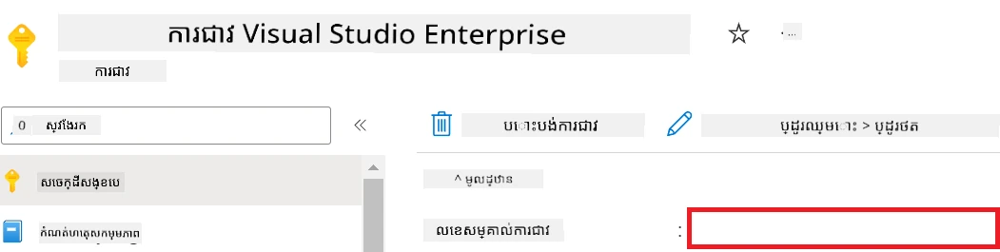

1. អនុវត្ត​កម្មវិធី​ខាងក្រោម ដើម្បីបញ្ចូល Azure Workspace Name៖

    - ទៅកាន់ធនធាន Azure Machine Learning ដែលអ្នកបានបង្កើត។
    - ចម្លង និងបិទបញ្ចូលឈ្មោះគណនីរបស់អ្នកក្នុង​ហ្វាយ​ល *config.py* ។

    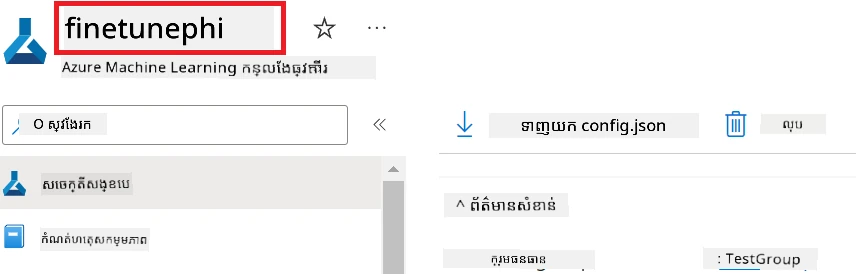

1. អនុវត្ត​កម្មវិធី​ខាងក្រោម ដើម្បីបញ្ចូល Azure Resource Group Name៖

    - ទៅកាន់ធនធាន Azure Machine Learning ដែលអ្នកបានបង្កើត។
    - ចម្លង និងបិទបញ្ចូលឈ្មោះ Azure Resource Group របស់អ្នកក្នុង​ហ្វាយ​ល *config.py* ។

    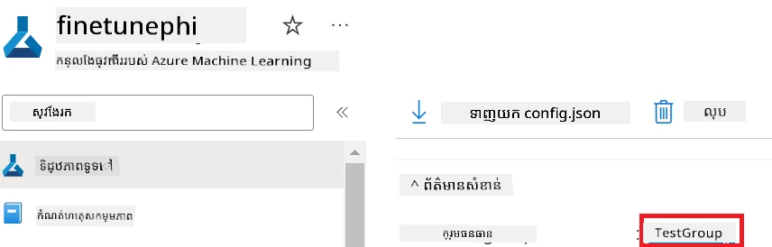

2. អនុវត្ត​កម្មវិធី​ខាងក្រោម ដើម្បីបញ្ចូលឈ្មោះ Azure Managed Identity៖

    - ទៅកាន់ធនធាន Managed Identities ដែលអ្នកបានបង្កើត។
    - ចម្លង និងបិទបញ្ចូលឈ្មោះ Azure Managed Identity របស់អ្នកក្នុង​ហ្វាយ​ល *config.py* ។

    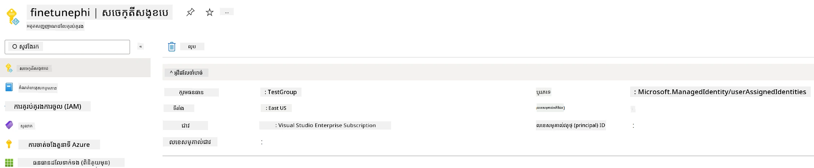

### រៀបចំ​បណ្ដុំឯកសារ​សម្រាប់ fine-tuning

ក្នុងលំហាត់នេះ អ្នក​នឹង​រត់​ហ្វាយ​ល *download_dataset.py* ដើម្បីទាញយកបណ្ដុំឯកសារ *ULTRACHAT_200k* ទៅបរិយាកាសក្នុងក្នុងស្រុករបស់អ្នក។ បន្ទាប់មក អ្នកនឹងប្រើ​បណ្ដុំឯកសារ​នោះ ដើម្បី​បង្រៀន​ឡើង​វិញម៉ូដែល Phi-3 នៅក្នុង Azure Machine Learning ។

#### ទាញយក បណ្ដុំឯកសារ​របស់អ្នក​ដោយប្រើ *download_dataset.py*

1. បើក​ហ្វាយ​ល *download_dataset.py* នៅក្នុង Visual Studio Code។

1. បន្ថែម​កូដ​ខាងក្រោម​ទៅក្នុង​ហ្វាយ​ល *download_dataset.py*។

    ```python
    import json
    import os
    from datasets import load_dataset
    from config import (
        TRAIN_DATA_PATH,
        TEST_DATA_PATH)

    def load_and_split_dataset(dataset_name, config_name, split_ratio):
        """
        Load and split a dataset.
        """
        # បន្ទុកបណ្ដុំទិន្នន័យជាមួយឈ្មោះ កំណត់រចនាសម្ព័ន្ធ និងអត្រាចែកចាយដែលបានកំណត់
        dataset = load_dataset(dataset_name, config_name, split=split_ratio)
        print(f"Original dataset size: {len(dataset)}")
        
        # ចែកបណ្ដុំទិន្នន័យទៅជាសំណុំបណ្តុះបណ្តាល និងសំណុំសាកល្បង (80% បណ្តុះបណ្តាល, 20% សាកល្បង)
        split_dataset = dataset.train_test_split(test_size=0.2)
        print(f"Train dataset size: {len(split_dataset['train'])}")
        print(f"Test dataset size: {len(split_dataset['test'])}")
        
        return split_dataset

    def save_dataset_to_jsonl(dataset, filepath):
        """
        Save a dataset to a JSONL file.
        """
        # បង្កើតថតថែវបើវាមិនមាន
        os.makedirs(os.path.dirname(filepath), exist_ok=True)
        
        # បើកធាតុបណ្ដឹងក្នុងមុខងារសរសេរ
        with open(filepath, 'w', encoding='utf-8') as f:
            # កំណត់រត់លើកំណត់ត្រារបស់បណ្ដុំទិន្នន័យមួយៗ
            for record in dataset:
                # បញ្ចេញកំណត់ត្រាទៅជាវត្ថុ JSON ហើយសរសេរចូលឯកសារ
                json.dump(record, f)
                # សរសេរអក្សរបន្ទាត់ថ្មីដើម្បីបំបែកកំណត់ត្រា
                f.write('\n')
        
        print(f"Dataset saved to {filepath}")

    def main():
        """
        Main function to load, split, and save the dataset.
        """
        # បំណែកនិងចែកបណ្ដុំទិន្នន័យ ULTRACHAT_200k ជាមួយការកំណត់រចនាសម្ព័ន្ធនិងអត្រាចែកចាយជាក់លាក់
        dataset = load_and_split_dataset("HuggingFaceH4/ultrachat_200k", 'default', 'train_sft[:1%]')
        
        # រើសយកសំណុំបណ្តុះបណ្តាល និងសំណុំសាកល្បងពីការចែក
        train_dataset = dataset['train']
        test_dataset = dataset['test']

        # រក្សាទុកសំណុំបណ្តុះបណ្តាលទៅមួយឯកសារ JSONL
        save_dataset_to_jsonl(train_dataset, TRAIN_DATA_PATH)
        
        # រក្សាទុកសំណុំសាកល្បងទៅឯកសារ JSONL ផ្សេងទៀត
        save_dataset_to_jsonl(test_dataset, TEST_DATA_PATH)

    if __name__ == "__main__":
        main()

    ```

> [!TIP]
>
> **ការណែនាំ​សម្រាប់ fine-tuning ជាមួយបណ្ដុំឯកសារតិចតួចដោយប្រើ CPU**
>
> ប្រសិនបើអ្នកចង់ប្រើ CPU សម្រាប់ fine-tuning វិធីនេះសមស្របសម្រាប់អ្នកដែលមានការជាវហត្ថពលកម្ម (ដូចជា Visual Studio Enterprise Subscription) ឬសម្រាប់សាកល្បងលឿននូវដំណើរការប fine-tune និង deploy។
>
> ជំនួស `dataset = load_and_split_dataset("HuggingFaceH4/ultrachat_200k", 'default', 'train_sft[:1%]')` ជា `dataset = load_and_split_dataset("HuggingFaceH4/ultrachat_200k", 'default', 'train_sft[:10]')`
>

1. វាយពាក្យបញ្ជាខាងក្រោមនៅក្នុងបន្ទាត់បញ្ជា щобរត់ script ហើយទាញយកបណ្ដុំឯកសារទៅបរិយាកាសក្នុងស្រុករបស់អ្នក។

    ```console
    python download_data.py
    ```

1. ក្រោយមក ស្វែងយល់ថាបណ្ដុំឯកសារ​ត្រូវបានរក្សាទុកជោគជ័យនៅក្នុងថត *finetune-phi/data* ក្នុងស្រុករបស់អ្នក។

> [!NOTE]
>
> **ទំហំបណ្ដុំឯកសារ និងពេលវេលា fine-tuning**
>
> ក្នុង​គំរូ E2E នេះ អ្នកប្រើតែ 1% នៃបណ្ដុំឯកសារ (`train_sft[:1%]`) ។ វា​បន្ថយចំនួនទិន្នន័យយ៉ាងខ្លាំង បណ្តាលឲ្យល្បឿន​អាប់​ឡូត និង fine-tune លឿនឡើង។ អ្នកអាចច调整ភាគរយដើម្បីរកតុល្យភាពល្អរវាងពេលវេលាបណ្តុំនិងប្រសិទ្ធភាពម៉ូដែល។ ការប្រើ subset តិចនៃបណ្ដុំឯកសារ បន្ថែមល្បឿនវេលាដំណើរការ fine-tuning, ធ្វើឲ្យដំណើរការជាករណី E2E មានភាពងាយស្រួល។
  
## ស៊េរីយ៉ូទី ២: បង្រៀនឡើងវិញម៉ូដែល Phi-3 និងដាក់បង្ហាញក្នុង Azure Machine Learning Studio

### តំឡើង Azure CLI

អ្នកត្រូវតែតំឡើង Azure CLI ដើម្បី​ផ្ទៀងផ្ទាត់បរិយាកាសរបស់អ្នក។ Azure CLI អនុញ្ញាតឲ្យអ្នកគ្រប់គ្រងធនធាន Azure ពីបន្ទាត់បញ្ជាដោយផ្ទាល់ ហើយផ្តល់លេខសម្គាល់សម្រាប់ Azure Machine Learning ក្នុងការចូលដំណើរការ។ ដើម្បីចាប់ផ្តើម សូមដំឡើង [Azure CLI](https://learn.microsoft.com/cli/azure/install-azure-cli)

1. បើកបង្អួច terminal ហើយវាយពាក្យបញ្ជាខាងក្រោម ដើម្បីចូលគណនី Azure របស់អ្នក។

    ```console
    az login
    ```

1. ជ្រើសរើស​គណនី Azure របស់អ្នកសម្រាប់ប្រើ។

1. ជ្រើសរើសនូវsubscription Azure សម្រាប់ប្រើ។

    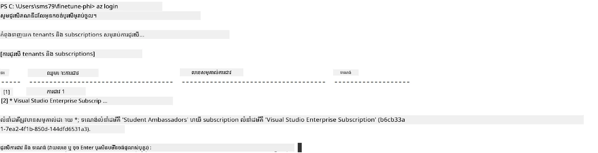

> [!TIP]
>
> ប្រសិនបើអ្នកមានបញ្ហា​ចូលទៅ Azure សាកល្បងប្រើកូដឧបករណ៍ (device code). បើកបង្អួច terminal ហើយវាយពាក្យបញ្ជាខាងក្រោមដើម្បីចូលគណនី Azure របស់អ្នក៖
>
> ```console
> az login --use-device-code
> ```
>

### បង្រៀនឡើងវិញម៉ូដែល Phi-3

ក្នុងលំហាត់នេះ អ្នកនឹងបង្រៀនឡើងវិញម៉ូដែល Phi-3 ដោយប្រើ​បណ្ដុំឯកសារដែលផ្ដល់ជូន។ ជំហានដំបូង អ្នកនឹងកំណត់ដំណើរការ fine-tuning នៅក្នុងហ្វាយ​ល *fine_tune.py*។ បន្ទាប់មក អ្នកនឹងកំណត់បរិយាកាស Azure Machine Learning ហើយចាប់ផ្តើម​ដំណើរការ fine-tuning ដោយរត់ហ្វាយ​ល *setup_ml.py*។ ស្ព្រីប៊ីអ្នកនេះធានាថា fine-tuning នឹងប្រតិបត្តិនៅក្នុងបរិយាកាស Azure Machine Learning។

ដោយរត់ *setup_ml.py* អ្នកនឹងចាប់ផ្តើមដំណើរការ fine-tuning នៅក្នុងបរិយាកាស Azure Machine Learning។

#### បន្ថែមកូដទៅក្នុងហ្វាយ​ល *fine_tune.py*

1. ទៅកាន់ថត *finetuning_dir* ហើយបើកហ្វាយ​ល *fine_tune.py* នៅក្នុង Visual Studio Code។

1. បន្ថែមកូដខាងក្រោមទៅក្នុង *fine_tune.py*។

    ```python
    import argparse
    import sys
    import logging
    import os
    from datasets import load_dataset
    import torch
    import mlflow
    from transformers import AutoModelForCausalLM, AutoTokenizer, TrainingArguments
    from trl import SFTTrainer

    # ដើម្បីជៀសវាងកំហុស INVALID_PARAMETER_VALUE ក្នុង MLflow សូមបិទការរួមបញ្ចូល MLflow
    os.environ["DISABLE_MLFLOW_INTEGRATION"] = "True"

    # ការរៀបចំការចុះបញ្ជី
    logging.basicConfig(
        format="%(asctime)s - %(levelname)s - %(name)s - %(message)s",
        datefmt="%Y-%m-%d %H:%M:%S",
        handlers=[logging.StreamHandler(sys.stdout)],
        level=logging.WARNING
    )
    logger = logging.getLogger(__name__)

    def initialize_model_and_tokenizer(model_name, model_kwargs):
        """
        Initialize the model and tokenizer with the given pretrained model name and arguments.
        """
        model = AutoModelForCausalLM.from_pretrained(model_name, **model_kwargs)
        tokenizer = AutoTokenizer.from_pretrained(model_name)
        tokenizer.model_max_length = 2048
        tokenizer.pad_token = tokenizer.unk_token
        tokenizer.pad_token_id = tokenizer.convert_tokens_to_ids(tokenizer.pad_token)
        tokenizer.padding_side = 'right'
        return model, tokenizer

    def apply_chat_template(example, tokenizer):
        """
        Apply a chat template to tokenize messages in the example.
        """
        messages = example["messages"]
        if messages[0]["role"] != "system":
            messages.insert(0, {"role": "system", "content": ""})
        example["text"] = tokenizer.apply_chat_template(
            messages, tokenize=False, add_generation_prompt=False
        )
        return example

    def load_and_preprocess_data(train_filepath, test_filepath, tokenizer):
        """
        Load and preprocess the dataset.
        """
        train_dataset = load_dataset('json', data_files=train_filepath, split='train')
        test_dataset = load_dataset('json', data_files=test_filepath, split='train')
        column_names = list(train_dataset.features)

        train_dataset = train_dataset.map(
            apply_chat_template,
            fn_kwargs={"tokenizer": tokenizer},
            num_proc=10,
            remove_columns=column_names,
            desc="Applying chat template to train dataset",
        )

        test_dataset = test_dataset.map(
            apply_chat_template,
            fn_kwargs={"tokenizer": tokenizer},
            num_proc=10,
            remove_columns=column_names,
            desc="Applying chat template to test dataset",
        )

        return train_dataset, test_dataset

    def train_and_evaluate_model(train_dataset, test_dataset, model, tokenizer, output_dir):
        """
        Train and evaluate the model.
        """
        training_args = TrainingArguments(
            bf16=True,
            do_eval=True,
            output_dir=output_dir,
            eval_strategy="epoch",
            learning_rate=5.0e-06,
            logging_steps=20,
            lr_scheduler_type="cosine",
            num_train_epochs=3,
            overwrite_output_dir=True,
            per_device_eval_batch_size=4,
            per_device_train_batch_size=4,
            remove_unused_columns=True,
            save_steps=500,
            seed=0,
            gradient_checkpointing=True,
            gradient_accumulation_steps=1,
            warmup_ratio=0.2,
        )

        trainer = SFTTrainer(
            model=model,
            args=training_args,
            train_dataset=train_dataset,
            eval_dataset=test_dataset,
            max_seq_length=2048,
            dataset_text_field="text",
            tokenizer=tokenizer,
            packing=True
        )

        train_result = trainer.train()
        trainer.log_metrics("train", train_result.metrics)

        mlflow.transformers.log_model(
            transformers_model={"model": trainer.model, "tokenizer": tokenizer},
            artifact_path=output_dir,
        )

        tokenizer.padding_side = 'left'
        eval_metrics = trainer.evaluate()
        eval_metrics["eval_samples"] = len(test_dataset)
        trainer.log_metrics("eval", eval_metrics)

    def main(train_file, eval_file, model_output_dir):
        """
        Main function to fine-tune the model.
        """
        model_kwargs = {
            "use_cache": False,
            "trust_remote_code": True,
            "torch_dtype": torch.bfloat16,
            "device_map": None,
            "attn_implementation": "eager"
        }

        # pretrained_model_name = "microsoft/Phi-3-mini-4k-instruct"
        pretrained_model_name = "microsoft/Phi-3.5-mini-instruct"

        with mlflow.start_run():
            model, tokenizer = initialize_model_and_tokenizer(pretrained_model_name, model_kwargs)
            train_dataset, test_dataset = load_and_preprocess_data(train_file, eval_file, tokenizer)
            train_and_evaluate_model(train_dataset, test_dataset, model, tokenizer, model_output_dir)

    if __name__ == "__main__":
        parser = argparse.ArgumentParser()
        parser.add_argument("--train-file", type=str, required=True, help="Path to the training data")
        parser.add_argument("--eval-file", type=str, required=True, help="Path to the evaluation data")
        parser.add_argument("--model_output_dir", type=str, required=True, help="Directory to save the fine-tuned model")
        args = parser.parse_args()
        main(args.train_file, args.eval_file, args.model_output_dir)

    ```

1. រក្សាទុក និងបិទហ្វាយ​ល *fine_tune.py*។

> [!TIP]
> **អ្នកអាច fine-tune ម៉ូដែល Phi-3.5 បាន**
>
> នៅក្នុងហ្វាយ​ល *fine_tune.py* អ្នកអាចផ្លាស់ប្តូរ `pretrained_model_name` ពី `"microsoft/Phi-3-mini-4k-instruct"` ទៅម៉ូដែលណាមួយដែលអ្នកចង់ fine-tune។ ឧទាហរណ៍ ប្រសិនបើអ្នកផ្លាស់ប្តូរទៅជា `"microsoft/Phi-3.5-mini-instruct"` អ្នកនឹងប្រើម៉ូដែល Phi-3.5-mini-instruct សម្រាប់ fine-tuning។ ដើម្បីស្វែងរកនិងប្រើឈ្មោះម៉ូដែលដែលអ្នកចូលចិត្ត សូមទៅកាន់ [Hugging Face](https://huggingface.co/), ស្វែងរកម៉ូដែលដែលអ្នកចាប់អារម្មណ៍ ហើយចម្លងឈ្មោះវាទៅ `pretrained_model_name` នៅក្នុងស្ព្រីប៊ី។
>
> <image type="content" src="../../../../imgs/02/FineTuning-PromptFlow/finetunephi3.5.png" alt-text="Fine tune Phi-3.5.">
>

#### បន្ថែមកូដទៅក្នុងហ្វាយ​ល *setup_ml.py*

1. បើកហ្វាយ​ល *setup_ml.py* ក្នុង Visual Studio Code។

1. បន្ថែមកូដខាងក្រោមទៅក្នុង *setup_ml.py*។

    ```python
    import logging
    from azure.ai.ml import MLClient, command, Input
    from azure.ai.ml.entities import Environment, AmlCompute
    from azure.identity import AzureCliCredential
    from config import (
        AZURE_SUBSCRIPTION_ID,
        AZURE_RESOURCE_GROUP_NAME,
        AZURE_ML_WORKSPACE_NAME,
        TRAIN_DATA_PATH,
        TEST_DATA_PATH
    )

    # អថេរ

    # ដកសម្លេងខ្សែខាងក្រោមដើម្បីប្រើឧបករណ៍ CPU សម្រាប់ការបណ្តុះបណ្តាល
    # COMPUTE_INSTANCE_TYPE = "Standard_E16s_v3" # cpu
    # COMPUTE_NAME = "cpu-e16s-v3"
    # DOCKER_IMAGE_NAME = "mcr.microsoft.com/azureml/openmpi4.1.0-ubuntu20.04:latest"

    # ដកសម្លេងខ្សែខាងក្រោមដើម្បីប្រើឧបករណ៍ GPU សម្រាប់ការបណ្តុះបណ្តាល
    COMPUTE_INSTANCE_TYPE = "Standard_NC24ads_A100_v4"
    COMPUTE_NAME = "gpu-nc24s-a100-v4"
    DOCKER_IMAGE_NAME = "mcr.microsoft.com/azureml/curated/acft-hf-nlp-gpu:59"

    CONDA_FILE = "conda.yml"
    LOCATION = "eastus2" # ប្តូរជាមួយទីតាំងនៃក្ល ស្ទ័រគណនា​របស់អ្នក
    FINETUNING_DIR = "./finetuning_dir" # ផ្លូវទៅកាន់ស្គ្រីបធ្វើការ​ពិនិត្យប្រសិទ្ធភាព
    TRAINING_ENV_NAME = "phi-3-training-environment" # ឈ្មោះបរិបទបណ្តុះបណ្តាល
    MODEL_OUTPUT_DIR = "./model_output" # ផ្លូវទៅកាន់ថតចេញនៃម៉ូដែល​ក្នុង azure ml

    # ការតំឡើងកំណត់ហេតុដើម្បីតាមដានដំណើរការ
    logger = logging.getLogger(__name__)
    logging.basicConfig(
        format="%(asctime)s - %(levelname)s - %(name)s - %(message)s",
        datefmt="%Y-%m-%d %H:%M:%S",
        level=logging.WARNING
    )

    def get_ml_client():
        """
        Initialize the ML Client using Azure CLI credentials.
        """
        credential = AzureCliCredential()
        return MLClient(credential, AZURE_SUBSCRIPTION_ID, AZURE_RESOURCE_GROUP_NAME, AZURE_ML_WORKSPACE_NAME)

    def create_or_get_environment(ml_client):
        """
        Create or update the training environment in Azure ML.
        """
        env = Environment(
            image=DOCKER_IMAGE_NAME,  # រូបភាព Docker សម្រាប់បរិបទ
            conda_file=CONDA_FILE,  # ឯកសារ​បរិបទ Conda
            name=TRAINING_ENV_NAME,  # ឈ្មោះបរិបទ
        )
        return ml_client.environments.create_or_update(env)

    def create_or_get_compute_cluster(ml_client, compute_name, COMPUTE_INSTANCE_TYPE, location):
        """
        Create or update the compute cluster in Azure ML.
        """
        try:
            compute_cluster = ml_client.compute.get(compute_name)
            logger.info(f"Compute cluster '{compute_name}' already exists. Reusing it for the current run.")
        except Exception:
            logger.info(f"Compute cluster '{compute_name}' does not exist. Creating a new one with size {COMPUTE_INSTANCE_TYPE}.")
            compute_cluster = AmlCompute(
                name=compute_name,
                size=COMPUTE_INSTANCE_TYPE,
                location=location,
                tier="Dedicated",  # កម្រិតនៃក្លស្ទ័រកុំព្យូទ័រ
                min_instances=0,  # ចំនួនអប្បបរមានៃឧបករណ៍
                max_instances=1  # ចំនួនអតិបរមានៃឧបករណ៍
            )
            ml_client.compute.begin_create_or_update(compute_cluster).wait()  # រង់ចាំឱ្យក្លស្ទ័រត្រូវបានបង្កើត
        return compute_cluster

    def create_fine_tuning_job(env, compute_name):
        """
        Set up the fine-tuning job in Azure ML.
        """
        return command(
            code=FINETUNING_DIR,  # ផ្លូវទៅកាន់ fine_tune.py
            command=(
                "python fine_tune.py "
                "--train-file ${{inputs.train_file}} "
                "--eval-file ${{inputs.eval_file}} "
                "--model_output_dir ${{inputs.model_output}}"
            ),
            environment=env,  # បរិបទបណ្តុះបណ្តាល
            compute=compute_name,  # ក្លស្ទ័រកុំព្យូទ័រដែលត្រូវប្រើ
            inputs={
                "train_file": Input(type="uri_file", path=TRAIN_DATA_PATH),  # ផ្លូវទៅកាន់ឯកសារទិន្នន័យបណ្តុះបណ្តាល
                "eval_file": Input(type="uri_file", path=TEST_DATA_PATH),  # ផ្លូវទៅកាន់ឯកសារទិន្នន័យវាយតម្លៃ
                "model_output": MODEL_OUTPUT_DIR
            }
        )

    def main():
        """
        Main function to set up and run the fine-tuning job in Azure ML.
        """
        # ចំហើរកម.Client ML
        ml_client = get_ml_client()

        # បង្កើតបរិបទ
        env = create_or_get_environment(ml_client)
        
        # បង្កើតឬទទួលក្លស្ទ័រកុំព្យូទ័រដែលមានរួច
        create_or_get_compute_cluster(ml_client, COMPUTE_NAME, COMPUTE_INSTANCE_TYPE, LOCATION)

        # បង្កើតនិងដាក់ស្នើការងារពិនិត្យប្រសិទ្ធភាពចុងក្រោយ
        job = create_fine_tuning_job(env, COMPUTE_NAME)
        returned_job = ml_client.jobs.create_or_update(job)  # ដាក់ស្នើការងារ
        ml_client.jobs.stream(returned_job.name)  # ប្រើការចាក់ចេញកំណត់ហេតុការងារ
        
        # យកឈ្មោះការងារ
        job_name = returned_job.name
        print(f"Job name: {job_name}")

    if __name__ == "__main__":
        main()

    ```

1. ជំនួស `COMPUTE_INSTANCE_TYPE`, `COMPUTE_NAME`, និង `LOCATION` ជាមួយព័ត៌មានច្បាស់របស់អ្នក។

    ```python
   # យកការកoment​ខាងក្រោមគំនូសដើម្បីប្រើករណី GPU សម្រាប់ការបង្ហាត់
    COMPUTE_INSTANCE_TYPE = "Standard_NC24ads_A100_v4"
    COMPUTE_NAME = "gpu-nc24s-a100-v4"
    ...
    LOCATION = "eastus2" # ជំនួសជាមួយទីតាំងនៃក្រុមហ៊ុនគណនា​របស់អ្នក
    ```

> [!TIP]
>
> **ការណែនាំសម្រាប់ fine-tuning ជាមួយបណ្ដុំឯកសារតិចតួចដោយប្រើ CPU**
>
> ប្រសិនបើអ្នកចង់ប្រើ CPU សម្រាប់ fine-tuning វិធីនេះសមស្របសម្រាប់អ្នកដែលមានការជាវហត្ថពលកម្ម (ដូចជា Visual Studio Enterprise Subscription) ឬសម្រាប់សាកល្បងលឿននូវដំណើរការប fine-tune និង deploy។
>
> 1. បើកហ្វាយ​ល *setup_ml*។
> 1. ជំនួស `COMPUTE_INSTANCE_TYPE`, `COMPUTE_NAME`, និង `DOCKER_IMAGE_NAME` តាមខាងក្រោម។ ប្រសិនបើអ្នកមិនមានសិទ្ធិប្រើ *Standard_E16s_v3* អ្នកអាចប្រើ instance CPU ដដែលឬស្នើសុំ quota ថ្មី។
> 1. ជំនួស `LOCATION` ជាមួយព័ត៌មានច្បាស់របស់អ្នក។
>
>    ```python
>    # Uncomment the following lines to use a CPU instance for training
>    COMPUTE_INSTANCE_TYPE = "Standard_E16s_v3" # cpu
>    COMPUTE_NAME = "cpu-e16s-v3"
>    DOCKER_IMAGE_NAME = "mcr.microsoft.com/azureml/openmpi4.1.0-ubuntu20.04:latest"
>    LOCATION = "eastus2" # Replace with the location of your compute cluster
>    ```
>

1. វាយពាក្យបញ្ជាខាងក្រោមដើម្បីរត់ស្ព្រីប៊ី *setup_ml.py* ហើយចាប់ផ្តើមដំណើរការ fine-tuning នៅក្នុង Azure Machine Learning។

    ```python
    python setup_ml.py
    ```

1. ក្នុងលំហាត់នេះ អ្នកបាន fine-tune ម៉ូដែល Phi-3 ដោយជោគជ័យប្រើ Azure Machine Learning។ ដោយរត់ស្ព្រីប៊ី *setup_ml.py* អ្នកបានតំឡើងបរិយាកាស Azure Machine Learning ហើយចាប់ផ្តើមដំណើរការ fine-tuning ដែលបានកំណត់នៅ *fine_tune.py*។ សូមចំណាំថា ដំណើរការ fine-tuning អាចយក​ពេលវេលាពេញមួយ។ បន្ទាប់ពីរត់ពាក្យបញ្ជា `python setup_ml.py` អ្នកត្រូវរង់ចាំដំណើរការបញ្ចប់។ អ្នកអាចតាមដានស្ថានភាពការងារផ្តល់ fine-tuning ដោយតាមតំណភ្ជាប់ដែលផ្ដល់នៅក្នុង terminal ទៅកាន់ portal Azure Machine Learning។

    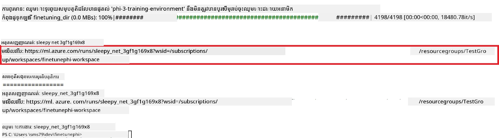

### ដាក់បង្ហាញម៉ូដែលដែលបាន fine-tune

ដើម្បីភ្ជាប់ម៉ូដែល Phi-3 ដែលបាន fine-tune ជាមួយ Prompt Flow អ្នក​ត្រូវ​តែ​ដាក់​បង្ហាញម៉ូដែល ដើម្បីអោយវាអាចចូលប្រើសម្រាប់វិភាគពេលមានការ​ស្នើសុំ ពេលវេលាពិតប្រាកដ។ ដំណើរការនេះរួមមាន ការចុះបញ្ជីម៉ូដែល, បង្កើត endpoint ជាមួយអនឡាញ, និងដាក់បង្ហាញម៉ូដែល។

#### កំណត់ឈ្មោះម៉ូដែល, ឈ្មោះ endpoint និងឈ្មោះ deployment សម្រាប់ការដាក់បង្ហាញ

1. បើក​ហ្វាយ​ល *config.py*។

1. ជំនួស `AZURE_MODEL_NAME = "your_fine_tuned_model_name"` ជាមួយឈ្មោះម៉ូដែលដែលអ្នកចង់បាន។

1. ជំនួស `AZURE_ENDPOINT_NAME = "your_fine_tuned_model_endpoint_name"` ជាមួយឈ្មោះ endpoint ដែលអ្នក​ចង់បាន។

1. ជំនួស `AZURE_DEPLOYMENT_NAME = "your_fine_tuned_model_deployment_name"` ជាមួយឈ្មោះ deployment ដែលអ្នកចង់បាន។

#### បន្ថែមកូដទៅក្នុងហ្វាយ​ល *deploy_model.py*

រត់ហ្វាយ​ល *deploy_model.py* នឹងបំលែងដំណើរការដាក់បង្ហាញទាំងមូលជាអូតូមាទិច។ វាចុះបញ្ជីម៉ូដែល, បង្កើត endpoint និងអនុវត្តការដាក់បង្ហាញដោយផ្អែកលើកំណត់ក្នុង​ហ្វាយ​ល config.py ដែលរួមមាន ឈ្មោះម៉ូដែល, ឈ្មោះ endpoint និងឈ្មោះ deployment។

1. បើក​ហ្វាយ​ល *deploy_model.py* នៅក្នុង Visual Studio Code។

1. បន្ថែម​កូដ​ខាងក្រោម​ទៅក្នុង *deploy_model.py*។

    ```python
    import logging
    from azure.identity import AzureCliCredential
    from azure.ai.ml import MLClient
    from azure.ai.ml.entities import Model, ProbeSettings, ManagedOnlineEndpoint, ManagedOnlineDeployment, IdentityConfiguration, ManagedIdentityConfiguration, OnlineRequestSettings
    from azure.ai.ml.constants import AssetTypes

    # ការនាំចូលផ្គួផ្គាស់
    from config import (
        AZURE_SUBSCRIPTION_ID,
        AZURE_RESOURCE_GROUP_NAME,
        AZURE_ML_WORKSPACE_NAME,
        AZURE_MANAGED_IDENTITY_RESOURCE_ID,
        AZURE_MANAGED_IDENTITY_CLIENT_ID,
        AZURE_MODEL_NAME,
        AZURE_ENDPOINT_NAME,
        AZURE_DEPLOYMENT_NAME
    )

    # អថេរតម្លៃថេរ
    JOB_NAME = "your-job-name"
    COMPUTE_INSTANCE_TYPE = "Standard_E4s_v3"

    deployment_env_vars = {
        "SUBSCRIPTION_ID": AZURE_SUBSCRIPTION_ID,
        "RESOURCE_GROUP_NAME": AZURE_RESOURCE_GROUP_NAME,
        "UAI_CLIENT_ID": AZURE_MANAGED_IDENTITY_CLIENT_ID,
    }

    # ការតម្លើងកំណត់ហេតុ
    logging.basicConfig(
        format="%(asctime)s - %(levelname)s - %(name)s - %(message)s",
        datefmt="%Y-%m-%d %H:%M:%S",
        level=logging.DEBUG
    )
    logger = logging.getLogger(__name__)

    def get_ml_client():
        """Initialize and return the ML Client."""
        credential = AzureCliCredential()
        return MLClient(credential, AZURE_SUBSCRIPTION_ID, AZURE_RESOURCE_GROUP_NAME, AZURE_ML_WORKSPACE_NAME)

    def register_model(ml_client, model_name, job_name):
        """Register a new model."""
        model_path = f"azureml://jobs/{job_name}/outputs/artifacts/paths/model_output"
        logger.info(f"Registering model {model_name} from job {job_name} at path {model_path}.")
        run_model = Model(
            path=model_path,
            name=model_name,
            description="Model created from run.",
            type=AssetTypes.MLFLOW_MODEL,
        )
        model = ml_client.models.create_or_update(run_model)
        logger.info(f"Registered model ID: {model.id}")
        return model

    def delete_existing_endpoint(ml_client, endpoint_name):
        """Delete existing endpoint if it exists."""
        try:
            endpoint_result = ml_client.online_endpoints.get(name=endpoint_name)
            logger.info(f"Deleting existing endpoint {endpoint_name}.")
            ml_client.online_endpoints.begin_delete(name=endpoint_name).result()
            logger.info(f"Deleted existing endpoint {endpoint_name}.")
        except Exception as e:
            logger.info(f"No existing endpoint {endpoint_name} found to delete: {e}")

    def create_or_update_endpoint(ml_client, endpoint_name, description=""):
        """Create or update an endpoint."""
        delete_existing_endpoint(ml_client, endpoint_name)
        logger.info(f"Creating new endpoint {endpoint_name}.")
        endpoint = ManagedOnlineEndpoint(
            name=endpoint_name,
            description=description,
            identity=IdentityConfiguration(
                type="user_assigned",
                user_assigned_identities=[ManagedIdentityConfiguration(resource_id=AZURE_MANAGED_IDENTITY_RESOURCE_ID)]
            )
        )
        endpoint_result = ml_client.online_endpoints.begin_create_or_update(endpoint).result()
        logger.info(f"Created new endpoint {endpoint_name}.")
        return endpoint_result

    def create_or_update_deployment(ml_client, endpoint_name, deployment_name, model):
        """Create or update a deployment."""

        logger.info(f"Creating deployment {deployment_name} for endpoint {endpoint_name}.")
        deployment = ManagedOnlineDeployment(
            name=deployment_name,
            endpoint_name=endpoint_name,
            model=model.id,
            instance_type=COMPUTE_INSTANCE_TYPE,
            instance_count=1,
            environment_variables=deployment_env_vars,
            request_settings=OnlineRequestSettings(
                max_concurrent_requests_per_instance=3,
                request_timeout_ms=180000,
                max_queue_wait_ms=120000
            ),
            liveness_probe=ProbeSettings(
                failure_threshold=30,
                success_threshold=1,
                period=100,
                initial_delay=500,
            ),
            readiness_probe=ProbeSettings(
                failure_threshold=30,
                success_threshold=1,
                period=100,
                initial_delay=500,
            ),
        )
        deployment_result = ml_client.online_deployments.begin_create_or_update(deployment).result()
        logger.info(f"Created deployment {deployment.name} for endpoint {endpoint_name}.")
        return deployment_result

    def set_traffic_to_deployment(ml_client, endpoint_name, deployment_name):
        """Set traffic to the specified deployment."""
        try:
            # ទាញយកព័ត៌មានបច្ចុប្បន្ននៃចំណុចចូល
            endpoint = ml_client.online_endpoints.get(name=endpoint_name)
            
            # កត់ហេតុការចែកចាយចរាចរបច្ចុប្បន្នសម្រាប់ការត្រួតពិនិត្យខុសឆ្គង
            logger.info(f"Current traffic allocation: {endpoint.traffic}")
            
            # កំណត់ការចែកចាយចរាចរសម្រាប់ការដាក់ឲ្យប្រើប្រាស់
            endpoint.traffic = {deployment_name: 100}
            
            # អាប់ដេតចំណុចចូលជាមួយការចែកចាយចរាចរថ្មី
            endpoint_poller = ml_client.online_endpoints.begin_create_or_update(endpoint)
            updated_endpoint = endpoint_poller.result()
            
            # កត់ហេតុកាន់តែច្បាស់ពីការចែកចាយចរាចរបន្ទាប់ពីបានកែប្រែសម្រាប់ការត្រួតពិនិត្យខុសឆ្គង
            logger.info(f"Updated traffic allocation: {updated_endpoint.traffic}")
            logger.info(f"Set traffic to deployment {deployment_name} at endpoint {endpoint_name}.")
            return updated_endpoint
        except Exception as e:
            # កត់ហេតុកំហុសណាមួយដែលកើតឡើងក្នុងដំណើរការ
            logger.error(f"Failed to set traffic to deployment: {e}")
            raise


    def main():
        ml_client = get_ml_client()

        registered_model = register_model(ml_client, AZURE_MODEL_NAME, JOB_NAME)
        logger.info(f"Registered model ID: {registered_model.id}")

        endpoint = create_or_update_endpoint(ml_client, AZURE_ENDPOINT_NAME, "Endpoint for finetuned Phi-3 model")
        logger.info(f"Endpoint {AZURE_ENDPOINT_NAME} is ready.")

        try:
            deployment = create_or_update_deployment(ml_client, AZURE_ENDPOINT_NAME, AZURE_DEPLOYMENT_NAME, registered_model)
            logger.info(f"Deployment {AZURE_DEPLOYMENT_NAME} is created for endpoint {AZURE_ENDPOINT_NAME}.")

            set_traffic_to_deployment(ml_client, AZURE_ENDPOINT_NAME, AZURE_DEPLOYMENT_NAME)
            logger.info(f"Traffic is set to deployment {AZURE_DEPLOYMENT_NAME} at endpoint {AZURE_ENDPOINT_NAME}.")
        except Exception as e:
            logger.error(f"Failed to create or update deployment: {e}")

    if __name__ == "__main__":
        main()

    ```

1. អនុវត្ត​កម្មវិធី​ខាងក្រោម ដើម្បីរក `JOB_NAME`៖

    - ទៅកាន់ Azure Machine Learning resource ដែលអ្នកបានបង្កើត។
    - ជ្រើសរើស **Studio web URL** ដើម្បីបើកកន្លែងការងារ Azure Machine Learning។
    - ជ្រើសរើស **Jobs** ពីផ្នែក tab ខាងឆ្វេង។
    - ជ្រើសរើស_experiment_ សម្រាប់ fine-tuning ឧទាហរណ៍ *finetunephi*។
    - ជ្រើសរើសការងារ​ដែលអ្នកបានបង្កើត។
    - ចម្លង និងបិទបញ្ចូលឈ្មោះការងាររបស់អ្នកទៅ `JOB_NAME = "your-job-name"` នៅក្នុង​ហ្វាយ​ល *deploy_model.py*។

1. ជំនួស `COMPUTE_INSTANCE_TYPE` ជាមួយព័ត៌មានច្បាស់របស់អ្នក។

1. វាយពាក្យបញ្ជាខាងក្រោមដើម្បីរត់ស្ព្រីប៊ី *deploy_model.py* ហើយចាប់ផ្តើមដំណើរការដាក់បង្ហាញនៅក្នុង Azure Machine Learning។

    ```python
    python deploy_model.py
    ```

> [!WARNING]
> ដើម្បីជៀសវាង​ការ​គិតថ្លៃ​បន្ថែម សូមប្រាកដថា​បានលុប endpoint ដែលបានបង្កើតនៅក្នុង Azure Machine Learning workspace។
>

#### ពិនិត្យ​ស្ថានភាពដាក់បង្ហាញនៅក្នុង Azure Machine Learning Workspace
1. ចូលទៅកាន់ [Azure ML Studio](https://ml.azure.com/home?wt.mc_id=studentamb_279723)។

1. ទៅកាន់ទីធ្លាធ្វើការរបស់ Azure Machine Learning ដែលអ្នកបានបង្កើត។

1. ជ្រើសរើស **Studio web URL** ដើម្បីបើកទីធ្លាធ្វើការរបស់ Azure Machine Learning។

1. ជ្រើសរើស **Endpoints** ពីផ្ទាំងខាងឆ្វេង។

    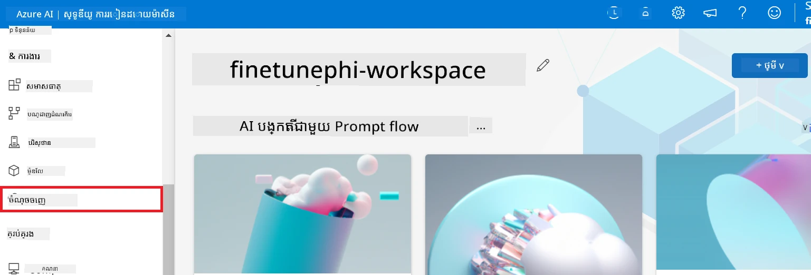

2. ជ្រើសរើស endpoint ដែលអ្នកបានបង្កើត។

    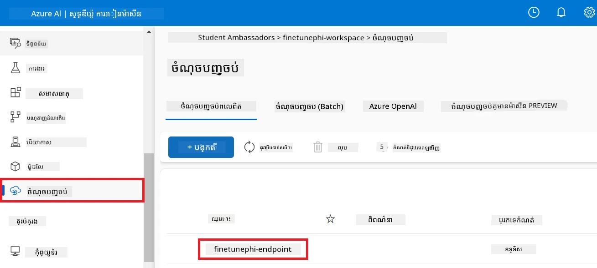

3. នៅលើទំព័រនេះ អ្នកអាចគ្រប់គ្រង endpoints ដែលបានបង្កើតក្នុងអំឡុងពេលដាក់ឱ្យដំណើរការ។

## សេណារីយ៉ូ ៣៖ បញ្ចូលជាមួយ Prompt flow និងចាប់ផ្តើមជជែកជាមួយម៉ូដែលផ្ទាល់ខ្លួនរបស់អ្នក

### បញ្ចូលម៉ូដែល Phi-3 ផ្ទាល់ខ្លួនជាមួយ Prompt flow

បន្ទាប់ពីបានដាក់ម៉ូដែល fine-tuned របស់អ្នកដោយជោគជ័យ អ្នកអាចបញ្ចូលវាជាមួយ Prompt flow ដើម្បីប្រើម៉ូដែលរបស់អ្នកក្នុងកម្មវិធីពេលជាក់ស្តែង នាំឲ្យមានភារកិច្ចអន្តរកម្មនានាជាមួយម៉ូដែល Phi-3 ផ្ទាល់ខ្លួនរបស់អ្នក។

#### កំណត់ក្តារចូល api key និង endpoint uri របស់ម៉ូដែល Phi-3 fine-tuned

1. ទៅកាន់ទីធ្លាធ្វើការរបស់ Azure Machine learning ដែលអ្នកបានបង្កើត។
1. ជ្រើសរើស **Endpoints** ពីផ្ទាំងខាងឆ្វេង។
1. ជ្រើសរើស endpoint ដែលអ្នកបានបង្កើត។
1. ជ្រើសរើស **Consume** ពីម៉ឺនុយនាវាទីង។
1. ចម្លងនិងបិទចូល **REST endpoint** របស់អ្នកទៅឯកសារ *config.py* ជំនួស `AZURE_ML_ENDPOINT = "your_fine_tuned_model_endpoint_uri"` ជាមួយ **REST endpoint** របស់អ្នក។
1. ចម្លងនិងបិទចូល **Primary key** របស់អ្នកទៅឯកសារ *config.py* ជំនួស `AZURE_ML_API_KEY = "your_fine_tuned_model_api_key"` ជាមួយ **Primary key** របស់អ្នក។

    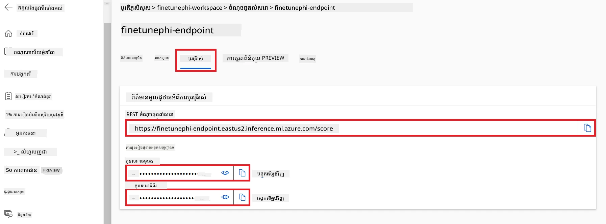

#### បន្ថែមកូដទៅឯកសារ *flow.dag.yml*

1. បើកឯកសារ *flow.dag.yml* ក្នុង Visual Studio Code។

1. បន្ថែមកូដខាងក្រោមទៅក្នុង *flow.dag.yml*។

    ```yml
    inputs:
      input_data:
        type: string
        default: "Who founded Microsoft?"

    outputs:
      answer:
        type: string
        reference: ${integrate_with_promptflow.output}

    nodes:
    - name: integrate_with_promptflow
      type: python
      source:
        type: code
        path: integrate_with_promptflow.py
      inputs:
        input_data: ${inputs.input_data}
    ```

#### បន្ថែមកូដទៅឯកសារ *integrate_with_promptflow.py*

1. បើកឯកសារ *integrate_with_promptflow.py* ក្នុង Visual Studio Code។

1. បន្ថែមកូដខាងក្រោមទៅក្នុង *integrate_with_promptflow.py*។

    ```python
    import logging
    import requests
    from promptflow.core import tool
    import asyncio
    import platform
    from config import (
        AZURE_ML_ENDPOINT,
        AZURE_ML_API_KEY
    )

    # ការរៀបចំការចុះតារាង
    logging.basicConfig(
        format="%(asctime)s - %(levelname)s - %(name)s - %(message)s",
        datefmt="%Y-%m-%d %H:%M:%S",
        level=logging.DEBUG
    )
    logger = logging.getLogger(__name__)

    def query_azml_endpoint(input_data: list, endpoint_url: str, api_key: str) -> str:
        """
        Send a request to the Azure ML endpoint with the given input data.
        """
        headers = {
            "Content-Type": "application/json",
            "Authorization": f"Bearer {api_key}"
        }
        data = {
            "input_data": [input_data],
            "params": {
                "temperature": 0.7,
                "max_new_tokens": 128,
                "do_sample": True,
                "return_full_text": True
            }
        }
        try:
            response = requests.post(endpoint_url, json=data, headers=headers)
            response.raise_for_status()
            result = response.json()[0]
            logger.info("Successfully received response from Azure ML Endpoint.")
            return result
        except requests.exceptions.RequestException as e:
            logger.error(f"Error querying Azure ML Endpoint: {e}")
            raise

    def setup_asyncio_policy():
        """
        Setup asyncio event loop policy for Windows.
        """
        if platform.system() == 'Windows':
            asyncio.set_event_loop_policy(asyncio.WindowsSelectorEventLoopPolicy())
            logger.info("Set Windows asyncio event loop policy.")

    @tool
    def my_python_tool(input_data: str) -> str:
        """
        Tool function to process input data and query the Azure ML endpoint.
        """
        setup_asyncio_policy()
        return query_azml_endpoint(input_data, AZURE_ML_ENDPOINT, AZURE_ML_API_KEY)

    ```

### ជជែកជាមួយម៉ូដែលផ្ទាល់ខ្លួនរបស់អ្នក

1. វាយបញ្ជា​ខាងក្រោមដើម្បីរត់ស្គ្រីប *deploy_model.py* និងចាប់ផ្តើមដំណើរការដាក់ចេញម៉ូដែលនៅក្នុង Azure Machine Learning។

    ```python
    pf flow serve --source ./ --port 8080 --host localhost
    ```

1. នេះគឺជាឧទាហរណ៍លទ្ធផល៖ ឥឡូវនេះអ្នកអាចជជែកជាមួយម៉ូដែល Phi-3 ផ្ទាល់ខ្លួនរបស់អ្នក។ គួរត្រូវបានណែនាំឲ្យសួរប្រកបដោយសំណួរដែលផ្អែកលើទិន្នន័យដែលបានប្រើសម្រាប់ការតម្រៀប fine-tuning។

    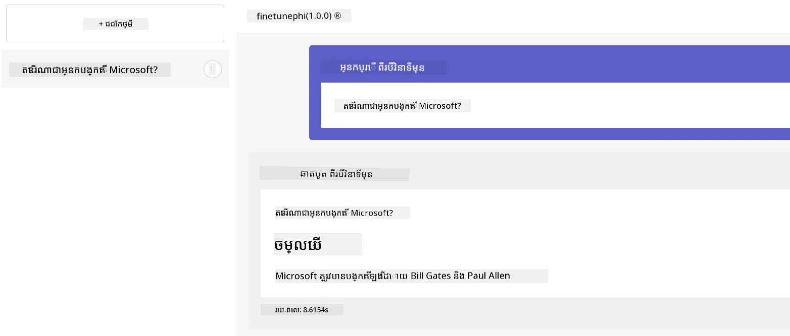

---

<!-- CO-OP TRANSLATOR DISCLAIMER START -->
**ការបដិសេធ**:  
ឯកសារនេះត្រូវបានបកប្រែដោយប្រើសេវាបកប្រែ AI [Co-op Translator](https://github.com/Azure/co-op-translator)។ ខណៈពេលយើងខិតខំរកភាពត្រឹមត្រូវ សូមយល់ដឹងថាការបកប្រែដោយស្វ័យប្រវត្តិអាចមានកំហុស ឬមិនត្រឹមត្រូវខ្លះ។ ឯកសារដើមក្នុងភាសារបស់វាគួរត្រូវបានគិតថាជាអ្នកផ្តល់ព័ត៌មានដាច់ឯកភាព។ សម្រាប់ព័ត៌មានសំខាន់ៗ យើងស្នើឱ្យមានការបកប្រែដោយអ្នកជំនាញផ្នែកមនុស្ស។ យើងមិនទទួលខុសត្រូវចំពោះការយល់ច្រឡំ ឬការបកប្រែខុសពីការប្រើប្រាស់ការបកប្រែនេះឡើយ។
<!-- CO-OP TRANSLATOR DISCLAIMER END -->