# បង្កើតម៉ូឌែល Phi-3 ផ្ទាល់ខ្លួន និងបញ្ចូលជាមួយ Prompt flow ក្នុង Microsoft Foundry

គំរូចប់-ដល់-ចប់ (E2E) នេះអាស្រ័យលើមគ្គុទេសក៍ "[Fine-Tune and Integrate Custom Phi-3 Models with Prompt Flow in Microsoft Foundry](https://techcommunity.microsoft.com/t5/educator-developer-blog/fine-tune-and-integrate-custom-phi-3-models-with-prompt-flow-in/ba-p/4191726?WT.mc_id=aiml-137032-kinfeylo)" ពីសហគមន៍បច្ចេកវិទ្យារបស់ Microsoft។ វាណែនាំដំណើរការនៃការកែសម្រួលយ៉ាងម៉ត់ចត់ ការដាក់បង្ហោះ និងការបញ្ចូលម៉ូឌែល Phi-3 ផ្ទាល់ខ្លួនជាមួយ Prompt flow ក្នុង Microsoft Foundry។ មិនដូចគំរូ E2E "[Fine-Tune and Integrate Custom Phi-3 Models with Prompt Flow](./E2E_Phi-3-FineTuning_PromptFlow_Integration.md)" ដែលពាក់ព័ន្ធនឹងការប្រតិបត្តិកូដក្នុងម៉ាស៊ីនរបស់អ្នកទេ មេរៀននេះផ្តោតសំខាន់ទៅលើការកែសម្រួលយ៉ាងម៉ត់ចត់ និងការបញ្ចូលម៉ូឌែលរបស់អ្នកនៅក្នុង Azure AI / ML Studio។

## ទិដ្ឋភាពទូទៅ

ក្នុងគំរូ E2E នេះ អ្នកនឹងរៀនពីរបៀបកែសម្រួលយ៉ាងម៉ត់ចត់ម៉ូឌែល Phi-3 និងបញ្ចូលវាជាមួយ Prompt flow ក្នុង Microsoft Foundry។ ដោយប្រើប្រាស់ Azure AI / ML Studio អ្នកនឹងបង្កើតផ្លូវដំណើរការសម្រាប់ការដាក់បង្ហោះ និងប្រើប្រាស់ម៉ូឌែល AI ផ្ទាល់ខ្លួន។ គំរូ E2E នេះចែកចាយជាបីសេណារីយ៉ូ៖

**សេណារីយ៉ូ 1: រៀបចំធនធាន Azure និងត្រៀមសម្រាប់ការកែសម្រួលយ៉ាងម៉ត់ចត់**

**សេណារីយ៉ូ 2: កែសម្រួលយ៉ាងម៉ត់ចត់ម៉ូឌែល Phi-3 និងដាក់បង្ហោះក្នុង Azure Machine Learning Studio**

**សេណារីយ៉ូ 3: បញ្ចូលជាមួយ Prompt flow និងសន្ទនាជាមួយម៉ូឌែលផ្ទាល់ខ្លួនរបស់អ្នកក្នុង Microsoft Foundry**

នេះជា​ទិដ្ឋភាពទូទៅនៃគំរូ E2E នេះ៖

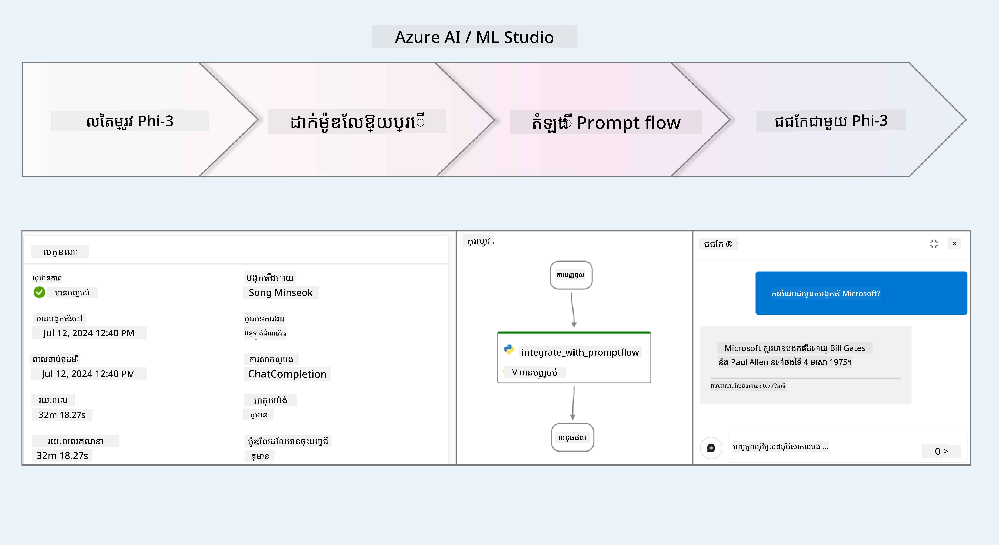

### តារាងមាតិកា

1. **[សេណារីយ៉ូ 1: រៀបចំធនធាន Azure និងត្រៀមសម្រាប់ការកែសម្រួលយ៉ាងម៉ត់ចត់](#សេណារីយ៉ូ-1-រៀបចំធនធាន-azure-និងត្រៀមសម្រាប់ការកែសម្រួលយ៉ាងម៉ត់ចត់)**
    - [បង្កើតមជ្ឈមណ្ឌល Azure Machine Learning](#បង្កើតមជ្ឈមណ្ឌល-azure-machine-learning)
    - [ស្នើសុំកំណត់ GPU quota ក្នុងការជាវ Azure](#ស្នើសុំកំណត់-gpu-quota-ក្នុងការជាវ-azure)
    - [បន្ថែមការបំពេញតួនាទី](#បន្ថែមការបំពេញតួនាទី)
    - [រៀបចំគម្រោង](#រៀបចំគម្រោង)
    - [ត្រៀមកំណត់ទិន្នន័យសម្រាប់ការកែសម្រួល](#រៀបចំឃ្លាំងទិន្នន័យសម្រាប់ថ្នាក់បង្រៀនបន្ថែម)

1. **[សេណារីយ៉ូ 2: កែសម្រួលយ៉ាងម៉ត់ចត់ម៉ូឌែល Phi-3 និងដាក់បង្ហោះក្នុង Azure Machine Learning Studio](#សេណារីយ៉ូ-2៖-ថ្នាក់បង្រៀនបន្ថែមម៉ូដែល-phi-3-និងបង្ហោះនៅក្នុង-azure-machine-learning-studio)**
    - [កែសម្រួលយ៉ាងម៉ត់ចត់ម៉ូឌែល Phi-3](#ថ្នាក់បង្រៀនបន្ថែមម៉ូដែល-phi-3)
    - [ដាក់បង្ហោះម៉ូឌែល Phi-3 ដែលបានកែសម្រួល](#បង្ហោះម៉ូដែល-phi-3-ដែលបានថ្នាក់បង្រៀនបន្ថែម)

1. **[សេណារីយ៉ូ 3: បញ្ចូលជាមួយ Prompt flow និងសន្ទនាជាមួយម៉ូឌែលផ្ទាល់ខ្លួនរបស់អ្នកនៅក្នុង Microsoft Foundry](#scenario-3-integrate-with-prompt-flow-and-chat-with-your-custom-model-in-azure-ai-studio)**
    - [បញ្ចូលម៉ូឌែល Phi-3 ផ្ទាល់ខ្លួនជាមួយ Prompt flow](#បញ្ចូលម៉ូដែល-phi-3-ផ្ទាល់ខ្លួនជាមួយ-prompt-flow)
    - [សន្ទនាជាមួយម៉ូឌែល Phi-3 ផ្ទាល់ខ្លួនរបស់អ្នក](#ជជែកជាមួយម៉ូឌែល-phi-3-ផ្ទាល់ខ្លួនរបស់អ្នក)

## សេណារីយ៉ូ 1: រៀបចំធនធាន Azure និងត្រៀមសម្រាប់ការកែសម្រួលយ៉ាងម៉ត់ចត់

### បង្កើតមជ្ឈមណ្ឌល Azure Machine Learning

1. វាយពាក្យ *azure machine learning* នៅក្នុង **ប្រអប់ស្វែងរក** ខាងលើនៃទំព័រពហុបណ្តាញ ហើយជ្រើស **Azure Machine Learning** ពីជម្រើសដែលបង្ហាញ។

    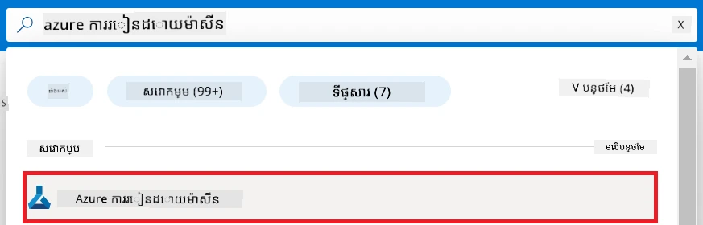

2. ជ្រើស **+ Create** ពីម៉ឺនុយរុករក។

3. ជ្រើស **New workspace** ពីម៉ឺនុយរុករក។

    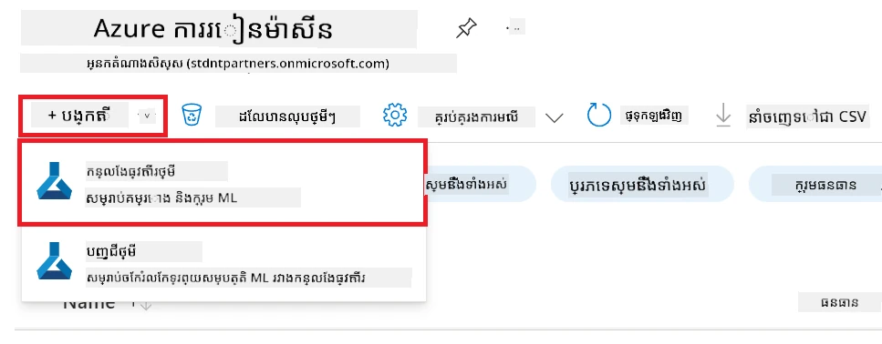

4. អនុវត្តការងារដូចខាងក្រោម៖

    - ជ្រើស **Subscription** របស់ Azure របស់អ្នក។
    - ជ្រើស **Resource group** ដែលត្រូវប្រើ (បង្កើតថ្មី ប្រសិនបើចាំបាច់)។
    - បញ្ចូល **Workspace Name** ដែលត្រូវមានតម្លៃតែមួយវិនិច្ឆ័យ។
    - ជ្រើស **Region** ដែលអ្នកចង់ប្រើ។
    - ជ្រើស **Storage account** ដែលត្រូវប្រើ (បង្កើតថ្មី ប្រសិនបើចាំបាច់)។
    - ជ្រើស **Key vault** ដែលត្រូវប្រើ (បង្កើតថ្មី ប្រសិនបើចាំបាច់)។
    - ជ្រើស **Application insights** ដែលត្រូវប្រើ (បង្កើតថ្មី ប្រសិនបើចាំបាច់)។
    - ជ្រើស **Container registry** ដែលត្រូវប្រើ (បង្កើតថ្មី ប្រសិនបើចាំបាច់)។

    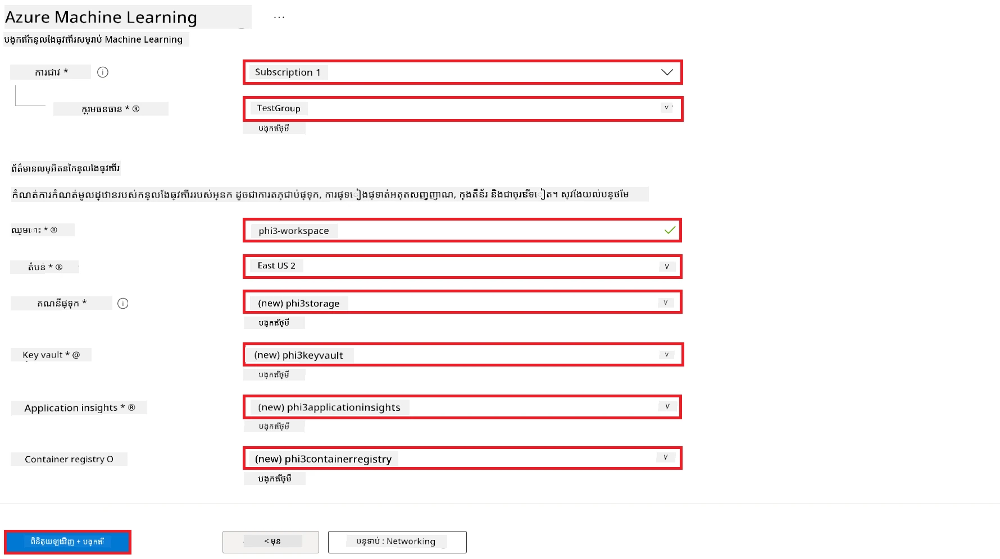

5. ជ្រើស **Review + Create**។

6. ជ្រើស **Create**។

### ស្នើសុំកំណត់ GPU quota ក្នុងការជាវ Azure

ក្នុងមេរៀននេះ អ្នកនឹងរៀនពីរបៀបកែសម្រួលយ៉ាងម៉ត់ចត់ និងដាក់បង្ហោះម៉ូឌែល Phi-3 ដោយប្រើ GPU ។ សម្រាប់ការកែសម្រួល អ្នកនឹងប្រើ GPU ប្រភេទ *Standard_NC24ads_A100_v4* ដែលត្រូវការស្នើសុំ quota ។ សម្រាប់ការដាក់បង្ហោះ អ្នកនឹងប្រើ GPU ប្រភេទ *Standard_NC6s_v3* ដែលក៏ត្រូវការស្នើសុំ quota ផងដែរ។

> [!NOTE]
>
> គ្រាន់តែនៅក្នុងការជាវ Pay-As-You-Go (ប្រភេទជាវស្តង់ដារ) មានសិទ្ធិក្នុងការទទួលបានចំណាត់ថ្នាក់ GPU ខណៈដែលប្រភេទជាវប្រយោជន៍មិនគាំទ្រនៅឡើយ។
>

1. ចូលទៅកាន់ [Azure ML Studio](https://ml.azure.com/home?wt.mc_id=studentamb_279723)។

1. អនុវត្តការងារដូចខាងក្រោមសម្រាប់ស្នើសុំ quota *Standard NCADSA100v4 Family*៖

    - ជ្រើស **Quota** ពីប៊ូតុងខាងឆ្វេង។
    - ជ្រើស **Virtual machine family** ដែលត្រូវប្រើ។ ឧទាហរណ៍ ជ្រើស **Standard NCADSA100v4 Family Cluster Dedicated vCPUs** ដែលមាន GPU ប្រភេទ *Standard_NC24ads_A100_v4* ។
    - ជ្រើស **Request quota** ពីម៉ឺនុយរុករក។

        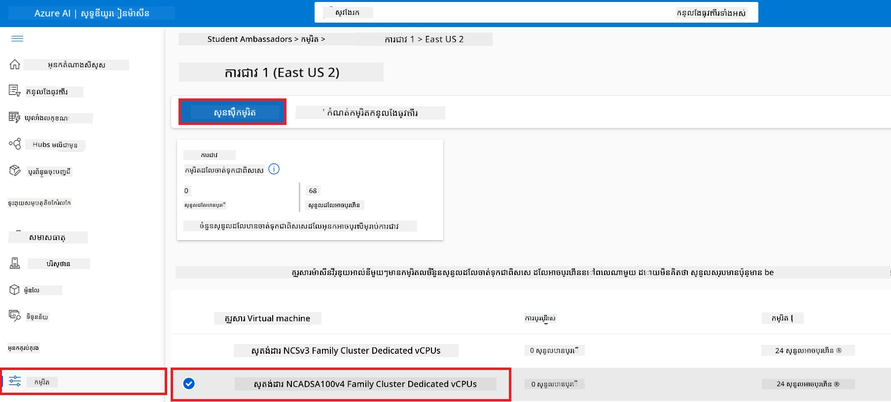

    - នៅក្នុងទំព័រ Request quota បញ្ចូល **New cores limit** ដែលអ្នកចង់ប្រើ។ ឧទាហរណ៍ 24។
    - នៅក្នុងទំព័រ Request quota ជ្រើស **Submit** ដើម្បីស្នើសុំកំណត់ quota GPU ។

1. អនុវត្តការងារដូចខាងក្រោមសម្រាប់ស្នើសុំ quota *Standard NCSv3 Family*៖

    - ជ្រើស **Quota** ពីប៊ូតុងខាងឆ្វេង។
    - ជ្រើស **Virtual machine family** ដែលត្រូវប្រើ។ ឧទាហរណ៍ ជ្រើស **Standard NCSv3 Family Cluster Dedicated vCPUs** ដែលមាន GPU ប្រភេទ *Standard_NC6s_v3* ។
    - ជ្រើស **Request quota** ពីម៉ឺនុយរុករក។
    - នៅក្នុងទំព័រ Request quota បញ្ចូល **New cores limit** ដែលអ្នកចង់ប្រើ។ ឧទាហរណ៍ 24។
    - នៅក្នុងទំព័រ Request quota ជ្រើស **Submit** ដើម្បីស្នើសុំកំណត់ quota GPU ។

### បន្ថែមការបំពេញតួនាទី

ដើម្បីកែសម្រួល និងដាក់បង្ហោះម៉ូឌែលរបស់អ្នក អ្នកត្រូវបង្កើត សមាសភាគគ្រប់គ្រងអត្តសញ្ញាណ (User Assigned Managed Identity - UAI) មួយ និងផ្ដល់អនុញ្ញាតត្រូវការ។ UAI នេះនឹងប្រើសម្រាប់ការផ្ទៀងផ្ទាត់អត្តសញ្ញាណពេលដាក់បង្ហោះ។

#### បង្កើត User Assigned Managed Identity (UAI)

1. វាយពាក្យ *managed identities* នៅក្នុង **ប្រអប់ស្វែងរក** ខាងលើនៃទំព័រពហុបណ្តាញ ហើយជ្រើស **Managed Identities** ពីជម្រើសដែលបង្ហាញ។

    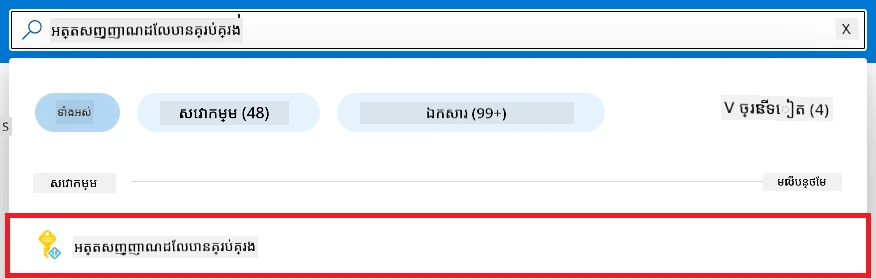

1. ជ្រើស **+ Create**។

    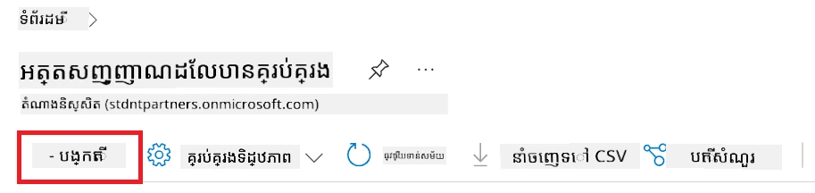

1. អនុវត្តការងារដូចខាងក្រោម៖

    - ជ្រើស Azure **Subscription** របស់អ្នក។
    - ជ្រើស **Resource group** ដែលត្រូវប្រើ (បង្កើតថ្មី ប្រសិនបើចាំបាច់)។
    - ជ្រើស **Region** ដែលអ្នកចង់ប្រើ។
    - បញ្ចូល **Name** ដែលត្រូវមានតម្លៃតែមួយវិនិច្ឆ័យ។

    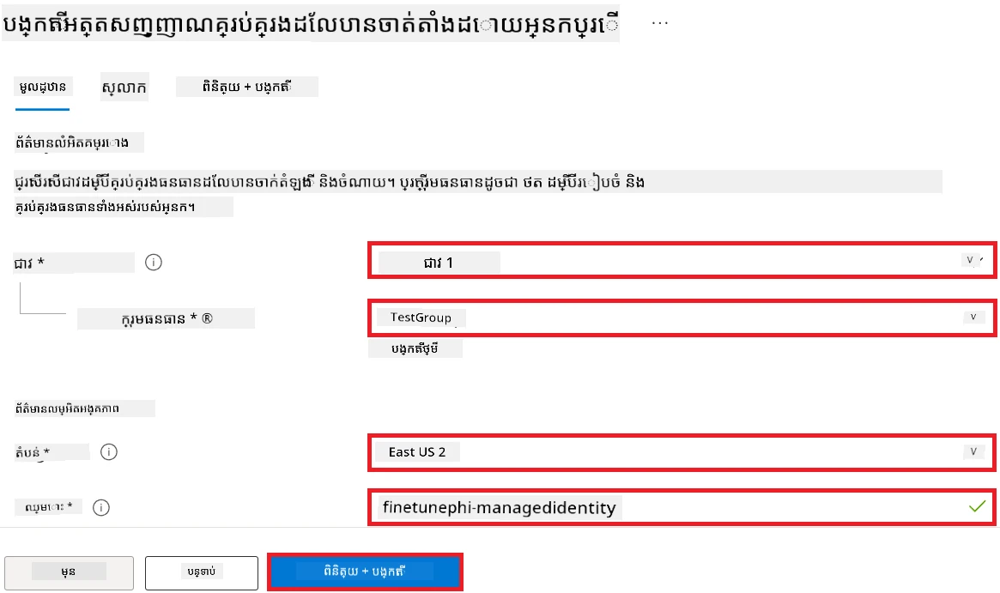

1. ជ្រើស **Review + create**។

1. ជ្រើស **+ Create**។

#### បន្ថែមតួនាទី Contributor ទៅ Managed Identity

1. ទៅកាន់ធនធាន Managed Identity ដែលអ្នកបានបង្កើត។

1. ជ្រើស **Azure role assignments** ពីប៊ូតុងខាងឆ្វេង។

1. ជ្រើស **+Add role assignment** ពីម៉ឺនុយរុករក។

1. នៅក្នុងទំព័រ Add role assignment អនុវត្តការងារដូចខាងក្រោម៖
    - ជ្រើស **Scope** ទៅ **Resource group**។
    - ជ្រើស Azure **Subscription** របស់អ្នក។
    - ជ្រើស **Resource group** ដែលត្រូវប្រើ។
    - ជ្រើស **Role** ទៅ **Contributor**។

    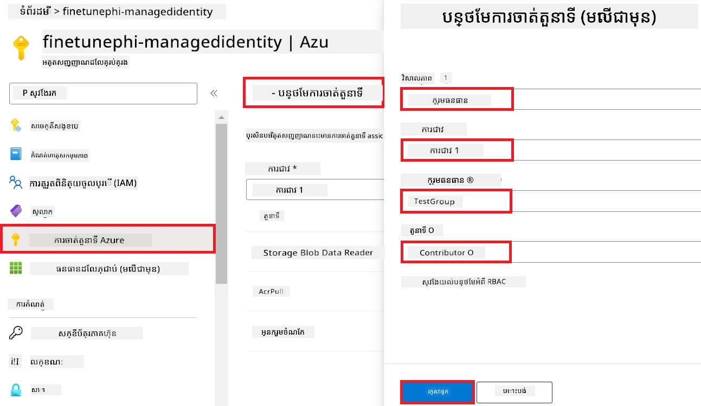

2. ជ្រើស **Save**។

#### បន្ថែមតួនាទី Storage Blob Data Reader ទៅ Managed Identity

1. វាយពាក្យ *storage accounts* នៅក្នុង **ប្រអប់ស្វែងរក** ខាងលើនៃទំព័រពហុបណ្តាញ ហើយជ្រើស **Storage accounts** ពីជម្រើសដែលបង្ហាញ។

    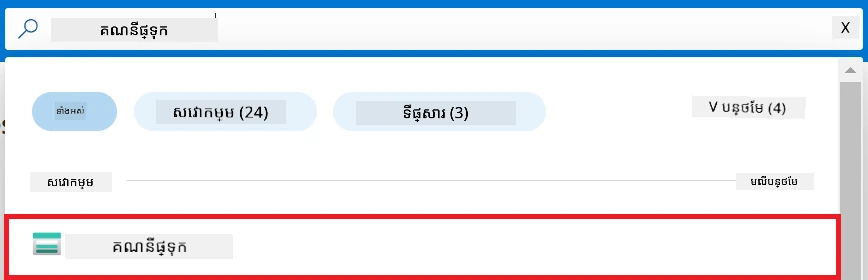

1. ជ្រើសគណនី storage ដែលភ្ជាប់ជាមួយ Azure Machine Learning workspace ដែលអ្នកបានបង្កើត។ ឧទាហរណ៍ *finetunephistorage*។

1. អនុវត្តការងារដូចខាងក្រោមដើម្បីចូលទៅដល់ទំព័រ Add role assignment៖

    - ទៅកាន់ Azure Storage account ដែលបានបង្កើត។
    - ជ្រើស **Access Control (IAM)** ពីប៊ូតុងខាងឆ្វេង។
    - ជ្រើស **+ Add** ពីម៉ឺនុយរុករក។
    - ជ្រើស **Add role assignment** ពីម៉ឺនុយរុករក។

    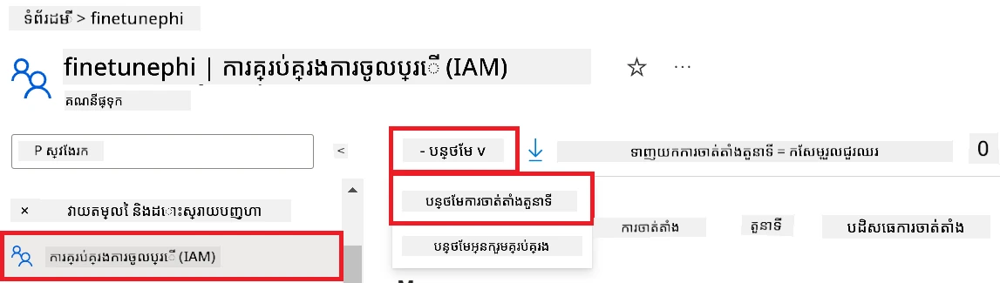

1. នៅក្នុងទំព័រ Add role assignment អនុវត្តការងារដូចខាងក្រោម៖

    - នៅក្នុងទំព័រ Role វាយពាក្យ *Storage Blob Data Reader* ក្នុង **ប្រអប់ស្វែងរក** ហើយជ្រើស **Storage Blob Data Reader** ពីជម្រើសដែលបង្ហាញ។
    - នៅនៅក្នុងទំព័រ Role ជ្រើស **Next**។
    - នៅក្នុងទំព័រ Members ជ្រើស **Assign access to** **Managed identity**។
    - នៅក្នុង Members page ជ្រើស **+ Select members**។
    - នៅក្នុងទំព័រ Select managed identities ជ្រើស Azure **Subscription** របស់អ្នក។
    - នៅក្នុងទំព័រ Select managed identities ជ្រើស **Managed identity** ទៅ **Manage Identity**។
    - នៅក្នុងទំព័រ Select managed identities ជ្រើស Manage Identity ដែលអ្នកបានបង្កើត។ ឧទាហរណ៍ *finetunephi-managedidentity*។
    - នៅក្នុងទំព័រ Select managed identities ជ្រើស **Select**។

    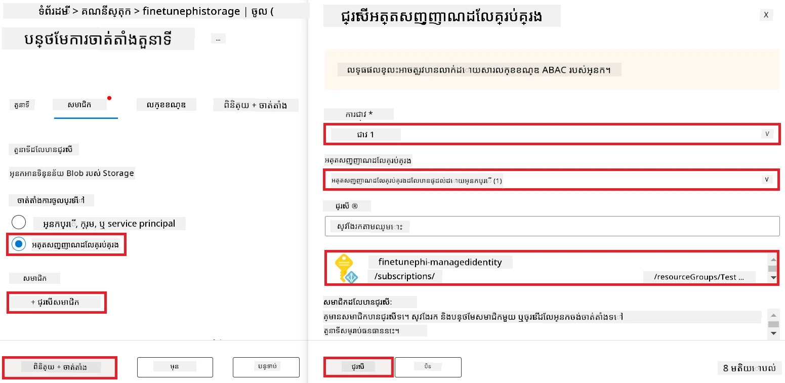

1. ជ្រើស **Review + assign**។

#### បន្ថែមតួនាទី AcrPull ទៅ Managed Identity

1. វាយពាក្យ *container registries* នៅក្នុង **ប្រអប់ស្វែងរក** ខាងលើនៃទំព័រពហុបណ្តាញ ហើយជ្រើស **Container registries** ពីជម្រើសដែលបង្ហាញ។

    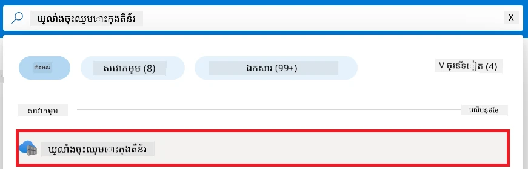

1. ជ្រើស container registry ដែលភ្ជាប់ជាមួយ Azure Machine Learning workspace។ ឧទាហរណ៍ *finetunephicontainerregistry*

1. អនុវត្តការងារដូចខាងក្រោមដើម្បីចូលទៅដល់ទំព័រ Add role assignment៖

    - ជ្រើស **Access Control (IAM)** ពីប៊ូតុងខាងឆ្វេង។
    - ជ្រើស **+ Add** ពីម៉ឺនុយរុករក។
    - ជ្រើស **Add role assignment** ពីម៉ឺនុយរុករក។

1. នៅក្នុងទំព័រ Add role assignment អនុវត្តការងារដូចខាងក្រោម៖

    - នៅក្នុងទំព័រ Role វាយពាក្យ *AcrPull* ក្នុង **ប្រអប់ស្វែងរក** ហើយជ្រើស **AcrPull** ពីជម្រើសដែលបង្ហាញ។
    - នៅក្នុងទំព័រ Role ជ្រើស **Next**។
    - នៅក្នុងទំព័រ Members ជ្រើស **Assign access to** **Managed identity**។
    - នៅក្នុង Members page ជ្រើស **+ Select members**។
    - នៅក្នុងទំព័រ Select managed identities ជ្រើស Azure **Subscription** របស់អ្នក។
    - នៅក្នុងទំព័រ Select managed identities ជ្រើស **Managed identity** ទៅ **Manage Identity**។
    - នៅក្នុងទំព័រ Select managed identities ជ្រើស Manage Identity ដែលអ្នកបានបង្កើត។ ឧទាហរណ៍ *finetunephi-managedidentity*។
    - នៅក្នុងទំព័រ Select managed identities ជ្រើស **Select**។
    - ជ្រើស **Review + assign**។

### រៀបចំគម្រោង

ដើម្បីទាញយកកំណត់ទិន្នន័យដែលចាំបាច់សម្រាប់ការកែសម្រួល អ្នកត្រូវរៀបចំបរិស្ថានក្នុងស្រុក។

ក្នុងប្រតិបត្តិការនេះ អ្នកនឹង

- បង្កើតថតមួយសម្រាប់ធ្វើការ។
- បង្កើតបរិស្ថានប្រតិបត្តិការហួសកំណត់។
- ដំឡើងកញ្ចប់ដែលចាំបាច់។
- បង្កើតឯកសារ *download_dataset.py* ដើម្បីទាញយកកំណត់ទិន្នន័យ។

#### បង្កើតថតសម្រាប់ធ្វើការ

1. បើកផ្ទាំង terminal និងវាយពាក្យបញ្ជាខាងក្រោមដើម្បីបង្កើតថតមានឈ្មោះ *finetune-phi* នៅទីតាំងលំនឹង។

    ```console
    mkdir finetune-phi
    ```
  
2. វាយពាក្យបញ្ជាខាងក្រោមក្នុង terminal របស់អ្នកដើម្បីទៅកាន់ថត *finetune-phi* ដែលបានបង្កើត។

    ```console
    cd finetune-phi
    ```
  
#### បង្កើតបរិស្ថានប្រតិបត្តិការហួសកំណត់

1. វាយពាក្យបញ្ជាខាងក្រោមក្នុង terminal របស់អ្នកដើម្បីបង្កើតបរិស្ថានប្រតិបត្តិការហួសកំណត់មានឈ្មោះ *.venv*។
    ```console
    python -m venv .venv
    ```

2. វាយបញ្ជាដូចខាងក្រោមនៅក្នុងកញ្ចប់បញ្ជារបស់អ្នកដើម្បីបើកបរិស្ថានវីរុច។

    ```console
    .venv\Scripts\activate.bat
    ```

> [!NOTE]
> ប្រសិនបើវាដំណើរការ សូមមើលឃើញ *(.venv)* មុនសញ្ញាបញ្ជា។

#### តំឡើងកញ្ចប់ដែលត្រូវការ

1. វាយបញ្ជាដូចខាងក្រោមនៅក្នុងកញ្ចប់បញ្ជារបស់អ្នកដើម្បីតំឡើងកញ្ចប់ដែលត្រូវការ។

    ```console
    pip install datasets==2.19.1
    ```

#### បង្កើត `donload_dataset.py`

> [!NOTE]
> រចនាសម្ព័ន្ធថត​ពេញលេញ៖
>
> ```text
> └── YourUserName
> .    └── finetune-phi
> .        └── download_dataset.py
> ```

1. បើក **Visual Studio Code**។

1. ជ្រើស **File** ពីរបារម៉ឺនុយ។

1. ជ្រើស **Open Folder**។

1. ជ្រើសថត *finetune-phi* ដែលអ្នកបានបង្កើត ដែលស្ថិតនៅ *C:\Users\yourUserName\finetune-phi*។

    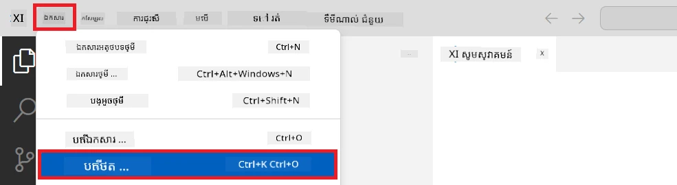

1. នៅផ្នែកខាងឆ្វេងនៃ Visual Studio Code ចុចជ្រៀតមុខស្ដាំហើយជ្រើស **New File** ដើម្បីបង្កើតឯកសារថ្មីមានឈ្មោះ *download_dataset.py*។

    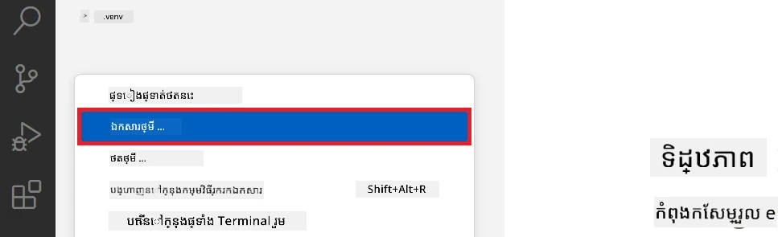

### រៀបចំឃ្លាំងទិន្នន័យសម្រាប់ថ្នាក់បង្រៀនបន្ថែម

ក្នុងលំហាត់នេះ អ្នកនឹងរត់ឯកសារ *download_dataset.py* ដើម្បីទាញយកឃ្លាំងទិន្នន័យ *ultrachat_200k* ទៅបរិស្ថានក្នុងស្រុករបស់អ្នក។ អ្នកនឹងប្រើឃ្លាំងទិន្នន័យនេះដើម្បីបង្រៀនបន្ថែមម៉ូដែល Phi-3 នៅ Azure Machine Learning។

ក្នុងលំហាត់នេះ អ្នកនឹង៖

- បន្ថែមកូដទៅឯកសារ *download_dataset.py* ដើម្បីទាញយកឃ្លាំងទិន្នន័យ។
- រត់ឯកសារ *download_dataset.py* ដើម្បីទាញយកឃ្លាំងទិន្នន័យទៅបរិស្ថានក្នុងស្រុក។

#### ទាញយកឃ្លាំងទិន្នន័យរបស់អ្នកដោយប្រើ *download_dataset.py*

1. បើកឯកសារ *download_dataset.py* ក្នុង Visual Studio Code។

1. បន្ថែមកូដដូចខាងក្រោមចូលទៅក្នុងឯកសារ *download_dataset.py* ។

    ```python
    import json
    import os
    from datasets import load_dataset

    def load_and_split_dataset(dataset_name, config_name, split_ratio):
        """
        Load and split a dataset.
        """
        # ប្តូរទិន្នន័យជាមួយនឹងឈ្មោះ ការកំណត់ និងអត្រាបំបែកដែលបានកំណត់
        dataset = load_dataset(dataset_name, config_name, split=split_ratio)
        print(f"Original dataset size: {len(dataset)}")
        
        # បំបែកទិន្នន័យជាសំណុំហ្វឹកហាត់ និងសំណុំសាកល្បង (80% សម្រាប់ហ្វឹកហាត់, 20% សម្រាប់សាកល្បង)
        split_dataset = dataset.train_test_split(test_size=0.2)
        print(f"Train dataset size: {len(split_dataset['train'])}")
        print(f"Test dataset size: {len(split_dataset['test'])}")
        
        return split_dataset

    def save_dataset_to_jsonl(dataset, filepath):
        """
        Save a dataset to a JSONL file.
        """
        # បង្កើតថតទិន្នន័យបើវាមិនមាន
        os.makedirs(os.path.dirname(filepath), exist_ok=True)
        
        # បើកឯកសារជារបៀបសរសេរ
        with open(filepath, 'w', encoding='utf-8') as f:
            # ធ្វើមូលដ្ឋានលើកំណត់ត្រាទាំងអស់ក្នុងទិន្នន័យ
            for record in dataset:
                # ទម្លាក់កំណត់ត្រាជាវត្ថុ JSON និងសរសេរទៅក្នុងឯកសារ
                json.dump(record, f)
                # សរសេរអក្សរបន្ទាត់ថ្មីដើម្បីបំបែកកំណត់ត្រា
                f.write('\n')
        
        print(f"Dataset saved to {filepath}")

    def main():
        """
        Main function to load, split, and save the dataset.
        """
        # បន្ទាប់ និងបំបែក dataset ULTRACHAT_200k ជាមួយការកំណត់ និងអត្រាបំបែកជាក់លាក់
        dataset = load_and_split_dataset("HuggingFaceH4/ultrachat_200k", 'default', 'train_sft[:1%]')
        
        # ដកយក dataset ហ្វឹកហាត់ និងសាកល្បងពីការបំបែក
        train_dataset = dataset['train']
        test_dataset = dataset['test']

        # រក្សាទុក dataset ហ្វឹកហាត់ទៅឯកសារ JSONL
        save_dataset_to_jsonl(train_dataset, "data/train_data.jsonl")
        
        # រក្សាទុក dataset សាកល្បងទៅឯកសារ JSONL ផ្សេងទៀត
        save_dataset_to_jsonl(test_dataset, "data/test_data.jsonl")

    if __name__ == "__main__":
        main()

    ```

1. វាយបញ្ជាដូចខាងក្រោមនៅក្នុងកញ្ចប់បញ្ជារដើម្បីរត់ស្គ្រីបต์និងទាញយកឃ្លាំងទិន្នន័យទៅបរិស្ថានក្នុងស្រុករបស់អ្នក។

    ```console
    python download_dataset.py
    ```

1. ពិនិត្យមើលថាឃ្លាំងទិន្នន័យត្រូវបានរក្សាទុកដោយជោគជ័យនៅក្នុងថត *finetune-phi/data* ក្នុងស្រុករបស់អ្នក។

> [!NOTE]
>
> #### កំណត់សម្គាល់អំពីទំហំឃ្លាំងទិន្នន័យ និងពេលវេលាថ្នាក់បង្រៀនបន្ថែម
>
> ក្នុងមេរៀននេះ អ្នកប្រើតែ 1% នៃឃ្លាំងទិន្នន័យ (`split='train[:1%]'`)។ នេះបន្ថយបរិមាណទិន្នន័យយ៉ាងខ្លាំង បង្កើនល្បឿនក្នុងការផ្ទុកឡើងនិងថ្នាក់បង្រៀនបន្ថែម។ អ្នកអាចកែប្រែភាគរយនេះដើម្បីស្វែងរកតុល្យភាពល្អបំផុតរវាងពេលវេលាដំឡើងនិងការសម្របសម្រួលម៉ូដែល។ ការប្រើមួយផ្នែកតូចនៃឃ្លាំងទិន្នន័យកាត់បន្ថយពេលវេលាថ្នាក់បង្រៀនបន្ថែម ធ្វើឲ្យដំណើរការមានភាពងាយស្រួលសម្រាប់មេរៀន។

## សេណារីយ៉ូ 2៖ ថ្នាក់បង្រៀនបន្ថែមម៉ូដែល Phi-3 និងបង្ហោះនៅក្នុង Azure Machine Learning Studio

### ថ្នាក់បង្រៀនបន្ថែមម៉ូដែល Phi-3

ក្នុងលំហាត់នេះ អ្នកនឹងថ្នាក់បង្រៀនបន្ថែមម៉ូដែល Phi-3 នៅ Azure Machine Learning Studio។

ក្នុងលំហាត់នេះ អ្នកនឹង៖

- បង្កើតក្លាស្ទ័រកុំព្យូទ័រសម្រាប់ថ្នាក់បង្រៀនបន្ថែម។
- ថ្នាក់បង្រៀនបន្ថែមម៉ូដែល Phi-3 នៅ Azure Machine Learning Studio។

#### បង្កើតក្លាស្ទ័រកុំព្យូទ័រសម្រាប់ថ្នាក់បង្រៀនបន្ថែម

1. ចូលទៅកាន់ [Azure ML Studio](https://ml.azure.com/home?wt.mc_id=studentamb_279723)។

1. ជ្រើស **Compute** ពីផ្នែកខាងឆ្វេង។

1. ជ្រើស **Compute clusters** ពីម៉ឺនុយនាវីហ្គេស្យុង។

1. ជ្រើស **+ New**។

    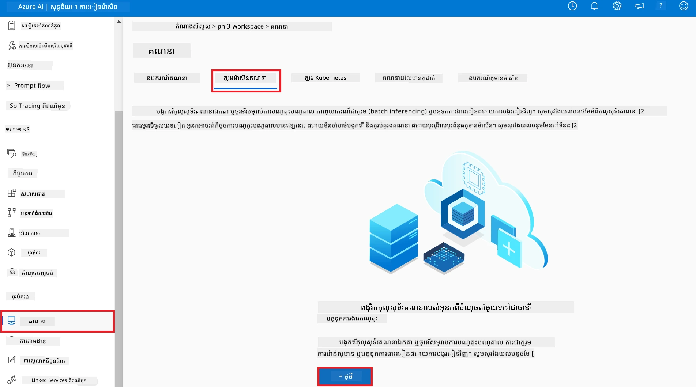

1. ធ្វើការងារដូចខាងក្រោម៖

    - ជ្រើស **Region** ដែលអ្នកចង់ប្រើ។
    - ជ្រើស **Virtual machine tier** ជា **Dedicated**។
    - ជ្រើស **Virtual machine type** ជា **GPU**។
    - ជ្រើសម៉ាស៊ីនវីរុចម៉ាស៊ីនត្រង់ **Virtual machine size** ទៅ **Select from all options**។
    - ជ្រើស **Virtual machine size** ជា **Standard_NC24ads_A100_v4**។

    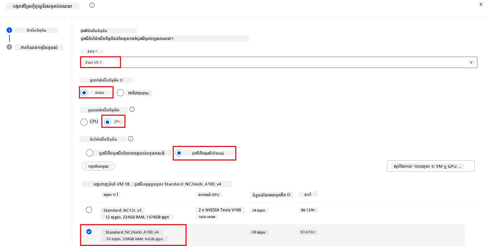

1. ជ្រើស **Next**។

1. ធ្វើការងារដូចខាងក្រោម៖

    - បញ្ចូល **Compute name**។ វាត្រូវតែមានតម្លៃមួយតែមួយ។
    - ជ្រើស **Minimum number of nodes** ទៅ **0**។
    - ជ្រើស **Maximum number of nodes** ទៅ **1**។
    - ជ្រើស **Idle seconds before scale down** ទៅ **120**។

    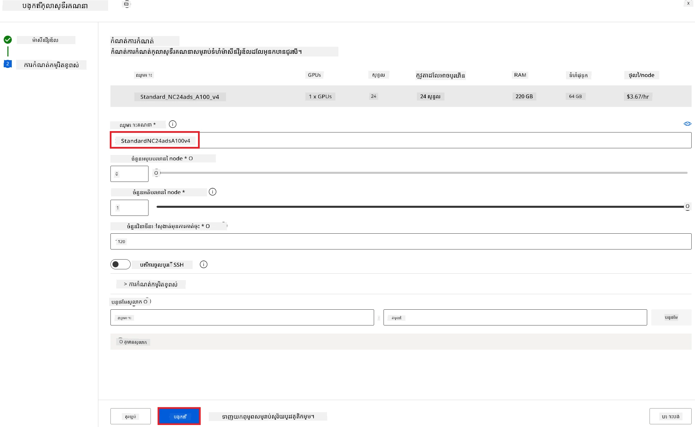

1. ជ្រើស **Create**។

#### ថ្នាក់បង្រៀនបន្ថែមម៉ូដែល Phi-3

1. ចូលទៅកាន់ [Azure ML Studio](https://ml.azure.com/home?wt.mc_id=studentamb_279723)។

1. ជ្រើសកន្លែងធ្វើការ Azure Machine Learning ដែលអ្នកបានបង្កើត។

    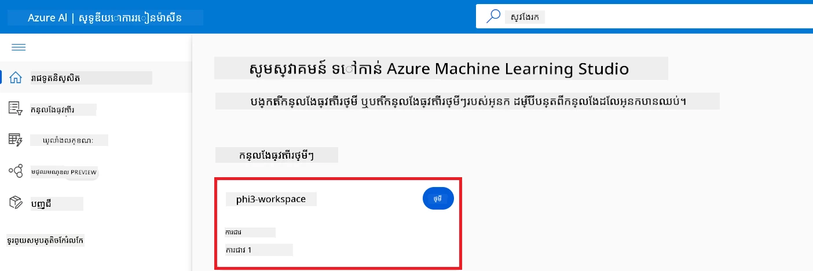

1. ធ្វើការងារដូចខាងក្រោម៖

    - ជ្រើស **Model catalog** ពីផ្នែកខាងឆ្វេង។
    - វាយ *phi-3-mini-4k* នៅក្នុង **search bar** ហើយជ្រើស **Phi-3-mini-4k-instruct** ពីជំរើសដែលបង្ហាញ។

    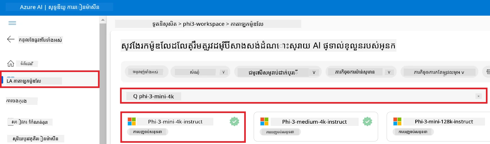

1. ជ្រើស **Fine-tune** ពីម៉ឺនុយនាវីហ្គេស្យុង។

    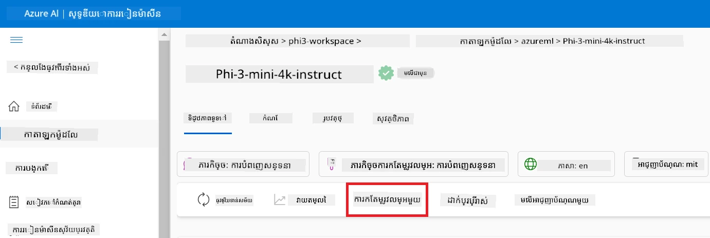

1. ធ្វើការងារដូចខាងក្រោម៖

    - ជ្រើស **Select task type** ជា **Chat completion**។
    - ជ្រើស **+ Select data** ដើម្បីផ្ទុក **Traning data**។
    - ជ្រើសប្រភេទការផ្ទុក Validation data ទៅ **Provide different validation data**។
    - ជ្រើស **+ Select data** ដើម្បីផ្ទុក **Validation data**។

    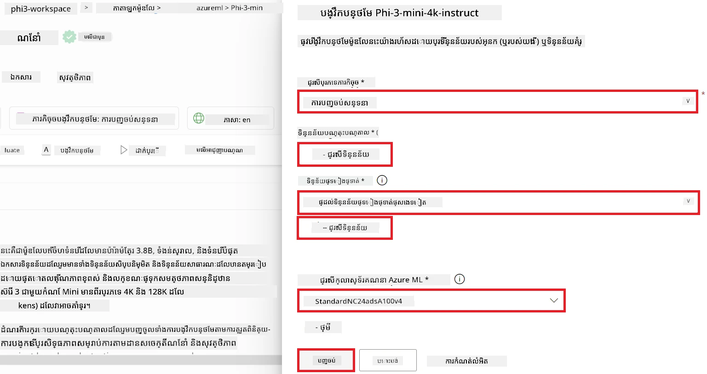

> [!TIP]
>
> អ្នកអាចជ្រើស **Advanced settings** ដើម្បីប្ដូរជម្រើសដូចជា **learning_rate** និង **lr_scheduler_type** ដើម្បីបង្កើនប្រសិទ្ធភាពនៃដំណើរការថ្នាក់បង្រៀនបន្ថែមតាមតម្រូវការពិសេសរបស់អ្នក។

1. ជ្រើស **Finish**។

1. ក្នុងលំហាត់នេះ អ្នកបានថ្នាក់បង្រៀនបន្ថែមម៉ូដែល Phi-3 ដោយជោគជ័យប្រើ Azure Machine Learning។ សូមចំណាំថា ដំណើរការថ្នាក់បង្រៀនបន្ថែមអាចចំណាយពេលវេលាអ្នកមិនតិច។ បន្ទាប់ពីដំណើរការការងារថ្នាក់បង្រៀនបន្ថែម អ្នកត្រូវរង់ចាំវាឲ្យបញ្ចប់។ អ្នកអាចតាមដានស្ថានភាពការងារថ្នាក់បង្រៀនបន្ថែមតាមគេហទំព័រតាប Jobs នៅផ្នែកខាងឆ្វេងនៃកន្លែងធ្វើការរបស់ Azure Machine Learning។ ក្នុងរង្វង់បន្ទាប់ អ្នកនឹងបង្ហោះម៉ូដែលដែលថ្នាក់បង្រៀនបន្ថែម និងបញ្ចូលវាជាមួយ Prompt flow។

    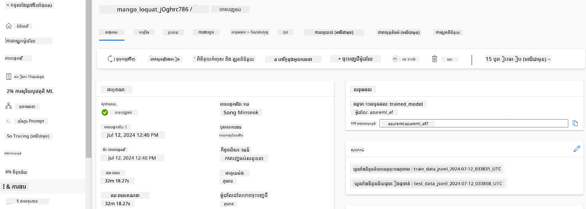

### បង្ហោះម៉ូដែល Phi-3 ដែលបានថ្នាក់បង្រៀនបន្ថែម

ដើម្បីបញ្ចូលម៉ូដែល Phi-3 ដែលបានថ្នាក់បង្រៀនបន្ថែមជាមួយ Prompt flow អ្នកត្រូវបង្ហោះម៉ូដែល ដើម្បីអោយអាចគ្រប់គ្រងបានសម្រាប់ការព្យាករណ៍ពេលវេលាពិត។ ដំណើរការនេះរួមមានការចុះបញ្ជីម៉ូដែល បង្កើតចុងបញ្ចប់អនឡាញ និងបង្ហោះម៉ូដែល។

ក្នុងលំហាត់នេះ អ្នកនឹង៖

- ចុះបញ្ជីម៉ូដែលដែលបានថ្នាក់បង្រៀនបន្ថែមនៅក្នុងកន្លែងធ្វើការ Azure Machine Learning។
- បង្កើតចុងបញ្ចប់អនឡាញ។
- បង្ហោះម៉ូដែល Phi-3 ដែលបានចុះបញ្ជី។

#### ចុះបញ្ជីម៉ូដែលដែលបានថ្នាក់បង្រៀនបន្ថែម

1. ចូលទៅកាន់ [Azure ML Studio](https://ml.azure.com/home?wt.mc_id=studentamb_279723)។

1. ជ្រើសកន្លែងធ្វើការ Azure Machine Learning ដែលអ្នកបានបង្កើត។

    

1. ជ្រើស **Models** ពីផ្នែកខាងឆ្វេង។
1. ជ្រើស **+ Register**។
1. ជ្រើស **From a job output**។

    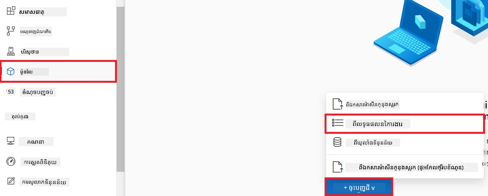

1. ជ្រើសការងារដែលអ្នកបានបង្កើត។

    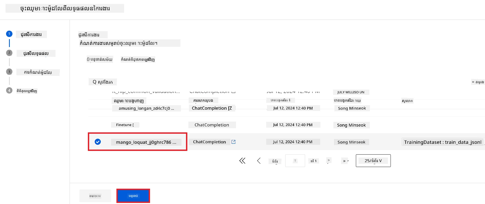

1. ជ្រើស **Next**។

1. ជ្រើសប្រភេទម៉ូដែលជា **MLflow**។

1. ប្រាកដថា **Job output** ត្រូវបានជ្រើសរួចហើយ; វាគួរត្រូវបានជ្រើសដោយស្វ័យប្រវត្តិ។

    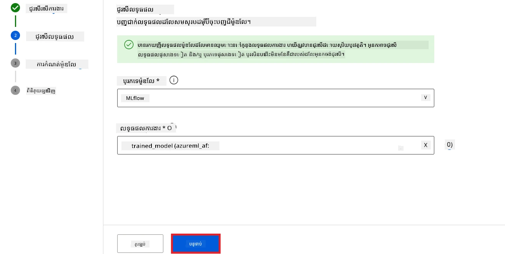

2. ជ្រើស **Next**។

3. ជ្រើស **Register**។

    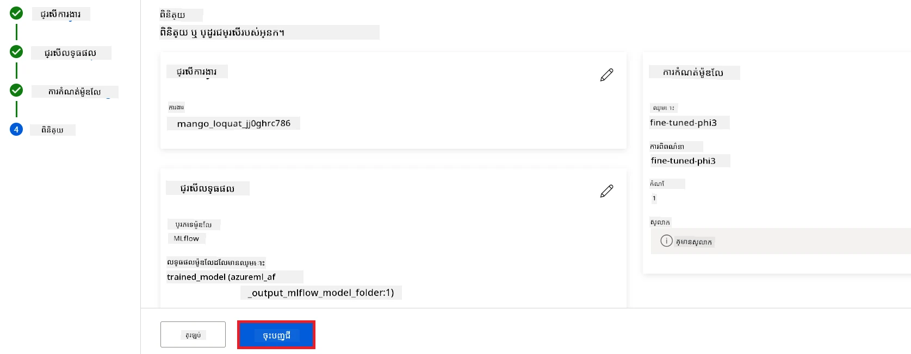

4. អ្នកអាចមើលម៉ូដែលដែលបានចុះបញ្ជីបានដោយចូលទៅម៉ឺនុយ **Models** ពីផ្នែកខាងឆ្វេង។

    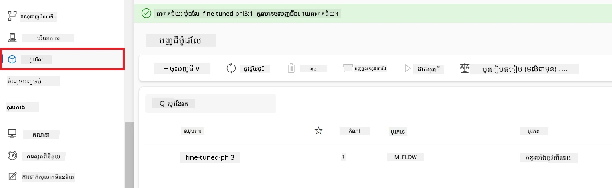

#### បង្ហោះម៉ូដែលដែលបានថ្នាក់បង្រៀនបន្ថែម

1. ចូលទៅកន្លែងធ្វើការ Azure Machine Learning ដែលអ្នកបានបង្កើត។

1. ជ្រើស **Endpoints** ពីផ្នែកខាងឆ្វេង។

1. ជ្រើស **Real-time endpoints** ពីម៉ឺនុយនាវីហ្គេស្យុង។

    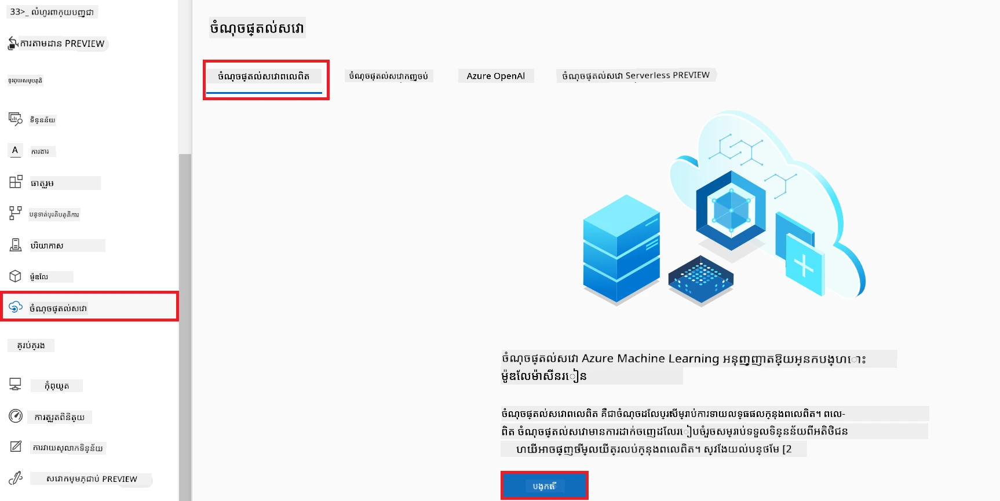

1. ជ្រើស **Create**។

1. ជ្រើសម៉ូដែលដែលបានចុះបញ្ជីដែលអ្នកបានបង្កើត។

    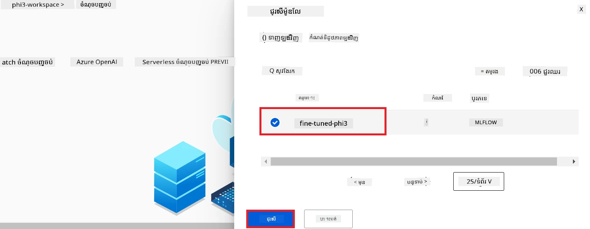

1. ជ្រើស **Select**។

1. ធ្វើការងារដូចខាងក្រោម៖

    - ជ្រើស **Virtual machine** ទៅ *Standard_NC6s_v3*។
    - ជ្រើស **Instance count** ដែលអ្នកចង់ប្រើ។ ឧទាហរណ៍ *1*។
    - ជ្រើស **Endpoint** ជា **New** ដើម្បីបង្កើតចុងបញ្ចប់ថ្មី។
    - បញ្ចូល **Endpoint name**។ វាត្រូវតែមានតម្លៃមួយតែមួយ។
    - បញ្ចូល **Deployment name**។ វាត្រូវតែមានតម្លៃមួយតែមួយ។

    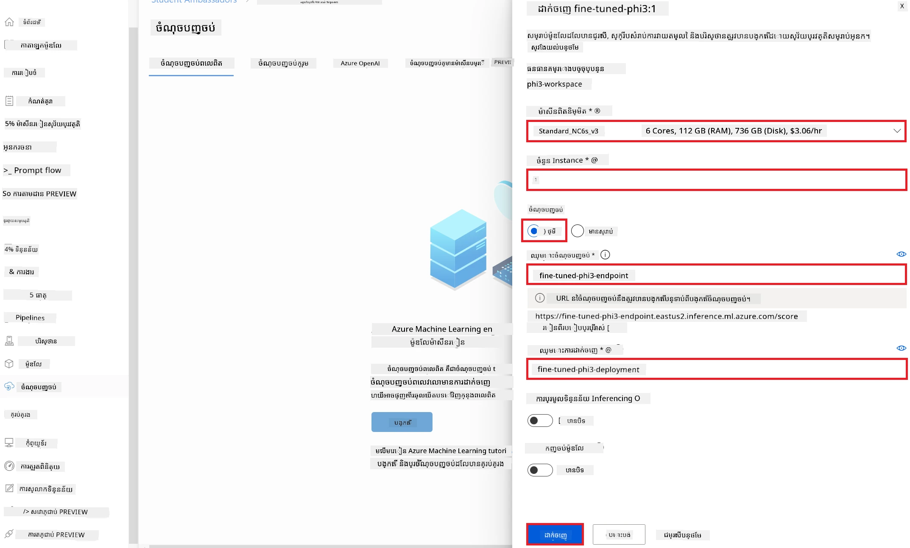

1. ជ្រើស **Deploy**។

> [!WARNING]
> ដើម្បីជៀសវាងការចំណាយបន្ថែមលើគណនីរបស់អ្នក សូមប្រាកដថាបានលុបចុងបញ្ចប់ដែលបានបង្កើតនៅក្នុងកន្លែងធ្វើការ Azure Machine Learning។
>

#### ពិនិត្យស្ថានភាពការបង្ហោះនៅក្នុងកន្លែងធ្វើការ Azure Machine Learning

1. ចូលទៅកន្លែងធ្វើការ Azure Machine Learning ដែលអ្នកបានបង្កើត។

1. ជ្រើស **Endpoints** ពីផ្នែកខាងឆ្វេង។

1. ជ្រើសចុងបញ្ចប់ដែលអ្នកបានបង្កើត។

    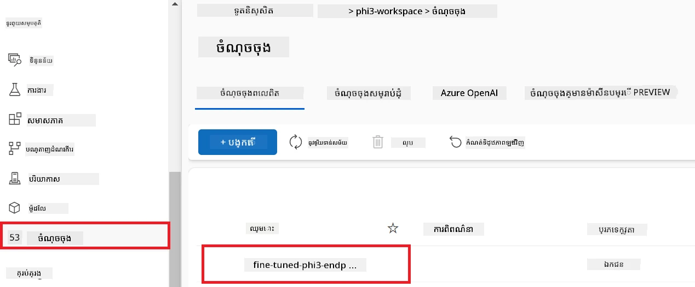

1. នៅលើទំព័រនេះ អ្នកអាចគ្រប់គ្រងចុងបញ្ចប់នៅពេលដំណើរការបង្ហោះ។

> [!NOTE]
> ពេលដំណើរការបង្ហោះបានបញ្ចប់ សូមប្រាកដថា **Live traffic** ត្រូវបានកំណត់ជា **100%**។ ប្រសិនបើមិនមែន សូមជ្រើស **Update traffic** ដើម្បីកែប្រែការកំណត់ចរន្ត។ សូមចំណាំថាអ្នកមិនអាចសាកល្បងម៉ូដែលបាន ប្រសិនបើចរន្តត្រូវបានកំណត់ជា 0%។  
>
> 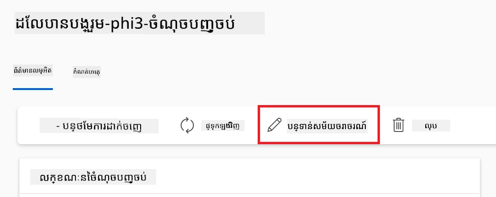
>

## សេណារីយ៉ូ 3៖ បញ្ចូលជាមួយ Prompt flow និងជជែកជាមួយម៉ូដែលផ្ទាល់ខ្លួនរបស់អ្នកក្នុង Microsoft Foundry

### បញ្ចូលម៉ូដែល Phi-3 ផ្ទាល់ខ្លួនជាមួយ Prompt flow

បន្ទាប់ពីបានបង្ហោះម៉ូដែលដែលបានថ្នាក់បង្រៀនបន្ថែមដោយជោគជ័យ អ្នកអាចបញ្ចូលវាជាមួយ Prompt Flow ដើម្បីប្រើម៉ូដែលរបស់អ្នកក្នុងកម្មវិធីពេលវេលាពិត ដែលអនុញ្ញាតឲ្យមានកិច្ចការជាច្រើនចំពោះម៉ូដែល Phi-3 ផ្ទាល់ខ្លួនរបស់អ្នក។

ក្នុងលំហាត់នេះ អ្នកនឹង៖

- បង្កើត Microsoft Foundry Hub។
- បង្កើត Microsoft Foundry Project។
- បង្កើត Prompt flow។
- បន្ថែមការតភ្ជាប់ផ្ទាល់ខ្លួនសម្រាប់ម៉ូដែល Phi-3 ដែលបានថ្នាក់បង្រៀនបន្ថែម។
- តំឡើង Prompt flow ដើម្បីជជែកជាមួយម៉ូដែល Phi-3 ផ្ទាល់ខ្លួនរបស់អ្នក។

> [!NOTE]
> អ្នកក៏អាចបញ្ចូលជាមួយ Promptflow ដោយប្រើ Azure ML Studio។ ដំណើរការបញ្ចូលដូចគ្នានេះអាចប្រើបានជាមួយ Azure ML Studio។
>

#### បង្កើត Microsoft Foundry Hub

អ្នកត្រូវតែបង្កើត Hub មុនពេលបង្កើត Project។ Hub មានតួនាទីដូចជា Resource Group ដែលអនុញ្ញាតឲ្យអ្នករៀបចំនិងគ្រប់គ្រងគម្រោងច្រើននៅក្នុង Microsoft Foundry។
1. ចូលទៅកាន់ [Microsoft Foundry](https://ai.azure.com/?WT.mc_id=aiml-137032-kinfeylo)។

1. ជ្រើស **All hubs** ពីផ្ទាំងខាងឆ្វេង។

1. ជ្រើស **+ New hub** ពីម៉ឺនុយនាវីហ្គេសិន។

    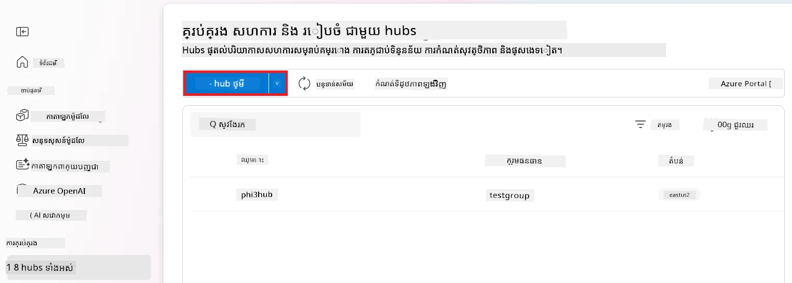

1. អនុវត្តភារកិច្ចដូចខាងក្រោម៖

    - បញ្ចូល **Hub name**។ វាត្រូវតែជាតម្លៃមួយដែលមិនដូចគ្នា។
    - ជ្រើស Azure **Subscription** របស់អ្នក។
    - ជ្រើស **Resource group** ដែលនឹងប្រើ (បង្កើតថ្មី ប្រសិនបើចាំបាច់)។
    - ជ្រើស **Location** ដែលអ្នកចង់ប្រើ។
    - ជ្រើស **Connect Azure AI Services** ដែលនឹងប្រើ (បង្កើតថ្មី ប្រសិនបើចាំបាច់)។
    - ជ្រើស **Connect Azure AI Search** ដើម្បី **Skip connecting**។

    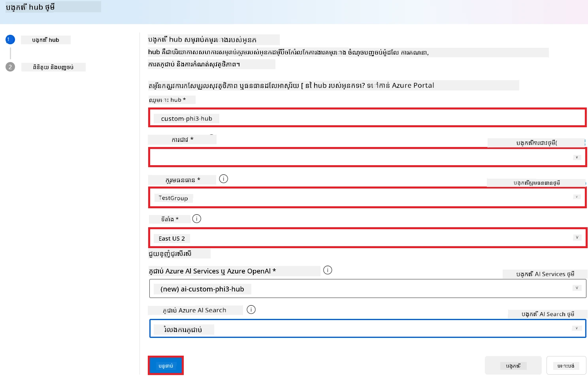

1. ជ្រើស **Next**។

#### បង្កើតគម្រោង Microsoft Foundry

1. នៅក្នុង Hub ដែលអ្នកបានបង្កើត ជ្រើស **All projects** ពីផ្ទាំងខាងឆ្វេង។

1. ជ្រើស **+ New project** ពីម៉ឺនុយនាវីហ្គេសិន។

    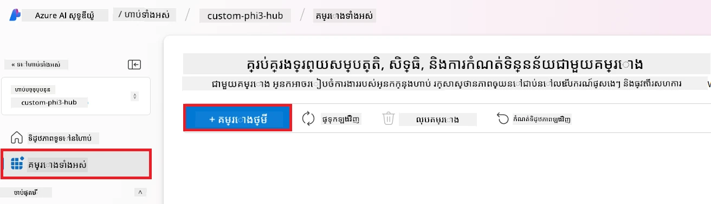

1. បញ្ចូល **Project name**។ វាត្រូវតែជាតម្លៃមួយដែលមិនដូចគ្នា។

    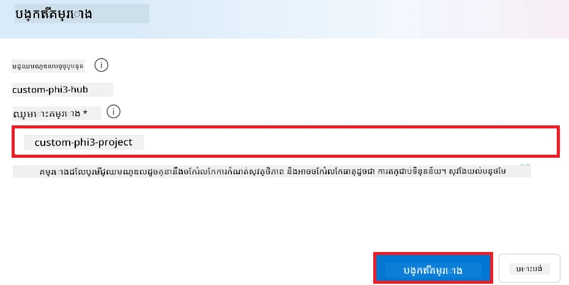

1. ជ្រើស **Create a project**។

#### បន្ថែមការតភ្ជាប់ផ្ទាល់ខ្លួនសម្រាប់ម៉ូដែល Phi-3 ដែលបានហ្វៃន-ត្យួន

ដើម្បីភ្ជាប់ម៉ូដែល Phi-3 ផ្ទាល់ខ្លួនរបស់អ្នកជាមួយ Prompt flow ទាំងអស់ អ្នកត្រូវរក្សាទុកចំណុចខ្លឹមសាររបស់ម៉ូដែល និងកូនសោក្នុងការតភ្ជាប់ផ្ទាល់ខ្លួន។ ការកំណត់នេះធានាថាអ្នកអាចចូលប្រើម៉ូដែល Phi-3 ផ្ទាល់ខ្លួនរបស់អ្នកក្នុង Prompt flow។

#### កំណត់កូនសោ api និង uri ចំណុចបញ្ចូលសម្រាប់ម៉ូដែល Phi-3 ដែលបានហ្វៃន-ត្យួន

1. ចូលទៅកាន់ [Azure ML Studio](https://ml.azure.com/home?WT.mc_id=aiml-137032-kinfeylo)។

1. រុករកទៅកាន់Azure Machine learning workspace ដែលអ្នកបានបង្កើត។

1. ជ្រើស **Endpoints** ពីផ្ទាំងខាងឆ្វេង។

    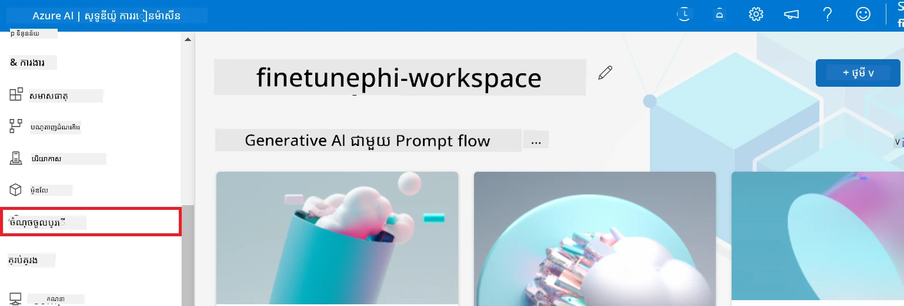

1. ជ្រើស endpoints ដែលអ្នកបានបង្កើត។

    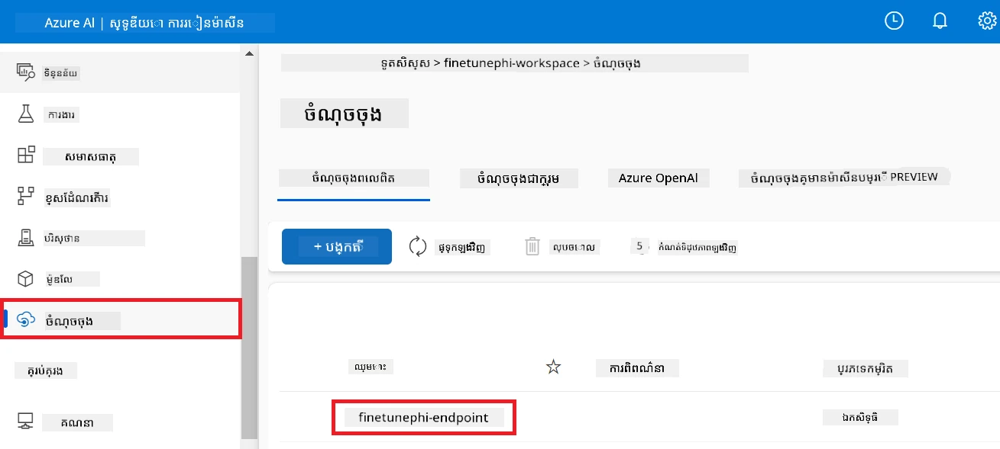

1. ជ្រើស **Consume** ពីម៉ឺនុយនាវីហ្គេសិន។

1. ចម្លង **REST endpoint** និង **Primary key** របស់អ្នក។

    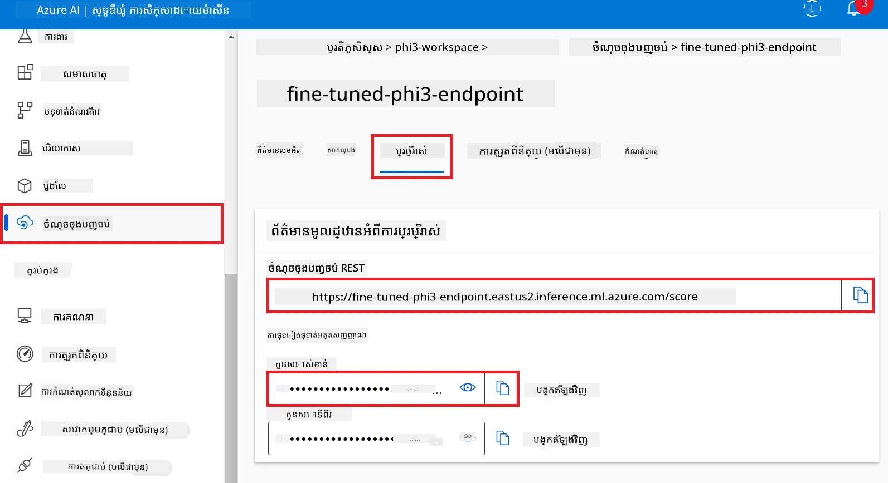

#### បន្ថែមការតភ្ជាប់ផ្ទាល់ខ្លួន

1. ចូលទៅកាន់ [Microsoft Foundry](https://ai.azure.com/?WT.mc_id=aiml-137032-kinfeylo)។

1. រុករកទៅគម្រោង Microsoft Foundry ដែលអ្នកបានបង្កើត។

1. នៅក្នុងគម្រោងដែលអ្នកបានបង្កើត ជ្រើស **Settings** ពីផ្ទាំងខាងឆ្វេង។

1. ជ្រើស **+ New connection**។

    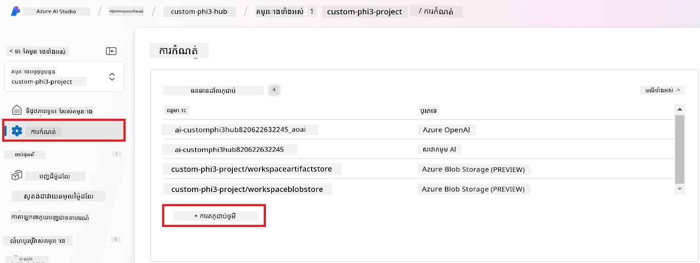

1. ជ្រើស **Custom keys** ពីម៉ឺនុយនាវីហ្គេសិន។

    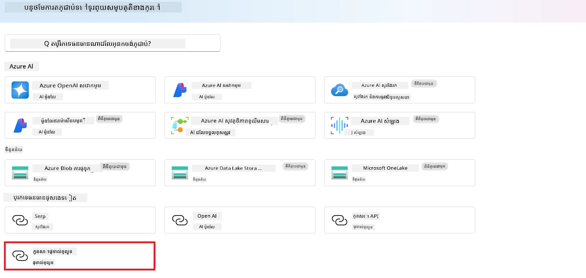

1. អនុវត្តភារកិច្ចដូចខាងក្រោម៖

    - ជ្រើស **+ Add key value pairs**។
    - សម្រាប់ឈ្មោះកូនសោ បញ្ចូល **endpoint** ហើយបិទបិទចំណុចសម្រាប់ endpoint ដែលអ្នកបានចម្លងពី Azure ML Studio ទៅក្នុងប្រអប់តម្លៃ។
    - ជ្រើស **+ Add key value pairs** ម្តងទៀត។
    - សម្រាប់ឈ្មោះកូនសោ បញ្ចូល **key** ហើយបិទបិទកូនសោដែលអ្នកបានចម្លងពី Azure ML Studio ទៅក្នុងប្រអប់តម្លៃ។
    - បន្ទាប់ពីបន្ថែមកូនសោរួច ជ្រើស **is secret** ដើម្បីការពារអោយកូនសោមិនត្រូវបានបង្ហាញ។

    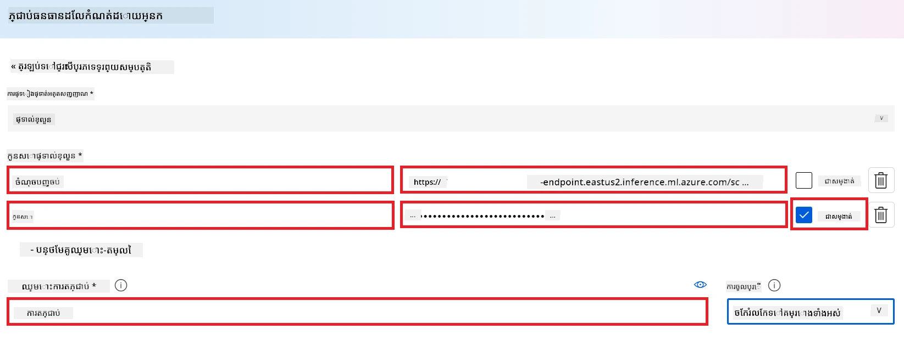

1. ជ្រើស **Add connection**។

#### បង្កើត Prompt flow

អ្នកបានបន្ថែមការតភ្ជាប់ផ្ទាល់ខ្លួននៅ Microsoft Foundry រួចហើយ។ ឥឡូវនេះ មកបង្កើត Prompt flow ដោយប្រើជំហានខាងក្រោម។ បន្ទាប់មក អ្នកនឹងភ្ជាប់ Prompt flow នេះទៅកាន់ការតភ្ជាប់ផ្ទាល់ខ្លួន ដើម្បីអ្នកអាចប្រើម៉ូដែលដែលបានហ្វៃន-ត្យួនក្នុង Prompt flow បាន។

1. រុករកទៅគម្រោង Microsoft Foundry ដែលអ្នកបានបង្កើត។

1. ជ្រើស **Prompt flow** ពីផ្ទាំងខាងឆ្វេង។

1. ជ្រើស **+ Create** ពីម៉ឺនុយនាវីហ្គេសិន។

    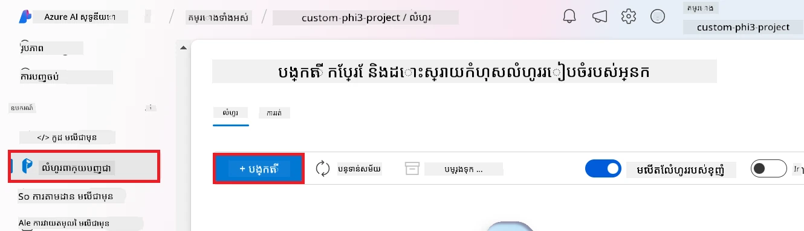

1. ជ្រើស **Chat flow** ពីម៉ឺនុយនាវីហ្គេសិន។

    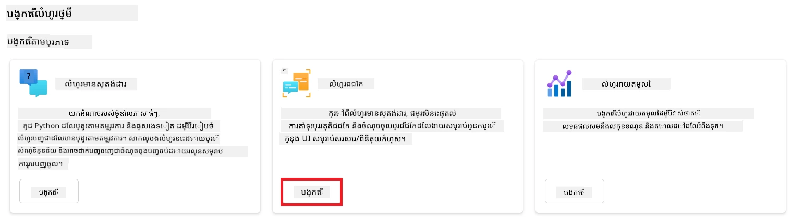

1. បញ្ចូល **Folder name** ដែលនឹងប្រើ។

    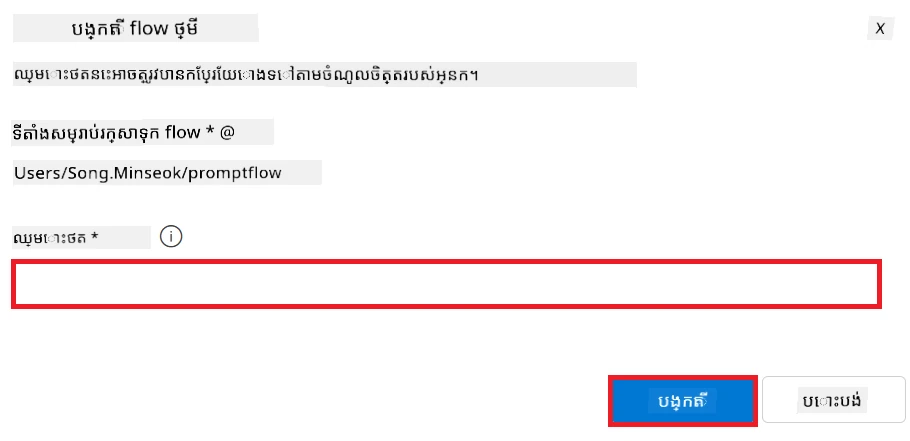

2. ជ្រើស **Create**។

#### កំណត់ Prompt flow សម្រាប់ការជជែកជាមួយម៉ូដែល Phi-3 ផ្ទាល់ខ្លួនរបស់អ្នក

អ្នកត្រូវបញ្ចូលម៉ូដែល Phi-3 ដែលបានហ្វៃន-ត្យួនចូលទៅក្នុង Prompt flow។ ទោះជាយ៉ាងណា ការផ្គួចផ្គង Prompt flow ដែលមានរួចមកមិនបានរចនាសម្រាប់គោលបំណងនេះទេ។ ដូច្នេះ អ្នកត្រូវរចនា Prompt flow ថ្មី ដើម្បីអនុញ្ញាតឱ្យមានការបញ្ចូលម៉ូដែលផ្ទាល់ខ្លួន។

1. នៅក្នុង Prompt flow អនុវត្តភារកិច្ចដូចខាងក្រោម ដើម្បីសង់ឡើងវិញចរន្តរបស់ flow មានស្រាប់៖

    - ជ្រើស **Raw file mode**។
    - លុបកូដទាំងអស់ដែលមាននៅក្នុងឯកសារ *flow.dag.yml*។
    - បន្ថែមកូដខាងក្រោមទៅក្នុងឯកសារ *flow.dag.yml*។

        ```yml
        inputs:
          input_data:
            type: string
            default: "Who founded Microsoft?"

        outputs:
          answer:
            type: string
            reference: ${integrate_with_promptflow.output}

        nodes:
        - name: integrate_with_promptflow
          type: python
          source:
            type: code
            path: integrate_with_promptflow.py
          inputs:
            input_data: ${inputs.input_data}
        ```

    - ជ្រើស **Save**។

    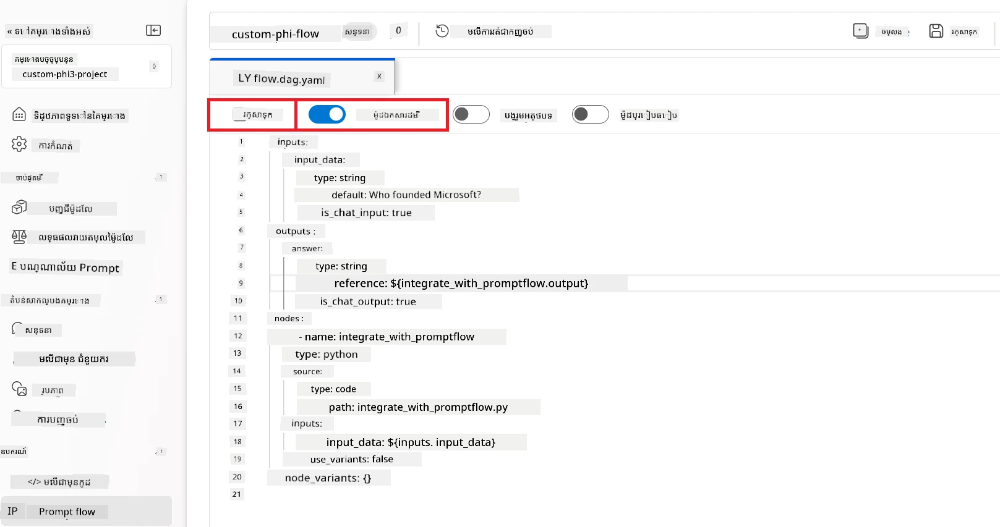

1. បន្ថែមកូដខាងក្រោមទៅឯកសារ *integrate_with_promptflow.py* ដើម្បីប្រើម៉ូឌែល Phi-3 ផ្ទាល់ខ្លួនក្នុង Prompt flow។

    ```python
    import logging
    import requests
    from promptflow import tool
    from promptflow.connections import CustomConnection

    # ការតំឡើងកំណត់ហេតុ
    logging.basicConfig(
        format="%(asctime)s - %(levelname)s - %(name)s - %(message)s",
        datefmt="%Y-%m-%d %H:%M:%S",
        level=logging.DEBUG
    )
    logger = logging.getLogger(__name__)

    def query_phi3_model(input_data: str, connection: CustomConnection) -> str:
        """
        Send a request to the Phi-3 model endpoint with the given input data using Custom Connection.
        """

        # "connection" គឺជាឈ្មោះនៃការតភ្ជាប់ប្ដូរតាមបំណង, "endpoint", "key" គឺជាគន្លឹះនៅក្នុងការតភ្ជាប់ប្ដូរតាមបំណង
        endpoint_url = connection.endpoint
        api_key = connection.key

        headers = {
            "Content-Type": "application/json",
            "Authorization": f"Bearer {api_key}"
        }
        data = {
            "input_data": {
                "input_string": [
                    {"role": "user", "content": input_data}
                ],
                "parameters": {
                    "temperature": 0.7,
                    "max_new_tokens": 128
                }
            }
        }
        try:
            response = requests.post(endpoint_url, json=data, headers=headers)
            response.raise_for_status()
            
            # កត់ត្រាការឆ្លើយតបទាំងមូល JSON
            logger.debug(f"Full JSON response: {response.json()}")

            result = response.json()["output"]
            logger.info("Successfully received response from Azure ML Endpoint.")
            return result
        except requests.exceptions.RequestException as e:
            logger.error(f"Error querying Azure ML Endpoint: {e}")
            raise

    @tool
    def my_python_tool(input_data: str, connection: CustomConnection) -> str:
        """
        Tool function to process input data and query the Phi-3 model.
        """
        return query_phi3_model(input_data, connection)

    ```

    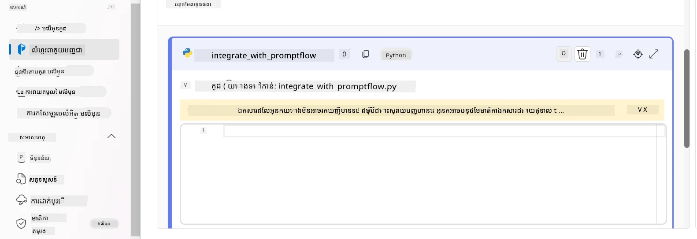

> [!NOTE]
> សម្រាប់ព័ត៌មានលម្អិតបន្ថែមអំពីការប្រើប្រាស់ Prompt flow នៅ Microsoft Foundry អ្នកអាចយោងទៅ [Prompt flow in Microsoft Foundry](https://learn.microsoft.com/azure/ai-studio/how-to/prompt-flow)។

1. ជ្រើស **Chat input**, **Chat output** ដើម្បីអនុញ្ញាតការជជែកជាមួយម៉ូដែលរបស់អ្នក។

    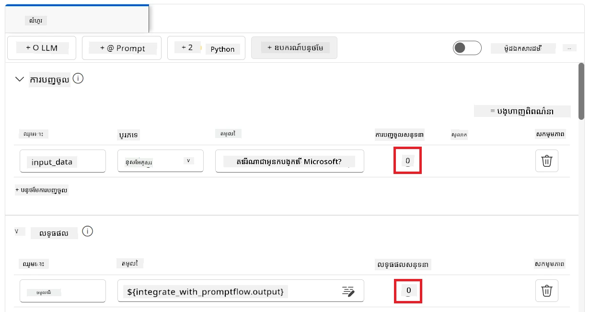

1. ឥឡូវនេះអ្នកបានត្រៀមខ្លួនរួចរួមជជែកជាមួយម៉ូដែល Phi-3 ផ្ទាល់ខ្លួនរបស់អ្នក។ ក្នុងលំហាត់បន្ទាប់ អ្នកនឹងរៀនពីរបៀបចាប់ផ្តើម Prompt flow ហើយប្រើវាសម្រាប់ជជែកជាមួយម៉ូដែល Phi-3 ដែលបានហ្វៃន-ត្យួនរបស់អ្នក។

> [!NOTE]
>
> ចរន្តដែលបានសាងឡើងវិញគួរត្រូវបានបង្ហាញដូចរូបខាងក្រោម៖
>
> 
>

### ជជែកជាមួយម៉ូឌែល Phi-3 ផ្ទាល់ខ្លួនរបស់អ្នក

ឥឡូវនេះ អ្នកបានហ្វៃន-ត្យួន និងបញ្ចូលម៉ូឌែល Phi-3 ផ្ទាល់ខ្លួនរបស់អ្នកជាមួយ Prompt flow រួចហើយ អ្នកមានភាពត្រៀមខ្លួនក្នុងការចាប់ផ្តើមពិភាក្សាជាមួយវា។ លំហាត់នេះនឹងណែនាំអ្នកជំហានក្នុងការកំណត់ និងចាប់ផ្តើមជជែកជាមួយម៉ូឌែលរបស់អ្នក ដោយប្រើ Prompt flow។ ដោយអនុវត្តតាមជំហានទាំងនេះ អ្នកនឹងអាចប្រើប្រាស់សមត្ថភាពពេញលេញនៃម៉ូឌែល Phi-3 ដែលបានហ្វៃន-ត្យួនសម្រាប់ភារកិច្ច និងការពិភាក្សាចម្រុះ។

- ជជែកជាមួយម៉ូឌែល Phi-3 ផ្ទាល់ខ្លួនរបស់អ្នកដោយប្រើ Prompt flow។

#### ចាប់ផ្តើម Prompt flow

1. ជ្រើស **Start compute sessions** ដើម្បីចាប់ផ្តើម Prompt flow។

    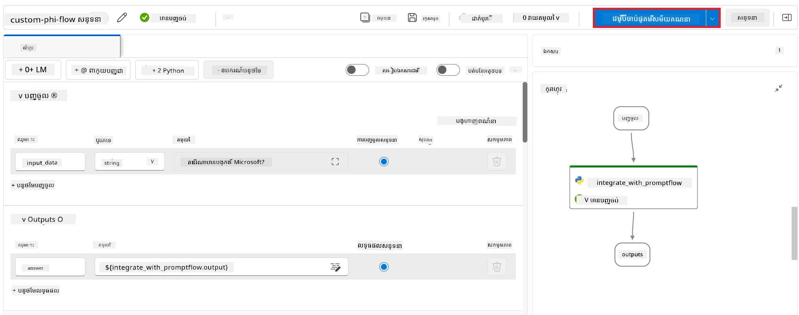

1. ជ្រើស **Validate and parse input** ដើម្បីបន្ទាន់សម័យប៉ារ៉ាម៉ែត្រ។

    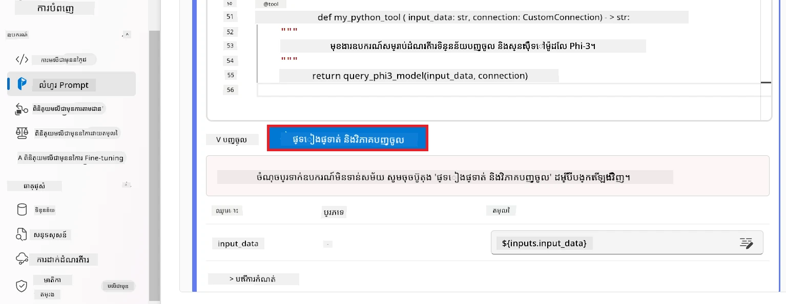

1. ជ្រើស **Value** នៃ **connection** ទៅកាន់ការតភ្ជាប់ផ្ទាល់ខ្លួនដែលអ្នកបានបង្កើត។ ឧទាហរណ៍ *connection*។

    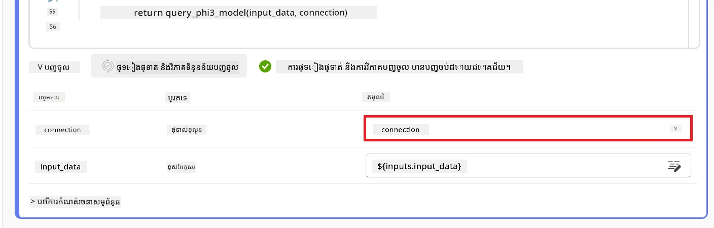

#### ជជែកជាមួយម៉ូឌែលផ្ទាល់ខ្លួនរបស់អ្នក

1. ជ្រើស **Chat**។

    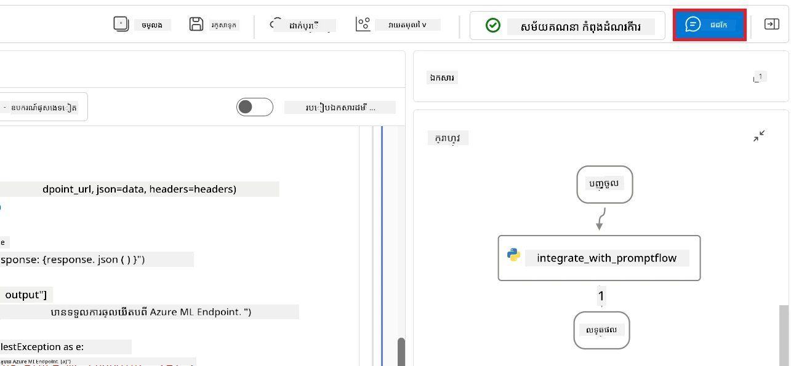

1. នេះគឺជាឧទាហរណ៍លទ្ធផល៖ ឥឡូវនេះ អ្នកអាចជជែកជាមួយម៉ូឌែល Phi-3 ផ្ទាល់ខ្លួនរបស់អ្នក។ គួរតែស្នើសំណួរដែលមានមូលដ្ឋានលើទិន្នន័យបានប្រើសម្រាប់ហ្វៃន-ត្យួន។

    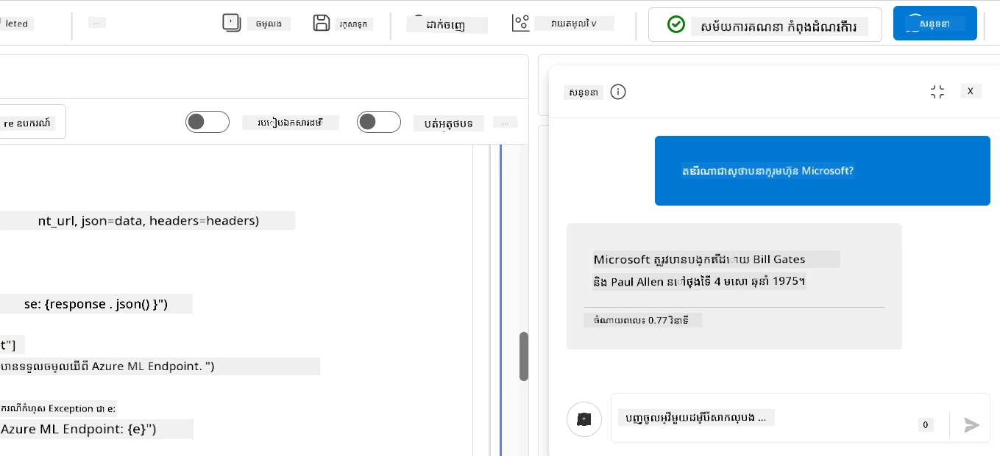

---

<!-- CO-OP TRANSLATOR DISCLAIMER START -->
**ការព្រមាន**៖  
ឯកសារនេះត្រូវបានបកប្រែដោយប្រើសេវាបកប្រែ AI [Co-op Translator](https://github.com/Azure/co-op-translator)។ ក្នុងខណៈ​ពេលដែលយើងខិតខំប្រឹងប្រែងត្រូវការ​ភាពត្រឹមត្រូវ សូមយកចិត្តទុកដាក់ថាការបកប្រែដោយស្វ័យប្រវត្តិក្នុងឯកសារនេះអាចមាន​កំហុស ឬការមិនត្រឹមត្រូវ។ ឯកសារដើមជាភាសាដើមគួរត្រូវបានកត្រាលើកថាផ្សាយសុពលភាពជាអធិការណ៍។ សម្រាប់ព័ត៌មានសំខាន់ៗ សូមណែនាំឲ្យប្រើប្រាស់ការបកប្រែដោយមនុស្សជំនាញវិជ្ជាជីវៈ។ យើងមិនទទួលខុសត្រូវចំពោះការយល់ច្រឡំ ឬការបកប្រែខុសដែលកើតឡើងពីការប្រើប្រាស់ការបកប្រែនេះទេ។
<!-- CO-OP TRANSLATOR DISCLAIMER END -->