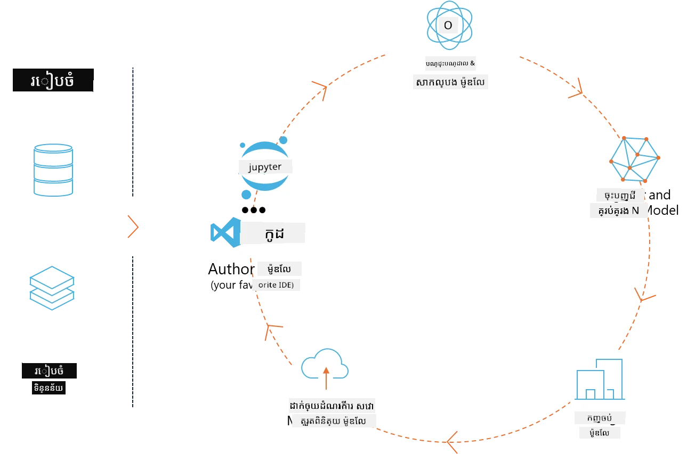
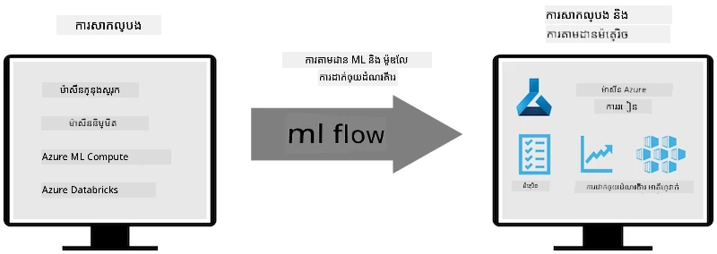
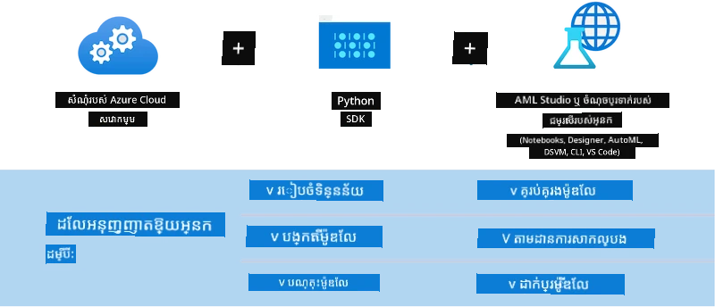

# MLflow

[MLflow](https://mlflow.org/) គឺជាវេទិកាកូដម៉ូដែលបើកប្រភពមានគោលបំណងគ្រប់គ្រងជីវិតដំណើរការផ្នែករៀនម៉ាស៊ីនពីដើមដល់ចុង។



MLFlow ត្រូវបានប្រើសម្រាប់គ្រប់គ្រងជីវិតដំណើរការ ML រួមមានការសាកល្បង, ការចម្លងបានម្តងទៀត, ការដាក់ចេញ និងកន្លែងចុះបញ្ជីម៉ូដែលមួយកណ្តាល។ ML flow វេលនេះផ្តល់ជូនបួនផ្នែកចម្បង។

- **MLflow Tracking:** កត់ត្រា និងសួរព័ត៌មានការសាកល្បង​ កូដ កំណត់រចនាសម្ព័ន្ធទិន្នន័យ និងលទ្ធផល។
- **MLflow Projects:** ការវេចខ្ចប់កូដវិទ្យាសាស្ត្រទិន្នន័យក្នុងទ្រង់ទ្រាយអាចចម្លងបាននៅលើវេទិកាមួយណាមួយ។
- **Mlflow Models:** ដាក់ចេញម៉ូដែលរៀនម៉ាស៊ីននៅក្នុងបរិស្ថានបម្រើជាប្រភេទផ្សេងៗ។
- **Model Registry:** រក្សាទុក, ចំណាំ និងគ្រប់គ្រងម៉ូដែលនៅក្នុងឃ្លាំងកណ្តាល។

វារួមមានសមត្ថភាពសម្រាប់តាមដានការសាកល្បង, វេចខ្ចប់កូដទៅក្នុងការរត់ចម្លងបាន, និងចែករំលែក និងដាក់ចេញម៉ូដែល។ MLFlow បន្សំរួមជាមួយ Databricks ហើយគាំទ្របណ្ណាល័យ ML ជាច្រើន, ធ្វើឲ្យវាជាឯករាជ្យធ្វើជាមួយបណ្ណាល័យណាមួយ។ វាអាចប្រើបានជាមួយបណ្ណាល័យរៀនម៉ាស៊ីនណាមួយ និងភាសាកម្មវិធីណាមួយ ដោយវាប្រកាន់ REST API និង CLI សម្រាប់ភាពងាយស្រួល។



លក្ខណៈសំខាន់ៗរបស់ MLFlow រួមមាន៖

- **ការតាមដានការសាកល្បង:** កត់ត្រា និងប្រៀបធៀបប៉ារ៉ាម៉ែត្រ និងលទ្ធផល។
- **ការគ្រប់គ្រងម៉ូដែល:** ដាក់ចេញម៉ូដែលទៅវេទិកាបម្រើ និងវិភាគផ្សេងៗ។
- **កន្លែងចុះបញ្ជីម៉ូដែល:** រួមគ្នាគ្រប់គ្រងជីវិតដំណើរការម៉ូដែល MLflow រួមមានការផ្លាស់ប្ដូរនិងចំណាំ។
- **គម្រោង:** វេចខ្ចប់កូដ ML សម្រាប់ចែករំលែក ឬប្រើសម្រាប់ផលិតកម្ម។
MLFlow ក៏គាំទ្រជុំវដ្ត MLOps ដែលរួមមានការរៀបចំទិន្នន័យ, ចុះបញ្ជីនិងគ្រប់គ្រងម៉ូដែល, វេចខ្ចប់ម៉ូដែលសម្រាប់ការប្រតិបត្តិ, ដាក់ចេញសេវាកម្ម និងត្រួតពិនិត្យម៉ូដែល។ វាមានគោលបំណងឲ្យដំណើរការពីគំរូដំណើរការមួយទៅកាន់ដំណើរការផលិតបានកាន់តែសាមញ្ញ ជាពិសេសនៅក្នុងបរិស្ថានពពក និងគេហ្ឋបរិស្ថាន។

## ទ្រឹស្តី E2E - កសាង wrapper និងប្រើ Phi-3 ជាម៉ូដែល MLFlow

ក្នុងគំរូ E2E នេះ យើងនឹងបង្ហាញពីរបៀបផ្សេងៗក្នុងការកសាង wrapper ជុំវិញម៉ូដែលភាសាប្លែកតូច Phi-3 (SLM) ហើយបន្ទាប់មករត់វាជាម៉ូដែល MLFlow ទាំងក្នុងស្រុកឬនៅលើពពក ដូចជា នៅក្នុងកម្មវិធី Azure Machine Learning workspace។



| គម្រោង | ពិពណ៌នា | ទីតាំង |
| ------------ | ----------- | -------- |
| Transformer Pipeline | Transformer Pipeline គឺជាជម្រើសងាយស្រួលបំផុតក្នុងការកសាង wrapper ប្រសិនបើអ្នកចង់ប្រើម៉ូដែល HuggingFace ជាមួយហ្គោលបោះដុំ transformers ពិសេស MLFlow។ | [**TransformerPipeline.ipynb**](../../../../code/06.E2E/E2E_Phi-3-MLflow_TransformerPipeline.ipynb) |
| Custom Python Wrapper | នៅពេលនេះ pipeline transformer មិនគាំទ្រ ការបង្កើត wrapper MLFlow សម្រាប់ម៉ូដែល HuggingFace នៅក្នុងទ្រង់ទ្រាយ ONNX ទេទោះបីមានកញ្ចប់ Python optimum ពិសេស។ សម្រាប់ករណីដូចនេះ អ្នកអាចកសាង wrapper Python ផ្ទាល់ខ្លួនសម្រាប់ម៉ូដែល MLFlow | [**CustomPythonWrapper.ipynb**](../../../../code/06.E2E/E2E_Phi-3-MLflow_CustomPythonWrapper.ipynb) |

## គម្រោង៖ Transformer Pipeline

1. អ្នកត្រូវការកញ្ចប់ Python ម៉ូដែលពាក់ព័ន្ធពី MLFlow និង HuggingFace៖

    ``` Python
    import mlflow
    import transformers
    ```

2. បន្ទាប់មក អ្នកគួរចាប់ផ្ដើម pipeline transformer ដោយយោងទៅម៉ូដែល Phi-3 តាមការចុះបញ្ជី HuggingFace ។ ដូចដែលឃើញពីកាតម៉ូដែល _Phi-3-mini-4k-instruct_ មុខងាររបស់វាគឺ “ការបង្កើតអត្ថបទ” (Text Generation)៖

    ``` Python
    pipeline = transformers.pipeline(
        task = "text-generation",
        model = "microsoft/Phi-3-mini-4k-instruct"
    )
    ```

3. អ្នកអាចរក្សា pipeline transformer ម៉ូដែល Phi-3 របស់អ្នកជាទ្រង់ទ្រាយ MLFlow ហើយផ្តល់ព័ត៌មានបន្ថែមដូចជា ផ្លូវទីតាំងថតឯកសារ, ការកំណត់រចនាសម្ព័ន្ធម៉ូដែលជាក់លាក់ និងប្រភេទ API នៃការវិភាគ៖

    ``` Python
    model_info = mlflow.transformers.log_model(
        transformers_model = pipeline,
        artifact_path = "phi3-mlflow-model",
        model_config = model_config,
        task = "llm/v1/chat"
    )
    ```

## គម្រោង៖ Custom Python Wrapper

1. យើងអាចប្រើ API generate() របស់ [ONNX Runtime](https://github.com/microsoft/onnxruntime-genai) របស់ Microsoft សម្រាប់ការវិភាគម៉ូដែល ONNX និងកូដ/បំបែកសញ្ញាសម្រាប់ក្រសួង token។ អ្នកត្រូវជ្រើសកញ្ចប់ _onnxruntime_genai_ សម្រាប់គណនាដែលអ្នកចង់ប្រើ ដូចក្នុងឧទាហរណ៍ខាងក្រោមនេះគឺគោលដៅ CPU៖

    ``` Python
    import mlflow
    from mlflow.models import infer_signature
    import onnxruntime_genai as og
    ```

1. ថ្នាក់ផ្ទាល់ខ្លួនរបស់យើងអនុវត្តពីរប្រព័ន្ធ មួយ​គឺ _load_context()_ សម្រាប់ចាប់ផ្ដើម **ម៉ូដែល ONNX** របស់ Phi-3 Mini 4K Instruct, **ប៉ារ៉ាម៉ែត្រ генератор** និង **tokenizer**; មួយទៀតគឺ _predict()_ សម្រាប់បង្កើតសញ្ញាសម្រាប់ prompt ដែលបានផ្ដល់៖

    ``` Python
    class Phi3Model(mlflow.pyfunc.PythonModel):
        def load_context(self, context):
            # កំពុងយកម៉ូដែលពីឯកសារស្លោក
            model_path = context.artifacts["phi3-mini-onnx"]
            model_options = {
                 "max_length": 300,
                 "temperature": 0.2,         
            }
        
            # កំពុងកំណត់ម៉ូដែល
            self.phi3_model = og.Model(model_path)
            self.params = og.GeneratorParams(self.phi3_model)
            self.params.set_search_options(**model_options)
            
            # កំពុងកំណត់អ្នកបំបែកពាក្យ
            self.tokenizer = og.Tokenizer(self.phi3_model)
    
        def predict(self, context, model_input):
            # កំពុងយកការជំរុញពីការបញ្ចូល
            prompt = model_input["prompt"][0]
            self.params.input_ids = self.tokenizer.encode(prompt)
    
            # កំពុងបង្កើតចម្លើយរបស់ម៉ូដែល
            response = self.phi3_model.generate(self.params)
    
            return self.tokenizer.decode(response[0][len(self.params.input_ids):])
    ```

1. អ្នកអាចប្រើមុខងារ _mlflow.pyfunc.log_model()_ ដើម្បីបង្កើត wrapper Python ផ្ទាល់ខ្លួន (នៅទ្រង់ទ្រាយ pickle) សម្រាប់ម៉ូដែល Phi-3 រួមជាមួយម៉ូដែល ONNX ដើម និងកម្មវិធីជំនួយដែលត្រូវការ៖

    ``` Python
    model_info = mlflow.pyfunc.log_model(
        artifact_path = artifact_path,
        python_model = Phi3Model(),
        artifacts = {
            "phi3-mini-onnx": "cpu_and_mobile/cpu-int4-rtn-block-32-acc-level-4",
        },
        input_example = input_example,
        signature = infer_signature(input_example, ["Run"]),
        extra_pip_requirements = ["torch", "onnxruntime_genai", "numpy"],
    )
    ```

## ដំណើរការអនុស្សារណៈរបស់ម៉ូដែល MLFlow ដែលបានបង្កើត

1. នៅជំហានទី 3 នៃគម្រោង Transformer Pipeline ខាងលើ យើងកំណត់មុខងារម៉ូដែល MLFlow ទៅជា "_llm/v1/chat_". បែបបទបញ្ជានេះបង្កើត wrapper API របស់ម៉ូដែល ដែលសមនឹង OpenAI Chat API ដូចដែលបង្ហាញខាងក្រោម៖

    ``` Python
    {inputs: 
      ['messages': Array({content: string (required), name: string (optional), role: string (required)}) (required), 'temperature': double (optional), 'max_tokens': long (optional), 'stop': Array(string) (optional), 'n': long (optional), 'stream': boolean (optional)],
    outputs: 
      ['id': string (required), 'object': string (required), 'created': long (required), 'model': string (required), 'choices': Array({finish_reason: string (required), index: long (required), message: {content: string (required), name: string (optional), role: string (required)} (required)}) (required), 'usage': {completion_tokens: long (required), prompt_tokens: long (required), total_tokens: long (required)} (required)],
    params: 
      None}
    ```

1. ដូច្នេះ អ្នកអាចដាក់ស្នើ prompt របស់អ្នកនៅក្នុងទ្រង់ទ្រាយដូចខាងក្រោម៖

    ``` Python
    messages = [{"role": "user", "content": "What is the capital of Spain?"}]
    ```

1. បន្ទាប់មក ប្រើ post-processing ដែលសមនឹង OpenAI API ដូចជា _response[0][‘choices’][0][‘message’][‘content’]_ ដើម្បីធ្វើអោយលទ្ធផលរបស់អ្នកមើលស្អាតដូចខាងក្រោម៖

    ``` JSON
    Question: What is the capital of Spain?
    
    Answer: The capital of Spain is Madrid. It is the largest city in Spain and serves as the political, economic, and cultural center of the country. Madrid is located in the center of the Iberian Peninsula and is known for its rich history, art, and architecture, including the Royal Palace, the Prado Museum, and the Plaza Mayor.
    
    Usage: {'prompt_tokens': 11, 'completion_tokens': 73, 'total_tokens': 84}
    ```

1. នៅជំហានទី 3 នៃគម្រោង Custom Python Wrapper ខាងលើ យើងអនុញ្ញាតឲ្យកញ្ចប់ MLFlow បង្កើតអនុស្សារណៈម៉ូដែល ពីឧទាហរណ៍ input ដែលបានផ្ដល់។ អនុស្សារណៈ wrapper MLFlow របស់យើងនឹងមានរូបរាងដូចខាងក្រោម៖

    ``` Python
    {inputs: 
      ['prompt': string (required)],
    outputs: 
      [string (required)],
    params: 
      None}
    ```

1. ដូច្នេះ prompt របស់យើងគួរត្រូវមាន key "prompt" នៅក្នុង dictionary ដូចតទៅ៖

    ``` Python
    {"prompt": "<|system|>You are a stand-up comedian.<|end|><|user|>Tell me a joke about atom<|end|><|assistant|>",}
    ```

1. លទ្ធផលរបស់ម៉ូដែលនឹងត្រូវផ្តល់នៅក្នុងទ្រង់ទ្រាយខ្សែអក្សរ៖

    ``` JSON
    Alright, here's a little atom-related joke for you!
    
    Why don't electrons ever play hide and seek with protons?
    
    Because good luck finding them when they're always "sharing" their electrons!
    
    Remember, this is all in good fun, and we're just having a little atomic-level humor!
    ```

---

<!-- CO-OP TRANSLATOR DISCLAIMER START -->
**ការបដិសេធ**៖  
ឯកសារនេះបានបកប្រែដោយប្រើសេវាកម្មបកប្រែដោយ AI [Co-op Translator](https://github.com/Azure/co-op-translator)។ ខណៈពេលដែលយើងខំប្រឹងផ្តល់ភាពច្បាស់លាស់ កុំភ្លេចថាការបកប្រែដោយស្វ័យប្រវត្តិអាចមានកំហុស ឬក្តីមិនត្រឹមត្រូវ។ ឯកសារដើមដោយភាសាមូលដ្ឋានគួរត្រូវបានគេពិចារណาว่า ជាប្រភពដ៏មានអំណាចសម្រាប់ព័ត៌មាន។ សម្រាប់ព័ត៌មានសំខាន់ៗ គួរតែបកប្រែដោយមនុស្សជំនាញវិជ្ជាជីវៈ។ យើងមិនខ្ជះខ្ជាយចំពោះការយល់ច្រឡំ ឬការជ្រៀតជ្រែកដែលកើតឡើងពីការប្រើប្រាស់ការបកប្រែនេះឡើយ។
<!-- CO-OP TRANSLATOR DISCLAIMER END -->