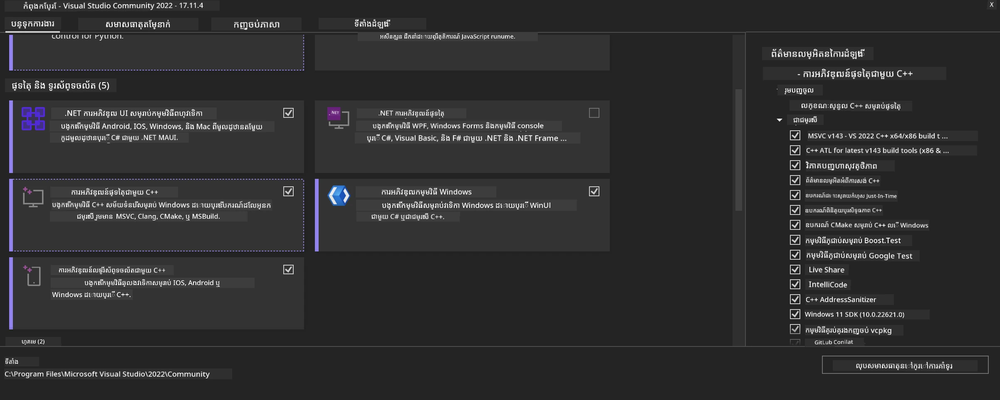
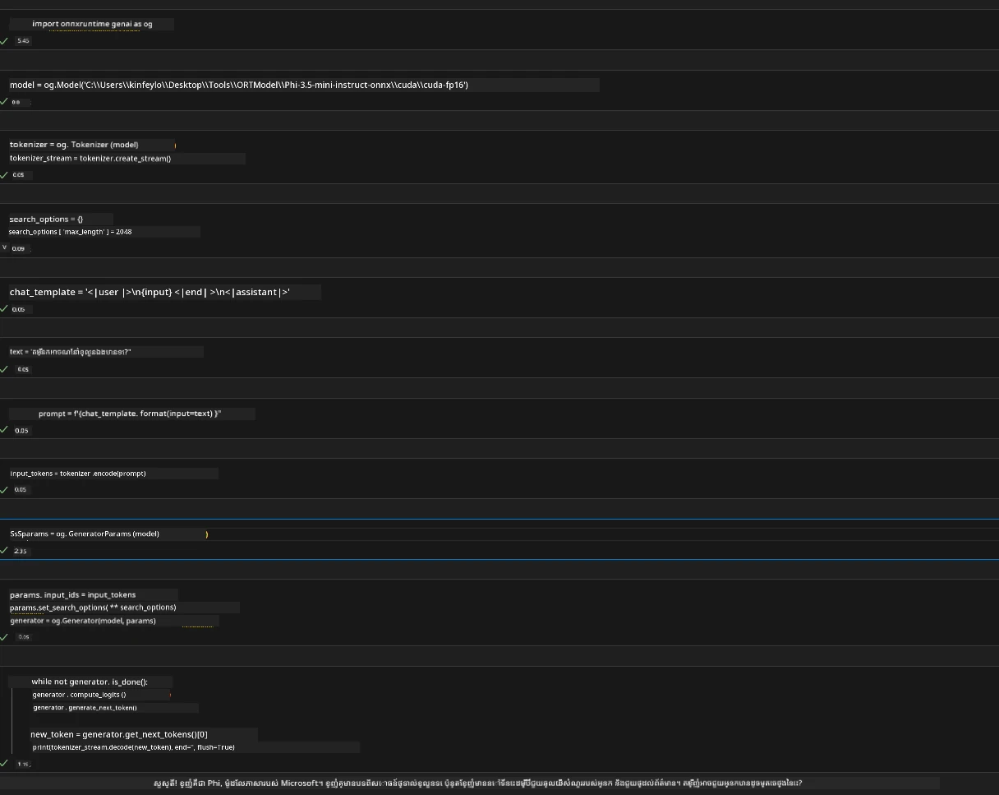
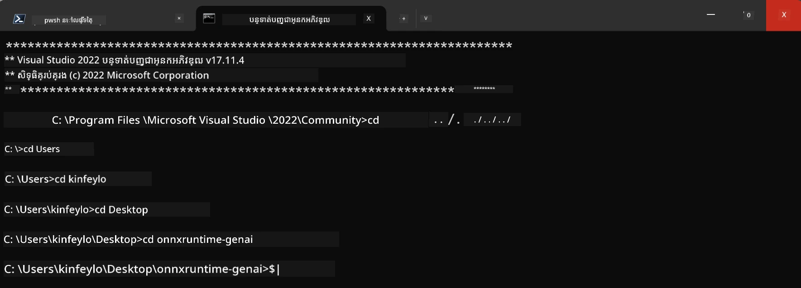

# **មគ្គុទេសក៍សម្រាប់ OnnxRuntime GenAI Windows GPU**

មគ្គុទេសក្តនេះផ្តល់ជំហានសម្រាប់ការតំឡើង និងប្រើប្រាស់ ONNX Runtime (ORT) ជាមួយ GPU លើ Windows។ វាត្រូវបានរចនាឡើងដើម្បីជួយអ្នកប្រើប្រាស់ការបង្កើតល្បឿន GPU សម្រាប់ម៉ូដែលរបស់អ្នក ដើម្បីបង្កើនប្រសិទ្ធភាព និងប្រសិទ្ធភាព។

ឯកសារនេះផ្តល់នូវការណែនាំអំពី:

- ការដំឡើងបរិស្ថាន៖ សេចក្តីណែនាំអំពីការតំឡើងផ្នែកបណ្ដុំដែលចាំបាច់ដូចជា CUDA, cuDNN, និង ONNX Runtime។
- ការកំណត់រចនាសម្ព័ន្ធ៖ របៀបកំណត់បរិស្ថាន និង ONNX Runtime ដើម្បីប្រើប្រាស់ធនធាន GPU បានយ៉ាងមានប្រសិទ្ធភាព។
- គន្លឹះបង្កើនប្រសិទ្ធភាព៖ ការណែនាំអំពីរបៀបកំណត់ការកំណត់ GPU របស់អ្នកសម្រាប់លទ្ធផលប្រសើរបំផុត។

### **1. Python 3.10.x /3.11.8**

   ***ចំណាំ*** សូមណែនាំឲ្យប្រើ [miniforge](https://github.com/conda-forge/miniforge/releases/latest/download/Miniforge3-Windows-x86_64.exe) ជាបរិស្ថាន Python របស់អ្នក

   ```bash

   conda create -n pydev python==3.11.8

   conda activate pydev

   ```

   ***រំលឹក*** បើអ្នកបានដំឡើងបណ្ណាល័យ python ONNX មុននេះ សូមលុបចោល

### **2. តំឡើង CMake ជាមួយ winget**


   ```bash

   winget install -e --id Kitware.CMake

   ```

### **3. តំឡើង Visual Studio 2022 - Desktop Development with C++**

   ***ចំណាំ*** បើអ្នកមិនចង់បង្កCompilation អ្នកអាចរំលងជំហាននេះបាន




### **4. តំឡើងនាវីដា NVIDIA Driver**

1. **NVIDIA GPU Driver**  [https://www.nvidia.com/en-us/drivers/](https://www.nvidia.com/en-us/drivers/)

2. **NVIDIA CUDA 12.4** [https://developer.nvidia.com/cuda-12-4-0-download-archive](https://developer.nvidia.com/cuda-12-4-0-download-archive)

3. **NVIDIA CUDNN 9.4**  [https://developer.nvidia.com/cudnn-downloads](https://developer.nvidia.com/cudnn-downloads)

***រំលឹក*** សូមប្រើការកំណត់លំនាំដើមក្នុងដំណើរការតំឡើង

### **5. កំណត់បរិស្ថាន NVIDIA**

ចម្លង NVIDIA CUDNN 9.4 lib,bin,include ទៅ NVIDIA CUDA 12.4 lib,bin,include

- ចម្លង​ឯកសារ *'C:\Program Files\NVIDIA\CUDNN\v9.4\bin\12.6'* ទៅ *'C:\Program Files\NVIDIA GPU Computing Toolkit\CUDA\v12.4\bin*

- ចម្លង​ឯកសារ *'C:\Program Files\NVIDIA\CUDNN\v9.4\include\12.6'* ទៅ *'C:\Program Files\NVIDIA GPU Computing Toolkit\CUDA\v12.4\include*

- ចម្លង​ឯកសារ *'C:\Program Files\NVIDIA\CUDNN\v9.4\lib\12.6'* ទៅ *'C:\Program Files\NVIDIA GPU Computing Toolkit\CUDA\v12.4\lib\x64'*


### **6. ទាញយក Phi-3.5-mini-instruct-onnx**


   ```bash

   winget install -e --id Git.Git

   winget install -e --id GitHub.GitLFS

   git lfs install

   git clone https://huggingface.co/microsoft/Phi-3.5-mini-instruct-onnx

   ```

### **7. រត់ InferencePhi35Instruct.ipynb**

   បើក [Notebook](../../../../code/09.UpdateSamples/Aug/ortgpu-phi35-instruct.ipynb) ហើយអនុវត្ត





### **8. ដំឡើង ORT GenAI GPU**


   ***ចំណាំ*** 
   
   1. សូមលុបដំណោះស្រាយទាំងអស់អំពី onnx និង onnxruntime និង onnxruntime-genai ជាលើកដំបូង

   
   ```bash

   pip list 
   
   ```

   បន្ទាប់មកលុបបណ្ណាល័យ onnxruntime ទាំងអស់ ឧ. 


   ```bash

   pip uninstall onnxruntime

   pip uninstall onnxruntime-genai

   pip uninstall onnxruntume-genai-cuda
   
   ```

   2. ពិនិត្យមើល Visual Studio Extension មានការគាំទ្រ 

   ពិនិត្យមើល C:\Program Files\NVIDIA GPU Computing Toolkit\CUDA\v12.4\extras ដើម្បីធានាថា C:\Program Files\NVIDIA GPU Computing Toolkit\CUDA\v12.4\extras\visual_studio_integration មានស្ថិតនៅ។ 
   
   ប្រសិនបើមិនមានសូមពិនិត្យថតផ្សេងទៀតនៃ Cuda toolkit driver ហើយចម្លងថត visual_studio_integration និងមាតិកាទាំងអស់ទៅ C:\Program Files\NVIDIA GPU Computing Toolkit\CUDA\v12.4\extras\visual_studio_integration


   - បើអ្នកមិនចង់បង្កCompilation អ្នកអាចរំលងជំហាននេះបាន


   ```bash

   git clone https://github.com/microsoft/onnxruntime-genai

   ```

   - ទាញយក [https://github.com/microsoft/onnxruntime/releases/download/v1.19.2/onnxruntime-win-x64-gpu-1.19.2.zip](https://github.com/microsoft/onnxruntime/releases/download/v1.19.2/onnxruntime-win-x64-gpu-1.19.2.zip)

   - ដោះស្រាយ onnxruntime-win-x64-gpu-1.19.2.zip ហើយប្ដូរឈ្មោះវាទៅជា **ort** ហើយចម្លងថត ort ទៅ onnxruntime-genai

   - ប្រើ Windows Terminal, ចូល Developer Command Prompt សម្រាប់ VS 2022 ហើយចូលទៅ onnxruntime-genai



   - ក្រោយមកបង្កCompilation ជាមួយបរិស្ថាន python របស់អ្នក

   
   ```bash

   cd onnxruntime-genai

   python build.py --use_cuda  --cuda_home "C:\Program Files\NVIDIA GPU Computing Toolkit\CUDA\v12.4" --config Release
 

   cd build/Windows/Release/Wheel

   pip install .whl

   ```

---

<!-- CO-OP TRANSLATOR DISCLAIMER START -->
**ការបដិសេធ**:  
ឯកសារនេះត្រូវបានបתרגםដោយប្រើសេវាកម្មបកប្រែ AI [Co-op Translator](https://github.com/Azure/co-op-translator)។ ខណៈពួកយើងខិតខំរកភាពត្រឹមត្រូវ សូមយោហារថាបកប្រែដោយស្វ័យប្រវត្តិអាចមានកំហុស ឬភាពមិនត្រឹមត្រូវខ្លះ។ ឯកសារដើមក្នុងភាសាដើមគួរត្រូវបានគិតថាជាឧទាហរណ៍ដែលមានអំណាច។ សម្រាប់ព័ត៌មានសំខាន់ៗ គួរតែប្រើការបកប្រែដោយមនុស្សជំនាញ។ ពួកយើងមិនទទួលខុសត្រូវចំពោះការយល់ច្រឡំ ឬការបកព្រៀងខុសដែលកើតឡើងពីការប្រើប្រាស់ការបកប្រែនេះឡើយ។
<!-- CO-OP TRANSLATOR DISCLAIMER END -->