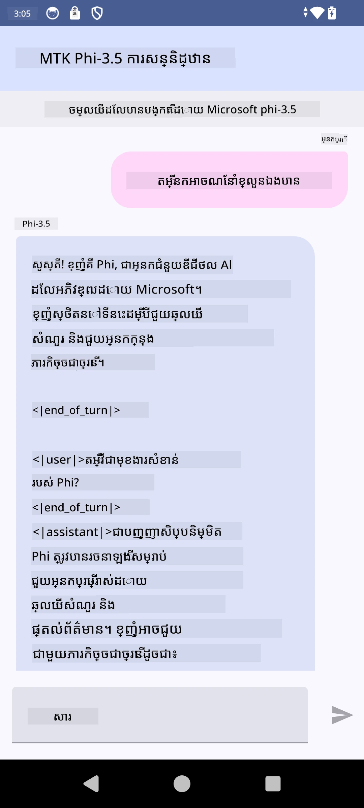

# **ការប្រើប្រាស់ Microsoft Phi-3.5 tflite ដើម្បីបង្កើតកម្មវិធី Android**

នេះគឺជាឧទាហរណ៍ Android ដែលប្រើម៉ូដែល Microsoft Phi-3.5 tflite ។

## **📚 ចំណេះដឹង**

API Android LLM Inference អនុញ្ញាតឱ្យអ្នករត់ម៉ូដែលភាសាធំទូលាយ (LLMs) ពេញលេញនៅលើឧបករណ៍សម្រាប់កម្មវិធី Android ដែលអ្នកអាចប្រើដើម្បីអនុវត្តភារកិច្ចជាច្រើន ដូចជាបង្កើតអត្ថបទ ស្វែងរកព័ត៌មានក្នុងទម្រង់ភាសាធម្មជាតិ និងសង្ខេបឯកសារ។ ភារកិច្ចនេះផ្តល់ការគាំទ្រដែលបានបង្កើតរួចសម្រាប់ម៉ូដែលភាសាធំទូលាយច្រើន ប្រើសម្រាប់បម្លែងអត្ថបទទៅអត្ថបទ ដូច្នេះអ្នកអាចអនុវត្តម៉ូដែល AI បង្កើតថ្មីៗនៅលើឧបករណ៍ Android របស់អ្នក។

Google AI Edge Torch គឺជាបណ្ណាល័យ python ដែលគាំទ្រការបម្លែងម៉ូដែល PyTorch ទៅជា .tflite ដែលបន្ទាប់មកអាចរត់ជាមួយ TensorFlow Lite និង MediaPipe បាន។ វាអនុញ្ញាតឱ្យកម្មវិធីសម្រាប់ Android, iOS និង IoT អាចរត់ម៉ូដែលពេញលេញនៅលើឧបករណ៍។ AI Edge Torch ផ្តល់នូវការគ្របដណ្តប់ CPU រួមទាំងគាំទ្របឋមសម្រាប់ GPU និង NPU។ AI Edge Torch ស្វែងរកការរួមបញ្ចូលយ៉ាងជិតស្និទ្ធជាមួយ PyTorch ដោយបង្កើតលើ torch.export() ហើយផ្តល់នូវការគ្របដណ្តប់ល្អសម្រាប់អុបទាផ័រមាត Core ATen ។

## **🪬 មគ្គុទ្ទេសក៍**

### **🔥 ការបម្លែង Microsoft Phi-3.5 ទៅ tflite ជាមួយការគាំទ្រ**

0. ឧទាហរណ៍នេះសម្រាប់ Android 14+

1. តម្លើង Python 3.10.12

***យោបល់ៈ*** ប្រើ conda ដើម្បីតម្លើងបរិយាកាស Python របស់អ្នក

2. Ubuntu 20.04 / 22.04 (សូមផ្តោតលើ [google ai-edge-torch](https://github.com/google-ai-edge/ai-edge-torch))

***យោបល់ៈ*** ប្រើ Azure Linux VM ឬ cloud vm ពីភាគីទីបី ដើម្បីបង្កើតបរិយាកាសរបស់អ្នក

3. ចូលទៅ bash Linux របស់អ្នក ដើម្បីតម្លើងបណ្ណាល័យ Python

```bash

git clone https://github.com/google-ai-edge/ai-edge-torch.git

cd ai-edge-torch

pip install -r requirements.txt -U 

pip install tensorflow-cpu -U

pip install -e .

```

4. ទាញយក Microsoft-3.5-Instruct ពី Hugging face

```bash

git lfs install

git clone  https://huggingface.co/microsoft/Phi-3.5-mini-instruct

```

5. បំលែង Microsoft Phi-3.5 ទៅ tflite

```bash

python ai-edge-torch/ai_edge_torch/generative/examples/phi/convert_phi3_to_tflite.py --checkpoint_path  Your Microsoft Phi-3.5-mini-instruct path --tflite_path Your Microsoft Phi-3.5-mini-instruct tflite path  --prefill_seq_len 1024 --kv_cache_max_len 1280 --quantize True

```


### **🔥 បំលែង Microsoft Phi-3.5 ទៅ Android Mediapipe Bundle**

សូមតម្លើង mediapipe ជាមុនសិន

```bash

pip install mediapipe

```

រត់កូដនេះនៅក្នុង [សៀវភៅកំណត់ត្រារបស់អ្នក](../../../../code/09.UpdateSamples/Aug/Android/convert/convert_phi.ipynb)

```python

import mediapipe as mp
from mediapipe.tasks.python.genai import bundler

config = bundler.BundleConfig(
    tflite_model='Your Phi-3.5 tflite model path',
    tokenizer_model='Your Phi-3.5 tokenizer model path',
    start_token='start_token',
    stop_tokens=[STOP_TOKENS],
    output_filename='Your Phi-3.5 task model path',
    enable_bytes_to_unicode_mapping=True or Flase,
)
bundler.create_bundle(config)

```


### **🔥 ប្រើ adb push ដើម្បីដាក់ម៉ូដែលភារកិច្ចទៅផ្លូវឧបករណ៍ Android របស់អ្នក**

```bash

adb shell rm -r /data/local/tmp/llm/ # លុបម៉ូដែលដែលបានផ្ទុកមុននេះទាំងអស់

adb shell mkdir -p /data/local/tmp/llm/

adb push 'Your Phi-3.5 task model path' /data/local/tmp/llm/phi3.task

```

### **🔥 ការរត់កូដ Android របស់អ្នក**



---

<!-- CO-OP TRANSLATOR DISCLAIMER START -->
**ការសំណូមពរ**ៈ  
ឯកសារនេះត្រូវបានបកប្រែដោយប្រើសេវាកម្មបកប្រែ AI [Co-op Translator](https://github.com/Azure/co-op-translator)។ យើងខិតខំសំរាប់ភាពត្រឹមត្រូវ ប៉ុន្តែសូមយកចិត្តទុកដាក់ថា ការបកប្រែដោយស្វ័យប្រវត្តិអាចមានកំហុស ឬភាពមិនច្បាស់លាស់។ ឯកសារដើមដែលស្ថិតក្នុងភាសាទាំងដើមគួរត្រូវបានគេយកទៅជាប្រភពដែលមានសេចក្តីអារ៉ាប់អរ។ សម្រាប់ព័ត៌មានសំខាន់ៗ ការបកប្រែដោយមនុស្សជំនាញគឺត្រូវបានផ្ដល់អនុសាសន៍។ យើងមិនទទួលខុសត្រូវចំពោះការយល់ច្រឡំ ឬការបកស្រាយខុសដែលកើតឡើងពីការប្រើប្រាស់ការបកប្រែនេះឡើយ។
<!-- CO-OP TRANSLATOR DISCLAIMER END -->