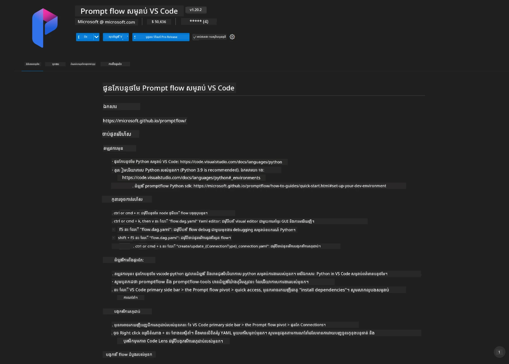
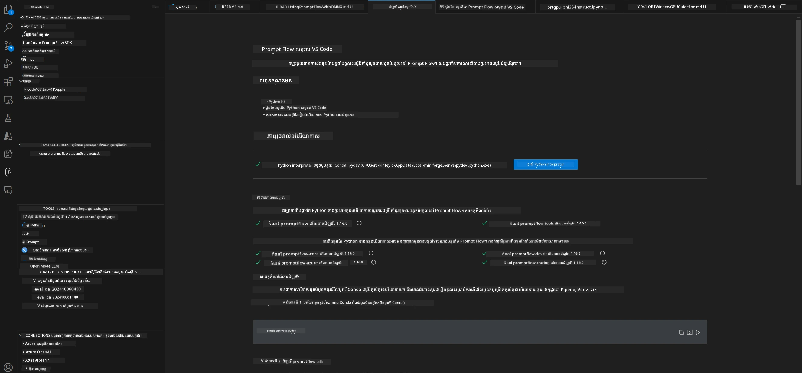
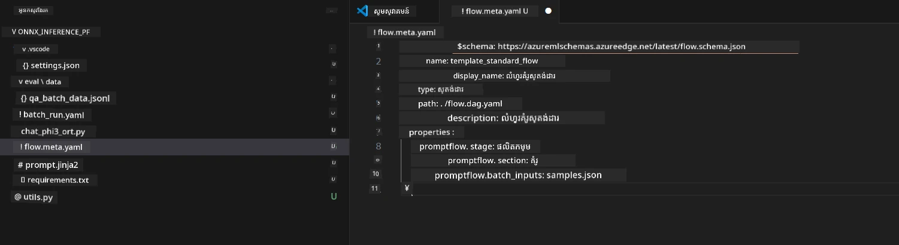
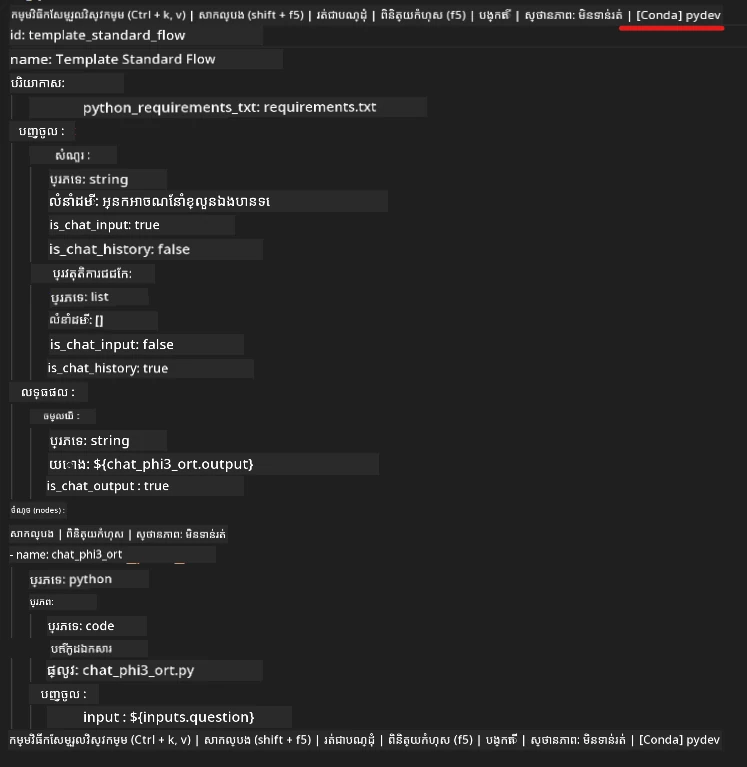
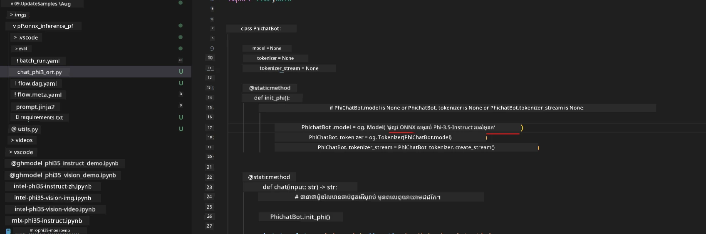
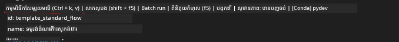
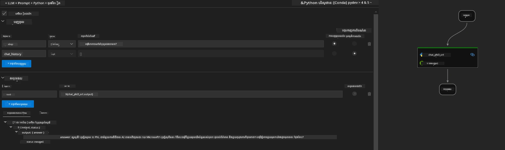
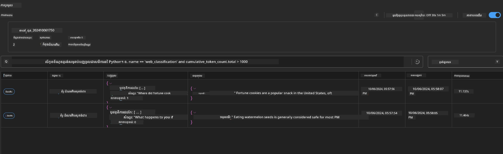

# ការប្រើ GPU Windows ដើម្បីបង្កើតដំណោះស្រាយ Prompt flow ជាមួយ Phi-3.5-Instruct ONNX

ឯកសារខាងក្រោមគឺជាឧទាហរណ៍នៃរបៀបប្រើ PromptFlow ជាមួយ ONNX (Open Neural Network Exchange) សម្រាប់អភិវឌ្ឍកម្មវិធី AI ដែលផ្អែកលើម៉ូដែល Phi-3។

PromptFlow គឺជាស៊ុមឧបករណ៍អភិវឌ្ឍ ដែលបានរចនាឡើងដើម្បីរហ័សបំផុតដំណើរការអភិវឌ្ឍចាប់ពីការគិតគូរ និងសម្រាប់ការតេស្ត និងកំណត់តម្លៃកម្មវិធី AI ដែលមានមូលដ្ឋានលើ LLM (ម៉ូដែលភាសាធំ)។

ដោយការរួមបញ្ចូល PromptFlow ជាមួយ ONNX អ្នកអភិវឌ្ឍអាច:

- បង្កើនប្រសិទ្ធភាពម៉ូដែល៖ ប្រើ ONNX សម្រាប់ការបញ្ជាក់ម៉ូដែល និងការដាក់ចេញយ៉ាងមានប្រសិទ្ធភាព។
- ធ្វើអោយការអភិវឌ្ឍសាមញ្ញ៖ ប្រើ PromptFlow ដើម្បីគ្រប់គ្រងលំហូរការងារ និងស្វ័យប្រវត្តិការងារដែលម្តងម្កាល។
- លើកកម្ពស់សហការណ៍៖ ជួយឲ្យមានការសហការល្អជាងមុនរវាងសមាជិកក្រុម ដោយផ្តល់បរិយាកាសអភិវឌ្ឍសមមា្យ។

**Prompt flow** គឺជាស៊ុមឧបករណ៍អភិវឌ្ឍដែលរចនាឡើងដើម្បីរហ័សបំផុតដំណើរការអភិវឌ្ឍចាប់ពីការគិតគូរ, បង្កើតគំរូ, ការតេស្ត, ការបញ្ចេញតម្លៃ មកដល់ការដាក់ផលិតកម្មនិងការត្រួតពិនិត្យ។ វាធ្វើអោយវិស្វកម្ម prompt មានភាពងាយស្រួល និងអាចអនុញ្ញាតឲ្យអ្នកបង្កើតកម្មវិធី LLM ដែលមានគុណភាពផលិតកម្ម។

Prompt flow អាចភ្ជាប់ទៅកាន់ OpenAI, Azure OpenAI Service, និងម៉ូដែលដែលអាចប្ដូរបាន (Huggingface, LLM/SLM ក្នុងផ្ទាល់)។ យើងសង្ឃឹមដាក់ទុកម៉ូដែល ONNX Phi-3.5 បង្ហាប់នៅក្នុងកម្មវិធីមូលដ្ឋានក្នុងផ្ទាល់។ Prompt flow អាចជួយយើងរៀបចំដំណោះស្រាយអាជីវកម្មបានល្អប្រសើរជាងមុន និងបញ្ចប់ដំណោះស្រាយក្នុងផ្ទាល់ដោយផ្អែកលើ Phi-3.5។ ក្នុងឧទាហរណ៍នេះ យើងនឹងបញ្ចូលបណ្ណាល័យ ONNX Runtime GenAI ដើម្បីបញ្ចប់ដំណោះស្រាយ Prompt flow ដែលផ្អែកលើ Windows GPU។

## **ការតំឡើង**

### **ONNX Runtime GenAI សម្រាប់ Windows GPU**

អានមគ្គុទេសក៍នេះដើម្បីកំណត់ ONNX Runtime GenAI សម្រាប់ Windows GPU  [click here](./ORTWindowGPUGuideline.md)

### **ការតំឡើង Prompt flow ក្នុង VSCode**

1. តំឡើង Prompt flow VS Code Extension



2. បន្ទាប់ពីតំឡើង Prompt flow VS Code Extension，ចុចលើ extension，ហើយជ្រើសរើស **Installation dependencies** ដើម្បីអនុវត្តតាមមគ្គុទេសក៍នេះក្នុងការតំឡើង Prompt flow SDK នៅក្នុងបរិស្ថានរបស់អ្នក



3. ទាញយក [Sample Code](../../../../../../code/09.UpdateSamples/Aug/pf/onnx_inference_pf) ហើយប្រើ VS Code បើកឯកសារគំរូនេះ



4. បើក **flow.dag.yaml** ដើម្បីជ្រើសបរិស្ថាន Python របស់អ្នក



   បើក **chat_phi3_ort.py** ដើម្បីផ្លាស់ទីទីតាំងម៉ូដែល Phi-3.5-instruct ONNX របស់អ្នក



5. រត់ prompt flow របស់អ្នកសម្រាប់ការតេស្ត

បើក **flow.dag.yaml** ចុច visual editor



បន្ទាប់ពីចុចនេះ ហើយរត់វា ដើម្បីតេស្ត



1. អ្នកអាចរត់ជាប៊ិចក្នុង terminal ដើម្បីពិនិត្យលទ្ធផលច្រើនទៀត


```bash

pf run create --file batch_run.yaml --stream --name 'Your eval qa name'    

```

អ្នកអាចពិនិត្យលទ្ធផលនៅក្នុងកម្មវិធីរុករកលំនាំដើមរបស់អ្នក




---

<!-- CO-OP TRANSLATOR DISCLAIMER START -->
**ការបដិសេធ**៖  
ឯកសារនេះត្រូវបានបកប្រែដោយប្រើសេវាបកប្រែ AI [Co-op Translator](https://github.com/Azure/co-op-translator)។ ខណៈពេលដែលយើងខិតខំផ្តល់ភាពត្រឹមត្រូវ សូមយល់ឲ្យច្បាស់ថាការបកប្រែដោយស្វ័យប្រវត្តិ​អាចមានកំហុសឬការមិនត្រឹមត្រូវបាន។ ឯកសារដើមជា​ភាសាកំណើតគួរត្រូវបានពិចារណាថាជាមូលដ្ឋានដែលមានអំណាចស្នូល។ សម្រាប់ព័ត៌មានសំខាន់ ការបកប្រែ​ជាមនុស្ស​ជំនាញគឺត្រូវបានផ្ដល់អនុសាសន៍។ យើងមិនមានការទទួលខុសត្រូវចំពោះការយល់​ខុស ឬការបកស្រាយខុសដែលកើតឡើងពីការប្រើប្រាស់ការបកប្រែនេះទេ។
<!-- CO-OP TRANSLATOR DISCLAIMER END -->