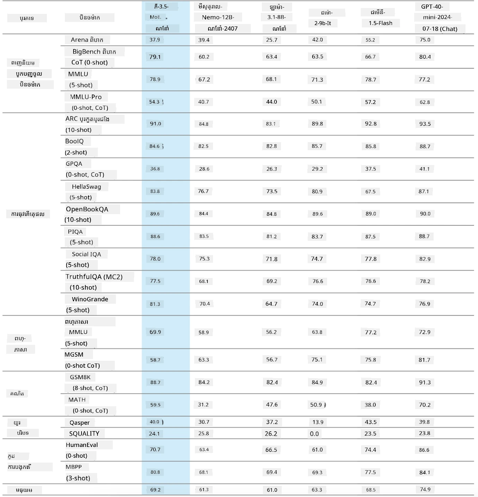
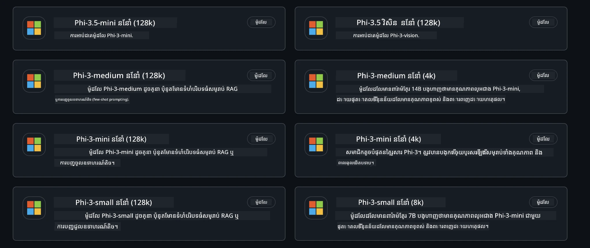
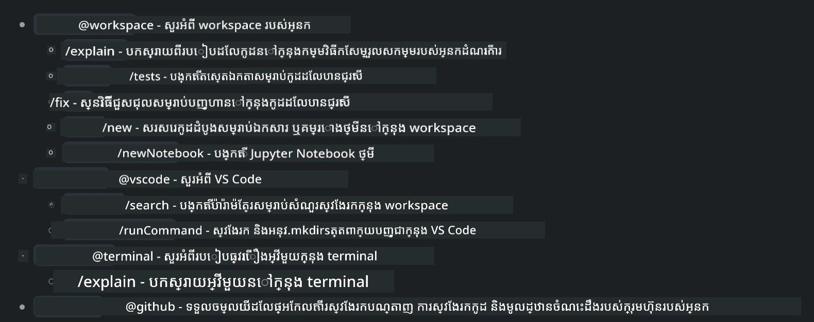
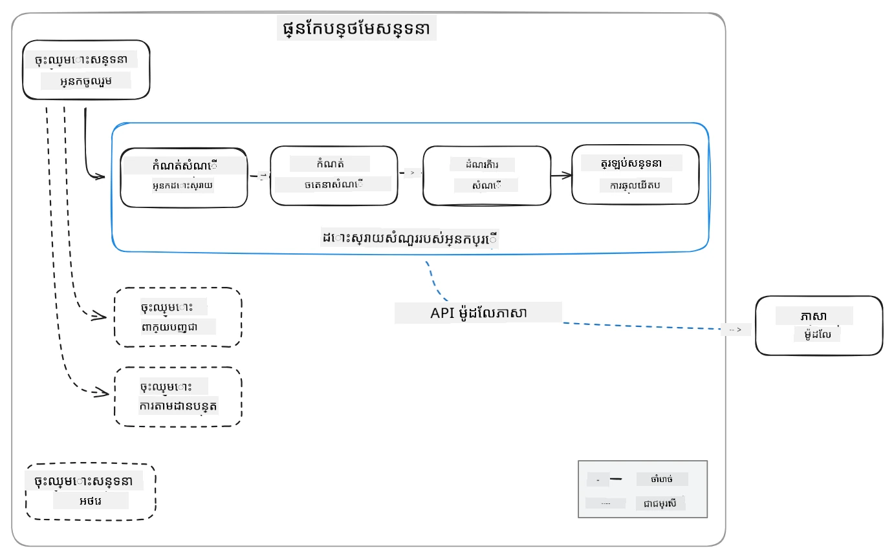
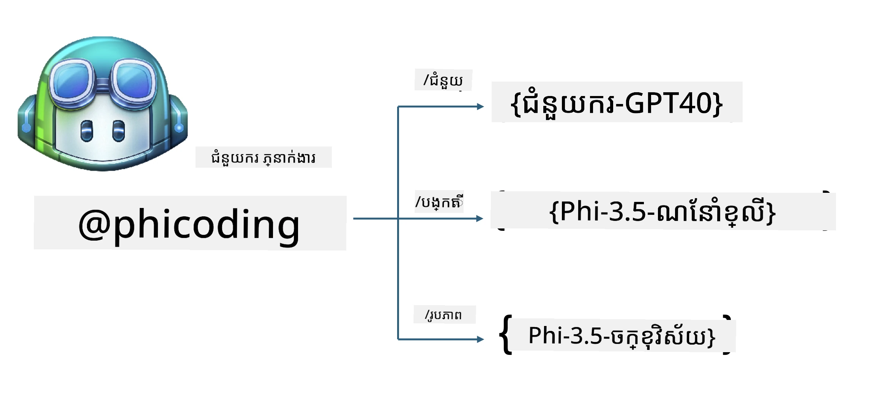
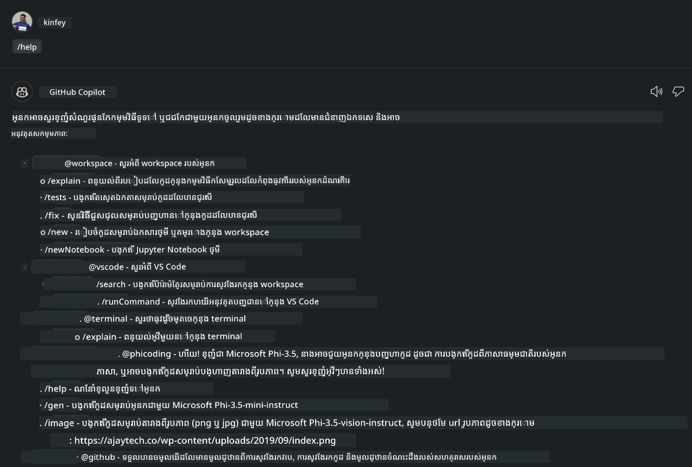
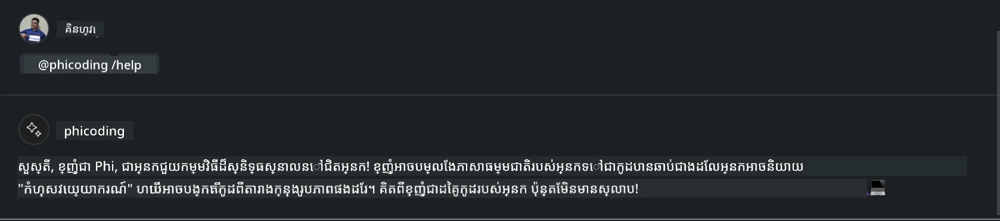
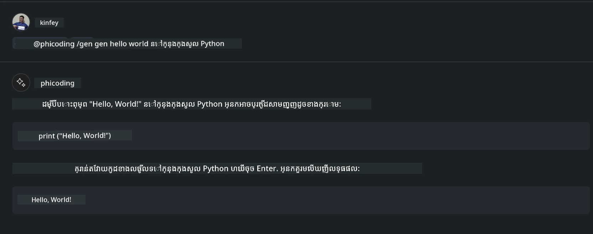
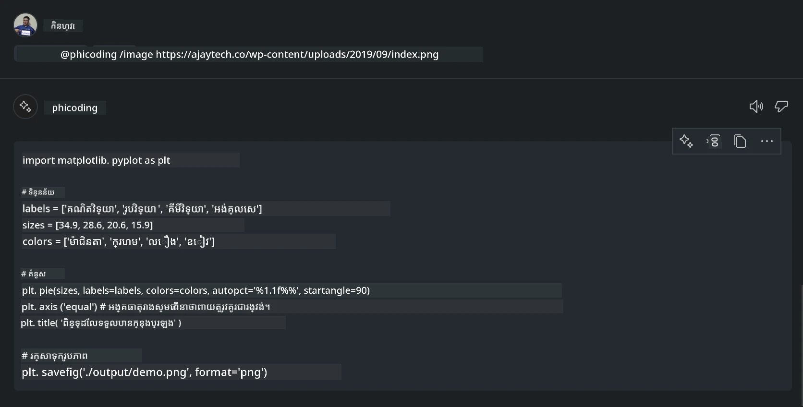

# **បង្កើតភ្នាក់ងារជជែក Visual Studio Code Chat Copilot របស់អ្នកផ្ទាល់ជាមួយ Phi-3.5 ដោយ GitHub Models**

តើអ្នកកំពុងប្រើ Visual Studio Code Copilot ទេ? ជាពិសេសនៅក្នុងជជែក អ្នកអាចប្រើភ្នាក់ងារផ្សេងៗដើម្បីបង្កើនសមត្ថភាពក្នុងការបង្កើត សរសេរ និងថែរក្សា​គម្រោងនៅក្នុង Visual Studio Code។ Visual Studio Code រៀបចំព័ត៌មាន API ដែលអនុញ្ញាតឲ្យក្រុមហ៊ុន និងបុគ្គលបង្កើតភ្នាក់ងារផ្សេងៗដោយផ្អែកលើអាជីវកម្មរបស់ពួកគេ ដើម្បីពង្រីកសមត្ថភាពរបស់ពួកគេនៅក្នុងវិស័យក្នុងផ្ទៃផ្សេងៗ។ ក្នុងអត្ថបទនេះ យើងនឹងផ្តោតលើ **Phi-3.5-mini-instruct (128k)** និង **Phi-3.5-vision-instruct (128k)** របស់ GitHub Models ដើម្បីបង្កើតភ្នាក់ងារ Visual Studio Code របស់អ្នកផ្ទាល់។

## **អំពី Phi-3.5 នៅលើ GitHub Models**

យើងដឹងថា Phi-3/3.5-mini-instruct ក្នុងគ្រួសារ Phi-3/3.5 មានសមត្ថភាពយល់ដឹង និងបង្កើតកូដខ្លាំង ហើយមានអាទិភាពលើ Gemma-2-9b និង Mistral-Nemo-12B-instruct-2407។



GitHub Models ថ្មីៗបានផ្ដល់នូវការចូលប្រើលើម៉ូដែល Phi-3.5-mini-instruct (128k) និង Phi-3.5-vision-instruct (128k)។ អ្នកអភិវឌ្ឍនៅអាចចូលប្រើតាមរយៈ OpenAI SDK, Azure AI Inference SDK និង REST API។



***ចំណាំ៖*** មានការផ្តល់អនុសាបថប្រើ Azure AI Inference SDK នៅទីនេះ ព្រោះវាអាចផ្លាស់ប្តូរបានល្អជាមួយកាតាឡុកម៉ូឌែល Azure នៅបរិយាកាសផលិតកម្ម។

ខាងក្រោមជាលទ្ធផលនៃ **Phi-3.5-mini-instruct (128k)** និង **Phi-3.5-vision-instruct (128k)** ក្នុងលក្ខខណ្ឌបង្កើតកូដបន្ទាប់ពីភ្ជាប់ជាមួយ GitHub Models ហើយក៏រៀបចំសម្រាប់ឧទាហរណ៍បន្ត។

**សាកល្បង៖ GitHub Models Phi-3.5-mini-instruct (128k) បង្កើតកូដពី Prompt** ([ចុចតំណភ្ជាប់នេះ](../../../../code/09.UpdateSamples/Aug/ghmodel_phi35_instruct_demo.ipynb))

**សាកល្បង៖ GitHub Models Phi-3.5-vision-instruct (128k) បង្កើតកូដពីរូបភាព** ([ចុចតំណភ្ជាប់នេះ](../../../../code/09.UpdateSamples/Aug/ghmodel_phi35_vision_demo.ipynb))


## **អំពី GitHub Copilot Chat Agent**

GitHub Copilot Chat Agent អាចបំពេញភារកិច្ចផ្សេងៗក្នុងសៀវភៅគម្រោងផ្សេងៗដោយផ្អែកលើកូដ។ ប្រព័ន្ធមានភ្នាក់ងារបួនប្រភេទ៖ workspace, github, terminal, vscode



ដោយបន្ថែមឈ្មោះភ្នាក់ងារជាមួយ ‘@’ អ្នកអាចបញ្ចប់ការងារត្រូវបានយ៉ាងរហ័ស។ សម្រាប់សហគ្រាស ប្រសិនបើអ្នកបន្ថែមមាតិកាអាជីវកម្មផ្ទាល់ខ្លួនរបស់អ្នកដូចជា តម្រូវការ កូដ ការបញ្ជាក់ការប្រឡង និងការចេញផ្សាយ អ្នកអាចមានមុខងារសំងាត់ផ្ទាល់ខ្លួនរបស់សហគ្រាសមាំមួនជាងនេះលើផ្ទៃ GitHub Copilot។

Visua Studio Code Chat Agent ក៏បានប្រកាស API ផ្លូវការរបស់ខ្លួនហើយ អនុញ្ញាតឲ្យសហគ្រាស ឬ អ្នកអភិវឌ្ឍសហគ្រាសអភិវឌ្ឍភ្នាក់ងារបានជាមួយប្រព័ន្ធអាជីវកម្មកម្មវិធីផ្សេងៗ។ ដាក់លើវិធីអភិវឌ្ឍ Visual Studio Code Extension Development អ្នកអាចចូលប្រើចំណុចប្រទាក់ API របស់ Visual Studio Code Chat Agent បានយ៉ាងសាមញ្ញ។ យើងអាចអភិវឌ្ឍដោយផ្អែកលើដំណើរការនេះ។



លក្ខខណ្ឌអភិវឌ្ឍន៍អាចគាំទ្រការចូលប្រើ API ម៉ូឌែលភាគីទីបី (ដូចជា GitHub Models, Azure Model Catalog និងសេវាកម្មស្ថាបនាឡើងដោយខ្លួនឯងដោយផ្អែកលើម៉ូដែល open source) ហើយក៏អាចប្រើម៉ូដែល gpt-35-turbo, gpt-4 និង gpt-4o ដែល GitHub Copilot ផ្ដល់។

## **បន្ថែមភ្នាក់ងាររបស់អ្នក @phicoding ដោយផ្អែកលើ Phi-3.5**

យើងព្យាយាមបញ្ចូលសមត្ថភាពកម្មវិធីរបស់ Phi-3.5 ដើម្បីបំពេញការសរសេរកូដ បង្កើតកូដរូបភាព និងភារកិច្ចផ្សេងៗ។ បង្កើតភ្នាក់ងារមួយជុំវិញ Phi-3.5 - @PHI ដែលខាងក្រោមជាពីរបៀបមួយចំនួន៖

1. បង្កើតការណែនាំខ្លួនដោយផ្អែកលើ GPT-4o ដែល GitHub Copilot ផ្ដល់ តាមពាក្យបញ្ជា **@phicoding /help**

2. បង្កើតកូដសម្រាប់ភាសាកម្មវិធីផ្សេងៗដោយផ្អែកលើ **Phi-3.5-mini-instruct (128k)** តាមពាក្យបញ្ជា **@phicoding /gen**

3. បង្កើតកូដដោយផ្អែកលើ **Phi-3.5-vision-instruct (128k)** និងបំពេញកូដរូបភាព តាមពាក្យបញ្ជា **@phicoding /image**



## **ជំហានពាក់ព័ន្ធ**

1. តម្លើងការគាំទ្រអភិវឌ្ឍ Visual Studio Code Extension ដោយប្រើ npm

```bash

npm install --global yo generator-code 

```
2. បង្កើតផ្លUGIN Visual Studio Code Extension (ប្រើរបៀបអភិវឌ្ឍ Typescript, ដាក់ឈ្មោះ phiext)


```bash

yo code 

```

3. បើកគម្រោងដែលបានបង្កើតហើយកែប្រែ package.json។ នេះជាសេចក្ដីណែនាំនិងការកំណត់ដែលពាក់ព័ន្ធ រួមជាមួយការកំណត់ GitHub Models។ សូមកំណត់ចំណាំថា ត្រូវបន្ថែម token GitHub Models របស់អ្នកនៅទីនេះ។

```json

{
  "name": "phiext",
  "displayName": "phiext",
  "description": "",
  "version": "0.0.1",
  "engines": {
    "vscode": "^1.93.0"
  },
  "categories": [
    "AI",
    "Chat"
  ],
  "activationEvents": [],
  "enabledApiProposals": [
      "chatVariableResolver"
  ],
  "main": "./dist/extension.js",
  "contributes": {
    "chatParticipants": [
        {
            "id": "chat.phicoding",
            "name": "phicoding",
            "description": "Hey! I am Microsoft Phi-3.5, She can help me with coding problems, such as generation code with your natural language, or even generation code about chart from images. Just ask me anything!",
            "isSticky": true,
            "commands": [
                {
                    "name": "help",
                    "description": "Introduce myself to you"
                },
                {
                    "name": "gen",
                    "description": "Generate code for you with Microsoft Phi-3.5-mini-instruct"
                },
                {
                    "name": "image",
                    "description": "Generate code for chart from image(png or jpg) with Microsoft Phi-3.5-vision-instruct, please add image url like this : https://ajaytech.co/wp-content/uploads/2019/09/index.png"
                }
            ]
        }
    ],
    "commands": [
        {
            "command": "phicoding.namesInEditor",
            "title": "Use Microsoft Phi 3.5 in Editor"
        }
    ],
    "configuration": {
      "type": "object",
      "title": "githubmodels",
      "properties": {
        "githubmodels.endpoint": {
          "type": "string",
          "default": "https://models.inference.ai.azure.com",
          "description": "Your GitHub Models Endpoint",
          "order": 0
        },
        "githubmodels.api_key": {
          "type": "string",
          "default": "Your GitHub Models Token",
          "description": "Your GitHub Models Token",
          "order": 1
        },
        "githubmodels.phi35instruct": {
          "type": "string",
          "default": "Phi-3.5-mini-instruct",
          "description": "Your Phi-35-Instruct Model",
          "order": 2
        },
        "githubmodels.phi35vision": {
          "type": "string",
          "default": "Phi-3.5-vision-instruct",
          "description": "Your Phi-35-Vision Model",
          "order": 3
        }
      }
    }
  },
  "scripts": {
    "vscode:prepublish": "npm run package",
    "compile": "webpack",
    "watch": "webpack --watch",
    "package": "webpack --mode production --devtool hidden-source-map",
    "compile-tests": "tsc -p . --outDir out",
    "watch-tests": "tsc -p . -w --outDir out",
    "pretest": "npm run compile-tests && npm run compile && npm run lint",
    "lint": "eslint src",
    "test": "vscode-test"
  },
  "devDependencies": {
    "@types/vscode": "^1.93.0",
    "@types/mocha": "^10.0.7",
    "@types/node": "20.x",
    "@typescript-eslint/eslint-plugin": "^8.3.0",
    "@typescript-eslint/parser": "^8.3.0",
    "eslint": "^9.9.1",
    "typescript": "^5.5.4",
    "ts-loader": "^9.5.1",
    "webpack": "^5.94.0",
    "webpack-cli": "^5.1.4",
    "@vscode/test-cli": "^0.0.10",
    "@vscode/test-electron": "^2.4.1"
  },
  "dependencies": {
    "@types/node-fetch": "^2.6.11",
    "node-fetch": "^3.3.2",
    "@azure-rest/ai-inference": "latest",
    "@azure/core-auth": "latest",
    "@azure/core-sse": "latest"
  }
}


```

4. កែប្រែ src/extension.ts


```typescript

// ម៉ូឌុល 'vscode' មាន API ប្រើប្រាស់បន្ថែមរបស់ VS Code
// នាំចូលម៉ូឌុល និងយោងវាជាមួយរឿងលេចឈ្មោះ vscode ក្នុងកូដរបស់អ្នកខាងក្រោម
import * as vscode from 'vscode';
import ModelClient from "@azure-rest/ai-inference";
import { AzureKeyCredential } from "@azure/core-auth";


interface IPhiChatResult extends vscode.ChatResult {
    metadata: {
        command: string;
    };
}


const MODEL_SELECTOR: vscode.LanguageModelChatSelector = { vendor: 'copilot', family: 'gpt-4o' };

function isValidImageUrl(url: string): boolean {
    const regex = /^(https?:\/\/.*\.(?:png|jpg))$/i;
    return regex.test(url);
}
  

// វិធីនេះត្រូវបានហៅនៅពេលបន្ថែមរបស់អ្នកត្រូវបានបើកប្រើ
// បន្ថែមរបស់អ្នកត្រូវបានបើកប្រើនៅពេលដំបូងដែលបានអនុវត្តបញ្ជា
export function activate(context: vscode.ExtensionContext) {

    const codinghandler: vscode.ChatRequestHandler = async (request: vscode.ChatRequest, context: vscode.ChatContext, stream: vscode.ChatResponseStream, token: vscode.CancellationToken): Promise<IPhiChatResult> => {


        const config : any = vscode.workspace.getConfiguration('githubmodels');
        const endPoint: string = config.get('endpoint');
        const apiKey: string = config.get('api_key');
        const phi35instruct: string = config.get('phi35instruct');
        const phi35vision: string = config.get('phi35vision');
        
        if (request.command === 'help') {

            const content = "Welcome to Coding assistant with Microsoft Phi-3.5"; 
            stream.progress(content);


            try {
                const [model] = await vscode.lm.selectChatModels(MODEL_SELECTOR);
                if (model) {
                    const messages = [
                        vscode.LanguageModelChatMessage.User("Please help me express this content in a humorous way: I am a programming assistant who can help you convert natural language into code and generate code based on the charts in the images. output format like this : Hey I am Phi ......")
                    ];
                    const chatResponse = await model.sendRequest(messages, {}, token);
                    for await (const fragment of chatResponse.text) {
                        stream.markdown(fragment);
                    }
                }
            } catch(err) {
                console.log(err);
            }


            return { metadata: { command: 'help' } };

        }

        
        if (request.command === 'gen') {

            const content = "Welcome to use phi-3.5 to generate code";

            stream.progress(content);

            const client = new ModelClient(endPoint, new AzureKeyCredential(apiKey));

            const response = await client.path("/chat/completions").post({
              body: {
                messages: [
                  { role:"system", content: "You are a coding assistant.Help answer all code generation questions." },
                  { role:"user", content: request.prompt }
                ],
                model: phi35instruct,
                temperature: 0.4,
                max_tokens: 1000,
                top_p: 1.
              }
            });

            stream.markdown(response.body.choices[0].message.content);

            return { metadata: { command: 'gen' } };

        }


        
        if (request.command === 'image') {


            const content = "Welcome to use phi-3.5 to generate code from image(png or jpg),image url like this:https://ajaytech.co/wp-content/uploads/2019/09/index.png";

            stream.progress(content);

            if (!isValidImageUrl(request.prompt)) {
                stream.markdown('Please provide a valid image URL');
                return { metadata: { command: 'image' } };
            }
            else
            {

                const client = new ModelClient(endPoint, new AzureKeyCredential(apiKey));
    
                const response = await client.path("/chat/completions").post({
                    body: {
                      messages: [
                        { role: "system", content: "You are a helpful assistant that describes images in details." },
                        { role: "user", content: [
                            { type: "text", text: "Please generate code according to the chart in the picture according to the following requirements\n1. Keep all information in the chart, including data and text\n2. Do not generate additional information that is not included in the chart\n3. Please extract data from the picture, do not generate it from csv\n4. Please save the regenerated chart as a chart and save it to ./output/demo.png"},
                            { type: "image_url", image_url: {url: request.prompt}
                            }
                          ]
                        }
                      ],
                      model: phi35vision,
                      temperature: 0.4,
                      max_tokens: 2048,
                      top_p: 1.
                    }
                  });
    
                
                stream.markdown(response.body.choices[0].message.content);
    
                return { metadata: { command: 'image' } };
            }


        }


        return { metadata: { command: '' } };
    };


    const phi_ext = vscode.chat.createChatParticipant("chat.phicoding", codinghandler);

    phi_ext.iconPath = new vscode.ThemeIcon('sparkle');


    phi_ext.followupProvider = {
        provideFollowups(result: IPhiChatResult, context: vscode.ChatContext, token: vscode.CancellationToken) {
            return [{
                prompt: 'Let us coding with Phi-3.5 😋😋😋😋',
                label: vscode.l10n.t('Enjoy coding with Phi-3.5'),
                command: 'help'
            } satisfies vscode.ChatFollowup];
        }
    };

    context.subscriptions.push(phi_ext);
}

// វិធីនេះត្រូវបានហៅនៅពេលបន្ថែមរបស់អ្នកត្រូវបានបិទប្រើ
export function deactivate() {}


```

6. ការរត់កម្មវិធី

***/help***



***@phicoding /help***



***@phicoding /gen***




***@phicoding /image***




អ្នកអាចទាញយកកូដឧទាហរណ៍ :[ចុច](../../../../../../code/09.UpdateSamples/Aug/vscode)

## **ធនធាន**

1. ចុះឈ្មោះ GitHub Models [https://gh.io/models](https://gh.io/models)

2. សិក្សាអំពីការអភិវឌ្ឍ Visual Studio Code Extension [https://code.visualstudio.com/api/get-started/your-first-extension](https://code.visualstudio.com/api/get-started/your-first-extension)

3. រៀនអំពី Visual Studio Code Copilot Chat API [https://code.visualstudio.com/api/extension-guides/chat](https://code.visualstudio.com/api/extension-guides/chat)

---

<!-- CO-OP TRANSLATOR DISCLAIMER START -->
**ការបដិសេធ**៖  
ឯកសារនេះត្រូវបានបកប្រែដោយប្រើសេវាកម្មបកប្រែ AI [Co-op Translator](https://github.com/Azure/co-op-translator)។ ខណៈពេលដែលយើងខិតខំរកភាពច្បាស់លាស់ សូមយកចិត្តទុកដាក់ថាការបកប្រែស្វ័យប្រវត្តិអាចមានកំហុសឬការខុសឆ្គង។ ឯកសារដើមក្នុងភាសាទៅវិញទៅមកគួរត្រូវបានគិតថាជา ប្រភពផ្លូវការជាចម្បង។ សម្រាប់ព័ត៌មានដ៏សំខាន់ សូមណែនាំឱ្យប្រើប្រាស់ការបកប្រែដោយមនុស្សជំនាញវិជ្ជាជីវៈ។ យើងមិនទទួលខុសត្រូវចំពោះការយល់ច្រឡំ ឬការបកប្រែខុសផ្សេងៗដែលកើតឡើងពីការប្រើប្រាស់ការបកប្រែនេះទេ។
<!-- CO-OP TRANSLATOR DISCLAIMER END -->