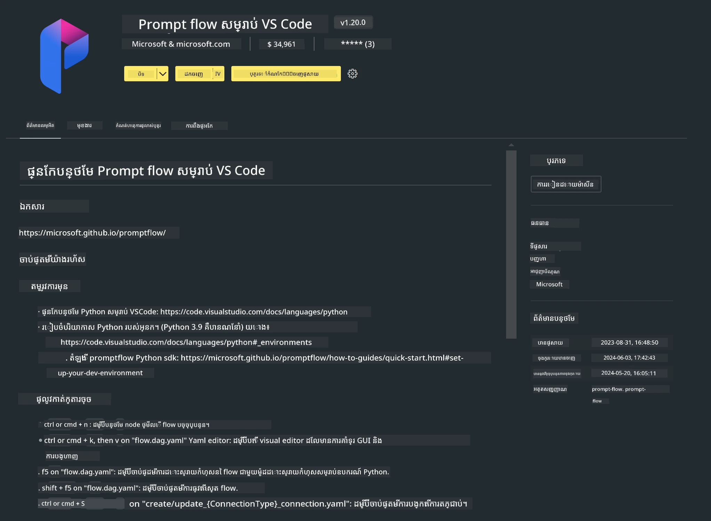

# **មេរៀន 0 - ការដំឡើង**

ពេលយើងចូលមកមេរៀន គឺត្រូវការកំណត់បរិបទដែលទាក់ទង :


### **1. Python 3.11+**

គឺសូមណែនាំឱ្យប្រើ miniforge ដើម្បីកំណត់បរិបទ Python របស់អ្នក

ដើម្បីកំណត់ miniforge, សូមយោងទៅ [https://github.com/conda-forge/miniforge](https://github.com/conda-forge/miniforge)

បន្ទាប់ពីកំណត់ miniforge រួច សូមរត់ពាក្យបញ្ជាខាងក្រោមនៅក្នុង Power Shell

```bash

conda create -n pyenv python==3.11.8 -y

conda activate pyenv

```


### **2. ដំឡើង Prompt flow SDK**

នៅក្នុងមេរៀន 1, យើងប្រើ Prompt flow ដូច្នោះអ្នកត្រូវកំណត់ Prompt flow SDK។

```bash

pip install promptflow --upgrade

```

អ្នកអាចត្រួតពិនិត្យ promptflow sdk ដោយប្រើពាក្យបញ្ជានេះ


```bash

pf --version

```

### **3. ដំឡើង Visual Studio Code Prompt flow Extension**



### **4. រចនាសម្ព័ន្ធ MLX របស់ Apple**

MLX គឺជាក្របខណ្ឌអារេសម្រាប់ការស្រាវជ្រាវម៉ាស៊ីនរៀនលើ Apple silicon ដែលផ្ដល់ដោយ Apple machine learning research។ អ្នកអាចប្រើ **Apple MLX framework** ដើម្បីបង្កើនល្បឿន LLM / SLM ជាមួយ Apple Silicon។ បើអ្នកចង់ដឹងបន្ថែម អ្នកអាចអាន [https://github.com/microsoft/PhiCookBook/blob/main/md/01.Introduction/03/MLX_Inference.md](https://github.com/microsoft/PhiCookBook/blob/main/md/01.Introduction/03/MLX_Inference.md)។

ដំឡើងបណ្ណាល័យ MLX framework ក្នុង bash


```bash

pip install mlx-lm

```


### **5. បណ្ណាល័យ Python ផ្សេងៗ**


បង្កើត requirements.txt ហើយបញ្ចូលមាតិកានេះ

```txt

notebook
numpy 
scipy 
scikit-learn 
matplotlib 
pandas 
pillow 
graphviz

```


### **6. ដំឡើង NVM**

ដំឡើង nvm នៅក្នុង Powershell 


```bash

brew install nvm

```

ដំឡើង nodejs 18.20


```bash

nvm install 18.20.0

nvm use 18.20.0

```

### **7. ដំឡើង Visual Studio Code Development Support**


```bash

npm install --global yo generator-code

```

អបអរសាទរ! អ្នកបានកំណត់ SDK បានជោគជ័យ។ បន្ទាប់មក សូមបន្តទៅជំហានដាក់ហាត់។

---

<!-- CO-OP TRANSLATOR DISCLAIMER START -->
**ការបដិសេធ**៖  
ឯកសារនេះត្រូវបានបំលែងជាភាសាដោយប្រើសេវាកម្មបកប្រែ AI [Co-op Translator](https://github.com/Azure/co-op-translator)។ ខណៈពេលដែលយើងខិតខំប្រាថ្នានូវភាពត្រឹមត្រូវ សូមយល់ដឹងថាការបកប្រែដោយស្វ័យប្រវត្តិអាចមានកំហុស ឬក៏ភាពមិនត្រឹមត្រូវ។ ឯកសារដើមនៅក្នុងភាសាមេគួរត្រូវបានផ្តល់ជាមូលដ្ឋានដ៏ទូលំទូលាយបំផុត។ សម្រាប់ព័ត៌មានចាំបាច់ យើងណែនាំឲ្យប្រើប្រាស់ការបកប្រែដោយអ្នកជំនាញមនុស្ស។ យើងមិនទទួលខុសត្រូវចំពោះការយល់ច្រឡំ ឬការបកផ្សាយដែលមិនត្រឹមត្រូវណាមួយដែលកើតមានដោយការប្រើប្រាស់ការបកប្រែនេះឡើយ។
<!-- CO-OP TRANSLATOR DISCLAIMER END -->