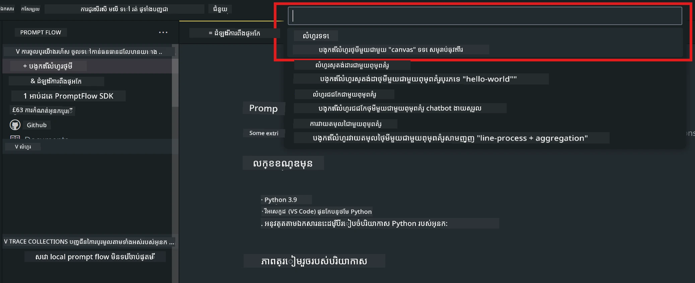
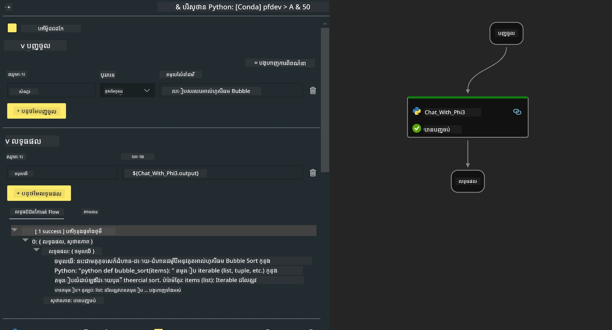

# **មេរៀន 2 - រត់ Prompt flow ជាមួយ Phi-3-mini ក្នុង AIPC**

## **Prompt flow ជាអ្វី**

Prompt flow គឺជាសំណុំឧបករណ៍អភិវឌ្ឍដែលផ្សំឡើងដើម្បីសម្រួលដំណើរការអភិវឌ្ឍលំដាប់ចុងចុងខ្ពស់សម្រាប់កម្មវិធី AI ដែលមានមូលដ្ឋានលើ LLM, ចាប់ពីការសម្រួលគំនិត, បង្កើតគំរូ, សាកល្បង, ការវាយតម្លៃ រហូតដល់ការដាក់ប្រើជាក់ស្តែង និងការតាមដាន។ វាធ្វើឱ្យការបង្កើត prompt engineering ងាយលើ និងអនុញ្ញាតឱ្យអ្នកអាចបង្កើតកម្មវិធី LLM ដែលមានគុណភាពផលិតកម្ម។

ជាមួយ Prompt flow អ្នកអាចធ្វើបាន៖

- បង្កើត flows ដែលភ្ជាប់ LLMs, prompts, កូដ Python និងឧបករណ៍ផ្សេងទៀតជាមួយគ្នា ក្នុង workflow ដែលអាចដំណើរការ។

- ការពិនិត្យកំហុស និងធ្វើ iteration លើ flows របស់អ្នក ជាពិសេសការប្រាស្រ័យសន្ទនាជាមួយ LLMs បានយ៉ាងងាយស្រួល។

- វាយតម្លៃ flows របស់អ្នក គណនាមេត្រិកគុណភាព និងកម្រិតប្រតិបត្តិការជាមួយទិន្នន័យធំៗ។

- បញ្ចូលការសាកល្បង និងវាយតម្លៃចូលក្នុងប្រព័ន្ធ CI/CD របស់អ្នក ដើម្បីធានាគុណភាពនៃ flow របស់អ្នក។

- បញ្ចេញ flows របស់អ្នកទៅវេទិកាបម្រើដែលអ្នកជ្រើសរើស ឬបញ្ចូលទៅក្នុងកូដកម្មវិធីរបស់អ្នកយ៉ាងងាយស្រួល។

- (ជាជម្រើស ប៉ុន្តែ highly recommended) សហការជាមួយក្រុមរបស់អ្នកដោយប្រើប្រាស់កំណែ cloud នៃ Prompt flow ក្នុង Azure AI។

## **ការបង្កើត generation code flows នៅលើ Apple Silicon**

***សម្គាល់***៖ ប្រសិនបើអ្នកមិនទាន់បានបញ្ចប់ការដំឡើងបរិស្ថាន សូមចូលទៅកាន់ [Lab 0 -Installations](./01.Installations.md)

1. បើក Prompt flow Extension ក្នុង Visual Studio Code ហើយបង្កើតគម្រោង flow ថ្មីទទេ



2. បន្ថែមប៉ារ៉ាម៉ែត្រ Inputs និង Outputs និងបន្ថែម Python Code ជា flow ថ្មី



អ្នកអាចយោងទៅលើរចនាសម្ព័ន្ធនេះ (flow.dag.yaml) ដើម្បីសាងសង់ flow របស់អ្នក

```yaml

inputs:
  prompt:
    type: string
    default: Write python code for Fibonacci serie. Please use markdown as output
outputs:
  result:
    type: string
    reference: ${gen_code_by_phi3.output}
nodes:
- name: gen_code_by_phi3
  type: python
  source:
    type: code
    path: gen_code_by_phi3.py
  inputs:
    prompt: ${inputs.prompt}


```

3. បរិមាណ phi-3-mini

យើងមានបំណងដំណើរការ SLM នៅលើឧបករណ៍ក្នុងស្រុកបានប្រសើរឡើង។ ទូទៅ យើងបរិមាណម៉ូឌែល (INT4, FP16, FP32)

```bash

python -m mlx_lm.convert --hf-path microsoft/Phi-3-mini-4k-instruct

```

**សម្គាល់:** ថតលំនាំដើមគឺ mlx_model

4. បន្ថែមកូដនៅក្នុង ***Chat_With_Phi3.py***

```python


from promptflow import tool

from mlx_lm import load, generate


# ផ្នែកបញ្ចូលនឹងផ្លាស់ប្តូរតាមអាគុយម៉ង់នៃមុខងារឧបករណ៍ បន្ទាប់ពីអ្នករក្សាទុកកូដ
# ការបន្ថែមប្រភេទទៅអាគុយម៉ង់ និងតម្លៃហៅត្រឡប់នឹងជួយប្រព័ន្ធបង្ហាញប្រភេទបានត្រឹមត្រូវ
# សូមបន្ទាន់សម័យឈ្មោះ/ហត្ថលេខាមុខងារតាមការត្រូវការ
@tool
def my_python_tool(prompt: str) -> str:

    model_id = './mlx_model_phi3_mini'

    model, tokenizer = load(model_id)

    # <|user|>\nសរសេរកូដ Python សម្រាប់ស៊េរី Fibonacci សូមប្រើ markdown ជាផលបញ្ចេញ<|end|>\n<|assistant|>

    response = generate(model, tokenizer, prompt="<|user|>\n" + prompt  + "<|end|>\n<|assistant|>", max_tokens=2048, verbose=True)

    return response


```

4. អ្នកអាចសាកល្បង flow ពី Debug ឬ Run ដើម្បីពិនិត្យមើលកូដបង្កើតត្រូវតាមរយៈលទ្ធផល


5. រត់ flow ជា API អភិវឌ្ឍន៍នៅក្នុង terminal

```

pf flow serve --source ./ --port 8080 --host localhost   

```

អ្នកអាចសាកល្បងវា នៅក្នុង Postman / Thunder Client

### **សម្គាល់**

1. ការរត់លើកដំបូងចំណាយពេលវេលា ណែនាំឱ្យទាញយកម៉ូឌែល phi-3 ពី Hugging face CLI ។

2. ដើម្បីពិចារណាកម្លាំងកុំព្យូទ័រដែលមានកំណត់នៃ Intel NPU, ណែនាំឱ្យប្រើ Phi-3-mini-4k-instruct

3. យើងប្រើប្រាស់ Intel NPU Acceleration ដើម្បីបរិមាណបម្លែងទ្រង់ទ្រាយជា INT4 ប៉ុន្តែប្រសិនបើអ្នកដំណើរការវេបសេវាឡើងវិញ អ្នកត្រូវលុបថត cache និងថត nc_workshop។


## **ធនធាន**

1. រៀន Promptflow [https://microsoft.github.io/promptflow/](https://microsoft.github.io/promptflow/)

2. រៀន Intel NPU Acceleration [https://github.com/intel/intel-npu-acceleration-library](https://github.com/intel/intel-npu-acceleration-library)

3. កូដគំរូ, ទាញយក [Local NPU Agent Sample Code](../../../../../../../../../code/07.Lab/01/AIPC/local-npu-agent)

---

<!-- CO-OP TRANSLATOR DISCLAIMER START -->
**ការបដិស្តង់**៖  
ឯកសារនេះត្រូវបានបកប្រែដោយប្រើសេវាកម្មបកប្រែ AI [Co-op Translator](https://github.com/Azure/co-op-translator)។ ខណៈពេលដែលយើងខំប្រឹងប្រែងដើម្បីភាពត្រឹមត្រូវ សូមកត់សម្គាល់ថាការបកប្រែដោយស្វ័យប្រវត្តិក្នុងខ្លះៗប្រហែលមានកំហុស ឬច្រឡំ។ ឯកសារដើមក្នុងភាសាមាតិចគួរត្រូវបានចាត់ទុកជាមូលដ្ឋានដ៏មានសុពលភាព។ សម្រាប់ព័ត៌មានសំខាន់ៗ ការបកប្រែដោយមនុស្សដែលមានជំនាញគឺជាការផ្តល់អនុសាសន៍។ យើងមិនទទួលខុសត្រូវចំពោះការយល់ច្រឡំ ឬការបកប្រែខុសពីការប្រើប្រាស់ការបកប្រែនេះឡើយ។
<!-- CO-OP TRANSLATOR DISCLAIMER END -->