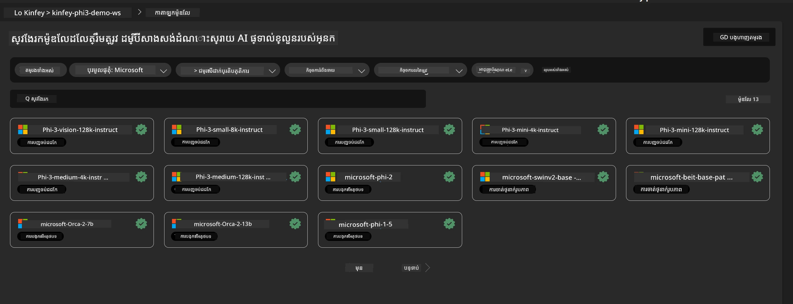
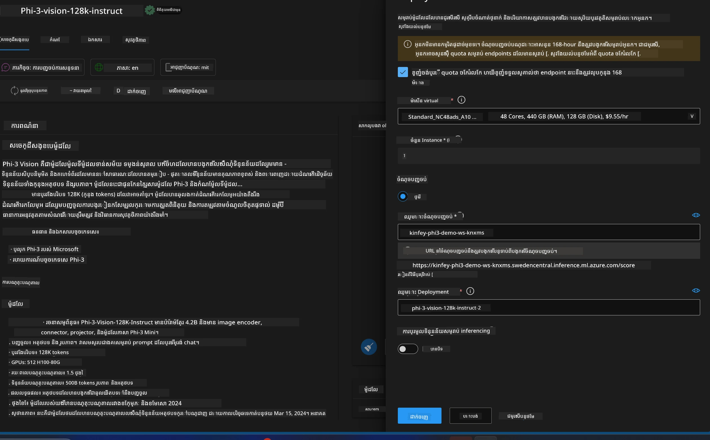
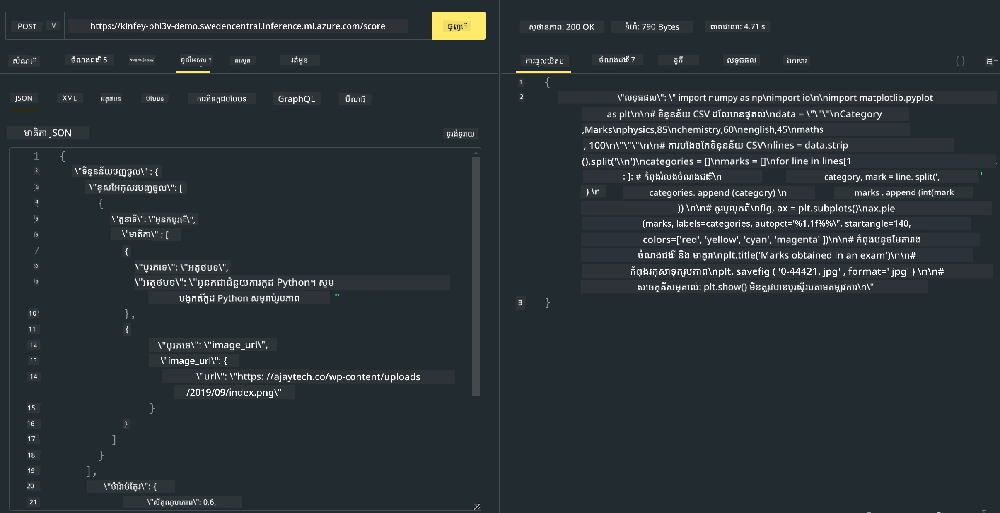

# **លាប ៣ - ដាក់ Phi-3-vision លើ Azure Machine Learning Service**

យើងប្រើ NPU ដើម្បីបញ្ចប់ការដាក់កូដក្នុងផលិតផលក្នុងតំបន់ ហើយបន្ទាប់មកយើងចង់ណែនាំសមត្ថភាពក្នុងការណែនាំ PHI-3-VISION តាមរយៈវា ដើម្បីសម្រេចបានរូបភាពទៅកូដ។

នៅក្នុងការណែនាំនេះ យើងអាចបង្កើតសេវា Model As Service Phi-3 Vision នៅក្នុង Azure Machine Learning Service ជាយ៉ាងលឿន។

***ចំណាំ***៖ Phi-3 Vision ត្រូវការកម្លាំងគណនា ដើម្បីបង្កើតខ្លឹមសារជាប្រសិទ្ធភាពលឿនជាងមុន។ យើងត្រូវការកម្លាំងគណនាមេឃ ដើម្បីជួយយើងសម្រេចបានបែបនេះ។


### **1. បង្កើត Azure Machine Learning Service**

យើងត្រូវបង្កើត Azure Machine Learning Service នៅក្នុង Azure Portal។ ប្រសិនបើអ្នកចង់រៀនរបៀប សូមចូលទៅកាន់តំណភ្ជាប់នេះ [https://learn.microsoft.com/azure/machine-learning/quickstart-create-resources?view=azureml-api-2](https://learn.microsoft.com/azure/machine-learning/quickstart-create-resources?view=azureml-api-2)


### **2. ជ្រើស Phi-3 Vision ក្នុង Azure Machine Learning Service**




### **3. ដាក់ Phi-3-Vision លើ Azure**





### **4. សាកល្បង Endpoint ក្នុង Postman**





***ចំណាំ***

1. ប៉ារ៉ាម៉ែត្រ ដែលត្រូវផ្ញើ ត្រូវមាន Authorization, azureml-model-deployment, និង Content-Type។ អ្នកត្រូវពិនិត្យព័ត៌មានដាក់បង្ហុំនេះ ដើម្បីទទួលយកវា។

2. ដើម្បីផ្ញើប៉ារ៉ាម៉ែត្រ Phi-3-Vision ត្រូវការផ្ញើតំណររូបភាព។ សូមយោងវិធីសាស្រ្ត GPT-4-Vision សម្រាប់ផ្ញើប៉ារ៉ាម៉ែត្រ ដូចជា

```json

{
  "input_data":{
    "input_string":[
      {
        "role":"user",
        "content":[ 
          {
            "type": "text",
            "text": "You are a Python coding assistant.Please create Python code for image "
          },
          {
              "type": "image_url",
              "image_url": {
                "url": "https://ajaytech.co/wp-content/uploads/2019/09/index.png"
              }
          }
        ]
      }
    ],
    "parameters":{
          "temperature": 0.6,
          "top_p": 0.9,
          "do_sample": false,
          "max_new_tokens": 2048
    }
  }
}

```

3. ហៅ **/score** ប្រើវិធីសាស្រ្ត Post

**អបអរសាទរ**! អ្នកបានបញ្ចប់ការដាក់ប្រេន PHI-3-VISION យ៉ាងរហ័ស និងបានសាកល្បងរបៀបប្រើរូបភាពដើម្បីបង្កើតកូដ។ បន្ទាប់មក អ្នកអាចបង្កើតកម្មវិធីរួមបញ្ចូលជាមួយ NPU និងកម្លាំងគណនាមេឃ។

---

<!-- CO-OP TRANSLATOR DISCLAIMER START -->
**ការបដិសេធ**:  
ឯកសារនេះបានបកប្រែដោយប្រើសេវាកម្មបកប្រែ AI [Co-op Translator](https://github.com/Azure/co-op-translator)។ ខណៈពេលដែលយើងខិតខំសម្រាប់ភាពត្រឹមត្រូវ សូមជ្រាបថាការបកប្រែដោយស្វ័យប្រវត្តិអាចមានកំហុស ឬភាពមិនត្រឹមត្រូវណាមួយ។ ឯកសារដើមនៅក្នុងភាសាទួសជាតិក្នុងរបស់វាគួរត្រូវបានគិតជាឯកសារដែលមានសិទ្ធិជាតំបន់។ សម្រាប់ព័ត៌មានសំខាន់ៗ គឺកំណត់អោយមានការបកប្រែដោយមនុស្សវិជ្ជាជីវៈ។ យើងមិនទទួលខុសត្រូវចំពោះការយល់ច្រឡំ ឬការបកប្រែខុសពីការប្រើប្រាស់នៃការបកប្រែនេះឡើយ។
<!-- CO-OP TRANSLATOR DISCLAIMER END -->