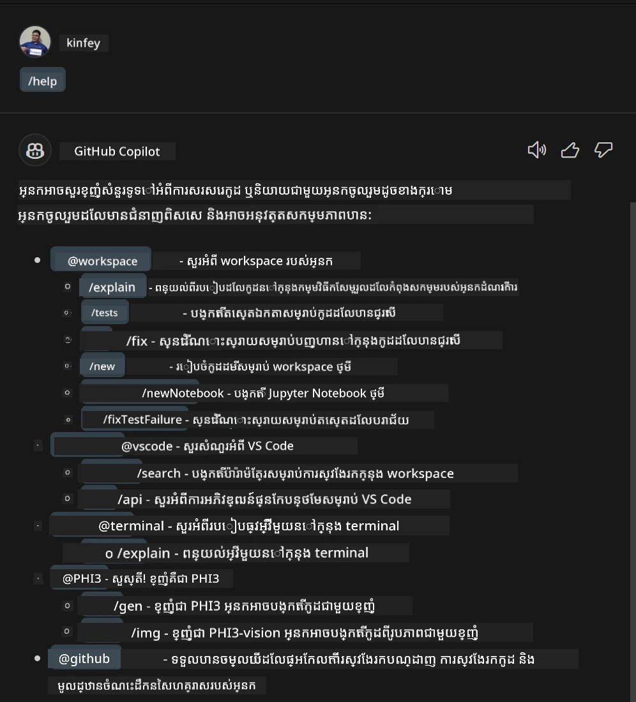
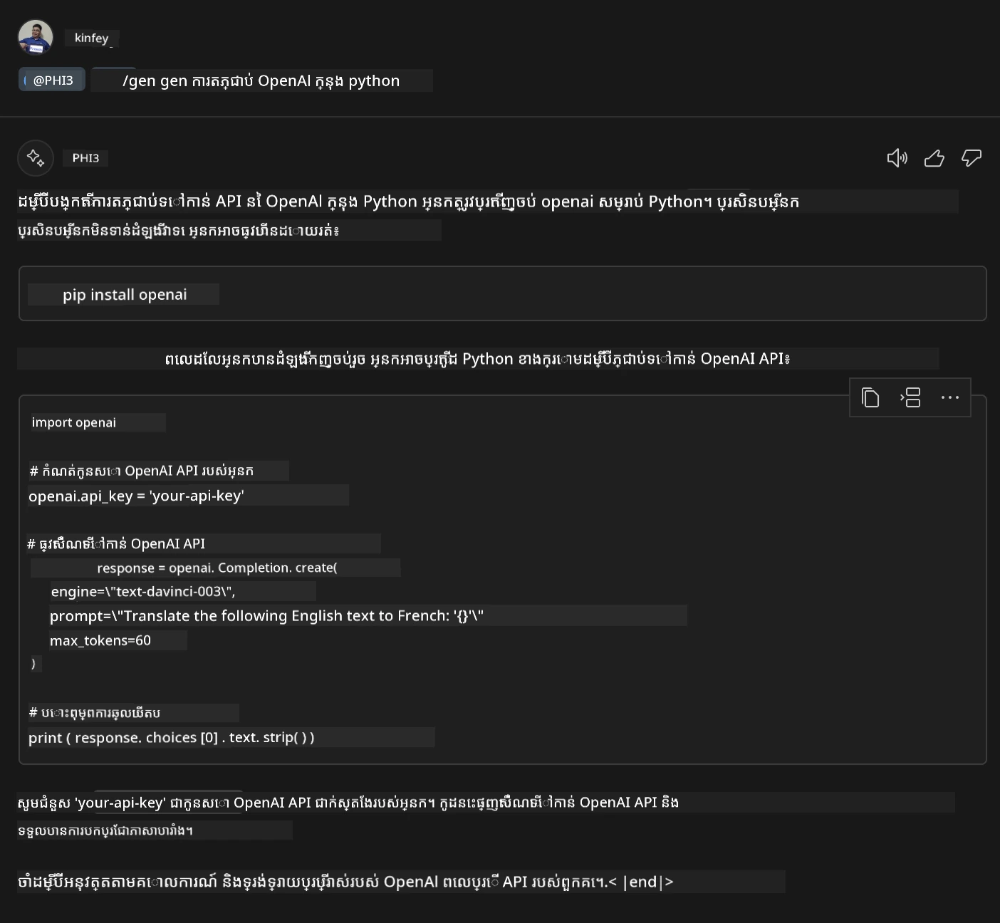
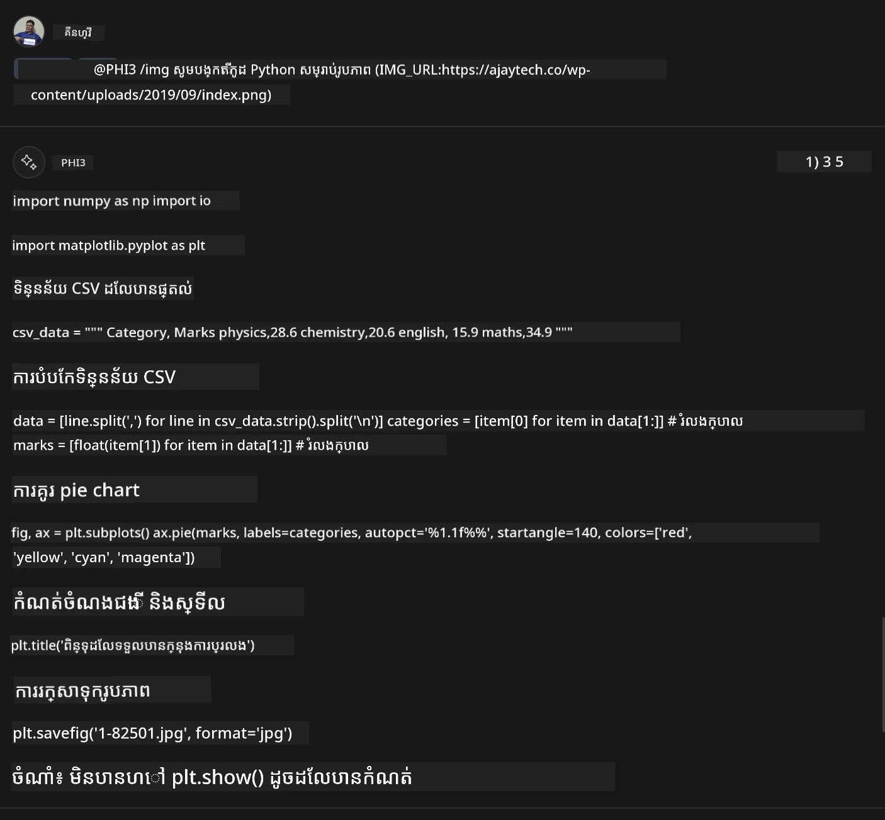

# **មហោស្រព 3 - បង្កើតភ្នាក់ងារ @PHI3 ក្នុង GitHub Copilot Chat**

ក្នុង Visual Studio Code Copilot Chat អ្នកអាចគ្រប់គ្រងគម្រោងទាំងមូលតាមរយៈ @workspace ។ សម្រាប់សាកល្បងសហគ្រាស យើងអាចប្ដូរតាមបំណងភ្នាក់ងារ Copilot Chat បានយ៉ាងចម្រុះ។

ក្នុងមហោស្រពចុងក្រោយ យើងបានបញ្ចូលស៊ុម MX និងពពក ដើម្បីបញ្ចប់កម្មវិធីបន្ថែម Visual Studio Code សម្រាប់ភ្នាក់ងារ Phi3។



### **1. បង្កើតកម្មវិធីបន្ថែម VSCode សម្រាប់អភិវឌ្ឍន៍**

សូមយោងទៅតំណភ្ជាប់នេះ [https://code.visualstudio.com/api/get-started/your-first-extension](https://code.visualstudio.com/api/get-started/your-first-extension) ដើម្បីបង្កើតគម្រោងកម្មវិធីបន្ថែម

***សម្គាល់:*** សូមប្រើ Typescript, WebPack ជាការដោះស្រាយបច្ចេកទេសសម្រាប់គម្រោងនេះ

### **2. បន្ថែម vscode.d.ts**

API Visual Studio Code Chat មិនទាន់បញ្ចូលក្នុង API កូដទេ ប៉ុន្តែឥឡូវនេះបានបន្ថែមតាមរយៈកម្មវិធីបន្ថែម។

ទាញយក vscode.d.ts [https://github.com/microsoft/vscode/blob/main/src/vscode-dts/vscode.d.ts](https://github.com/microsoft/vscode/blob/main/src/vscode-dts/vscode.d.ts)

***សម្គាល់:*** សូមដំណើរការវានៅក្នុង Visual Studio Code Insiders 1.90+

### **3. កែប្រែ package.json**

```json

{
  "name": "phi3ext",
  "displayName": "phi3ext",
  "description": "",
  "version": "0.0.1",
  "engines": {
    "vscode": "^1.90.0"
  },
  "categories": [
      "AI",
      "Chat"
  ],
  "activationEvents": [],
  "enabledApiProposals": [
      "chatVariableResolver"
  ],
  "main": "./dist/extension.js",
  "contributes": {
      "chatParticipants": [
          {
              "id": "chat.PHI3",
              "name": "PHI3",
              "description": "Hey! I am PHI3",
              "isSticky": true,
              "commands": [
                  {
                      "name": "gen",
                      "description": "I am PHI3, you can gen code with me"
                  },
                  {
                      "name": "img",
                      "description": "I am PHI3-vision, you can gen code from img with me"
                  }
              ]
          }
      ],
      "commands": [
          {
              "command": "PHI3.namesInEditor",
              "title": "Use PHI3 in Editor"
          }
      ]
  },  
  "scripts": {
    "vscode:prepublish": "npm run package",
    "compile": "webpack",
    "watch": "webpack --watch",
    "package": "webpack --mode production --devtool hidden-source-map",
    "compile-tests": "tsc -p . --outDir out",
    "watch-tests": "tsc -p . -w --outDir out",
    "pretest": "npm run compile-tests && npm run compile && npm run lint",
    "lint": "eslint src --ext ts",
    "test": "vscode-test"
  },
  "devDependencies": {
    "@types/vscode": "^1.90.0",
    "@types/mocha": "^10.0.6",
    "@types/node": "18.x",
    "@typescript-eslint/eslint-plugin": "^7.11.0",
    "@typescript-eslint/parser": "^7.11.0",
    "eslint": "^8.57.0",
    "typescript": "^5.4.5",
    "ts-loader": "^9.5.1",
    "webpack": "^5.91.0",
    "webpack-cli": "^5.1.4",
    "@vscode/test-cli": "^0.0.9",
    "@vscode/test-electron": "^2.4.0"
  },
  "dependencies": {
    "@types/node-fetch": "^2.6.11",
    "node-fetch": "^3.3.2"
  }
}

```
  
អ្នកអាចដំណើរការ **npm install** នៅក្នុងភាសា terminal ហើយធ្វើបាតុកម្មកូដបន្ថែមរបស់អ្នកដើម្បីសាកល្បង។

***ទាញយកកូដគំរូ*** [ចុចទីនេះ](../../../../../../../../../code/07.Lab/01/Apple)

### **4. បម្លែង src/extension.ts**

```ts

// បណ្ណាល័យ 'vscode' មានចំណុចផ្តល់អនុគមន៍សម្រាប់ការពង្រីក VS Code
// នាំចូលបណ្ណាល័យហើយយោងវាជា vscode នៅក្នុងកូដរបស់អ្នកខាងក្រោម
import * as vscode from 'vscode';


interface IPHI3ChatResult extends vscode.ChatResult {
    metadata: {
        command: string;
    }
}


// វិធីសាស្រ្តនេះត្រូវបានហៅពេលដែលការបន្ថែមរបស់អ្នកត្រូវបានបើកការជា​ដំបូង
// ការបន្ថែមរបស់អ្នកត្រូវបានបើកការជាលើកដំបូងពេលពាក្យបញ្ជាត្រូវបានបំពេញ
export function activate(extcontext: vscode.ExtensionContext) {


	// កំណត់អ្នកគ្រប់គ្រងចរិតផ្លាស់ប្តូរ SHEIN ។
	const phi3handler: vscode.ChatRequestHandler = async (request: vscode.ChatRequest, context: vscode.ChatContext, stream: vscode.ChatResponseStream, token: vscode.CancellationToken): Promise<IPHI3ChatResult> => {

		if (request.command == 'gen') {

			const content = "Welcome to Phi-3 to gen code";

			const result = await gen(request.prompt);

			const code = result;
			
			
			stream.markdown(code)


            return { metadata: { command: 'gen' } };

		}
		if (request.command == 'img') {

			const content = "Welcome to Phi-3 vision to gen code in image";

			const prompt = request.prompt;

			if(prompt.indexOf("(IMG_URL:")>-1){

				const img_url = prompt.split("(IMG_URL:")[1].split(")")[0];
				const question = prompt.split("(IMG_URL:")[0];
				const tmp = question;

				const result = await genImage(question,img_url);
	
				const code = result;
				
				
				stream.markdown(code)
	
	
				return { metadata: { command: 'img' } };
			}
			else
			{
				var result = "Please ask question like this Your question (IMG_URL:https://example.com/image.jpg)";
				stream.markdown(result);
			}


            return { metadata: { command: 'img' } };

		}


		return { metadata: { command: '' } };

	}


	const phi3 = vscode.chat.createChatParticipant("chat.PHI3", phi3handler);

	phi3.iconPath = new vscode.ThemeIcon('sparkle');


    phi3.followupProvider = {
        provideFollowups(result: IPHI3ChatResult, context: vscode.ChatContext, token: vscode.CancellationToken) {
            return [{
                prompt: 'let us code with Phi-3 Family',
                label: vscode.l10n.t('Dev with Phi-3 Family'),
                command: 'help'
            } satisfies vscode.ChatFollowup];
        }
    };

	extcontext.subscriptions.push(phi3);
}


interface GenCode {
	prompt: string;
}

interface ImgGenCodeResponse {
	output: string;
}


interface GenCodeResponse {
	result: string;
}

async function gen(prompt: string) {

	const postData: GenCode = {
		prompt: prompt
	};
	const response = await fetch('http://localhost:8080/score', {
		method: 'POST',
		body: JSON.stringify(postData),
		headers: { 'Content-Type': 'application/json' }
	});
	const post = await response.json();
	const resultResponse = post as GenCodeResponse;
	return resultResponse.result;
}

async function genImage(prompt: string, img_url: string) {

	// const postData: GenCode = {
	// 	សំណួរ: prompt
	// };
	const response = await fetch('Your Phi-3 Endpoint', {
		method: 'POST',
		body: JSON.stringify({
			"input_data":{
			  "input_string":[
				{
				  "role":"user",
				  "content":[ 
					{
					  "type": "text",
					  "text": prompt
					},
					{
						"type": "image_url",
						"image_url": {
						  "url": img_url
						}
					}
				  ]
				}
			  ],
			  "parameters":{
					"temperature": 0.6,
					"top_p": 0.9,
					"do_sample": false,
					"max_new_tokens": 2048
			  }
			}
		}),
		headers: { 'Content-Type': 'application/json', 'Authorization' : 'Bearer Your Phi-3-Vision Endpoint Key', 'azureml-model-deployment': 'Your Phi-3-Vision Deployment Name' }
	});
	const post = await response.json();
	const resultResponse = post as ImgGenCodeResponse;
	return resultResponse.output;
}

// វិធីសាស្រ្តនេះត្រូវបានហៅពេលដែលការបន្ថែមរបស់អ្នកត្រូវបានបិទការប្រើប្រាស់
export function deactivate() {}


```
  
សូមអបអរសាទរ! អ្នកបានបញ្ចប់មហោស្រពទាំងអស់រួចរាល់។ ខ្ញុំសង្ឃឹមថានេះជួយឱ្យអ្នកយល់ពីគ្រួសារ Phi-3 និងវិធីប្រើ GitHub Copilot Chat ។

អ្នកអាចសាកល្បង ***@PHI3 /gen***



អ្នកអាចសាកល្បង ***@PHI3 /img***



---

<!-- CO-OP TRANSLATOR DISCLAIMER START -->
**ការបញ្ជាក់**៖  
ឯកសារនេះត្រូវបានបកប្រែដោយប្រើសេវាកម្មបកប្រែ AI [Co-op Translator](https://github.com/Azure/co-op-translator)។ ខណៈពេលដែលយើងខំប្រឹងប្រែងដើម្បីទទួលបានភាពត្រឹមត្រូវ សូមយល់ថាការបកប្រែដោយស្វ័យប្រវត្តិអាចមានកំហុស ឬការខ្វះខាតខ្លះៗ។ ឯកសារដើមដែលសរសេរជាភាសាបំណុលគឺត្រូវតែត្រូវបានគិតថាជាប្រាជ្ញាភាពផ្លូវការជាចម្បង។ សម្រាប់ព័ត៌មានសំខាន់ៗ សូមណែនាំឱ្យប្រើការបកប្រែដោយមនុស្សវិជ្ជាជីវៈ។ យើងមិនទទួលខុសត្រូវចំពោះការយល់ច្រឡំ ឬការបញ្ចោញច្របល់ណាមួយដែលកើតមានពីការប្រើប្រាស់ការបកប្រែនេះឡើយ។
<!-- CO-OP TRANSLATOR DISCLAIMER END -->