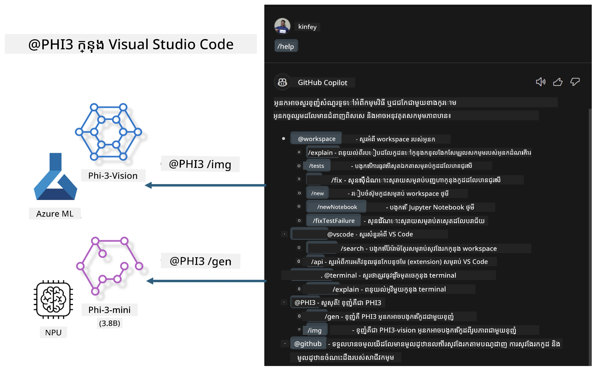

# **បង្កើត Visual Studio Code GitHub Copilot Chat នៃខ្លួនអ្នកជាមួយ Microsoft Phi-3 Family**

តើអ្នកបានប្រើកម្មវិធីភ្នាក់ងារងារក្នុង GitHub Copilot Chat ម្តងទេ? តើអ្នកចង់បង្កើតកម្មវិធីភ្នាក់ងារកូដរបស់ក្រុមរបស់អ្នកផ្ទាល់ទេ? រោងចក្រដៃនេះមានបំណងបង្កើតគំរូ open source ដើម្បីបង្កើតកម្មវិធីភ្នាក់ងារដោយកម្រិតអាជីវកម្ម។

## **មូលដ្ឋាន**

### **ហេតុអ្វីបានជាជ្រើស Microsoft Phi-3**

Phi-3 គឺជារឿងនិទាឃរាជក្រុមមួយ រួមមាន phi-3-mini, phi-3-small, និង phi-3-medium ដែលផ្អែកលើប៉ារ៉ាម៉ែត្របណ្តុះបណ្តាលផ្សេងៗសម្រាប់បង្កើតអត្ថបទ ការបញ្ចប់សន្ទនា និងការបង្កើតកូដ។ នេះមានផងដែរជាមួយ phi-3-vision ដែលផ្អែកលើ Vision។ វាសាកសមសម្រាប់អាជីវកម្ម ឬក្រុមផ្សេងៗដើម្បីបង្កើតដំណោះស្រាយ AI សរសេរផ្សេងៗនៅក្រៅបណ្ដាញ។

ផ្ដល់អនុសាសន៍អានតំណរភ្ជាប់នេះ [https://github.com/microsoft/PhiCookBook/blob/main/md/01.Introduction/01/01.PhiFamily.md](https://github.com/microsoft/PhiCookBook/blob/main/md/01.Introduction/01/01.PhiFamily.md)

### **Microsoft GitHub Copilot Chat**

កម្មវិធីបន្ថែម GitHub Copilot Chat ផ្ដល់ឱ្យអ្នកនូវចំណុចផ្ទេរសន្ទនា ដែលអាចអនុញ្ញាតិឱ្យអ្នកធ្វើការជជែកជាមួយ GitHub Copilot ហើយទទួលបានចម្លើយដល់សំណួរដែលទាក់ទងនឹងកូដនៅក្នុង VS Code ដោយមិនចាំបាច់រំលងឯកសារណែនាំ ឬស្វែងរកក្នុងវេទិកាអនឡាញ។

Copilot Chat អាចប្រើការលៃតម្រូវសម្គាល់វីមួយៗ សម្គាល់ទំហំនិងលក្ខណៈផ្សេងៗ ដើម្បីបន្ថែមភាពច្បាស់លាស់ចំពោះចម្លើយដែលបង្កើតឡើង។ អាស្រ័យទៅលើប្រភេទសំណួរពីអ្នកប្រើប្រាស់ លទ្ធផលអាចមានតំណភ្ជាប់ទៅកាន់បរិបទដែល Copilot ប្រើសម្រាប់បង្កើតចម្លើយ ដូចជាឯកសារកូដ ឬឯកសារដែលពាក់ព័ន្ធ ឬប៊ូតុងសម្រាប់ចូលប្រើមុខងារ VS Code។

- Copilot Chat បញ្ចូលនៅក្នុងលំនាំការអភិវឌ្ឍរបស់អ្នក និងផ្ដល់ជំនួយនៅកន្លែងដែលអ្នកត្រូវការ:

- ចាប់ផ្តើមការសន្ទនាដោយផ្ទាល់ពីក្រឡាផ្ទាំងកូដ ឬ Terminal ដើម្បីទទួលជំនួយពេលអ្នកកំពុងសរសេរកូដ

- ប្រើមើល Chat ដើម្បីមានជំនួយរៀបចំ AI នៅជាយផ្លូវខាងទៀតដើម្បីជួយកាលណាក៏ដោយ

- បើក Quick Chat ដើម្បីសួរសំណួរពិសេសយ៉ាងឆាប់រហ័ស ហើយត្រឡប់មកធ្វើការតាមបំណង

អ្នកអាចប្រើ GitHub Copilot Chat ក្នុងលក្ខខណ្ឌនានា ដូចជា:

- ដំណើរការឆ្លើយសំណួរអំពីវិធីល្អបំផុតក្នុងការដោះស្រាយបញ្ហា

- អធិប្បាយអំពីកូដរបស់អ្នកផ្សេង និងផ្ដល់យោបល់កែលម្អ

- សំណើជួសជុលកូដ

- បង្កើតករណីសាកល្បងឯកតា

- បង្កើតឯកសារសម្រាប់កូដ

ផ្ដល់អនុសាសន៍អានតំណរភ្ជាប់នេះ [https://code.visualstudio.com/docs/copilot/copilot-chat](https://code.visualstudio.com/docs/copilot/copilot-chat?WT.mc_id=aiml-137032-kinfeylo)

###  **Microsoft GitHub Copilot Chat @workspace**

ការអះអាង **@workspace** ក្នុង Copilot Chat អនុញ្ញាតិឱ្យអ្នកសួរសំណួរអំពីcodebase ជាទាំងមូលរបស់អ្នក។ ដោយផ្អែកលើសំនួរ Copilot នឹងយកឯកសារ និងសញ្ញាផងដែរដែលពាក់ព័ន្ធទៅវិញទៅមក យកជាដំណាក់កាលក្នុងចម្លើយជាតំណភ្ជាប់ និងគំរូកូដ។

ដើម្បីឆ្លើយសំណួររបស់អ្នក **@workspace** ស្វែងរកតាមប្រភពដូចគ្នានៅពេលអ្នកអភិវឌ្ឍកូដក្នុង VS Code:

- ឯកសារទាំងអស់នៅក្នុងកន្លែងធ្វើការងារ លើកលែងតែកញ្ចប់ឯកសារដែលបានចោទ បញ្ជាក់ដោយឯកសារ .gitignore

- រចនាសម្ព័ន្ធថតដាក់ឯកសារនិងឈ្មោះថតក្នុងស្រទាប់

- សន្ទស្សន៍ស្វែងរកកូដ GitHub ប្រសិនបើ workspace គឺជាគណនី GitHub ហើយបានសន្ទស្សន៍ដោយស្វែងរកកូដ

- សញ្ញា និងនិយមន័យក្នុង workspace

- អត្ថបទដែលបានជ្រើសរើសឬអត្ថបទដែលមើលឃើញនៅក្នុងកម្មវិធីកែសម្រួលសកម្ម

ចំណាំ: .gitignore នឹងត្រូវរំលង ប្រសិនបើអ្នកបានបើកឯកសារមួយ ឬជ្រើសរើសអត្ថបទនៅក្នុងឯកសារដែលបានចោទ។

ផ្ដល់អនុសាសន៍អានតំណរភ្ជាប់នេះ [[https://code.visualstudio.com/docs/copilot/copilot-chat](https://code.visualstudio.com/docs/copilot/workspace-context?WT.mc_id=aiml-137032-kinfeylo)]

## **ស្វែងយល់បន្ថែមពីរោងចក្រនេះ**

GitHub Copilot បានបង្កើតប្រសិទ្ធភាពកម្មវិធីសរសេរ​កូដក្នុងអាជីវកម្មយ៉ាងខ្លាំង ហើយអាជីវកម្មនីមួយៗសំពាធចង់ប្តូរតម្រូវមុខងារដែលពាក់ព័ន្ធនៃ GitHub Copilot។ អាជីវកម្មជាច្រើនបានប្តូរសម្រួល Extensions ដូចខាង GitHub Copilot ដោយផ្អែកលើស្ថានការណ៍អាជីវកម្មនិងគំរូ open source របស់ខ្លួន។ សម្រាប់អាជីវកម្ម Extensions ដែលបានប្តូរជាង'inscriptionមានភាពងាយស្រួលក្នុងការត្រួតពិនិត្យ ប៉ុន្តែវាក៏ជាប់តែទៅលើបទពិសោធន៍អ្នកប្រើផងដែរ។ បន្ទាប់ពីទាំងនេះ GitHub Copilot មានមុខងារច្រើនជាងសម្រាប់ដោះស្រាយលក្ខខណ្ឌទូទៅ និងជំនាញជាក់លាក់។ ប្រសិនបើបទពិសោធន៍អាចរក្សាតម្លៃស្រដៀងគ្នា វានឹងល្អក្នុងការតម្រូវ Extension របស់អាជីវកម្មផ្ទាល់។ GitHub Copilot Chat ផ្ដល់ API ដែលពាក់ព័ន្ធសម្រាប់អាជីវកម្មដើម្បីពង្រីកបទពិសោធន៍ Chat។ ការរក្សាបទពិសោធន៍ជាប់ទៀងទាត់ និងមានមុខងារតម្រូវគឺជាបទពិសោធន៍អ្នកប្រើល្អជាង។

រោងចក្រ​នេះកំណត់ជាភាគច្រើនលើគំរូ Phi-3 រួមជាមួយ NPU តំបន់ដំណើរការនិង Azure ជាសហគ្រិន ដើម្បីបង្កើត Agent ផ្ទាល់ខ្លួនក្នុង GitHub Copilot Chat ***@PHI3*** ដើម្បីជួយអ្នកអភិវឌ្ឍនៅតំបន់អាជីវកម្មបញ្ចប់ការបង្កើតកូដ***(@PHI3 /gen)*** និងបង្កើតកូដផ្អែកលើរូបភាព ***(@PHI3 /img)***។

### ***ចំណាំ:*** 

រោងចក្រនេះកំពុងអនុវត្តនៅក្នុង AIPC របស់ Intel CPU និង Apple Silicon ជាបច្ចុប្បន្ន។ យើងនឹងបន្តធ្វើបច្ចុប្បន្នភាពកំណែ Qualcomm នៃ NPU។

## **រោងចក្រ**

| ឈ្មោះ | ការពិពណ៌នា | AIPC | Apple |
| ------------ | ----------- | -------- |-------- |
| Lab0 - Installations(✅) | កំណត់រចនាសម្ព័ន្ធ និងដំឡើងបរិបទ និងឧបករណ៍ដំឡើងដែលពាក់ព័ន្ធ | [Go](./HOL/AIPC/01.Installations.md) |[Go](./HOL/Apple/01.Installations.md) |
| Lab1 - Run Prompt flow with Phi-3-mini (✅) | រួមបញ្ចូលជាមួយ AIPC / Apple Silicon ដើម្បីប្រើ NPU តំបន់ដំណើរការផ្ទាល់ សម្រាប់បង្កើតកូដ Phi-3-mini | [Go](./HOL/AIPC/02.PromptflowWithNPU.md) |  [Go](./HOL/Apple/02.PromptflowWithMLX.md) |
| Lab2 - Deploy Phi-3-vision on Azure Machine Learning Service(✅) | បង្កើតកូដដោយដំឡើង Azure Machine Learning Service's Model Catalog - រូបភាព Phi-3-vision | [Go](./HOL/AIPC/03.DeployPhi3VisionOnAzure.md) |[Go](./HOL/Apple/03.DeployPhi3VisionOnAzure.md) |
| Lab3 - Create a @phi-3 agent in GitHub Copilot Chat(✅)  | បង្កើតភ្នាក់ងារ Phi-3 ផ្ទាល់ខ្លួនក្នុង GitHub Copilot Chat ដើម្បីបញ្ចប់កូដ បង្កើតកូដក្រាហ្វិច RAG ល។ | [Go](./HOL/AIPC/04.CreatePhi3AgentInVSCode.md) | [Go](./HOL/Apple/04.CreatePhi3AgentInVSCode.md) |
| Sample Code (✅)  | ទាញយកកូដគំរូ | [Go](../../../../../../../code/07.Lab/01/AIPC) | [Go](../../../../../../../code/07.Lab/01/Apple) |

## **ធនធាន**

1. Phi-3 Cookbook [https://github.com/microsoft/Phi-3CookBook](https://github.com/microsoft/Phi-3CookBook)

2. ស្វែងយល់បន្ថែមអំពី GitHub Copilot [https://learn.microsoft.com/training/paths/copilot/](https://learn.microsoft.com/training/paths/copilot/?WT.mc_id=aiml-137032-kinfeylo)

3. ស្វែងយល់បន្ថែមអំពី GitHub Copilot Chat [https://learn.microsoft.com/training/paths/accelerate-app-development-using-github-copilot/](https://learn.microsoft.com/training/paths/accelerate-app-development-using-github-copilot/?WT.mc_id=aiml-137032-kinfeylo)

4. ស្វែងយល់បន្ថែមអំពី GitHub Copilot Chat API [https://code.visualstudio.com/api/extension-guides/chat](https://code.visualstudio.com/api/extension-guides/chat?WT.mc_id=aiml-137032-kinfeylo)

5. ស្វែងយល់បន្ថែមអំពី Microsoft Foundry [https://learn.microsoft.com/training/paths/create-custom-copilots-ai-studio/](https://learn.microsoft.com/training/paths/create-custom-copilots-ai-studio/?WT.mc_id=aiml-137032-kinfeylo)

6. ស្វែងយល់បន្ថែមអំពី Microsoft Foundry's Model Catalog [https://learn.microsoft.com/azure/ai-studio/how-to/model-catalog-overview](https://learn.microsoft.com/azure/ai-studio/how-to/model-catalog-overview)

---

<!-- CO-OP TRANSLATOR DISCLAIMER START -->
**ការបដិសេធ**:  
ឯកសារនេះត្រូវបានបកប្រែដោយប្រើសេវាកម្មបកប្រែ AI [Co-op Translator](https://github.com/Azure/co-op-translator)។ ខណៈពេលដែលយើងខិតខំរកសុវត្ថិភាពភាពត្រូវតែសូមជម្រាបជូនថាការបកប្រែដោយស្វ័យប្រវត្តិអាចមានកំហុសឬភាពមិនត្រឹមត្រូវ។ ឯកសារដើមនៅក្នុងភាសាមូលដ្ឋានរបស់វាគួរត្រូវបានពិចារណាជាផ្លូវការដែលមានសុពលភាព។ សម្រាប់ព័ត៌មានដែលមានសារៈសំខាន់ មនុស្សជំនាញបកប្រែគឺត្រូវបានផ្តល់អនុសាសន៍។ យើងមិនទទួលខុសត្រូវចំពោះការយល់ច្រឡំ ឬការបកស្រាយខុស ដែលកើតមានពីការប្រើប្រាស់ការបកប្រែនេះឡើយ។
<!-- CO-OP TRANSLATOR DISCLAIMER END -->