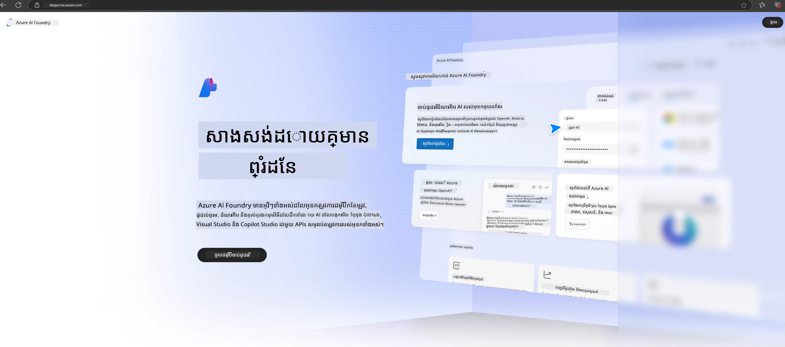

# **ការប្រើប្រាស់ Phi-3 ក្នុង Microsoft Foundry**

ជាមួយនឹងការអភិវឌ្ឍ AI ច្នៃប្រឌិត (Generative AI) យើងសង្ឃឹមថានឹងប្រើប្រាស់វេទិកាដែលរួមបញ្ចូលគ្នាដើម្បីគ្រប់គ្រង LLM និង SLM ផ្សេងៗ ការភ្ជាប់ទិន្នន័យអង្គការផ្សេងៗ ប្រតិបត្ដិការកែប្រែ/ RAG និងការវាយតម្លៃអាជីវកម្មអង្គការផ្សេងៗបន្ទាប់ពីបញ្ចូល LLM និង SLM ល។ ដូច្នេះ AI ច្នៃប្រឌិតអាចអនុវត្តកម្មវិធីឆ្លាតវៃបានល្អជាងមុន។ [Microsoft Foundry](https://ai.azure.com) គឺជាវេទិកាកម្មវិធី AI ច្នៃប្រឌិតកម្រិតអង្គការ។

ជាមួយ Microsoft Foundry អ្នកអាចវាយតម្លៃចម្លើយនៃម៉ូដែលភាសាធំ (LLM) និងរៀបចំឧបករណ៍កម្មវិធីដែលប្រើបញ្ជាផ្នែកបញ្ជា (prompt flow) សម្រាប់លទ្ធផលប្រសើរជាងមុន។ វេទិកានេះផ្ដល់ការអាចវិលជុំបានសម្រាប់បម្លែងគំនិតផ្ទៀងទៅជាការផលិតពេញលេញដោយងាយស្រួល។ ការត្រួតពិនិត្យ និងកែប្រែបន្តឆាប់រហ័សជួយលទ្ធផលជាយូរអង្វែង។

យើងអាចដាក់ពង្រីកម៉ូដែល Phi-3 លឿនៗលើ Microsoft Foundry តាមជំហានសាមញ្ញ ហើយបន្ទាប់មកប្រើប្រាស់ Microsoft Foundry សម្រាប់បញ្ចប់កិច្ចការផ្សេងៗដែលពាក់ព័ន្ធនឹង Phi-3 ដូចជា Playground/Chat, ការកែប្រែ (Fine-tuning), ការវាយតម្លៃ និងកិច្ចការផ្សេងទៀត។

## **1. ការរៀបចំ**

បើអ្នកមាន [Azure Developer CLI](https://learn.microsoft.com/azure/developer/azure-developer-cli/overview?WT.mc_id=aiml-138114-kinfeylo) តម្លើងរួចហើយនៅលើម៉ាស៊ីនរបស់អ្នក ការប្រើប្រាស់សំណំទាំងនេះគឺមានភាពងាយស្រួលគ្រាន់តែដំណើរការប្រការនេះនៅក្នុងថតថ្មីមួយ។

## ការបង្កើតដោយដៃ

ការបង្កើតគម្រោង និងមជ្ឈមណ្ឌល Microsoft Foundry គឺជាវិធីល្អសម្រាប់រៀបចំ និងគ្រប់គ្រងការងារ AI របស់អ្នក។ នេះគឺជាគន្លងជំហានមួយៗដើម្បីចាប់ផ្តើម៖

### ការបង្កើតគម្រោងនៅក្នុង Microsoft Foundry

1. **ចូលទៅកាន់ Microsoft Foundry**៖ ចូលក្នុងកំពូល Microsoft Foundry។
2. **បង្កើតគម្រោង**ៈ
   - ប្រសិនបើអ្នកនៅក្នុងគម្រោង មើលទៅខាងលើឆ្វេងនៃទំព័រនៅក្បែមុខទំព័រដើម។
   - ជ្រើសរើស "+ Create project"។
   - បញ្ចូលឈ្មោះសម្រាប់គម្រោង។
   - ប្រសិនបើអ្នកមានមជ្ឈមណ្ឌលវានឹងត្រូវបានជ្រើសដោយប្រព័ន្ធដោយស្វ័យប្រវត្តិ។ ប្រសិនបើអ្នកមានអុបទិកច្រើនជាងមួយ អ្នកអាចជ្រើសមជ្ឈមណ្ឌលផ្សេងទៀតពីបញ្ជីចុះក្រោម។ ប្រសិនបើអ្នកចង់បង្កើតមជ្ឈមណ្ឌលថ្មី ជ្រើសរើស "Create new hub" ហើយបញ្ចូលឈ្មោះ។
   - ជ្រើសរើស "Create"។

### ការបង្កើតមជ្ឈមណ្ឌលនៅក្នុង Microsoft Foundry

1. **ចូលទៅកាន់ Microsoft Foundry**៖ ចូលជាមួយគណនី Azure របស់អ្នក។
2. **បង្កើតមជ្ឈមណ្ឌល**៖
   - ជ្រើសរើសមជ្ឈមណ្ឌលគ្រប់គ្រងពីម៉ឺនុយខាងឆ្វេង។
   - ជ្រើសរើស "All resources", បន្ទាប់មកចុចព្រួញចុះក្រោម "+" New project" ហើយជ្រើស "+ New hub"។
   - នៅក្នុងប្រអប់ "Create a new hub" បញ្ចូលឈ្មោះសម្រាប់មជ្ឈមណ្ឌល (ដូចជាឈ្មោះ contoso-hub) ហើយកែប្រែវាលផ្សេងៗដោយម៉ាចចិត្ត។
   - ជ្រើសរើស "Next", ពិនិត្យព័ត៌មាន ហើយបន្ទាប់ជ្រើស "Create"។

សម្រាប់សេចក្ដីណែនាំលម្អិតបន្ថែម អ្នកអាចយោងទៅកាន់ឯកសារផ្លូវការរបស់ [Microsoft](https://learn.microsoft.com/azure/ai-studio/how-to/create-projects)។

បន្ទាប់ពីបង្កើតបានជោគជ័យ អ្នកអាចចូលទៅកាន់ស្ទូឌីអូដែលអ្នកបានបង្កើត តាមរយៈ [ai.azure.com](https://ai.azure.com/)

អាចមានគម្រោងច្រើននៅក្នុង Microsoft Foundry មួយ។ បង្កើតគម្រោងមួយក្នុង AI Foundry ដើម្បីរៀបចំ។

បង្កើត Microsoft Foundry [QuickStarts](https://learn.microsoft.com/azure/ai-studio/quickstarts/get-started-code)

## **2. ដាក់ពង្រីកម៉ូដែល Phi នៅ Microsoft Foundry**

ចុចជម្រើស Explore នៃគម្រោងដើម្បីចូលទៅកាន់ថតម៉ូដែល ហើយជ្រើស Phi-3

ជ្រើស Phi-3-mini-4k-instruct

ចុច 'Deploy' ដើម្បីដាក់ពង្រីកម៉ូដែល Phi-3-mini-4k-instruct

> [!NOTE]
>
> អ្នកអាចជ្រើសថាមពលគណនាម្ដងនៅពេលដាក់ពង្រីក

## **3. ការជជែកក្នុងលំហរលេង (Playground Chat) Phi នៅ Microsoft Foundry**

ទៅកាន់ទំព័រដាក់ពង្រីក ជ្រើស Playground ហើយជជែកជាមួយ Phi-3 របស់ Microsoft Foundry

## **4. ការតម្លើងម៉ូដែលពី Microsoft Foundry**

ដើម្បីតម្លើងម៉ូដែលពីថតម៉ូដែល Azure អ្នកអាចអនុវត្តជំហានដូចខាងក្រោម៖

- ចូលទៅកាន់ Microsoft Foundry។
- ជ្រើសម៉ូដែលដែលអ្នកចង់តម្លើងពីថតម៉ូដែល Microsoft Foundry។
- នៅលើទំព័រកំណត់ម៉ូដែលជ្រើស Deploy បន្ទាប់ជ្រើស Serverless API ជាមួយ Azure AI Content Safety។
- ជ្រើសគម្រោងដែលអ្នកចង់តម្លើងម៉ូដែលរបស់អ្នក។ ដើម្បីប្រើប្រាស់សេវា Serverless API អត្រាសកម្មត្រូវមានទីតាំងក្នុងតំបន់ East US 2 ឬ Sweden Central។ អ្នកអាចប្ដូរឈ្មោះ Deployment បាន។
- នៅក្នុងជំនួយដាក់ពង្រីកជ្រើស Pricing and terms ដើម្បីស្វែងយល់អំពីតម្លៃ និងលក្ខខណ្ឌប្រើប្រាស់។
- ជ្រើស Deploy។ រង់ចាំរហូតដល់ការតម្លើងរួចរាល់ ហើយអ្នកត្រូវបានបញ្ចូនទៅទំព័រ Deployments។
- ជ្រើស Open in playground ដើម្បីចាប់ផ្តើមធ្វើអន្តរកម្មជាមួយម៉ូដែល។
- អ្នកអាចត្រឡប់មកទំព័រ Deployments ជ្រើសការតម្លើង ហើយកត់សម្គាល់ URL គោលដៅ និង Secret Key ដែលអ្នកអាចប្រើហៅការតម្លើង និងបង្កើតការបញ្ចប់។
- អ្នកអាចរកពត៌មានលម្អិត URL និងកូនសោចូលប្រើ API សំរាប់ Endpoint ណាមួយបានទាំងអស់ តាមរយៈការចូលទៅផ្ទាំង Build ហើយជ្រើស Deployments ក្នុងផ្នែក Components។

> [!NOTE]
> សូមចំណាំថាគណនីរបស់អ្នកត្រូវមានសិទ្ធិ Azure AI Developer លើ Resource Group ដើម្បីអនុវត្តជំហានទាំងនេះ។

## **5. ការប្រើប្រាស់ Phi API ក្នុង Microsoft Foundry**

អ្នកអាចចូល https://{Your project name}.region.inference.ml.azure.com/swagger.json តាមរយៈ Postman GET ហើយបញ្ចូល Key រួម ដើម្បីស្វែងយល់អំពីចំណុចភ្ជាប់ដែលបានផ្ដល់ជូន

អ្នកអាចទទួលបានវាលសំណើ និងវាលចម្លើយបានយ៉ាងងាយស្រួល។

---

<!-- CO-OP TRANSLATOR DISCLAIMER START -->
**ការប្រាប់ជ្រាប**៖  
ឯកសារនេះត្រូវបានបកប្រែដោយប្រើសេវាកម្មបកប្រែ AI [Co-op Translator](https://github.com/Azure/co-op-translator)។ ខណៈពេលយើងខិតខំរកភាពត្រឹមត្រូវ សូមយល់ថាការបកប្រែដោយស្វ័យប្រវត្តិនេះអាចមានកំហុស ឬមិនត្រឹមត្រូវខ្លះ។ ឯកសារដើមដែលមានជាយភាសាដើមគួរត្រូវបានគេចាត់ទុកជាអ្នកផ្គត់ផ្គង់ព័តមានដែលមានសិទ្ធិពេញលេញ។ សម្រាប់ព័ត៌មានសំខាន់ៗ សូមអនុញ្ញាតឱ្យមានការបកប្រែដោយមនុស្សដែលមានជំនាញជាស្រាវជ្រាវ។ យើងមិនទទួលខុសត្រូវចំពោះការយល់ច្រឡំ ឬការបកប្រែខុសដែលកើតឡើងពីការប្រើប្រាស់ការបកប្រែនេះឡើយ។
<!-- CO-OP TRANSLATOR DISCLAIMER END -->