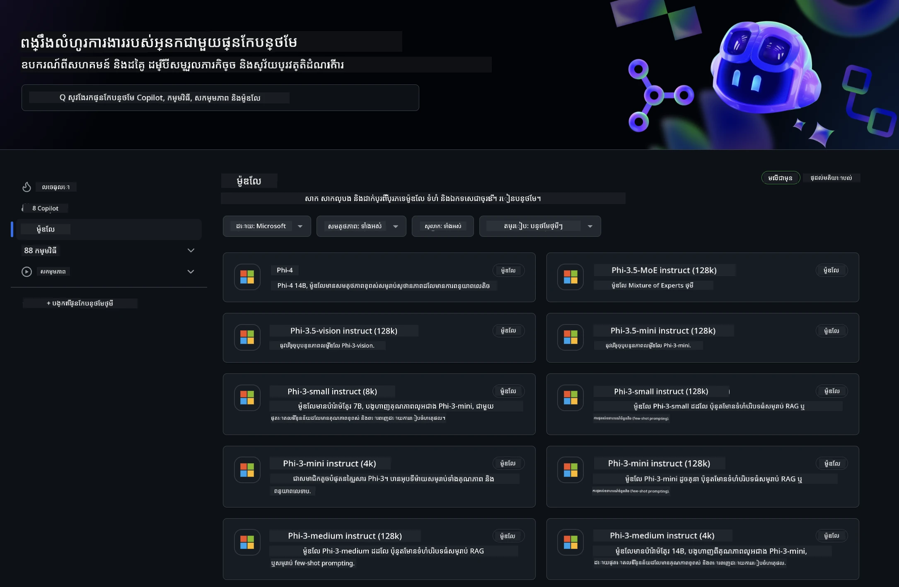
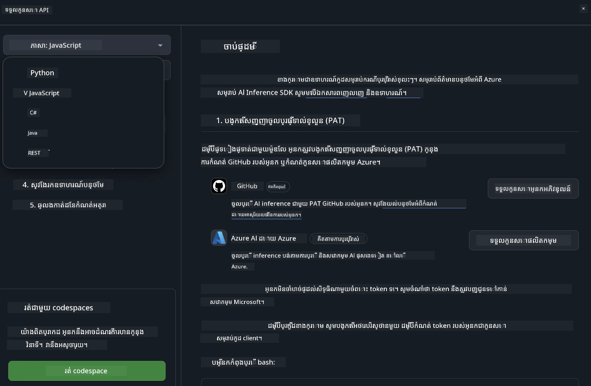
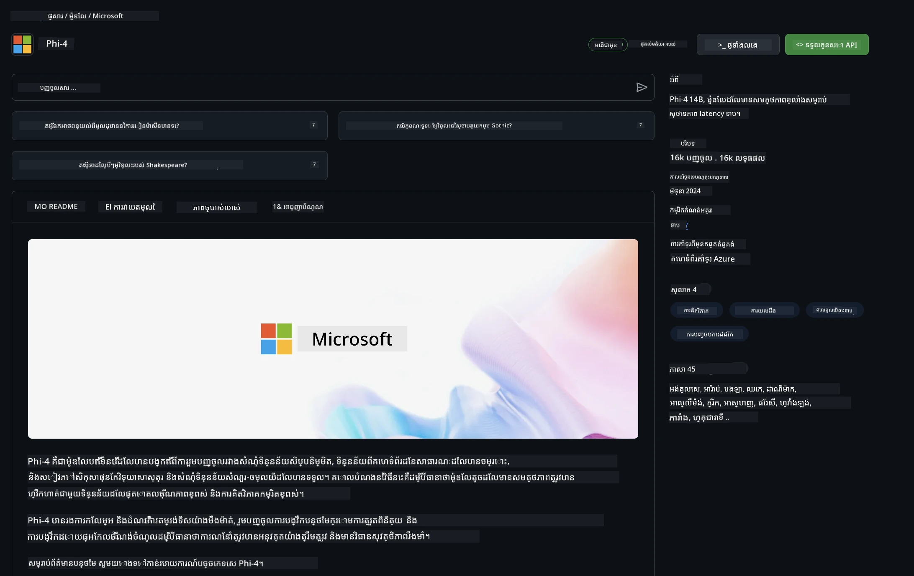

## GitHub Models - បេតាផ្លូវការរហូតតែមានកំណត់

សូមស្វាគមន៍មកកាន់ [GitHub Models](https://github.com/marketplace/models)! យើងមានអ្វីៗទាំងអស់ត្រៀមរួចសម្រាប់អ្នកស្វែងយល់ពីគំរូ AI ដែលផ្ទុកនៅលើ Azure AI ។



សម្រាប់ព័ត៌មានបន្ថែមអំពីគំរូដែលមាននៅលើ GitHub Models សូមពិនិត្យមើល [GitHub Model Marketplace](https://github.com/marketplace/models)

## គំរូដែលមាន

គំរូនិមួយៗមានទីលំនៅលេង និងកូដគំរូផ្តល់ជូន


### គំរូ Phi-3 នៅក្នុងបញ្ជីគំរូ GitHub

[Phi-3-Medium-128k-Instruct](https://github.com/marketplace/models/azureml/Phi-3-medium-128k-instruct)

[Phi-3-medium-4k-instruct](https://github.com/marketplace/models/azureml/Phi-3-medium-4k-instruct)

[Phi-3-mini-128k-instruct](https://github.com/marketplace/models/azureml/Phi-3-mini-128k-instruct)

[Phi-3-mini-4k-instruct](https://github.com/marketplace/models/azureml/Phi-3-mini-4k-instruct)

[Phi-3-small-128k-instruct](https://github.com/marketplace/models/azureml/Phi-3-small-128k-instruct)

[Phi-3-small-8k-instruct](https://github.com/marketplace/models/azureml/Phi-3-small-8k-instruct)

## ចាប់ផ្តើម

មានឧទាហរណ៍មូលដ្ឋានខ្លះដែលរួចរាល់សម្រាប់អ្នកដំណើរការ។ អ្នកអាចរកឃើញពួកវានៅក្នុងថតឧទាហរណ៍។ ប្រសិនបើអ្នកចង់ចាប់ផ្តើមពីភាសាដែលអ្នកចូលចិត្ត អ្នកអាចរកឃើញឧទាហរណ៍នៅក្នុងភាសាខាងក្រោម៖

- Python
- JavaScript
- cURL

មានបរិស្ថាន Codespaces ផ្ដាច់មុខសម្រាប់ដំណើរការ ឧទាហរណ៍ និងគំរូផងដែរ។




## កូដឧទាហរណ៍

ខាងក្រោមនេះជាខ្នាតកូដឧទាហរណ៍សម្រាប់ករណីប្រើប្រាស់ខ្លះៗ។ សម្រាប់ព័ត៌មានបន្ថែមអំពី Azure AI Inference SDK សូមមើលឯកសារពេញលេញ និងឧទាហរណ៍។

## ការតំឡើង

1. បង្កើតស្លាកបំប៉នផ្ទាល់ខ្លួន
អ្នកមិនចាំបាច់ផ្តល់សិទ្ធិណាមួយទៅស្លាកនោះទេ។ សូមកត់សម្គាល់ថាស្លាកនឹងត្រូវផ្ញើទៅសេវាកម្ម Microsoft ។

ដើម្បីប្រើខ្នាតកូដនៅខាងក្រោម សូមបង្កើតអថេរបរិស្ថានមួយ ដាក់ស្លាករបស់អ្នកជាគ្រាប់គន្លឹះសម្រាប់កូដភ្ញៀវ។

ប្រសិនបើអ្នកកំពុងប្រើ bash:
```
export GITHUB_TOKEN="<your-github-token-goes-here>"
```
 ប្រសិនបើអ្នកនៅក្នុង powershell:

```
$Env:GITHUB_TOKEN="<your-github-token-goes-here>"
```

ប្រសិនបើអ្នកកំពុងប្រើ Windows command prompt:

```
set GITHUB_TOKEN=<your-github-token-goes-here>
```

## ឧទាហរណ៍ Python

### តំឡើងអាស្រ័យភាព
តំឡើង Azure AI Inference SDK ដោយប្រើ pip (តម្រូវការជាប្រភេទ Python >=3.8):

```
pip install azure-ai-inference
```
### រត់ឧទាហរណ៍កូដមូលដ្ឋាន

ឧទាហរណ៍នេះបង្ហាញការហៅមូលដ្ឋានទៅ API បញ្ចប់កិច្ចសន្ទនា។ វាកំពុងប្រើចំណុចចេញវាយតម្លៃគំរូ AI លើ GitHub និងស្លាក GitHub របស់អ្នក។ ការហៅនេះគឺជាការប្រតិបត្ដិ đồng bộ។

```
import os
from azure.ai.inference import ChatCompletionsClient
from azure.ai.inference.models import SystemMessage, UserMessage
from azure.core.credentials import AzureKeyCredential

endpoint = "https://models.inference.ai.azure.com"
# Replace Model_Name 
model_name = "Phi-3-small-8k-instruct"
token = os.environ["GITHUB_TOKEN"]

client = ChatCompletionsClient(
    endpoint=endpoint,
    credential=AzureKeyCredential(token),
)

response = client.complete(
    messages=[
        SystemMessage(content="You are a helpful assistant."),
        UserMessage(content="What is the capital of France?"),
    ],
    model=model_name,
    temperature=1.,
    max_tokens=1000,
    top_p=1.
)

print(response.choices[0].message.content)
```

### បើកការសន្ទនាច្រើនជំហាន

ឧទាហរណ៍នេះបង្ហាញពីការសន្ទនាច្រើនជំហានជាមួយ API បញ្ចប់កិច្ចសន្ទនា។ នៅពេលប្រើគំរូសម្រាប់កម្មវិធីសន្ទនា អ្នកត្រូវគ្រប់គ្រងប្រវត្តិការសន្ទនានោះ ហើយផ្ញើសារថ្មីៗទៅគំរូ។

```
import os
from azure.ai.inference import ChatCompletionsClient
from azure.ai.inference.models import AssistantMessage, SystemMessage, UserMessage
from azure.core.credentials import AzureKeyCredential

token = os.environ["GITHUB_TOKEN"]
endpoint = "https://models.inference.ai.azure.com"
# Replace Model_Name
model_name = "Phi-3-small-8k-instruct"

client = ChatCompletionsClient(
    endpoint=endpoint,
    credential=AzureKeyCredential(token),
)

messages = [
    SystemMessage(content="You are a helpful assistant."),
    UserMessage(content="What is the capital of France?"),
    AssistantMessage(content="The capital of France is Paris."),
    UserMessage(content="What about Spain?"),
]

response = client.complete(messages=messages, model=model_name)

print(response.choices[0].message.content)
```

### បញ្ចេញលទ្ធផលជាស្ទ្រីម

សម្រាប់បទពិសោធន៍ប្រើប្រាស់ល្អប្រសើរឡើង អ្នកនឹងចង់បញ្ចេញចម្លើយរបស់គំរូជាស្ទ្រីម ដូច្នេះគ្រាប់ដំបូងនឹងបង្ហាញមុន ហើយអ្នកមិនត្រូវរង់ចាំចម្លើយយូរជាងនេះទេ។

```
import os
from azure.ai.inference import ChatCompletionsClient
from azure.ai.inference.models import SystemMessage, UserMessage
from azure.core.credentials import AzureKeyCredential

token = os.environ["GITHUB_TOKEN"]
endpoint = "https://models.inference.ai.azure.com"
# Replace Model_Name
model_name = "Phi-3-small-8k-instruct"

client = ChatCompletionsClient(
    endpoint=endpoint,
    credential=AzureKeyCredential(token),
)

response = client.complete(
    stream=True,
    messages=[
        SystemMessage(content="You are a helpful assistant."),
        UserMessage(content="Give me 5 good reasons why I should exercise every day."),
    ],
    model=model_name,
)

for update in response:
    if update.choices:
        print(update.choices[0].delta.content or "", end="")

client.close()
```
## JavaScript 

### តំឡើងអាស្រ័យភាព

តំឡើង Node.js។

ចម្លងបន្ទាត់អក្សរខាងក្រោម ហើយរក្សាទុកជាឯកសារ package.json នៅក្នុងថតរបស់អ្នក។

```
{
  "type": "module",
  "dependencies": {
    "@azure-rest/ai-inference": "latest",
    "@azure/core-auth": "latest",
    "@azure/core-sse": "latest"
  }
}
```

ចំណាំ៖ @azure/core-sse ត្រូវការ នៅពេលដែលអ្នកបញ្ចេញចម្លើយបញ្ចប់កិច្ចសន្ទនាជាស្ទ្រីមប៉ុណ្ណោះ។

បើកផ្ទាំងបញ្ជារនៅក្នុងថតនេះ ហើយរត់ npm install។

សម្រាប់ខ្នាតកូដរាល់កូដខាងក្រោម ចម្លងមាតិកាទៅឯកសារ sample.js ហើយរត់ជាមួយ node sample.js។

### រត់ឧទាហរណ៍កូដមូលដ្ឋាន

ឧទាហរណ៍នេះបង្ហាញការហៅមូលដ្ឋានទៅ API បញ្ចប់កិច្ចសន្ទនា។ វាកំពុងប្រើចំណុចចេញវាយតម្លៃគំរូ AI លើ GitHub និងស្លាក GitHub របស់អ្នក។ ការហៅនេះគឺជាការប្រតិបត្ដិ đồng bộ។

```
import ModelClient from "@azure-rest/ai-inference";
import { AzureKeyCredential } from "@azure/core-auth";

const token = process.env["GITHUB_TOKEN"];
const endpoint = "https://models.inference.ai.azure.com";
// Update your modelname
const modelName = "Phi-3-small-8k-instruct";

export async function main() {

  const client = new ModelClient(endpoint, new AzureKeyCredential(token));

  const response = await client.path("/chat/completions").post({
    body: {
      messages: [
        { role:"system", content: "You are a helpful assistant." },
        { role:"user", content: "What is the capital of France?" }
      ],
      model: modelName,
      temperature: 1.,
      max_tokens: 1000,
      top_p: 1.
    }
  });

  if (response.status !== "200") {
    throw response.body.error;
  }
  console.log(response.body.choices[0].message.content);
}

main().catch((err) => {
  console.error("The sample encountered an error:", err);
});
```

### បើកការសន្ទនាច្រើនជំហាន

ឧទាហរណ៍នេះបង្ហាញពីការសន្ទនាច្រើនជំហានជាមួយ API បញ្ចប់កិច្ចសន្ទនា។ នៅពេលប្រើគំរូសម្រាប់កម្មវិធីសន្ទនា អ្នកត្រូវគ្រប់គ្រងប្រវត្តិការសន្ទនានោះ ហើយផ្ញើសារថ្មីៗទៅគំរូ។

```
import ModelClient from "@azure-rest/ai-inference";
import { AzureKeyCredential } from "@azure/core-auth";

const token = process.env["GITHUB_TOKEN"];
const endpoint = "https://models.inference.ai.azure.com";
// Update your modelname
const modelName = "Phi-3-small-8k-instruct";

export async function main() {

  const client = new ModelClient(endpoint, new AzureKeyCredential(token));

  const response = await client.path("/chat/completions").post({
    body: {
      messages: [
        { role: "system", content: "You are a helpful assistant." },
        { role: "user", content: "What is the capital of France?" },
        { role: "assistant", content: "The capital of France is Paris." },
        { role: "user", content: "What about Spain?" },
      ],
      model: modelName,
    }
  });

  if (response.status !== "200") {
    throw response.body.error;
  }

  for (const choice of response.body.choices) {
    console.log(choice.message.content);
  }
}

main().catch((err) => {
  console.error("The sample encountered an error:", err);
});
```

### បញ្ចេញលទ្ធផលជាស្ទ្រីម
សម្រាប់បទពិសោធន៍ប្រើប្រាស់ល្អប្រសើរឡើង អ្នកនឹងចង់បញ្ចេញចម្លើយរបស់គំរូជាស្ទ្រីម ដូច្នេះគ្រាប់ដំបូងនឹងបង្ហាញមុន ហើយអ្នកមិនត្រូវរង់ចាំចម្លើយយូរជាងនេះទេ។

```
import ModelClient from "@azure-rest/ai-inference";
import { AzureKeyCredential } from "@azure/core-auth";
import { createSseStream } from "@azure/core-sse";

const token = process.env["GITHUB_TOKEN"];
const endpoint = "https://models.inference.ai.azure.com";
// Update your modelname
const modelName = "Phi-3-small-8k-instruct";

export async function main() {

  const client = new ModelClient(endpoint, new AzureKeyCredential(token));

  const response = await client.path("/chat/completions").post({
    body: {
      messages: [
        { role: "system", content: "You are a helpful assistant." },
        { role: "user", content: "Give me 5 good reasons why I should exercise every day." },
      ],
      model: modelName,
      stream: true
    }
  }).asNodeStream();

  const stream = response.body;
  if (!stream) {
    throw new Error("The response stream is undefined");
  }

  if (response.status !== "200") {
    stream.destroy();
    throw new Error(`Failed to get chat completions, http operation failed with ${response.status} code`);
  }

  const sseStream = createSseStream(stream);

  for await (const event of sseStream) {
    if (event.data === "[DONE]") {
      return;
    }
    for (const choice of (JSON.parse(event.data)).choices) {
        process.stdout.write(choice.delta?.content ?? ``);
    }
  }
}

main().catch((err) => {
  console.error("The sample encountered an error:", err);
});
```

## REST 

### រត់ឧទាហរណ៍កូដមូលដ្ឋាន

បិតស្តាប់អ្វីខាងក្រោមទៅក្នុង shell:

```
curl -X POST "https://models.inference.ai.azure.com/chat/completions" \
    -H "Content-Type: application/json" \
    -H "Authorization: Bearer $GITHUB_TOKEN" \
    -d '{
        "messages": [
            {
                "role": "system",
                "content": "You are a helpful assistant."
            },
            {
                "role": "user",
                "content": "What is the capital of France?"
            }
        ],
        "model": "Phi-3-small-8k-instruct"
    }'
```
### បើកការសន្ទនាច្រើនជំហាន

ហៅ API បញ្ចប់កិច្ចសន្ទនា ហើយផ្ញើប្រវត្តិកិច្ចសន្ទនា:

```
curl -X POST "https://models.inference.ai.azure.com/chat/completions" \
    -H "Content-Type: application/json" \
    -H "Authorization: Bearer $GITHUB_TOKEN" \
    -d '{
        "messages": [
            {
                "role": "system",
                "content": "You are a helpful assistant."
            },
            {
                "role": "user",
                "content": "What is the capital of France?"
            },
            {
                "role": "assistant",
                "content": "The capital of France is Paris."
            },
            {
                "role": "user",
                "content": "What about Spain?"
            }
        ],
        "model": "Phi-3-small-8k-instruct"
    }'
```
### បញ្ចេញលទ្ធផលជាស្ទ្រីម

នេះជាឧទាហរណ៍នៃការហៅចំណុចចេញ និងបញ្ចេញចម្លើយជាស្ទ្រីម។

```
curl -X POST "https://models.inference.ai.azure.com/chat/completions" \
    -H "Content-Type: application/json" \
    -H "Authorization: Bearer $GITHUB_TOKEN" \
    -d '{
        "messages": [
            {
                "role": "system",
                "content": "You are a helpful assistant."
            },
            {
                "role": "user",
                "content": "Give me 5 good reasons why I should exercise every day."
            }
        ],
        "stream": true,
        "model": "Phi-3-small-8k-instruct"
    }'
```

## ការប្រើប្រាស់ឥតគិតថ្លៃ និងកំណត់អត្រាសម្រាប់ GitHub Models



[កំណត់អត្រាសម្រាប់ទីលំនៅលេង និងការប្រើប្រាស់ API ឥតគិតថ្លៃ](https://docs.github.com/en/github-models/prototyping-with-ai-models#rate-limits) មុខដូចជារចនាឡើងដើម្បីជួយអ្នកសាកល្បងគំរូ និងបង្កើតគម្រោង AI របស់អ្នក។ សម្រាប់ការប្រើប្រាស់ដែលលើសកំណត់ទាំងនោះ ហើយដើម្បីយកកម្មវិធីរបស់អ្នកទៅដល់ទំហំនោះ អ្នកត្រូវគ្រូចំណូលធនធានពីគណនី Azure ហើយធ្វើការផ្ទៀងផ្ទាត់តាមការពិតពីគណនីនោះជំនួសស្លាកបំប៉នផ្ទាល់ខ្លួន GitHub របស់អ្នក។ អ្នកមិនចាំបាច់ផ្លាស់ប្តូរអ្វីទេនៅក្នុងកូដរបស់អ្នកទេ។ ប្រើតំណនេះដើម្បីស្វែងរករបៀបលើសកំណត់ថ្នាក់ឥតគិតថ្លៃនៅ Azure AI ។

### ការបញ្ជាក់

ចាំមើលពេលដែលអ្នកផ្តល់មូលដ្ឋានជាមួយគំរូ អ្នកកំពុងសាកល្បង AI ដូច្នេះកំហុសខ្លះៗអាចកើតមាន។

មុខងារនេះគឺមានកំណត់ជាច្រើន (រួមទាំងសំណើរ​ជា​នាទី អ្នកស្នើរជា​ថ្ងៃ​ គ្រាប់សម្រាប់សំណើ និងសំណើ​សំរាប់ពេលតែមួយ) ហើយមិនត្រូវបានរចនាសម្រាប់ការប្រើប្រាស់ផលិតកម្មទេ។

GitHub Models ប្រើ Azure AI Content Safety។ ប្រព័ន្ធដេញតទៅនេះមិនអាចបិទបាននៅក្នុងបទពិសោធន៍ GitHub Models នេះទេ។ ប្រសិនបើអ្នកសម្រេចចិត្តប្រើគំរូតាមរយៈសេវាបង់ប្រាក់ សូមកំណត់មួយលំនាំត្រង់សម្ភារ:របស់អ្នកដើម្បីបំពេញតាមតម្រូវការ។

សេវាកម្មនេះមានសិទ្ធិប្រើប្រាស់បឋមក្រោមលក្ខខណ្ឌមុនបញ្ចេញរបស់ GitHub។

---

<!-- CO-OP TRANSLATOR DISCLAIMER START -->
**ការបដិសេធ**៖  
ឯកសារនេះបានបកប្រែដោយប្រើសេវាកម្មបកប្រែ AI [Co-op Translator](https://github.com/Azure/co-op-translator)។ បើទោះបីយើងខិតខំប្រឹងប្រែងឲ្យបានត្រឹមត្រូវក៏ដោយ សូមខំផ្ញើជូនថាខេត្តបកប្រែដោយម៉ាស៊ីនអាចមានកំហុស ឬការមិនត្រឹមត្រូវបានស្ថិត។ ឯកសារដើមនៅក្នុងភាសាមូលដ្ឋានគួរត្រូវបានយកជាមូលដ្ឋានដ៏ទៀងទាត់។ សម្រាប់ព័ត៌មានសំខាន់ៗ សូមណែនាំឲ្យប្រើការបកប្រែដោយមនុស្សអ្នកជំនាញ។ យើងមិនទទួលបន្ទុកចំពោះការយល់ច្រឡំ ឬការបកស្រាយខុសដែលកើតមានចេញពីការប្រើប្រាស់ការបកប្រែនេះឡើយ។
<!-- CO-OP TRANSLATOR DISCLAIMER END -->