# ការបំពេញបន្ថែមរបស់ Phi-3 ជាមួយ Microsoft Foundry

មកស្វែងយល់ពីរបៀបបំពេញបន្ថែមម៉ូដែលភាសា Phi-3 Mini របស់ Microsoft ដោយប្រើ Microsoft Foundry។ ការបំពេញបន្ថែមអនុញ្ញាតឱ្យអ្នកបត់បែន Phi-3 Mini ទៅកាន់បេសកកម្មជាក់លាក់ ដែលធ្វើឱ្យវាមានកម្លាំងបន្ថែម និងយល់ដឹងបរិបទបានល្អជាងមុន។

## ការពិចារណា

- **សមត្ថភាព:** តើម៉ូដែលណាអាចបំពេញបន្ថែមបាន? តើម៉ូដែលមូលដ្ឋានអាចបំពេញបន្ថែមដល់ការប្រព្រឹត្តអ្វីបានខ្លះ?
- **ថ្លៃដើម:** តើអ្វីទៅជាមូដែលតម្លៃសម្រាប់ការបំពេញបន្ថែម?
**ការប្ដូរតម្រូវបាន:** តើខ្ញុំអាចផ្លាស់ប្តូរម៉ូដែលមូលដ្ឋានបានប៉ុនណា – និងដោយរបៀបណា?
- **ភាពងាយស្រួល:** តើការបំពេញបន្ថែមធ្វើរបៀបណា – តើខ្ញុំត្រូវសរសេរកូដផ្ទាល់ខ្លួនទេ? តើខ្ញុំត្រូវយកកុំព្យូទ័រផ្ទាល់ខ្លួនមកដែរទេ?
- **សុវត្ថិភាព:** ម៉ូដែលដែលបានបំពេញបន្ថែមមានហានិភ័យសុវត្ថិភាព – តើមានការត្រួតពិនិត្យសុវត្ថិភាពដើម្បីការពារការខូចខាតមិនចង់បានឬទេ?

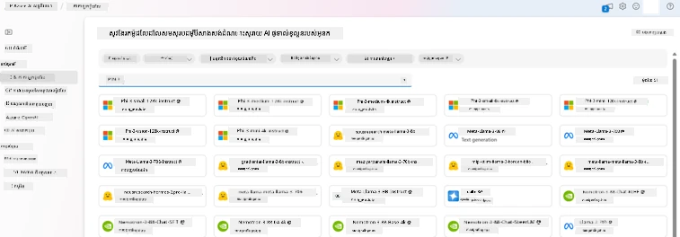

## ការរៀបចំសម្រាប់ការបំពេញបន្ថែម

### លក្ខខណ្ឌមុន

> [!NOTE]
> សម្រាប់ម៉ូដែលក្រុម Phi-3, ម៉ូដែលបង់តាមការប្រើប្រាស់សម្រាប់ការបំពេញបន្ថែមមានស្រាប់តែសម្រាប់ hubs ដែលបង្កើតនៅតំបន់ **East US 2**។

- មានការជាវរបស់ Azure។ ប្រសិនបើអ្នកមិនមានការជាវទេ សូមបង្កើត [គណនី Azure បង់ប្រាក់](https://azure.microsoft.com/pricing/purchase-options/pay-as-you-go) ដើម្បីចាប់ផ្តើម។

- មាន [គម្រោង AI Foundry](https://ai.azure.com?WT.mc_id=aiml-138114-kinfeylo)។
- ការត្រួតពិនិត្យការចូលប្រើដោយផ្អែកលើតួនាទី Azure (Azure RBAC) ត្រូវបានប្រើសម្រាប់ផ្តល់សិទ្ធិដំណើរការនានារបស់ Microsoft Foundry។ ដើម្បីអនុវត្តជំហាននៅក្នុងអត្ថបទនេះ អ្នកត្រូវតែបានចាត់តួនាទី __Azure AI Developer role__ នៅលើក្រុមធនធាន។

### ការចុះបញ្ជីអ្នកផ្គត់ផ្គង់ជាវ

ផ្ទៀងផ្ទាត់ថា ការជាវត្រូវបានចុះបញ្ជីជាមួយអ្នកផ្គត់ផ្គង់ធនធាន `Microsoft.Network`។

1. ចូលទៅកាន់ [Azure portal](https://portal.azure.com)។
1. ជ្រើសរើស **Subscriptions** ពីម៉ឺនុយខាងឆ្វេង។
1. ជ្រើសរើសការជាវដែលអ្នកចង់ប្រើ។
1. ជ្រើសរើស **AI project settings** > **Resource providers** ពីម៉ឺនុយខាងឆ្វេង។
1. បញ្ជាក់ថា **Microsoft.Network** មាននៅក្នុងបញ្ជីអ្នកផ្គត់ផ្គង់ធនធាន។ ប្រសិនមិនមានសូមបន្ថែមវា។

### ការរៀបចំទិន្នន័យ

រៀបចំទិន្នន័យបណ្តុះបណ្តាល និងការត្រួតពិនិត្យរបស់អ្នកសម្រាប់ការបំពេញបន្ថែមម៉ូដែល។ ទិន្នន័យបណ្តុះបណ្តាល និងទិន្នន័យត្រួតពិនិត្យរបស់អ្នកមានឧទាហរណ៍បញ្ចូលនិងបញ្ចេញសម្រាប់របៀបដែលអ្នកចង់ឲ្យម៉ូដែលដំណើរការ។

ប្រាកដឡើងថាឧទាហរណ៍បណ្តុះបណ្តាលទាំងអស់បានអនុវត្តតាមទ្រង់ទ្រាយដែលរំពឹងទុកសម្រាប់ការព្យាករណ៍។ ដើម្បីបំពេញបន្ថែមម៉ូដែលបានយ៉ាងមានប្រសិទ្ធភាព ប្រាកដថាមានទិន្នន័យដែលសមហម និងពហុជាតិ។

នេះចូលរួមក្នុងការរក្សាសមាមាត្រទិន្នន័យ រួមបញ្ចូលសេណារីយ៉ូផ្សេងៗ និងធ្វើការកែលំហាត់ទិន្នន័យបណ្តុះបណ្តាលជាប្រចាំ ដើម្បីឲ្យសម្របសម្រួលនឹងការរំពឹងទុកក្នុងពិភពលោកពិត ហើយបញ្ចេញចម្លើយម៉ូដែលបានត្រឹមត្រូវ និងសមហម។

ម៉ូដែលប្រភេទខុសៗគ្នាត្រូវការទ្រង់ទ្រាយទិន្នន័យបណ្តុះបណ្តាលខុសគ្នា។

### ការបញ្ចប់ជជែក Chat Completion

ទិន្នន័យបណ្តុះបណ្តាល និងត្រួតពិនិត្យដែលអ្នកប្រើ **ត្រូវតែ** មានទ្រង់ទ្រាយជាឯកសារ JSON Lines (JSONL)។ សម្រាប់ `Phi-3-mini-128k-instruct` ទិន្នន័យសម្រាប់បំពេញបន្ថែមត្រូវតែមានទ្រង់ទ្រាយជាសិល្បៈសន្ទនា ដែលប្រើដោយ Chat completions API។

### គំរូទ្រង់ទ្រាយឯកសារ

```json
    {"messages": [{"role": "system", "content": "You are an Xbox customer support agent whose primary goal is to help users with issues they are experiencing with their Xbox devices. You are friendly and concise. You only provide factual answers to queries, and do not provide answers that are not related to Xbox."}, {"role": "user", "content": "Is Xbox better than PlayStation?"}, {"role": "assistant", "content": "I apologize, but I cannot provide personal opinions. My primary job is to assist you with any issues related to your Xbox device. Do you have any Xbox-related issues that need addressing?"}]}
    {"messages": [{"role": "system", "content": "You are an Xbox customer support agent whose primary goal is to help users with issues they are experiencing with their Xbox devices. You are friendly and concise. You only provide factual answers to queries, and do not provide answers that are not related to Xbox."}, {"role": "user", "content": "Can I play PC games on my Xbox?"}, {"role": "assistant", "content": "While Xbox consoles don't natively support PC games, they can play an array of Xbox games, many of which are also available on PC. Can I assist you with finding games compatible with your Xbox device?"}]}
    {"messages": [{"role": "system", "content": "You are an Xbox customer support agent whose primary goal is to help users with issues they are experiencing with their Xbox devices. You are friendly and concise. You only provide factual answers to queries, and do not provide answers that are not related to Xbox."}, {"role": "user", "content": "I'm having trouble connecting my Xbox to the Wi-Fi."}, {"role": "assistant", "content": "No worries, let's go through the network settings on your Xbox. Can you please tell me what happens when you try to connect it to the Wi-Fi?"}]}
```

ប្រភេទឯកសារដែលគាំទ្រជា JSON Lines ។ ឯកសារត្រូវបានផ្ទុកឡើងទៅក្នុងទីតាំងទិន្នន័យលំនាំដើម ហើយអាចប្រើបានក្នុងគម្រោងរបស់អ្នក។

## ការបំពេញបន្ថែម Phi-3 ជាមួយ Microsoft Foundry

Microsoft Foundry អនុញ្ញាតឱ្យអ្នកផ្លាស់ប្តូរម៉ូដែលភាសាធំៗទៅតាមទិន្នន័យផ្ទាល់ខ្លួនរបស់អ្នក ដោយប្រើដំណើរការដែលគេហៅថាការបំពេញបន្ថែម។ ការបំពេញបន្ថែមផ្តល់តម្លៃដ៏សំខាន់ ដោយអនុញ្ញាតឱ្យប្ដូរតាមតម្រូវការ និងបង្កើតប្រសិទ្ធភាពសម្រាប់បេសកកម្ម និងកម្មវិធីជាក់លាក់។ វនាំឲ្យមានការកែលម្អនូវសមត្ថភាព ការប្រាក់ ប្រសិទ្ធភាពពេលវេលា និងលទ្ធផលឆ្លាតវៃ។

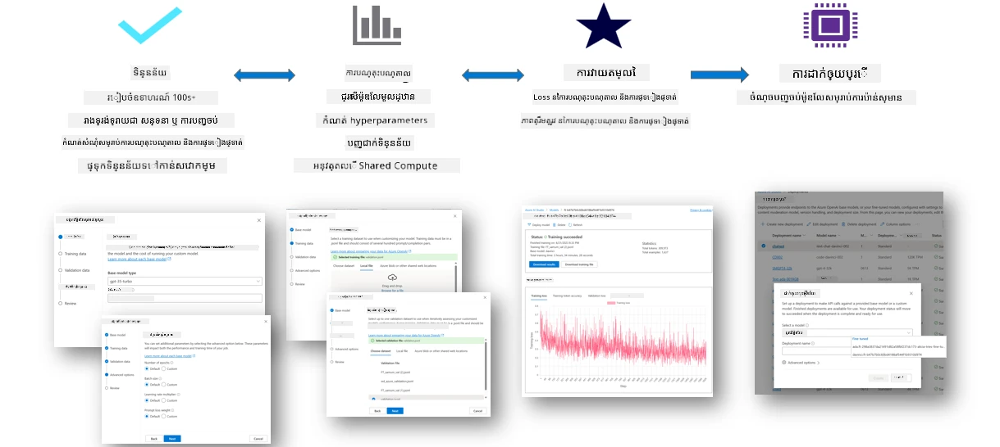

### បង្កើតគម្រោងថ្មី

1. ចូលទៅកាន់ [Microsoft Foundry](https://ai.azure.com)។

1. ជ្រើសរើស **+New project** ដើម្បីបង្កើតគម្រោងថ្មីក្នុង Microsoft Foundry។

    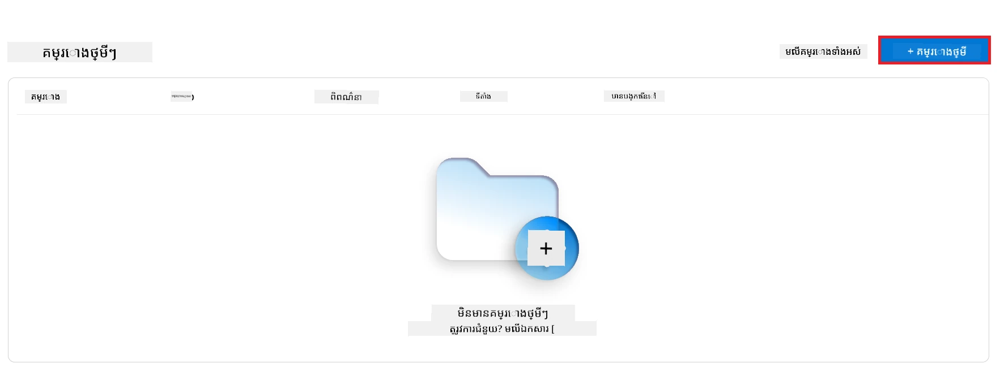

1. អនុវត្តការងារខាងក្រោម៖

    - ឈ្មោះ **Hub** នៃគម្រោង។ វាត្រូវតែមួយនៅក្នុងប្រព័ន្ធ។
    - ជ្រើសរើស **Hub** ដែលត្រូវប្រើ (បង្កើតថ្មីបើចាំបាច់)។

    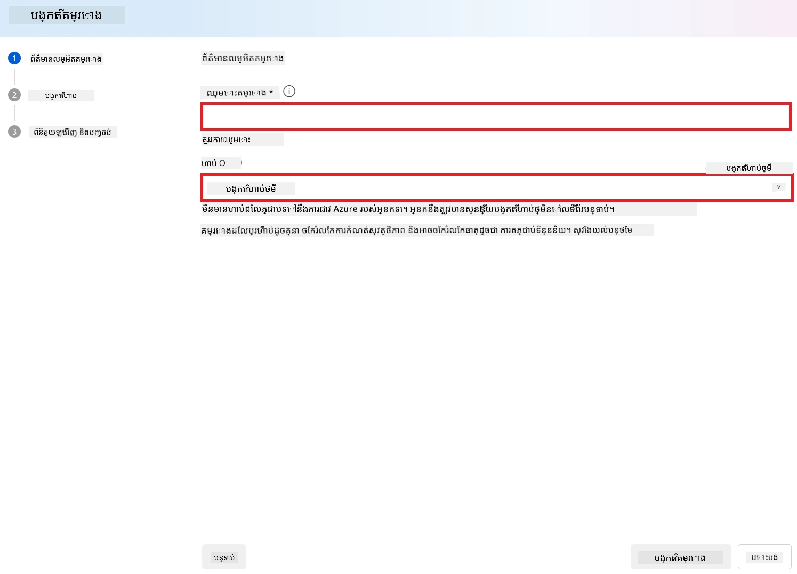

1. អនុវត្តការងារខាងក្រោមដើម្បីបង្កើត hub ថ្មី៖

    - បញ្ចូល **ឈ្មោះ Hub** ដែលត្រូវតែមួយ។
    - ជ្រើសការជាវ Azure របស់អ្នក។
    - ជ្រើស **Resource group** ដែលត្រូវប្រើ (បង្កើតថ្មីបើចាំបាច់)។
    - ជ្រើស **ទីតាំង** ដែលអ្នកចង់ប្រើ។
    - ជ្រើស **Connect Azure AI Services** ដែលត្រូវប្រើ (បង្កើតថ្មីបើចាំបាច់)។
    - ជ្រើស **Connect Azure AI Search** ជា **បាត់ការតភ្ជាប់**។

    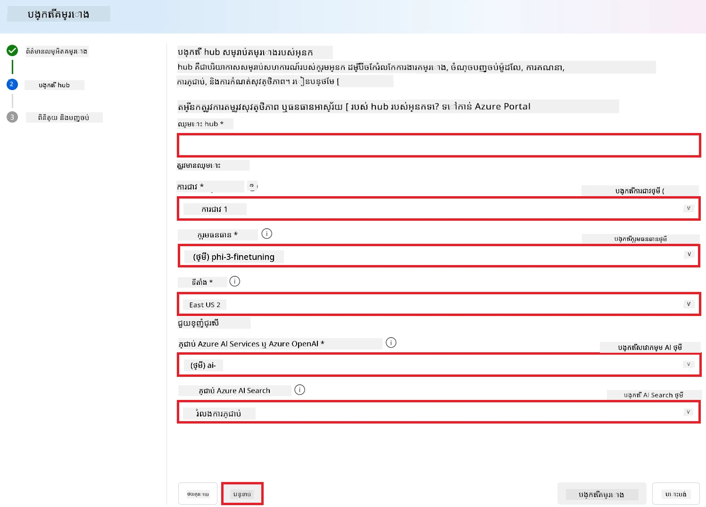

1. ជ្រើសរើស **Next**។
1. ជ្រើសរើស **Create a project**។

### ការរៀបចំទិន្នន័យ

មុនការបំពេញបន្ថែម សូមប្រមូលឬបង្កើតសំណុំទិន្នន័យដែលពាក់ព័ន្ធនឹងបេសកកម្មរបស់អ្នក ដូចជា សេចក្ដីណែនាំជជែក សំណួរ និងចម្លើយ ឬអត្ថបទទៀតៗដែលពាក់ព័ន្ធ។ សម្អាត និងដំណើរការទិន្នន័យនេះ ដោយកម្ចាត់សំលេងរំខាន ការដោះសោគមិនគ្រប់ និងការបំបែកតួអក្សរ។

### បំពេញបន្ថែមម៉ូដែល Phi-3 ក្នុង Microsoft Foundry

> [!NOTE]
> ការបំពេញបន្ថែមម៉ូដែល Phi-3 ត្រូវបានគេចាំបាច់គាំទ្រនៅក្នុងគម្រោងដែលមានទីតាំងនៅ East US 2។

1. ជ្រើសរើស **Model catalog** ពីផ្ទាំងខាងឆ្វេង។

1. វាយ *phi-3* នៅក្នុង **បន្ទាត់ស្វែងរក** ហើយជ្រើសម៉ូដែល phi-3 ដែលអ្នកចង់ប្រើ។

    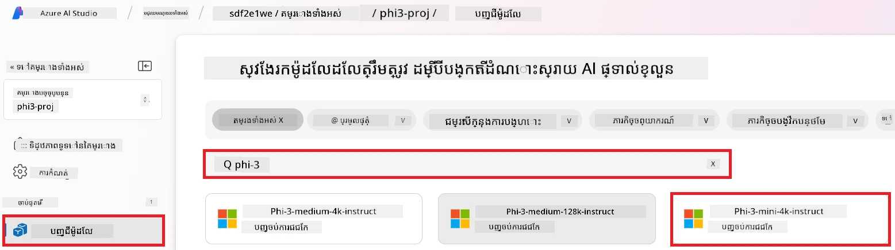

1. ជ្រើសរើស **Fine-tune**។

    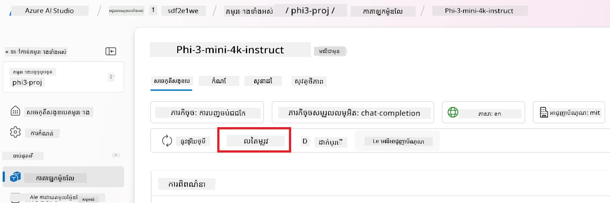

1. បញ្ចូល **ឈ្មោះម៉ូដែលដែលបានបំពេញបន្ថែម**។

    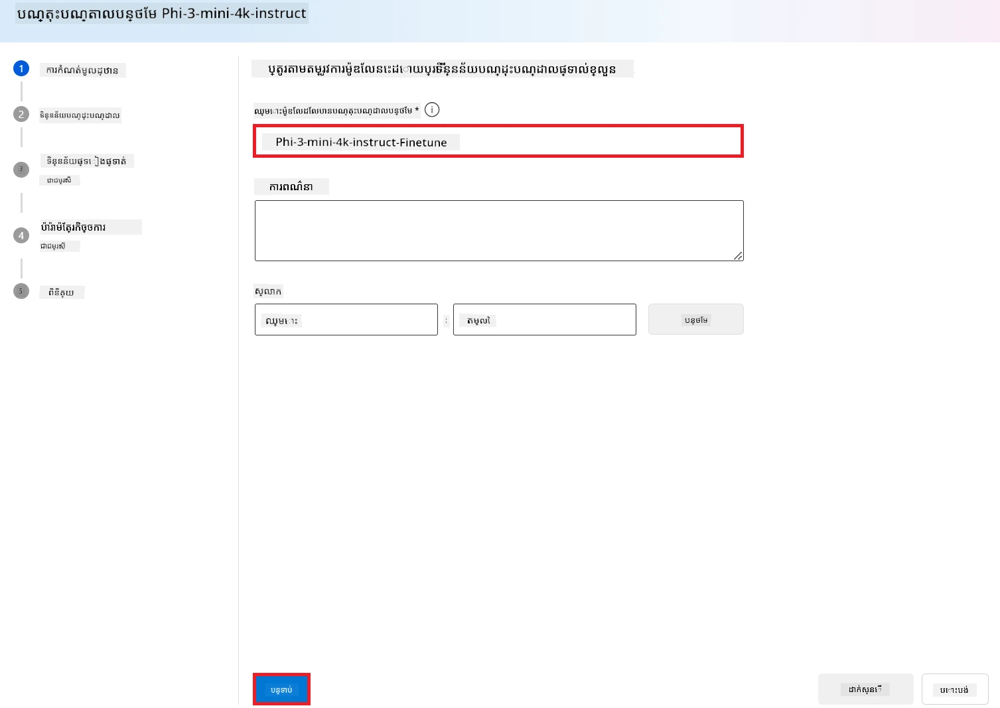

1. ជ្រើសរើស **Next**។

1. អនុវត្តការងារខាងក្រោម៖

    - ជ្រើសរើសប្រភេទបេសកកម្មជា **Chat completion**។
    - ជ្រើសរើស **ទិន្នន័យបណ្តុះបណ្តាល** ដែលអ្នកចង់ប្រើ។ អ្នកអាចផ្ទុកឡើងតាមទិន្នន័យ Microsoft Foundry ឬពីបរិបទក្នុងកុំព្យូទ័រផ្ទាល់ខ្លួន។

    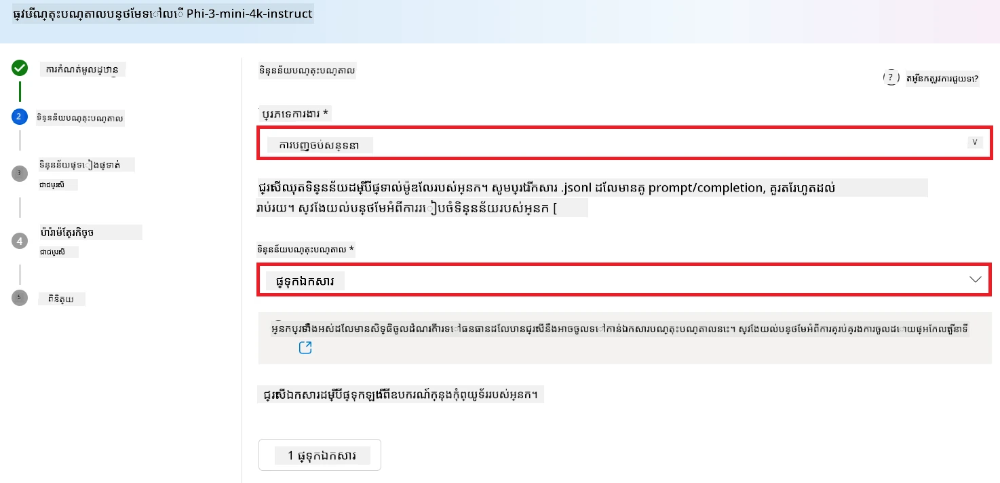

1. ជ្រើសរើស **Next**។

1. ផ្ទុកឡើង **ទិន្នន័យត្រួតពិនិត្យ** ដែលអ្នកចង់ប្រើ ឬជ្រើសរើស **Automatic split of training data**។

    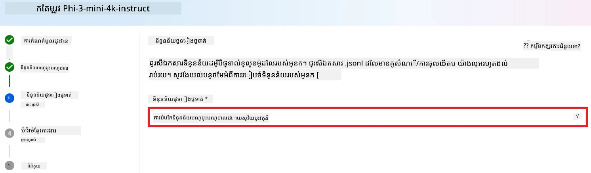

1. ជ្រើសរើស **Next**។

1. អនុវត្តការងារខាងក្រោម៖

    - ជ្រើស **គុណនុបញ្ចូលអត្រា** (Batch size multiplier) ដែលអ្នកចង់ប្រើ។
    - ជ្រើស **អត្រាការសិក្សា** (Learning rate) ដែលអ្នកចង់ប្រើ។
    - ជ្រើស **ថ្នាក់សិក្សា** (Epochs) ដែលអ្នកចង់ប្រើ។

    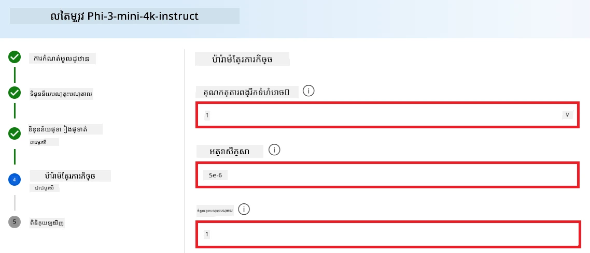

1. ជ្រើសរើស **Submit** ដើម្បីចាប់ផ្តើមដំណើរការបំពេញបន្ថែម។

    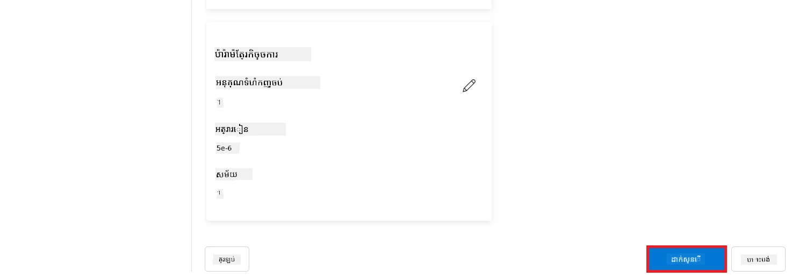

1. ពេលម៉ូដែលរបស់អ្នកបានបំពេញបន្ថែមរួចរាល់ ស្ថានភាពនឹងបង្ហាញជា **Completed** ដូចបង្ហាញក្នុងរូបខាងក្រោម។ ឥឡូវ អ្នកអាចដាក់បង្ហោះម៉ូដែលនិងប្រើវានៅក្នុងកម្មវិធីរបស់អ្នក ឬក្នុងកន្លែងលេង (playground) ឬ prompt flow។ សម្រាប់ព័ត៌មានបន្ថែម សូមមើល [របៀបដាក់បង្ហោះម៉ូដែល Phi-3 ជាមួយ Microsoft Foundry](https://learn.microsoft.com/azure/ai-studio/how-to/deploy-models-phi-3?tabs=phi-3-5&pivots=programming-language-python)។

    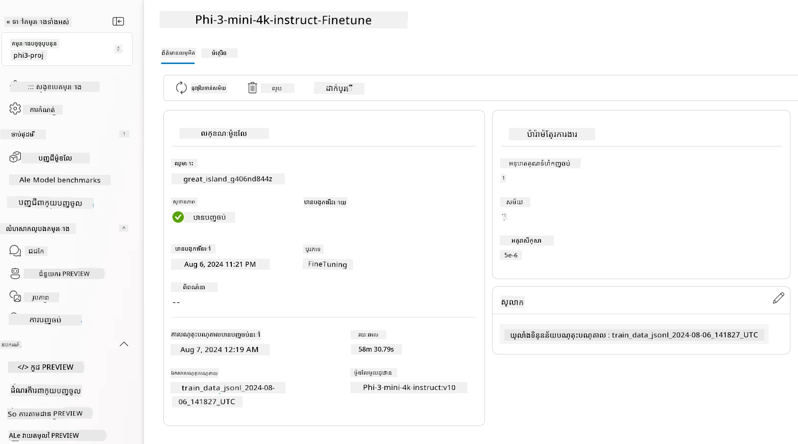

> [!NOTE]
> សម្រាប់ព័ត៌មានលម្អិតអំពីការបំពេញបន្ថែម Phi-3 សូមចូលទៅកាន់ [Fine-tune Phi-3 models in Microsoft Foundry](https://learn.microsoft.com/azure/ai-studio/how-to/fine-tune-phi-3?tabs=phi-3-mini)។

## ការលុបម៉ូដែលដែលបានបំពេញបន្ថែមរបស់អ្នក

អ្នកអាចលុបម៉ូដែលដែលបានបំពេញបន្ថែមពីបញ្ជីម៉ូដែលបំពេញបន្ថែមនៅ [Microsoft Foundry](https://ai.azure.com) ឬពីទំព័រព័ត៌មានម៉ូដែល។ ជ្រើសម៉ូដែលដែលបានបំពេញបន្ថែមដែលអ្នកចង់លុបពីទំព័របំពេញបន្ថែម ហើយបន្ទាប់មកជ្រើសប៊ូតុង Delete ដើម្បីលុបម៉ូដែលនោះ។

> [!NOTE]
> អ្នកមិនអាចលុបម៉ូដែលផ្ទាល់ខ្លួនបាន ប្រសិនបើវាមានការដាក់បង្ហោះស្រាប់។ អ្នកត្រូវលុបការដាក់បង្ហោះម៉ូដែលរបស់អ្នកជាមុនសិន មុននឹងអាចលុបម៉ូដែលផ្ទាល់ខ្លួនបាន។

## ថ្លៃក៏ដូចជាកំណត់វិភាគ

### ការពិចារណាថ្លៃ និងកំណត់វីភាគសម្រាប់ម៉ូដែល Phi-3 ដែលបានបំពេញបន្ថែមជាសេវាកម្ម

ម៉ូដែល Phi ដែលបានបំពេញបន្ថែមជា​សេវាកម្ម ត្រូវបានផ្តល់ដោយ Microsoft ហើយរួមបញ្ចូលជាមួយ Microsoft Foundry សម្រាប់ប្រើប្រាស់។ អ្នកអាចស្វែងរកតម្លៃនៅពេល [ដាក់បង្ហោះ](https://learn.microsoft.com/azure/ai-studio/how-to/deploy-models-phi-3?tabs=phi-3-5&pivots=programming-language-python) ឬពេលបំពេញបន្ថែមម៉ូដែលនៅក្រោមផ្ទាំង Pricing and terms នៅក្នុងផ្លូវដំណើរការដាក់បង្ហោះ។

## ការត្រង់មាតិកា Content filtering

ម៉ូដែលដែលបានដាក់បង្ហោះជាសេវាកម្មដែលបង់តាមការប្រើប្រាស់ ត្រូវបានការពារដោយ Azure AI Content Safety។ ពេលដាក់បង្ហោះទៅចុងបង្ហាញពេលវេលាពិត អ្នកអាចជ្រើសរើសមិនចូលរួមក្នុងសមត្ថភាពនេះ។ ជាមួយ Azure AI content safety ដែលបើកដំណើរការ សំនួរនិងចម្លើយទាំងអស់ ត្រូវឆ្លងកាត់ក្រុមម៉ូដែលចំណាត់ថ្នាក់ ដែលមានគោលបំណងរកឃើញ និងទប់ស្កាត់មាតិកាដែលមានគ្រោះថ្នាក់។ ប្រព័ន្ធត្រង់មាតិកា កំណត់ និងអនុវត្តន៍លើប្រភេទក្រុមមាតិកាដែលមានហានិភ័យទាំងក្នុងសំនួរចូល និងចម្លើយចេញ។ សូមស្វែងយល់បន្ថែមអំពី [Azure AI Content Safety](https://learn.microsoft.com/azure/ai-studio/concepts/content-filtering)។

**ការកំណត់ Fine-Tuning**

បញ្ជាក់ពី hyperparameters ដូចជា អត្រា​សិក្សា, គុណនុបញ្ចូល និងចំនួនថ្នាក់សិក្សា ។

**Loss Function**

ជ្រើសរើស Loss function ដែលសមស្របសម្រាប់បេសកកម្មរបស់អ្នក (ដូចជា cross-entropy)។

**Optimizer**

ជ្រើសរើស Optimizer (ដូចជា Adam) សម្រាប់ធ្វើបច្ចុប្បន្នភាព gradient នៅពេលបណ្តុះបណ្តាល។

**ដំណើរការបំពេញបន្ថែម**

- ផ្ទុកម៉ូដែលដែលបានបណ្តុះកម្រិតមុន៖ ផ្ទុក checkpoint របស់ Phi-3 Mini។
- បន្ថែមស្រទាប់ផ្ទាល់ខ្លួន៖ បន្ថែមស្រទាប់ជាក់លាក់សម្រាប់បេសកកម្ម (ដូចជា ចំណុចចំណាត់ថ្នាក់សម្រាប់ការណែនាំជជែក)។

**បណ្តុះបណ្តាលម៉ូដែល**
បំពេញបន្ថែមម៉ូដែលដោយប្រើសំណុំទិន្នន័យដែលបានរៀបចំរបស់អ្នក។ តាមដានដំណើរការបណ្តុះបណ្តាល និងកែប្រែ hyperparameters បើចាំបាច់។

**ការវាយតម្លៃនិងត្រួតពិនិត្យ**

សំណុំត្រួតពិនិត្យ៖ ចែកទិន្នន័យរបស់អ្នកជាសំណុំបណ្តុះបណ្តាល និងសំណុំត្រួតពិនិត្យ។

**វាយតម្លៃសមត្ថភាព**

ប្រើវិមាត្រដូចជា ត្រឹមត្រូវ (accuracy), ពិន្ទុ F1, ឬ perplexity ដើម្បីវាយតម្លៃសមត្ថភាពម៉ូដែល។

## រក្សាទុកម៉ូដែលដែលបានបំពេញបន្ថែម

**Checkpoint**  
រក្សាទុក checkpoint ម៉ូដែលដែលបានបំពេញបន្ថែមសម្រាប់ប្រើប្រាស់នៅពេលក្រោយ។

## ការដាក់បង្ហោះ

- ដាក់បង្ហោះជា សេវាវេបសាយ៖ ដាក់បង្ហោះម៉ូដែលដែលបានបំពេញបន្ថែមនៅក្នុង Microsoft Foundry ជាសេវាវេបសាយ។
- សាកល្បងចុងបង្ហាញ៖ ផ្ញើសំណួរពិនិត្យទៅចុងបង្ហាញដែលបានដាក់បង្ហោះ ដើម្បីបញ្ជាក់មុខងារ។

## បន្តកែលម្អ

បន្តការសាកល្បង៖ ប្រសិនបើសមត្ថភាពមិនដំណើរការល្អល្អទេ សូមបន្ថែមការប្រែប្រួល hyperparameters, បន្ថែមទិន្នន័យ ឬបំពេញបន្ថែមបន្ថែមចំនួនថ្នាក់សិក្សា។

## តាមដាន និងកែលម្អ

តាមដានអនុវត្តន៍ម៉ូដែលជាប្រចាំ ហើយកែប្រែបើចាំបាច់។

## ប្តូរតាមតម្រូវការ និងពង្រីក

បេសកកម្មផ្ទាល់ខ្លួន៖ Phi-3 Mini អាចបំពេញបន្ថែមសម្រាប់បេសកកម្មផ្សេងៗក្រៅសេចក្តីណែនាំជជែក។ ស្វែងរកការប្រើប្រាស់ផ្សេងទៀត!
សាកល្បង៖ កំណត់រចនាសម្ព័ន្ធ, ការរួមបញ្ចូលស្រទាប់ និងបច្ចេកទេសផ្សេងទៀតដើម្បីបង្កើនសមត្ថភាព។

> [!NOTE]
> ការបំពេញបន្ថែមគឺជាប្រតិបត្តិការច្រើនជំហាន។ សាកល្បង រៀន និងបត់បែនម៉ូដែលរបស់អ្នក ដើម្បីទទួលបានលទ្ធផលល្អបំផុតសម្រាប់បេសកកម្មរបស់អ្នក!

---

<!-- CO-OP TRANSLATOR DISCLAIMER START -->
**ការបដិសេធ**៖  
ឯកសារនេះត្រូវបានបកប្រែដោយប្រើសេវាពិភាក្សាបកប្រែ AI [Co-op Translator](https://github.com/Azure/co-op-translator)។ ខណៈពេលដែលយើងខំប្រឹងប្រែងសម្រាប់ភាពត្រឹមត្រូវ សូមដឹងថាការបកប្រែដោយស្វ័យប្រវត្តិអាចមានកំហុសឬការបរាជ័យមិនត្រឹមត្រូវ។ ឯកសារដើមនៅក្នុងភាសាតំណើររបស់វាគួរត្រូវបានគិតថាជាផ្ទៃតំណាងដើមដ៏មានអំណាច។ សម្រាប់ព័ត៌មានសំខាន់ សូមផ្ដល់អនុសាសន៍ក្នុងការបកប្រែដោយមនុស្សជំនាញវិជ្ជាជីវៈ។ យើងមិនទទួលខុសត្រូវចំពោះការយល់ច្រឡំនិងការបកស្រាយខុសផ្សេងៗដែលកើតឡើងពីការប្រើប្រាស់ការបកប្រែនេះឡើយ។
<!-- CO-OP TRANSLATOR DISCLAIMER END -->