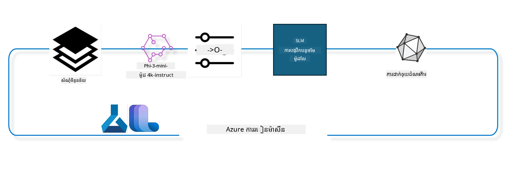

## របៀបប្រើប្រាស់ឧបករណ៍បញ្ចប់ជជែកពីចុះបញ្ជីប្រព័ន្ធ Azure ML ដើម្បីលៃតម្រូវម៉ូដែលឱ្យបានត្រឹមត្រូវ

ក្នុងឧទាហរណ៍នេះ យើងនឹងធ្វើការលៃតម្រូវម៉ូដែល Phi-3-mini-4k-instruct ដើម្បីបញ្ចប់ការជជែករវាងបុគ្គល 2 នាក់ដោយប្រើទិន្នន័យ ultrachat_200k។



ឧទាហរណ៍នេះនឹងបង្ហាញអ្នកពីរបៀបធ្វើការលៃតម្រូវម៉ូដែលដោយប្រើ Azure ML SDK និង Python ហើយបន្ទាប់មកចាប់ផ្តើមបម្រែបម្រួលម៉ូដែលដែលបានលៃតម្រូវទៅកាន់ចំណុចបញ្ចប់តាមអ៊ិនធរណែតសម្រាប់ការព្យាករណ៍ពេលវេលាពិត។

### ទិន្នន័យហ្វឹកហាត់

យើងនឹងប្រើទិន្នន័យ ultrachat_200k។ នេះគឺជាកំណែកដែលបានចម្រាញ់យ៉ាងតឹងរឹងពីទិន្នន័យ UltraChat ហើយត្រូវបានប្រើសម្រាប់បង្ហាត់ម៉ូដែល Zephyr-7B-β ដែលជាម៉ូដែលជជែកទំនើប 7b។

### ម៉ូដែល

យើងនឹងប្រើម៉ូដែល Phi-3-mini-4k-instruct ដើម្បីបង្ហាញពីរបៀបដែលអ្នកអាចលៃតម្រូវម៉ូដែលសម្រាប់ភារកិច្ចបញ្ចប់ជជែក។ ប្រសិនបើអ្នកបានបើកកំណត់បណ្ណនេះពីកាតម៉ូដែលជាក់លាក់ សូមចំណាំប្ដូរឈ្មោះម៉ូដែលជាក់លាក់នោះ។

### ភារកិច្ច

- ជ្រើសម៉ូដែលដើម្បីលៃតម្រូវ។
- ជ្រើសប្រភេទទិន្នន័យហ្វឹកហាត់ និងសិក្សាផង។
- កំណត់ការងារលៃតម្រូវ។
- ដំណើរការការងារលៃតម្រូវ។
- ពិនិត្យមើលគណនេយ្យនិងវាយតម្លៃ។
- ចុះបញ្ជីម៉ូដែលដែលបានលៃតម្រូវ។
- ចាប់ផ្តើមម៉ូដែលដែលបានលៃតម្រូវសម្រាប់ព្យាករណ៍ពេលវេលាពិត។
- សម្អាតធនធាន។

## 1. តំឡើងអ្វីដែលត្រូវការ

- ដំឡើងតម្រូវការ
- តភ្ជាប់ទៅកាន់ AzureML Workspace។ សូមស្វែងយល់បន្ថែមនៅ set up SDK authentication។ ជំនួស <WORKSPACE_NAME>, <RESOURCE_GROUP> និង <SUBSCRIPTION_ID> ខាងក្រោម។
- តភ្ជាប់ទៅប្រព័ន្ធចុះបញ្ជី azureml
- កំណត់ឈ្មោះប្រើប្រាស់អាជីវកម្មបន្ទាប់មក (optional)
- ពិនិត្យឬបង្កើតកុំព្យូទ័រ។

> [!NOTE]
> តម្រូវការត្រូវមានកុំព្យូទ័រលំនាំតែមួយដែលអាចមានកាត GPU ច្រើន។ ឧទាហរណ៍ ក្នុងកុំព្យូទ័រមួយនៃ Standard_NC24rs_v3 មានកាត NVIDIA V100 GPU ចំនួន 4 ខណៈដែល Standard_NC12s_v3 មានកាត NVIDIA V100 GPU ចំនួន 2។ សូមយោងទៅឯកសារសម្រាប់ព័ត៌មានបន្ថែម។ ចំនួនកាត GPU ក្នុងកុំព្យូទ័រត្រូវបានកំណត់នៅជាម៉ូឌុល gpus_per_node ខាងក្រោម។ ការកំណត់តម្លៃនេះឲ្យត្រឹមត្រូវនឹងធ្វើឲ្យប្រើប្រាស់កាត GPU ទាំងអស់ក្នុងកុំព្យូទ័របាន។ SKU កុំព្យូទ័រ GPU ដែលណែនាំត្រូវអាចរកបាននៅទីនេះ និងទីនេះ។

### បណ្ណាល័យ Python

ដំឡើងតម្រូវការដោយរត់កូដខាងក្រោម។ នេះជជំហានចាំបាច់ក្នុងករណីរត់នៅបរិយាកាសថ្មី។

```bash
pip install azure-ai-ml
pip install azure-identity
pip install datasets==2.9.0
pip install mlflow
pip install azureml-mlflow
```

### ទំនាក់ទំនងជាមួយ Azure ML

1. ស្គ្រិប Python នេះត្រូវបានប្រើទំនាក់ទំនងជាមួយសេវាកម្ម Azure Machine Learning (Azure ML)។ ខាងក្រោមនេះជាសេចក្តីពន្យល់អំពីវាធ្វើអ្វី៖

    - វាដាំចូលម៉ូឌុលដែលចាំបាច់ពីកញ្ចប់ azure.ai.ml, azure.identity និង azure.ai.ml.entities។ វាក៏ដាំចូលម៉ូឌុល time ផងដែរ។

    - វ forsøger at godkende ved hjælp af DefaultAzureCredential(), som giver en forenklet godkendelsesoplevelse for hurtigt at starte udviklingen af applikationer, der kører i Azure-skyen. Hvis dette mislykkes, falder det tilbage til InteractiveBrowserCredential(), som giver en interaktiv login-prompt.

    - វាក្រោយមកព្យាយាមបង្កើតអ实例 MLClient ដោយប្រើវិធី from_config ដែលអានកំណត់ការបណ្តាញពីឯកសារ config ជំនដ្ឋាន (config.json)។ ប្រសិនបើបរាជ័យ វាបង្កើត MLClient ដោយផ្ដល់ subscription_id, resource_group_name និង workspace_name ផ្ទាល់ខ្លួន។

    - វាបង្កើត MLClient មួយទៀត សម្រាប់ប្រព័ន្ធចុះបញ្ជី Azure ML ឈ្មោះ "azureml"។ ប្រព័ន្ធចុះបញ្ជីនេះគឺជាទីតាំងផ្ទុកម៉ូដែល, ប៉ាយប៊លីនលៃតម្រូវ និងបរិយាកាសផ្សេងៗ។

    - វាកំណត់ experiment_name ទៅ "chat_completion_Phi-3-mini-4k-instruct"។

    - វាបង្កើតស្លាកពេលវេលាឯកច្ឆន្ទដោយបម្លែងពេលវេលាបច្ចុប្បន្ន (ជាវិនាទីតាំងពី epoch ជាចំនួនទសភាគ) ទៅជាចំនួនគត់ ហើយបន្ទាប់មកទៅជាសរសេរ។ ស្លាកពេលវេលានេះអាចប្រើសម្រាប់បង្កើតឈ្មោះនិងកំណែដែលផ្ទុយគ្នា។

    ```python
    # នាំចូលម៉ូឌុលដែលចាំបាច់ពី Azure ML និង Azure Identity
    from azure.ai.ml import MLClient
    from azure.identity import (
        DefaultAzureCredential,
        InteractiveBrowserCredential,
    )
    from azure.ai.ml.entities import AmlCompute
    import time  # នាំចូលម៉ូឌុល time
    
    # ព្យាយាមធ្វើការផ្ទៀងផ្ទាត់ អ្នកប្រើប្រាស់ដោយប្រើ DefaultAzureCredential
    try:
        credential = DefaultAzureCredential()
        credential.get_token("https://management.azure.com/.default")
    except Exception as ex:  # ប្រសិនបើ DefaultAzureCredential បរាជ័យ សូមប្រើ InteractiveBrowserCredential
        credential = InteractiveBrowserCredential()
    
    # ព្យាយាមបង្កើតអ_INSTANCE MLClient ដោយប្រើឯកសារកំណត់រចនាសម្ព័ន្ធលំនាំដើម
    try:
        workspace_ml_client = MLClient.from_config(credential=credential)
    except:  # ប្រសិនបើបរាជ័យ សូមបង្កើតអ_INSTANCE MLClient ដោយផ្តល់ព័ត៌មានដោយដៃ
        workspace_ml_client = MLClient(
            credential,
            subscription_id="<SUBSCRIPTION_ID>",
            resource_group_name="<RESOURCE_GROUP>",
            workspace_name="<WORKSPACE_NAME>",
        )
    
    # បង្កើតអ_INSTANCE MLClient មួយទៀតសម្រាប់ ចុះបញ្ជី Azure ML មានឈ្មោះ "azureml"
    # ចុះបញ្ជីនេះគឺជាកន្លែងដែលរក្សាទុកម៉ូដែល របៀបកំណត់ងាយស្រួល និងបរិស្ថាន
    registry_ml_client = MLClient(credential, registry_name="azureml")
    
    # កំណត់ឈ្មោះការសាកល្បង
    experiment_name = "chat_completion_Phi-3-mini-4k-instruct"
    
    # ប្រើបង្កើតពេលវេលាផ្សេងពីគ្នាច្បាស់លាស់ដែលអាចប្រើសម្រាប់ឈ្មោះ និងកំណែដែលត្រូវមានភាពតែមួយ
    timestamp = str(int(time.time()))
    ```

## 2. ជ្រើសម៉ូដែលមូលដ្ឋានដើម្បីលៃតម្រូវ

1. Phi-3-mini-4k-instruct ជាម៉ូដែលដែលមាន 3.8 ពាន់លានលក្ខណៈ (parameters), មានទម្ងន់ស្រាល និងជាម៉ូដែលបើកប្រើបច្ចេកវិទ្យាថ្មីមួយ ដែលគោលដៅលើបណ្ដុំទិន្នន័យដែលប្រើសម្រាប់ Phi-2។ ម៉ូដែលនេះជាសមាជិកនៃគ្រួសារម៉ូដែល Phi-3 ហើយ Mini មាន 2 ជម្រើស គឺ 4K និង 128K ដែលជាជំពូក context length (ក្នុងន័យនៃអក្សរ) ដែលវាអាចគាំទ្រ។ យើងត្រូវលៃតម្រូវម៉ូដែលនេះសម្រាប់គោលបំណងបញ្ញត្តិផ្ទាល់ខ្លួន។ អ្នកអាចរកមើលម៉ូដែលទាំងនេះក្នុងបញ្ជីម៉ូដែល (Model Catalog) នៅក្នុង AzureML Studio ដោយតម្រៀបតាមភារកិច្ចបញ្ចប់ជជែក។ ក្នុងឧទាហរណ៍នេះ យើងប្រើម៉ូដែល Phi-3-mini-4k-instruct។ ប្រសិនបើអ្នកបានបើកកំណត់បណ្ណនេះសម្រាប់ម៉ូដែលផ្សេង សូមប្ដូរឈ្មោះម៉ូដែល និងកំណែអោយតាមដាន។

> [!NOTE]
> លក្ខណៈលំអិតរបស់ម៉ូដែល (model id) នេះត្រូវបានផ្តល់ជាអ្នកបញ្ចូលទៅក្នុងការងារលៃតម្រូវ។ វាក៏អាចស្វែងរកបានជាកន្លែង Asset ID នៅក្នុងផ្ទាំងព័ត៌មានម៉ូដែលនៅ AzureML Studio Model Catalog។

2. ស្គ្រីប Python នេះទំនាក់ទំនងជាមួយសេវាកម្ម Azure Machine Learning (Azure ML)។ សេចក្តីពន្យល់៖

    - វាបង្ហាញឈ្មោះម៉ូដែលជា "Phi-3-mini-4k-instruct"។

    - វាប្រើវិធី get របស់ models ពីចំណុច registry_ml_client ដើម្បីទទួលបានកំណែចុងក្រោយនៃម៉ូដែលតាមឈ្មោះដែលបានបញ្ជាក់ពីចុះបញ្ជី Azure ML។

    - វាបង្ហាញសារ នៅលើ console សូមបញ្ជាក់ឈ្មោះ, កំណែ និងអត្តសញ្ញាណ id របស់ម៉ូដែលដែលនឹងប្រើសម្រាប់លៃតម្រូវ។ វាក៏ប្រើវិធី format ដើម្បីបញ្ចូលឈ្មោះ, កំណែ និង id នៃម៉ូដែលក្នុងសារ។ 

    ```python
    # កំណត់ឈ្មោះម៉ូដែល
    model_name = "Phi-3-mini-4k-instruct"
    
    # ទទួលបានជំនាន់ចុងក្រោយនៃម៉ូដែលពីរេហ្ស៊ីស្ត្រី Azure ML
    foundation_model = registry_ml_client.models.get(model_name, label="latest")
    
    # បោះពុម្ពឈ្មោះម៉ូដែល ជំនាន់ និងអត្តសញ្ញាណ
    # ព័ត៌មាននេះមានប្រយោជន៍សម្រាប់តាមដាន និងដោះស្រាយបញ្ហា
    print(
        "\n\nUsing model name: {0}, version: {1}, id: {2} for fine tuning".format(
            foundation_model.name, foundation_model.version, foundation_model.id
        )
    )
    ```

## 3. បង្កើតកុំព្យូទ័រដើម្បីប្រើជាការងារ

កិច្ចការលៃតម្រូវដំណើរការបានតែជាមួយកុំព្យូទ័រ GPU ប៉ុណ្ណោះ។ ទំហំកុំព្យូទ័រអាស្រ័យលើទំហំម៉ូដែល ហើយនៅក្នុងភាគច្រើនវាពិបាកកំណត់កុំព្យូទ័រដែលត្រឹមត្រូវសម្រាប់ការងារ។ ក្នុងកូដនេះ យើងណែនាំអ្នកជ្រើសកុំព្យូទ័រដែលត្រូវសម្រាប់ការងារ។

> [!NOTE]
> កុំព្យូទ័រដែលបានរាយនៅខាងក្រោមដំណើរការជាមួយការកំណត់ដែលមានប្រសិទ្ធភាពបំផុត។ ការផ្លាស់ប្តូរជាមួយការកំណត់អាចនាំឲ្យមានកំហុស CUDA Out Of Memory។ ក្នុងករណីនេះ សូមព្យាយាមបង្កើនទំហំកុំព្យូទ័រ។

> [!NOTE]
> ពេលជ្រើស compute_cluster_size ខាងក្រោម សូមប្រាកដថាកុំព្យូទ័រនោះមាននៅក្នុងក្រុមធនធានរបស់អ្នក។ ប្រសិនបើមិនមាន អ្នកអាចស្នើសុំចូលប្រើធនធានកុំព្យូទ័រនេះបាន។

### ពិនិត្យមើលម៉ូដែលសម្រាប់ការគាំទ្រ Fine Tuning

1. ស្គ្រីប Python នេះមើលរឿងក្នុងម៉ូដែល Azure Machine Learning (Azure ML)។ សេចក្តីពន្យល់៖

    - វាដាំចូលម៉ូឌុល ast ដែលផ្ដល់មុខងារសម្រាប់ដំណើរការដើមរូបមន្ត syntax grammar នៃ Python។

    - វាពិនិត្យមើលថាតើ foundation_model (ម៉ូដែលដែលកំណត់) មានស្លាក finetune_compute_allow_list ឬអត់។ ស្លាកក្នុង Azure ML គឺជាគូ key-value ដែលអ្នកបង្កើត និងប្រើសម្រាប់តម្រៀប ឬតម្រងម៉ូដែល។

    - ប្រសិនបើស្លាក finetune_compute_allow_list មាន វាប្រើ ast.literal_eval ដើម្បីបកប្រែតម្លៃ (string) នោះទៅជាបញ្ជី Python ។ បញ្ជីនេះត្រូវបានផ្ដល់ទៅគន្លង computes_allow_list ហើយបង្ហាញសារថាគួរបង្កើតកុំព្យូទ័រពីបញ្ជីនេះ។

    - ប្រសិនបើស្លាក finetune_compute_allow_list មិនមាន វាត្រូវបានកំណត់ computes_allow_list ជា None ហើយបង្ហាញសារថាស្លាក finetune_compute_allow_list មិនមាននៅក្នុងស្លាកម៉ូដែល។

    - ទាំងមូល ខ្នាតនេះផ្ទៀងផ្ទាត់ស្លាក ជូរចំណាំក្នុងម៉ូដែល និងផ្ដល់ពត៌មានដល់អ្នកប្រើ។

    ```python
    # នាំចូលម៉ូឌុល ast ដែលផ្តល់មុខងារដើម្បីដំណើរការព្រៃនៃវេយ្យាករណ៍ច្បាស់របស់ Python
    import ast
    
    # ពិនិត្យមើលថា​ស្លាក 'finetune_compute_allow_list' មាននៅក្នុងស្លាកមូឌែលឬទេ
    if "finetune_compute_allow_list" in foundation_model.tags:
        # ប្រសិនបើស្លាកមាន ការប្រើ ast.literal_eval ដើម្បីបកប្រែតម្លៃស្លាក (ខ្សែអក្សរ) ជាបញ្ជី Python ដោយសុវត្ថិភាព
        computes_allow_list = ast.literal_eval(
            foundation_model.tags["finetune_compute_allow_list"]
        )  # បម្លែងខ្សែអក្សរទៅជាបញ្ជី Python
        # បោះពុម្ពសារ បង្ហាញថាគណនាត្រូវបានបង្កើតពីបញ្ជី
        print(f"Please create a compute from the above list - {computes_allow_list}")
    else:
        # ប្រសិនបើស្លាកមិនមាន កំណត់ computes_allow_list ទៅ None
        computes_allow_list = None
        # បោះពុម្ពសារ បង្ហាញថា​ស្លាក 'finetune_compute_allow_list' មិនមែនជាផ្នែកនៃស្លាកមូឌែល
        print("`finetune_compute_allow_list` is not part of model tags")
    ```

### ពិនិត្យមើលឧបករណ៍គណនា

1. ស្គ្រីប Python នេះចូលទៅក្នុងសេវា Azure Machine Learning (Azure ML) ហើយបំពេញការត្រួតពិនិត្យលើឧបករណ៍គណនា។ សេចក្តីពន្យល់៖

    - វាព្យាយាមយកឧបករណ៍គណនាដែលមានឈ្មោះគឺ compute_cluster ពីកន្លែងផ្ទុក Azure ML ហើយបើស្ថានភាពបញ្ជូន (provisioning state) ជា "failed" វាបង្ហោះកំហុស ValueError។

    - វាពិនិត្យបញ្ជី computes_allow_list មិនមែន None។ ប្រសិនបើមិនមែន វាបម្លែងទំហំកុំព្យូទ័រទាំងអស់ក្នុងបញ្ជីទៅអក្សរតូច ហើយពិនិត្យមើលថាតើទំហំរបស់ឧបករណ៍គណនាថ្មីមានក្នុងបញ្ជីនេះ ទេ។ ប្រសិនបើមិនមាន វាបង្ហោះកំហុស ValueError។

    - ប្រសិនបើ computes_allow_list ជា None វាបញ្ចូលបញ្ជីទំហំ VM GPU មិនគាំទ្រ ហើយពិនិត្យមើលទំហំកុំព្យូទ័រថ្មី ប្រសើបើនៅក្នុងបញ្ជី នោះវាបង្ហោះកំហុស ValueError។

    - វាបន្តយកបញ្ជីទំហំកុំព្យូទ័រទាំងអស់នៅក្នុង workspace ហើយចូលផ្លាស់ទីលើបញ្ជីនេះ ដើម្បីរកតើឈ្មោះទំហំណាមួយផ្គូរផ្គងនឹងទំហំកុំព្យូទ័រថ្មី។ ប្រសិនបើពិត វាត្រឡប់លេខកាត GPU និងកំណត់ gpu_count_found ទៅ True។

    - ប្រសិនបើ gpu_count_found ជា True វាបង្ហាញចំនួនកាត GPU នៅក្នុងកុំព្យូទ័រ។ ប្រសិនបើ False វាបង្ហោះកំហុស ValueError។

    - សង្ខេប ស្គ្រីបនេះពិនិត្យស្ថានភាពកុំព្យូទ័រនៅក្នុង Azure ML workspace រួមមានស្ថានភាពបញ្ជូន, ទំហំបញ្ជីតាមគោលការណ៍ទទួលអនុញ្ញាត ឬបដិសេធ និងចំនួនកាត GPU វាមាន។

    ```python
    # បោះពុម្ពសារ​ការកើត​កំហុស
    print(e)
    # ឡើង​បញ្ហា ValueError ប្រសិនបើទំហំคុំព្យូទ័រមិនមាននៅក្នុងកន្លែងបំពេញការ
    raise ValueError(
        f"WARNING! Compute size {compute_cluster_size} not available in workspace"
    )
    
    # ទាញយកគណនាថត​ពីកន្លែងធ្វើការ Azure ML
    compute = workspace_ml_client.compute.get(compute_cluster)
    # ពិនិត្យមើលបើស្ថានភាពផ្គត់ផ្គង់នៃគណនាថតជាលើកង "បរាជ័យ"
    if compute.provisioning_state.lower() == "failed":
        # ឡើង​បញ្ហា ValueError ប្រសិនបើស្ថានភាពផ្គត់ផ្គង់គឺជា "បរាជ័យ"
        raise ValueError(
            f"Provisioning failed, Compute '{compute_cluster}' is in failed state. "
            f"please try creating a different compute"
        )
    
    # ពិនិត្យមើលបើ computes_allow_list មិនមែន None
    if computes_allow_list is not None:
        # បម្លែងទំហំ​គណនាទាំងអស់​នៅក្នុង computes_allow_list ទៅអក្សរតូច
        computes_allow_list_lower_case = [x.lower() for x in computes_allow_list]
        # ពិនិត្យមើលបើទំហំគណនាថតមាននៅក្នុង computes_allow_list_lower_case
        if compute.size.lower() not in computes_allow_list_lower_case:
            # ឡើង​បញ្ហា ValueError ប្រសិនបើទំហំគណនាថតមិនមាននៅក្នុង computes_allow_list_lower_case
            raise ValueError(
                f"VM size {compute.size} is not in the allow-listed computes for finetuning"
            )
    else:
        # កំណត់បញ្ជីទំហំ VM GPU ដែលមិនគាំទ្រ
        unsupported_gpu_vm_list = [
            "standard_nc6",
            "standard_nc12",
            "standard_nc24",
            "standard_nc24r",
        ]
        # ពិនិត្យមើលបើទំហំគណនាថតមាននៅក្នុងបញ្ជី unsupported_gpu_vm_list
        if compute.size.lower() in unsupported_gpu_vm_list:
            # ឡើង​បញ្ហា ValueError ប្រសិនបើទំហំគណនាថតមាននៅក្នុងបញ្ជី unsupported_gpu_vm_list
            raise ValueError(
                f"VM size {compute.size} is currently not supported for finetuning"
            )
    
    # សមាមាត្រត្រួតពិនិត្យបើចំនួន GPU នៅក្នុងគណនាថតត្រូវបានរកឃើញ
    gpu_count_found = False
    # ទាញយកបញ្ជីទំហំគណនាដែលមានស្រាប់ទាំងអស់នៅក្នុងកន្លែងធ្វើការ
    workspace_compute_sku_list = workspace_ml_client.compute.list_sizes()
    available_sku_sizes = []
    # វិលជុំលើបញ្ជីទំហំគណនាដែលមានស្រាប់
    for compute_sku in workspace_compute_sku_list:
        available_sku_sizes.append(compute_sku.name)
        # ពិនិត្យមើលបើឈ្មោះទំហំគណនាដែលត្រូវបានដាក់ឈ្មោះផ្ទៀងផ្ទាត់នឹងទំហំគណនាថត
        if compute_sku.name.lower() == compute.size.lower():
            # ប្រសិនបើត្រូវ, ទាញយកចំនួន GPU សម្រាប់ទំហំគណនានេះ និងកំណត់ gpu_count_found ទៅជា True
            gpus_per_node = compute_sku.gpus
            gpu_count_found = True
    # ប្រសិនបើ gpu_count_found ជា True, បោះពុម្ពចំនួន GPU នៅក្នុងគណនាថត
    if gpu_count_found:
        print(f"Number of GPU's in compute {compute.size}: {gpus_per_node}")
    else:
        # ប្រសិនបើ gpu_count_found ជា False, ឡើង​បញ្ហា ValueError
        raise ValueError(
            f"Number of GPU's in compute {compute.size} not found. Available skus are: {available_sku_sizes}."
            f"This should not happen. Please check the selected compute cluster: {compute_cluster} and try again."
        )
    ```

## 4. ជ្រើសប្រភេទទិន្នន័យសម្រាប់លៃតម្រូវម៉ូដែល

1. យើងប្រើទិន្នន័យ ultrachat_200k។ ទិន្នន័យនេះមានបួនផ្នែក បំពាក់សម្រាប់ការលៃតម្រូវដោយគ្រប់គ្រង (Supervised fine-tuning – sft)។
ការវាយតម្លៃផលប័ត្រ (generation ranking – gen)។ ចំនួនឧទាហរណ៍ក្នុងមួយផ្នែកបង្ហាញដូចខាងក្រោម៖

    ```bash
    train_sft test_sft  train_gen  test_gen
    207865  23110  256032  28304
    ```

1. កូដកន្លះក្រោមបង្ហាញការរៀបចំទិន្នន័យមូលដ្ឋានសម្រាប់លៃតម្រូវ៖

### បង្ហាញមើលជួរទិន្នន័យខ្លះៗ

យើងចង់ឲ្យគំរូនេះរត់យ៉ាងលឿន ដូច្នេះរក្សាទុកឯកសារ train_sft, test_sft ដែលមានខ្នាតសរសេរ 5% នៃទិន្នន័យដែលបានកាត់បន្ថយរួច។ នេះមានន័យថាម៉ូដែលដែលបានលៃតម្រូវនឹងមានភាពត្រឹមត្រូវទាប ដូច្នេះមិនគួរប្រើប្រាស់ក្នុងបរិដ្ឋានពិតប្រាកដ។
download-dataset.py ត្រូវបានប្រើសម្រាប់ទាញយកទិន្នន័យ ultrachat_200k និងបម្លែងទិន្នន័យទៅទ្រង់ទ្រាយដែលអាចប្រើបានសម្រាប់ផ្លូវលៃតម្រូវ។ និងដោយសារតែទិន្នន័យមានទំហំធំ យើងមានតែផ្នែកមួយតែប៉ុណ្ណោះ។

1. ការរត់កូដខាងក្រោមនេះគ្រាន់តែទាញយក 5% នៃទិន្នន័យ តម្លៃនេះអាចបង្កើនបានដោយផ្លាស់ប្តូរពេរ៉ាម៉ែត្រដែលមានឈ្មោះ dataset_split_pc ទៅចំណាត់ថ្នាក់ដែលចង់បាន។

> [!NOTE]
> ម៉ូដែលភាសាខ្លះមានកូដភាសាផ្សេងគ្នា ហើយដូច្នេះឈ្មោះជួរឈរនៅក្នុងទិន្នន័យគួរតែផ្គូរផ្គងគ្នា។

1. នេះជាឧទាហរណ៍ពីរបៀបទិន្នន័យគួរតែបង្ហាញ
ទិន្នន័យ chat-completion ត្រូវបានរក្សាទុកក្នុងទ្រង់ទ្រាយ parquet ដោយក្នុងមួយកំណត់ត្រាមានស្គីមដូចខាងក្រោម៖

    - នេះជាឯកសារ JSON (JavaScript Object Notation) ដែលជាទ្រង់ទ្រាយចែករំលែកទិន្នន័យពេញនិយមមួយ។ វាមិនមែនកូដអនុវត្តន៍ទេ ប៉ុន្តែជាវិធីផ្ទុក និងផ្ញើទិន្នន័យ។ ខាងក្រោមជាសេចក្តីពន្យល់ពីរចនាសម្ព័ន្ធរបស់វា៖

    - "prompt": គន្លងនេះផ្ទុកសំណុំអត្ថបទដែលជាងារ ឬសំណួរចំពោះជំនួយការ AI។

    - "messages": គន្លងនេះផ្ទុកជាតារាងអេឡិចត្រូនិក។ ក្នុងន័យទាំងអស់នេះជាការជជែក ហើយមនុស្សម្នាក់និងជំនួយការ AI ឆ្លើយតបខ្លួនគ្នា។ ក្នុងមួយសារមាន 2 គន្លង៖

    - "content": ផ្ទុកអត្ថបទនៃសារ។
    - "role": បង្ហាញតួនាទីអ្នកផ្ញើសារ មួយក្នុងចំណោម "user" ឬ "assistant"។
    - "prompt_id": សម្គាល់អត្តសញ្ញាណពិសេសសម្រាប់ prompt នេះ។

1. ក្នុងឯកសារ JSON ពិសេសនេះ ការជជែកតំណាងឲ្យមនុស្សម្នាក់សួរជំនួយការ AI អំពីការបង្កើតតួអង្គចម្បងសម្រាប់រឿងទស្សនៈក្ដៅហើយជំនួយការឆ្លើយតប ហើយបន្ទាប់មកមនុស្សស្នើសុំពត៌មានបន្ថែម។ ជំនួយការអនុញ្ញាតឆ្លើយតបបន្ថែមពត៌មាន។ ការជជែកទាំងមូលមានទំនាក់ទំនងទៅនឹង prompt id ជាក់លាក់។

    ```python
    {
        // The task or question posed to an AI assistant
        "prompt": "Create a fully-developed protagonist who is challenged to survive within a dystopian society under the rule of a tyrant. ...",
        
        // An array of objects, each representing a message in a conversation between a user and an AI assistant
        "messages":[
            {
                // The content of the user's message
                "content": "Create a fully-developed protagonist who is challenged to survive within a dystopian society under the rule of a tyrant. ...",
                // The role of the entity that sent the message
                "role": "user"
            },
            {
                // The content of the assistant's message
                "content": "Name: Ava\n\n Ava was just 16 years old when the world as she knew it came crashing down. The government had collapsed, leaving behind a chaotic and lawless society. ...",
                // The role of the entity that sent the message
                "role": "assistant"
            },
            {
                // The content of the user's message
                "content": "Wow, Ava's story is so intense and inspiring! Can you provide me with more details.  ...",
                // The role of the entity that sent the message
                "role": "user"
            }, 
            {
                // The content of the assistant's message
                "content": "Certainly! ....",
                // The role of the entity that sent the message
                "role": "assistant"
            }
        ],
        
        // A unique identifier for the prompt
        "prompt_id": "d938b65dfe31f05f80eb8572964c6673eddbd68eff3db6bd234d7f1e3b86c2af"
    }
    ```

### ទាញយកទិន្នន័យ

1. ស្គ្រីប Python នេះប្រើដើម្បីទាញយកទិន្នន័យដោយប្រើស្គ្រីបជំនួយឈ្មោះ download-dataset.py។ ខាងក្រោមជាសេចក្តីពន្យល់ពីវាធ្វើ៖

    - វាដាំចូលម៉ូឌុល os ដែលផ្ដល់មុខងារដែលអាចប្រើបានគ្រប់ប្រព័ន្ធប្រតិបត្តិការ។

    - វាប្រើ os.system ដើម្បីរត់ស្គ្រីប download-dataset.py ក្នុង shell ជាមួយប៉ារ៉ាម៉ែត្រជាក់លាក់។ ប៉ារ៉ាម៉ែត្រនេះកំណត់ឈ្មោះទិន្នន័យ (HuggingFaceH4/ultrachat_200k), ឯកសារដែលទាញយក (ultrachat_200k_dataset) និងភាគរយនៃទិន្នន័យដែលចែកបង្ហាញ (5)។ os.system បង្ហាញស្ថានភាព Exit Status និងរក្សាទុកនៅ exit_status។

    - វាពិនិត្យ exit_status មិនស្មើ 0។ នៅប្រព័ន្ធ Unix-like ស្ថានភាព 0 បង្ហាញការជោគជ័យ បញ្ហាផ្សេងទៀតជាកំហុស។ ប្រសិនបើ exit_status មិន 0 វាផ្ដោត Exception ផ្ដល់សារ មានកំហុសក្នុងការទាញយកទិន្នន័យ។

    - សង្ខេប ស្គ្រីបនេះរត់ពាក្យបញ្ជារទាញយកទិន្នន័យដោយប្រើស្គ្រីបជំនួយ ហើយបង្ហាញកំហុសប្រសិនបើបរាជ័យ។

    ```python
    # នាំចូលម៉ូឌ្យុល os ដែលផ្តល់វិធីសាស្ត្រប្រើមុខងារព្រៃប្រតិបត្តិការ ប្រើប្រាស់អាស្រ័យលើប្រព័ន្ធប្រតិបត្តិការ
    import os
    
    # ប្រើមុខងារ os.system ដើម្បីរត់ស្ក្រីប download-dataset.py នៅក្នុង shell ជាមួយអាគុយម៉ង់ត៍ក្នុងបន្ទាត់ពាក្យបញ្ជាក់លម្អិត
    # អាគុយម៉ង់ត៍កំណត់ឯកសារដែលត្រូវទាញយក (HuggingFaceH4/ultrachat_200k), ថតដែលត្រូវទាញយកទៅ (ultrachat_200k_dataset), និងភាគរយនៃឯកសារដែលត្រូវបំបែកចេញ (5)
    # មុខងារ os.system ត្រឡប់ស្ថានភាពចេញនៃពាក្យបញ្ជា ដែលវាបានអង្គុយបំផុត; ស្ថានភាពនេះត្រូវបានរក្សាទុកក្នុងអថេរ exit_status
    exit_status = os.system(
        "python ./download-dataset.py --dataset HuggingFaceH4/ultrachat_200k --download_dir ultrachat_200k_dataset --dataset_split_pc 5"
    )
    
    # ពិនិត្យមើលប្រសិនបើ exit_status មិនស្មើ 0
    # ក្នុងប្រព័ន្ធប្រតិបត្តិការដូច Unix ស្ថានភាពចេញ 0 ជាទូទៅមានន័យថាពាក្យបញ្ជាបានជោគជ័យ ខណៈពេលលេខផ្សេងទៀតបង្ហាញពីកំហុស
    # ប្រសិនបើ exit_status មិនស្មើ 0 ផ្ដល់ករណី Exception ជាមួយសារ ដែលបង្ហាញថាមានកំហុសក្នុងការទាញយកឯកសារ
    if exit_status != 0:
        raise Exception("Error downloading dataset")
    ```

### បញ្ចូលទិន្នន័យទៅ DataFrame
1. កូដ Python នេះកំពុងផ្ទុកឯកសារ JSON Lines ទៅក្នុង pandas DataFrame ហើយបង្ហាញជួរដើម 5 ជួរ។ នេះគឺជាការបង្ហាញព័ត៌មានអំពីអ្វីដែលវាធ្វើ៖

    - វានាំចូលបណ្ណាល័យ pandas ដែលជាបណ្ណាល័យប្រើសម្រាប់ដំណើរការទិន្នន័យ និងវិភាគទិន្នន័យមានភាពខ្លាំង។

    - វាកំណត់ទទឹងជួរឈរបំផុតសម្រាប់ជម្រើសបង្ហាញរបស់ pandas ទៅ 0។ នេះមានន័យថា អត្ថបទពេញលេញនៃជួរឈរ кожចំណុចនឹងត្រូវបង្ហាញដោយគ្មានការកាត់បន្ថយពេល DataFrame ត្រូវបានបោះពុម្ព។

    - វាប្រើ pd.read_json ដើម្បីផ្ទុកឯកសារ train_sft.jsonl ពីថត ultrachat_200k_dataset ទៅ DataFrame។ អនុប្បទាន lines=True បង្ហាញថាឯកសារនេះមានទ្រង់ទ្រាយ JSON Lines ដែលជាកម្មវិធី JSON ថ្នាក់មួយមួយក្នុងមួយជួរ។

    - វាប្រើមធ្យោបាយ head ដើម្បីបង្ហាញជួរដើម 5 ជួរ។ ប្រសិនបើ DataFrame មានជួរតិចជាង 5 វានឹងបង្ហាញទាំងអស់។

    - សរុបមក កូដនេះកំពុងផ្ទុកឯកសារ JSON Lines ទៅក្នុង DataFrame ហើយបង្ហាញជួរដើម 5 ជួរជាមួយអត្ថបទជួរឈរពេញលេញ។
    
    ```python
    # នាំចូលបណ្ណាល័យ pandas ដែលជាបណ្ណាល័យមានសមត្ថភាពខ្លាំងសម្រាប់ការគ្រប់គ្រង និងវិភាគទិន្នន័យ
    import pandas as pd
    
    # កំណត់ទទឹងជួរឈរខ្ពស់បំផុតសម្រាប់ជម្រើសបង្ហាញរបស់ pandas เป็น ០
    # នេះមានន័យថាអត្ថបទពេញលេញនៃជួរឈរដែលមាននីមួយៗនឹងត្រូវបង្ហាញដោយគ្មានការកាត់ខ្លា លពេល DataFrame ត្រូវបានបោះពុម្ព
    pd.set_option("display.max_colwidth", 0)
    
    # ใช้ฟังก์ชัน pd.read_json ដើម្បីបញ្ចូលឯកសារ train_sft.jsonl ពីថត ultrachat_200k_dataset ទៅក្នុង DataFrame
    # អាគុយមេនต์ lines=True បង្ហាញថា​ឯកសារនេះជា​ទ្រង់ទ្រាយ JSON Lines ដែលមានឯកសារទាំងមួយជាវត្ថុ JSON ផ្សេងៗគ្នា
    df = pd.read_json("./ultrachat_200k_dataset/train_sft.jsonl", lines=True)
    
    # ប្រើវិធីសាស្រ្ត head ដើម្បីបង្ហាញជួរដេកដំបូង ៥ ជួរប្រភេទ DataFrame
    # ប្រសិនបើ DataFrame មានជួរដេកតិចជាង ៥ វានឹងបង្ហាញទាំងអស់
    df.head()
    ```

## 5. ផ្ញើការងារផ្សព្វផ្សាយ fine tuning ប្រើម៉ូឌែល និងទិន្នន័យជាបញ្ចូល

បង្កើតការងារដែលប្រើផ្នែកបញ្ចប់ pipeline chat-completion។ រៀនបន្ថែមអំពីប៉ារ៉ាម៉ែត្រ​ទាំងអស់ដែលគាំទ្រសម្រាប់ fine tuning។

### កំណត់ប៉ារ៉ាម៉ែត្រ finetune

1. ប៉ារ៉ាម៉ែត្រ finetune អាចត្រូវបានចែកចាយជាក្រុម 2 ប្រភេទ - ប៉ារ៉ាម៉ែត្រ​បង្ហាត់ និង ប៉ារ៉ាម៉ែត្រ​អុបទីម៉ិយ៉ាស់

1. ប៉ារ៉ាម៉ែត្រ​បង្ហាត់កំណត់អំពីសារជាតិការបង្ហាត់ ដូចជា -

    - អុបទីម៉ៃស័រ scheduler ដែលត្រូវប្រើ
    - មេត្រិចសម្រាប់អុបទីម៉ិយ៉ាសម្រាប់ fine tune
    - ចំនួនជំហានបង្ហាត់ និងទំហំចុងក្រោយ និងអ្វីផ្សេងទៀត
    - ប៉ារ៉ាម៉ែត្រ​អុបទីម៉ិយ៉ាស់ជួយក្នុងការអុបទីម៉ិយ៉ាសមេម៉ូរី GPU និងប្រើប្រាស់ធនធានគណនា theses បញ្ហារ៉េចបានល្អ។

1. ខាងក្រោមនេះគឺជាប៉ារ៉ាម៉ែត្រមួយចំនួនដែលជាប់ក្នុងក្រុមនេះ។ ប៉ារ៉ាម៉ែត្រ​អុបទីម៉ិយ៉ាសខុសគ្នារវាងម៉ូឌែលនីមួយៗ ហើយបានខ្ទង់ជាមួយម៉ូឌែលដើម្បីដោះស្រាយភាពខុសគ្នានេះ។

    - បើកប្រើ deepspeed និង LoRA
    - បើកប្រើការបង្ហាត់ប្រើ mixed precision
    - បើកប្រើការបង្ហាត់ multi-node

> [!NOTE]
> Fine-tuning តាមអនុក្រឹតអាចបណ្តាលឲ្យបាត់បង់ការត្រូវគ្នា ឬបាត់បង់ចង្វាក់យ៉ាងខ្លាំង។ យើងណែនាំឲ្យពិនិត្យបញ្ហានេះ និងរត់ដំណាក់កាល alignment បន្ទាប់ពី fine-tune។

### ប៉ារ៉ាម៉ែត្រ Fine Tuning

1. កូដ Python នេះកំពុងកំណត់ប៉ារ៉ាម៉ែត្រសម្រាប់ការបង្ហាត់ម៉ូឌែលយន្តវិទ្យាសាស្រ្ត។ នេះគឺជាការបង្ហាញនៃអ្វីដែលវាធ្វើ៖

    - វាកំណត់ប៉ារ៉ាម៉ែត្របំប្លែង training ដើមដូចជា ចំនួន epoch បង្ហាត់, ទំហំ batch សម្រាប់បង្ហាត់ និងវាយតម្លៃ, អត្រាសិក្សា និងប្រភេទ scheduler អត្រាសិក្សា។

    - វាកំណត់ប៉ារ៉ាម៉ែត្រ​អុបទីម៉ិយ៉ាស្រេចដើម ដូចជា តើថាអាចប្រើ LoRa និង DeepSpeed បែបណា ហើយជំហាន DeepSpeed។

    - វាបញ្ចូលប៉ារ៉ាម៉ែត្របង្ហាត់ និង អុបទីម៉ិយ៉ាសក្នុងពិពណ៌នាតែមួយដែលហៅថា finetune_parameters។

    - វាពិនិត្យថា foundation_model មានប៉ារ៉ាម៉ែត្រដើមជាម៉ូឌែលទៅមិន។ ប្រសិនបើមាន វាបង្ហាញសារ warning ហើយធ្វើការបន្ទាន់សម័យ finetune_parameters ជាមួយប៉ារ៉ាម៉ែត្រដែលពាក់ព័ន្ធម៉ូឌែលនេះ។ វា​ប្រើ ast.literal_eval ដើម្បីបម្លែងតម្លៃពី string ទៅជា dict Python។

    - វាបង្ហាញប៉ារ៉ាម៉ែត្រ fine-tuning ចុងក្រោយដែលនឹងប្រើសម្រាប់រត់ការងារ។

    - សរុបមក កូដនេះកំពុងកំណត់ និងបង្ហាញប៉ារ៉ាម៉ែត្រ fine-tuning សម្រាប់ម៉ូឌែលយន្តវិទ្យាសាស្រ្ត ជាមួយសមត្ថភាពបំពង់បែបដើមជាមួយប៉ារ៉ាម៉ែត្រពាក់ព័ន្ធម៉ូឌែល។

    ```python
    # កំណត់ប៉ារ៉ាម៉ែត្រ​បណ្តុះបណ្តាលលំនាំដើមដូចជា​ចំនួន epoch ការបណ្តុះបណ្តាល, ទំហំនៃបatcheសម្រាប់ការបណ្តុះបណ្តាល និងការវាយតម្លៃ, អត្រាការសិក្សា, និងប្រភេទនៃអ្នកកំណត់អត្រាការសិក្សា
    training_parameters = dict(
        num_train_epochs=3,
        per_device_train_batch_size=1,
        per_device_eval_batch_size=1,
        learning_rate=5e-6,
        lr_scheduler_type="cosine",
    )
    
    # កំណត់ប៉ារ៉ាម៉ែត្រ្កែល таҳៃលំនាំដើមដូចជា​វិធីសាស្ត្រនៃការចាក់ LoRa និង DeepSpeed និងជំហាន DeepSpeed
    optimization_parameters = dict(
        apply_lora="true",
        apply_deepspeed="true",
        deepspeed_stage=2,
    )
    
    # បញ្ចូលប៉ារ៉ាម៉ែត្របណ្តុះបណ្តាល និងប៉ារ៉ាម៉ែត្រតំរូវការជាមួយគ្នាទៅក្នុងពាក្យវចនាធិប្បាយមួយដែលមានឈ្មោះ finetune_parameters
    finetune_parameters = {**training_parameters, **optimization_parameters}
    
    # ពិនិត្យមើលថា foundation_model មានប៉ារ៉ាម៉ែត្រលំនាំដើមពិសេសសម្រាប់ម៉ូដែលឬទេ
    # ប្រសិនបើមាន, បោះពុម្ភសារព្រមាន និងបន្ទាន់សម័យពាក្យវចនាធិប្បាយ finetune_parameters ជាមួយប៉ារ៉ាម៉ែត្រលំនាំដើមពិសេសរបស់ម៉ូដែលទាំងនេះ
    # មុខងារ ast.literal_eval ត្រូវបានប្រើសម្រាប់បម្លែងប៉ារ៉ាម៉ែត្រលំនាំដើមពិសេសពីខ្សែអក្សរមកជាកំណត់ទិន្នន័យ Python
    if "model_specific_defaults" in foundation_model.tags:
        print("Warning! Model specific defaults exist. The defaults could be overridden.")
        finetune_parameters.update(
            ast.literal_eval(  # បម្លែងខ្សែអក្សរទៅ dict នៃ Python
                foundation_model.tags["model_specific_defaults"]
            )
        )
    
    # បោះពុម្ភកំណត់ប៉ារ៉ាម៉ែត្រប្រកបដោយការសម្អាតដែលនឹងត្រូវប្រើសម្រាប់ការរត់​
    print(
        f"The following finetune parameters are going to be set for the run: {finetune_parameters}"
    )
    ```

### Training Pipeline

1. កូដ Python នេះកំពុងកំណត់មុខងារដើម្បីបង្កើតឈ្មោះបង្ហាញសម្រាប់ training pipeline ម៉ូឌែលយន្តវិទ្យាសាស្រ្ត ហើយហៅមុខងារនេះ ដើម្បីបង្កើត និងបោះពុម្ពឈ្មោះបង្ហាញ។ នេះគឺជាការពិពណ៌នាផ្នែកនៃអ្វីដែលវាធ្វើ៖

1. មុខងារ get_pipeline_display_name ត្រូវបានកំណត់។ មុខងារនេះបង្កើតឈ្មោះបង្ហាញ dựa trên អំពីប៉ារ៉ាម៉ែត្រផ្សេងៗដែលពាក់ព័ន្ធ training pipeline។

1. ខណៈដែលនៅក្នុងមុខងារ វាគណនាទំហំ batch សរុបដោយគុណទំហំ batch តាមឧបករណ៍ ប្រាក់ចំនួនជំហាន gradient, ចំនួន GPU លើក្រុមហ៊ុន និងចំនួនកំណត់ផង Fine-tuning។

1. វាទាញយកប៉ារ៉ាម៉ែត្រផ្សេងទៀតដូចជា ប្រភេទ scheduler អត្រាសិក្សា, តើ DeepSpeed ត្រូវបានប្រើ ឬទេ, ជំហាន DeepSpeed, តើ LoRa ត្រូវបានប្រើ ឬទេ, កំណត់ចំនួន checkpoint ដែលត្រូវរក្សាទុក និងអំពីប្រវែងខ្ទង់អតិបរមា។

1. វាសរសេរខ្សែអក្សរមួយដែលជាប់ប៉ារ៉ាម៉ែត្រទាំងនេះដោយបំបែកជាមួយសញ្ញា -។ ប្រសិនបើមាន DeepSpeed ឬ LoRa ប្រើ ខ្សែអក្សរនេះនឹងមាន "ds" អនុវត្តជំហាន DeepSpeed ឬ "lora" ត្រូវដាក់ជំនួស។ ប្រសិនបើមិនប្រើ នោះជាជាអក្សរ "nods" ឬ "nolora"។

1. មុខងារនេះត្រឡប់ខ្សែអក្សរនេះ ដែលជាឈ្មោះបង្ហាញសម្រាប់ training pipeline។

1. បន្ទាប់ពីកំណត់មុខងារ វាត្រូវបានហៅដើម្បីបង្កើតឈ្មោះបង្ហាញ ហើយបោះពុម្ពឈ្មោះបង្ហាញ។

1. សរុបមក កូដនេះកំពុងបង្កើតឈ្មោះបង្ហាញសម្រាប់ training pipeline ម៉ូឌែលយន្តវិទ្យាសាស្រ្ត ដោយផ្អែកលើប៉ារ៉ាម៉ែត្រផ្សេងៗ ហើយបោះពុម្ពវា។

    ```python
    # កំណត់មុខងារ​ដើម្បីបង្កើតឈ្មោះបង្ហាញសម្រាប់បំពង់បណ្ដុះបណ្ដាល
    def get_pipeline_display_name():
        # គណនារួមទំហំនៃកញ្ចប់ដោយគុណទំហំបណ្ដុំក្នុងមួយឧបករណ៍ ចំនួនជំហានស្ដុកក្រាឌៀន បន្ទុក GPU ក្នុងមួយកម្រិត និងចំនួនកំណត់ប្រើសម្រាប់បច្ចុប្បន្នភាពល្អ
        batch_size = (
            int(finetune_parameters.get("per_device_train_batch_size", 1))
            * int(finetune_parameters.get("gradient_accumulation_steps", 1))
            * int(gpus_per_node)
            * int(finetune_parameters.get("num_nodes_finetune", 1))
        )
        # ទាញយកប្រភេទអ្នកតម្រូវអត្រាការសិក្សា
        scheduler = finetune_parameters.get("lr_scheduler_type", "linear")
        # ទាញយកថា DeepSpeed ត្រូវបានអនុវត្តឬទេ
        deepspeed = finetune_parameters.get("apply_deepspeed", "false")
        # ទាញយកដំណាក់កាល DeepSpeed
        ds_stage = finetune_parameters.get("deepspeed_stage", "2")
        # ប្រសិនបើ DeepSpeed ត្រូវបានអនុវត្ត បញ្ចូល "ds" បន្ទាប់ដោយដំណាក់កាល DeepSpeed នៅក្នុងឈ្មោះបង្ហាញ ប្រសិនបើមិនដូច្នោះ បញ្ចូល "nods"
        if deepspeed == "true":
            ds_string = f"ds{ds_stage}"
        else:
            ds_string = "nods"
        # ទាញយកថា Layer-wise Relevance Propagation (LoRa) ត្រូវបានអនុវត្តឬទេ
        lora = finetune_parameters.get("apply_lora", "false")
        # ប្រសិនបើ LoRa ត្រូវបានអនុវត្ត បញ្ចូល "lora" នៅក្នុងឈ្មោះបង្ហាញ ប្រសិនបើមិនដូច្នោះ បញ្ចូល "nolora"
        if lora == "true":
            lora_string = "lora"
        else:
            lora_string = "nolora"
        # ទាញយកការកំណត់កំណត់លើចំនួនចំណតម៉ូដែលដែលត្រូវរក្សាទុក
        save_limit = finetune_parameters.get("save_total_limit", -1)
        # ទាញយកប្រវែងខ្សែបង្កើតអតិបរមា
        seq_len = finetune_parameters.get("max_seq_length", -1)
        # សង់ឈ្មោះបង្ហាញដោយភ្ជាប់ទាំងប៉ារ៉ាម៉ែត្រ​ទាំងអស់ជាមួយគ្នា ដោយចែកជាផ្នែកៗដោយសញ្ញាទម្រង់ "-"
        return (
            model_name
            + "-"
            + "ultrachat"
            + "-"
            + f"bs{batch_size}"
            + "-"
            + f"{scheduler}"
            + "-"
            + ds_string
            + "-"
            + lora_string
            + f"-save_limit{save_limit}"
            + f"-seqlen{seq_len}"
        )
    
    # ហៅមុខងារដើម្បីបង្កើតឈ្មោះបង្ហាញ
    pipeline_display_name = get_pipeline_display_name()
    # បោះពុម្ពឈ្មោះបង្ហាញ
    print(f"Display name used for the run: {pipeline_display_name}")
    ```

### កំណត់រចនាសម្ព័ន្ធ Pipeline

កូដ Python នេះកំពុងកំណត់ និងកំណត់រចនាសម្ព័ន្ធ pipeline ម៉ូឌែលយន្តវិទ្យាសាស្រ្តប្រើ Azure Machine Learning SDK។ នេះគឺជាការពិពណ៌នាអំពីអ្វីដែលវាធ្វើ៖

1. វានាំចូលម៉ូឌុលចាំបាច់ពី Azure AI ML SDK។

1. វាទាញយកផ្នែក pipeline ដែលនាំឈ្មោះ "chat_completion_pipeline" ពី registry។

1. វាកំណត់ការងារ pipeline មួយប្រើ @pipeline decorator និងមុខងារ create_pipeline ឈ្មោះរបស់ pipeline ត្រូវបានកំណត់ទៅ pipeline_display_name។

1. នៅក្នុងមុខងារ create_pipeline វាចាប់ផ្តើមផ្នែក pipeline ដែលទាញយកជាមួយប៉ារ៉ាម៉ែត្រផ្សេងៗ រួមមានទីតាំងម៉ូឌែល​ ក្រុមហ៊ុនកុំព្យូទ័រ clusters សម្រាប់ដំណាក់កាលផុតកំណត់​ ការបែងចែកឯកសារទិន្នន័យសម្រាប់បង្ហាត់ និងសាកល្បង ចំនួន GPU ប្រើសម្រាប់ fine-tuning និងប៉ារ៉ាម៉ែត្រផ្សេងទៀត។

1. វាផ្ទេរចេញពីលទ្ធផលការងារ fine-tuning ទៅលទ្ធផលការងារ pipeline ដើម្បី model ដែលបាន fine-tuned អាចចុះបញ្ជីបានងាយស្រួល ដែលចាំបាច់សម្រាប់ការដាក់ម៉ូឌែលទៅកាន់ online ឬ batch endpoint។

1. វាបង្កើតឧត្តមកម្ម pipeline ដោយហៅមុខងារ create_pipeline។

1. វាកំណត់ force_rerun របស់ pipeline ទៅជា True ដែលមានន័យថាលទ្ធផល cache មុនៗនឹងមិនត្រូវបានប្រើ។

1. វាកំណត់ continue_on_step_failure របស់ pipeline ទៅជា False ដែលមានន័យថា pipeline នឹងបញ្ឈប់ប្រសិនបើជំហានណាមួយបរាជ័យ។

1. សរុបមក កូដនេះកំពុងកំណត់ និងកំណត់រចនាសម្ព័ន្ធ pipeline ម៉ូឌែលយន្តវិទ្យាសាស្រ្តសម្រាប់បញ្ហាដំណើរការឈ្នាន់ជជែកប្រើ Azure Machine Learning SDK។

    ```python
    # នាំចាំម៉ូឌុលដែលចាំបាច់ពី Azure AI ML SDK
    from azure.ai.ml.dsl import pipeline
    from azure.ai.ml import Input
    
    # ទាញយកផ្នែក pipeline ដែលមានឈ្មោះ "chat_completion_pipeline" ពីកម្មវិធីចុះបញ្ជី
    pipeline_component_func = registry_ml_client.components.get(
        name="chat_completion_pipeline", label="latest"
    )
    
    # កំណត់ការងារផ្លូវបណ្ដាញដោយប្រើ @pipeline decorator និងមុខងារ create_pipeline
    # ឈ្មោះនៃការងារផ្លូវបណ្ដាញត្រូវបានកំណត់ទៅជា pipeline_display_name
    @pipeline(name=pipeline_display_name)
    def create_pipeline():
        # ចាប់ផ្តើមផ្នែក pipeline ត្រូវបានទាញយកជាមួយប៉ារ៉ាម៉ាផ្សេងៗ
        # រួមមានផ្លូវម៉ូឌែល ក្រុមគណនាសម្រាប់ជំហានផ្សេងៗ ការបំបែកទិន្នន័យសំរាប់ការបណ្តុះបណ្តាល និងសាកល្បង ចំនួន GPU ដែលប្រើសម្រាប់ fine-tuning និងប៉ារ៉ាម៉ែត្រ fine-tuning ផ្សេងទៀត
        chat_completion_pipeline = pipeline_component_func(
            mlflow_model_path=foundation_model.id,
            compute_model_import=compute_cluster,
            compute_preprocess=compute_cluster,
            compute_finetune=compute_cluster,
            compute_model_evaluation=compute_cluster,
            # រៀបចំបំបែកទិន្នន័យទៅប៉ារ៉ាមែត្រ
            train_file_path=Input(
                type="uri_file", path="./ultrachat_200k_dataset/train_sft.jsonl"
            ),
            test_file_path=Input(
                type="uri_file", path="./ultrachat_200k_dataset/test_sft.jsonl"
            ),
            # ការកំណត់សម្រាប់ការបណ្តុះបណ្តាល
            number_of_gpu_to_use_finetuning=gpus_per_node,  # កំណត់ទៅជាចំនួន GPU ដែលមាននៅក្នុងគណនា
            **finetune_parameters
        )
        return {
            # រៀបចំពន្លឺលទ្ធផលនៃការងារ fine tuning ទៅជា output នៃការងារផ្លូវបណ្ដាញ
            # នេះធ្វើឡើងដើម្បីឱ្យយើងអាចចុះបញ្ជីម៉ូឌែល fine tuned បានយ៉ាងងាយស្រួល
            # ការចុះបញ្ជីម៉ូឌែលត្រូវបានទាមទារដើម្បីចាក់បច្ចេកទេសម៉ូឌែលទៅ endpoints នៅលើអ៊ីនធឺណិតឬជាប្រព័ន្ធប៊ុនបញ្ជូន
            "trained_model": chat_completion_pipeline.outputs.mlflow_model_folder
        }
    
    # បង្កើតអង្គភាពផ្លូវបណ្ដាញដោយហៅមុខងារ create_pipeline
    pipeline_object = create_pipeline()
    
    # មិនប្រើលទ្ធផលដែលបានផ្ទុកជាស្តុកពីការងារមុន
    pipeline_object.settings.force_rerun = True
    
    # កំណត់ continue on step failure ទៅ False
    # នេះមានន័យថាពេលណាដែលជំហានណាមួយបរាជ័យ ការងារផ្លូវបណ្ដាញនឹងឈប់បន្ត
    pipeline_object.settings.continue_on_step_failure = False
    ```

### ផ្ញើការងារ

1. កូដ Python នេះកំពុងផ្ញើការងារ pipeline ម៉ូឌែលយន្តវិទ្យាសាស្រ្តទៅកាន់ Azure Machine Learning workspace ហើយរង់ចាំអោយការងារបញ្ចប់។ នេះគឺជាការពិពណ៌នាអំពីអ្វីដែលវាធ្វើ៖

    - វាហៅ create_or_update របស់ jobs នៅក្នុង workspace_ml_client ដើម្បីផ្ញើ pipeline job។ pipeline ដើម្បីប្រតិបត្តិការត្រូវបានកំណត់ដោយ pipeline_object ហើយបទពិសោធន៍ដែលរត់ការងារត្រូវបានកំណត់ដោយ experiment_name។

    - បន្ទាប់មកវាហៅ stream របស់ jobs នៅក្នុង workspace_ml_client ដើម្បីរង់ចាំ pipeline job បញ្ចប់។ ការងារដើម្បីរង់ចាំត្រូវបានកំណត់ដោយពណ៌នាមុខងារឈ្មោះ name នៃ pipeline_job ។

    - សរុបមក កូដនេះកំពុងផ្ញើការងារ pipeline ម៉ូឌែលយន្តវិទ្យាសាស្រ្តទៅ Azure Machine Learning workspace ហើយរង់ចាំឲ្យការងារបញ្ចប់។

    ```python
    # ដាក់ស្នើការងារបញ្ច្រាសទៅកាន់កន្លែងធ្វើការ Azure Machine Learning
    # បញ្ច្រាសដែលត្រូវរត់ត្រូវបានកំណត់ដោយ pipeline_object
    # ការប្រកួតដែលការងារត្រូវបានរត់នៅក្រោម ត្រូវបានកំណត់ដោយ experiment_name
    pipeline_job = workspace_ml_client.jobs.create_or_update(
        pipeline_object, experiment_name=experiment_name
    )
    
    # រងចាំឲ្យការងារបញ្ច្រាសបញ្ចប់
    # ការងារដែលត្រូវរងចាំត្រូវបានកំណត់ដោយគុណលក្ខណៈ name របស់អ объект pipeline_job
    workspace_ml_client.jobs.stream(pipeline_job.name)
    ```

## 6. ចុះបញ្ជីម៉ូឌែល fine tuned ជាមួយ workspace

យើងនឹងចុះបញ្ជីម៉ូឌែលពីលទ្ធផលរបស់ការងារ fine tuning។ នេះនឹងតាមដានទីតាំង (lineage) រវាងម៉ូឌែល fine tuned និងការងារ fine tuning។ ការងារ fine tuning នឹងតាមដានទីតាំងទៅម៉ូឌែល foundation, ទិន្នន័យ និងកូដបង្ហាត់។

### ចុះបញ្ជីម៉ូឌែល ML

1. កូដ Python នេះកំពុងចុះបញ្ជីឡើងម៉ូឌែលម៉ាស៊ីនរៀន ដែលបានបង្ហាត់ក្នុង pipeline Azure Machine Learning។ នេះគឺជាការពិពណ៌នាអំពីអ្វីដែលវាធ្វើ៖

    - វានាំចូលម៉ូឌុលចាំបាច់ពី Azure AI ML SDK។

    - វាពិនិត្យថា trained_model ដែលជាលទ្ធផលពី pipeline job មានរួចហើយឬអត់ ដោយហៅ get របស់ jobs ក្នុង workspace_ml_client ហើយចូលទៅប្រើ attribute outputs។

    - វាបង្កើតផ្លូវទៅម៉ូឌែលដែលបានបង្ហាត់ ដោយបញ្ជាក់ string ដែលមានឈ្មោះ pipeline job និងឈ្មោះលទ្ធផល ("trained_model")។

    - វាកំណត់ឈ្មោះសម្រាប់ម៉ូឌែល fine tuned ដោយបន្ថែម "-ultrachat-200k" ទៅឈ្មោះម៉ូឌែលដើម ហើយបម្លែងសញ្ញាហ្រ្វាំង "/" ទៅជា "-"។

    - វាប្រៀបប្រដូចសម្រាប់ចុះបញ្ជីឡើងម៉ូឌែលដោយបង្កើត Model object ជាមួយប៉ារ៉ាម៉ែត្រផ្សេងៗ រួមមានផ្លូវម៉ូឌែល ប្រភេទម៉ូឌែល MLflow, ឈ្មោះ និងកំណែម៉ូឌែល និងពិពណ៌នារបស់ម៉ូឌែល។

    - វាចុះបញ្ជីឡើងម៉ូឌែល ដោយហៅ create_or_update របស់ models នៅក្នុង workspace_ml_client ជាមួយ Model object ជាអារម្មណ៍។

    - វាបោះពុម្ពម៉ូឌែលដែលបានចុះបញ្ជី។

1. សរុបមក កូដនេះកំពុងចុះបញ្ជីឡើងម៉ូឌែលម៉ាស៊ីនរៀន ដែលបានបង្ហាត់ក្នុង pipeline Azure Machine Learning។
    
    ```python
    # នាំចូលម៉ូឌុលចាំបាច់ពី Azure AI ML SDK
    from azure.ai.ml.entities import Model
    from azure.ai.ml.constants import AssetTypes
    
    # ពិនិត្យមើលថាតើលទ្ធផល `trained_model` មានមកពីការងារប្រព័ន្ធបែបបំពង់ទេ
    print("pipeline job outputs: ", workspace_ml_client.jobs.get(pipeline_job.name).outputs)
    
    # បង្កើតផ្លូវទៅម៉ូឌែលដែលបានបណ្តុះដោយបញ្ចូលសរសេរជាមួយឈ្មោះការងារប្រព័ន្ធបែបបំពង់ និងឈ្មោះលទ្ធផល ("trained_model")
    model_path_from_job = "azureml://jobs/{0}/outputs/{1}".format(
        pipeline_job.name, "trained_model"
    )
    
    # កំណត់ឈ្មោះសម្រាប់ម៉ូឌែលដែលបានបញ្ចូលលម្អដោយបូក "-ultrachat-200k" ជាមួយឈ្មោះម៉ូឌែលដើម ហើយជំនួសស្លាប់បញ្ជាក់ជាមួយសញ្ញា "-"
    finetuned_model_name = model_name + "-ultrachat-200k"
    finetuned_model_name = finetuned_model_name.replace("/", "-")
    
    print("path to register model: ", model_path_from_job)
    
    # រៀបចំដើម្បីចុះបញ្ជីម៉ូឌែលដោយបង្កើតវត្ថុ Model ជាមួយប៉ារ៉ាម៉ែត្រ ផ្សេងៗ
    # រួមមានផ្លូវទៅម៉ូឌែល ប្រភេទម៉ូឌែល (ម៉ូឌែល MLflow) ឈ្មោះនិងកំណែម៉ូឌែល និងការពិពណ៌នាអំពីម៉ូឌែល
    prepare_to_register_model = Model(
        path=model_path_from_job,
        type=AssetTypes.MLFLOW_MODEL,
        name=finetuned_model_name,
        version=timestamp,  # ប្រើម៉ោងសម្រាប់កំណែដើម្បីចៀសវាងការប្រកួតប្រជែងកំណែ
        description=model_name + " fine tuned model for ultrachat 200k chat-completion",
    )
    
    print("prepare to register model: \n", prepare_to_register_model)
    
    # ចុះបញ្ជីម៉ូឌែលដោយហៅមេតូត create_or_update នៃវត្ថុ models ក្នុង workspace_ml_client ជាមួយវត្ថុ Model ជាអាគឺមិន
    registered_model = workspace_ml_client.models.create_or_update(
        prepare_to_register_model
    )
    
    # បង្ហាញម៉ូឌែលដែលបានចុះបញ្ជី
    print("registered model: \n", registered_model)
    ```

## 7. ដាក់បញ្ចូលម៉ូឌែល fine tuned ទៅច្រកអ៊ីនធឺណែតតាមអនឡាញ

ច្រកអ៊ីនធឺណែតតាមអនឡាញផ្តល់ REST API ដែលមានភាពធន់នឹងអាចប្រើប្រាស់សម្រាប់បញ្ចូលជាមួយកម្មវិធីដែលត្រូវការ​ប្រើម៉ូឌែល។

### គ្រប់គ្រង Endpoint

1. កូដ Python នេះកំពុងបង្កើត managed online endpoint ក្នុង Azure Machine Learning សម្រាប់ម៉ូឌែលដែលបានចុះបញ្ជី។ នេះគឺជាការពិពណ៌នាអំពីអ្វីដែលវាធ្វើ៖

    - វានាំចូលម៉ូឌុលចាំបាច់ពី Azure AI ML SDK។

    - វាកំណត់ឈ្មោះ​ដាច់ដោយឡែកសម្រាប់ endpoint អនឡាញដោយបន្ថែមពេលវេលាឈប់សម្រាកទៅ string "ultrachat-completion-"។

    - វាប្រៀបប្រដូចសម្រាប់បង្កើត online endpoint ដោយបង្កើត ManagedOnlineEndpoint object ជាមួយប៉ារ៉ាម៉ែត្រជាច្រើន រួមមានឈ្មោះ endpoint ពិពណ៌នាអំពី endpoint និងរបៀបឯកសារចូល ("key")។

    - វាបង្កើត online endpoint ដោយហៅ begin_create_or_update របស់ workspace_ml_client ជាមួយ ManagedOnlineEndpoint object ហើយរង់ចាំការបញ្ចប់របស់អនុប្រតិបត្តិការនេះដោយហៅ wait។

1. សរុបមក កូដនេះកំពុងបង្កើត managed online endpoint ក្នុង Azure Machine Learning សម្រាប់ម៉ូឌែលដែលបានចុះបញ្ជី។

    ```python
    # នាំចូលមូឌុលដែលចាំបាច់ពី Azure AI ML SDK
    from azure.ai.ml.entities import (
        ManagedOnlineEndpoint,
        ManagedOnlineDeployment,
        ProbeSettings,
        OnlineRequestSettings,
    )
    
    # កំណត់ឈ្មោះមិនមែនស្រដៀងគ្នាសម្រាប់ចុងបញ្ចប់អនឡាញដោយបន្ថែមពេលវេលាទៅខ្សែអក្សរ "ultrachat-completion-"
    online_endpoint_name = "ultrachat-completion-" + timestamp
    
    # រៀបចំដើម្បីបង្កើតចុងបញ្ចប់អនឡាញដោយបង្កើតវត្ថុ ManagedOnlineEndpoint ជាមួយប៉ារ៉ាម៉ែត្រផ្សេងៗ
    # រួមមានឈ្មោះចុងបញ្ចប់ ការពណ៌នាអំពីចុងបញ្ចប់ និងរបៀបផ្ទៀងផ្ទាត់ ("key")
    endpoint = ManagedOnlineEndpoint(
        name=online_endpoint_name,
        description="Online endpoint for "
        + registered_model.name
        + ", fine tuned model for ultrachat-200k-chat-completion",
        auth_mode="key",
    )
    
    # បង្កើតចុងបញ្ចប់អនឡាញដោយហៅវិធីសាស្រ្ត begin_create_or_update នៃ workspace_ml_client ជាមួយវត្ថុ ManagedOnlineEndpoint ជាអាគុយមេន
    # បន្ទាប់មករង់ចាំសម្រាប់ប្រតិបត្តិការបង្កើតឲ្យសម្រេចដោយហៅវិធីសាស្រ្ត wait
    workspace_ml_client.begin_create_or_update(endpoint).wait()
    ```

> [!NOTE]
> អ្នកអាចស្វែងរកនៅទីនេះ បញ្ចី SKU ដែលគាំទ្រសម្រាប់ការដាក់បញ្ចូល - [Managed online endpoints SKU list](https://learn.microsoft.com/azure/machine-learning/reference-managed-online-endpoints-vm-sku-list)

### ដាក់បញ្ចូលម៉ូឌែល ML

1. កូដ Python នេះកំពុងដាក់បញ្ចូលម៉ូឌែលម៉ាស៊ីនរៀនដែលបានចុះបញ្ជីទៅ managed online endpoint ក្នុង Azure Machine Learning។ នេះគឺជាការពិពណ៌នាអំពីអ្វីដែលវាធ្វើ៖

    - វានាំចូលម៉ូឌុល ast ដែលផ្តល់មុខងារបំលែងរុក្ខជាតិ Python។

    - វាកំណត់ប្រភេទឧបករណ៍សម្រាប់ការដាក់បញ្ចូលទៅជា "Standard_NC6s_v3"។

    - វាពិនិត្យថាតើ tag inference_compute_allow_list មានក្នុង foundation model ឬអត់។ ប្រសិនបើមាន វាបម្លែងតម្លៃពី string ទៅ list Python ហើយផ្ដល់តម្លៃឲ្យ inference_computes_allow_list។ បើអត់ វាកំណត់ inference_computes_allow_list ទៅជា None។

    - វាពិនិត្យថាប្រភេទឧបករណ៍ដែលបានលើកឡើងមានក្នុង allow list ឬអត់។ ប្រសិនបើអត់ វាបោះពុម្ពសារអំពីការជ្រើសរើសប្រភេទឧបករណ៍ពី allow list។

    - វាប្រៀបប្រដូចសម្រាប់បង្កើតការដាក់បញ្ចូលដោយបង្កើត ManagedOnlineDeployment object ជាមួយប៉ារ៉ាម៉ែត្រជាច្រើន រួមមានឈ្មោះការដាក់ បញ្ចូលឈ្មោះ endpoint សម្គាល់ម៉ូឌែល ប្រភេទ និងចំនួនឧបករណ៍ ការកំណត់ probing និងសំណើ។

    - វាបង្កើតការដាក់បញ្ចូលដោយហៅ begin_create_or_update របស់ workspace_ml_client ជាមួយ ManagedOnlineDeployment object ហើយរង់ចាំការបញ្ចប់ដោយហៅ wait។

    - វាកំណត់ចរាចរប្រេកង់នៃ endpoint ទៅកាន់ការដាក់បញ្ចូល "demo" លើក 100% ចរាចរខ្លួន។

    - វាធ្វើបច្ចុប្បន្នភាព endpoint ដោយហៅ begin_create_or_update របស់ workspace_ml_client ជាមួយ object endpoint ហើយរង់ចាំនូវលទ្ធផលដោយហៅ result។

1. សរុបមក កូដនេះកំពុងដាក់បញ្ចូលម៉ូឌែលម៉ាស៊ីនរៀនដែលបានចុះបញ្ជីទៅ managed online endpoint ក្នុង Azure Machine Learning។

    ```python
    # នាំចូលម៉ូឌុល ast ដែលផ្តល់មុខងារដើម្បីដំណើរការប្រភេទដើមរបស់វេយ្យាករណ៍រចនាសម្ព័ន្ធគន្លងភាសា Python
    import ast
    
    # កំណត់ប្រភេទអង្គភាពសម្រាប់ការបង្ហោះ
    instance_type = "Standard_NC6s_v3"
    
    # ពិនិត្យមើលថាតើស្លាក `inference_compute_allow_list` មាននៅក្នុងម៉ូដែលមូលដ្ឋានទេ
    if "inference_compute_allow_list" in foundation_model.tags:
        # ប្រសិនបើមាន បំលែងតម្លៃស្លាកពីជួរខ្សែទៅជាបញ្ជី Python ហើយចាត់ទុកវាទៅជា `inference_computes_allow_list`
        inference_computes_allow_list = ast.literal_eval(
            foundation_model.tags["inference_compute_allow_list"]
        )
        print(f"Please create a compute from the above list - {computes_allow_list}")
    else:
        # ប្រសិនបើគ្មាន កំណត់ `inference_computes_allow_list` ទៅជា `None`
        inference_computes_allow_list = None
        print("`inference_compute_allow_list` is not part of model tags")
    
    # ពិនិត្យមើលថាតើប្រភេទអង្គភាពដែលបានបញ្ជាក់មាននៅក្នុងបញ្ជីអនុញ្ញាតដែរឬទេ
    if (
        inference_computes_allow_list is not None
        and instance_type not in inference_computes_allow_list
    ):
        print(
            f"`instance_type` is not in the allow listed compute. Please select a value from {inference_computes_allow_list}"
        )
    
    # រៀបចំបង្កើតការបង្ហោះដោយបង្កើតវត្ថុ `ManagedOnlineDeployment` ដែលមានប៉ារ៉ាម៉ែត្រផ្សេងៗ
    demo_deployment = ManagedOnlineDeployment(
        name="demo",
        endpoint_name=online_endpoint_name,
        model=registered_model.id,
        instance_type=instance_type,
        instance_count=1,
        liveness_probe=ProbeSettings(initial_delay=600),
        request_settings=OnlineRequestSettings(request_timeout_ms=90000),
    )
    
    # បង្កើតការបង្ហោះដោយហៅមុខងារ `begin_create_or_update` របស់ `workspace_ml_client` ជាមួយវត្ថុ `ManagedOnlineDeployment` ជា​អថេរ​បញ្ចូល
    # រួចរង់ចាំអំពើបង្កើតឲ្យសម្រេចដោយហៅមុខងារ `wait`
    workspace_ml_client.online_deployments.begin_create_or_update(demo_deployment).wait()
    
    # កំណត់ចរាចរណ៍របស់ចំណុចប្រទាក់ ដើម្បីបញ្ជូនចរាចរណ៍ ១០០% ទៅការបង្ហោះ "demo"
    endpoint.traffic = {"demo": 100}
    
    # ធ្វើបច្ចុប្បន្នភាពចំណុចប្រទាក់ដោយហៅមុខងារ `begin_create_or_update` របស់ `workspace_ml_client` ជាមួយវត្ថុ `endpoint` ជា​អថេរ​បញ្ចូល
    # រួចរង់ចាំអំពើបច្ចុប្បន្នភាពឲ្យសម្រេចដោយហៅមុខងារ `result`
    workspace_ml_client.begin_create_or_update(endpoint).result()
    ```

## 8. សាកល្បង endpoint ជាមួយទិន្នន័យឧទាហរណ៍

យើងនឹងយកទិន្នន័យឧទាហរណ៍ពីឈុតទិន្នន័យសាកល្បង ហើយបញ្ជូនទៅ endpoint អនឡាញសម្រាប់ការសន្និសិទ។ បន្ទាប់មកយើងនឹងបង្ហាញលទ្ធផលដែលមានដៃគូជាមួយស្លាកពិតប្រាកដ។

### អានលទ្ធផល

1. កូដ Python នេះកំពុងអានឯកសារ JSON Lines ទៅក្នុង pandas DataFrame ជ្រើសរើសគំរូចៃដន្យមួយ រួចកំណត់សារ iindex ថ្មី។ នេះគឺជាការពិពណ៌នាផ្នែកអំពីអ្វីដែលវាធ្វើ៖

    - វាអានឯកសារ ./ultrachat_200k_dataset/test_gen.jsonl ទៅ pandas DataFrame។ មុខងារ read_json ត្រូវបានប្រើជាមួយអនុប្បទាន lines=True ព្រោះឯកសារនេះមានទ្រង់ទ្រាយ JSON Lines ដែលជាវត្ថុ JSON ខុសគ្នា ក្នុងមួយជួរ។

    - វាជ្រើសយកគំរូចៃដន្យមួយជួរ ពី DataFrame។ មុខងារ sample ត្រូវបានប្រើជាមួយ n=1 ដើម្បីកំណត់ចំនួនជួរលទ្ធផលចៃដន្យ។

    - វាកំណត់សារ index ឡើងវិញ។ មុខងារ reset_index ត្រូវបានប្រើជាមួយ drop=True ដើម្បីដូរបញ្ជី index ចាស់ដោយ index ថ្មីប្រភេទចំនួនគត់។

    - វាបង្ហាញជួរដើម 2 ជួរ នៃ DataFrame ប្រើមុខងារ head ជាមួយអនុប្បទាន 2។ ទោះជាយ៉ាងណា ដោយសារតែ DataFrame មានតែមួយជួរបន្ទាប់ពីការជ្រើសរើស គឺវានឹងបង្ហាញតែជួរដែលបានជ្រើស១តែប៉ុណ្ណោះ។

1. សរុបមក កូដនេះកំពុងអានឯកសារ JSON Lines ទៅ pandas DataFrame ជ្រើសរើសគំរូចៃដន្យមួយ ជួរកំណត់សារ index ហើយបង្ហាញជួរដើម។

    ```python
    # នាំចូលបណ្ណាល័យ pandas
    import pandas as pd
    
    # អានឯកសារ JSON Lines './ultrachat_200k_dataset/test_gen.jsonl' ទៅក្នុង DataFrame របស់ pandas
    # អ៉ារ្នឯមិន 'lines=True' បង្ហាញថាឯកសារនេះគឺមានទ្រង់ទ្រាយ JSON Lines ដែលជាទ្រង់ទ្រាយ JSON ខ្ទង់ខ្ទង់មួយ
    test_df = pd.read_json("./ultrachat_200k_dataset/test_gen.jsonl", lines=True)
    
    # គ្រាន់តែយកតួឯកទាំង 1 ចំនួនច្បាប់ពី DataFrame
    # អ៉ារ្នឯម 'n=1' បញ្ជាក់ចំនួនជួរដែលត្រូវជ្រើសជាខ្នាតច្បាប់
    test_df = test_df.sample(n=1)
    
    # កំណត់បញ្ចូលថ្មីសម្រាប់ index នៃ DataFrame
    # អ៉ារ្នឯម 'drop=True' បង្ហាញថា index ដើមគួរត្រូវបានលុបចេញហើយជំនួសដោយ index ថ្មីប្រភេទ int តាមលំនាំដើម
    # អ៉ារ្នឯម 'inplace=True' បង្ហាញថា DataFrame គួរត្រូវបានកែប្រែភ្លាមៗ (ដោយមិនបង្កើតអ 객체ថ្មី)
    test_df.reset_index(drop=True, inplace=True)
    
    # បង្ហាញជួរដំបូង 2 សន្លឹកក្នុង DataFrame
    # ទោះយ៉ាងណា ដោយសារតែ DataFrame មានជួរ​តែមួយបន្ទាប់ពីការស្គ្រីម នេះនឹងបង្ហាញតែជួរនោះប៉ុណ្ណោះ
    test_df.head(2)
    ```

### បង្កើតវត្ថុ JSON
1. ស្គ្រីប Python នេះកំពុងបង្កើតវត្ថុ JSON មួយជាមួយប៉ារ៉ាម៉ែត្រជាក់លាក់ ហើយរក្សាទុកវាទៅក្នុងឯកសារ។ នេះគឺជាការបំបែកនៃវាដែលវាធ្វើ៖

    - វានាំចូលម៉ូឌុល json ដែលផ្តល់លទ្ធកម្មសម្រាប់ធ្វើការជាមួយទិន្នន័យ JSON។

    - វាបង្កើតវចនានុក្រម parameters ជាមួយកូនសោ និងតម្លៃដែលតំណាងឱ្យប៉ារ៉ាម៉ែត្រសម្រាប់ម៉ូដែលរៀនម៉ាស៊ីន។ កូនសោគឺ "temperature", "top_p", "do_sample", និង "max_new_tokens" ហើយតម្លៃត្រូវសមាសភាពជា 0.6, 0.9, True, និង 200 តามលំដាប់។

    - វាបង្កើតវចនានុក្រម test_json ផ្សេងទៀតដែលមានកូនសោពីរគឺ "input_data" និង "params"។ តម្លៃនៃ "input_data" ជាវចនានុក្រមមួយទៀតដែលមានកូនសោ "input_string" និង "parameters"។ តម្លៃនៃ "input_string" គឺជារបារព័ត៌មានដែលមានសារ​ផ្ទាល់ទីមួយពី DataFrame test_df។ តម្លៃនៃ "parameters" គឺជាវចនានុក្រម parameters ដែលបានបង្កើតមុននេះ។ តម្លៃនៃ "params" គឺវចនានុក្រមទទេ។

    - វាបើកឯកសារមួយឈ្មោះ sample_score.json
    
    ```python
    # នាំចូលម៉ូឌុល json ដែលផ្ដល់មុខងារដើម្បីធ្វើការជាមួយទិន្នន័យ JSON
    import json
    
    # បង្កើតអក្សរកម្ម `parameters` មានសោនិងតម្លៃដែលតំណាងឱ្យប៉ារ៉ាម៉ែត្រ សម្រាប់ម៉ូដែលសិក្សាម៉ាស៊ីន
    # សោមាន "temperature", "top_p", "do_sample", និង "max_new_tokens" ហើយតម្លៃដែលស្មើនឹង 0.6, 0.9, True និង 200 លំដាប់
    parameters = {
        "temperature": 0.6,
        "top_p": 0.9,
        "do_sample": True,
        "max_new_tokens": 200,
    }
    
    # បង្កើតអក្សរកម្មផ្សេងទៀត `test_json` មានសោពីរ គឺ "input_data" និង "params"
    # តម្លៃនៃ "input_data" គឺជាអក្សរកម្មមួយទៀតដែលមានសោ "input_string" និង "parameters"
    # តម្លៃនៃ "input_string" គឺជាបញ្ជីដែលមានផ្នែកសារ ដំបូងពី DataFrame `test_df`
    # តម្លៃនៃ "parameters" គឺអក្សរកម្ម `parameters` ដែលបានបង្កើតនៅមុន
    # តម្លៃនៃ "params" គឺជាអក្សរកម្មទទេ
    test_json = {
        "input_data": {
            "input_string": [test_df["messages"][0]],
            "parameters": parameters,
        },
        "params": {},
    }
    
    # បើកឯកសារដែលមានឈ្មោះ `sample_score.json` នៅក្នុងថត `./ultrachat_200k_dataset` ជារបៀបសរសេរ
    with open("./ultrachat_200k_dataset/sample_score.json", "w") as f:
        # សរសេរ​អក្សរកម្ម `test_json` ទៅឯកសារ ក្នុងទ្រង់ទ្រាយ JSON ដោយប្រើមុខងារ `json.dump`
        json.dump(test_json, f)
    ```

### ការហៅ Endpoint

1. ស្គ្រីប Python នេះកំពុងហៅ endpoint តាមអ៊ិនធឺណិតនៅក្នុង Azure Machine Learning ដើម្បីវាយតម្លៃឯកសារ JSON ។ នេះជាការបំបែកខ្លីអំពីវាដែលវាកំពុងធ្វើ៖

    - វាហៅវិធីសាស្រ្ត invoke របស់គុណលក្ខណៈ online_endpoints នៃវត្ថុ workspace_ml_client។ វិធីសាស្រ្តនេះត្រូវបានប្រើដើម្បីផ្ញើសំណើទៅកាន់ endpoint តាមអ៊ិនធឺណិត ហើយទទួលបានការឆ្លើយតប។

    - វាកំណត់ឈ្មោះនៃ endpoint និងការតំឡើងដោយប្រើអាហឺមង់ endpoint_name និង deployment_name ។ នៅក្នុងករណីនេះ ឈ្មោះ endpoint ត្រូវបានរក្សា​នៅក្នុងអថេរ online_endpoint_name ហើយឈ្មោះការតំឡើងគឺ "demo"។

    - វាកំណត់ផ្លូវទៅឯកសារ JSON សម្រាប់វាយតម្លៃ ដោយប្រើ request_file ។ នៅក្នុងករណីនេះឯកសារមានទីតាំង ./ultrachat_200k_dataset/sample_score.json ។

    - វារក្សាទុកការឆ្លើយតបពី endpoint នៅក្នុងអថេរ response ។

    - វាបោះពុម្ពការឆ្លើយតបដើម។

1. ដើម្បីសង្ខេប ស្គ្រីបនេះកំពុងហៅ endpoint តាមអ៊ិនធឺណិតក្នុង Azure Machine Learning ដើម្បីវាយតម្លៃឯកសារ JSON ហើយបោះពុម្ពការឆ្លើយតប។

    ```python
    # ហៅកាន់ចំណុចបញ្ចប់តាមអ៊ីនធឺរណេតនៅក្នុង Azure Machine Learning ដើម្បីពិន្ទុឯកសារ `sample_score.json`
    # វិធីសាស្រ្ត `invoke` នៃគុណលក្ខណៈ `online_endpoints` នៃវត្ថុ `workspace_ml_client` ត្រូវបានប្រើដើម្បីផ្ញើសំណើទៅចំណុចបញ្ចប់តាមអ៊ីនធឺរណេត និងទទួលបានការឆ្លើយតប
    # អាគុយម៉ង់ `endpoint_name` បញ្ជាក់ឈ្មោះនៃចំណុចបញ្ចប់ ដែលបានរក្សាទុកនៅក្នុងអថេរ `online_endpoint_name`
    # អាគុយម៉ង់ `deployment_name` បញ្ជាក់ឈ្មោះនៃការអភិរក្ស ដែលជាដូចជា "demo"
    # អាគុយម៉ង់ `request_file` បញ្ជាក់ផ្លូវទៅឯកសារ JSON ដែលត្រូវបានពិន្ទុ ដែលគឺ `./ultrachat_200k_dataset/sample_score.json`
    response = workspace_ml_client.online_endpoints.invoke(
        endpoint_name=online_endpoint_name,
        deployment_name="demo",
        request_file="./ultrachat_200k_dataset/sample_score.json",
    )
    
    # បោះពុម្ពការឆ្លើយតបដើមពីចំណុចបញ្ចប់ជា raw
    print("raw response: \n", response, "\n")
    ```

## 9. លុប endpoint តាមអ៊ិនធឺណិត

1. កុំភ្លេចលុប endpoint តាមអ៊ិនធឺណិត មិនដូច្នោះនឹងបណ្តាលអោយម៉ែត្រវាស់វិក័យប័ត្ររត់សម្រាប់កំណត់ត្រារបស់ការគណនា ដែលបានប្រើដោយ endpoint។ កូដ Python ខាងក្រោមកំពុងលុប endpoint តាមអ៊ិនធឺណិតមួយនៅក្នុង Azure Machine Learning។ នេះជាការបំបែកនៃវាដែលវាកំពុងធ្វើ៖

    - វាហៅវិធីសាស្រ្ត begin_delete របស់គុណលក្ខណៈ online_endpoints នៃវត្ថុ workspace_ml_client។ វិធីសាស្រ្តនេះត្រូវបានប្រើដើម្បីចាប់ផ្តើមការលុប endpoint តាមអ៊ិនធឺណិត។

    - វាកំណត់ឈ្មោះនៃ endpoint ដែលត្រូវលុប ដោយប្រើអាហឺមង់ name។ នៅក្នុងករណីនេះ ឈ្មោះ endpoint ត្រូវបានរក្សាទុកនៅក្នុងអថេរ online_endpoint_name។

    - វាហៅវិធីសាស្រ្ត wait ដើម្បីរង់ចាំការបញ្ចប់ប្រតិបត្តិការលុប។ នេះជាប្រតិបត្តិការចល័តដែលមានការរាំងខ្ទប់ មានន័យថាវានឹងបង្អាក់ការប្រតិបត្តិការរបស់ស្គ្រីបមិនឲ្យបន្តរហូតដល់ការលុបបានបញ្ចប់។

    - សង្ខេប វាលីនេអូនេះកំពុងចាប់ផ្តើមការលុប endpoint តាមអ៊ិនធឺណិតក្នុង Azure Machine Learning ហើយរង់ចាំការបញ្ចប់ប្រតិបត្តិការ។

    ```python
    # លុបចំណុចបញ្ចប់អនឡាញនៅក្នុង Azure Machine Learning
    # វិធីសាស្រ្ត `begin_delete` នៃគុណលក្ខណៈ `online_endpoints` របស់វត្ថុ `workspace_ml_client` ត្រូវបានប្រើដើម្បីចាប់ផ្តើមការលុបចេញចំណុចបញ្ចប់អនឡាញ
    # អាគុយម៉ង់ `name` កំណត់ឈ្មោះនៃចំណុចបញ្ចប់ដែលត្រូវបានលុប ដែលបានរក្សាទុកក្នុងអថេរ `online_endpoint_name`
    # វិធីសាស្រ្ត `wait` ត្រូវបានហៅដើម្បីរង់ចាំការប្រតិបត្ដិការលុបបញ្ចប់។ នេះគឺជាប្រតិបត្ដិការរំខាន ដែលមានន័យថាវានឹងរារាំងស្គ្រីបឱ្យបន្តរហូតដល់ការលុបបានបញ្ចប់
    workspace_ml_client.online_endpoints.begin_delete(name=online_endpoint_name).wait()
    ```

---

<!-- CO-OP TRANSLATOR DISCLAIMER START -->
**ការព្រមាន**៖  
ឯកសារនេះត្រូវបានបកប្រែដោយប្រើសេវាបកប្រែ AI [Co-op Translator](https://github.com/Azure/co-op-translator)។ ទោះបីយើងខិតខំស្វែងរកភាពត្រឹមត្រូវក្តីក៏ដោយ សូមយល់ដឹងថាការបកប្រែដោយស្វ័យប្រវត្តិអាចមានកំហុស ឬការខុសឆ្គងខ្លះៗ។ ឯកសារដើមដែលសរសេរជាភាសាជាតិនេះគួរត្រូវបានគេពិចារណาว่า ជា ប្រភពដែលមានអំណាចសង្ឃឹម។ សម្រាប់ព័ត៌មានសំខាន់ៗ សូមណែនាំឱ្យប្រើការបកប្រែដោយមនុស្សជំនាញវិជ្ជាជីវៈ។ យើងមិនទទួលខុសត្រូវចំពោះការយល់ច្រឡំ ឬការបកប្រែខុសឆ្គងណាមួយដែលកើតមានពីការប្រើប្រាស់បកប្រែនេះឡើយ។
<!-- CO-OP TRANSLATOR DISCLAIMER END -->